# Appendix
Thomas E. Gorman, Torsten Reimer, Juan Pablo Loaiza Ramirez, Hayden
Barber

## Energy Literacy Questions

### Energy Literacy/Knowledge Quiz

1.  **Electrical energy units (kWh):** The amount of ELECTRICAL ENERGY
    (ELECTRICITY) we use is measured in units called…
    - [ ] Kilowatt (kW)
    - [x] Kilowatt-hours (kWh)
    - [ ] British Thermal Units (BTU)
    - [ ] Volts (V)
    - [ ] Horsepower (HP)
2.  **Energy consumed and appliance power rating:** The amount of ENERGY
    consumed by an electrical appliance is equal to the power rating of
    the appliance (watts or kilowatts)…
    - [ ] Multiplied by the cost of electricity
    - [ ] Added to the cost of electricity
    - [x] Multiplied by the time it’s used
    - [ ] Divided by the time it’s used
    - [ ] Added to the time it’s used
3.  **Incandescent lightbulb conversion:** When you turn on an
    incandescent light bulb, which of the following energy conversion
    takes place?
    - [ ] Electrical energy to radiant energy (light)
    - [ ] Chemical energy to radiant energy (light)
    - [x] Electrical energy to radiant energy (light) and thermal energy
      (heat)
    - [ ] Chemical energy to radiant energy (light) and thermal energy
      (heat)
    - [ ] Electrical energy to radiant energy (light) and mechanical
      energy
4.  **Reason to buy energy star appliances:** The best reason to buy an
    ENERGY STAR® appliance is…
    - [ ] ENERGY STAR appliances are usually bigger
    - [ ] ENERGY STAR appliances cost more
    - [x] ENERGY STAR appliances use less energy
    - [ ] ENERGY STAR appliances are more modern looking
    - [ ] ENERGY STAR appliances cost less
5.  **Which appliances uses the most energy:** Which uses the MOST
    ENERGY in the average American home in one year?
    - [ ] Refrigerating food and beverages
    - [ ] Washing and drying clothing
    - [x] Heating and cooling rooms
    - [ ] Heating and cooling water
    - [ ] Lighting the home
6.  **Which appliance uses the most electricity:** Which of the
    following items uses the MOST ELECTRICITY in the average home in one
    year?
    - [ ] Lights
    - [x] Refrigerator
    - [ ] Telephone
    - [ ] Television
    - [ ] Computer
7.  **Which source provides most electricity in the US:** Which of the
    following sources provides most of the ELECTRICITY in the United
    States?
    - [ ] Nuclear power
    - [ ] Burning petroleum
    - [x] Burning coal
    - [ ] Solar energy
    - [ ] Water (hydro) power
8.  **Problem with electric cars:** Some people think that if we run out
    of fossil fuels we can just switch over to electric cars. What is
    wrong with this idea?
    - [x] Most electricity is currently produced from fossil fuels
      (coal, oil, natural gas)
    - [ ] Switching to electric cars will make unemployment rates go up
    - [ ] It has been proven that it is impossible to build electric
      cars in great quantities
    - [ ] You can’t use electricity to operate a car
    - [ ] There is nothing wrong with this idea

DeWaters, J. E., & Powers, S. E. (2011). Energy literacy of secondary
students in New York State (USA): A measure of knowledge, affect, and
behavior. Energy Policy, 39(3), 1699–1710.
https://doi.org/10.1016/j.enpol.2010.12.049

# Experiment 1 - Energy Planning Task

### State averages of consumption

| Source | Texas average | Texas Family | California average | California Family | Colorado average | Colorado Family | Mass. average | Mass. Family |
|----|----|----|----|----|----|----|----|----|
| Cooling | 4,249 |  | 1,289 |  | 498 |  | 322 |  |
| Heating | 5,099 |  | 5,597 |  | 16,411 |  | 19,108 |  |
| Water heating | 4,396 |  | 4,601 |  | 5,832 |  | 5,070 |  |
| Refrigerator | 1,318 |  | 1,055 |  | 1,142 |  | 1,025 |  |
| Other | 7,883 |  | 6,916 |  | 6,652 |  | 6,682 |  |
| Total | 22,945 |  | 19,458 |  | 30,535 |  | 32,207 |  |

### Example 1 of task given to participants - reference class is USD. - Massachusetts Family

The Davis family wants to reduce its household electricity bill by
\$1,042 next year. Please complete two possible action plans that will
help the Davis family achieve this goal. Please enter how many kWh
should be used next year by each appliance and the total kWh each plan
would use. Enter only whole numbers. Try to provide close estimations.
You may use a calculator to complete the task.

Note: The Davis family used 14,086 more kWh than the average household
in Massachusetts last year.

| Category | Electricity Used Last Year by the Davis Family (kWh) | Average Electricity Used Last Year by Households in Massachusetts (kWh) | Action Plan 1 | Action Plan 2 |
|----|----|----|----|----|
| Cooling (Central A/C) | 419 | 322 |  |  |
| Heating the Home | 26,751 | 19,108 |  |  |
| Water Heating | 10,543 | 5,070 |  |  |
| Refrigerator | 1,230 | 1,025 |  |  |
| Other (Television, Lighting, Electronics, Washer/Dryer, etc.) | 7,350 | 6,682 |  |  |
| Total kWh | 46,293 | 32,207 |  |  |

### Example 2 - reference class is kWh - Colorado Family

The Wells family wants to reduce its household electricity use by 5,965
kWh next year. Please complete two possible action plans that will help
the Wells family achieve this goal. Please enter how many kWh should be
used next year by each appliance and the total kWh each plan would use.
Enter only whole numbers. Try to provide close estimations. You may use
a calculator to complete the task.

Note: The Wells family used 9,233 more kWh than the average household in
Colorado last year.

| Category | Electricity Used Last Year by the Wells Family (kWh) | Average Electricity Used Last Year by Households in Colorado (kWh) | Action Plan 1 | Action Plan 2 |
|----|----|----|----|----|
| Cooling (Central A/C) | 697 | 498 |  |  |
| Heating the Home | 18,052 | 16,411 |  |  |
| Water Heating | 11,667 | 5,832 |  |  |
| Refrigerator | 1,370 | 1,142 |  |  |
| Other (Television, Lighting, Electronics, Washer/Dryer, etc.) | 7,882 | 6,652 |  |  |
| Total kWh | 39,768 | 30,535 |  |  |

### Example 3 - reference class is percentage - Texas Family

The Smith family wants to reduce its household electricity use by 15%
next year. Please complete two possible action plans that will help the
Smith family achieve this goal. Please enter how many kWh should be used
next year by each appliance category and the total kWh each plan would
use. Enter only whole numbers. Try to provide close estimations. You may
use a calculator to complete the task.

Note: The Smith family used 6,101 more kWh than the average household in
Texas last year.

| Category | Electricity Used Last Year by the Smith Family (kWh) | Average Electricity Used Last Year by Households in Texas (kWh) | Action Plan 1 | Action Plan 2 |
|----|----|----|----|----|
| Cooling (Central A/C) | 6,573 | 4,249 |  |  |
| Heating the Home | 6,118 | 5,099 |  |  |
| Water Heating | 5,257 | 4,396 |  |  |
| Refrigerator | 2,639 | 1,318 |  |  |
| Other (Television, Lighting, Electronics, Washer/Dryer, etc.) | 8,459 | 7,883 |  |  |
| Total kWh | 29,046 | 22,945 |  |  |

### Example 4 - California Family

The Adams Family

| Category | Electricity Used Last Year by the Adams Family (kWh) | Average Electricity Used Last Year by Households in California (kWh) | Action Plan 1 | Action Plan 2 |
|----|----|----|----|----|
| Cooling (Central A/C) | 2,581 | 1,289 |  |  |
| Heating the Home | 6,157 | 5,597 |  |  |
| Water Heating | 5,061 | 4,601 |  |  |
| Refrigerator | 1,266 | 1,055 |  |  |
| Other (Television, Lighting, Electronics, Washer/Dryer, etc.) | 7,608 | 6,916 |  |  |
| Total kWh | 22,673 | 19,458 |  |  |

### Breakdown of the states given to participants

| Source | Texas average | Texas Family | California average | California Family | Colorado average | Colorado Family | Mass. average | Mass. Family |
|----|----|----|----|----|----|----|----|----|
| Cooling | 4,249 | 6,573 | 1,289 | 2,581 | 498 | 697 | 322 | 419 |
| Heating | 5,099 | 6,118 | 5,597 | 6,157 | 16,411 | 18,052 | 19,108 | 26,751 |
| Water heating | 4,396 | 5,257 | 4,601 | 5,061 | 5,832 | 11,667 | 5,070 | 10,543 |
| Refrigerator | 1,318 | 2,639 | 1,055 | 1,266 | 1,142 | 1,370 | 1,025 | 1,230 |
| Other | 7,883 | 8,459 | 6,916 | 7,608 | 6,652 | 7,982 | 6,682 | 7,350 |
| Total | 22,945 | 29,046 | 19,458 | 22,673 | 30,535 | 39,768 | 32,207 | 46,293 |

# Experiment 2 - Energy Planning Task

### Task amounts: 15% vs. 10% exact

| State/Reference  | 15% kWh | 10% kWh | 15% USD | 10% USD | 15% Percent | 10% Percent |
|------------------|---------|---------|---------|---------|-------------|-------------|
| Adams / Cali     | 3,401   | 2,267   | \$510   | \$340   | 15%         | 10%         |
| Smith / Texas    | 4,357   | 2,905   | \$479   | \$320   | 15%         | 10%         |
| Wells / Colorado | 5,965   | 3,977   | \$656   | \$438   | 15%         | 10%         |
| Davis / Mass     | 6,944   | 4,629   | \$1,042 | \$694   | 15%         | 10%         |

### Task amounts: 15% vs. 10% rounded

| State/Reference  | 15% kWh | 10% kWh | 15% USD | 10% USD | 15% Percent | 10% Percent |
|------------------|---------|---------|---------|---------|-------------|-------------|
| Adams / Cali     | 3,450   | 2,300   | \$518   | \$345   | 15%         | 10%         |
| Smith / Texas    | 4,350   | 2,900   | \$479   | \$319   | 15%         | 10%         |
| Wells / Colorado | 6,000   | 4,000   | \$660   | \$440   | 15%         | 10%         |
| Davis / Mass     | 6,900   | 4,600   | \$1,035 | \$690   | 15%         | 10%         |

### Adams Family / Cali (\$0.15 per kWh) (diff: 3,542)

| Source        | State average | Exact      | Rounded    |
|---------------|---------------|------------|------------|
| Cooling       | 1,289         | 2,581      | 3,000      |
| Heating       | 5,597         | 6,157      | 6,000      |
| Water heating | 4,601         | 5,061      | 5,000      |
| Refrigerator  | 1,055         | 1,266      | 1,000      |
| Other         | 6,916         | 7,608      | 8,000      |
| **Total**     | **19,458**    | **22,673** | **23,000** |

### Smith Family / Texas (\$0.11 per kWh) (diff: 6,055)

| Source        | State average | Exact      | Rounded    |
|---------------|---------------|------------|------------|
| Cooling       | 4,249         | 6,573      | 7,000      |
| Heating       | 5,099         | 6,118      | 6,000      |
| Water heating | 4,396         | 5,257      | 5,000      |
| Refrigerator  | 1,318         | 2,639      | 3,000      |
| Other         | 7,883         | 8,459      | 8,000      |
| **Total**     | **22,945**    | **29,046** | **29,000** |

### Wells Family / Colorado (\$0.11 per kWh) (diff: 9,465)

| Source        | State average | Exact      | Rounded    |
|---------------|---------------|------------|------------|
| Cooling       | 498           | 697        | 1,000      |
| Heating       | 16,411        | 18,052     | 18,000     |
| Water heating | 5,832         | 11,667     | 12,000     |
| Refrigerator  | 1,142         | 1,370      | 1,000      |
| Other         | 6,652         | 7,982      | 8,000      |
| **Total**     | **30,535**    | **39,768** | **40,000** |

### Davis Family / Massachusetts (\$0.15 per kWh) (diff: 13,793)

| Source        | State average | Exact      | Rounded    |
|---------------|---------------|------------|------------|
| Cooling       | 322           | 419        | 0          |
| Heating       | 19,108        | 26,751     | 27,000     |
| Water heating | 5,070         | 10,543     | 11,000     |
| Refrigerator  | 1,025         | 1,230      | 1,000      |
| Other         | 6,682         | 7,350      | 7,000      |
| **Total**     | **32,207**    | **46,293** | **46,000** |

``` r
pacman::p_load(dplyr,purrr,tidyr,stringr,here,tibble,brms,rstan,bayestestR,emmeans,tidybayes,modelsummary,
    ggplot2,gt,knitr,kableExtra,ggh4x,patchwork, ggridges,ggstance,lme4,flextable,pander)

options(digits=2, scipen=999, dplyr.summarise.inform=FALSE)

walk(c("fun_plot"), ~ source(here::here(paste0("scripts/", .x, ".R"))))

theme_set(theme_nice())

s1 <- readRDS(here::here("data/s1_processed.rds")) |> 
  filter(!(id %in% readRDS(here::here("data/s1_discrep_ids.rds")))) |>  # n=17
  filter(!(id %in% readRDS(here::here("data/s1_grp_outlier_ids.rds")))) |> # n=6
  mutate(refClass = factor(refClass, levels=c("kWh","Percentage","USD")))

s2_long <- readRDS(here::here("data/s2_processed.rds")) |> 
  filter(!(id %in% readRDS(here::here("data/s2_discrep_ids.rds")))) |> # n=10
  filter(!(id %in% readRDS(here::here("data/s2_grp_outlier_ids.rds"))) ) |> # n=6
  mutate(refClass = factor(refClass, levels=c("kWh","Percentage","USD")))


s1_agg <- s1 |> 
    filter(appliance !="Total kWh") |> 
    group_by(id,refClass,state,block,plan,edu,pct_goal,calc) |> 
    summarise(total_kWh = sum(value),orig_kWh=sum(family), 
                pct_change = abs(round((orig_kWh-total_kWh)/orig_kWh,3)), 
                n_change = sum(value!=family),
                state_p_dif=mean(state_p_dif),
                state_f_dif=mean(state_f_dif),
                n_less_avg = sum(less_avg),
                duration=first(duration)) |> 
    mutate(matched_goal = (pct_change == pct_goal), 
                error = pct_change - pct_goal,
                abs_error = abs(error),
                log_abs_error=log(abs(error)+.007), 
                close_match = abs_error <= 0.02) |>
    ungroup() |> # Add ungroup here
        mutate(
            accuracy_level = factor(
                case_when(
                    abs_error == 0.00 ~ "Exact match",
                    abs_error <= 0.05 ~ "0.01-5% error",
                    TRUE ~ "Over 5% error"  # Capture all remaining cases
                ), 
                levels = c("Exact match", "0.01-5% error", "Over 5% error"),
                ordered = TRUE
            )
        ) |> relocate(accuracy_level, .after= "pct_change")


s1_agg4 <- s1_agg |> group_by(id,refClass,calc) |> 
    mutate(n_accuracy = n_distinct(accuracy_level)) |> 
    summarise(
    mg=sum(matched_goal),
    mgc=sum(close_match),
    n=n(), 
    pct=mg/n,
    pct_close=mgc/n,
    mean_pct_change=mean(pct_change),
    mean_abs_error=mean(abs_error),
    mean_log_abs_error=mean(log_abs_error),
    n_accuracy=first(n_accuracy)) |> 
    mutate(accuracy_level = factor(
            case_when(
                mean_abs_error < 0.02 ~ "Exact match",
                mean_abs_error <= 0.05 ~ "0.01-5% error",
                TRUE ~ "Over 5% error"  # Capture all remaining cases
            ), 
            levels = c("Exact match", ".01-5% error", "Over 5% error"),
            ordered = TRUE
        ))

s2_agg <- s2_long |> 
  filter(appliance != "TOTAL") |> 
  group_by(id,refClass,calc, state,pct,pct_goal,plan,rounded) |> 
  summarise(
    total_kWh = sum(value),
    orig_kWh = sum(family),
    pct_change = round((orig_kWh - total_kWh) / orig_kWh, 3),
    state_dif = mean(state_dif),
    duration=first(duration),.groups = "drop") |> 
  mutate(
    matched_goal = (pct_change == pct),
    close_match = abs(pct_change - pct) <= 0.02,
                error = pct_change - pct,
                abs_error = abs(error),
                log_abs_error=log(abs(error)+.007)) |> 
      ungroup() |> 
        mutate(
            accuracy_level = factor(
                case_when(
                    abs_error == 0.00 ~ "Exact match",
                    abs_error <= 0.05 ~ "0.01-5% error",
                    TRUE ~ "Over 5% error"  # Capture all remaining cases
                ), 
                levels = c("Exact match","0.01-5% error", "Over 5% error"),
                ordered = TRUE
            )
        )

s2_agg4 <- s2_agg |> group_by(id,refClass,calc) |> 
    mutate(n_accuracy = n_distinct(accuracy_level)) |> 
    summarise(
    mg=sum(matched_goal),
    mgc=sum(close_match),
    n=n(), 
    pct=mg/n,
    pct_close=mgc/n,
    mean_pct_change=mean(pct_change),
    mean_abs_error=mean(abs_error),
    mean_log_abs_error=mean(log_abs_error),
    n_accuracy=first(n_accuracy)) |> 
    mutate(accuracy_level = factor(
            case_when(
                mean_abs_error < 0.02 ~ "Exact match",
                mean_abs_error <= 0.05 ~ ".01-5% error",
                TRUE ~ "Over 5% error"  # Capture all remaining cases
            ), 
            levels = c("Exact match", "01-5% error", "Over 5% error"),
            ordered = TRUE
        ))
```

# Subject Counts

``` r
s1 %>%
  group_by(id) %>%
  summarise(total_subjects = n_distinct(id)) %>%
  ungroup() %>%
  summarise(total_subjects = n_distinct(id)) %>%
  bind_cols(
    s1 %>%
      group_by(refClass) %>%
      summarise(subjects_per_refClass = n_distinct(id)) %>%
      ungroup()
  ) %>%
  print()
```

# A tibble: 3 × 3

total_subjects refClass subjects_per_refClass <int> <fct> <int> 1 229
kWh 76 2 229 Percentage 67 3 229 USD 86

``` r
s2_long %>%
  group_by(id) %>%
  summarise(total_subjects = n_distinct(id)) %>%
  ungroup() %>%
  summarise(total_subjects = n_distinct(id)) %>%
  bind_cols(
    s2_long %>%
      group_by(refClass) %>%
      summarise(subjects_per_refClass = n_distinct(id)) %>%
      ungroup()
  ) %>%
  print()
```

# A tibble: 3 × 3

total_subjects refClass subjects_per_refClass <int> <fct> <int> 1 190
kWh 68 2 190 Percentage 67 3 190 USD 55

# Demographics S1

``` r
n_exclusion_s1 <-readRDS(here::here("data/s1_grp_outlier_ids.rds")) |> length() # 6


average_age <- s1 |> ungroup() |> 
  summarise(average_age = mean(age, na.rm = TRUE), sd_age = sd(age, na.rm = TRUE)) 

#   average_age sd_age
#         <dbl>  <dbl>
# 1        34.3   10.2

gender_counts <- s1 |> 
  group_by(id,gender) |>
  slice(1) |>
  group_by(gender) |> 
  summarise(count = n()) 

#   gender        count
#   <fct>         <int>
# 1 Male            136
# 2 Female           92
# 3 Not specified     1

# s1 %>% ungroup() |> 
#   summarise(
#     total_subjects = n_distinct(id),
#     .groups = 'drop'
#   ) %>%
#   left_join(
#     s1 %>%
#       group_by(refClass) %>%
#       summarise(
#         subjects_in_class = n_distinct(id),
#         .groups = 'drop'
#       )
#   ) %>%
#   print()
```

# Demographics S2

``` r
n_exclusion_s2 <-readRDS(here::here("data/s2_grp_outlier_ids.rds")) |> length() # 6

average_age <- s2_long |> ungroup() |> 
  summarise(average_age = mean(age, na.rm = TRUE), sd_age = sd(age, na.rm = TRUE))
  # average_age sd_age
  #       <dbl>  <dbl>
  #        35.5   9.47

gender_counts <- s2_long |> 
  group_by(id,gender) |> 
  slice(1) |>
  group_by(gender) |>
  summarise(count = n()) 
#   gender count
#   <fct>  <int>
# 1 Male     102
# 2 Female    88
```

## Study 1

### Amount of change

``` r
# plot mean_pct_change distribution
s1_agg4 |> ggplot(aes(x = refClass, y = mean_pct_change, fill = refClass)) +
    geom_boxplot() +
    labs(title = "S1. Mean % Change by Reference Class",
        x = "Reference Class",
        y = "Mean % Change",
        fill = "Reference Class") +
    theme_minimal()
```

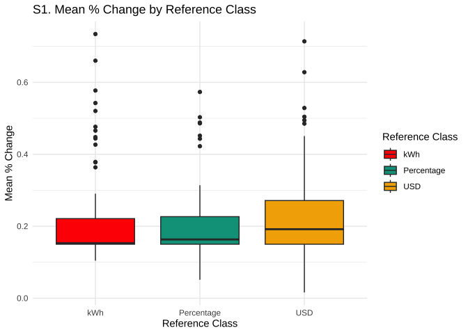

``` r
# plot mean_pct_change density
s1_agg4 |> ggplot(aes(x = mean_pct_change, fill = refClass)) +
    geom_density(alpha = 0.5) +
    labs(title = "S1. Mean % Change Density by Reference Class",
        x = "Mean % Change",
        fill = "Reference Class") +
    theme_minimal()
```

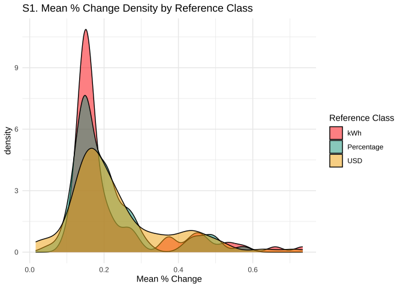

# diagnostics

``` r
ordinal_model_s1 <- brm(
    accuracy_level ~ refClass +calc + (1|id) + (1|state),
    data = s1_agg,
    family = cumulative("logit"),
    cores = 4,
    iter = 4000,
    control = list(adapt_delta = 0.98), 
    prior = c(prior(normal(0, 4), class = "Intercept"), 
                prior(normal(0, 4), class = "b")), 
    file = paste0(here::here("data/model_cache",'s1_acc3_add.rds')) 
)

plot(ordinal_model_s1, condition = "refClass")
```

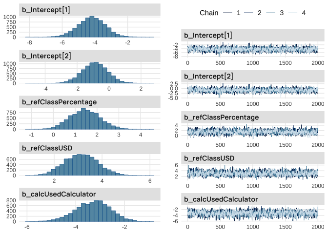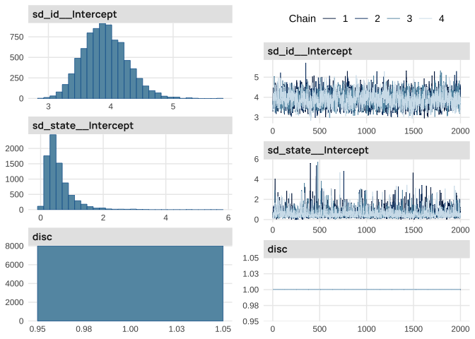

## Study2

``` r
ordinal_model_s2_logit <- brm(
  accuracy_level ~ refClass + calc+pct_goal+rounded + (1|id)+ (1|state),
  data = s2_agg,
  family = cumulative("logit"),
  cores = 4,
  iter = 3000,
  control = list(adapt_delta = 0.99), # Recommended for ordinal models
  prior = c(prior(normal(0, 2), class = "Intercept"),  # Priors for thresholds
            prior(normal(0, 2), class = "b")), # Priors for predictors
  file = paste0(here::here("data/model_cache",'s2_acc3_add.rds')) # Cache for efficiency
)
```

# diagnostics

``` r
plot(ordinal_model_s2_logit, condition = "refClass")
```

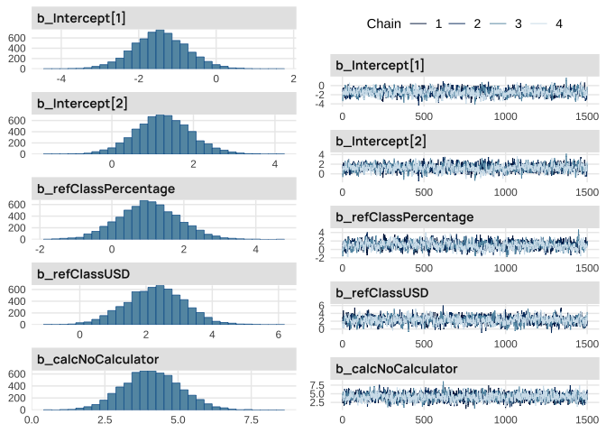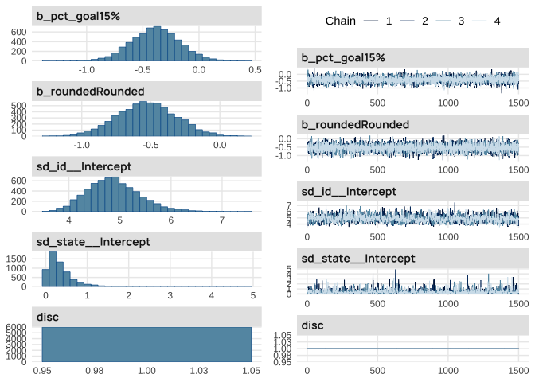

### Tables

<div id="tbl-s2-prop1">

Table 1: Study 2: The table shows the percentage of participants who
fell into each accuracy level for each reference class condition
(percentages of kWh, \$, and USD columns reflect within condition
percentages). The combined group column reflects the percentage of
participants in each accuracy level when aggregating across across all
reference class conditions.

``` r
# observed_props_s2 <- s2_agg |>
#   group_by(id,refClass, accuracy_level,calc) |>
#   summarise(n = n()) |>
#   group_by(refClass) |>
#   mutate(prop = n/sum(n)) |>
#   group_by(refClass,accuracy_level) |>
#   summarise(n = sum(n), prop = sum(prop)) |>
#   mutate(n_prop=paste0(n," (",round(prop*100,1),"%)" ), pct_grp=paste0(round(prop*100,1), "%")) |> ungroup()
# 


# compute percentage of subjects per accuracy level per group
observed_props_s2 <- s2_agg |>
  group_by(refClass, accuracy_level) |>
  summarise(n = n()) |>
  group_by(refClass) |>
  mutate(prop = n/sum(n)) |>
  mutate(n_prop=paste0(n," (",round(prop*100,1),"%)" ), pct_grp=paste0(round(prop*100,1), "%")) |> ungroup()

observed_props_s2 |> 
  mutate(n_total=sum(n)/3) |> 
  group_by(accuracy_level) |>
  mutate(ns=sum(n)/4) |> 
  mutate(Total = paste0(round(ns/n_total*100,1), "%")) |>
  select('Reference Class'=refClass, 'Accuracy Level'=accuracy_level, '% in Group'=pct_grp, "Combined Groups %" =Total) |>
  pivot_wider(
    names_from = 'Reference Class',
    values_from = c('% in Group')
  ) |> relocate("Combined Groups %" , .after=last_col()) |> 
  kable(escape=FALSE,booktabs=TRUE,align=c("l")) 
```

| Accuracy Level | kWh   | Percentage | USD   | Combined Groups % |
|:---------------|:------|:-----------|:------|:------------------|
| Exact match    | 44.1% | 27.6%      | 19.5% | 23.4%             |
| 0.01-5% error  | 14.7% | 25.4%      | 15.9% | 14.1%             |
| Over 5% error  | 41.2% | 47%        | 64.5% | 37.5%             |

</div>

<div id="tbl-s2-prop2">

Table 2: Study 2: The table shows the percentage of participants who
fell into each accuracy level for each reference class condition
(percentages of kWh, \$, and USD columns reflect within condition
percentages). The combined group column reflects the percentage of
participants in each accuracy level when aggregating across across all
reference class conditions.

``` r
# compute percentage of subjects per accuracy level per group
observed_props_s2 <- s2_agg |>
  group_by(refClass, accuracy_level) |>
  summarise(n = n()) |>
  group_by(refClass) |>
  mutate(prop = n/sum(n)) |>
  mutate(n_prop=paste0(n," (",round(prop*100,1),"%)" ), pct_grp=paste0(round(prop*100,1), "%")) |> ungroup()

observed_props_s2 |> 
  mutate(n_total=sum(n)/3) |> 
  group_by(accuracy_level) |>
  mutate(ns=sum(n)/4) |> 
  mutate(Total = paste0(round(ns/n_total*100,1), "%")) |>
  select('Reference Class'=refClass, 'Accuracy Level'=accuracy_level, '% in Group'=pct_grp, "Combined Groups %" =Total) |>
  pivot_wider(
    names_from = 'Reference Class',
    values_from = c('% in Group')
  ) |> relocate("Combined Groups %" , .after=last_col()) |> 
  kable(escape=FALSE,booktabs=TRUE,align=c("l")) 
```

| Accuracy Level | kWh   | Percentage | USD   | Combined Groups % |
|:---------------|:------|:-----------|:------|:------------------|
| Exact match    | 44.1% | 27.6%      | 19.5% | 23.4%             |
| 0.01-5% error  | 14.7% | 25.4%      | 15.9% | 14.1%             |
| Over 5% error  | 41.2% | 47%        | 64.5% | 37.5%             |

</div>

**?@tbl-s2-prop** shows that, once again, participants in the kWh
condition achieved closer alignment with the target goals (44% exact
matches), followed by Percentage (27%) and USD (18%). These percentages
are consistent with the patterns observed in Study 1, reinforcing the
conclusion that providing goals in kWh supports better accuracy.

``` r
# prop_acc_s1 <- s1_agg %>%
#     group_by(refClass, accuracy_level) %>%
#     summarise(count = n()) %>%
#     group_by(accuracy_level) |>
#     mutate(Probability = count / sum(count)) %>%
#     ungroup()


# ggplot(prop_acc_s1, aes(x = accuracy_level, y = Probability, fill = refClass)) +
#     geom_bar(stat = "identity", position = position_dodge()) +
#   scale_y_continuous(labels = scales::percent) +
#     labs(title = "S1. % of Participants within each Accuracy Bin",
#         x = "Accuracy Level",
#         y = "Percentage of Participants",
#         fill = "Reference Class") +
#     theme_minimal() 

ggplot(data = s1_agg, aes(x = refClass, fill = accuracy_level)) +
  geom_bar(position = "dodge", aes(y = (..count..)/sum(..count..))) +
  scale_y_continuous(labels = scales::percent) +
  labs(title = "Accuracy Levels by Reference Class",
       x = "Reference Class Condition",
       y = "Percentage of Participants",
       fill = "Accuracy Level") +
  theme_minimal()
```

<div id="fig-s1-plot">

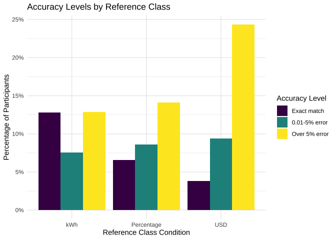

Figure 1: Study 1: Proportion of participants in each accuracy level,
colored by reference class. A larger % of participants in the Exact
Match bin indicates better performance.

</div>

``` r
ggplot(data = s2_agg, aes(x = refClass, fill = accuracy_level)) +
  geom_bar(position = "dodge", aes(y = (..count..)/sum(..count..))) +
  scale_y_continuous(labels = scales::percent) +
  facet_wrap(~rounded+pct_goal) +
  labs(title = "Accuracy Levels by Reference Class",
       x = "Reference Class Condition",
       y = "Percentage of Participants",
       fill = "Accuracy Level") +
  theme_minimal()
```

<div id="fig-s2-plot2">

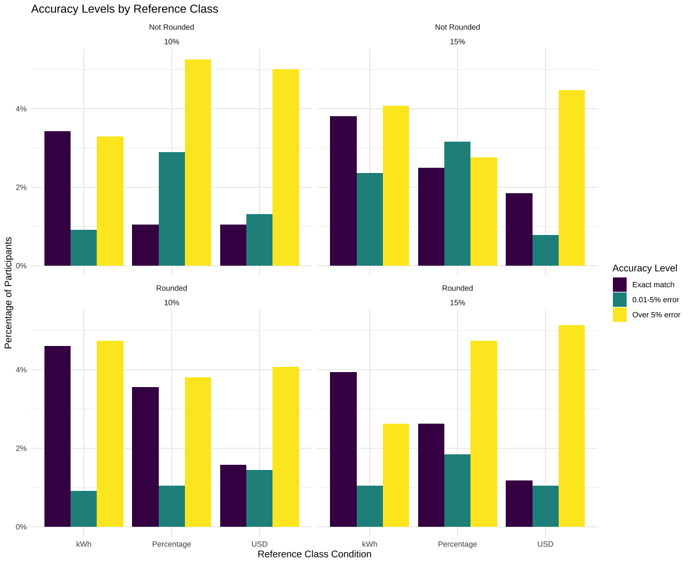

Figure 2: Experiment 2. Proportion of participants in each accuracy
level, colored by reference class, and seprated in facets based on the
levels of reduction goal, and rounding. A larger % of participants in
the Exact Match, or 0.01-2% error bins indicates better performance.

</div>

``` r
# % of entire sample 
prop_combo_s2 <- s2_agg %>%
    group_by(refClass, accuracy_level,pct_goal) %>%
    summarise(count = n()) %>%
    group_by(refClass) %>%
    mutate(Probability = count / sum(count)) %>%
    ungroup()


ggplot(prop_combo_s2, aes(x = accuracy_level, y = Probability, fill = refClass)) +
    geom_bar(stat = "identity", position = position_dodge()) +
  scale_y_continuous(labels = scales::percent) +
    labs(title = "S1. % of Participants within each Accuracy Bin",
        x = "Accuracy Level",
        y = "Percentage of Participants",
        fill = "Reference Class") +
    theme_minimal() 


# ggplot(data = s2_agg, aes(x = refClass, fill = accuracy_level)) +
#   geom_bar(position = "dodge", aes(y = (..count..)/sum(..count..))) +
#   scale_y_continuous(labels = scales::percent) +
#   labs(title = "Accuracy Levels by Reference Class",
#        x = "Reference Class Condition",
#        y = "Percentage of Participants",
#        fill = "Accuracy Level") +
#   theme_minimal()
```

<div id="fig-s2-plot">


Figure 3

</div>

### Model Tables

``` r
library(marginaleffects)
marginaleffects_by_pct <- avg_slopes(
      ordinal_model_s2_logit,
      variables = "refClass",
      by = c("pct_goal", "accuracy_level")
    )

marginaleffects_by_pct |> kable(escape=FALSE,booktabs=TRUE,align=c("l")) 
    
 #         Group     Term         Contrast pct_goal  Estimate    2.5 %  97.5 %
 # Exact match   refClass Percentage - kWh      10% -0.073089 -0.19345  0.0421
 # Exact match   refClass USD - kWh             10% -0.150377 -0.26763 -0.0324
 # 0.01-5% error refClass Percentage - kWh      10%  0.000166 -0.01468  0.0223
 # 0.01-5% error refClass USD - kWh             10% -0.018067 -0.05721  0.0100
 # Over 5% error refClass Percentage - kWh      10%  0.073590 -0.04623  0.1885
 # Over 5% error refClass USD - kWh             10%  0.171389  0.03806  0.2953
 # Exact match   refClass Percentage - kWh      15% -0.076254 -0.19838  0.0448
 # Exact match   refClass USD - kWh             15% -0.158520 -0.28022 -0.0346
 # 0.01-5% error refClass Percentage - kWh      15%  0.003111 -0.00833  0.0299
 # 0.01-5% error refClass USD - kWh             15% -0.007757 -0.04633  0.0197
 # Over 5% error refClass Percentage - kWh      15%  0.071884 -0.04499  0.1843
 # Over 5% error refClass USD - kWh             15%  0.168805  0.03638  0.2940
    
    
avg_predictions(ordinal_model_s2_logit, newdata = datagrid(id=unique,refClass=unique),by="refClass") |> kable(escape=FALSE,booktabs=TRUE,align=c("l")) 

 #         Group   refClass Estimate 2.5 % 97.5 %
 # Exact match   kWh           0.420 0.336  0.513
 # Exact match   Percentage    0.340 0.266  0.427
 # Exact match   USD           0.254 0.179  0.347
 # 0.01-5% error kWh           0.209 0.173  0.244
 # 0.01-5% error Percentage    0.213 0.182  0.247
 # 0.01-5% error USD           0.199 0.160  0.233
 # Over 5% error kWh           0.368 0.291  0.457
 # Over 5% error Percentage    0.444 0.360  0.532
 # Over 5% error USD           0.544 0.446  0.648    
 #    

ame2 <- avg_slopes(
  ordinal_model_s2_logit, 
  variables = "refClass"
)
ame2 |>  kable(escape=FALSE,booktabs=TRUE,align=c("l"))

 #         Group         Contrast  Estimate   2.5 %   97.5 %
 # Exact match   Percentage - kWh -0.072820 -0.1920  0.04245
 # Exact match   USD - kWh        -0.150425 -0.2668 -0.03252
 # 0.01-5% error Percentage - kWh  0.000449 -0.0127  0.02116
 # 0.01-5% error USD - kWh        -0.015279 -0.0524  0.00957
 # Over 5% error Percentage - kWh  0.072572 -0.0453  0.18601
 # Over 5% error USD - kWh         0.168592  0.0373  0.29260
```

``` r
me <- conditional_effects(ordinal_model_s2_logit, effects = "refClass",categorical=TRUE)
plot(me, points = TRUE)
```

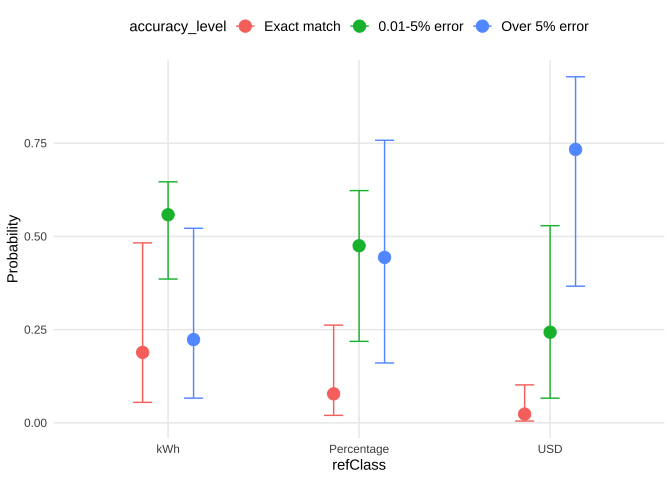

### Goal Manipulation

``` r
ggplot(s2_agg, aes(y = pct_goal, x = log_abs_error, color = calc)) +
  geom_density_ridges(aes(fill = calc), alpha = 0.2, scale = 0.5,
                      jittered_points = TRUE, point_alpha = 0.7,point_size=.4,
                      position = position_raincloud(width = 0.05, height = 0.1,
                                                    ygap = 0.05)) +
  geom_boxploth(width = 0.05, alpha = 0.2, outlier.shape = NA, show.legend = FALSE) +
  #scale_y_discrete(expand = expansion(mult = c(0.2, 0.4))) +
 # guides(fill = "none", color = guide_legend(reverse = TRUE)) +
  guides(fill = "none") +
  labs(x = "Log Absolute Deviation", y = "Reference Class", color = "") +
  theme(legend.position = "top")
```

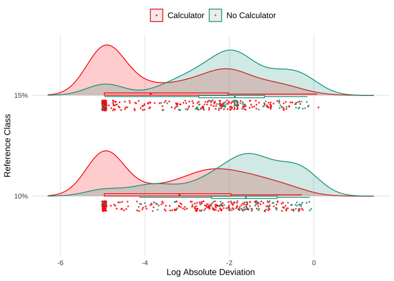

``` r
ggplot(prop_combo_s2, aes(x = accuracy_level, y = Probability, fill = pct_goal)) +
    geom_bar(stat = "identity", position = position_dodge()) +
  scale_y_continuous(labels = scales::percent) +
    labs(title = "S1. % of Participants within each Accuracy Bin",
        x = "Accuracy Level",
        y = "Percentage of Participants",
        fill = "Reference Class") +
    theme_minimal() 
```

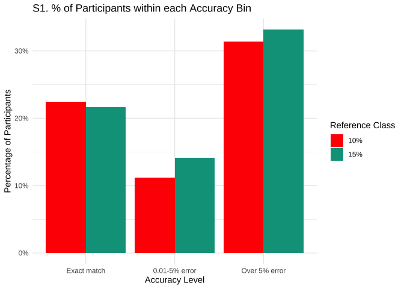

``` r
ggplot(data = s2_agg, aes(x = accuracy_level, fill = pct_goal)) +
  geom_bar(position = "dodge", aes(y = (..count..)/sum(..count..))) +
  scale_y_continuous(labels = scales::percent) +
  labs(title = "Accuracy Levels by Reference Class",
       x = "Accuracy Level",
       y = "Percentage of Participants",
       fill = "Reference Class") +
  theme_minimal()
```

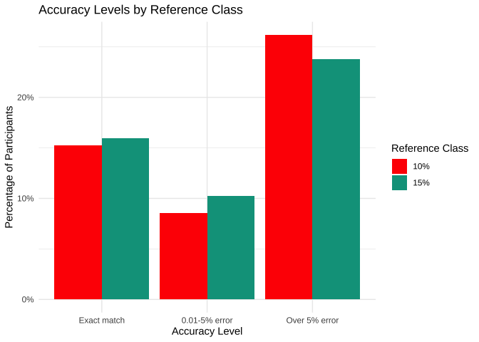

``` r
ggplot(data = s2_agg, aes(x = accuracy_level, fill = pct_goal)) +
geom_bar(position = "dodge", aes(y = (..count..)/sum(..count..))) +
scale_y_continuous(labels = scales::percent) +
facet_wrap(~refClass) +
labs(title = "Accuracy Levels by Reference Class",
      x = "Accuracy Level",
      y = "Percentage of Participants",
      fill = "Reference Class") +
theme_minimal()
```

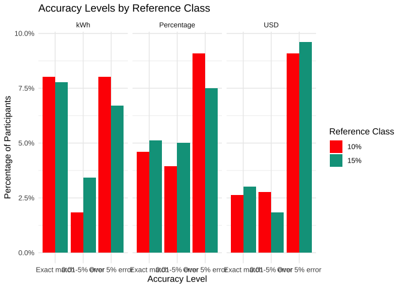

### Rounding

``` r
ggplot(s2_agg, aes(y = refClass, x = log_abs_error, color = rounded)) +
  geom_density_ridges(aes(fill = rounded), alpha = 0.2, scale = 0.5,
                      jittered_points = TRUE, point_alpha = 0.7,point_size=.4,
                      position = position_raincloud(width = 0.05, height = 0.1,
                                                    ygap = 0.05)) +
  geom_boxploth(width = 0.05, alpha = 0.2, outlier.shape = NA, show.legend = FALSE) +
  #scale_y_discrete(expand = expansion(mult = c(0.2, 0.4))) +
 # guides(fill = "none", color = guide_legend(reverse = TRUE)) +
  guides(fill = "none") +
  labs(x = "Log Absolute Deviation", y = "Reference Class", color = "") +
  theme(legend.position = "top")
```

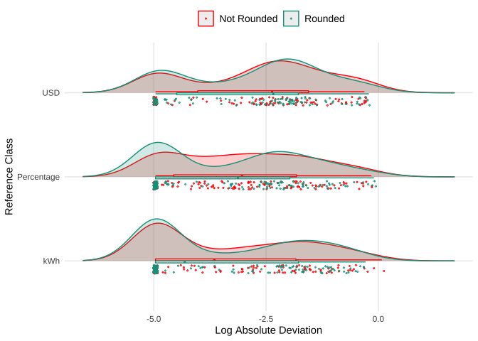

``` r
ggplot(data = s2_agg, aes(x = accuracy_level, fill = rounded)) +
geom_bar(position = "dodge", aes(y = (..count..)/sum(..count..))) +
scale_y_continuous(labels = scales::percent) +
facet_wrap(~refClass) +
labs(title = "Accuracy Levels by Reference Class",
      x = "Accuracy Level",
      y = "Percentage of Participants",
      fill = "Reference Class") +
theme_minimal()
```

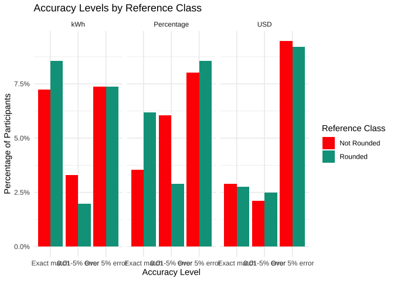

### Individual Differences

As in Experiment 1, we further investigated the role of individual
differences in energy literacy in predicting planning accuracy. A
Bayesian linear regression model, analogous to the one used in
Experiment 1 (log_abs_error ~ els + (1\|id) + (1\|state)), revealed a
significant negative relationship between energy literacy scores and
log-transformed absolute error (Estimate = -3.21, 95% CI: -3.89 to
-2.52). This finding indicates that participants with higher energy
literacy scores tended to produce more accurate plans, exhibiting
smaller deviations from the target reduction goals. The conditional
effect plot (**?@fig-s2-els**) visually confirms this relationship,
showing a clear decreasing trend in log absolute error as energy
literacy increases.

``` r
s2_agg |> group_by(id,refClass,calc,pct_goal,pct_change) |> 
    filter(plan=="plan1",rounded=="Rounded") |> 
    mutate(n_accuracy = n_distinct(accuracy_level)) |> 
    summarise(mg=sum(matched_goal),n=n(), pct=mg/n,mean_pct_change=mean(pct_change),mean_abs_error=mean(abs_error),n_accuracy=first(n_accuracy)) |>
  ungroup() |> 
  mutate(goal_pct = as.numeric(stringr::str_remove(pct_goal,"%"))/100) |>
  filter(mean_abs_error <= 0.50) |>
  mutate(id=reorder(id,pct_change)) |> 
  ggplot(aes(y=id,x=mean_pct_change,col=refClass)) + 
  geom_point(size=1,alpha=0.6,position = position_jitter(w=0, h=0.17)) +
  geom_vline(aes(xintercept=goal_pct),linetype="dashed",alpha=.5) +
  ggh4x::facet_nested_wrap(~pct_goal,axes="all",scales="free",ncol=2)  + 
  labs(y="Participant Id", x="Percent Change", title="Individual Performance") +
  theme(axis.text.y=element_text(face = "plain", size = rel(0.7))) + 
    scale_x_continuous(breaks = seq(0, 0.5, by = 0.05),
                    labels = scales::percent_format(accuracy = 1))
```

<div id="fig-s2-indv">

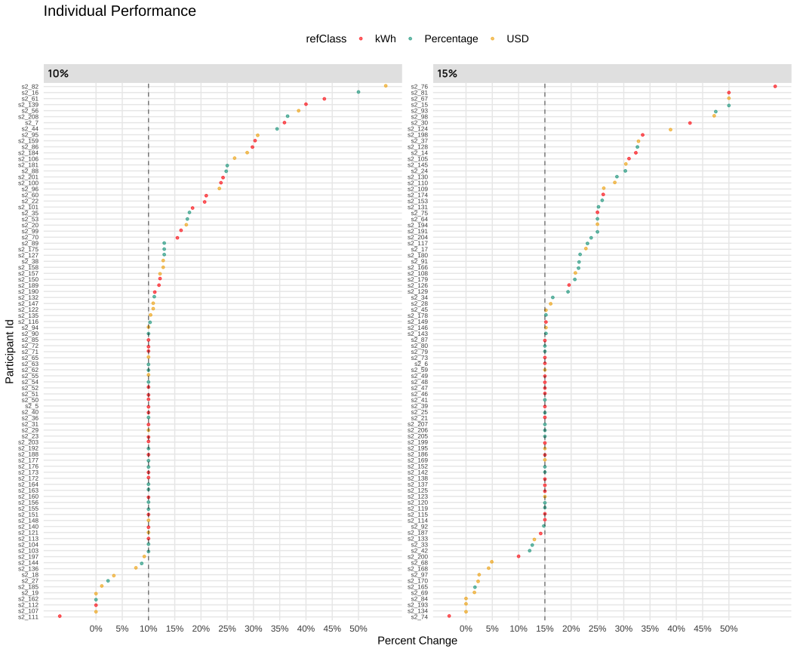

Figure 4: Study 2: Individual performance in the energy planning task,
colored by reference class. The dashed line represents the target
reduction goal. Participants are shown along the y axis, those who fall
above or below the dashed line have not met the target goal. The x-axis
represents the percent change in energy usage from the prior year.

</div>

``` r
s2_long |> filter(id %in% unique(s2_long$id)[1:30]) |> 
  filter(appliance!="TOTAL",state=="California") |> 
  ggplot(aes(x=appliance,y=value)) + geom_point(aes(shape=plan)) +
  geom_point(aes(y=state_avg),color="red") +
  geom_point(aes(y=family),color="blue") +
  theme(axis.text.x = element_text(angle = 45, hjust = 1))


s2_long |> filter(id %in% unique(s2_long$id)[1:30]) |> 
  filter(appliance!="TOTAL",state=="California") |> 
  ggplot(aes(x=appliance,y=value)) + geom_point(aes(shape=plan)) +
  geom_point(aes(y=state_avg),color="red") +
  geom_point(aes(y=family),color="blue") +
  facet_wrap(~id) + theme(axis.text.x = element_text(angle = 45, hjust = 1))
```


### Tables

### Distance plots

<div id="tbl-s2-agg">

Table 3: 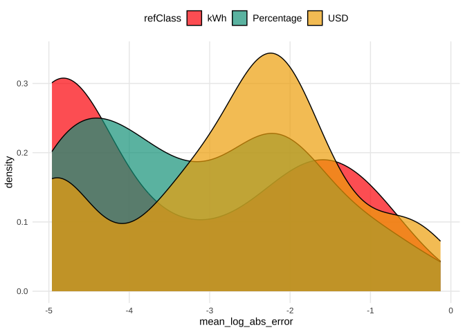

``` r
# s2_agg |> group_by(id,refClass,calc) |> 
#     mutate(n_accuracy = n_distinct(accuracy_level)) |> 
#     summarise(mg=sum(matched_goal),n=n(), pct=mg/n,mean_pct_change=mean(pct_change),
#     mean_abs_error=mean(abs_error),mean_log_abs_error=mean(log_abs_error),
#     n_accuracy=first(n_accuracy)) 

s2_agg4 %>% ggplot(aes(x=refClass,y=mean_log_abs_error,fill=refClass)) + 
  stat_summary(fun=mean, geom="bar") +
  stat_summary(fun.data=mean_cl_normal, geom="errorbar", width=0.2) +
  geom_jitter(alpha = 0.2, width = 0.2, height = 0) 
```

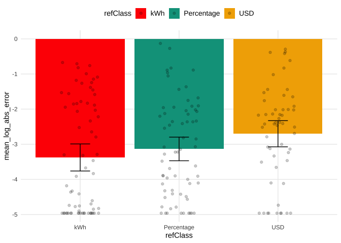

``` r
s2_agg4 |> 
  ggplot(aes(x = mean_log_abs_error,fill = refClass)) +
  geom_density(alpha = 0.7) 
```

</div>

Additional data collected included:

- **Energy Literacy Quiz**: An 8-item questionnaire assessing
  participants’ knowledge of energy consumption and conversion (DeWaters
  & Powers, 2011).
- **Calculator Usage Tracking**: Questions determined whether
  participants used a calculator, paper/pen, or other methods to
  complete the tasks.
- **Demographic Survey**: Collected information on gender, age, income,
  education, employment status, and state of residence.
- **Environmental Attitudes Survey**: Assessed participants’
  pro-environmental attitudes and perceived importance of energy
  conservation.
