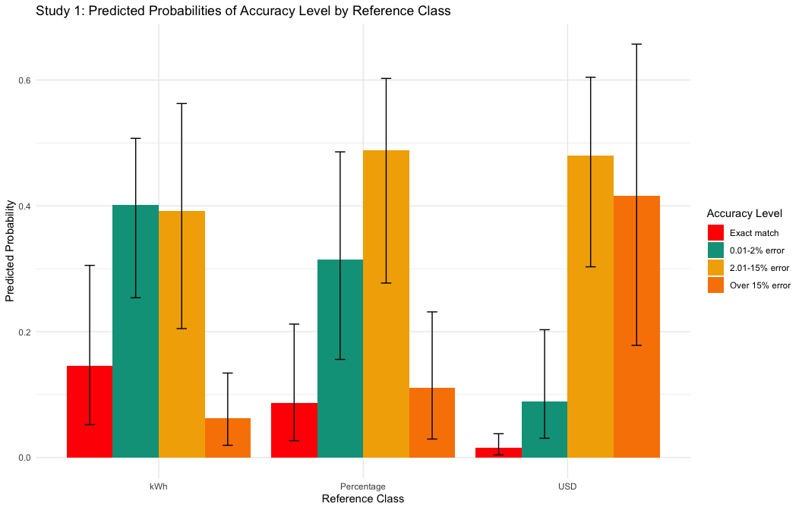
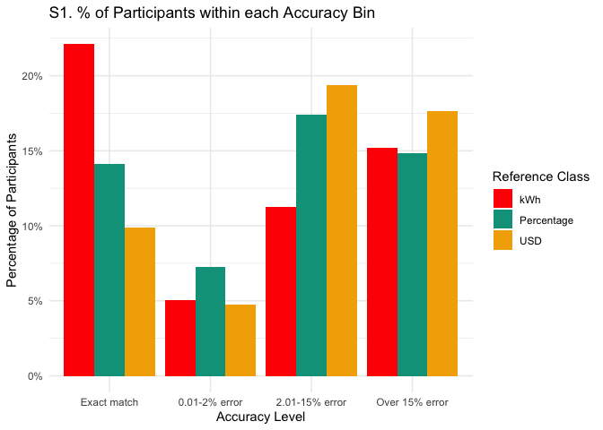
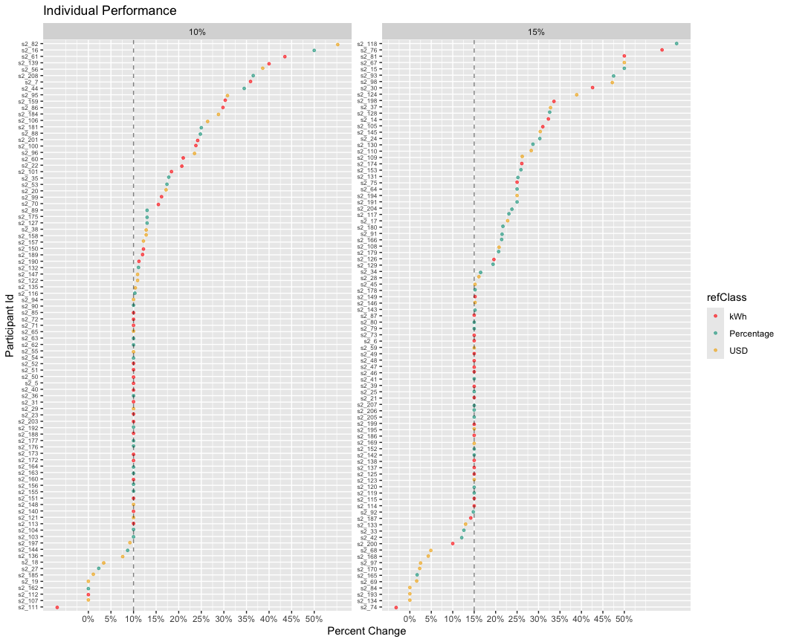
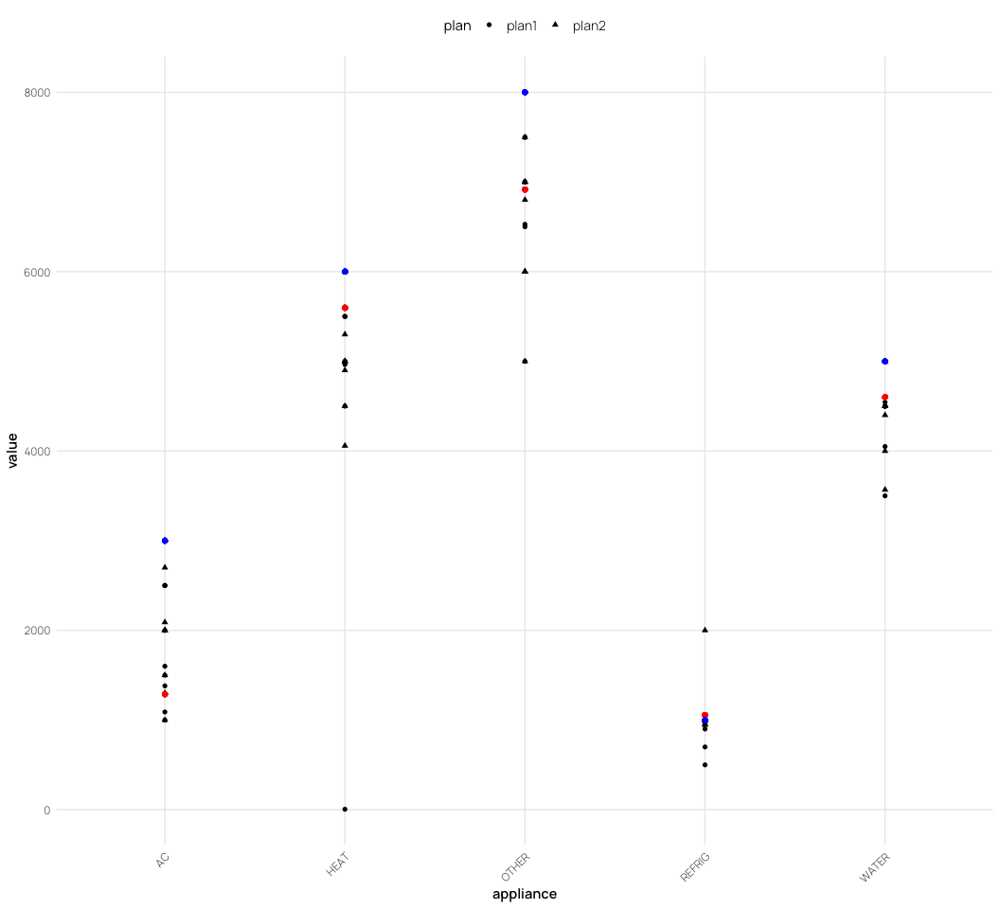
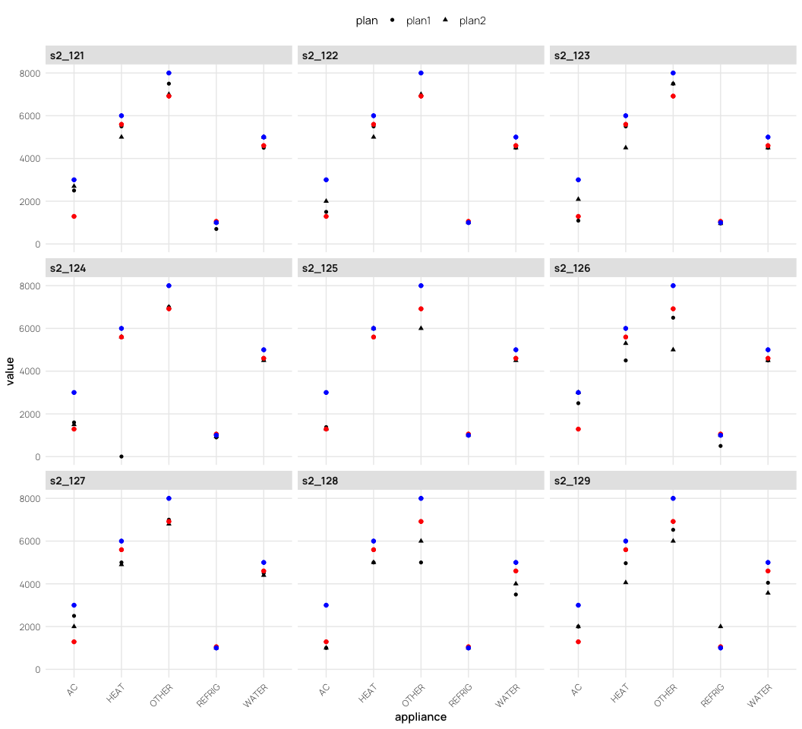

# Planning to Save Energy: How Information Format Affects Accuracy
Thomas E. Gorman, Torsten Reimer, Juan Pablo Loaiza Ramirez
2024-11-19

# Introduction

### Literature Review

Energy poverty continues to be a pervasive issue in the United States
Memmott et al. (2021) . This challenge partly arises from difficulties
in converting information across numerical formats, impeding the
development of precise energy reduction plans Reimer et al. (2015).
Prior research by Canfield et al. (2017) demonstrated that presenting
energy information in tabular formats enhances comprehension relative to
graphs.

### Hypotheses

Building on these findings and informed by prior work showing that
frequencies (like absolute units in kWh) are easier to comprehend and
facilitate more precise decision-making compared to percentages, our
study also utilizes a tabular format, but manipulates whether
participants must consider energy information presented as absolute
units (kWh), percentages (%), or monetary costs (USD). We hypothesize
that presenting information in absolute units (kWh) will lead to more
accurate household energy conservation planning.

# Experiment 1

See <a href="#fig-task" class="quarto-xref">Figure 1</a> for an example
of a planning trial as it was seen by participants.

## Methods

### Participants

We implemented our task and surveys on Qualtrics, and recruited
participants through Amazon Mechanical Turk. In Experiment 1, 252
participants were intially recruited, but data from 17 participants were
corrupted due to experimenter error, leaving a final sample of 235
participants. Most participants (76%) reported using a calculator to
complete the task.

### Materials and Design

The study employed a mixed design with reference class (kWh, percentage,
USD) as a between-subjects factor and state/family scenario as a
within-subjects factor. Each participant completed energy reduction
planning tasks for two different states, with state order
counterbalanced across participants. The family scenarios featured four
households in different climate regions: Texas (Smith family) and
California (Adams family) representing warm climates, and Colorado
(Wells family) and Massachusetts (Davis family) representing cold
climates. We obtain average utility use from each state by CITE SOURCE
FOR STATE AVGS?

### Procedure

Participants received energy usage data for two hypothetical families
and were tasked with creating action plans to meet specified reduction
goals by allocating usage across five appliance categories: heating,
cooling, water heating, refrigerator, and an other appliances (e.g., TV,
lighting).

For each family scenario, the particpipants were shown a table
containing the families utility usage from the prior year, alongside the
state averages for each appliance category (both prior year usage and
stage averages are always shown in kWh). For each scenario, participants
were asked to create two possible action plans to achieve the target
reduction in total household energy usage (see
<a href="#fig-task" class="quarto-xref">Figure 1</a>). Depending on
their reference class condition, the target reduction amount presented
either in kilowatt-hours (kWh), as percentages of total household usage,
or in U.S. dollars. In all conditions, the target reduction was
equivalent to a 15% reduction in total household kWh.

<div id="fig-task">


Figure 1: Example trial in the energy planning task. Participants are
shown the prior year electricity use of a household, and are tasked with
creating a plan for the next year that will meet the energy reduction
goal. Study 1 manipulates the format of the reduction goal to be either
a percentage (15% given as goal reduction), kilowatt hours (5965 kWh
given), or USD (\$656)

</div>

Additional data collected included:

- **Energy Literacy Quiz**: An 8-item questionnaire assessing
  participants’ knowledge of energy consumption and conversion.
- **Calculator Usage Tracking**: Questions determined whether
  participants used a calculator, paper/pen, or other methods to
  complete the tasks.
- **Demographic Survey**: Collected information on gender, age, income,
  education, employment status, and state of residence.
- **Environmental Attitudes Survey**: Assessed participants’
  pro-environmental attitudes and perceived importance of energy
  conservation.

## Results

``` r
pacman::p_load(dplyr,purrr,tidyr,stringr,here,tibble,brms,rstan,bayestestR,emmeans,tidybayes,modelsummary,ggplot2,gt,knitr,kableExtra,ggh4x,patchwork,lme4,flextable,pander)

options(digits=2, scipen=999, dplyr.summarise.inform=FALSE)
walk(c("fun_plot"), ~ source(here::here(paste0("scripts/", .x, ".R"))))
theme_set(theme_nice())

s1 <- readRDS(here::here("data/s1_processed.rds")) |> 
  filter(!(id %in% readRDS(here::here("data/s1_discrep_ids.rds")))) |> 
  mutate(refClass = factor(refClass, levels=c("kWh","Percentage","USD")))

s2_long <- readRDS(here::here("data/s2_processed.rds")) |> 
  filter(!(id %in% readRDS(here::here("data/s2_discrep_ids.rds")))) |> 
  mutate(refClass = factor(refClass, levels=c("kWh","Percentage","USD")))
```

``` r
s1_agg <- s1 |> 
    filter(appliance !="Total kWh") |> 
    group_by(id,refClass,state,block,plan,calc,edu,pct_goal) |> 
    summarise(total_kWh = sum(value),orig_kWh=sum(family), 
                pct_change = round((orig_kWh-total_kWh)/orig_kWh,3), 
                n_change = sum(value!=family),
                state_p_dif=mean(state_p_dif),
                state_f_dif=mean(state_f_dif),
                n_less_avg = sum(less_avg),
                duration=first(Duration__in_seconds_)) |> 
    mutate(matched_goal = (pct_change == pct_goal), 
                error = pct_change - pct_goal,
                abs_error = abs(error),
                close_match = abs_error <= 0.03) |>
    ungroup() |> # Add ungroup here
        mutate(
            accuracy_level = factor(
                case_when(
                    abs_error == 0.00 ~ "Exact match",
                    abs_error <= 0.02 ~ "0.01-2% error",
                    abs_error <= 0.15 ~ "2.01-15% error",
                    TRUE ~ "Over 15% error"  # Capture all remaining cases
                ), 
                levels = c("Exact match", "0.01-2% error", "2.01-15% error", "Over 15% error"),
                ordered = TRUE
            )
        ) |> relocate(accuracy_level, .after= "pct_change")


s1_agg4 <- s1_agg |> group_by(id,refClass,calc) |> 
    mutate(n_accuracy = n_distinct(accuracy_level)) |> 
    summarise(mg=sum(matched_goal),n=n(), pct=mg/n,mean_pct_change=mean(pct_change),mean_abs_error=mean(abs_error),n_accuracy=first(n_accuracy)) |> 
    mutate(accuracy_level = factor(
            case_when(
                mean_abs_error < 0.02 ~ "Exact match",
                mean_abs_error <= 0.02 ~ "0.01-2% error",
                mean_abs_error <= 0.15 ~ "2.01-15% error",
                TRUE ~ "Over 15% error"  # Capture all remaining cases
            ), 
            levels = c("Exact match", "0.01-2% error", "2.01-15% error", "Over 15% error"),
            ordered = TRUE
        ))
  
# proportion matching vs close match

# proportion matching vs close match


# overall pct of subjects who matched their goal
s1_agg4 |> group_by(refClass) |>
    summarise(
    'Avg. % meeting goal' = mean(pct),
    'Avg. Deviation From Goal' = median(mean_pct_change),
    # sd = sd(pct),
    # n = n(),
    #se=sd(pct)/sqrt(n)
) |>   mutate(across(where(is.numeric), \(x) round(x, 3))) %>% 
  kable(escape=FALSE,booktabs=TRUE,align=c("l")) 
```

| refClass   | Avg. % meeting goal | Avg. Deviation From Goal |
|:-----------|:--------------------|:-------------------------|
| kWh        | 0.38                | 0.15                     |
| Percentage | 0.22                | 0.16                     |
| USD        | 0.10                | 0.19                     |

``` r
 #pander::pandoc.table(caption="Study 1: Proportion of participants who matched their goal overall")
```

For our primary analyses of participants’ ability to create accurate
energy-saving plans, we employed an accuracy level binning approach by
categorizing responses into four distinct levels: Exact match, 0.01–2%
error, 2.01–15% error, and Over 15% error.

``` r
# compute percentage of subjects per accuracy level per group
observed_props_s1 <- s1_agg |>
  group_by(refClass, accuracy_level) |>
  summarise(n = n()) |>
  group_by(refClass) |>
  mutate(prop = n/sum(n)) |>
  mutate(n_prop=paste0(n," (",round(prop*100,1),"%)" ), pct_grp=paste0(round(prop*100,1), "%")) |> ungroup()

observed_props_s1 |> 
  mutate(n_total=sum(n)/4) |> 
  group_by(accuracy_level) |>
  mutate(ns=sum(n)/4) |> 
  mutate(Total = paste0(round(ns/n_total*100,1), "%")) |>
  select('Reference Class'=refClass, 'Accuracy Level'=accuracy_level, '% in Group'=pct_grp, "Combined Groups %" =Total) |>
  pivot_wider(
    names_from = 'Reference Class',
    values_from = c('% in Group')
  ) |> relocate("Combined Groups %" , .after=last_col()) |> 
  kable(escape=FALSE,booktabs=TRUE,align=c("l")) 
```

| Accuracy Level | kWh   | Percentage | USD   | Combined Groups % |
|:---------------|:------|:-----------|:------|:------------------|
| Exact match    | 37.5% | 22.1%      | 9.8%  | 22.6%             |
| 0.01-2% error  | 15.1% | 17.6%      | 11.2% | 14.4%             |
| 2.01-15% error | 26.3% | 41.9%      | 47.8% | 38.9%             |
| Over 15% error | 21.2% | 18.4%      | 31.2% | 24.1%             |

``` r
prop_acc_s1 <- s1_agg %>%
    group_by(refClass, accuracy_level) %>%
    summarise(count = n()) %>%
    group_by(accuracy_level) |>
    mutate(Probability = count / sum(count)) %>%
    ungroup()


ggplot(prop_acc_s1, aes(x = accuracy_level, y = Probability, fill = refClass)) +
    geom_bar(stat = "identity", position = position_dodge()) +
  scale_y_continuous(labels = scales::percent) +
    labs(title = "S1. % of Participants within each Accuracy Bin",
        x = "Accuracy Level",
        y = "Percentage of Participants",
        fill = "Reference Class") +
    theme_minimal() 
```

<div id="fig-s1-plot">


Figure 2

</div>

We analyzed planning accuracy using Bayesian ordinal regression. The
dependent variable, plan error, was computed by binning the goal
deviation into four ordered levels: exact match (0% error), minor
deviations (0.01-2% error), moderate deviations (2.01-15% error), and
major deviations (\>15% error). For each comparison, we provide
posterior odds ratios (OR) and their 95% CIs.

``` r
ordinal_model_s1 <- brm(
    accuracy_level ~ refClass + (1|id) + (1|state),
    data = s1_agg,
    family = cumulative("logit"),
    cores = 4,
    iter = 2000,
    control = list(adapt_delta = 0.99), 
    prior = c(prior(normal(0, 2), class = "Intercept"), 
                prior(normal(0, 1.5), class = "b")), 
    file = paste0(here::here("data/model_cache",'s1_ordinal3.rds')) 
)

#summary(ordinal_model_s1)


# describe_posterior(ordinal_model_s1, centrality = "Mode") |> 
#     filter(stringr::str_detect(Parameter, "b_")) |> 
#     mutate(Parameter = stringr::str_remove(Parameter, "b_")) |> 
#     mutate(across(where(is.numeric), round, 3)) |> 
#     kable(booktabs = TRUE)

# Get predicted probabilities
pred_summary <- ordinal_model_s1 |>
    epred_draws(newdata = data.frame(refClass = c("kWh", "Percentage", "USD")),
                ndraws = 1000, re_formula = NA) |>
    group_by(refClass, .category) |>
    summarise(
        mean_prob = mean(.epred),
        lower_ci = quantile(.epred, 0.025),
        upper_ci = quantile(.epred, 0.975)
    )
#pred_summary |> pander::pandoc.table(caption="Study 1: Predicted probabilities of accuracy")


# Convert log-odds to odds ratios
posterior_samples <- as.data.frame(ordinal_model_s1)
odds_ratios <- data.frame(
  Percentage_vs_kWh = exp(posterior_samples$b_refClassPercentage),
  USD_vs_kWh = exp(posterior_samples$b_refClassUSD)
)

# Calculate summary statistics
odds_ratio_summary <- data.frame(
    comparison = c("Percentage vs kWh", "USD vs kWh"),
    odds_ratio = c(mean(odds_ratios$Percentage_vs_kWh),
                    mean(odds_ratios$USD_vs_kWh)),
    ci_lower = c(quantile(odds_ratios$Percentage_vs_kWh, 0.025),
                quantile(odds_ratios$USD_vs_kWh, 0.025)),
    ci_upper = c(quantile(odds_ratios$Percentage_vs_kWh, 0.975),
                quantile(odds_ratios$USD_vs_kWh, 0.975))
)


odds_ratio_summary |> kable(escape=FALSE,booktabs=TRUE,align=c("l")) 
```

| comparison        | odds_ratio | ci_lower  | ci_upper |
|:------------------|:-----------|:----------|:---------|
| Percentage vs kWh | 2.27407    | 0.6177874 | 6.14783  |
| USD vs kWh        | 14.09463   | 4.0796697 | 38.03732 |

``` r
# |comparison        | odds_ratio| ci_lower| ci_upper|
# |:-----------------|----------:|--------:|--------:|
# |Percentage vs kWh |        2.3|     0.62|      6.2|
# |USD vs kWh        |       14.1|     4.08|     38.0|


#odds_ratio_summary |> pander::pandoc.table(caption="Study 1: Odds ratios of accuracy")
```

``` r
bayesplot::color_scheme_set(wes_palettes[1]$BottleRocket1[1:6])

# Plot predicted probabilities
ggplot(pred_summary, aes(x = refClass, y = mean_prob, fill = .category)) +
    geom_bar(stat = "identity", position = position_dodge()) +
    geom_errorbar(aes(ymin = lower_ci, ymax = upper_ci),
                    position = position_dodge(width = 0.9), width = 0.2) +
    labs(y = "Predicted Probability", x = "Reference Class", fill = "Accuracy Level") +
    ggtitle("Study 1: Predicted Probabilities of Accuracy Level by Reference Class") +
    theme_minimal()
```



``` r
#pp_check(ordinal_model_s1) + ggtitle("Study 1: Posterior Predictive Checks for Ordinal Regression Model") + theme_minimal()


pp_check(ordinal_model_s1, type = "bars_grouped", group="refClass", fatten = 2) +
    # scale_x_continuous("y", breaks = 1:7) +
    # scale_y_continuous(NULL, breaks = NULL, expand = expansion(mult = c(0, 0.05))) +
    ggtitle("Data with posterior predictions",
            subtitle = "S1. red bars are empirical data, black points are model predictions and credible intervals") +
    labs(x = "Accuracy Level: 1= exact match,   +1= 0.01-2% error, +2= 2.01-15% error, +3= Over 15% error") +
    theme_minimal()
```


``` r
    theme(legend.background = element_blank() #,legend.position = c(.9, .75)
    )
```

    List of 1
     $ legend.background: list()
      ..- attr(*, "class")= chr [1:2] "element_blank" "element"
     - attr(*, "class")= chr [1:2] "theme" "gg"
     - attr(*, "complete")= logi FALSE
     - attr(*, "validate")= logi TRUE

# Experiment 2

## Methods

The experimental procedures in study 2 are quite similar to those in
study 1, but we also included a rounding manipulation (rounded vs. not
rounded), and a manipulation of the goal (10% reduction vs. 15%
rediction). We recruited 206 participants from Amazon Mechanical Turk,
but data from from 10 participants were corrupted due to experimenter
error, leaving a final sample of 196 participants.

Note that reference class remains a between-subjects variable, while
percent goal, rounding, and state are within-subjects variables. In
study 2, the new design is a 4 state temperature (2 warm vs. 2 cold
states) X 2 task goal (10% vs. 15%) X 2 last year’s usage for the family
and the state average (exact vs. rounded numbers) within X 3 task
reference class (USD vs. Percentage vs. kWh) between.

## Results

``` r
s2_agg1 <- s2_long |> 
  filter(appliance != "TOTAL") |> 
  group_by(id,refClass,calc, state,pct,pct_goal,plan,rounded) |> 
  summarise(
    total_kWh = sum(value),
    orig_kWh = sum(family),
    pct_change = round((orig_kWh - total_kWh) / orig_kWh, 3),
    state_dif = mean(state_dif),
    .groups = "drop"
  ) |>
  mutate(matched_goal = (pct_change == pct),
                error = pct_change - pct,
                abs_error = abs(error)) |> 
      ungroup() |> # Add ungroup here
        mutate(
            accuracy_level = factor(
                case_when(
                    abs_error == 0.00 ~ "Exact match",
                    abs_error <= 0.02 ~ "0.01-2% error",
                    abs_error <= 0.15 ~ "2.01-15% error",
                    TRUE ~ "Over 15% error"  # Capture all remaining cases
                ), 
                levels = c("Exact match", "0.01-2% error", "2.01-15% error", "Over 15% error"),
                ordered = TRUE
            )
        )

s2_agg4 <- s2_agg1 |> group_by(id,refClass,calc) |> 
    mutate(n_accuracy = n_distinct(accuracy_level)) |> 
    summarise(mg=sum(matched_goal),n=n(), pct=mg/n,mean_pct_change=mean(pct_change),mean_abs_error=mean(abs_error),n_accuracy=first(n_accuracy)) |> 
    mutate(accuracy_level = factor(
            case_when(
                mean_abs_error < 0.02 ~ "Exact match",
                mean_abs_error <= 0.02 ~ "0.01-2% error",
                mean_abs_error <= 0.15 ~ "2.01-15% error",
                TRUE ~ "Over 15% error"  # Capture all remaining cases
            ), 
            levels = c("Exact match", "0.01-2% error", "2.01-15% error", "Over 15% error"),
            ordered = TRUE
        ))
  

# overall pct of subjects who matched their goal
s2_agg4 |> group_by(refClass) |>
    summarise(
    'Avg. % meeting goal' = mean(pct),
    'Avg. Deviation From Goal' = median(mean_pct_change),
    # sd = sd(pct),
    # n = n(),
    #se=sd(pct)/sqrt(n)
) |>   mutate(across(where(is.numeric), \(x) round(x, 3))) %>% 
  kable(escape=FALSE,booktabs=TRUE,align=c("l")) 
```

| refClass   | Avg. % meeting goal | Avg. Deviation From Goal |
|:-----------|:--------------------|:-------------------------|
| kWh        | 0.44                | 0.13                     |
| Percentage | 0.27                | 0.16                     |
| USD        | 0.18                | 0.17                     |

``` r
# compute percentage of subjects per accuracy level per group
observed_props_s2 <- s2_agg1 |>
  group_by(refClass, accuracy_level) |>
  summarise(n = n()) |>
  group_by(refClass) |>
  mutate(prop = n/sum(n)) |>
  mutate(n_prop=paste0(n," (",round(prop*100,1),"%)" ), pct_grp=paste0(round(prop*100,1), "%")) |> ungroup()

observed_props_s2 |> 
  mutate(n_total=sum(n)/4) |> 
  group_by(accuracy_level) |>
  mutate(ns=sum(n)/4) |> 
  mutate(Total = paste0(round(ns/n_total*100,1), "%")) |>
  select('Reference Class'=refClass, 'Accuracy Level'=accuracy_level, '% in Group'=pct_grp, "Combined Groups %" =Total) |>
  pivot_wider(
    names_from = 'Reference Class',
    values_from = c('% in Group')
  ) |> relocate("Combined Groups %" , .after=last_col()) |> 
  kable(escape=FALSE,booktabs=TRUE,align=c("l")) 
```

| Accuracy Level | kWh   | Percentage | USD   | Combined Groups % |
|:---------------|:------|:-----------|:------|:------------------|
| Exact match    | 43.5% | 26.8%      | 18.5% | 30.2%             |
| 0.01-2% error  | 8%    | 13.8%      | 9.1%  | 10.3%             |
| 2.01-15% error | 21%   | 33.3%      | 38.4% | 30.5%             |
| Over 15% error | 27.5% | 26.1%      | 34.1% | 29%               |

``` r
# % of entire sample 
prop_combo_s2 <- s2_agg1 %>%
    group_by(refClass, accuracy_level) %>%
    summarise(count = n()) %>%
    group_by(refClass) %>%
    mutate(Probability = count / sum(count)) %>%
    ungroup()


ggplot(prop_combo_s2, aes(x = accuracy_level, y = Probability, fill = refClass)) +
    geom_bar(stat = "identity", position = position_dodge()) +
  scale_y_continuous(labels = scales::percent) +
    labs(title = "S1. % of Participants within each Accuracy Bin",
        x = "Accuracy Level",
        y = "Percentage of Participants",
        fill = "Reference Class") +
    theme_minimal() 
```

<div id="fig-s2-plot">



Figure 3

</div>

``` r
# % of entire sample 
prop_combo_s2_full <- s2_agg1 %>%
    group_by(refClass, accuracy_level, pct_goal,rounded) %>%
    summarise(count = n()) %>%
    group_by(refClass) %>%
    mutate(Probability = count / sum(count)) %>%
    ungroup()


ggplot(prop_combo_s2_full, aes(x = accuracy_level, y = Probability, fill = refClass)) +
    geom_bar(stat = "identity", position = position_dodge()) +
  scale_y_continuous(labels = scales::percent) +
    labs(title = "S1. % of Participants within each Accuracy Bin",
        x = "Accuracy Level",
        y = "Percentage of Participants",
        fill = "Reference Class") +
    facet_wrap(~pct_goal*rounded) +
    theme_minimal() 
```

<div id="fig-s2-plot2">


Figure 4

</div>

### Individual Differences

``` r
s2_agg1 |> group_by(id,refClass,calc,pct_goal,pct_change) |> 
    filter(plan=="plan1",rounded=="Rounded") |> 
    mutate(n_accuracy = n_distinct(accuracy_level)) |> 
    summarise(mg=sum(matched_goal),n=n(), pct=mg/n,mean_pct_change=mean(pct_change),mean_abs_error=mean(abs_error),n_accuracy=first(n_accuracy)) |>
  ungroup() |> 
  mutate(goal_pct = as.numeric(stringr::str_remove(pct_goal,"%"))/100) |>
  filter(mean_abs_error <= 0.50) |>
  mutate(id=reorder(id,pct_change)) |> 
  ggplot(aes(y=id,x=mean_pct_change,col=refClass)) + 
  geom_point(size=1,alpha=0.6,position = position_jitter(w=0, h=0.17)) +
  geom_vline(aes(xintercept=goal_pct),linetype="dashed",alpha=.5) +
  ggh4x::facet_nested_wrap(~pct_goal,axes="all",scales="free",ncol=2)  + 
  labs(y="Participant Id", x="Percent Change", title="Individual Performance") +
  theme(axis.text.y = element_text(family = "Manrope Light", face = "plain", size = rel(0.7))) + 
    scale_x_continuous(breaks = seq(0, 0.5, by = 0.05),
                    labels = scales::percent_format(accuracy = 1))
```

<div id="fig-s2-indv">



Figure 5

</div>

``` r
s2_long |> filter(id %in% unique(s2_long$id)[1:30]) |> 
  filter(appliance!="TOTAL",state=="California") |> 
  ggplot(aes(x=appliance,y=value)) + geom_point(aes(shape=plan)) +
  geom_point(aes(y=state_avg),color="red") +
  geom_point(aes(y=family),color="blue") +
  theme(axis.text.x = element_text(angle = 45, hjust = 1))

#| 
s2_long |> filter(id %in% unique(s2_long$id)[1:30]) |> 
  filter(appliance!="TOTAL",state=="California") |> 
  ggplot(aes(x=appliance,y=value)) + geom_point(aes(shape=plan)) +
  geom_point(aes(y=state_avg),color="red") +
  geom_point(aes(y=family),color="blue") +
  facet_wrap(~id) + theme(axis.text.x = element_text(angle = 45, hjust = 1))
```

<div id="fig-s2-indv2-1">



Figure 6

</div>

<div id="fig-s2-indv2-2">



Figure 7

</div>

# Discusion

# References

<div id="refs" class="references csl-bib-body hanging-indent"
entry-spacing="0" line-spacing="2">

<div id="ref-canfieldPerceptionsElectricityuseCommunications2017"
class="csl-entry">

Canfield, C., Bruine De Bruin, W., & Wong-Parodi, G. (2017). Perceptions
of electricity-use communications: Effects of information, format, and
individual differences. *Journal of Risk Research*, *20*(9), 1132–1153.
<https://doi.org/10.1080/13669877.2015.1121909>

</div>

<div id="ref-memmottSociodemographicDisparitiesEnergy2021"
class="csl-entry">

Memmott, T., Carley, S., Graff, M., & Konisky, D. M. (2021).
Sociodemographic disparities in energy insecurity among low-income
households before and during the COVID-19 pandemic. *Nature Energy*,
*6*(2), 186–193. <https://doi.org/10.1038/s41560-020-00763-9>

</div>

<div id="ref-reimerNumericCommunicationRisk2015" class="csl-entry">

Reimer, T., Jones, C., & Skubisz, C. (2015). Numeric Communication of
Risk. In *The SAGE handbook of risk communication* (pp. 167–179).

</div>

</div>
