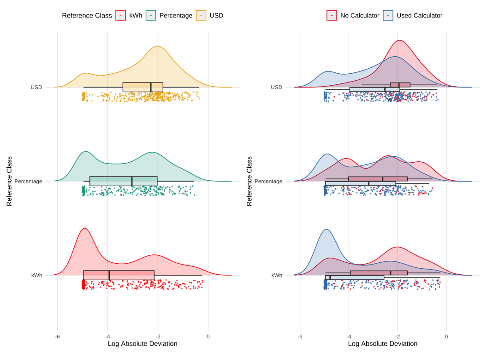
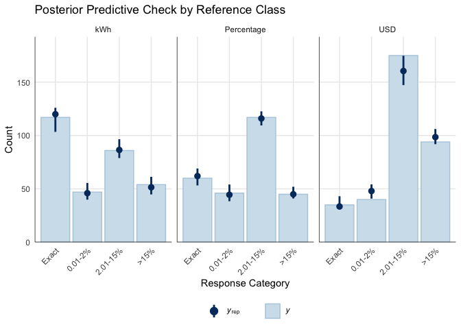
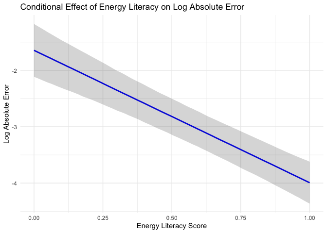
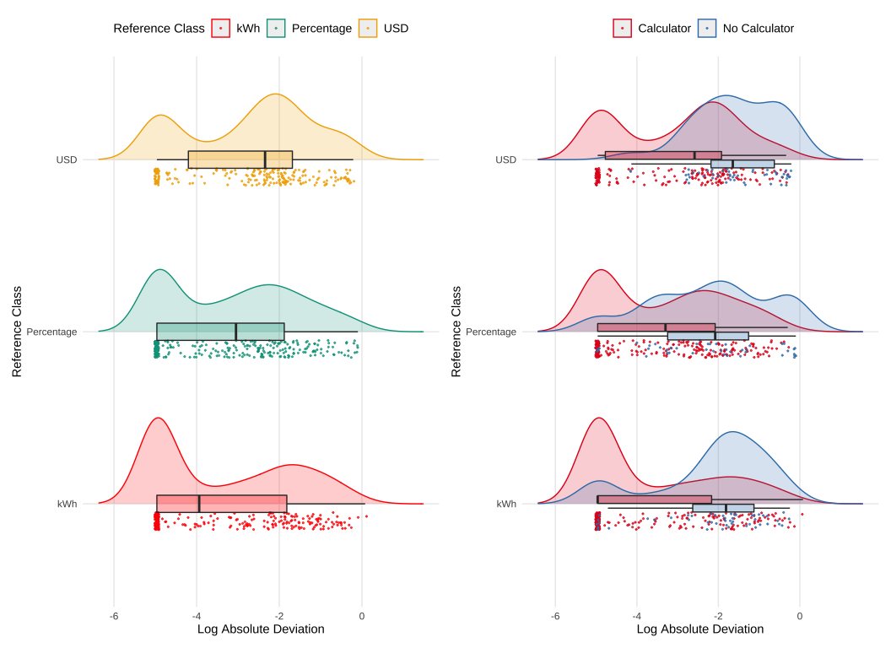
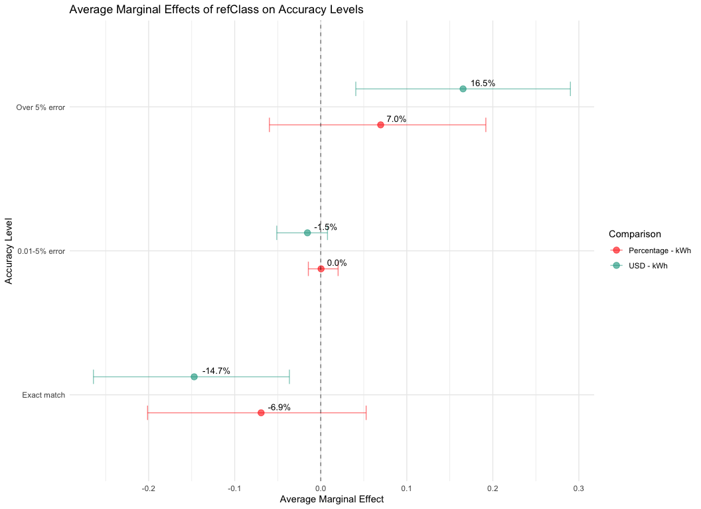
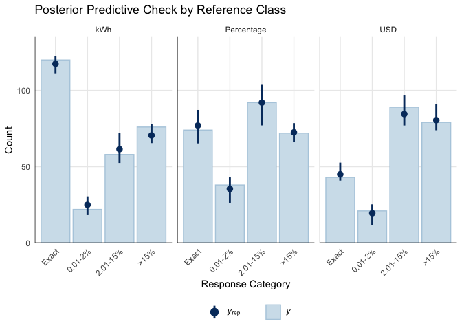
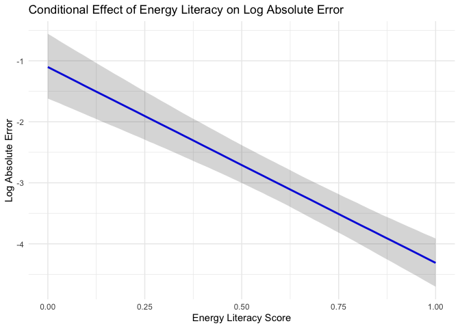

# Planning to Save Energy: How Information Format Affects Accuracy
Thomas E. Gorman, Torsten Reimer, Juan Pablo Loaiza Ramirez, Hayden
Barber
2025-03-31

# Introduction

Energy insecurity has emerged as a critical public health concern,
especially among low-income households, who frequently face difficult
choices between paying energy bills and meeting other essential needs
(Bednar & Reames, 2020; Memmott et al., 2021). Such households often
experience unsafe coping strategies (e.g., foregoing heating during
winter months), which disproportionately burden at-risk populations and
heighten risks of utility disconnection (Memmott et al., 2021).
Moreover, residential energy use contributes to climate change,
intensifying the urgency for sustainable solutions (Farghali et al.,
2023).

Given the relevance of promoting behavior change to reduce energy
consumption, numerous research efforts have focused on identifying
determinants of energy behavior and designing interventions to
effectively reduce consumption. Interventions providing tailored energy
use information and feedback, often coupled with specific energy-saving
goals, have shown promise in achieving measurable reductions in
consumption and improving related knowledge, as exemplified by findings
from Abrahamse et al. (2007) where households receiving such
interventions decreased direct energy use significantly more than
controls.

However, the success of such interventions may hinge on how effectively
energy information is communicated, with format and presentation context
significantly influencing understanding and action (Canfield et al.,
2017; Fischer, 2008). Consequently, the present study investigates
whether presenting energy reduction goals in different numerical
representations (e.g., absolute units vs. relative percentages
vs. monetary values) systematically influences the accuracy with which
consumers can develop corresponding conservation plans.

### Representation Formats

Although many residents voice concern about energy use, their factual
understanding and day‑to‑day behaviors often lag behind that concern, a
misalignment documented by DeWaters & Powers (2011). This
knowledge‑action gap highlights the practical need to present utility
information in ways that help consumers convert abstract goals into
concrete plans. Addressing the role of information presentation in this
context, Canfield et al. (2017) presented participants with hypothetical
electricity bills containing various data (e.g., historical usage,
neighbor comparisons, appliance breakdowns) across different formats
(tables, bar graphs, icon graphs). Their results showed that tables
tended to be the most comprehensible format for evaluating energy use
information, and that historical electricity use details prompted the
highest intentions for energy savings, irrespective of format.
Furthermore, Canfield et al. (2017) found that higher energy literacy
consistently correlated with better understanding of energy-related
information across all representation types.

Although many individuals express a desire to conserve energy, research
consistently shows that abstract goals (e.g., “reduce overall usage by
15%”) often fail to translate into effective behavior change unless
accompanied by specific, actionable steps (Abrahamse et al., 2005;
Nemati & Penn, 2020). For instance, Abrahamse et al. (2005) demonstrated
that merely providing general information about energy savings rarely
alters consumption patterns unless consumers also receive concrete
instructions or tailored feedback.

Similarly, Tonke (2024) reported that sending households brief but
precise text messages outlining how to reduce water use (e.g., limiting
irrigation times, adjusting washing machine settings) yielded meaningful
decreases in consumption, underscoring the importance of procedural
knowledge, namely, knowing how to operationalize a goal rather than
simply why it is desirable. In the context of energy conservation, this
implies that interventions should not only highlight potential
reductions (such as a 15% target) but also guide residents in allocating
those reductions across specific appliances or behaviors (Attari et al.,
2010). Additionally, meta-analytic findings suggest that people respond
more robustly to household-level feedback that situates their usage
within a personalized framework, thereby reducing the cognitive burden
of determining next steps (Nemati & Penn, 2020).

How information is numerically framed shapes comprehension and
subsequent choices. Of particular relevance are reference class effects,
which occur when numerical statements are presented without a clear or
intuitive basis for comparison, making it difficult to infer meaningful
quantities (Gigerenzer & Edwards, 2003; Reimer et al., 2015). A large
body of prior research suggests that presenting data in terms of
absolute counts or frequencies, as opposed to probabilities or
percentages, can promote more accurate comprehension and facilitate
decision making. However, it is important to note that even intuitive
formats can pose challenges. For instance, Weber et al. (2018) found
that individuals often struggle with reasoning tasks presented in
natural frequencies because they inadvertently revert to more complex
probabilistic thinking.

Unit selection and display format can also influence energy decisions.
For instance, tables are generally more effective than graphs for
conveying specific electricity usage data because they facilitate
straightforward point reading (Canfield et al., 2017). Furthermore, the
framing of energy costs, such as displaying monthly rather than daily or
yearly expenses, can significantly affect consumers’ choices (Gill et
al., 2022). Because kilowatt‑hours (kWh) constitute a linear,
appliance‑level metric, they can streamline arithmetic and facilitate
cross‑appliance comparison. In contrast, many consumers have a
preference for receiving energy feedback in terms of monetary values
over scientific units (Karjalainen, 2011; Nemati & Penn, 2020), as well
as better long-term appliance selection with information presented in
monetary terms (Blasch et al., 2019). However, it remains uncertain how
these reported benefits might generalize to the more complex task of
household energy planning, where usage patterns are multifaceted and
subject to a variety of contextual influences.

### Overview of Current Research

While prior studies have examined communication strategies and format
effects related to energy use, the specific question of how different
numerical representations impact consumers’ ability to formulate precise
energy conservation plans remains largely unexplored. A particular gap
exists in understanding whether presenting energy-saving goals using
absolute units (kWh), relative percentages, or derived monetary values
(USD) influences the accuracy of planning appliance-specific reductions.
The present research directly confronts this issue, investigating how
these distinct information formats (kWh, percentage, and USD) affect the
accuracy of energy-planning decisions. Through manipulation of the
presentation format, this study seeks to clarify the relationship
between representational choices and planning precision. Drawing upon
the reviewed literature, we hypothesized that: 1) Presenting energy
reduction goals in absolute units (kWh) will lead to greater planning
accuracy compared to percentage-based or monetary formats, as absolute
units provide a more direct and less ambiguous representation of energy
quantities. 2) Higher energy literacy will be associated with more
accurate planning, as individuals with greater energy knowledge may be
better equipped to process and utilize the provided information,
regardless of format. We also examined the potential of several
exploratory variables, such as goal difficulty and the rounding of
numerical values, to further elucidate the factors that influence
planning accuracy.

# Experiment 1

See <a href="#fig-task" class="quarto-xref">Figure 1</a> for an example
of a planning trial as it was seen by participants.

## Methods

### Participants

We implemented our task and surveys on Qualtrics, and recruited
participants through Amazon Mechanical Turk. In Experiment 1, 235
participants were initially recruited. Data from six participants were
excluded due to unusually large error magnitudes (error magnitudes
exceeding 2.5 standard deviations from the group mean), resulting in a
final sample of 229 participants (136 males, 92 females, 1 participant
not specified). The average age of participants was 34.3 years (SD =
10.2). Most participants (76%) reported using a calculator to complete
the task.

### Materials and Design

The study employed a mixed design with reference class (kWh, percentage,
USD) as a between-subjects factor and state/family scenario as a
within-subjects factor. Each participant completed energy reduction
planning tasks for two different states (i.e., family scenarios), with
state order counterbalanced across participants. The family scenarios
themselves depicted four households situated in different climate
regions: Texas (Smith family) and California (Adams family), chosen as
exemplars of warmer climates, and Colorado (Wells family) and
Massachusetts (Davis family), selected to represent colder climates.
Importantly, the state-average energy consumption figures presented
alongside each family’s specific usage data were carefully constructed
based upon information sourced from U.S. Energy Information
Administration (EIA) surveys; this approach was adopted specifically to
ensure the inclusion of comparative data reflecting a diverse range of
climatic conditions, encompassing both typically hotter and colder
states. Participants also completed an 8-item questionnaire assessing
their knowledge of energy consumption and conversion (DeWaters & Powers,
2011), and a question indicating whether they used a calculator for the
task.

### Procedure

Participants were provided with energy usage data for two hypothetical
families and tasked with creating action plans to meet specified energy
reduction goals. Participants were informed at the start of the study
that they would be presented with tables of detailed energy usage data
for each family, and that they would have to create two action plans for
each of the families. Each action plan goal was implemented by
allocating usage across five appliance categories: heating, cooling,
water heating, refrigerator, and other appliances (e.g., TV, lighting,
washer/dryer). For each family scenario, participants were shown a table
containing the family’s utility usage from the prior year, alongside the
state averages for each appliance category (see
<a href="#fig-task" class="quarto-xref">Figure 1</a>). For each
scenario, participants were asked to create two possible action plans to
achieve the target reduction in total household energy usage . Depending
on their reference class condition, the target reduction amount was
presented either in kilowatt-hours (kWh), as a percentage of total
household usage, or in U.S. dollars. In all conditions, the target
reduction was equivalent to a 15% reduction in total household kWh. For
example, participants assigned to the Wells family scenario (Colorado),
as depicted in Figure 1, were asked to achieve a reduction of 5,965 kWh
in the kWh condition, 15% in the Percentage condition, or \$656 in the
USD condition, all representing the same underlying 15% energy reduction
target for that specific household.

<div id="fig-task">


Figure 1: Example energy planning task trial

</div>

## Results

All preprocessing and analyses were carried out in `R` version 4.4.3
(Team, 2020) and the Tidyverse package (Wickham et al., 2019). Mixed
Bayesian regressions were fit using the `brms` package (Bürkner, 2017),
with participants and family scenario set as random effects.

``` r
pacman::p_load(dplyr,purrr,tidyr,stringr,here,tibble,brms,rstan,bayestestR,emmeans,tidybayes,
    ggplot2,gt,knitr,kableExtra,ggh4x,patchwork, ggridges,ggstance,lme4,flextable,pander,marginaleffects)

options(digits=2, scipen=999, dplyr.summarise.inform=FALSE)

walk(c("fun_plot"), ~ source(here::here(paste0("scripts/", .x, ".R"))))

theme_set(theme_nice())

s1 <- readRDS(here::here("data/s1_processed.rds")) |> 
  filter(!(id %in% readRDS(here::here("data/s1_discrep_ids.rds")))) |> 
  filter(!(id %in% readRDS(here::here("data/s1_grp_outlier_ids.rds")))) |>
  mutate(refClass = factor(refClass, levels=c("kWh","Percentage","USD")))

s2_long <- readRDS(here::here("data/s2_processed.rds")) |> 
  filter(!(id %in% readRDS(here::here("data/s2_discrep_ids.rds")))) |> 
  filter(!(id %in% readRDS(here::here("data/s2_grp_outlier_ids.rds"))) ) |>
  mutate(refClass = factor(refClass, levels=c("kWh","Percentage","USD")))
```

``` r
s1_agg <- s1 |> 
    filter(appliance !="Total kWh") |> 
    group_by(id,refClass,state,block,plan,edu,pct_goal,calc) |> 
    summarise(total_kWh = sum(value),orig_kWh=sum(family), 
                pct_change = abs(round((orig_kWh-total_kWh)/orig_kWh,3)), 
                n_change = sum(value!=family),
                state_p_dif=mean(state_p_dif),
                state_f_dif=mean(state_f_dif),
                n_less_avg = sum(less_avg),
                duration=first(duration), .groups = 'drop') |> 
    mutate(matched_goal = (pct_change == pct_goal), 
                error = pct_change - pct_goal,
                abs_error = abs(error),
                log_abs_error=log(abs(error)+.007), 
                close_match = abs_error <= 0.02) |>
        mutate(
            accuracy_level = factor(
                case_when(
                    abs_error == 0.00 ~ "Exact match",
                    abs_error <= 0.05 ~ "0.01-5% error",
                    TRUE ~ "Over 5% error" 
                ), 
                levels = c("Exact match", "0.01-5% error", "Over 5% error"),
                ordered = TRUE
            )
        ) |> relocate(accuracy_level, .after= "pct_change")

s1_agg4 <- s1_agg |> group_by(id,refClass,calc) |> 
    mutate(n_accuracy = n_distinct(accuracy_level)) |> 
    summarise(
    mg=sum(matched_goal),
    mgc=sum(close_match),
    n=n(), 
    pct=mg/n,
    pct_close=mgc/n,
    mean_pct_change=mean(pct_change),
    mean_abs_error=mean(abs_error),
    mean_log_abs_error=mean(log_abs_error)) |> 
    mutate(accuracy_level = factor(
            case_when(
                mean_abs_error < 0.02 ~ "Exact match",
                mean_abs_error <= 0.05 ~ "0.01-5% error",
                TRUE ~ "Over 5% error" 
            ), 
            levels = c("Exact match", ".01-5% error", "Over 5% error"),
            ordered = TRUE
        ))
```

``` r
##| label: tbl-s1-agg
##| tbl-cap: "Study 1: Summary of planning accuracy by reference class. The table shows performance as both the % of trials where participants matched the goal, and the mean absolute error from the target reduction goal."

summary_table <- s1_agg4 |>
    group_by(`Reference Class` = refClass) |>
    summarise(
        N = n(),
        # Keep Mean (SD) for average change proportion
        #`Avg. % Change` = sprintf("%.2f (%.2f)", mean(mean_pct_change), sd(mean_pct_change)),
        # Calculate Mean (SD) for percentages, multiply by 100, format as whole number
        `Exact Match Rate(%)` = sprintf("%.0f (%.0f)", mean(pct) * 100, sd(pct) * 100),
        `Close Match Rate(%)` = sprintf("%.0f (%.0f)", mean(pct_close) * 100, sd(pct_close) * 100),
        # Calculate Median [IQR] for deviations, adjust decimals as needed
        `Abs. Deviation` = sprintf("%.3f (%.3f)", median(mean_abs_error), IQR(mean_abs_error)),
        `Log Abs. Deviation` = sprintf("%.2f (%.2f)", median(mean_log_abs_error), IQR(mean_log_abs_error))
    ) |>
    # Apply kable formatting (optional, depends on your workflow)
    knitr::kable(escape = FALSE, booktabs = TRUE, align = c("l"))


#summary_table
```

<div id="tbl-s1-agg">

Table 1: Study 1: Summary of planning accuracy by reference class

| Reference Class | N | Exact Match Rate(%) | Close Match Rate(%) | Abs. Deviation | Log Abs. Deviation |
|:---|:---|:---|:---|:---|:---|
| kWh | 76 | 38 (45) | 54 (45) | 0.029 (0.117) | -3.69 (2.79) |
| Percentage | 67 | 22 (37) | 40 (41) | 0.056 (0.104) | -3.10 (1.87) |
| USD | 86 | 10 (28) | 22 (33) | 0.095 (0.094) | -2.40 (1.09) |

</div>

The summary statistics in
<a href="#tbl-s1-agg" class="quarto-xref">Table 1</a> suggest
descriptive differences in planning accuracy across reference class
conditions, with the kWh condition yielding the highest rates of exact
matches, and lowest absolute deviations from the target reduction goal.
However, use of these performance metrics to compare conditions is
complicated by the non-normality of their distributions. Specifically,
the substantial standard deviations associated with the match rates in
<a href="#tbl-s1-agg" class="quarto-xref">Table 1</a>, coupled with the
visual evidence presented in
<a href="#fig-s1-log-dist" class="quarto-xref">Figure 2</a>, highlight
the skewed, and potentially bimodal distribution of the underlying
planning errors.

In light of these distributional characteristics, we elected to bin
planning performance into ordered accuracy levels (as shown in
<a href="#tbl-s1-prop" class="quarto-xref">Table 2</a>). Consequently,
we binned individual trial outcomes into three distinct, ordered
categories: “Exact match” (0% absolute error), “0.01-5% error” (minor
deviations), and “Over 5% error” (larger deviations). This binned
`accuracy_level` variable subsequently served as the dependent measure
in our primary inferential analyses examining the impact of reference
class on planning accuracy

``` r
s1_ld <- ggplot(s1_agg, aes(y = refClass, x = log_abs_error, fill = refClass)) +
  geom_density_ridges(aes(col = refClass), alpha = 0.2, scale = 0.5,
                      jittered_points = TRUE, point_alpha = 0.7,point_size=.4,
                      position = position_raincloud(width = 0.05, height = 0.1,
                                                    ygap = 0.05)) +
  geom_boxploth(width = 0.1, alpha = 0.2, outlier.shape = NA, show.legend = FALSE) +
  #scale_y_discrete(expand = expansion(mult = c(0.2, 0.4))) +
 # guides(fill = "none", color = guide_legend(reverse = TRUE)) +
  guides(fill = "none") +
  labs(x = "Log Absolute Deviation", y = "Reference Class", color = "Reference Class") +
  theme(legend.position = "top")


s1_ldc <- ggplot(s1_agg, aes(y = refClass, x = log_abs_error, fill = calc)) +
  geom_density_ridges(aes(col = calc), alpha = 0.2, scale = 0.5,
                      jittered_points = TRUE, point_alpha = 0.7, point_size = .4,
                      position = position_raincloud(width = 0.05, height = 0.1,
                                                    ygap = 0.05)) +
  geom_boxploth(width = 0.1, alpha = 0.2, outlier.shape = NA, show.legend = FALSE) +
  scale_color_brewer(palette = "Set1") +
  scale_fill_brewer(palette = "Set1") +
  guides(fill = "none") +
  labs(x = "Log Absolute Deviation", y = "Reference Class", color = "") +
  theme(legend.position = "top")

s1_ld | s1_ldc
```

<div id="fig-s1-log-dist">



Figure 2: Experiment 1: Planning Error Distributions

</div>

<div id="tbl-s1-prop">

Table 2: Experiment 1: Categorization of Participants according to
Accuracy Levels

``` r
# The combined group column reflects the percentage of participants in each accuracy level when aggregating across across all reference class conditions.

# compute percentage of subjects per accuracy level per group
observed_props_s1 <- s1_agg |>
  group_by(refClass, accuracy_level) |>
  summarise(n = n()) |>
  group_by(refClass) |>
  mutate(prop = n/sum(n)) |>
  mutate(n_prop=paste0(n," (",round(prop*100,1),"%)" ), pct_grp=paste0(round(prop*100,1), "%")) |> ungroup()

observed_props_s1 |> 
  mutate(n_total=sum(n)/4) |> 
  group_by(accuracy_level) |>
  mutate(ns=sum(n)/4) |> 
  mutate(Total = paste0(round(ns/n_total*100,1), "%")) |>
  select('Reference Class'=refClass, 'Accuracy Level'=accuracy_level, '% in Group'=pct_grp) |> #, "Combined Groups %" =Total) |>
  pivot_wider(
    names_from = 'Reference Class',
    values_from = c('% in Group')
  ) |> #relocate("Combined Groups %" , .after=last_col()) |> 
  kable(escape=FALSE,booktabs=TRUE,align=c("l")) 
```

| Accuracy Level | kWh   | Percentage | USD   |
|:---------------|:------|:-----------|:------|
| Exact match    | 38.5% | 22.4%      | 10.2% |
| 0.01-5% error  | 22.7% | 29.5%      | 25%   |
| Over 5% error  | 38.8% | 48.1%      | 64.8% |

</div>



Group comparisons were conducted with Bayesian ordinal regression
(Bürkner & Vuorre, 2019; Kruschke, 2014). We modeled the ordered
accuracy outcome as a function of the reference class condition, while
controlling for random variation across participants and family
scenarios (<a href="#eq-e1" class="quarto-xref">Equation 1</a>).

<span id="eq-e1">$$
\text{Accuracy Level} \sim \text{Reference Class} + \text{Calculator} + (1|\text{id}) + (1|\text{Family Scenario})
 \qquad(1)$$</span>

This approach allows the estimation of threshold parameters and
regression coefficients that characterize how changes in predictor
variables (such as the reference class: kWh, percentage, or USD) relate
to probabilities of being in each accuracy category. We used a
cumulative logit link function to model the ordered accuracy outcome,
and we specified weakly informative priors (Kruschke, 2014) for the
regression coefficients (normal distributions with mean 0 and standard
deviation of 1) and for the cutpoints (normal distributions with a mean
of zero and a standard deviation of 4.0). The approach can be used to
estimate threshold parameters and regression coefficients that
characterize how changes in predictor variables (such as the reference
class: kWh, percentage, or USD) relate to probabilities of being in each
level of accuracy (0% absolute error; 0.01-5% error; Over 5% error).
Bayesian regression provides a probability distribution over the
plausible values of the model parameters, allowing for a probabilistic
interpretation of the uncertainty associated with these estimates. The
width of the credible intervals (Bayesian equivalent of confidence
intervals) derived from the posterior distribution directly indicates
the degree of uncertainty in these effects.

``` r
##| label: tbl-s1-ord
##| tbl-cap: "Study 1: Ordinal Regression Model Results."


ordinal_model_s1 <- brm(
    accuracy_level ~ refClass +calc + (1|id) + (1|state),
    data = s1_agg,
    family = cumulative("logit"),
    cores = 4,
    iter = 4000,
    control = list(adapt_delta = 0.98), 
    prior = c(prior(normal(0, 4), class = "Intercept"), 
                prior(normal(0, 4), class = "b")), 
    file = paste0(here::here("data/model_cache",'s1_acc3_add.rds')) 
)

t1 <- as.data.frame(describe_posterior(ordinal_model_s1, centrality = "Mean"))[, c(1,2,4,5,6)] |> 
  setNames(c("Parameter", "Estimate", "CI_Lower", "CI_Upper", "pd")) |> 
  mutate(Parameter = stringr::str_remove(Parameter, "b_")) |> 
  kable(escape=FALSE,booktabs=TRUE,align=c("l"), row.names = FALSE)

# Get predicted probabilities
# pred_summary <- ordinal_model_s1 |>
#     epred_draws(newdata = data.frame(refClass = c("kWh", "Percentage", "USD")),
#                 ndraws = 1000, re_formula = NA) |>
#     group_by(refClass, Category=.category) |>
#     summarise(
#         mean_prob = mean(.epred),
#         lower_ci = quantile(.epred, 0.025),
#         upper_ci = quantile(.epred, 0.975)
#     )
#pred_summary |> pander::pandoc.table(caption="Study 1: Predicted probabilities of accuracy")

#odds ratios of fixed effects
# as.data.frame(fixef(ordinal_model_s1)[,-2])|> as.data.frame() %>%
#     rownames_to_column(var = "Parameter") %>%
#     mutate(across(where(is.numeric), exp)) |>
#     filter(!stringr::str_detect(Parameter, "Intercept")) |>
#     filter(!stringr::str_detect(Parameter, "calc")) |>
#     # rename columns to |comparison           | odds_ratio| ci_lower| ci_upper|
#     rename(Comparison = Parameter, odds_ratio = Estimate, ci_lower = Q2.5, ci_upper = Q97.5) |>
#     # rename levels to Percentage vs kWh; USD vs kWh;
#     mutate(Comparison = case_when(
#         str_detect(Comparison, "refClassPercentage") ~ "Percentage vs kWh",
#         str_detect(Comparison, "refClassUSD") ~ "USD vs kWh",
#         TRUE ~ Comparison
#     )) |> kable(escape=FALSE,booktabs=TRUE,align=c("l"))
```

<div id="tbl-s1-reg">

Table 3: **Experiment 1**: Ordinal Regression Results of a Test of
Differences between conditions in Accuracy Levels

| Parameter           | Estimate | CI_Lower | CI_Upper | pd   |
|:--------------------|:---------|:---------|:---------|:-----|
| Intercept\[1\]      | -4.21    | -5.90    | -2.58    | 1.00 |
| Intercept\[2\]      | -0.89    | -2.49    | 0.71     | 0.87 |
| RefClass-Percentage | 1.44     | 0.07     | 2.88     | 0.98 |
| RefClass-USD        | 3.13     | 1.81     | 4.50     | 1.00 |
| calc-UsedCalculator | -3.30    | -4.80    | -1.92    | 1.00 |

</div>

<div id="tbl-s1-ord">

Table 4: **Experiment 1**: Odds ratios for group comparisons

| Comparison        | odds_ratio | CI_Lower | CI_Upper |
|:------------------|:-----------|:---------|:---------|
| Percentage vs kWh | 4.2        | 1.1      | 18       |
| USD vs kWh        | 22.9       | 6.1      | 90       |

</div>

As shown in <a href="#tbl-s1-reg" class="quarto-xref">Table 3</a>, the
reference class coefficients are positive for both the Percentage
(Estimate = 1.44, 95% CI: 0.07 to 2.88, pd = 0.98) and USD (Estimate =
3.13, 95% CI: 1.81 to 4.50, pd = 1.00) conditions, relative to the kWh
baseline. This indicates that, compared to the kWh condition,
participants in both the Percentage and USD conditions were more likely
to produce plans that fell into higher error categories. Moreover, the
odds ratios (see <a href="#tbl-s1-ord" class="quarto-xref">Table 4</a>)
suggest that the USD condition led to a notably higher likelihood of
large errors compared to the kWh baseline (OR = 22.9), while the
Percentage condition also demonstrated increased odds (OR = 4.2) but was
somewhat less detrimental to accuracy than USD. These results align with
our descriptive findings and further clarify that framing the target
reductions in absolute kWh units may facilitate significantly more
accurate planning. To evaluate the descriptive adequacy of our
statistical model, we performed posterior predictive checks, a standard
Bayesian technique wherein data simulated from the fitted ordinal model
are compared against the observed data. As shown in
<a href="#fig-s1-ppd" class="quarto-xref">Figure 3</a>, which compares
the observed proportions of participant responses for each accuracy
level (represented by bars) to the models predicted proportions
(represented by points). The close correspondence between the observed
bars and predicted points across different accuracy levels and reference
class conditions suggests that the model adequately captures the
patterns in the observed data.

``` r
pp_check(ordinal_model_s1, type = "bars_grouped", group="refClass", fatten = 2) +
  scale_x_continuous("Response Category", breaks = 1:3, 
            labels = c("Exact", "0.01-5%", ">5%")) +
  scale_y_continuous(expand = expansion(mult = c(0, 0.05))) +
  ggtitle("Posterior Predictive Check by Reference Class") +
  theme_minimal() +
  theme(
    legend.background = element_blank(),
    legend.position = "bottom",
    panel.grid.minor = element_blank(),
    axis.text.x = element_text(angle = 45, hjust = 1)
  )
```

<div id="fig-s1-ppd">



Figure 3: Experiment 1: Posterior Predictive Check

</div>

``` r
s1_els_log_error <- brm(
    log_abs_error ~ els + (1|id) + (1|state),
    data = s1_agg,
    family = gaussian(),
    cores = 4,
    iter = 2000,
    control = list(adapt_delta = 0.97), 
    prior = c(prior(normal(0, 3), class = "Intercept"), 
                prior(normal(0, 3), class = "b")), 
    file = paste0(here::here("data/model_cache",'s1_els_log_error.rds')) 
)

# summary(s1_els_log_error)
# conditional_effects(s1_els_log_error)
# Regression Coefficients:
#           Estimate Est.Error l-95% CI u-95% CI Rhat Bulk_ESS Tail_ESS
# Intercept    -1.65      0.23    -2.12    -1.18 1.00      921     1465
# els          -2.35      0.27    -2.88    -1.81 1.00      753      997

# Create the conditional effects plot
conditional_effects_plot <- conditional_effects(s1_els_log_error)

# Extract the data for plotting
plot_data <- conditional_effects_plot[[1]]

# Create the plot
ggplot(plot_data, aes(x = els, y = estimate__)) +
  geom_line(color = "blue", size = 1) +
  geom_ribbon(aes(ymin = lower__, ymax = upper__), alpha = 0.2) +
  labs(
    x = "Energy Literacy Score",
    y = "Log Absolute Error",
    title = "Conditional Effect of Energy Literacy on Log Absolute Error"
  ) +
  theme_minimal()
```

<div id="fig-s1-els">



Figure 4: Experiment 1. Conditional effect of energy literacy on log
absolute error

</div>

To further investigate individual factors that may influence planning
accuracy, we examined the relationship between participants’ energy
literacy scores and their performance on the task. A Bayesian linear
regression model was fit with log-transformed absolute error as the
outcome variable and energy literacy score as the predictor, controlling
for random effects of participant and state. Results indicated a
significant negative relationship between energy literacy and log
absolute error (Estimate = -2.35, 95% CI: -2.88 to -1.81), suggesting
that participants with higher energy literacy scores tended to have
smaller deviations from the target reduction goal, and thus more
accurate plans overall
(<a href="#fig-s1-els" class="quarto-xref">Figure 4</a>).

## Experiment 1: Discussion

Experiment 1 examined how different numerical representations of energy
reduction goals affected participants’ planning accuracy. In line with
our hypothesis that absolute units would yield better accuracy, the kWh
condition supported significantly more precise energy reduction plans
than either the Percentage or USD conditions. Although the Percentage
format was detrimental to accuracy relative to kWh, it was the USD
condition that consistently produced the poorest outcomes, suggesting
that monetary terms, while intuitive in everyday contexts, may not serve
as effective reference classes for planning appliance-specific
reductions in energy use.

Experiment 2 will extend these findings by examining whether additional
variables, such as the difficulty of the reduction goal or the rounding
of numerical values, further interact with reference class conditions,
thereby providing a more comprehensive understanding of how to optimize
energy information presentation for improved planning accuracy.

# Experiment 2

## Introduction

Building upon the preliminary evidence from Experiment 1, which
indicated that representing energy reduction targets in absolute
kilowatt-hour (kWh) units might yield superior planning accuracy
relative to percentage or monetary formats, Experiment 2 was designed to
further probe the robustness and nuances of this effect. A primary
objective was to replicate the core finding regarding the influence of
reference class on planning precision. Additionally, this second
experiment sought to broaden the investigation by examining the
potential impact of other task parameters; specifically, we manipulated
the difficulty of the reduction goal (comparing a 10% versus a 15%
target) and the granularity of the presented numerical usage data (using
exact versus rounded figures).

## Methods

In Experiment 2, 196 participants were recruited from Amazon Mechanical
Turk, and six were excluded because their error magnitudes were
statistical outliers (error magnitudes exceeding 2.5 standard deviations
from the group mean), leaving a final sample of 190 participants (102
males, 88 females, with an average age = 35.5, SD=9.5)

Experiment 2 employed a mixed experimental design with reference class
(USD, Percentage, kWh) as a between-subjects factor, and two
within-subjects factors: task goal (10% vs. 15% reduction) and the
presentation of last year’s usage data (exact vs. rounded numbers). The
order of presentation of the goal, rounding, and family scenarios was
counterbalanced across participants. As in Experiment 1, each
participant completed the energy reduction planning task for two
different family-state scenarios. In the “rounded” condition, both the
family’s previous year usage and the state averages were rounded to the
nearest whole number.

## Results

``` r
s2_agg <- s2_long |> 
  filter(appliance != "TOTAL") |> 
  group_by(id,refClass,calc, state,pct,pct_goal,plan,rounded) |> 
  summarise(
    total_kWh = sum(value),
    orig_kWh = sum(family),
    pct_change = round((orig_kWh - total_kWh) / orig_kWh, 3),
    state_dif = mean(state_dif),
    .groups = "drop"
  ) |>
  mutate(
    matched_goal = (pct_change == pct),
    close_match = abs(pct_change - pct) <= 0.02,
                error = pct_change - pct,
                abs_error = abs(error),
                log_abs_error=log(abs(error)+.007)) |> 
        mutate(
            accuracy_level = factor(
                case_when(
                    abs_error == 0.00 ~ "Exact match",
                    abs_error <= 0.05 ~ "0.01-5% error",
                    TRUE ~ "Over 5% error"  # Capture all remaining cases
                ), 
                levels = c("Exact match","0.01-5% error", "Over 5% error"),
                ordered = TRUE
            )
        )

s2_agg4 <- s2_agg |> group_by(id,refClass,calc) |> 
    mutate(n_accuracy = n_distinct(accuracy_level)) |> 
    summarise(
    mg=sum(matched_goal),
    mgc=sum(close_match),
    n=n(), 
    pct=mg/n,
    pct_close=mgc/n,
    mean_pct_change=mean(pct_change),
    mean_abs_error=mean(abs_error),
    mean_log_abs_error=mean(log_abs_error)) |> 
    mutate(accuracy_level = factor(
            case_when(
                mean_abs_error < 0.02 ~ "Exact match",
                mean_abs_error <= 0.05 ~ ".01-5% error",
                TRUE ~ "Over 5% error"  # Capture all remaining cases
            ), 
            levels = c("Exact match", "01-5% error", "Over 5% error"),
            ordered = TRUE
        ))
```

``` r
##| label: tbl-s2-agg
##| tbl-cap: "Study 2: Summary of planning accuracy by reference class. The table shows performance as both the % of trials where participants matched the goal, and the mean absolute error from the target reduction goal."


# overall pct of subjects who matched their goal
s2_agg4 |> group_by('Reference Class' = refClass) |>
    summarise(
    #'Avg. % Change' = mean(mean_pct_change),
    '% meeting goal (exact)' = mean(pct),
    '% meeting goal (close match)' = mean(pct_close),
    'Abs. Deviation' = median(mean_abs_error),
    'Log Abs. Deviation' = (median(mean_log_abs_error)),
) |>   mutate(across(where(is.numeric), \(x) round(x, 3))) %>% 
  kable(escape=FALSE,booktabs=TRUE,align=c("l")) 


summary_table <- s2_agg4 |>
    group_by(`Reference Class` = refClass) |>
    summarise(
        N = n(),
        # Keep Mean (SD) for average change proportion
        #`Avg. % Change` = sprintf("%.2f (%.2f)", mean(mean_pct_change), sd(mean_pct_change)),
        # Calculate Mean (SD) for percentages, multiply by 100, format as whole number
        `Exact Match Rate(%)` = sprintf("%.0f (%.0f)", mean(pct) * 100, sd(pct) * 100),
        `Close Match Rate(%)` = sprintf("%.0f (%.0f)", mean(pct_close) * 100, sd(pct_close) * 100),
        # Calculate Median [IQR] for deviations, adjust decimals as needed
        `Abs. Deviation` = sprintf("%.3f (%.3f)", median(mean_abs_error), IQR(mean_abs_error)),
        `Log Abs. Deviation` = sprintf("%.2f (%.2f)", median(mean_log_abs_error), IQR(mean_log_abs_error))
    ) |>
    # Apply kable formatting (optional, depends on your workflow)
    knitr::kable(escape = FALSE, booktabs = TRUE, align = c("l"))
```

<div id="tbl-s2-agg">

Table 5: Experiment 2: Summary of planning accuracy by reference class

| Reference Class | N | Exact Match Rate(%) | Close Match Rate(%) | Abs. Deviation | Log Abs. Deviation |
|:---|:---|:---|:---|:---|:---|
| kWh | 68 | 44 (45) | 52 (46) | 0.022 (0.182) | -3.87 (3.12) |
| Percentage | 67 | 28 (36) | 42 (42) | 0.062 (0.138) | -3.22 (2.31) |
| USD | 55 | 20 (38) | 29 (40) | 0.102 (0.135) | -2.42 (1.52) |

</div>

``` r
s2_ld <- ggplot(s2_agg, aes(y = refClass, x = log_abs_error, fill = refClass)) +
  geom_density_ridges(aes(col = refClass), alpha = 0.2, scale = 0.5,
                      jittered_points = TRUE, point_alpha = 0.7,point_size=.4,
                      position = position_raincloud(width = 0.05, height = 0.1,
                                                    ygap = 0.05)) +
  geom_boxploth(width = 0.1, alpha = 0.3, outlier.shape = NA, show.legend = FALSE) +
  #scale_y_discrete(expand = expansion(mult = c(0.2, 0.4))) +
 # guides(fill = "none", color = guide_legend(reverse = TRUE)) +
  guides(fill = "none") +
  labs(x = "Log Absolute Deviation", y = "Reference Class", color = "Reference Class") +
  theme(legend.position = "top")


s2_ldc <- ggplot(s2_agg, aes(y = refClass, x = log_abs_error, fill = calc)) +
  geom_density_ridges(aes(col = calc), alpha = 0.2, scale = 0.5,
                      jittered_points = TRUE, point_alpha = 0.7,point_size=.4,
                      position = position_raincloud(width = 0.05, height = 0.1,
                                                    ygap = 0.05)) +
  geom_boxploth(width = 0.1, alpha = 0.3, outlier.shape = NA, show.legend = FALSE) +
  scale_color_brewer(palette = "Set1") +
  scale_fill_brewer(palette = "Set1") +
  guides(fill = "none") +
  labs(x = "Log Absolute Deviation", y = "Reference Class", color = "") +
  theme(legend.position = "top")

s2_ld + s2_ldc
```

<div id="fig-s2-log-dist">



Figure 5: Experiment 2: Planning Error Distributions

</div>

``` r
##| label: tbl-s2-ord
##| tbl-cap: "Study 2: Ordinal Regression Model Results."

ordinal_model_s2_logit <- brm(
  accuracy_level ~ refClass + calc+pct_goal+rounded + (1|id)+ (1|state),
  data = s2_agg,
  family = cumulative("logit"),
  cores = 4,
  iter = 3000,
  control = list(adapt_delta = 0.99), # Recommended for ordinal models
  prior = c(prior(normal(0, 2), class = "Intercept"),  # Priors for thresholds
            prior(normal(0, 2), class = "b")), # Priors for predictors
  file = paste0(here::here("data/model_cache",'s2_acc3_add.rds')) # Cache for efficiency
)
#summary(ordinal_model_s2_logit)


t2 <- as.data.frame(describe_posterior(ordinal_model_s2_logit, centrality = "Mean"))[, c(1,2,4,5,6)] |> 
  setNames(c("Parameter", "Estimate", "CI_Lower", "CI_Upper", "pd")) |> 
  mutate(Parameter = stringr::str_remove(Parameter, "b_")) |> 
  kable(escape = FALSE, booktabs = TRUE, align = c("l"), row.names = FALSE)


# pred_summary_s2 <- ordinal_model_s2_logit %>%
#   epred_draws(newdata = s2_agg, re_formula = NA,ndraws=200) %>%
#  # group_by("Reference Class"=refClass, rounded, "% Goal"=pct_goal, Category=.category) %>%
#   group_by("Reference Class"=refClass, Category=.category) %>%
#   summarise(
#     mean_prob = mean(.epred),
#     lower_ci = quantile(.epred, 0.025),
#     upper_ci = quantile(.epred, 0.975),
#     .groups = "drop"
#   )

#pred_summary_s2 |> kable(escape=FALSE,booktabs=TRUE,align=c("l"), row.names = FALSE)

or2 <- as.data.frame(fixef(ordinal_model_s2_logit)[,-2])|> as.data.frame() %>%
    rownames_to_column(var = "Parameter") %>%
    mutate(across(where(is.numeric), exp)) |>
    filter(!stringr::str_detect(Parameter, "Intercept")) |> 
    # rename columns to |comparison           | odds_ratio| ci_lower| ci_upper|
    rename(comparison = Parameter, odds_ratio = Estimate, ci_lower = Q2.5, ci_upper = Q97.5) |>
    # rename levels to Percentage vs kWh; USD vs kWh; Rounded vs Not; 15% Goal vs 10% Goal
    mutate(comparison = case_when(
        str_detect(comparison, "refClassPercentage") ~ "Percentage vs kWh",
        str_detect(comparison, "refClassUSD") ~ "USD vs kWh",
        str_detect(comparison, "roundedRounded") ~ "Rounded vs Not",
        str_detect(comparison, "pct_goal15%") ~ "15% Goal vs 10% Goal",
        TRUE ~ comparison
    )) |> kable(escape=FALSE,booktabs=TRUE,align=c("l"))
```

<div id="tbl-s2-reg">

Table 6: **Experiment 2.** Parameter estimates from the ordinal
regression model

| Parameter           | Estimate | CI_Lower | CI_Upper | pd   |
|:--------------------|:---------|:---------|:---------|:-----|
| Intercept\[1\]      | -1.45    | -2.85    | -0.07    | 0.98 |
| Intercept\[2\]      | 1.26     | -0.09    | 2.65     | 0.97 |
| RefClass-Percentage | 1.02     | -0.63    | 2.71     | 0.89 |
| RefClass-USD        | 2.27     | 0.53     | 3.98     | 0.99 |
| calc-NoCalculator   | 4.10     | 2.20     | 6.06     | 1.00 |
| pct_goal15%         | -0.39    | -0.81    | 0.04     | 0.96 |
| rounded-Rounded     | -0.53    | -0.96    | -0.11    | 0.99 |

</div>

<div id="tbl-s2-ord">

Table 7: **Experiment 2.** Odds ratios for group comparisons

| comparison           | odds_ratio | CI_Lower | CI_Upper |
|:---------------------|:-----------|:---------|:---------|
| Percentage vs kWh    | 2.78       | 0.53     | 15.0     |
| USD vs kWh           | 9.68       | 1.69     | 53.4     |
| calc-NoCalculator    | 60.37      | 9.02     | 426.4    |
| 15% Goal vs 10% Goal | 0.68       | 0.44     | 1.0      |
| Rounded vs Not       | 0.59       | 0.38     | 0.9      |

</div>

As in Experiment 1, accuracy was categorized into three ordinal levels:
“Exact match” (0% error), “0.01-5% error,” and “Over 5% error”. The
analyses for Experiment 2 employed a Bayesian ordinal regression model
to examine the probability of falling into one of three accuracy
categories (exact match, minor deviations, or substantial deviations) as
a function of the reference class condition (kWh, Percentage, USD),
while including pct_goal (10% vs. 15%), rounded (exact vs. rounded usage
data), and calculator usage as additional predictors. Random intercepts
were specified for both participant and state
(<a href="#eq-e2" class="quarto-xref">Equation 2</a>). The model was fit
using the brms package in R, with weakly informative priors for the
regression coefficients and cutpoints (Kruschke, 2014).

<span id="eq-e2">$$
\text{Accuracy} \sim \text{Reference Class} + \text{Calculator} + \text{Goal} + \text{Rounded} + (1|\text{id}) + (1|\text{Family Scenario})
 \qquad(2)$$</span>

See <a href="#tbl-s2-agg" class="quarto-xref">Table 5</a> for a
breakdown of the descriptive statistics, and
<a href="#fig-s2-log-dist" class="quarto-xref">Figure 5</a> for
visualizations of the full error distributions. The ordinal regression
analysis (see <a href="#tbl-s2-reg" class="quarto-xref">Table 6</a>)
revealed that the USD reference class significantly increased the odds
of higher error categories compared to the kWh reference class (OR =
9.68, 95% CI: \[1.69, 53.4\]). Participants in the USD condition were
therefore substantially more likely to deviate from the target energy
reduction goal compared to those in the kWh condition. In contrast, the
Percentage condition’s odds ratio relative to kWh was more uncertain (OR
= 2.78, 95% CI: \[0.53, 15.0\]), indicating that although there may be a
trend toward reduced accuracy in the Percentage condition, the evidence
was not definitive
(<a href="#tbl-s2-ord" class="quarto-xref">Table 7</a>). Posterior
predictive checks are shown in
<a href="#fig-s2-ppd" class="quarto-xref">Figure 7</a>.

We also found that using rounded numbers modestly improved accuracy
(Estimate = -0.53, 95% CI: \[-0.96, -0.11\]), with participants having
0.59 times the odds of falling into a worse accuracy category when
working with rounded values. The more challenging 15% reduction goal was
associated with slightly better performance compared to the 10% goal,
Estimate = -0.39, 95% CI: \[-0.81, 0.04\], though this effect was
relatively small. Consistent with Experiment 1, the use of a calculator
had a large and significant effect on accuracy. The coefficient for
calc-NoCalculator was Estimate = 4.10 95% CI: \[2.20, 6.06\], and the
corresponding odds ratio was 60.37 (95% CI: \[9.02, 426.4\]), indicating
that participants who did not use a calculator were substantially more
likely to fall into higher error categories.

<a href="#fig-s2-ame" class="quarto-xref">Figure 6</a> shows the
marginal effects of Reference Class on each level of accuracy_level.
These results reveal that switching from kWh to Percentage decreased the
probability of an “Exact match” by an average of 7.0 percentage points,
95% CI: \[-19.2, 4.2\] and increased the probability of falling into the
“Over 5% error” category by 6.9 percentage points, 95% CI: \[-4.5,
18.6\]. Similarly, switching from kWh to USD decreased the probability
of an “Exact match” by 15 percentage points, 95% CI: \[-26.7, -3.3\],
and increased the probability of “Over 5% error” by 16.5 percentage
points, 95% CI: \[3.7, 29.3\].

``` r
library(ggtext)


set.seed(133)
ame2 <- avg_slopes(
    ordinal_model_s2_logit, 
    variables = "refClass",ndraws=850
)

# Add annotations to the data frame
ame2_annotated <- ame2 %>%
    mutate(label = sprintf("%.1f%%", estimate * 100))

ggplot(ame2_annotated, aes(x = estimate, y = group, color = contrast, group = contrast)) +
    geom_point(size = 3, alpha=.6,position = position_dodge(width = 0.5)) +
    geom_errorbarh(aes(xmin = conf.low, xmax = conf.high), height = 0.2, alpha=.3,
                   position = position_dodge(width = 0.5)) +
    geom_vline(xintercept = 0, linetype = "dashed",alpha=.1) +
    labs(
        x = "Average Marginal Effect",
        y = "Accuracy Level",
        color = "Comparison",
        title = "Average Marginal Effects of refClass on Accuracy Levels"
    ) +
    # Add annotations
    geom_text(
        aes(label = label),
        color = "black", size = 3.6, hjust = -0.3, vjust = -0.5,
        position = position_dodge(width = 0.5)
    ) +
    theme_minimal()
```

<div id="fig-s2-ame">



Figure 6: Experiment 2. Average marginal effects of reference class on
accuracy levels

</div>

``` r
pp_check(ordinal_model_s2_logit, type = "bars_grouped", group="refClass", fatten = 2,ndraws=400) +
  scale_x_continuous("Response Category", breaks = 1:3, 
            labels = c("Exact", "0.01-5%", ">5%")) +
  scale_y_continuous(expand = expansion(mult = c(0, 0.05))) +
  ggtitle("Posterior Predictive Check by Reference Class") +
  theme_minimal() +
  #scale_fill_manual(values = c("kWh" = "#66c2a5", "Percentage" = "#fc8d62", "USD" = "#8da0cb"),name="Reference Class") +
  theme(
    legend.background = element_blank(),
    legend.position = "bottom",
    panel.grid.minor = element_blank(),
    axis.text.x = element_text(angle = 45, hjust = 1))
```

<div id="fig-s2-ppd">



Figure 7: Experiment 2. Posterior predictive check of the bayesian
regression model

</div>

``` r
s2_els_log_error <- brm(
    log_abs_error ~ els + (1|id) + (1|state),
    data = s2_agg,
    family = gaussian(),
    cores = 4,
    iter = 3000,
    control = list(adapt_delta = 0.97), 
    prior = c(prior(normal(0, 3), class = "Intercept"), 
                prior(normal(0, 3), class = "b")), 
    file = paste0(here::here("data/model_cache",'s2_els_log_error.rds')) 
)
#summary(s2_els_log_error)
# Regression Coefficients:
#           Estimate Est.Error l-95% CI u-95% CI Rhat Bulk_ESS Tail_ESS
# Intercept    -1.10      0.27    -1.62    -0.56 1.00      975     1675
# els          -3.21      0.35    -3.89    -2.52 1.00      837     1508


conditional_effects_plot <- conditional_effects(s2_els_log_error)
plot_data <- conditional_effects_plot[[1]]

ggplot(plot_data, aes(x = els, y = estimate__)) +
  geom_line(color = "blue", size = 1) +
  geom_ribbon(aes(ymin = lower__, ymax = upper__), alpha = 0.2) +
  labs(
    x = "Energy Literacy Score",
    y = "Log Absolute Error",
    title = "Conditional Effect of Energy Literacy on Log Absolute Error"
  ) +
  theme_minimal()
```

<div id="fig-s2-els">



Figure 8: Experiment 2. Conditional effect of energy literacy on log
absolute error

</div>

We once again examined the effect of energy literacy on planning
accuracy. A Bayesian linear regression model was fit with
log-transformed absolute error as the outcome variable and energy
literacy score as the predictor, controlling for random effects of
participant and state. This revealed a significant negative relationship
between energy literacy and log absolute error (Estimate = -3.21, 95%
CI: \[-3.89 to -2.52\]), indicating that participants with higher energy
literacy scores tended to have smaller deviations from the target
reduction goal, and thus more accurate plans overall
(<a href="#fig-s2-els" class="quarto-xref">Figure 8</a>).

## Experiment 2: Discussion

Experiment 2 aimed to build upon the findings of Experiment 1 by
replicating the core manipulation of reference class. Additionally, it
incorporated variables that might influence planning accuracy. These
included goal difficulty and the way that the prior year’s usage was
presented (rounded or exact). The results largely converged with those
of Experiment 1, providing further converging evidence that presenting
energy reduction goals in absolute units (kWh) facilitates more accurate
planning compared to percentage-based or monetary formats.

Taken together, the results of Experiment 2 provide further support for
the hypothesis that presenting energy reduction goals in absolute units
(kWh) leads to more accurate planning compared to percentage-based or
monetary formats.

The finding that the more challenging 15% reduction goal was associated
with a slight improvement in accuracy is counterintuitive. It may be
that participants put more effort into the task under this condition, or
perhaps this is an artifact of the way that the task was presented.
However, this effect was relatively small and thus should be explored in
future research to confidently establish its existence. Furthermore, the
magnitude of the effect size of this manipulation should be examined to
better understand the practical implications of goal difficulty for
energy conservation.

The large and significant effect of calculator use, consistent across
both experiments, underscores the crucial role of tools that individuals
are likely to employ in real-world settings. Finally, the consistent
relationship between energy literacy and accuracy, observed across both
experiments, highlights the potential value of educational interventions
aimed at improving consumers’ understanding of energy concepts.

# General Discussion

The principal aim of this research was to investigate how the numerical
format used to convey energy reduction goals influences consumers’
capacity to formulate accurate, appliance-level energy conservation
plans. Across two experiments employing a simulated household planning
task, the findings consistently demonstrated a significant advantage for
presenting goals in absolute, physical units. Specifically, framing
reduction targets in kilowatt-hours (kWh) resulted in markedly greater
planning accuracy compared to conditions where equivalent goals were
presented as percentages or in monetary terms (USD). This primary
finding proved robust across variations in hypothetical family household
scenarios and secondary task manipulations, including goal difficulty
(Exp 2: 10% vs. 15% reduction) and the precision of provided baseline
data (Exp 2: exact vs. rounded values).

The observed superiority of the kWh format may be understood through
several complementary frameworks, primarily centered on cognitive load
and representational compatibility. The kWh format may minimize
cognitive load, primarily through maximizing unit consistency inherent
within the planning task itself (Sweller, 1988). Participants were
required to manipulate appliance usage figures invariably presented in
kWh, performing subtractions from baseline usage, allocating targeted
reductions, and summing resultant changes. When the reduction goal was
expressed in kWh, this direct correspondence between the target unit and
the operational data obviated the necessity for intermediate unit
conversions. Furthermore, given that kWh function as a direct, linear
metric of energy consumption, their use potentially circumvents
cognitive biases documented with non-linear efficiency metrics (Larrick
& Soll, 2008) and might serve more effectively as a ‘default unit’
(Herberz et al., 2020) for this particular planning context, thereby
grounding the goal in a more readily manipulable quantity.
Kilowatt-hours, while perhaps less universally familiar than monetary
units in everyday discourse for some consumers, nonetheless represent
the fundamental unit of electricity consumption frequently encountered
on utility bills and appliance labeling.

Conversely, the comparatively diminished performance for Percentage and
USD format conditions highlights the cognitive costs potentially
incurred due to format incongruence within this specific task. Both
alternative formats introduced what might be termed an asymmetric
conversion burden: participants first needed to translate the relative
(percentage) or derived (monetary) goal into an absolute kWh value prior
to engaging with the central task of allocating reductions across
kWh-denominated appliance figures. This initial translation step
intrinsically elevates cognitive load and introduces a critical juncture
prone to calculation errors, particularly considering the documented
difficulties many individuals exhibit concerning proportional reasoning
(Fisher & Mormann, 2022; Peters et al., 2006).

The consistently lowest accuracy observed with the USD format is
particularly noteworthy. While monetary feedback is sometimes preferred
(Karjalainen, 2011; Nemati & Penn, 2020) or aids certain decisions like
cost-based appliance selection (Blasch et al., 2019), our results
highlight optimal formatting’s task-dependence. For detailed allocation,
the required translation from USD to kWh appears to introduce critical
computational friction, potentially compounded by reliance on ill-suited
cost heuristics (Van Den Broek & Walker, 2019).

Secondary findings, primarily emerging from Experiment 2, offer
additional, albeit preliminary, insights. The substantial improvement in
planning accuracy associated with self-reported calculator use serves to
highlight the computational demands inherent in the planning task and
illustrates the practical benefits derived from leveraging cognitive
offloading tools (Risko & Gilbert, 2016). Importantly, the main effect
of information format persists when statistically controlling for
calculator. Experiment 2 also tentatively suggested a modest accuracy
improvement when baseline usage data were presented using rounded
numbers, a finding potentially attributable to reduced processing
fluency demands (Nguyen et al., 2022), although this particular effect
warrants more dedicated future investigation. Finally, the unexpected,
preliminary indication that the ostensibly more challenging 15%
reduction goal was associated with slightly enhanced accuracy remains
statistically uncertain and necessitates replication before any
substantive interpretation can be confidently advanced. Furthermore, in
line with (Attari et al., 2010; Canfield et al., 2017), individuals
possessing higher energy literacy consistently demonstrated more
accurate planning across all format conditions.

Although consumers may, under certain circumstances, prefer or derive
benefit from monetary energy information (e.g., for global cost
assessments, long-term investment decisions), the specific task of
precisely planning near-term, appliance-level consumption adjustments
seems significantly facilitated when information is presented using the
direct, absolute units of energy itself (kWh). This observation aligns
with broader research indicating that individuals tend to gravitate
towards concrete cues in energy-related judgments (Van Den Broek &
Walker, 2019) and that interventions furnishing specific heuristics or
employing well-chosen “default units” can enhance accuracy and guide
more optimal decisions (Herberz et al., 2020; Marghetis et al., 2019).
The current findings suggest, that the selection of information format
can itself function as a subtle yet potentially effective “nudge,”
guiding individuals towards more accurate energy planning by reducing
the cognitive burden associated with translating abstract goals into
concrete, actionable steps. This work extends prior investigations into
the effects of numerical format within comprehension and decision-making
contexts (Gigerenzer & Edwards, 2003; Reimer et al., 2015) by
demonstrating the persistence of such format-dependent effects within a
more complex, goal-directed planning paradigm necessitating multi-step
calculation and resource allocation, as opposed to simpler estimation or
choice tasks.

## Limitations and Future Directions

Several limitations in the current studies should be considered when
interpreting these findings. Real‑world conservation decisions occur
amid comfort trade‑offs, fluctuating prices, and social norms - all of
which are factors absent from our controlled tasks. Consequently,
planning accuracy in this paradigm may not perfectly predict the
efficacy of planning or subsequent behavior change in naturalistic
environments. Additionally, our primary outcome measure of planning
accuracy does not capture other potentially important dimensions such as
the perceived feasibility or acceptability of the generated plan.
Finally, the Percentage and USD conditions required an additional
calculation step compared to the kWh condition - though we argue that
these additional computations reflect a practical reality of using these
formats for this task.

Additionally, although we recorded whether participants used
calculators, we could not control how thoroughly they engaged in
mathematical computations, nor could we track other external resources
they might have consulted.

These limitations, alongside the core findings, suggest several avenues
for future research. Among these is the need for field experiments to
ascertain whether the planning accuracy benefits conferred by the kWh
format translate into demonstrable, sustained energy savings in real
households facing actual constraints and consequences. Investigating the
interplay between information format and individual differences beyond
general energy literacy (e.g., factors such as numeracy, financial
literacy, cognitive style, and motivational orientations) could reveal
moderating factors and facilitate the development of more precisely
tailored communication strategies. Employing process-tracing
methodologies, such as think-aloud protocols, would afford valuable
insights into the specific cognitive strategies, heuristics, and
experienced cognitive load elicited by different formats, thereby
further elucidating the mechanisms underpinning the observed accuracy
discrepancies.

## Conclusion

In conclusion, this research provides clear evidence that the numerical
format chosen to communicate energy-saving goals exerts a significant
influence on the accuracy with which consumers can develop conservation
plans. Framing reduction targets in absolute, linear consumption units
(kWh) - the standard unit for quantifying electricity usage enhances
planning accuracy compared to relative percentages or derived monetary
values (USD). Although future work is needed to validate these results
in authentic, real-world contexts and across broader demographic
samples, the present findings provide strong evidence that absolute
consumption metrics (e.g., kWh) can substantially enhance the precision
and potentially the effectiveness of residential energy planning.



# References

<div id="refs">

</div>

- 
