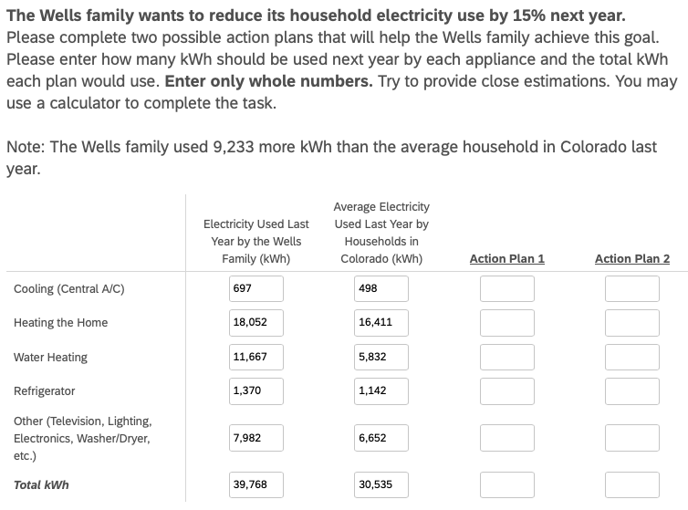
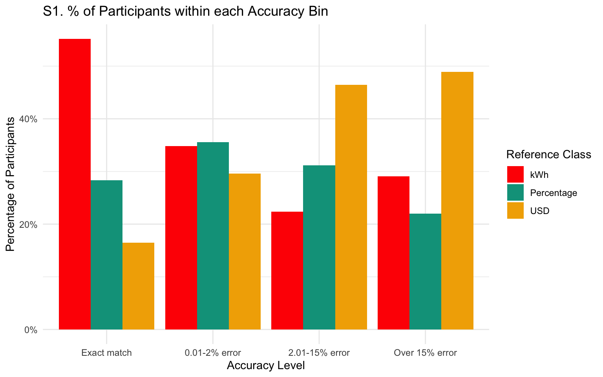
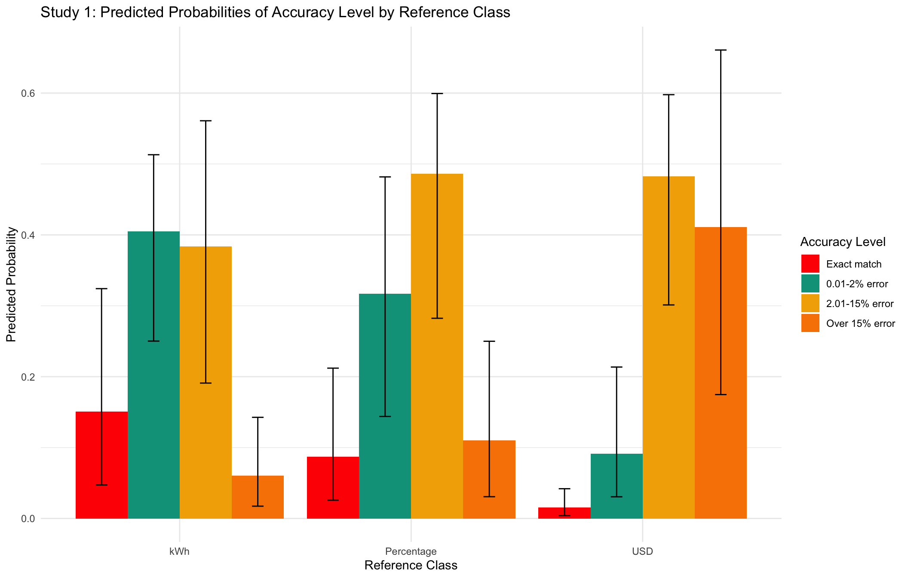
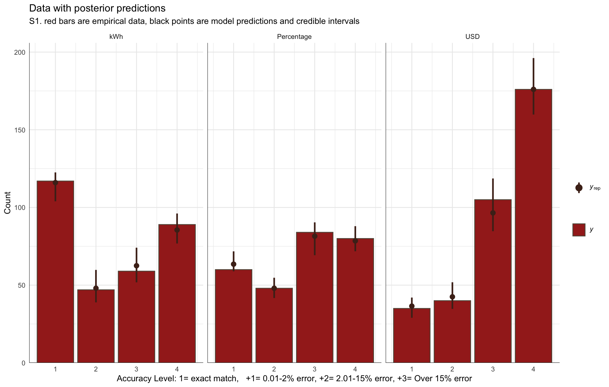
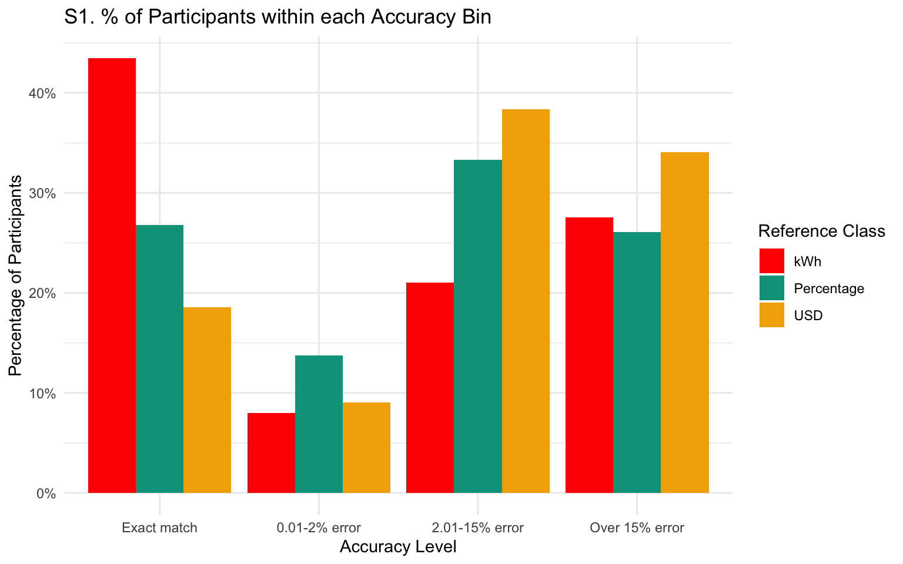
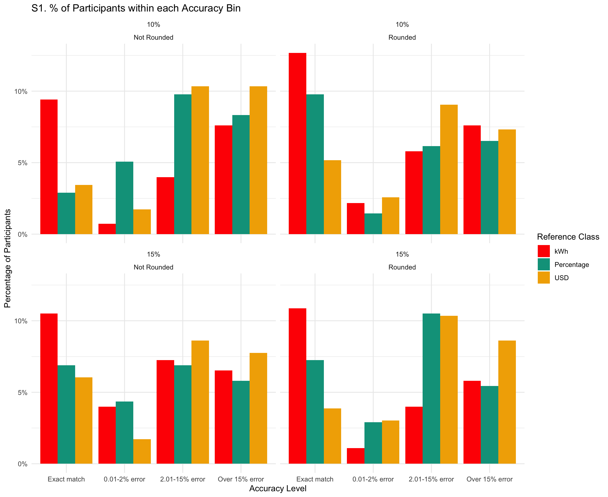
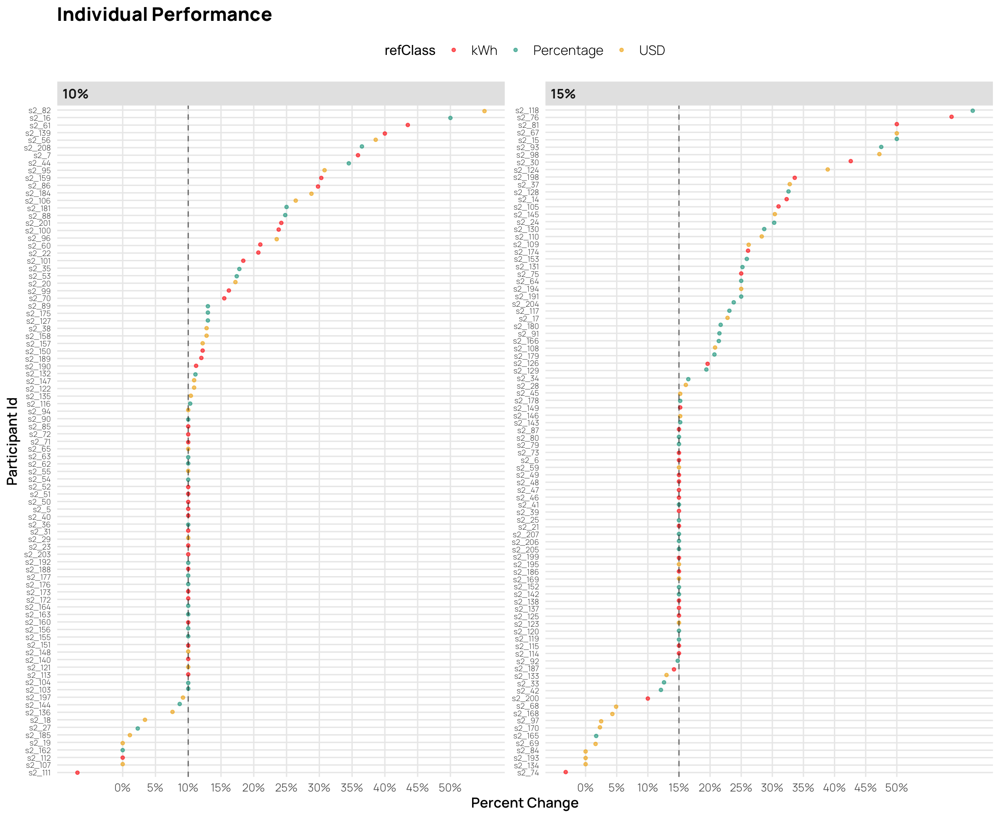
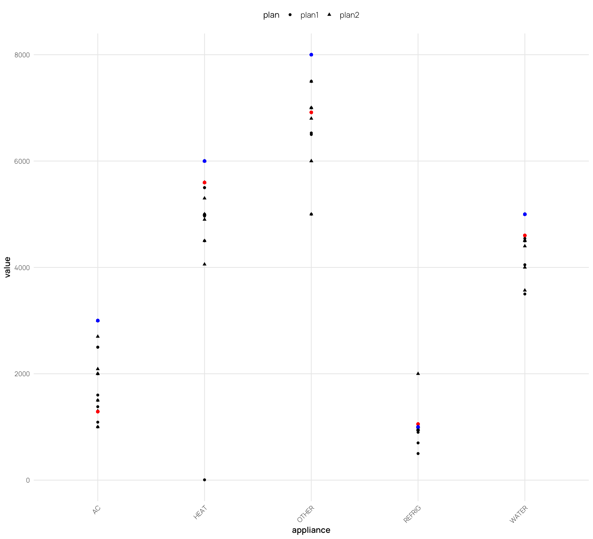
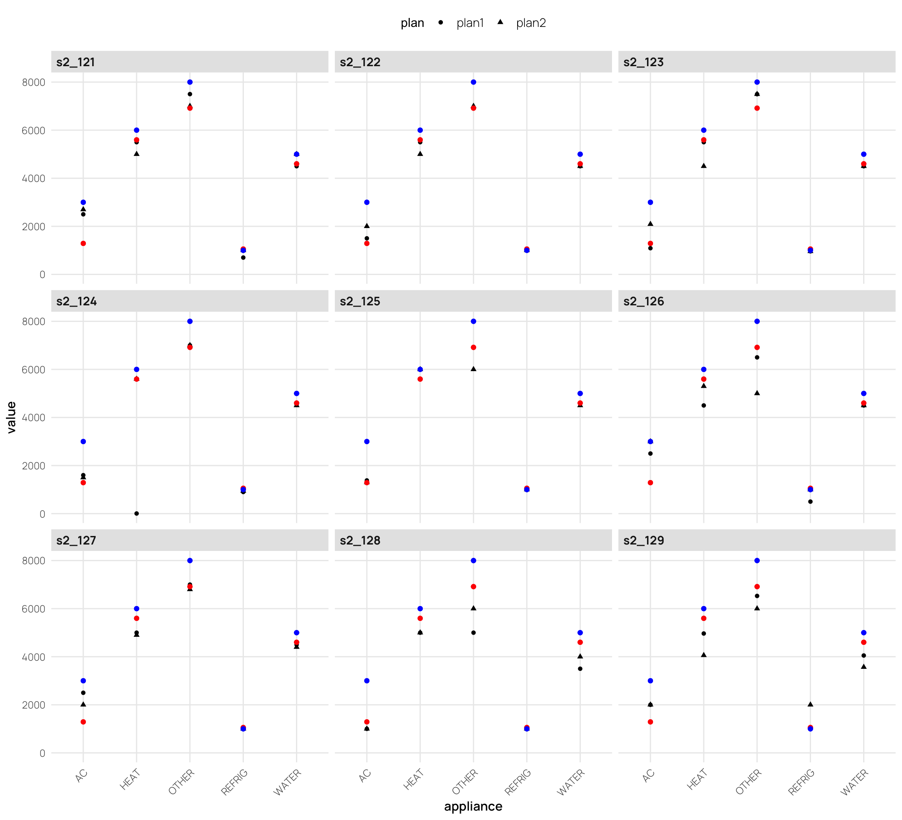

# Introduction

-   highlight the significant contribution of residential energy consumption to carbon emissions and the potential for substantial reductions. Make point about urgency of climate change? (IPCC (2014) and EIA (2012) ).

-   Electricity bills are a primary source of energy-use information for consumers and offer a promising avenue for enhancing communication about energy consumption (Fischer, 2008)

### Literature Review

-   Canfield et al. (2017) found that tables were more effective than graphs for conveying specific electricity usage data, likely because tables facilitate straightforward point reading. However, they also noted that individuals with lower energy literacy had reduced comprehension across all formats.
-   Canfield et al.'s (2017) findings on preferences for historical use information and the impact of neighbor comparisons
-   The concept of cognitive fit posits that performance improves when the information presentation format aligns with the task requirements (Vessey, 1991)
-   alignment can reduce cognitive load and enhance accuracy in planning (Shah & Freedman, 2009)
-   Reimer et al. (2015) provide context on how numerical formats affect risk perception, the reference class problem, and the benefits of natural frequencies.

Energy poverty continues to be a pervasive issue in the United States Memmott et al. (2021) . This challenge partly arises from difficulties in converting information across numerical formats, impeding the development of precise energy reduction plans Reimer et al. (2015). Prior research by Canfield et al. (2017) demonstrated that presenting energy information in tabular formats enhances comprehension relative to graphs.

The way numerical information is presented can significantly affect how individuals process and use that information (Reimer et al., 2015). The reference class problem highlights that numbers without clear reference points can lead to misinterpretation, as the meaning of a statistic depends on the category or class it refers to (Gigerenzer & Edwards, 2003; Reimer et al., 2015). Presenting energy information in absolute units (e.g., kWh) provides a clear reference class, potentially enhancing comprehension.

Furthermore, research suggests that natural frequencies and absolute numbers are generally easier for individuals to understand compared to percentages or probabilities (Gigerenzer & Hoffrage, 1995; Hoffrage et al., 2000). In the context of energy conservation, using absolute units may facilitate more accurate planning and decision-making by aligning with intuitive cognitive processing.

Despite existing studies on energy-use communication and format effects, limited research has explored how different numerical representations influence consumers' ability to create accurate energy conservation plans. Specifically, there is a gap in understanding how presenting energy information in absolute units versus percentages or monetary terms affects the precision of planning appliance-specific reductions. Addressing this gap is crucial for developing effective interventions that promote energy conservation behaviors.

### Hypotheses

Building on these findings and informed by prior work showing that frequencies (like absolute units in kWh) are easier to comprehend and facilitate more precise decision-making compared to percentages, our study also utilizes a tabular format, but manipulates whether participants must consider energy information presented as absolute units (kWh), percentages (%), or monetary costs (USD). We hypothesize that presenting information in absolute units (kWh) will lead to more accurate household energy conservation planning.

# Experiment 1

See <a href="#fig-task" class="quarto-xref">Figure 1</a> for an example of a planning trial as it was seen by participants.

## Methods

### Participants

We implemented our task and surveys on Qualtrics, and recruited participants through Amazon Mechanical Turk. In Experiment 1, 252 participants were intially recruited, but data from 17 participants were corrupted due to experimenter error, leaving a final sample of 235 participants. Most participants (76%) reported using a calculator to complete the task.

### Materials and Design

The study employed a mixed design with reference class (kWh, percentage, USD) as a between-subjects factor and state/family scenario as a within-subjects factor. Each participant completed energy reduction planning tasks for two different states, with state order counterbalanced across participants. The family scenarios featured four households in different climate regions: Texas (Smith family) and California (Adams family) representing warm climates, and Colorado (Wells family) and Massachusetts (Davis family) representing cold climates. We obtain average utility use from each state by CITE SOURCE FOR STATE AVGS?

### Procedure

Participants received energy usage data for two hypothetical families and were tasked with creating action plans to meet specified reduction goals by allocating usage across five appliance categories: heating, cooling, water heating, refrigerator, and an other appliances (e.g., TV, lighting).

For each family scenario, the particpipants were shown a table containing the families utility usage from the prior year, alongside the state averages for each appliance category (both prior year usage and stage averages are always shown in kWh). For each scenario, participants were asked to create two possible action plans to achieve the target reduction in total household energy usage (see <a href="#fig-task" class="quarto-xref">Figure 1</a>). Depending on their reference class condition, the target reduction amount presented either in kilowatt-hours (kWh), as percentages of total household usage, or in U.S. dollars. In all conditions, the target reduction was equivalent to a 15% reduction in total household kWh.

Additional data collected included:

-   **Energy Literacy Quiz**: An 8-item questionnaire assessing participants' knowledge of energy consumption and conversion.
-   **Calculator Usage Tracking**: Questions determined whether participants used a calculator, paper/pen, or other methods to complete the tasks.
-   **Demographic Survey**: Collected information on gender, age, income, education, employment status, and state of residence.
-   **Environmental Attitudes Survey**: Assessed participants' pro-environmental attitudes and perceived importance of energy conservation.

## Results

| refClass   | Avg. % meeting goal | Avg. Deviation From Goal |
|:-----------|:--------------------|:-------------------------|
| kWh        | 0.38                | 0.15                     |
| Percentage | 0.22                | 0.16                     |
| USD        | 0.10                | 0.19                     |

For our primary analyses of participants' ability to create accurate energy-saving plans, we employed an accuracy level binning approach by categorizing responses into four distinct levels: Exact match, 0.01--2% error, 2.01--15% error, and Over 15% error.

| Accuracy Level | kWh   | Percentage | USD   | Combined Groups % |
|:---------------|:------|:-----------|:------|:------------------|
| Exact match    | 37.5% | 22.1%      | 9.8%  | 22.6%             |
| 0.01-2% error  | 15.1% | 17.6%      | 11.2% | 14.4%             |
| 2.01-15% error | 26.3% | 41.9%      | 47.8% | 38.9%             |
| Over 15% error | 21.2% | 18.4%      | 31.2% | 24.1%             |

We analyzed planning accuracy using Bayesian ordinal regression. The dependent variable, plan error, was computed by binning the goal deviation into four ordered levels: exact match (0% error), minor deviations (0.01-2% error), moderate deviations (2.01-15% error), and major deviations (\>15% error). For each comparison, we provide posterior odds ratios (OR) and their 95% CIs.

| comparison        | odds_ratio | ci_lower | ci_upper |
|:------------------|:-----------|:---------|:---------|
| Percentage vs kWh | 2.3        | 0.62     | 6.2      |
| USD vs kWh        | 14.1       | 4.08     | 38.0     |

# Experiment 2

## Methods

The experimental procedures in study 2 are quite similar to those in study 1, but we also included a rounding manipulation (rounded vs. not rounded), and a manipulation of the goal (10% reduction vs. 15% rediction). We recruited 206 participants from Amazon Mechanical Turk, but data from from 10 participants were corrupted due to experimenter error, leaving a final sample of 196 participants.

Note that reference class remains a between-subjects variable, while percent goal, rounding, and state are within-subjects variables.
In study 2, the new design is a 4 state temperature (2 warm vs. 2 cold states) X 2 task goal (10% vs. 15%) X 2 last year's usage for the family and the state average (exact vs. rounded numbers) within X 3 task reference class (USD vs. Percentage vs. kWh) between.

## Results

| refClass   | Avg. % meeting goal | Avg. Deviation From Goal |
|:-----------|:--------------------|:-------------------------|
| kWh        | 0.44                | 0.13                     |
| Percentage | 0.27                | 0.16                     |
| USD        | 0.18                | 0.17                     |

| Accuracy Level | kWh   | Percentage | USD   | Combined Groups % |
|:---------------|:------|:-----------|:------|:------------------|
| Exact match    | 43.5% | 26.8%      | 18.5% | 30.2%             |
| 0.01-2% error  | 8%    | 13.8%      | 9.1%  | 10.3%             |
| 2.01-15% error | 21%   | 33.3%      | 38.4% | 30.5%             |
| Over 15% error | 27.5% | 26.1%      | 34.1% | 29%               |

### Individual Differences

# Discusion

# References

Canfield, C., Bruine De Bruin, W., & Wong-Parodi, G. (2017). Perceptions of electricity-use communications: Effects of information, format, and individual differences. *Journal of Risk Research*, *20*(9), 1132--1153. <https://doi.org/10.1080/13669877.2015.1121909>

Memmott, T., Carley, S., Graff, M., & Konisky, D. M. (2021). Sociodemographic disparities in energy insecurity among low-income households before and during the COVID-19 pandemic. *Nature Energy*, *6*(2), 186--193. <https://doi.org/10.1038/s41560-020-00763-9>

Reimer, T., Jones, C., & Skubisz, C. (2015). Numeric Communication of Risk. In *The SAGE handbook of risk communication* (pp. 167--179).
