## Ordinal Regression alternative

``` r
pacman::p_load(dplyr,purrr,tidyr,here,tibble,stringr,brms,rstan,bayestestR,emmeans,tidybayes,modelsummary,
               ggplot2,gt,knitr,kableExtra,ggh4x,lme4,flextable,pander)
options(digits=2, scipen=999, dplyr.summarise.inform=FALSE)
walk(c("fun_plot"), ~ source(here::here(paste0("scripts/", .x, ".R"))))
theme_set(theme_nice())
options(brms.backend="cmdstanr",mc.cores=4)


s1 <- readRDS(here::here("data/s1_processed.rds")) |> filter(!(id %in% readRDS(here::here("data/s1_discrep_ids.rds"))))
s2_long <- readRDS(here::here("data/s2_processed.rds")) |> filter(!(id %in% readRDS(here::here("data/s2_discrep_ids.rds"))))
```

## Proportions in aggregate data

``` r
s1_agg <- s1 |> 
    filter(appliance !="Total kWh") |> 
    group_by(id,refClass,state,block,plan,calc,edu,pct_goal) |> 
    summarise(total_kWh = sum(value),orig_kWh=sum(family), 
                pct_change = round((orig_kWh-total_kWh)/orig_kWh,3), 
                n_change = sum(value!=family),
                state_p_dif=mean(state_p_dif),
                state_f_dif=mean(state_f_dif),
                n_less_avg = sum(less_avg),
                duration=first(Duration__in_seconds_)) |> 
    mutate(matched_goal = (pct_change == pct_goal), 
                error = pct_change - pct_goal,
                abs_error = abs(error),
                close_match = abs_error <= 0.03) |>
    ungroup() |> # Add ungroup here
        mutate(
            accuracy_level = factor(
                case_when(
                    abs_error == 0.00 ~ "Exact match",
                    abs_error <= 0.02 ~ "0.01-2% error",
                    abs_error <= 0.15 ~ "2.01-15% error",
                    TRUE ~ "Over 15% error"  # Capture all remaining cases
                ), 
                levels = c("Exact match", "0.01-2% error", "2.01-15% error", "Over 15% error"),
                ordered = TRUE
            )
        )


ggplot(data = s1_agg, aes(x = accuracy_level, fill = refClass)) +
  geom_bar(position = "dodge", aes(y = (..count..)/sum(..count..))) +
  scale_y_continuous(labels = scales::percent) +
  labs(title = "Accuracy Levels by Reference Class",
       x = "Accuracy Level",
       y = "Percentage of Participants",
       fill = "Reference Class") +
  theme_minimal()
```

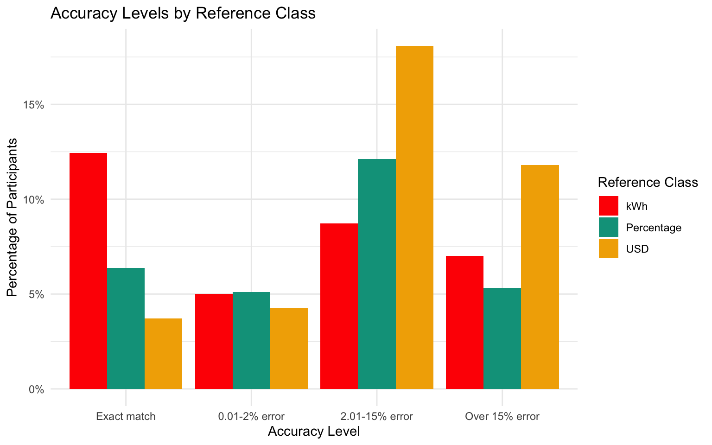

``` r
observed_props <- s1_agg |>
  group_by(refClass, accuracy_level) |>
  summarise(n = n()) |>
  group_by(refClass) |>
  mutate(prop = n/sum(n)) |>
  pivot_wider(
    names_from = accuracy_level,
    values_from = c(n, prop)
  )

  # Calculate proportions
prop_acc_s1 <- s1_agg %>%
    group_by(refClass, accuracy_level) %>%
    summarise(count = n()) %>%
    group_by(refClass) %>%
    mutate(Probability = count / sum(count)) %>%
    ungroup()

# Plot
ggplot(prop_acc_s1, aes(x = accuracy_level, y = Probability, fill = refClass)) +
    geom_bar(stat = "identity", position = position_dodge()) +
    labs(title = "Distribution of Accuracy Levels by Reference Class",
        x = "Accuracy Level",
        y = "Probability",
        fill = "Reference Class") +
    theme_minimal() +
    scale_fill_brewer(palette = "Set1")
```

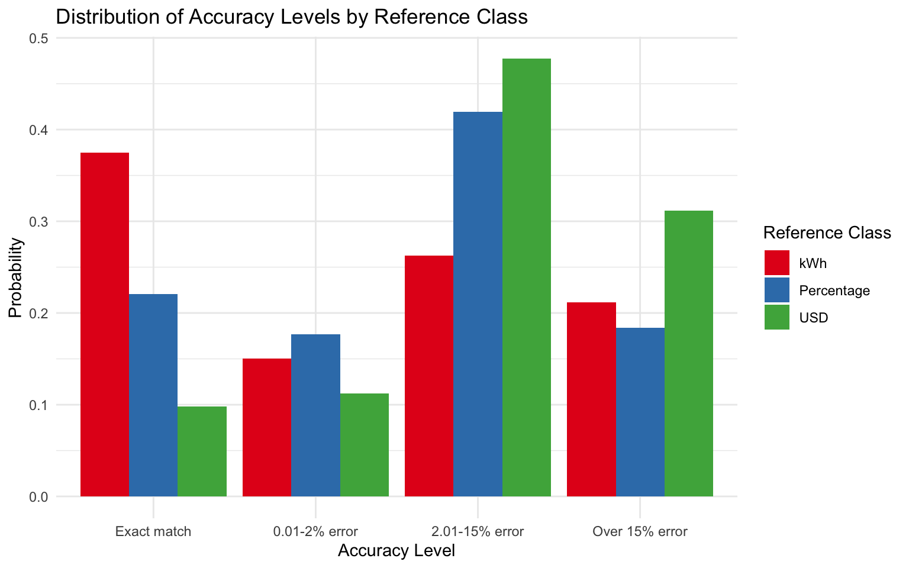

## Fit Ordinal model accuracy_level ~ refClass + (1\|id) + (1\|state)

``` r
ordinal_model_s1 <- brm(
  accuracy_level ~ refClass + (1|id) + (1|state),
  data = s1_agg,
  family = cumulative("logit"),
  cores = 4,
  iter = 2000,
  control = list(adapt_delta = 0.99), # Recommended for ordinal models
  prior = c(prior(normal(0, 2), class = "Intercept"),  # Priors for thresholds
            prior(normal(0, 1.5), class = "b")), # Priors for predictors
  file = paste0(here::here("data/model_cache",'s1_ordinal3.rds')) # Cache for efficiency
)

summary(ordinal_model_s1)
```

     Family: cumulative 
      Links: mu = logit; disc = identity 
    Formula: accuracy_level ~ refClass + (1 | id) + (1 | state) 
       Data: s1_agg (Number of observations: 940) 
      Draws: 4 chains, each with iter = 2000; warmup = 1000; thin = 1;
             total post-warmup draws = 4000

    Multilevel Hyperparameters:
    ~id (Number of levels: 235) 
                  Estimate Est.Error l-95% CI u-95% CI Rhat Bulk_ESS Tail_ESS
    sd(Intercept)     3.69      0.28     3.17     4.29 1.00     1280     2107

    ~state (Number of levels: 4) 
                  Estimate Est.Error l-95% CI u-95% CI Rhat Bulk_ESS Tail_ESS
    sd(Intercept)     0.73      0.48     0.24     2.04 1.00     1561     2190

    Regression Coefficients:
                       Estimate Est.Error l-95% CI u-95% CI Rhat Bulk_ESS Tail_ESS
    Intercept[1]          -1.85      0.56    -2.92    -0.75 1.00     1144     2042
    Intercept[2]           0.22      0.55    -0.82     1.34 1.00     1185     2062
    Intercept[3]           2.86      0.56     1.83     4.00 1.00     1271     2210
    refClassPercentage     0.65      0.59    -0.48     1.82 1.00      764     1403
    refClassUSD            2.48      0.56     1.41     3.64 1.00      818     1626

    Further Distributional Parameters:
         Estimate Est.Error l-95% CI u-95% CI Rhat Bulk_ESS Tail_ESS
    disc     1.00      0.00     1.00     1.00   NA       NA       NA

    Draws were sampled using sampling(NUTS). For each parameter, Bulk_ESS
    and Tail_ESS are effective sample size measures, and Rhat is the potential
    scale reduction factor on split chains (at convergence, Rhat = 1).

``` r
#ordinal_model_s1 |> emmeans(~refClass, type="response")

pp_check(ordinal_model_s1)
```

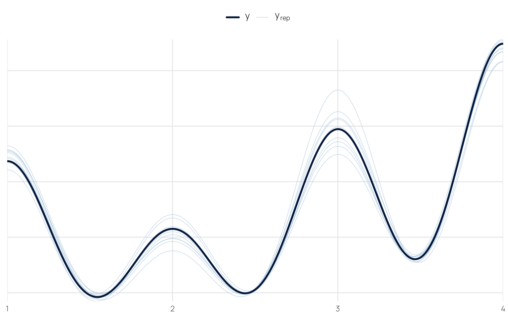

``` r
describe_posterior(ordinal_model_s1, centrality = "Mode") |> 
  filter(stringr::str_detect(Parameter, "b_")) |> 
  mutate(Parameter = stringr::str_remove(Parameter, "b_")) |> 
  mutate(across(where(is.numeric), round, 3)) |> 
  kable(booktabs = TRUE)
```

| Parameter | Mode | CI | CI_low | CI_high | pd | ROPE_CI | ROPE_low | ROPE_high | ROPE_Percentage | Rhat | ESS |
|:-----------|----:|---:|-----:|-----:|---:|-----:|------:|------:|----------:|---:|---:|
| Intercept\[1\] | -1.40 | 0.95 | -2.92 | -0.75 | 1.00 | 0.95 | -0.18 | 0.18 | 0.00 | 1 | 1121 |
| Intercept\[2\] | 0.92 | 0.95 | -0.82 | 1.34 | 0.65 | 0.95 | -0.18 | 0.18 | 0.26 | 1 | 1152 |
| Intercept\[3\] | 3.52 | 0.95 | 1.83 | 4.00 | 1.00 | 0.95 | -0.18 | 0.18 | 0.00 | 1 | 1232 |
| refClassPercentage | 1.81 | 0.95 | -0.48 | 1.82 | 0.86 | 0.95 | -0.18 | 0.18 | 0.14 | 1 | 742 |
| refClassUSD | 2.88 | 0.95 | 1.41 | 3.64 | 1.00 | 0.95 | -0.18 | 0.18 | 0.00 | 1 | 799 |

``` r
# Get predicted probabilities
pred_summary <- ordinal_model_s1 |>
    epred_draws(newdata = data.frame(refClass = c("kWh", "Percentage", "USD")),
                ndraws = 1000, re_formula = NA) |>
    group_by(refClass, .category) |>
    summarise(
        mean_prob = mean(.epred),
        lower_ci = quantile(.epred, 0.025),
        upper_ci = quantile(.epred, 0.975)
    )
pred_summary |> pander::pandoc.table(caption="Study 1: Predicted probabilities of accuracy")
```


    ---------------------------------------------------------------
      refClass      .category      mean_prob   lower_ci   upper_ci 
    ------------ ---------------- ----------- ---------- ----------
     Percentage    Exact match      0.08577    0.02499     0.2077  

     Percentage   0.01-2% error     0.3131      0.1413     0.4804  

     Percentage   2.01-15% error    0.4891      0.2959     0.6078  

     Percentage   Over 15% error     0.112     0.03173     0.2579  

        USD        Exact match      0.01496    0.004039   0.03889  

        USD       0.01-2% error     0.08834    0.02986     0.2031  

        USD       2.01-15% error     0.48       0.301      0.6012  

        USD       Over 15% error    0.4167      0.1845     0.6574  

        kWh        Exact match       0.146     0.04792     0.3064  

        kWh       0.01-2% error     0.4004      0.2422     0.5179  

        kWh       2.01-15% error    0.3911      0.199      0.5635  

        kWh       Over 15% error    0.06246    0.01758     0.1468  
    ---------------------------------------------------------------

    Table: Study 1: Predicted probabilities of accuracy

``` r
# Convert log-odds to odds ratios
posterior_samples <- as.data.frame(ordinal_model_s1)
odds_ratios <- data.frame(
  Percentage_vs_kWh = exp(posterior_samples$b_refClassPercentage),
  USD_vs_kWh = exp(posterior_samples$b_refClassUSD)
)

# Calculate summary statistics
odds_ratio_summary <- data.frame(
  comparison = c("Percentage vs kWh", "USD vs kWh"),
  odds_ratio = c(mean(odds_ratios$Percentage_vs_kWh),
                 mean(odds_ratios$USD_vs_kWh)),
  ci_lower = c(quantile(odds_ratios$Percentage_vs_kWh, 0.025),
               quantile(odds_ratios$USD_vs_kWh, 0.025)),
  ci_upper = c(quantile(odds_ratios$Percentage_vs_kWh, 0.975),
               quantile(odds_ratios$USD_vs_kWh, 0.975))
)


odds_ratio_summary |> kable()
```

| comparison        | odds_ratio | ci_lower | ci_upper |
|:------------------|-----------:|---------:|---------:|
| Percentage vs kWh |        2.3 |     0.62 |      6.2 |
| USD vs kWh        |       14.1 |     4.08 |     38.0 |

``` r
# |comparison        | odds_ratio| ci_lower| ci_upper|
# |:-----------------|----------:|--------:|--------:|
# |Percentage vs kWh |        2.3|     0.62|      6.2|
# |USD vs kWh        |       14.1|     4.08|     38.0|


odds_ratio_summary |> pander::pandoc.table(caption="Study 1: Odds ratios of accuracy")
```


    ------------------------------------------------------
        comparison       odds_ratio   ci_lower   ci_upper 
    ------------------- ------------ ---------- ----------
     Percentage vs kWh     2.274       0.6178     6.148   

        USD vs kWh         14.09        4.08      38.04   
    ------------------------------------------------------

    Table: Study 1: Odds ratios of accuracy

``` r
# Plot predicted probabilities
ggplot(pred_summary, aes(x = refClass, y = mean_prob, fill = .category)) +
  geom_bar(stat = "identity", position = position_dodge()) +
  geom_errorbar(aes(ymin = lower_ci, ymax = upper_ci),
                position = position_dodge(width = 0.9), width = 0.2) +
  labs(y = "Predicted Probability", x = "Reference Class", fill = "Accuracy Level") +
  ggtitle("Study 1: Predicted Probabilities of Accuracy Level by Reference Class") +
  theme_minimal()
```

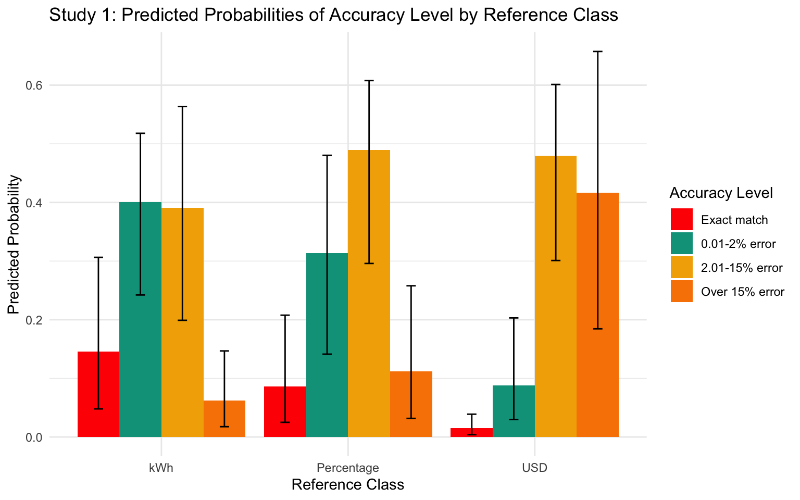

| comparison        | odds_ratio | ci_lower | ci_upper |
|:------------------|-----------:|---------:|---------:|
| Percentage vs kWh |        2.3 |     0.62 |      6.2 |
| USD vs kWh        |       14.1 |     4.08 |     38.0 |

## S1 posterior predictive checks

``` r
bayesplot::color_scheme_set(wes_palettes[1]$BottleRocket1[1:6])

pp_check(ordinal_model_s1, type = "bars", ndraws = 1000, fatten = 2) +
    scale_x_continuous("y", breaks = 1:7) +
    scale_y_continuous(NULL, breaks = NULL, expand = expansion(mult = c(0, 0.05))) +
    ggtitle("Data with posterior predictions",
            subtitle = "N = 100") 
```

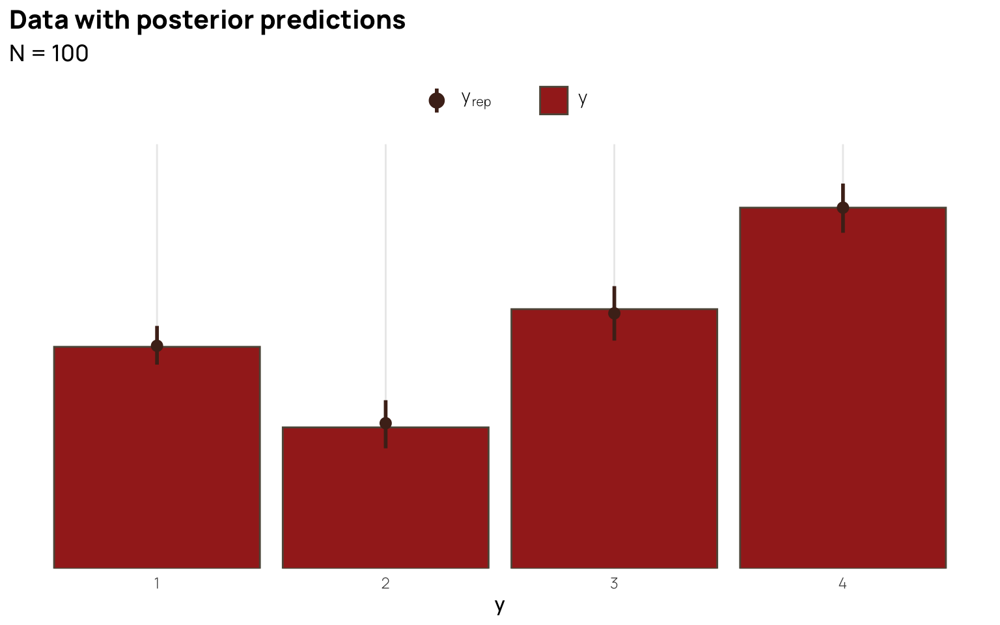

``` r
pp_check(ordinal_model_s1, type = "bars_grouped", group="refClass", fatten = 2) +
    scale_x_continuous("y", breaks = 1:7) +
    scale_y_continuous(NULL, breaks = NULL, expand = expansion(mult = c(0, 0.05))) +
    ggtitle("Data with posterior predictions",
            subtitle = expression(list(italic(N[A])==44, italic(N[B])==44))) +
    theme(legend.background = element_blank(),
            legend.position = c(.9, .75))
```

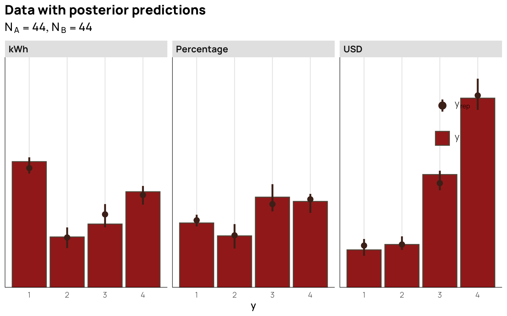

``` r
f <- fitted(ordinal_model_s1,newdata_pred <- expand.grid(
    refClass = c("kWh", "Percentage", "USD"),
    id = unique(s1_agg$id),
    state = unique(s1_agg$state)
    ))


# Create new_data with one id and state
new_data <- expand.grid(
  refClass = c("kWh", "Percentage", "USD"),
  id = unique(s1_agg$id)[1],      # Take first id
  state = unique(s1_agg$state)[1] # Take first state
)


f_df <- as.data.frame.table(f) |>
  rename(Probability = Freq) |>
  # Extract Y levels from the Var3 column
  mutate(Y = str_extract(Var3, "(?<=P\\(Y = ).*(?=\\))")) |>
  # Join with new_data using crossing instead of bind_cols
  crossing(new_data) |>
  # Select and arrange columns as needed
  select(refClass, id, state, Y, Probability)
```

## Comparing Marginal vs Conditional Predictions

``` r
# Create newdata with all necessary variables
newdata_pred <- expand.grid(
  refClass = c("kWh", "Percentage", "USD"),
  id = unique(s1_agg$id),
  state = unique(s1_agg$state)
)

# Population-level predictions
pred_probs_marginal <- ordinal_model_s1 |>
  epred_draws(
    newdata = data.frame(refClass = c("kWh", "Percentage", "USD")),
    ndraws = 1000, 
    re_formula = NA
  )

# Conditional predictions (including random effects)
pred_probs_conditional <- ordinal_model_s1 |>
  epred_draws(
    newdata = newdata_pred,
    ndraws = 1000, 
    re_formula = NULL
  )

# Compare the two approaches
summary_comparison <- bind_rows(
    pred_probs_marginal |> 
        group_by(refClass, .category) |>
        summarise(
        mean_prob = mean(.epred),
        sd_prob = sd(.epred),
        lower_ci = quantile(.epred, 0.025),
        upper_ci = quantile(.epred, 0.975),
        .groups = 'drop'
        ) |>
        mutate(type = "Marginal"),
    
    pred_probs_conditional |> 
        group_by(refClass, .category) |>
        summarise(
        mean_prob = mean(.epred),
        sd_prob = sd(.epred),
        lower_ci = quantile(.epred, 0.025),
        upper_ci = quantile(.epred, 0.975),
        .groups = 'drop'
        ) |>
        mutate(type = "Conditional")
)

# View the comparison
summary_comparison |>
  arrange(type, refClass, .category) |>
  kable(digits = 3)
```

| refClass   | .category      | mean_prob | sd_prob | lower_ci | upper_ci | type        |
|:----------|:-------------|---------:|-------:|--------:|--------:|:-----------|
| Percentage | Exact match    |     0.253 |   0.343 |    0.000 |    0.994 | Conditional |
| Percentage | 0.01-2% error  |     0.176 |   0.166 |    0.000 |    0.488 | Conditional |
| Percentage | 2.01-15% error |     0.266 |   0.212 |    0.000 |    0.594 | Conditional |
| Percentage | Over 15% error |     0.306 |   0.344 |    0.000 |    0.993 | Conditional |
| USD        | Exact match    |     0.143 |   0.273 |    0.000 |    0.965 | Conditional |
| USD        | 0.01-2% error  |     0.125 |   0.154 |    0.000 |    0.477 | Conditional |
| USD        | 2.01-15% error |     0.240 |   0.206 |    0.001 |    0.589 | Conditional |
| USD        | Over 15% error |     0.492 |   0.383 |    0.000 |    0.999 | Conditional |
| kWh        | Exact match    |     0.302 |   0.362 |    0.000 |    0.997 | Conditional |
| kWh        | 0.01-2% error  |     0.192 |   0.169 |    0.000 |    0.492 | Conditional |
| kWh        | 2.01-15% error |     0.258 |   0.213 |    0.000 |    0.593 | Conditional |
| kWh        | Over 15% error |     0.248 |   0.319 |    0.000 |    0.986 | Conditional |
| Percentage | Exact match    |     0.090 |   0.053 |    0.023 |    0.215 | Marginal    |
| Percentage | 0.01-2% error  |     0.320 |   0.093 |    0.141 |    0.491 | Marginal    |
| Percentage | 2.01-15% error |     0.481 |   0.090 |    0.274 |    0.607 | Marginal    |
| Percentage | Over 15% error |     0.109 |   0.059 |    0.029 |    0.256 | Marginal    |
| USD        | Exact match    |     0.015 |   0.010 |    0.004 |    0.037 | Marginal    |
| USD        | 0.01-2% error  |     0.090 |   0.044 |    0.030 |    0.190 | Marginal    |
| USD        | 2.01-15% error |     0.483 |   0.082 |    0.297 |    0.606 | Marginal    |
| USD        | Over 15% error |     0.412 |   0.125 |    0.195 |    0.665 | Marginal    |
| kWh        | Exact match    |     0.149 |   0.072 |    0.053 |    0.322 | Marginal    |
| kWh        | 0.01-2% error  |     0.403 |   0.069 |    0.244 |    0.512 | Marginal    |
| kWh        | 2.01-15% error |     0.387 |   0.099 |    0.184 |    0.561 | Marginal    |
| kWh        | Over 15% error |     0.061 |   0.032 |    0.017 |    0.137 | Marginal    |

``` r
# Visualize the comparison
ggplot(summary_comparison, 
        aes(x = .category, y = mean_prob, fill = refClass)) +
    geom_col(position = position_dodge()) +
    geom_errorbar(aes(ymin = lower_ci, ymax = upper_ci), 
            position = position_dodge(width = 0.8)) +
    facet_wrap(~type) +
    theme_minimal() +
    theme(axis.text.x = element_text(angle = 45, hjust = 1)) +
    labs(title = "Comparing Marginal vs Conditional Predictions",
        x = "Accuracy Level",
        y = "Predicted Probability")
```

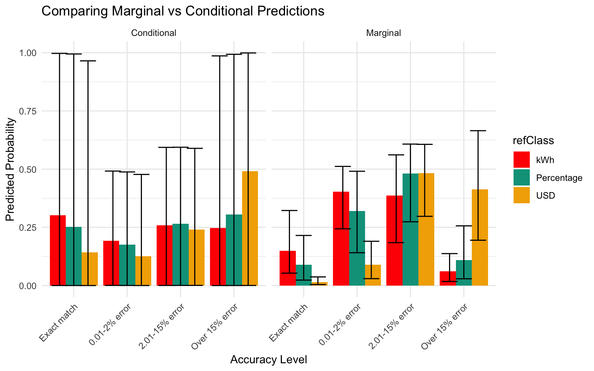

## Individual Differences in Predictions

``` r
# Extract random effects for subjects with corrected ID handling
ranef_draws <- ordinal_model_s1 |>
  spread_draws(r_id[id,term]) |>
  mutate(id = as.integer(as.character(id))) # Convert factor to integer

# Get subject-specific adjustments
subject_adjustments <- ranef_draws |>
  group_by(id) |>
  summarise(
    mean_adj = mean(r_id),
    lower = quantile(r_id, 0.025),
    upper = quantile(r_id, 0.975)
  )

# Get reference class for each subject
subject_refclass <- s1_agg |>
  group_by(id) |>
  summarise(refClass = first(refClass))

# Combine adjustments with reference class
subject_plot_data <- subject_adjustments |>
  left_join(subject_refclass, by = "id")

# Create caterpillar plot
ggplot(subject_plot_data, 
       aes(x = reorder(factor(id), mean_adj), 
           y = mean_adj, 
           color = refClass)) +
  geom_point() +
  geom_errorbar(aes(ymin = lower, ymax = upper), alpha = 0.5) +
  coord_flip() +
  facet_wrap(~refClass, scales = "free_y") +
  theme_minimal() +
  labs(title = "Subject-Level Random Effects by Reference Class",
       y = "Subject-Specific Adjustment",
       x = "Subject ID") +
  theme(legend.position = "none")
```

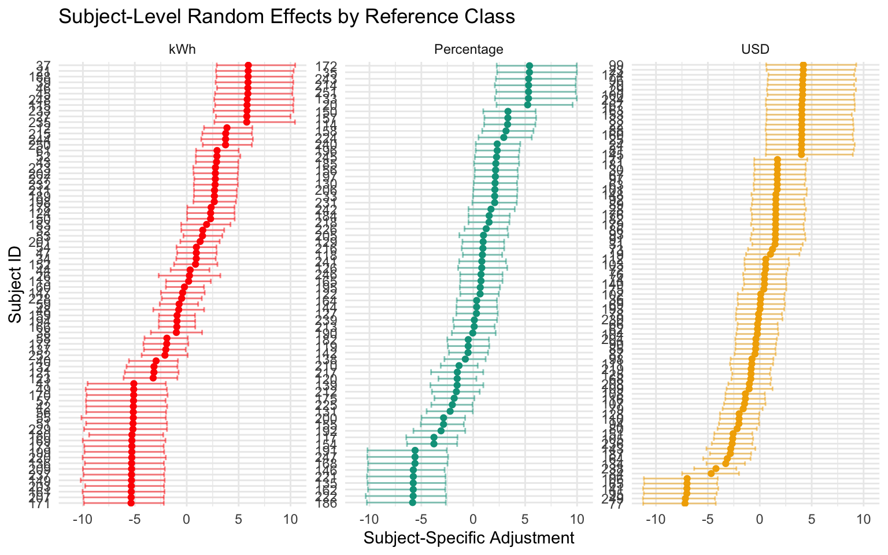

``` r
# Density plot of random effects by condition
ggplot(subject_plot_data, 
       aes(x = mean_adj, fill = refClass)) +
  geom_density(alpha = 0.5) +
  theme_minimal() +
  labs(title = "Distribution of Subject-Level Random Effects by Reference Class",
       x = "Subject-Specific Adjustment",
       y = "Density")
```

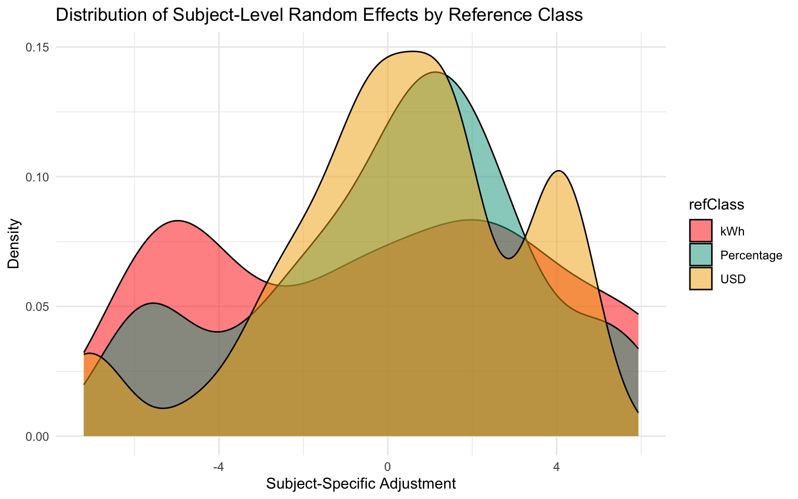

``` r
# Summary statistics by condition
random_effects_summary <- subject_plot_data |>
  group_by(refClass) |>
  summarise(
    n = n(),
    mean_adjustment = mean(mean_adj),
    sd_adjustment = sd(mean_adj),
    median_adjustment = median(mean_adj),
    q25 = quantile(mean_adj, 0.25),
    q75 = quantile(mean_adj, 0.75)
  )

print(random_effects_summary)
```

    # A tibble: 3 × 7
      refClass       n mean_adjustment sd_adjustment median_adjustment   q25   q75
      <chr>      <int>           <dbl>         <dbl>             <dbl> <dbl> <dbl>
    1 Percentage    68          0.0957          3.21            0.711  -1.68  2.13
    2 USD           89          0.205           3.00            0.447  -1.39  1.69
    3 kWh           78         -0.221           3.95           -0.0170 -5.11  2.76

``` r
pop_preds <- ordinal_model_s1 |>
    epred_draws(
        newdata = data.frame(refClass = c("kWh", "Percentage", "USD")),
        ndraws = 1000, 
        re_formula = NA
    ) |>
    group_by(refClass, .category) |>
    summarise(
        pop_mean = mean(.epred),
        pop_lower = quantile(.epred, 0.025),
        pop_upper = quantile(.epred, 0.975)
    )

# Get subject-specific predictions
subject_preds <- ordinal_model_s1 |>
    epred_draws(
        newdata = s1_agg,
        ndraws = 100  # fewer draws for computational efficiency
    ) |>
    group_by(id, refClass, .category) |>
    summarise(
        subj_mean = mean(.epred)
    )


# Plot 1: Population effects with subject-specific points
ggplot() +
    # Add subject-specific points
    geom_jitter(data = subject_preds,
                aes(x = .category, y = subj_mean, color = refClass),
                alpha = 0.2, width = 0.2, height = 0) +
    # Add population-level effects
    geom_point(data = pop_preds,
                aes(x = .category, y = pop_mean, fill = refClass),
                size = 3, shape = 21, color = "black") +
    geom_errorbar(data = pop_preds,
                aes(x = .category, ymin = pop_lower, ymax = pop_upper),
                width = 0.2) +
    facet_wrap(~refClass) +
    theme_minimal() +
    theme(axis.text.x = element_text(angle = 45, hjust = 1)) +
    labs(title = "Population-Level Effects with Subject-Specific Predictions",
        x = "Accuracy Level",
        y = "Predicted Probability")
```

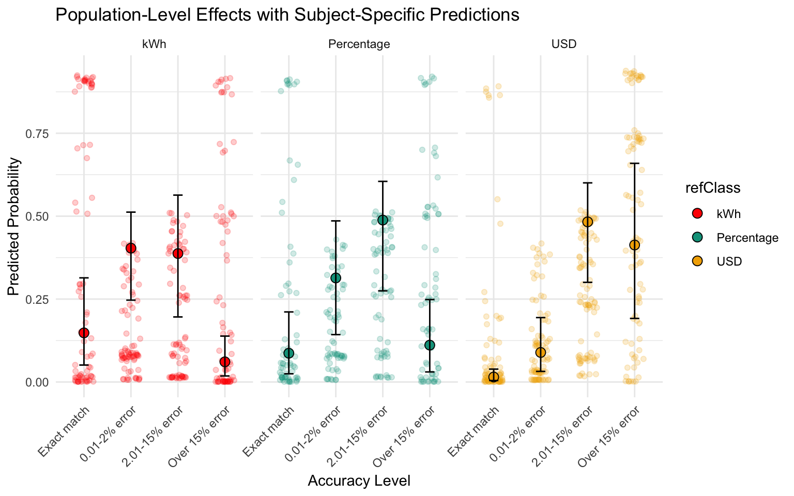

``` r
# Plot 2: Violin plot with population effects
ggplot() +
    # Add violin plot of subject-specific effects
    geom_violin(data = subject_preds,
                aes(x = .category, y = subj_mean, fill = refClass),
                alpha = 0.3) +
    # Add population-level points
    geom_point(data = pop_preds,
                aes(x = .category, y = pop_mean),
                size = 3, color = "black") +
    geom_errorbar(data = pop_preds,
                aes(x = .category, ymin = pop_lower, ymax = pop_upper),
                width = 0.2) +
    facet_wrap(~refClass) +
    theme_minimal() +
    theme(axis.text.x = element_text(angle = 45, hjust = 1)) +
    labs(title = "Distribution of Subject-Specific Effects with Population Estimates",
        x = "Accuracy Level",
        y = "Predicted Probability")
```

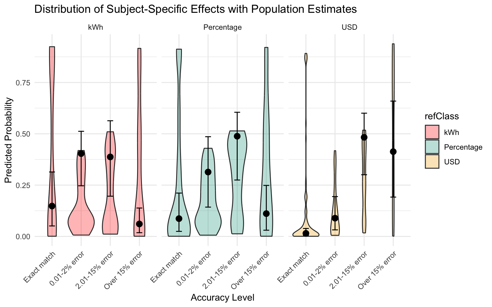

``` r
# Plot 3: Subject deviations from population mean
subject_deviations <- subject_preds |>
    left_join(pop_preds, by = c("refClass", ".category")) |>
    mutate(deviation = subj_mean - pop_mean)

ggplot(subject_deviations,
        aes(x = deviation, fill = refClass)) +
    geom_density(alpha = 0.5) +
    geom_vline(xintercept = 0, linetype = "dashed") +
    facet_grid(refClass ~ .category) +
    theme_minimal() +
    labs(title = "Subject Deviations from Population Mean",
        x = "Deviation from Population Mean",
        y = "Density")
```

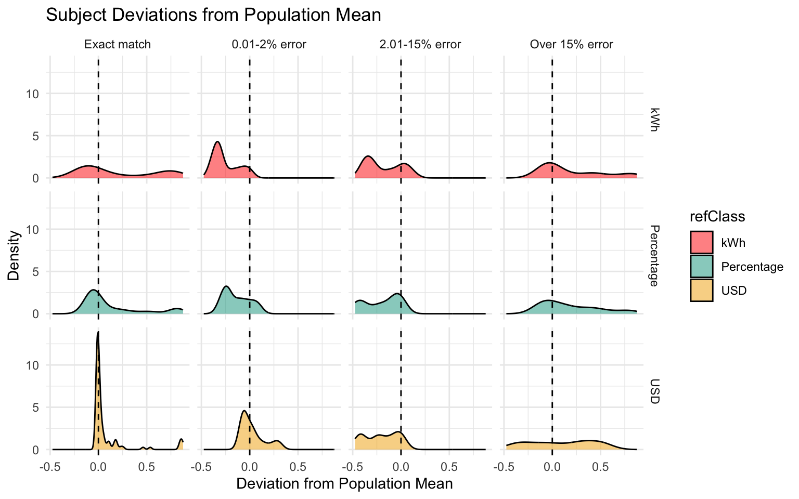

``` r
# Plot 4: Ridgeline plot of subject effects
library(ggridges)
ggplot(subject_preds,
        aes(x = subj_mean, y = .category, fill = refClass)) +
    geom_density_ridges(alpha = 0.5) +
    geom_vline(data = pop_preds,
                aes(xintercept = pop_mean),
                linetype = "dashed") +
    facet_wrap(~refClass) +
    theme_minimal() +
    labs(title = "Distribution of Subject-Specific Effects by Accuracy Level",
        x = "Predicted Probability",
        y = "Accuracy Level")
```

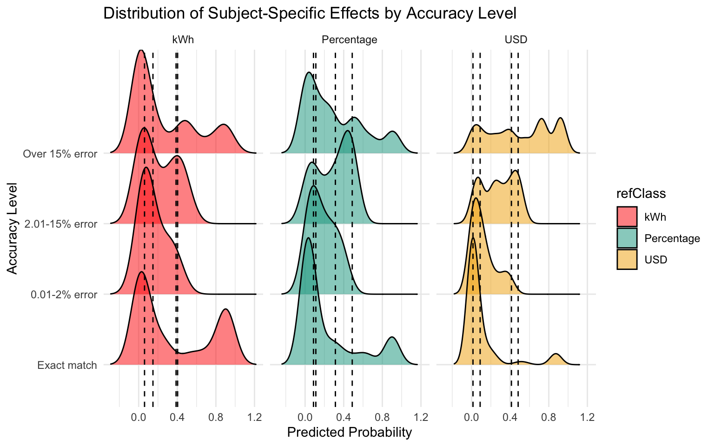

## Alt s1 visual of predicted probs

``` r
predicted_probs_s1 <- ordinal_model_s1 %>%
    # gather draws that contain refClass ("b_refClassPercentage"    "b_refClassUSD"  )
    gather_draws(b_refClassPercentage, b_refClassUSD) %>%
    mutate(refClass = case_when(
    str_detect(.variable, "Percentage") ~ "Percentage",
    str_detect(.variable, "USD") ~ "USD",
    TRUE ~ "kWh"
  )) %>%
    group_by(refClass) %>%
    summarise(effect = mean(.value)) %>%
    mutate(
        group = refClass,
        prob_exact = plogis(effect + (-1.85)),
        prob_0_2 = plogis(effect + 0.22) - plogis(effect + (-1.85)),
        prob_2_15 = plogis(effect + 2.86) - plogis(effect + 0.22),
        prob_over15 = 1 - plogis(effect + 2.86)
    ) %>%
    pivot_longer(
        cols = starts_with("prob"),
        names_to = "Accuracy_Level",
        values_to = "Probability"
    ) %>%
    mutate(
        Accuracy_Level = recode(Accuracy_Level,
                                "prob_exact" = "Exact match",
                                "prob_0_2" = "0.01-2% error",
                                "prob_2_15" = "2.01-15% error",
                                "prob_over15" = "Over 15% error")
    )


ggplot(predicted_probs_s1, aes(x = Accuracy_Level, y = Probability, fill = refClass)) +
  geom_bar(stat = "identity", position = "dodge") +
  labs(title = "Predicted Probabilities of Accuracy Levels by Reference Class",
       x = "Accuracy Level",
       y = "Probability",
       fill = "Reference Class") +
  theme_minimal()
```

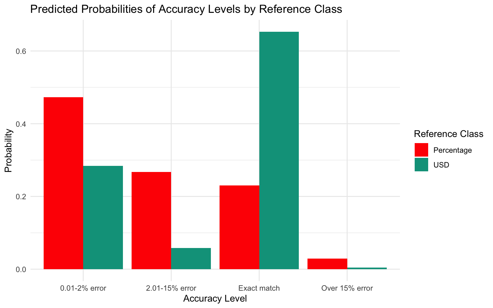

## s1 probit

``` r
ordinal_model_s1_prb <- brm(
  accuracy_level ~ refClass + (1|id) + (1|state),
  data = s1_agg,
  family = cumulative("probit"),
  cores = 4,
  iter = 2000,
  control = list(adapt_delta = 0.99), # Recommended for ordinal models
  prior = c(prior(normal(0, 3), class = "Intercept"),  # Priors for thresholds
            prior(normal(0, 2), class = "b")), # Priors for predictors
  file = paste0(here::here("data/model_cache",'s1_ordinal_probit1.rds')) # Cache for efficiency
)

summary(ordinal_model_s1_prb)
```

     Family: cumulative 
      Links: mu = probit; disc = identity 
    Formula: accuracy_level ~ refClass + (1 | id) + (1 | state) 
       Data: s1_agg (Number of observations: 940) 
      Draws: 4 chains, each with iter = 2000; warmup = 1000; thin = 1;
             total post-warmup draws = 4000

    Multilevel Hyperparameters:
    ~id (Number of levels: 235) 
                  Estimate Est.Error l-95% CI u-95% CI Rhat Bulk_ESS Tail_ESS
    sd(Intercept)     2.12      0.16     1.83     2.46 1.01      746     1694

    ~state (Number of levels: 4) 
                  Estimate Est.Error l-95% CI u-95% CI Rhat Bulk_ESS Tail_ESS
    sd(Intercept)     0.48      0.38     0.14     1.51 1.00     1061     1725

    Regression Coefficients:
                       Estimate Est.Error l-95% CI u-95% CI Rhat Bulk_ESS Tail_ESS
    Intercept[1]          -0.96      0.38    -1.71    -0.21 1.00      571      965
    Intercept[2]           0.22      0.38    -0.53     0.96 1.00      583     1025
    Intercept[3]           1.73      0.38     0.99     2.51 1.00      589     1036
    refClassPercentage     0.54      0.38    -0.17     1.29 1.00      461      893
    refClassUSD            1.66      0.37     0.94     2.37 1.00      345      573

    Further Distributional Parameters:
         Estimate Est.Error l-95% CI u-95% CI Rhat Bulk_ESS Tail_ESS
    disc     1.00      0.00     1.00     1.00   NA       NA       NA

    Draws were sampled using sampling(NUTS). For each parameter, Bulk_ESS
    and Tail_ESS are effective sample size measures, and Rhat is the potential
    scale reduction factor on split chains (at convergence, Rhat = 1).

``` r
pp_check(ordinal_model_s1_prb, type = "bars_grouped", group="refClass", fatten = 2) +
    scale_x_continuous("y", breaks = 1:7) +
    scale_y_continuous(NULL, breaks = NULL, expand = expansion(mult = c(0, 0.05))) +
    ggtitle("Data with posterior predictions",
            subtitle = expression(list(italic(N[A])==44, italic(N[B])==44))) +
    theme(legend.background = element_blank(),
            legend.position = c(.9, .75))
```

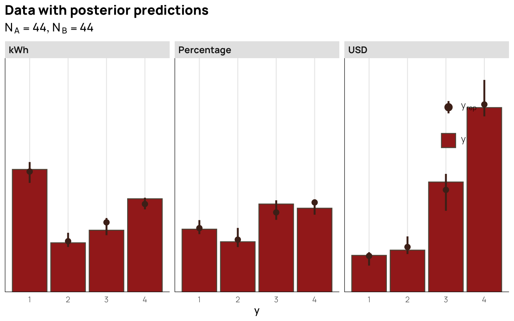

``` r
loo_logit <- loo(ordinal_model_s1)
loo_probit <- loo(ordinal_model_s1_prb)
loo_compare(loo_logit, loo_probit)
```

                         elpd_diff se_diff
    ordinal_model_s1_prb   0.0       0.0  
    ordinal_model_s1     -11.7       2.1  

``` r
waic(ordinal_model_s1)
```


    Computed from 4000 by 940 log-likelihood matrix.

              Estimate   SE
    elpd_waic   -782.2 23.1
    p_waic       182.8  7.9
    waic        1564.5 46.2

    139 (14.8%) p_waic estimates greater than 0.4. We recommend trying loo instead. 

``` r
waic(ordinal_model_s1_prb)
```


    Computed from 4000 by 940 log-likelihood matrix.

              Estimate   SE
    elpd_waic   -767.0 22.1
    p_waic       161.6  7.1
    waic        1533.9 44.3

    117 (12.4%) p_waic estimates greater than 0.4. We recommend trying loo instead. 

``` r
# compare
rstanarm::loo_compare(loo_logit, loo_probit)
```

                         elpd_diff se_diff
    ordinal_model_s1_prb   0.0       0.0  
    ordinal_model_s1     -11.7       2.1  

``` r
# Obtain predicted probabilities
predicted_probs_s1 <- ordinal_model_s1_prb %>%
    gather_draws(b_refClassPercentage, b_refClassUSD) %>%
    mutate(refClass = case_when(
        str_detect(.variable, "Percentage") ~ "Percentage",
        str_detect(.variable, "USD") ~ "USD",
        TRUE ~ "kWh"
    )) %>%
    group_by(refClass) %>%
    summarise(effect = mean(.value)) %>%
    mutate(
        group = refClass,
        prob_exact = plogis(effect + (-1.85)),
        prob_0_2 = plogis(effect + 0.22) - plogis(effect + (-1.85)),
        prob_2_15 = plogis(effect + 2.86) - plogis(effect + 0.22),
        prob_over15 = 1 - plogis(effect + 2.86)
    ) %>%
    pivot_longer(
        cols = starts_with("prob"),
        names_to = "Accuracy_Level",
        values_to = "Probability"
    ) %>%
    mutate(
        Accuracy_Level = recode(Accuracy_Level,
                                "prob_exact" = "Exact match",
                                "prob_0_2" = "0.01-2% error",
                                "prob_2_15" = "2.01-15% error",
                                "prob_over15" = "Over 15% error")
    )

    # Plot predicted probabilities
    ggplot(predicted_probs_s1, aes(x = Accuracy_Level, y = Probability, fill = refClass)) +
    geom_bar(stat = "identity", position = "dodge") +
    labs(title = "Predicted Probabilities of Accuracy Levels by Reference Class",
        x = "Accuracy Level",
        y = "Probability",
        fill = "Reference Class") +
    theme_minimal()
```

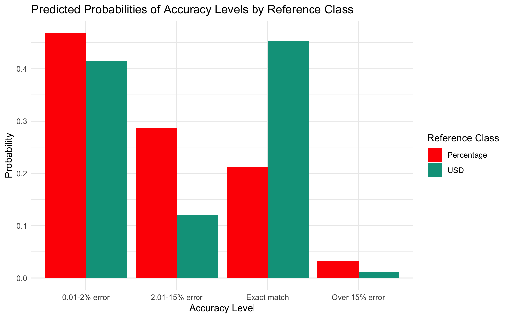

``` r
pred_data <- data.frame(
  refClass = c("kWh", "Percentage", "USD"),
  id = unique(s1_agg$id)[1],      # Take first id
  state = unique(s1_agg$state)[1] # Take first state
)

# Predicted probabilities from logit model
pred_probs_logit <- posterior_epred(ordinal_model_s1, newdata = pred_data, re_formula = NA)

# Predicted probabilities from probit model
pred_probs_probit <- posterior_epred(ordinal_model_s1_prb, newdata = pred_data, re_formula = NA)

# Compare predicted probabilities
mean_pred_logit <- apply(pred_probs_logit, 2, mean)
mean_pred_probit <- apply(pred_probs_probit, 2, mean)

comparison <- data.frame(
  Reference_Class = pred_data$refClass,
  Mean_Prob_Logit = mean_pred_logit,
  Mean_Prob_Probit = mean_pred_probit
)

print(comparison)
```

      Reference_Class Mean_Prob_Logit Mean_Prob_Probit
    1             kWh            0.25             0.25
    2      Percentage            0.25             0.25
    3             USD            0.25             0.25

# Study 2

``` r
s2_agg1 <- s2_long |> 
  filter(appliance != "TOTAL") |> 
  group_by(id, state,refClass,pct,pct_goal,plan,rounded) |> 
  summarise(
    total_kWh = sum(value),
    orig_kWh = sum(family),
    pct_change = round((orig_kWh - total_kWh) / orig_kWh, 3),
    state_dif = mean(state_dif),
    .groups = "drop"
  ) |>
  mutate(matched_goal = (pct_change == pct),
                error = pct_change - pct,
                abs_error = abs(error)) |> 
      ungroup() |> # Add ungroup here
        mutate(
            accuracy_level = factor(
                case_when(
                    abs_error == 0.00 ~ "Exact match",
                    abs_error <= 0.02 ~ "0.01-2% error",
                    abs_error <= 0.15 ~ "2.01-15% error",
                    TRUE ~ "Over 15% error"  # Capture all remaining cases
                ), 
                levels = c("Exact match", "0.01-2% error", "2.01-15% error", "Over 15% error"),
                ordered = TRUE
            )
        )


ggplot(data = s2_agg1, aes(x = accuracy_level, fill = refClass)) +
  geom_bar(position = "dodge", aes(y = (..count..)/sum(..count..))) +
  scale_y_continuous(labels = scales::percent) +
  labs(title = "Accuracy Levels by Reference Class",
       x = "Accuracy Level",
       y = "Percentage of Participants",
       fill = "Reference Class") +
  theme_minimal()
```

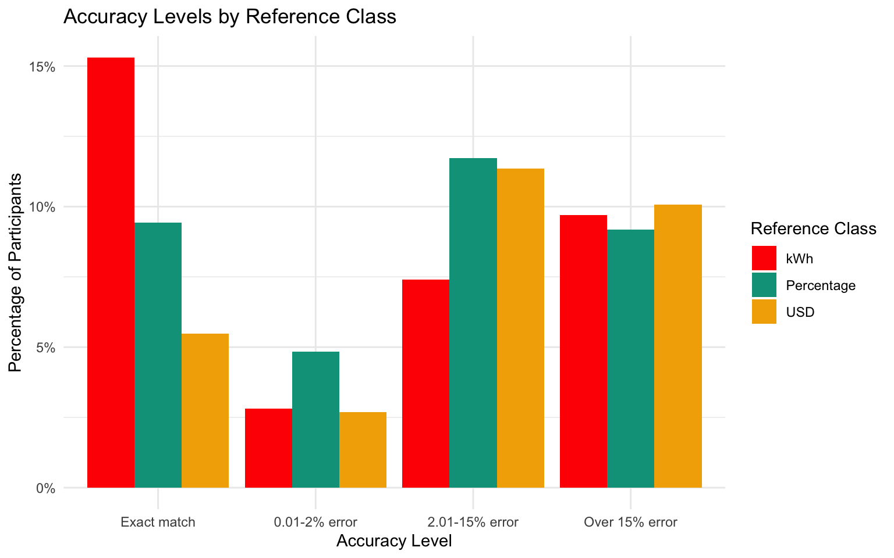

``` r
observed_props2 <- s2_agg1 |>
  group_by(refClass, accuracy_level) |>
  summarise(n = n()) |>
  group_by(refClass) |>
  mutate(prop = n/sum(n)) |>
  pivot_wider(
    names_from = accuracy_level,
    values_from = c(n, prop)
  )

  # Calculate proportions
prop_acc_s2 <- s2_agg1 %>%
    group_by(refClass, accuracy_level) %>%
    summarise(count = n()) %>%
    group_by(refClass) %>%
    mutate(Probability = count / sum(count)) %>%
    ungroup()

# Plot
ggplot(prop_acc_s2, aes(x = accuracy_level, y = Probability, fill = refClass)) +
    geom_bar(stat = "identity", position = position_dodge()) +
    labs(title = "Distribution of Accuracy Levels by Reference Class",
        x = "Accuracy Level",
        y = "Probability",
        fill = "Reference Class") +
    theme_minimal() +
    scale_fill_brewer(palette = "Set1")
```

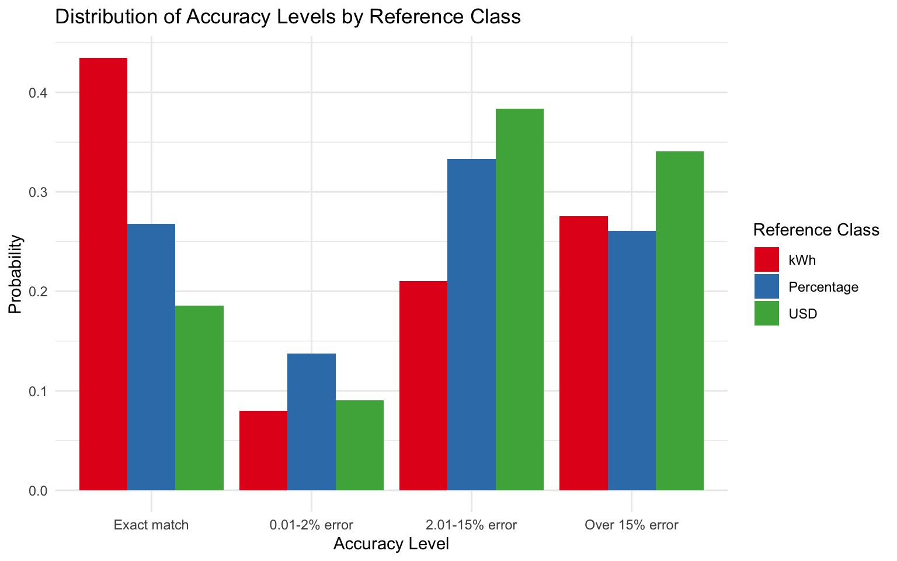

``` r
ggplot(data = s2_agg1, aes(x = accuracy_level, fill = refClass)) +
  geom_bar(position = "dodge", aes(y = (..count..)/sum(..count..))) +
  scale_y_continuous(labels = scales::percent) +
  labs(title = "Accuracy Levels by Reference Class",
       x = "Accuracy Level",
       y = "Percentage of Participants",
       fill = "Reference Class") +
  theme_minimal() + facet_wrap(~rounded+pct_goal)
```

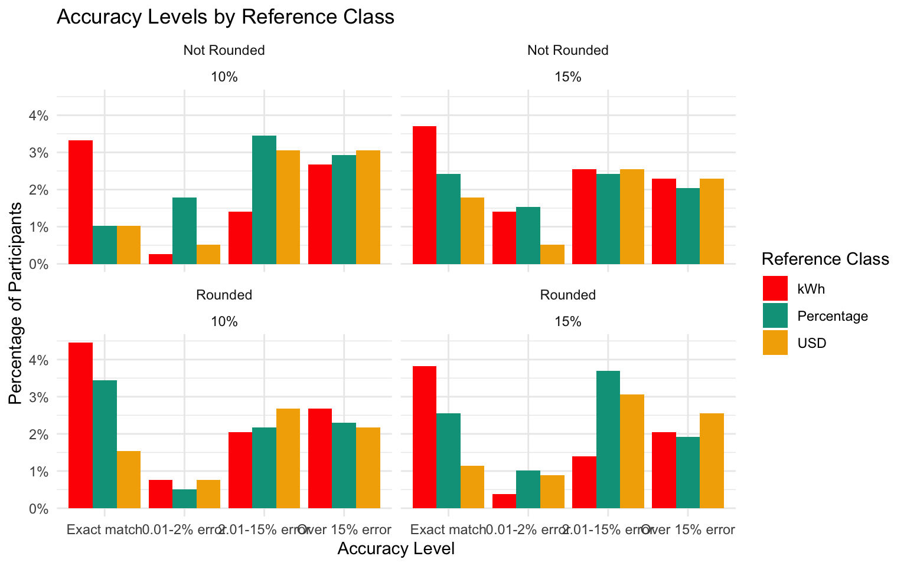

``` r
prop4_acc_s2 <- s2_agg1 %>%
    group_by(refClass, accuracy_level,rounded,pct_goal) %>%
    summarise(count = n()) %>%
    group_by(refClass) %>%
    mutate(Probability = count / sum(count)) %>%
    ungroup()

# Plot


s2_agg1 %>%
    group_by( accuracy_level,rounded) %>%
    summarise(count = n()) %>%
    group_by(rounded) %>%
    mutate(Probability = count / sum(count)) %>%
    ungroup()
```

    # A tibble: 8 × 4
      accuracy_level rounded     count Probability
      <ord>          <chr>       <int>       <dbl>
    1 Exact match    Not Rounded   104      0.265 
    2 Exact match    Rounded       133      0.339 
    3 0.01-2% error  Not Rounded    47      0.120 
    4 0.01-2% error  Rounded        34      0.0867
    5 2.01-15% error Not Rounded   121      0.309 
    6 2.01-15% error Rounded       118      0.301 
    7 Over 15% error Not Rounded   120      0.306 
    8 Over 15% error Rounded       107      0.273 

``` r
ggplot(prop4_acc_s2, aes(x = accuracy_level, y = Probability, fill = refClass)) +
    geom_bar(stat = "identity", position = position_dodge()) +
    labs(title = "Distribution of Accuracy Levels by Reference Class",
        x = "Accuracy Level",
        y = "Probability",
        fill = "Reference Class") +
    theme_minimal() +
    scale_fill_brewer(palette = "Set1") + facet_wrap(~rounded+pct_goal)
```

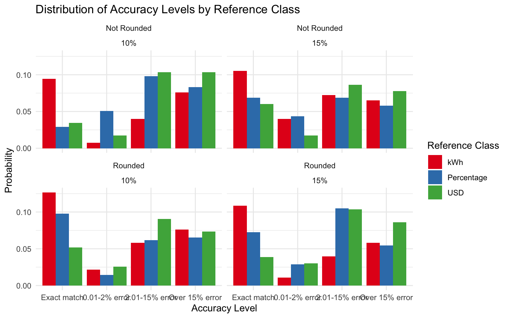

``` r
ggplot(prop4_acc_s2, aes(x = accuracy_level, y = Probability, fill = refClass)) +
    geom_bar(stat = "identity", position = position_dodge()) +
    labs(title = "Distribution of Accuracy Levels by Reference Class",
        x = "Accuracy Level",
        y = "Probability",
        fill = "Reference Class") +
    theme_minimal() +
    scale_fill_brewer(palette = "Set1") 
```

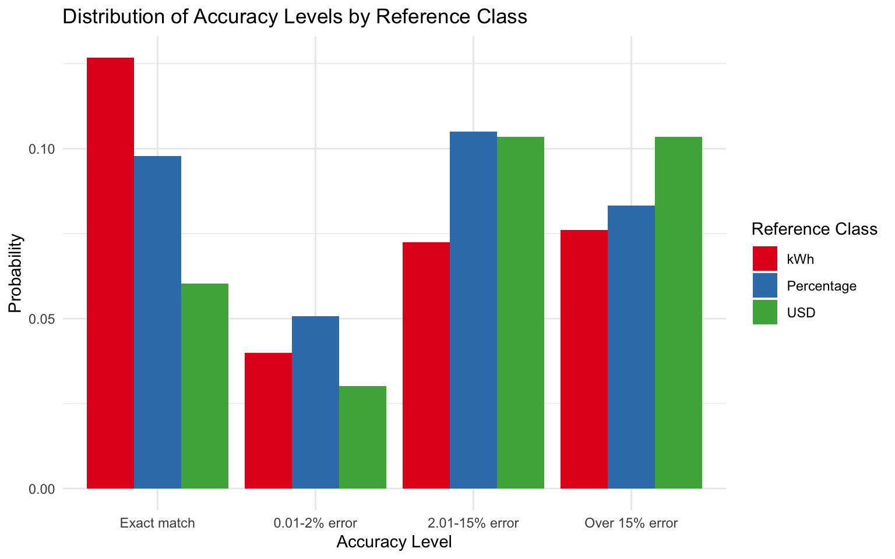

# no interaction model used in MPA

``` r
s2_agg1 <- s2_agg1 %>%
  mutate(
    refClass = factor(refClass, levels = c("kWh", "Percentage", "USD")),
    rounded = factor(rounded, levels = c("Not Rounded", "Rounded")),
    pct_goal = factor(pct_goal, levels = c("10%", "15%"))
  )


ordinal_model_s2_probit <- brm(
  accuracy_level ~ refClass +rounded+pct_goal + (1|id)+ (1|state),
  data = s2_agg1,
  family = cumulative("probit"),
  cores = 4,
  iter = 2000,
  control = list(adapt_delta = 0.99), # Recommended for ordinal models
  prior = c(prior(normal(0, 2), class = "Intercept"),  # Priors for thresholds
            prior(normal(0, 2), class = "b")), # Priors for predictors
  file = paste0(here::here("data/model_cache",'s2_op.rds')) # Cache for efficiency
)

summary(ordinal_model_s2_probit)
```

     Family: cumulative 
      Links: mu = probit; disc = identity 
    Formula: accuracy_level ~ refClass + rounded + pct_goal + (1 | id) + (1 | state) 
       Data: s2_agg1 (Number of observations: 784) 
      Draws: 4 chains, each with iter = 2000; warmup = 1000; thin = 1;
             total post-warmup draws = 4000

    Multilevel Hyperparameters:
    ~id (Number of levels: 196) 
                  Estimate Est.Error l-95% CI u-95% CI Rhat Bulk_ESS Tail_ESS
    sd(Intercept)     2.58      0.22     2.18     3.03 1.01      539     1502

    ~state (Number of levels: 4) 
                  Estimate Est.Error l-95% CI u-95% CI Rhat Bulk_ESS Tail_ESS
    sd(Intercept)     0.28      0.28     0.02     1.06 1.01      877     1127

    Regression Coefficients:
                       Estimate Est.Error l-95% CI u-95% CI Rhat Bulk_ESS Tail_ESS
    Intercept[1]          -1.12      0.38    -1.88    -0.37 1.01      686     1070
    Intercept[2]          -0.28      0.38    -1.04     0.47 1.01      693     1085
    Intercept[3]           1.81      0.38     1.04     2.56 1.01      702     1248
    refClassPercentage     0.58      0.45    -0.32     1.49 1.01      446      741
    refClassUSD            1.19      0.47     0.29     2.11 1.01      583     1087
    roundedRounded        -0.37      0.10    -0.57    -0.17 1.00     5613     2928
    pct_goal15%           -0.26      0.10    -0.46    -0.06 1.00     5136     2842

    Further Distributional Parameters:
         Estimate Est.Error l-95% CI u-95% CI Rhat Bulk_ESS Tail_ESS
    disc     1.00      0.00     1.00     1.00   NA       NA       NA

    Draws were sampled using sample(hmc). For each parameter, Bulk_ESS
    and Tail_ESS are effective sample size measures, and Rhat is the potential
    scale reduction factor on split chains (at convergence, Rhat = 1).

``` r
# Regression Coefficients:
#                    Estimate Est.Error l-95% CI u-95% CI Rhat Bulk_ESS Tail_ESS
# Intercept[1]          -1.12      0.38    -1.88    -0.37 1.01      686     1070
# Intercept[2]          -0.28      0.38    -1.04     0.47 1.01      693     1085
# Intercept[3]           1.81      0.38     1.04     2.56 1.01      702     1248
# refClassPercentage     0.58      0.45    -0.32     1.49 1.01      446      741
# refClassUSD            1.19      0.47     0.29     2.11 1.01      583     1087
# roundedRounded        -0.37      0.10    -0.57    -0.17 1.00     5613     2928
# pct_goal15%           -0.26      0.10    -0.46    -0.06 1.00     5136     2842

pred_summary_s2 <- ordinal_model_s2_probit %>%
  epred_draws(newdata = s2_agg1, re_formula = NA) %>%
  group_by(refClass, rounded, pct_goal, .category) %>%
  summarise(
    mean_prob = mean(.epred),
    lower_ci = quantile(.epred, 0.025),
    upper_ci = quantile(.epred, 0.975),
    .groups = "drop"
  )

pred_summary_s2 |> pander::pandoc.table(caption="Study 1: Predicted probabilities of accuracy level by reference class")
```


    ------------------------------------------------------------------------------
      refClass      rounded     pct_goal     .category      mean_prob   lower_ci  
    ------------ ------------- ---------- ---------------- ----------- -----------
        kWh       Not Rounded     10%       Exact match      0.1472      0.03015  

        kWh       Not Rounded     10%      0.01-2% error     0.2488      0.1166   

        kWh       Not Rounded     10%      2.01-15% error    0.5584      0.3113   

        kWh       Not Rounded     10%      Over 15% error    0.04553    0.005226  

        kWh       Not Rounded     15%       Exact match      0.2098      0.0519   

        kWh       Not Rounded     15%      0.01-2% error     0.2817      0.1627   

        kWh       Not Rounded     15%      2.01-15% error    0.4818       0.23    

        kWh       Not Rounded     15%      Over 15% error    0.02668    0.002531  

        kWh         Rounded       10%       Exact match      0.2402      0.06674  

        kWh         Rounded       10%      0.01-2% error     0.2918      0.1812   

        kWh         Rounded       10%      2.01-15% error    0.4469      0.1954   

        kWh         Rounded       10%      Over 15% error    0.02105    0.001662  

        kWh         Rounded       15%       Exact match      0.3216      0.1056   

        kWh         Rounded       15%      0.01-2% error      0.305      0.2139   

        kWh         Rounded       15%      2.01-15% error    0.3619      0.1353   

        kWh         Rounded       15%      Over 15% error    0.01149    0.0007068 

     Percentage   Not Rounded     10%       Exact match      0.05624    0.006472  

     Percentage   Not Rounded     10%      0.01-2% error     0.1537      0.04267  

     Percentage   Not Rounded     10%      2.01-15% error    0.6626      0.4985   

     Percentage   Not Rounded     10%      Over 15% error    0.1275      0.02203  

     Percentage   Not Rounded     15%       Exact match      0.08897     0.01365  

     Percentage   Not Rounded     15%      0.01-2% error     0.1968      0.07105  

     Percentage   Not Rounded     15%      2.01-15% error    0.6303      0.4219   

     Percentage   Not Rounded     15%      Over 15% error    0.08395     0.01235  

     Percentage     Rounded       10%       Exact match      0.1062      0.01689  

     Percentage     Rounded       10%      0.01-2% error     0.2148      0.08276  

     Percentage     Rounded       10%      2.01-15% error    0.6096       0.381   

     Percentage     Rounded       10%      Over 15% error    0.06943    0.008626  

     Percentage     Rounded       15%       Exact match      0.1572      0.03291  

     Percentage     Rounded       15%      0.01-2% error     0.2544      0.1193   

     Percentage     Rounded       15%      2.01-15% error    0.5457      0.2929   

     Percentage     Rounded       15%      Over 15% error    0.04273    0.004174  

        USD       Not Rounded     10%       Exact match      0.01654    0.0008973 

        USD       Not Rounded     10%      0.01-2% error     0.06991     0.01107  

        USD       Not Rounded     10%      2.01-15% error    0.6277      0.4217   

        USD       Not Rounded     10%      Over 15% error    0.2859      0.07566  

        USD       Not Rounded     15%       Exact match      0.0291     0.002112  

        USD       Not Rounded     15%      0.01-2% error     0.1013      0.02037  

        USD       Not Rounded     15%      2.01-15% error    0.6594      0.4985   

        USD       Not Rounded     15%      Over 15% error    0.2103      0.04502  

        USD         Rounded       10%       Exact match      0.03619    0.003047  

        USD         Rounded       10%      0.01-2% error     0.1165      0.02681  

        USD         Rounded       10%      2.01-15% error    0.6649      0.5111   

        USD         Rounded       10%      Over 15% error    0.1824      0.03351  

        USD         Rounded       15%       Exact match      0.05954     0.00658  

        USD         Rounded       15%      0.01-2% error     0.1564      0.04406  

        USD         Rounded       15%      2.01-15% error    0.6581      0.4846   

        USD         Rounded       15%      Over 15% error     0.126      0.01841  
    ------------------------------------------------------------------------------

    Table: Study 1: Predicted probabilities of accuracy level by reference class (continued below)

     
    ----------
     upper_ci 
    ----------
      0.3559  

      0.3539  

      0.7192  

      0.1491  

      0.4462  

      0.369   

      0.6909  

     0.09281  

      0.4975  

      0.3721  

      0.6714  

     0.07903  

      0.5866  

      0.3772  

      0.6052  

     0.04704  

      0.1734  

      0.2928  

      0.7472  

      0.3233  

      0.2484  

      0.3258  

      0.7401  

      0.2368  

      0.2834  

      0.3372  

      0.7359  

      0.2074  

      0.3708  

      0.358   

      0.7169  

      0.1407  

     0.06815  

      0.1911  

      0.7406  

      0.5628  

      0.1099  

      0.2363  

      0.7476  

      0.4625  

      0.1346  

      0.2582  

      0.7482  

      0.419   

      0.1955  

      0.2983  

      0.7473  

      0.3265  
    ----------

``` r
# Extract posterior samples
posterior_samples_s2 <- as.data.frame(ordinal_model_s2_probit)


odds_ratios_s2 <- posterior_samples_s2 %>%
    transmute(
        refClass_Percentage_vs_kWh = exp(b_refClassPercentage),
        refClass_USD_vs_kWh = exp(b_refClassUSD),
        rounded_Yes_vs_No = exp(b_roundedRounded),
        pct_goal_15_vs_10 = exp(`b_pct_goal15%`)  # Note the backticks here
    )


# Calculate summary statistics
odds_ratio_summary_s2 <- data.frame(
    comparison = c("Percentage vs kWh", "USD vs kWh", "Rounded vs Not", "15% Goal vs 10% Goal"),
    odds_ratio = c(
        mean(odds_ratios_s2$refClass_Percentage_vs_kWh),
        mean(odds_ratios_s2$refClass_USD_vs_kWh),
        mean(odds_ratios_s2$rounded_Yes_vs_No),
        mean(odds_ratios_s2$pct_goal_15_vs_10)
    ),
    ci_lower = c(
        quantile(odds_ratios_s2$refClass_Percentage_vs_kWh, 0.025),
        quantile(odds_ratios_s2$refClass_USD_vs_kWh, 0.025),
        quantile(odds_ratios_s2$rounded_Yes_vs_No, 0.025),
        quantile(odds_ratios_s2$pct_goal_15_vs_10, 0.025)
    ),
    ci_upper = c(
        quantile(odds_ratios_s2$refClass_Percentage_vs_kWh, 0.975),
        quantile(odds_ratios_s2$refClass_USD_vs_kWh, 0.975),
        quantile(odds_ratios_s2$rounded_Yes_vs_No, 0.975),
        quantile(odds_ratios_s2$pct_goal_15_vs_10, 0.975)
    )
)

#             comparison odds_ratio ci_lower ci_upper
# 1    Percentage vs kWh       1.99     0.73     4.43
# 2           USD vs kWh       3.69     1.33     8.29
# 3       Rounded vs Not       0.70     0.57     0.84
# 4 15% Goal vs 10% Goal       0.78     0.63     0.94

odds_ratio_summary_s2 |> pander::pandoc.table(caption="Study 2: Odds ratios of accuracy")
```


    ---------------------------------------------------------
          comparison        odds_ratio   ci_lower   ci_upper 
    ---------------------- ------------ ---------- ----------
      Percentage vs kWh       1.989       0.7262     4.425   

          USD vs kWh          3.691       1.334      8.288   

        Rounded vs Not        0.6959      0.5656     0.8446  

     15% Goal vs 10% Goal     0.7757      0.6301     0.9396  
    ---------------------------------------------------------

    Table: Study 2: Odds ratios of accuracy

``` r
ggplot(pred_summary, 
        aes(x = .category, y = mean_prob, fill = refClass )) +
    geom_col(position = position_dodge(width = 0.8)) +
    geom_errorbar(aes(ymin = lower_ci, ymax = upper_ci), 
                    position = position_dodge(width = 0.8)) +
    labs(x = "Reference Class", 
        y = "Predicted Probability",
        fill = "Accuracy Level",
        title = "Predicted Probabilities of Accuracy Levels by Reference Class") +
    scale_fill_brewer(palette = "RdYlBu") +
    theme_minimal() 
```

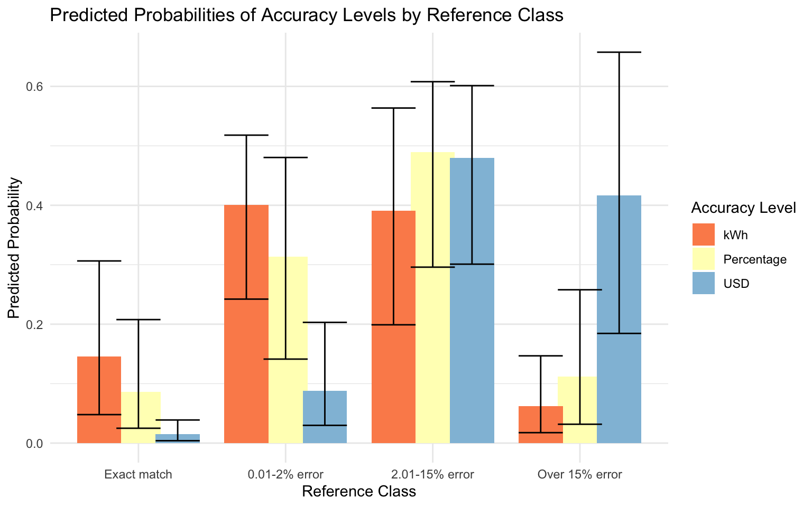

## Interaction model

``` r
# Fit the full model with interactions
ordinal_model_s2 <- brm(
  accuracy_level ~ refClass * rounded * pct_goal + (1|id) + (1|state),
  data = s2_agg1,
  family = cumulative("logit"),
  cores = 4,
  iter = 2000,
  control = list(adapt_delta = 0.99),
  prior = c(
    prior(normal(0, 2), class = "Intercept"),
    prior(normal(0, 2), class = "b")
  ),
  file = paste0(here::here("data/model_cache","s2_ordinal_full6.rds"))
)


pred_summary_s2 <- ordinal_model_s2 %>%
  epred_draws(newdata = s2_agg1, re_formula = NA) %>%
  group_by(refClass, rounded, pct_goal, .category) %>%
  summarise(
    mean_prob = mean(.epred),
    lower_ci = quantile(.epred, 0.025),
    upper_ci = quantile(.epred, 0.975),
    .groups = "drop"
  )

# |refClass   |rounded     |pct_goal |.category      | mean_prob| lower_ci| upper_ci|
# |:----------|:-----------|:--------|:--------------|---------:|--------:|--------:|
# |kWh        |Not Rounded |10%      |Exact match    |      0.09|     0.02|     0.25|
# |kWh        |Not Rounded |10%      |0.01-2% error  |      0.20|     0.06|     0.36|
# |kWh        |Not Rounded |10%      |2.01-15% error |      0.64|     0.38|     0.77|
# |kWh        |Not Rounded |10%      |Over 15% error |      0.07|     0.01|     0.19|
# |kWh        |Not Rounded |15%      |Exact match    |      0.19|     0.05|     0.44|
# |kWh        |Not Rounded |15%      |0.01-2% error  |      0.29|     0.14|     0.41|
# |kWh        |Not Rounded |15%      |2.01-15% error |      0.49|     0.22|     0.73|
# |kWh        |Not Rounded |15%      |Over 15% error |      0.03|     0.01|     0.09|
# |kWh        |Rounded     |10%      |Exact match    |      0.22|     0.06|     0.49|
# |kWh        |Rounded     |10%      |0.01-2% error  |      0.31|     0.16|     0.41|
# |kWh        |Rounded     |10%      |2.01-15% error |      0.45|     0.18|     0.71|
# |kWh        |Rounded     |10%      |Over 15% error |      0.02|     0.00|     0.07|
# |kWh        |Rounded     |15%      |Exact match    |      0.28|     0.07|     0.61|
# |kWh        |Rounded     |15%      |0.01-2% error  |      0.32|     0.18|     0.42|
# |kWh        |Rounded     |15%      |2.01-15% error |      0.38|     0.11|     0.68|
# |kWh        |Rounded     |15%      |Over 15% error |      0.02|     0.00|     0.06|
# |Percentage |Not Rounded |10%      |Exact match    |      0.04|     0.01|     0.13|
# |Percentage |Not Rounded |10%      |0.01-2% error  |      0.12|     0.03|     0.28|
# |Percentage |Not Rounded |10%      |2.01-15% error |      0.70|     0.53|     0.78|
# |Percentage |Not Rounded |10%      |Over 15% error |      0.14|     0.03|     0.38|
# |Percentage |Not Rounded |15%      |Exact match    |      0.10|     0.02|     0.29|
# |Percentage |Not Rounded |15%      |0.01-2% error  |      0.21|     0.06|     0.37|
# |Percentage |Not Rounded |15%      |2.01-15% error |      0.63|     0.34|     0.77|
# |Percentage |Not Rounded |15%      |Over 15% error |      0.07|     0.01|     0.20|
# |Percentage |Rounded     |10%      |Exact match    |      0.15|     0.03|     0.40|
# |Percentage |Rounded     |10%      |0.01-2% error  |      0.26|     0.09|     0.39|
# |Percentage |Rounded     |10%      |2.01-15% error |      0.55|     0.24|     0.75|
# |Percentage |Rounded     |10%      |Over 15% error |      0.04|     0.01|     0.13|
# |Percentage |Rounded     |15%      |Exact match    |      0.13|     0.03|     0.35|
# |Percentage |Rounded     |15%      |0.01-2% error  |      0.25|     0.09|     0.39|
# |Percentage |Rounded     |15%      |2.01-15% error |      0.57|     0.28|     0.76|
# |Percentage |Rounded     |15%      |Over 15% error |      0.05|     0.01|     0.14|
# |USD        |Not Rounded |10%      |Exact match    |      0.02|     0.00|     0.07|
# |USD        |Not Rounded |10%      |0.01-2% error  |      0.07|     0.01|     0.19|
# |USD        |Not Rounded |10%      |2.01-15% error |      0.67|     0.42|     0.78|
# |USD        |Not Rounded |10%      |Over 15% error |      0.24|     0.06|     0.56|
# |USD        |Not Rounded |15%      |Exact match    |      0.06|     0.01|     0.18|
# |USD        |Not Rounded |15%      |0.01-2% error  |      0.14|     0.03|     0.32|
# |USD        |Not Rounded |15%      |2.01-15% error |      0.68|     0.47|     0.78|
# |USD        |Not Rounded |15%      |Over 15% error |      0.13|     0.02|     0.37|
# |USD        |Rounded     |10%      |Exact match    |      0.05|     0.01|     0.18|
# |USD        |Rounded     |10%      |0.01-2% error  |      0.13|     0.03|     0.32|
# |USD        |Rounded     |10%      |2.01-15% error |      0.68|     0.47|     0.78|
# |USD        |Rounded     |10%      |Over 15% error |      0.13|     0.02|     0.37|
# |USD        |Rounded     |15%      |Exact match    |      0.04|     0.01|     0.14|
# |USD        |Rounded     |15%      |0.01-2% error  |      0.11|     0.02|     0.28|
# |USD        |Rounded     |15%      |2.01-15% error |      0.69|     0.50|     0.78|
# |USD        |Rounded     |15%      |Over 15% error |      0.15|     0.03|     0.41|


# Extract posterior samples
posterior_samples_s2 <- as.data.frame(ordinal_model_s2)


odds_ratios_s2 <- posterior_samples_s2 %>%
    transmute(
        refClass_Percentage_vs_kWh = exp(b_refClassPercentage),
        refClass_USD_vs_kWh = exp(b_refClassUSD),
        rounded_Yes_vs_No = exp(b_roundedRounded),
        pct_goal_15_vs_10 = exp(`b_pct_goal15%`)  # Note the backticks here
    )
# Calculate summary statistics
odds_ratio_summary_s2 <- data.frame(
    comparison = c("Percentage vs kWh", "USD vs kWh", "Rounded vs Not", "15% Goal vs 10% Goal"),
    odds_ratio = c(
        mean(odds_ratios_s2$refClass_Percentage_vs_kWh),
        mean(odds_ratios_s2$refClass_USD_vs_kWh),
        mean(odds_ratios_s2$rounded_Yes_vs_No),
        mean(odds_ratios_s2$pct_goal_15_vs_10)
    ),
    ci_lower = c(
        quantile(odds_ratios_s2$refClass_Percentage_vs_kWh, 0.025),
        quantile(odds_ratios_s2$refClass_USD_vs_kWh, 0.025),
        quantile(odds_ratios_s2$rounded_Yes_vs_No, 0.025),
        quantile(odds_ratios_s2$pct_goal_15_vs_10, 0.025)
    ),
    ci_upper = c(
        quantile(odds_ratios_s2$refClass_Percentage_vs_kWh, 0.975),
        quantile(odds_ratios_s2$refClass_USD_vs_kWh, 0.975),
        quantile(odds_ratios_s2$rounded_Yes_vs_No, 0.975),
        quantile(odds_ratios_s2$pct_goal_15_vs_10, 0.975)
    )
)

#  odds_ratio_summary_s2
#             comparison odds_ratio ci_lower ci_upper
# 1    Percentage vs kWh       3.31     0.43     11.3
# 2           USD vs kWh       6.64     0.84     25.2
# 3       Rounded vs Not       0.41     0.09      1.1
# 4 15% Goal vs 10% Goal       0.51     0.12      1.5


odds_ratio_summary_s2 |> kable()
```

| comparison           | odds_ratio | ci_lower | ci_upper |
|:---------------------|-----------:|---------:|---------:|
| Percentage vs kWh    |       3.31 |     0.43 |     11.2 |
| USD vs kWh           |       6.64 |     0.84 |     25.2 |
| Rounded vs Not       |       0.41 |     0.09 |      1.1 |
| 15% Goal vs 10% Goal |       0.51 |     0.12 |      1.5 |

``` r
s2_agg1 <- s2_agg1 %>%
  mutate(
    refClass = factor(refClass, levels = c("kWh", "Percentage", "USD")),
    rounded = factor(rounded, levels = c("Not Rounded", "Rounded")),
    pct_goal = factor(pct_goal, levels = c("10%", "15%"))
  )

# Fit the full model with interactions
ordinal_model_s2 <- brm(
  accuracy_level ~ refClass * rounded * pct_goal + (1|id) + (1|state),
  data = s2_agg1,
  family = cumulative("logit"),
  cores = 4,
  iter = 2000,
  control = list(adapt_delta = 0.99),
  prior = c(
    prior(normal(0, 2), class = "Intercept"),
    prior(normal(0, 2), class = "b")
  ),
  file = paste0(here::here("data/model_cache","s2_ordinal_full6.rds"))
)


pred_summary_s2 <- ordinal_model_s2 %>%
  epred_draws(newdata = s2_agg1, re_formula = NA) %>%
  group_by(refClass, rounded, pct_goal, .category) %>%
  summarise(
    mean_prob = mean(.epred),
    lower_ci = quantile(.epred, 0.025),
    upper_ci = quantile(.epred, 0.975),
    .groups = "drop"
  )

# Extract posterior samples
posterior_samples_s2 <- as.data.frame(ordinal_model_s2)

# Compute odds ratios for the predictors
odds_ratios_s2 <- posterior_samples_s2 %>%
  transmute(
    refClass_Percentage_vs_kWh = exp(b_refClassPercentage),
    refClass_USD_vs_kWh = exp(b_refClassUSD),
    rounded_Yes_vs_No = exp(b_roundedRounded),
    pct_goal_15_vs_10 = exp(`b_pct_goal15%`)  # Note the backticks here
  )

# Summarize odds ratios
odds_ratio_summary_s2 <- odds_ratios_s2 %>%
  summarise(
    Percentage_vs_kWh = mean(refClass_Percentage_vs_kWh),
    USD_vs_kWh = mean(refClass_USD_vs_kWh),
    Rounded_vs_Not = mean(rounded_Yes_vs_No),
    Goal15_vs_Goal10 = mean(pct_goal_15_vs_10)
  )

odds_ratio_summary_s2
#   Percentage_vs_kWh USD_vs_kWh Rounded_vs_Not Goal15_vs_Goal10
# 1               3.3        6.6           0.41             0.51
```
