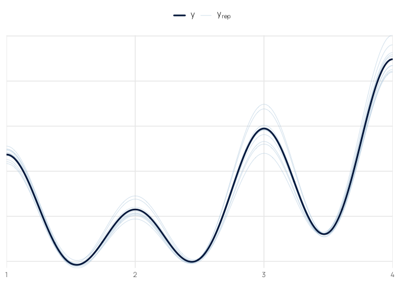
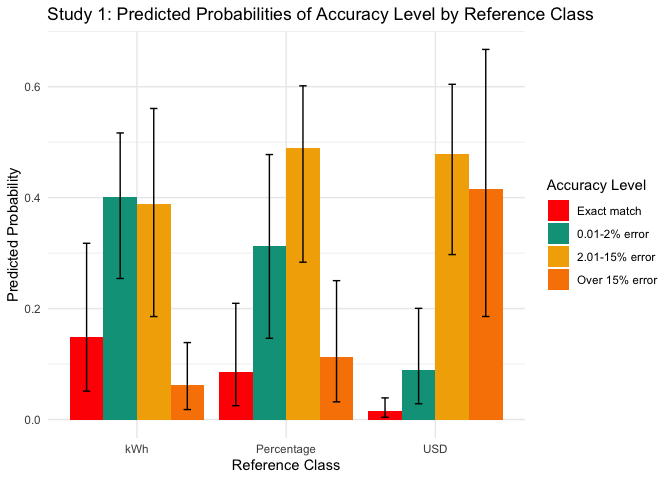
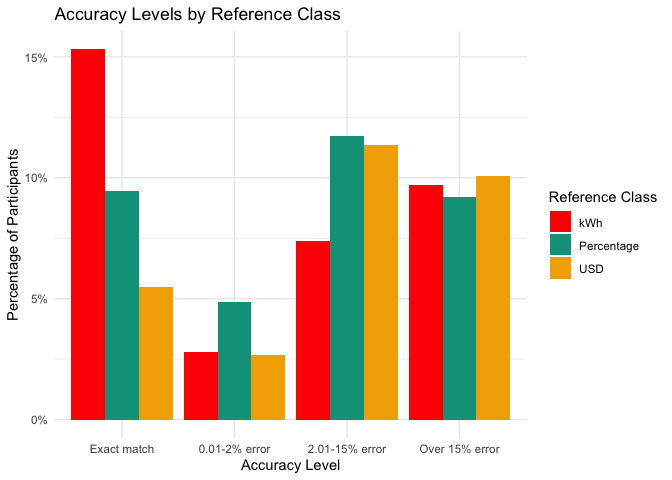
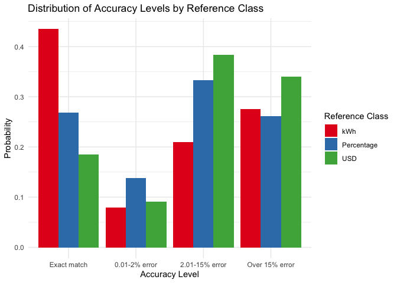
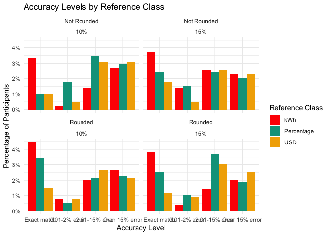
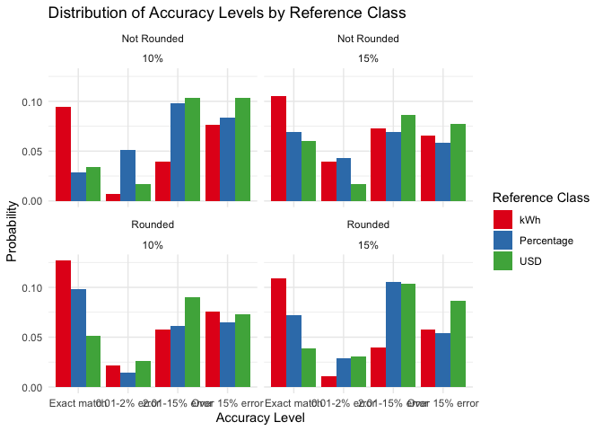
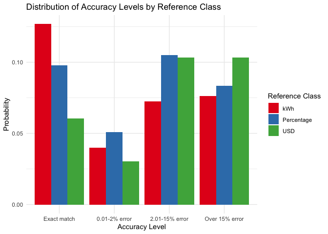
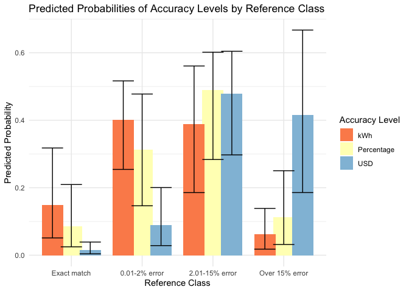

``` r
pacman::p_load(dplyr,purrr,tidyr,here,tibble,brms,rstan,bayestestR,emmeans,tidybayes,modelsummary,
               ggplot2,gt,knitr,kableExtra,ggh4x,lme4,flextable,pander)
options(digits=2, scipen=999, dplyr.summarise.inform=FALSE)
walk(c("fun_plot"), ~ source(here::here(paste0("scripts/", .x, ".R"))))
theme_set(theme_nice())
options(brms.backend="cmdstanr",mc.cores=4)

s1 <- readRDS(here::here("data/s1_processed.rds")) |> filter(!(id %in% readRDS(here::here("data/s1_discrep_ids.rds"))))
s2_long <- readRDS(here::here("data/s2_processed.rds")) |> filter(!(id %in% readRDS(here::here("data/s2_discrep_ids.rds"))))
```

## Fit Ordinal model accuracy_level ~ refClass + (1\|id) + (1\|state)

``` r
ordinal_model_s1 <- brm(
    accuracy_level ~ refClass + (1|id) + (1|state),
    data = s1_agg,
    family = cumulative("logit"),
    cores = 4,
    iter = 2000,
    control = list(adapt_delta = 0.99), 
    prior = c(prior(normal(0, 2), class = "Intercept"), 
                prior(normal(0, 1.5), class = "b")), 
    file = paste0(here::here("data/model_cache",'s1_ordinal3.rds')) 
)

summary(ordinal_model_s1)
```

     Family: cumulative 
      Links: mu = logit; disc = identity 
    Formula: accuracy_level ~ refClass + (1 | id) + (1 | state) 
       Data: s1_agg (Number of observations: 940) 
      Draws: 4 chains, each with iter = 2000; warmup = 1000; thin = 1;
             total post-warmup draws = 4000

    Multilevel Hyperparameters:
    ~id (Number of levels: 235) 
                  Estimate Est.Error l-95% CI u-95% CI Rhat Bulk_ESS Tail_ESS
    sd(Intercept)     3.69      0.28     3.17     4.29 1.00     1280     2107

    ~state (Number of levels: 4) 
                  Estimate Est.Error l-95% CI u-95% CI Rhat Bulk_ESS Tail_ESS
    sd(Intercept)     0.73      0.48     0.24     2.04 1.00     1561     2190

    Regression Coefficients:
                       Estimate Est.Error l-95% CI u-95% CI Rhat Bulk_ESS Tail_ESS
    Intercept[1]          -1.85      0.56    -2.92    -0.75 1.00     1144     2042
    Intercept[2]           0.22      0.55    -0.82     1.34 1.00     1185     2062
    Intercept[3]           2.86      0.56     1.83     4.00 1.00     1271     2210
    refClassPercentage     0.65      0.59    -0.48     1.82 1.00      764     1403
    refClassUSD            2.48      0.56     1.41     3.64 1.00      818     1626

    Further Distributional Parameters:
         Estimate Est.Error l-95% CI u-95% CI Rhat Bulk_ESS Tail_ESS
    disc     1.00      0.00     1.00     1.00   NA       NA       NA

    Draws were sampled using sampling(NUTS). For each parameter, Bulk_ESS
    and Tail_ESS are effective sample size measures, and Rhat is the potential
    scale reduction factor on split chains (at convergence, Rhat = 1).

``` r
pp_check(ordinal_model_s1)
```



``` r
describe_posterior(ordinal_model_s1, centrality = "Mode") |> 
    filter(stringr::str_detect(Parameter, "b_")) |> 
    mutate(Parameter = stringr::str_remove(Parameter, "b_")) |> 
    mutate(across(where(is.numeric), round, 3)) |> 
    kable(booktabs = TRUE)
```

| Parameter | Mode | CI | CI_low | CI_high | pd | ROPE_CI | ROPE_low | ROPE_high | ROPE_Percentage | Rhat | ESS |
|:-----------|----:|---:|-----:|-----:|---:|-----:|------:|------:|----------:|---:|---:|
| Intercept\[1\] | -1.40 | 0.95 | -2.92 | -0.75 | 1.00 | 0.95 | -0.18 | 0.18 | 0.00 | 1 | 1121 |
| Intercept\[2\] | 0.92 | 0.95 | -0.82 | 1.34 | 0.65 | 0.95 | -0.18 | 0.18 | 0.26 | 1 | 1152 |
| Intercept\[3\] | 3.52 | 0.95 | 1.83 | 4.00 | 1.00 | 0.95 | -0.18 | 0.18 | 0.00 | 1 | 1232 |
| refClassPercentage | 1.81 | 0.95 | -0.48 | 1.82 | 0.86 | 0.95 | -0.18 | 0.18 | 0.14 | 1 | 742 |
| refClassUSD | 2.88 | 0.95 | 1.41 | 3.64 | 1.00 | 0.95 | -0.18 | 0.18 | 0.00 | 1 | 799 |

``` r
# Get predicted probabilities
pred_summary <- ordinal_model_s1 |>
    epred_draws(newdata = data.frame(refClass = c("kWh", "Percentage", "USD")),
                ndraws = 1000, re_formula = NA) |>
    group_by(refClass, .category) |>
    summarise(
        mean_prob = mean(.epred),
        lower_ci = quantile(.epred, 0.025),
        upper_ci = quantile(.epred, 0.975)
    )
pred_summary |> pander::pandoc.table(caption="Study 1: Predicted probabilities of accuracy")
```


    ---------------------------------------------------------------
      refClass      .category      mean_prob   lower_ci   upper_ci 
    ------------ ---------------- ----------- ---------- ----------
     Percentage    Exact match      0.08555    0.02484     0.2095  

     Percentage   0.01-2% error     0.3128      0.1464     0.4777  

     Percentage   2.01-15% error    0.4895      0.2836     0.6016  

     Percentage   Over 15% error    0.1122      0.0318     0.2503  

        USD        Exact match      0.01524    0.004054   0.03897  

        USD       0.01-2% error     0.08952    0.02841     0.2004  

        USD       2.01-15% error    0.4794      0.2973     0.6043  

        USD       Over 15% error    0.4158      0.1857     0.6672  

        kWh        Exact match      0.1487     0.05118     0.3177  

        kWh       0.01-2% error     0.4013      0.2543     0.5166  

        kWh       2.01-15% error     0.388      0.1856     0.5607  

        kWh       Over 15% error    0.06191    0.01795     0.1387  
    ---------------------------------------------------------------

    Table: Study 1: Predicted probabilities of accuracy

``` r
# Convert log-odds to odds ratios
posterior_samples <- as.data.frame(ordinal_model_s1)
odds_ratios <- data.frame(
  Percentage_vs_kWh = exp(posterior_samples$b_refClassPercentage),
  USD_vs_kWh = exp(posterior_samples$b_refClassUSD)
)

# Calculate summary statistics
odds_ratio_summary <- data.frame(
    comparison = c("Percentage vs kWh", "USD vs kWh"),
    odds_ratio = c(mean(odds_ratios$Percentage_vs_kWh),
                    mean(odds_ratios$USD_vs_kWh)),
    ci_lower = c(quantile(odds_ratios$Percentage_vs_kWh, 0.025),
                quantile(odds_ratios$USD_vs_kWh, 0.025)),
    ci_upper = c(quantile(odds_ratios$Percentage_vs_kWh, 0.975),
                quantile(odds_ratios$USD_vs_kWh, 0.975))
)


odds_ratio_summary |> kable()
```

| comparison        | odds_ratio | ci_lower | ci_upper |
|:------------------|-----------:|---------:|---------:|
| Percentage vs kWh |        2.3 |     0.62 |      6.2 |
| USD vs kWh        |       14.1 |     4.08 |     38.0 |

``` r
# |comparison        | odds_ratio| ci_lower| ci_upper|
# |:-----------------|----------:|--------:|--------:|
# |Percentage vs kWh |        2.3|     0.62|      6.2|
# |USD vs kWh        |       14.1|     4.08|     38.0|


odds_ratio_summary |> pander::pandoc.table(caption="Study 1: Odds ratios of accuracy")
```


    ------------------------------------------------------
        comparison       odds_ratio   ci_lower   ci_upper 
    ------------------- ------------ ---------- ----------
     Percentage vs kWh     2.274       0.6178     6.148   

        USD vs kWh         14.09        4.08      38.04   
    ------------------------------------------------------

    Table: Study 1: Odds ratios of accuracy

``` r
# Plot predicted probabilities
ggplot(pred_summary, aes(x = refClass, y = mean_prob, fill = .category)) +
    geom_bar(stat = "identity", position = position_dodge()) +
    geom_errorbar(aes(ymin = lower_ci, ymax = upper_ci),
                    position = position_dodge(width = 0.9), width = 0.2) +
    labs(y = "Predicted Probability", x = "Reference Class", fill = "Accuracy Level") +
    ggtitle("Study 1: Predicted Probabilities of Accuracy Level by Reference Class") +
    theme_minimal()
```



| comparison        | odds_ratio | ci_lower | ci_upper |
|:------------------|-----------:|---------:|---------:|
| Percentage vs kWh |        2.3 |     0.62 |      6.2 |
| USD vs kWh        |       14.1 |     4.08 |     38.0 |

# Study 2

``` r
s2_agg1 <- s2_long |> 
  filter(appliance != "TOTAL") |> 
  group_by(id, state,refClass,pct,pct_goal,plan,rounded) |> 
  summarise(
    total_kWh = sum(value),
    orig_kWh = sum(family),
    pct_change = round((orig_kWh - total_kWh) / orig_kWh, 3),
    state_dif = mean(state_dif),
    .groups = "drop"
  ) |>
  mutate(matched_goal = (pct_change == pct),
                error = pct_change - pct,
                abs_error = abs(error)) |> 
      ungroup() |> # Add ungroup here
        mutate(
            accuracy_level = factor(
                case_when(
                    abs_error == 0.00 ~ "Exact match",
                    abs_error <= 0.02 ~ "0.01-2% error",
                    abs_error <= 0.15 ~ "2.01-15% error",
                    TRUE ~ "Over 15% error"  # Capture all remaining cases
                ), 
                levels = c("Exact match", "0.01-2% error", "2.01-15% error", "Over 15% error"),
                ordered = TRUE
            )
        )


ggplot(data = s2_agg1, aes(x = accuracy_level, fill = refClass)) +
  geom_bar(position = "dodge", aes(y = (..count..)/sum(..count..))) +
  scale_y_continuous(labels = scales::percent) +
  labs(title = "Accuracy Levels by Reference Class",
       x = "Accuracy Level",
       y = "Percentage of Participants",
       fill = "Reference Class") +
  theme_minimal()
```



``` r
observed_props2 <- s2_agg1 |>
  group_by(refClass, accuracy_level) |>
  summarise(n = n()) |>
  group_by(refClass) |>
  mutate(prop = n/sum(n)) |>
  pivot_wider(
    names_from = accuracy_level,
    values_from = c(n, prop)
  )

  # Calculate proportions
prop_acc_s2 <- s2_agg1 %>%
    group_by(refClass, accuracy_level) %>%
    summarise(count = n()) %>%
    group_by(refClass) %>%
    mutate(Probability = count / sum(count)) %>%
    ungroup()

# Plot
ggplot(prop_acc_s2, aes(x = accuracy_level, y = Probability, fill = refClass)) +
    geom_bar(stat = "identity", position = position_dodge()) +
    labs(title = "Distribution of Accuracy Levels by Reference Class",
        x = "Accuracy Level",
        y = "Probability",
        fill = "Reference Class") +
    theme_minimal() +
    scale_fill_brewer(palette = "Set1")
```



``` r
ggplot(data = s2_agg1, aes(x = accuracy_level, fill = refClass)) +
  geom_bar(position = "dodge", aes(y = (..count..)/sum(..count..))) +
  scale_y_continuous(labels = scales::percent) +
  labs(title = "Accuracy Levels by Reference Class",
       x = "Accuracy Level",
       y = "Percentage of Participants",
       fill = "Reference Class") +
  theme_minimal() + facet_wrap(~rounded+pct_goal)
```



``` r
prop4_acc_s2 <- s2_agg1 %>%
    group_by(refClass, accuracy_level,rounded,pct_goal) %>%
    summarise(count = n()) %>%
    group_by(refClass) %>%
    mutate(Probability = count / sum(count)) %>%
    ungroup()

# Plot


s2_agg1 %>%
    group_by( accuracy_level,rounded) %>%
    summarise(count = n()) %>%
    group_by(rounded) %>%
    mutate(Probability = count / sum(count)) %>%
    ungroup()
```

    # A tibble: 8 × 4
      accuracy_level rounded     count Probability
      <ord>          <chr>       <int>       <dbl>
    1 Exact match    Not Rounded   104      0.265 
    2 Exact match    Rounded       133      0.339 
    3 0.01-2% error  Not Rounded    47      0.120 
    4 0.01-2% error  Rounded        34      0.0867
    5 2.01-15% error Not Rounded   121      0.309 
    6 2.01-15% error Rounded       118      0.301 
    7 Over 15% error Not Rounded   120      0.306 
    8 Over 15% error Rounded       107      0.273 

``` r
ggplot(prop4_acc_s2, aes(x = accuracy_level, y = Probability, fill = refClass)) +
    geom_bar(stat = "identity", position = position_dodge()) +
    labs(title = "Distribution of Accuracy Levels by Reference Class",
        x = "Accuracy Level",
        y = "Probability",
        fill = "Reference Class") +
    theme_minimal() +
    scale_fill_brewer(palette = "Set1") + facet_wrap(~rounded+pct_goal)
```



``` r
ggplot(prop4_acc_s2, aes(x = accuracy_level, y = Probability, fill = refClass)) +
    geom_bar(stat = "identity", position = position_dodge()) +
    labs(title = "Distribution of Accuracy Levels by Reference Class",
        x = "Accuracy Level",
        y = "Probability",
        fill = "Reference Class") +
    theme_minimal() +
    scale_fill_brewer(palette = "Set1") 
```



# no interaction model used in MPA

``` r
s2_agg1 <- s2_agg1 %>%
  mutate(
    refClass = factor(refClass, levels = c("kWh", "Percentage", "USD")),
    rounded = factor(rounded, levels = c("Not Rounded", "Rounded")),
    pct_goal = factor(pct_goal, levels = c("10%", "15%"))
  )


ordinal_model_s2_probit <- brm(
  accuracy_level ~ refClass +rounded+pct_goal + (1|id)+ (1|state),
  data = s2_agg1,
  family = cumulative("probit"),
  cores = 4,
  iter = 2000,
  control = list(adapt_delta = 0.99), # Recommended for ordinal models
  prior = c(prior(normal(0, 2), class = "Intercept"),  # Priors for thresholds
            prior(normal(0, 2), class = "b")), # Priors for predictors
  file = paste0(here::here("data/model_cache",'s2_op.rds')) # Cache for efficiency
)

summary(ordinal_model_s2_probit)
```

     Family: cumulative 
      Links: mu = probit; disc = identity 
    Formula: accuracy_level ~ refClass + rounded + pct_goal + (1 | id) + (1 | state) 
       Data: s2_agg1 (Number of observations: 784) 
      Draws: 4 chains, each with iter = 2000; warmup = 1000; thin = 1;
             total post-warmup draws = 4000

    Multilevel Hyperparameters:
    ~id (Number of levels: 196) 
                  Estimate Est.Error l-95% CI u-95% CI Rhat Bulk_ESS Tail_ESS
    sd(Intercept)     2.58      0.22     2.18     3.03 1.01      539     1502

    ~state (Number of levels: 4) 
                  Estimate Est.Error l-95% CI u-95% CI Rhat Bulk_ESS Tail_ESS
    sd(Intercept)     0.28      0.28     0.02     1.06 1.01      877     1127

    Regression Coefficients:
                       Estimate Est.Error l-95% CI u-95% CI Rhat Bulk_ESS Tail_ESS
    Intercept[1]          -1.12      0.38    -1.88    -0.37 1.01      686     1070
    Intercept[2]          -0.28      0.38    -1.04     0.47 1.01      693     1085
    Intercept[3]           1.81      0.38     1.04     2.56 1.01      702     1248
    refClassPercentage     0.58      0.45    -0.32     1.49 1.01      446      741
    refClassUSD            1.19      0.47     0.29     2.11 1.01      583     1087
    roundedRounded        -0.37      0.10    -0.57    -0.17 1.00     5613     2928
    pct_goal15%           -0.26      0.10    -0.46    -0.06 1.00     5136     2842

    Further Distributional Parameters:
         Estimate Est.Error l-95% CI u-95% CI Rhat Bulk_ESS Tail_ESS
    disc     1.00      0.00     1.00     1.00   NA       NA       NA

    Draws were sampled using sample(hmc). For each parameter, Bulk_ESS
    and Tail_ESS are effective sample size measures, and Rhat is the potential
    scale reduction factor on split chains (at convergence, Rhat = 1).

``` r
# Regression Coefficients:
#                    Estimate Est.Error l-95% CI u-95% CI Rhat Bulk_ESS Tail_ESS
# Intercept[1]          -1.12      0.38    -1.88    -0.37 1.01      686     1070
# Intercept[2]          -0.28      0.38    -1.04     0.47 1.01      693     1085
# Intercept[3]           1.81      0.38     1.04     2.56 1.01      702     1248
# refClassPercentage     0.58      0.45    -0.32     1.49 1.01      446      741
# refClassUSD            1.19      0.47     0.29     2.11 1.01      583     1087
# roundedRounded        -0.37      0.10    -0.57    -0.17 1.00     5613     2928
# pct_goal15%           -0.26      0.10    -0.46    -0.06 1.00     5136     2842

pred_summary_s2 <- ordinal_model_s2_probit %>%
  epred_draws(newdata = s2_agg1, re_formula = NA) %>%
  group_by(refClass, rounded, pct_goal, .category) %>%
  summarise(
    mean_prob = mean(.epred),
    lower_ci = quantile(.epred, 0.025),
    upper_ci = quantile(.epred, 0.975),
    .groups = "drop"
  )

pred_summary_s2 |> pander::pandoc.table(caption="Study 1: Predicted probabilities of accuracy level by reference class")
```


    ------------------------------------------------------------------------------
      refClass      rounded     pct_goal     .category      mean_prob   lower_ci  
    ------------ ------------- ---------- ---------------- ----------- -----------
        kWh       Not Rounded     10%       Exact match      0.1472      0.03015  

        kWh       Not Rounded     10%      0.01-2% error     0.2488      0.1166   

        kWh       Not Rounded     10%      2.01-15% error    0.5584      0.3113   

        kWh       Not Rounded     10%      Over 15% error    0.04553    0.005226  

        kWh       Not Rounded     15%       Exact match      0.2098      0.0519   

        kWh       Not Rounded     15%      0.01-2% error     0.2817      0.1627   

        kWh       Not Rounded     15%      2.01-15% error    0.4818       0.23    

        kWh       Not Rounded     15%      Over 15% error    0.02668    0.002531  

        kWh         Rounded       10%       Exact match      0.2402      0.06674  

        kWh         Rounded       10%      0.01-2% error     0.2918      0.1812   

        kWh         Rounded       10%      2.01-15% error    0.4469      0.1954   

        kWh         Rounded       10%      Over 15% error    0.02105    0.001662  

        kWh         Rounded       15%       Exact match      0.3216      0.1056   

        kWh         Rounded       15%      0.01-2% error      0.305      0.2139   

        kWh         Rounded       15%      2.01-15% error    0.3619      0.1353   

        kWh         Rounded       15%      Over 15% error    0.01149    0.0007068 

     Percentage   Not Rounded     10%       Exact match      0.05624    0.006472  

     Percentage   Not Rounded     10%      0.01-2% error     0.1537      0.04267  

     Percentage   Not Rounded     10%      2.01-15% error    0.6626      0.4985   

     Percentage   Not Rounded     10%      Over 15% error    0.1275      0.02203  

     Percentage   Not Rounded     15%       Exact match      0.08897     0.01365  

     Percentage   Not Rounded     15%      0.01-2% error     0.1968      0.07105  

     Percentage   Not Rounded     15%      2.01-15% error    0.6303      0.4219   

     Percentage   Not Rounded     15%      Over 15% error    0.08395     0.01235  

     Percentage     Rounded       10%       Exact match      0.1062      0.01689  

     Percentage     Rounded       10%      0.01-2% error     0.2148      0.08276  

     Percentage     Rounded       10%      2.01-15% error    0.6096       0.381   

     Percentage     Rounded       10%      Over 15% error    0.06943    0.008626  

     Percentage     Rounded       15%       Exact match      0.1572      0.03291  

     Percentage     Rounded       15%      0.01-2% error     0.2544      0.1193   

     Percentage     Rounded       15%      2.01-15% error    0.5457      0.2929   

     Percentage     Rounded       15%      Over 15% error    0.04273    0.004174  

        USD       Not Rounded     10%       Exact match      0.01654    0.0008973 

        USD       Not Rounded     10%      0.01-2% error     0.06991     0.01107  

        USD       Not Rounded     10%      2.01-15% error    0.6277      0.4217   

        USD       Not Rounded     10%      Over 15% error    0.2859      0.07566  

        USD       Not Rounded     15%       Exact match      0.0291     0.002112  

        USD       Not Rounded     15%      0.01-2% error     0.1013      0.02037  

        USD       Not Rounded     15%      2.01-15% error    0.6594      0.4985   

        USD       Not Rounded     15%      Over 15% error    0.2103      0.04502  

        USD         Rounded       10%       Exact match      0.03619    0.003047  

        USD         Rounded       10%      0.01-2% error     0.1165      0.02681  

        USD         Rounded       10%      2.01-15% error    0.6649      0.5111   

        USD         Rounded       10%      Over 15% error    0.1824      0.03351  

        USD         Rounded       15%       Exact match      0.05954     0.00658  

        USD         Rounded       15%      0.01-2% error     0.1564      0.04406  

        USD         Rounded       15%      2.01-15% error    0.6581      0.4846   

        USD         Rounded       15%      Over 15% error     0.126      0.01841  
    ------------------------------------------------------------------------------

    Table: Study 1: Predicted probabilities of accuracy level by reference class (continued below)

     
    ----------
     upper_ci 
    ----------
      0.3559  

      0.3539  

      0.7192  

      0.1491  

      0.4462  

      0.369   

      0.6909  

     0.09281  

      0.4975  

      0.3721  

      0.6714  

     0.07903  

      0.5866  

      0.3772  

      0.6052  

     0.04704  

      0.1734  

      0.2928  

      0.7472  

      0.3233  

      0.2484  

      0.3258  

      0.7401  

      0.2368  

      0.2834  

      0.3372  

      0.7359  

      0.2074  

      0.3708  

      0.358   

      0.7169  

      0.1407  

     0.06815  

      0.1911  

      0.7406  

      0.5628  

      0.1099  

      0.2363  

      0.7476  

      0.4625  

      0.1346  

      0.2582  

      0.7482  

      0.419   

      0.1955  

      0.2983  

      0.7473  

      0.3265  
    ----------

``` r
# Extract posterior samples
posterior_samples_s2 <- as.data.frame(ordinal_model_s2_probit)


odds_ratios_s2 <- posterior_samples_s2 %>%
    transmute(
        refClass_Percentage_vs_kWh = exp(b_refClassPercentage),
        refClass_USD_vs_kWh = exp(b_refClassUSD),
        rounded_Yes_vs_No = exp(b_roundedRounded),
        pct_goal_15_vs_10 = exp(`b_pct_goal15%`)  # Note the backticks here
    )


# Calculate summary statistics
odds_ratio_summary_s2 <- data.frame(
    comparison = c("Percentage vs kWh", "USD vs kWh", "Rounded vs Not", "15% Goal vs 10% Goal"),
    odds_ratio = c(
        mean(odds_ratios_s2$refClass_Percentage_vs_kWh),
        mean(odds_ratios_s2$refClass_USD_vs_kWh),
        mean(odds_ratios_s2$rounded_Yes_vs_No),
        mean(odds_ratios_s2$pct_goal_15_vs_10)
    ),
    ci_lower = c(
        quantile(odds_ratios_s2$refClass_Percentage_vs_kWh, 0.025),
        quantile(odds_ratios_s2$refClass_USD_vs_kWh, 0.025),
        quantile(odds_ratios_s2$rounded_Yes_vs_No, 0.025),
        quantile(odds_ratios_s2$pct_goal_15_vs_10, 0.025)
    ),
    ci_upper = c(
        quantile(odds_ratios_s2$refClass_Percentage_vs_kWh, 0.975),
        quantile(odds_ratios_s2$refClass_USD_vs_kWh, 0.975),
        quantile(odds_ratios_s2$rounded_Yes_vs_No, 0.975),
        quantile(odds_ratios_s2$pct_goal_15_vs_10, 0.975)
    )
)

#             comparison odds_ratio ci_lower ci_upper
# 1    Percentage vs kWh       1.99     0.73     4.43
# 2           USD vs kWh       3.69     1.33     8.29
# 3       Rounded vs Not       0.70     0.57     0.84
# 4 15% Goal vs 10% Goal       0.78     0.63     0.94

odds_ratio_summary_s2 |> kable()
```

| comparison           | odds_ratio | ci_lower | ci_upper |
|:---------------------|-----------:|---------:|---------:|
| Percentage vs kWh    |       1.99 |     0.73 |     4.43 |
| USD vs kWh           |       3.69 |     1.33 |     8.29 |
| Rounded vs Not       |       0.70 |     0.57 |     0.84 |
| 15% Goal vs 10% Goal |       0.78 |     0.63 |     0.94 |

``` r
odds_ratio_summary_s2 |> pander::pandoc.table(caption="Study 2: Odds ratios of accuracy")
```


    ---------------------------------------------------------
          comparison        odds_ratio   ci_lower   ci_upper 
    ---------------------- ------------ ---------- ----------
      Percentage vs kWh       1.989       0.7262     4.425   

          USD vs kWh          3.691       1.334      8.288   

        Rounded vs Not        0.6959      0.5656     0.8446  

     15% Goal vs 10% Goal     0.7757      0.6301     0.9396  
    ---------------------------------------------------------

    Table: Study 2: Odds ratios of accuracy

``` r
ggplot(pred_summary, 
        aes(x = .category, y = mean_prob, fill = refClass )) +
    geom_col(position = position_dodge(width = 0.8)) +
    geom_errorbar(aes(ymin = lower_ci, ymax = upper_ci), 
                    position = position_dodge(width = 0.8)) +
    labs(x = "Reference Class", 
        y = "Predicted Probability",
        fill = "Accuracy Level",
        title = "Predicted Probabilities of Accuracy Levels by Reference Class") +
    scale_fill_brewer(palette = "RdYlBu") +
    theme_minimal() 
```



| comparison           | odds_ratio | ci_lower | ci_upper |
|:---------------------|-----------:|---------:|---------:|
| Percentage vs kWh    |       1.99 |     0.73 |     4.43 |
| USD vs kWh           |       3.69 |     1.33 |     8.29 |
| Rounded vs Not       |       0.70 |     0.57 |     0.84 |
| 15% Goal vs 10% Goal |       0.78 |     0.63 |     0.94 |
