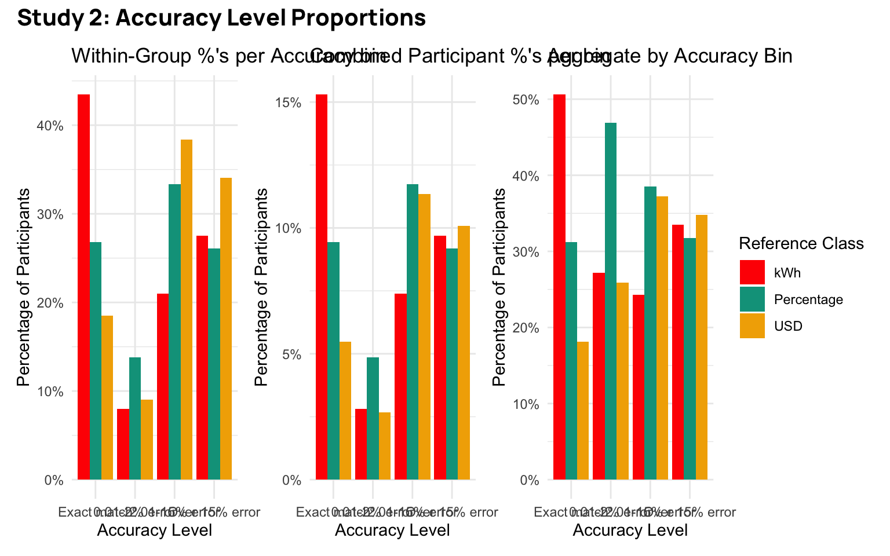

# Results Overview


<link href="../site_libs/htmltools-fill-0.5.8.1/fill.css" rel="stylesheet" />
<script src="../site_libs/htmlwidgets-1.6.4/htmlwidgets.js"></script>
<link href="../site_libs/datatables-css-0.0.0/datatables-crosstalk.css" rel="stylesheet" />
<script src="../site_libs/datatables-binding-0.33/datatables.js"></script>
<script src="../site_libs/jquery-3.6.0/jquery-3.6.0.min.js"></script>
<link href="../site_libs/dt-core-1.13.6/css/jquery.dataTables.min.css" rel="stylesheet" />
<link href="../site_libs/dt-core-1.13.6/css/jquery.dataTables.extra.css" rel="stylesheet" />
<script src="../site_libs/dt-core-1.13.6/js/jquery.dataTables.min.js"></script>
<script src="../site_libs/jszip-1.13.6/jszip.min.js"></script>
<script src="../site_libs/pdfmake-1.13.6/pdfmake.js"></script>
<script src="../site_libs/pdfmake-1.13.6/vfs_fonts.js"></script>
<link href="../site_libs/dt-ext-buttons-1.13.6/css/buttons.dataTables.min.css" rel="stylesheet" />
<script src="../site_libs/dt-ext-buttons-1.13.6/js/dataTables.buttons.min.js"></script>
<script src="../site_libs/dt-ext-buttons-1.13.6/js/buttons.html5.min.js"></script>
<script src="../site_libs/dt-ext-buttons-1.13.6/js/buttons.colVis.min.js"></script>
<script src="../site_libs/dt-ext-buttons-1.13.6/js/buttons.print.min.js"></script>
<link href="../site_libs/nouislider-7.0.10/jquery.nouislider.min.css" rel="stylesheet" />
<script src="../site_libs/nouislider-7.0.10/jquery.nouislider.min.js"></script>
<link href="../site_libs/selectize-0.12.0/selectize.bootstrap3.css" rel="stylesheet" />
<script src="../site_libs/selectize-0.12.0/selectize.min.js"></script>
<link href="../site_libs/crosstalk-1.2.1/css/crosstalk.min.css" rel="stylesheet" />
<script src="../site_libs/crosstalk-1.2.1/js/crosstalk.min.js"></script>

``` r
pacman::p_load(dplyr,purrr,tidyr,stringr,here,tibble,ggplot2,gt,knitr,kableExtra,ggh4x,patchwork,lme4,flextable,pander)

options(digits=2, scipen=999, dplyr.summarise.inform=FALSE)
walk(c("fun_plot"), ~ source(here::here(paste0("scripts/", .x, ".R"))))
theme_set(theme_nice())

s1 <- readRDS(here::here("data/s1_processed.rds")) |> 
  filter(!(id %in% readRDS(here::here("data/s1_discrep_ids.rds")))) |> 
  mutate(refClass = factor(refClass, levels=c("kWh","Percentage","USD")))


s2_long <- readRDS(here::here("data/s2_processed.rds")) |> 
  filter(!(id %in% readRDS(here::here("data/s2_discrep_ids.rds")))) |> 
  mutate(refClass = factor(refClass, levels=c("kWh","Percentage","USD")))

state_code_map <- c(
  "CAL" = "California",
  "TEX" = "Texas",
  "COL" = "Colorado",
  "MASS" = "Massachusetts"
)


state_to_code <- state_code_map
code_to_state <- setNames(names(state_code_map), state_code_map)
lookup_code <- function(state) {
  if (state %in% names(state_to_code)) {
    return(state_to_code[[state]])
  } else if (state %in% names(code_to_state)) {
    return(code_to_state[[state]])
  } else {
    return(NA)  # Return NA if not found in either mapping
  }
}
```

### Study 1 Subject Counts

``` r
# total subjects
n_s1 <- s1 |> ungroup() |> summarise(n=n_distinct(id))
n_s1_removed <-  readRDS(here::here("data/s1_discrep_ids.rds")) |> length()

print(paste("Study 1: Total subjects:", n_s1$n, "Removed subjects:", n_s1_removed))
```

    [1] "Study 1: Total subjects: 235 Removed subjects: 17"

``` r
s1 |> group_by(refClass) |> 
    rename("Reference Class" = refClass) |>
    summarise(n=n_distinct(id)) |> 
    pander::pandoc.table(caption="Study 1: Number of unique IDs per condition")
```


    ----------------------
     Reference Class   n  
    ----------------- ----
           kWh         78 

       Percentage      68 

           USD         89 
    ----------------------

    Table: Study 1: Number of unique IDs per condition

``` r
s1 |> group_by(refClass,state) |> 
    rename("Reference Class" = refClass) |>
    summarise(n=n_distinct(id)) |> 
    rowwise() |> 
    mutate(state=lookup_code(state)) |> 
    pivot_wider(names_from=state,values_from=n) |>
    pander::pandoc.table(caption="Study 1: Number of unique IDs per condition by state")
```


    -----------------------------------------------------------------
     Reference Class   California   Colorado   Massachusetts   Texas 
    ----------------- ------------ ---------- --------------- -------
           kWh             36          36           42          42   

       Percentage          39          26           42          29   

           USD             40          45           44          49   
    -----------------------------------------------------------------

    Table: Study 1: Number of unique IDs per condition by state

``` r
s1 |> group_by(refClass,calc) |> 
    rename("Reference Class" = refClass) |>
    summarise(n=n_distinct(id)) |> 
    pivot_wider(names_from=calc,values_from=n) |>
    pander::pandoc.table(caption="Study 1: Number of unique IDs per condition by calculator use")
```


    ---------------------------------------------------
     Reference Class   No Calculator   Used Calculator 
    ----------------- --------------- -----------------
           kWh              20               58        

       Percentage           12               56        

           USD              25               64        
    ---------------------------------------------------

    Table: Study 1: Number of unique IDs per condition by calculator use

``` r
prop.table(xtabs(~refClass,s1)) |> kable()
```

| refClass   | Freq |
|:-----------|-----:|
| kWh        | 0.33 |
| Percentage | 0.29 |
| USD        | 0.38 |

``` r
prop.table(xtabs(~refClass+calc,s1)) |> kable()
```

|            | No Calculator | Used Calculator |
|:-----------|--------------:|----------------:|
| kWh        |          0.09 |            0.25 |
| Percentage |          0.05 |            0.24 |
| USD        |          0.11 |            0.27 |

``` r
prop.table(xtabs(~refClass+state,s1)) |> kable()
```

|            |  CAL |  COL | MASS |  TEX |
|:-----------|-----:|-----:|-----:|-----:|
| kWh        | 0.08 | 0.08 | 0.09 | 0.09 |
| Percentage | 0.08 | 0.06 | 0.09 | 0.06 |
| USD        | 0.09 | 0.10 | 0.09 | 0.10 |

### Study 2 - Subject counts

``` r
n_s2 <- s2_long |> ungroup() |> summarise(n=n_distinct(id))
n_s2_removed <-  readRDS(here::here("data/s2_discrep_ids.rds")) |> length()

print(paste("Study 2: Total subjects:", n_s2$n, "Removed subjects:", n_s2_removed))
```

    [1] "Study 2: Total subjects: 196 Removed subjects: 10"

``` r
s2_long |> group_by(refClass) |>
    rename("Reference Class" = refClass) |>
    summarise(n=n_distinct(id)) |> 
    pander::pandoc.table(caption="Study 2: Number of unique IDs per condition")
```


    ----------------------
     Reference Class   n  
    ----------------- ----
           kWh         69 

       Percentage      69 

           USD         58 
    ----------------------

    Table: Study 2: Number of unique IDs per condition

``` r
s2_long |> group_by(refClass,calc) |>
    rename("Reference Class" = refClass) |>
    mutate(calc=case_when(calc=="Calculator" ~ "Used Calculator",
                        calc=="No Calculator" ~ "No Calculator")) |>
    summarise(n=n_distinct(id)) |>
    pivot_wider(names_from=calc,values_from=n) |>
    pander::pandoc.table(caption="Study 2: Number of unique IDs per condition by calculator use")
```


    ---------------------------------------------------
     Reference Class   No Calculator   Used Calculator 
    ----------------- --------------- -----------------
           kWh              12               57        

       Percentage           11               58        

           USD              12               46        
    ---------------------------------------------------

    Table: Study 2: Number of unique IDs per condition by calculator use

``` r
prop.table(xtabs(~refClass,s2_long)) |> kable()
```

| refClass   | Freq |
|:-----------|-----:|
| kWh        | 0.35 |
| Percentage | 0.35 |
| USD        | 0.30 |

``` r
prop.table(xtabs(~refClass+state,s2_long))
```

                state
    refClass     California Colorado Massachusetts Texas
      kWh             0.089    0.102         0.074 0.087
      Percentage      0.089    0.084         0.092 0.087
      USD             0.079    0.069         0.079 0.069

``` r
prop.table(xtabs(~refClass+calc,
s2_long |> mutate(calc=case_when(calc=="Calculator" ~ "Used Calculator",
                      calc=="No Calculator" ~ "No Calculator")))) |> kable()
```

|            | No Calculator | Used Calculator |
|:-----------|--------------:|----------------:|
| kWh        |          0.06 |            0.29 |
| Percentage |          0.06 |            0.30 |
| USD        |          0.06 |            0.23 |

## Performance

### Study 1

``` r
s1_agg <- s1 |> 
    filter(appliance !="Total kWh") |> 
    group_by(id,refClass,state,block,plan,calc,edu,pct_goal) |> 
    summarise(total_kWh = sum(value),orig_kWh=sum(family), 
                pct_change = round((orig_kWh-total_kWh)/orig_kWh,3), 
                n_change = sum(value!=family),
                state_p_dif=mean(state_p_dif),
                state_f_dif=mean(state_f_dif),
                n_less_avg = sum(less_avg),
                duration=first(Duration__in_seconds_)) |> 
    mutate(matched_goal = (pct_change == pct_goal), 
                error = pct_change - pct_goal,
                abs_error = abs(error),
                close_match = abs_error <= 0.03)

s1_agg4 <- s1_agg |> group_by(id,refClass) |> 
    summarise(mg=sum(matched_goal),n=n(), pct=mg/n) 


# overall pct of subjects who matched their goal
s1_agg4 |> ungroup() |>
    summarise(
    mean = mean(pct),
    sd = sd(pct),
    n = n(),
    se=sd(pct)/sqrt(n)
) |> pander::pandoc.table(caption="Study 1: Proportion of participants who matched their goal overall")
```


    ---------------------------------
      mean      sd      n      se    
    -------- -------- ----- ---------
     0.2255   0.3814   235   0.02488 
    ---------------------------------

    Table: Study 1: Proportion of participants who matched their goal overall

``` r
# proportion matching vs close match

s1_agg |> pivot_longer(c(matched_goal,close_match),names_to="match_type",values_to="match") |> 
    group_by(id,match_type) |>
    summarise(mg=sum(match),n=n(), pct=mg/n) |>
    group_by(match_type) |>
    summarise(
    mean = mean(pct),
    sd = sd(pct),
    n = n(),
    se=sd(pct)/sqrt(n)
) |> pander::pandoc.table(caption="Study 1: Proportion of participants who matched their goal or were within 3% of their goal")
```


    ------------------------------------------------
      match_type     mean      sd      n      se    
    -------------- -------- -------- ----- ---------
     close_match    0.4149   0.4182   235   0.02728 

     matched_goal   0.2255   0.3814   235   0.02488 
    ------------------------------------------------

    Table: Study 1: Proportion of participants who matched their goal or were within 3% of their goal

``` r
# refClass
s1_agg4 |> 
group_by(refClass) |> 
summarise(
    mean = mean(pct),
    sd = sd(pct),
    n = n(),
    se=sd(pct)/sqrt(n)
) |> pander::pandoc.table(caption="Study 1: Proportion of participants who matched their goal by condition")
```


    ----------------------------------------------
      refClass     mean       sd     n      se    
    ------------ --------- -------- ---- ---------
     Percentage   0.2206    0.3679   68   0.04461 

        USD       0.09831   0.2734   89   0.02898 

        kWh        0.375    0.4446   78   0.05034 
    ----------------------------------------------

    Table: Study 1: Proportion of participants who matched their goal by condition

### Study 2 Performance

``` r
s2_agg1 <- s2_long |> 
  filter(appliance != "TOTAL") |> 
  group_by(id, state,refClass,pct,pct_goal,plan,rounded) |> 
  summarise(
    total_kWh = sum(value),
    orig_kWh = sum(family),
    pct_change = round((orig_kWh - total_kWh) / orig_kWh, 3),
    state_dif = mean(state_dif),
    .groups = "drop"
  ) |>
  mutate(matched_goal = (pct_change == pct),
  close_match = abs(pct_change-pct)<.03)

s2_agg4 <- s2_agg1|> group_by(id,refClass) |> 
  summarise(mg=sum(matched_goal),n=n(), pct=mg/n) 


# overall pct of subjects who matched their goal
s2_agg4 |> ungroup() |>
    summarise(
    mean = mean(pct),
    sd = sd(pct),
    n = n(),
    se=sd(pct)/sqrt(n)
) |> pander::pandoc.table(caption="Study 2: Proportion of participants who matched their goal overall")
```


    ---------------------------------
      mean      sd      n      se    
    -------- -------- ----- ---------
     0.3023   0.4092   196   0.02923 
    ---------------------------------

    Table: Study 2: Proportion of participants who matched their goal overall

``` r
# proportion matching vs close match

s2_agg1 |> pivot_longer(c(matched_goal,close_match),names_to="match_type",values_to="match") |> 
    group_by(id,match_type) |>
    summarise(mg=sum(match),n=n(), pct=mg/n) |>
    group_by(match_type) |>
    summarise(
    mean = mean(pct),
    sd = sd(pct),
    n = n(),
    se=sd(pct)/sqrt(n)
) |> pander::pandoc.table(caption="Study 2: Proportion of participants who matched their goal or were within 3% of their goal")
```


    ------------------------------------------------
      match_type     mean      sd      n      se    
    -------------- -------- -------- ----- ---------
     close_match    0.4273   0.438    196   0.03128 

     matched_goal   0.3023   0.4092   196   0.02923 
    ------------------------------------------------

    Table: Study 2: Proportion of participants who matched their goal or were within 3% of their goal

``` r
# refClass only 
s2_agg4 |> 
    group_by(refClass) |> 
    summarise(
    mean = mean(pct),
    sd = sd(pct),
    n = n(),
    se=sd(pct)/sqrt(n)
) |> pander::pandoc.table(caption="Study 2: Proportion of participants who matched their goal by condition")
```


    ---------------------------------------------
      refClass     mean      sd     n      se    
    ------------ -------- -------- ---- ---------
     Percentage   0.2681   0.3621   69   0.04359 

        USD       0.1853   0.3763   58   0.04941 

        kWh       0.4348   0.4469   69   0.0538  
    ---------------------------------------------

    Table: Study 2: Proportion of participants who matched their goal by condition

``` r
# rounded only

s2_agg1 |> group_by(id,rounded) |> 
  summarise(mg=sum(matched_goal),n=n(), pct=mg/n) |> 
    group_by(rounded) |>
    summarise(
    mean = mean(pct),
    sd = sd(pct),
    n = n(),
    se=sd(pct)/sqrt(n)
) |> pander::pandoc.table(caption="Study 2: Proportion of participants who matched their goal by rounding condition")
```


    -----------------------------------------------
       rounded      mean      sd      n      se    
    ------------- -------- -------- ----- ---------
     Not Rounded   0.2653   0.4219   196   0.03013 

       Rounded     0.3393   0.454    196   0.03243 
    -----------------------------------------------

    Table: Study 2: Proportion of participants who matched their goal by rounding condition

``` r
# pct_goal only

s2_agg1 |> group_by(id,pct_goal) |> 
  summarise(mg=sum(matched_goal),n=n(), pct=mg/n) |> 
    group_by(pct_goal) |>
    summarise(
    mean = mean(pct),
    sd = sd(pct),
    n = n(),
    se=sd(pct)/sqrt(n)
) |> pander::pandoc.table(caption="Study 2: Proportion of participants who matched their goal by goal condition")
```


    --------------------------------------------
     pct_goal    mean      sd      n      se    
    ---------- -------- -------- ----- ---------
       10%      0.2959   0.4405   196   0.03146 

       15%      0.3087   0.439    196   0.03135 
    --------------------------------------------

    Table: Study 2: Proportion of participants who matched their goal by goal condition

``` r
# refClass x rounded

s2_agg1 |> group_by(id, refClass,rounded) |> 
  summarise(mg=sum(matched_goal),n=n(), pct=mg/n) |> 
    group_by(refClass,rounded) |>
    summarise(
    mean = mean(pct),
    sd = sd(pct),
    n = n(),
    se=sd(pct)/sqrt(n)
) |> pander::pandoc.table(caption="Study 2: Proportion of participants who matched their goal by condition and rounding")
```


    -----------------------------------------------------------
      refClass      rounded      mean      sd     n      se    
    ------------ ------------- -------- -------- ---- ---------
     Percentage   Not Rounded   0.1957   0.3856   69   0.04642 

     Percentage     Rounded     0.3406   0.4496   69   0.05413 

        USD       Not Rounded   0.1897   0.3842   58   0.05045 

        USD         Rounded     0.181    0.3827   58   0.05025 

        kWh       Not Rounded   0.3986   0.4584   69   0.05519 

        kWh         Rounded     0.471    0.4765   69   0.05737 
    -----------------------------------------------------------

    Table: Study 2: Proportion of participants who matched their goal by condition and rounding

``` r
# refClass x pct_goal

s2_agg1 |> group_by(id, refClass,pct_goal) |> 
  summarise(mg=sum(matched_goal),n=n(), pct=mg/n) |> 
    group_by(refClass,pct_goal) |>
    summarise(
    mean = mean(pct),
    sd = sd(pct),
    n = n(),
    se=sd(pct)/sqrt(n)
) |> pander::pandoc.table(caption="Study 2: Proportion of participants who matched their goal by condition and goal")
```


    --------------------------------------------------------
      refClass    pct_goal    mean      sd     n      se    
    ------------ ---------- -------- -------- ---- ---------
     Percentage     10%      0.2536   0.4168   69   0.05017 

     Percentage     15%      0.2826   0.4328   69   0.05211 

        USD         10%      0.1724   0.3693   58   0.0485  

        USD         15%      0.1983   0.3967   58   0.05209 

        kWh         10%      0.442    0.4815   69   0.05797 

        kWh         15%      0.4275   0.456    69   0.05489 
    --------------------------------------------------------

    Table: Study 2: Proportion of participants who matched their goal by condition and goal

``` r
# pct_goal x rounded

s2_agg1 |> group_by(id, pct_goal,rounded) |> 
  summarise(mg=sum(matched_goal),n=n(), pct=mg/n) |> 
    group_by(pct_goal,rounded) |>
    summarise(
    mean = mean(pct),
    sd = sd(pct),
    n = n(),
    se=sd(pct)/sqrt(n)
) |> pander::pandoc.table(caption="Study 2: Proportion of participants who matched their goal by goal and rounding")
```


    ----------------------------------------------------------
     pct_goal     rounded      mean      sd      n      se    
    ---------- ------------- -------- -------- ----- ---------
       10%      Not Rounded   0.2188   0.3961   96    0.04043 

       10%        Rounded      0.37    0.4694   100   0.04694 

       15%      Not Rounded    0.31    0.4426   100   0.04426 

       15%        Rounded     0.3073   0.4375   96    0.04465 
    ----------------------------------------------------------

    Table: Study 2: Proportion of participants who matched their goal by goal and rounding

``` r
# pct_goal x rounded x refClass

s2_agg1 |> group_by(id, pct_goal,rounded,refClass) |> 
  summarise(mg=sum(matched_goal),n=n(), pct=mg/n) |> 
    group_by(pct_goal,rounded,refClass) |>
    summarise(
    mean = mean(pct),
    sd = sd(pct),
    n = n(),
    se=sd(pct)/sqrt(n)
) |> pander::pandoc.table(caption="Study 2: Proportion of participants who matched their goal by goal, rounding, and condition")
```


    ----------------------------------------------------------------------
     pct_goal     rounded      refClass     mean      sd     n      se    
    ---------- ------------- ------------ -------- -------- ---- ---------
       10%      Not Rounded   Percentage   0.1111   0.2955   36   0.04924 

       10%      Not Rounded      USD       0.1333   0.3198   30   0.05839 

       10%      Not Rounded      kWh       0.4333   0.4866   30   0.08884 

       10%        Rounded     Percentage   0.4091   0.4752   33   0.08273 

       10%        Rounded        USD       0.2143   0.4179   28   0.07897 

       10%        Rounded        kWh       0.4487   0.4839   39   0.07748 

       15%      Not Rounded   Percentage   0.2879   0.4512   33   0.07855 

       15%      Not Rounded      USD        0.25    0.441    28   0.08333 

       15%      Not Rounded      kWh       0.3718   0.4401   39   0.07047 

       15%        Rounded     Percentage   0.2778   0.4216   36   0.07027 

       15%        Rounded        USD        0.15    0.3511   30   0.0641  

       15%        Rounded        kWh        0.5     0.4734   30   0.08644 
    ----------------------------------------------------------------------

    Table: Study 2: Proportion of participants who matched their goal by goal, rounding, and condition

## Group comparison via proportions

### Study 1

<div id="tbl-s1-agg">

Table 1

``` r
s1_agg <- s1 |> 
    filter(appliance !="Total kWh") |> 
    group_by(id,refClass,state,block,plan,calc,edu,pct_goal) |> 
    summarise(total_kWh = sum(value),orig_kWh=sum(family), 
                pct_change = round((orig_kWh-total_kWh)/orig_kWh,3), 
                n_change = sum(value!=family),
                state_p_dif=mean(state_p_dif),
                state_f_dif=mean(state_f_dif),
                n_less_avg = sum(less_avg),
                duration=first(Duration__in_seconds_)) |> 
    mutate(matched_goal = (pct_change == pct_goal), 
                error = pct_change - pct_goal,
                abs_error = abs(error),
                close_match = abs_error <= 0.03) |>
    ungroup() |> # Add ungroup here
        mutate(
            accuracy_level = factor(
                case_when(
                    abs_error == 0.00 ~ "Exact match",
                    abs_error <= 0.02 ~ "0.01-2% error",
                    abs_error <= 0.15 ~ "2.01-15% error",
                    TRUE ~ "Over 15% error"  # Capture all remaining cases
                ), 
                levels = c("Exact match", "0.01-2% error", "2.01-15% error", "Over 15% error"),
                ordered = TRUE
            )
        ) |> relocate(accuracy_level, .after= "pct_change")


s1_agg4 <- s1_agg |> group_by(id,refClass,calc) |> 
    mutate(n_accuracy = n_distinct(accuracy_level)) |> 
    summarise(mg=sum(matched_goal),n=n(), pct=mg/n,mean_pct_change=mean(pct_change),mean_abs_error=mean(abs_error),n_accuracy=first(n_accuracy)) |> 
    mutate(accuracy_level = factor(
            case_when(
                mean_abs_error < 0.02 ~ "Exact match",
                mean_abs_error <= 0.02 ~ "0.01-2% error",
                mean_abs_error <= 0.15 ~ "2.01-15% error",
                TRUE ~ "Over 15% error"  # Capture all remaining cases
            ), 
            levels = c("Exact match", "0.01-2% error", "2.01-15% error", "Over 15% error"),
            ordered = TRUE
        ))
  


# s1_agg |> arrange(id,accuracy_level) |> 
#   select(id,refClass,state,block,plan,total_kWh,orig_kWh,pct_change,accuracy_level,n_change,matched_goal,error,abs_error) |> print(n=20)

observed_props <- s1_agg |>
  group_by(refClass, accuracy_level) |>
  summarise(n = n()) |>
  group_by(refClass) |>
  mutate(prop = n/sum(n)) |>
  pivot_wider(
    names_from = accuracy_level,
    values_from = c(n, prop)
  )


prop_acc_s1 <- s1_agg %>%
    group_by(refClass, accuracy_level) %>%
    summarise(count = n()) %>%
    group_by(refClass) %>%
    mutate(Probability = count / sum(count)) %>%
    ungroup()


# compute percentage of subjects per accuracy level per group
observed_props_s1 <- s1_agg |>
  group_by(refClass, accuracy_level) |>
  summarise(n = n()) |>
  group_by(refClass) |>
  mutate(prop = n/sum(n)) |>
  mutate(n_prop=paste0(n," (",round(prop*100,1),"%)" ), pct_grp=paste0(round(prop*100,1), "%")) |> ungroup()

observed_props_s1 |> 
  mutate(n_total=sum(n)/4) |> 
  group_by(accuracy_level) |>
  mutate(ns=sum(n)/4) |> 
  mutate(Total = paste0(round(ns/n_total*100,1), "%")) |>
  select('Reference Class'=refClass, 'Accuracy Level'=accuracy_level, '% in Group'=pct_grp, "Combined Groups %" =Total) |>
  pivot_wider(
    names_from = 'Reference Class',
    values_from = c('% in Group')
  ) |> relocate("Combined Groups %" , .after=last_col()) |> 
  pander::pandoc.table(caption="Study 1: Proportion of participants per accuracy level by condition")
```

<div class="cell-output cell-output-stdout">


    -----------------------------------------------------------------
     Accuracy Level    kWh    Percentage    USD    Combined Groups % 
    ---------------- ------- ------------ ------- -------------------
      Exact match     37.5%     22.1%      9.8%          22.6%       

     0.01-2% error    15.1%     17.6%      11.2%         14.4%       

     2.01-15% error   26.3%     41.9%      47.8%         38.9%       

     Over 15% error   21.2%     18.4%      31.2%         24.1%       
    -----------------------------------------------------------------

    Table: Study 1: Proportion of participants per accuracy level by condition

</div>

``` r
# observed_props_s1 |> 
#   select('Reference'=refClass, 'Accuracy Level'=accuracy_level, 'n (% group)'=n_prop) |>
#   pivot_wider(
#     names_from = 'Accuracy Level',
#     values_from = c('n (% group)')
#   ) 


# % of accuracy_level
prop_acc_s1 <- s1_agg %>%
    group_by(refClass, accuracy_level) %>%
    summarise(count = n()) %>%
    group_by(accuracy_level) |>
    mutate(Probability = count / sum(count)) %>%
    ungroup()

# % of entire sample 
prop_acc_s1 <- s1_agg %>%
    group_by(refClass, accuracy_level) %>%
    summarise(count = n()) %>%
    ungroup() |> 
    mutate(Probability = count / sum(count)) %>%
    ungroup()
```

</div>

### Study 2

<div id="tbl-s2-agg">

Table 2

``` r
s2_agg1 <- s2_long |> 
  filter(appliance != "TOTAL") |> 
  group_by(id,refClass,calc, state,pct,pct_goal,plan,rounded) |> 
  summarise(
    total_kWh = sum(value),
    orig_kWh = sum(family),
    pct_change = round((orig_kWh - total_kWh) / orig_kWh, 3),
    state_dif = mean(state_dif),
    .groups = "drop"
  ) |>
  mutate(matched_goal = (pct_change == pct),
                error = pct_change - pct,
                abs_error = abs(error)) |> 
      ungroup() |> # Add ungroup here
        mutate(
            accuracy_level = factor(
                case_when(
                    abs_error == 0.00 ~ "Exact match",
                    abs_error <= 0.02 ~ "0.01-2% error",
                    abs_error <= 0.15 ~ "2.01-15% error",
                    TRUE ~ "Over 15% error"  # Capture all remaining cases
                ), 
                levels = c("Exact match", "0.01-2% error", "2.01-15% error", "Over 15% error"),
                ordered = TRUE
            )
        )

s2_agg4 <- s2_agg1 |> group_by(id,refClass,calc) |> 
    mutate(n_accuracy = n_distinct(accuracy_level)) |> 
    summarise(mg=sum(matched_goal),n=n(), pct=mg/n,mean_pct_change=mean(pct_change),mean_abs_error=mean(abs_error),n_accuracy=first(n_accuracy)) |> 
    mutate(accuracy_level = factor(
            case_when(
                mean_abs_error < 0.02 ~ "Exact match",
                mean_abs_error <= 0.02 ~ "0.01-2% error",
                mean_abs_error <= 0.15 ~ "2.01-15% error",
                TRUE ~ "Over 15% error"  # Capture all remaining cases
            ), 
            levels = c("Exact match", "0.01-2% error", "2.01-15% error", "Over 15% error"),
            ordered = TRUE
        ))
  


# s1_agg |> arrange(id,accuracy_level) |> 
#   select(id,refClass,state,block,plan,total_kWh,orig_kWh,pct_change,accuracy_level,n_change,matched_goal,error,abs_error) |> print(n=20)


# compute percentage of subjects per accuracy level per group
observed_props <- s2_agg1 |>
  group_by(refClass, accuracy_level) |>
  summarise(n = n()) |>
  group_by(refClass) |>
  mutate(prop = n/sum(n)) |>
  mutate(n_prop=paste0(n," (",round(prop*100,1),"%)" )) 


# confirm that the proportions are with respect to the total number of subjects in each refClass
# 74/.268 = 276; 69*4=276;  38/.138=275;  .435 + .0797 + .21 + .275 = 1


# compute percentage of subjects per accuracy level per group
observed_props_s2 <- s2_agg1 |>
  group_by(refClass, accuracy_level) |>
  summarise(n = n()) |>
  group_by(refClass) |>
  mutate(prop = n/sum(n)) |>
  mutate(n_prop=paste0(n," (",round(prop*100,1),"%)" ), pct_grp=paste0(round(prop*100,1), "%")) |> ungroup()

observed_props_s2 |> 
  mutate(n_total=sum(n)/4) |> 
  group_by(accuracy_level) |>
  mutate(ns=sum(n)/4) |> 
  mutate(Total = paste0(round(ns/n_total*100,1), "%")) |>
  select('Reference Class'=refClass, 'Accuracy Level'=accuracy_level, '% in Group'=pct_grp, "Combined Groups %" =Total) |>
  pivot_wider(
    names_from = 'Reference Class',
    values_from = c('% in Group')
  ) |> relocate("Combined Groups %" , .after=last_col()) |> 
  pander::pandoc.table(caption="Study 1: Proportion of participants per accuracy level by condition")
```

<div class="cell-output cell-output-stdout">


    -----------------------------------------------------------------
     Accuracy Level    kWh    Percentage    USD    Combined Groups % 
    ---------------- ------- ------------ ------- -------------------
      Exact match     43.5%     26.8%      18.5%         30.2%       

     0.01-2% error     8%       13.8%      9.1%          10.3%       

     2.01-15% error    21%      33.3%      38.4%         30.5%       

     Over 15% error   27.5%     26.1%      34.1%          29%        
    -----------------------------------------------------------------

    Table: Study 1: Proportion of participants per accuracy level by condition

</div>

``` r
observed_props_s2 |>  select('Reference'=refClass, 'Accuracy Level'=accuracy_level, 'n (% group)'=n_prop) |>
  pivot_wider(
    names_from = 'Accuracy Level',
    values_from = c('n (% group)')
  )
```

<div class="cell-output cell-output-stdout">

    # A tibble: 3 × 5
      Reference  `Exact match` `0.01-2% error` `2.01-15% error` `Over 15% error`
      <fct>      <chr>         <chr>           <chr>            <chr>           
    1 kWh        120 (43.5%)   22 (8%)         58 (21%)         76 (27.5%)      
    2 Percentage 74 (26.8%)    38 (13.8%)      92 (33.3%)       72 (26.1%)      
    3 USD        43 (18.5%)    21 (9.1%)       89 (38.4%)       79 (34.1%)      

</div>

``` r
# % of accuracy_level
prop_acc_s2 <- s2_agg1 %>%
    group_by(refClass, accuracy_level) %>%
    summarise(count = n()) %>%
    group_by(accuracy_level) |>
    mutate(Probability = count / sum(count)) %>%
    ungroup()

# % of entire sample 
prop_combo_s2 <- s2_agg1 %>%
    group_by(refClass, accuracy_level) %>%
    summarise(count = n()) %>%
    group_by(refClass) %>%
    mutate(Probability = count / sum(count)) %>%
    ungroup()
```

</div>

## Study 2 proportion in accuracy plots

``` r
p1 <- ggplot(prop_combo_s2, aes(x = accuracy_level, y = Probability, fill = refClass)) +
    geom_bar(stat = "identity", position = position_dodge()) +
  scale_y_continuous(labels = scales::percent) +
    labs(title = "Within-Group %'s per Accuracy bin",
        x = "Accuracy Level",
        y = "Percentage of Participants",
        fill = "Reference Class") +
    theme_minimal() 

 p2 <- ggplot(data = s2_agg1, aes(x = accuracy_level, fill = refClass)) +
  geom_bar(position = "dodge", aes(y = (..count..)/sum(..count..))) +
  scale_y_continuous(labels = scales::percent) +
  labs(title = "Combined Participant %'s per bin",
       x = "Accuracy Level",
       y = "Percentage of Participants",
       fill = "Reference Class") +
  theme_minimal()
 
 

 p3 <- ggplot(prop_acc_s2, aes(x = accuracy_level, y = Probability, fill = refClass)) +
    geom_bar(stat = "identity", position = position_dodge()) +
  scale_y_continuous(labels = scales::percent) +
    labs(title = "Aggregate by Accuracy Bin",
        x = "Accuracy Level",
        y = "Percentage of Participants",
        fill = "Reference Class") +
    theme_minimal() 
 
 # combined plots, and unify axes and legends
{ p1 + p2 +p3 + plot_layout(guides = 'collect') & theme(legend.position = 'right') } + plot_annotation(title = "Study 2: Accuracy Level Proportions")
```



## Analysis

### Study 1

## Ordinal Regression alternative

#### Frequentist alternative

### Study 2
