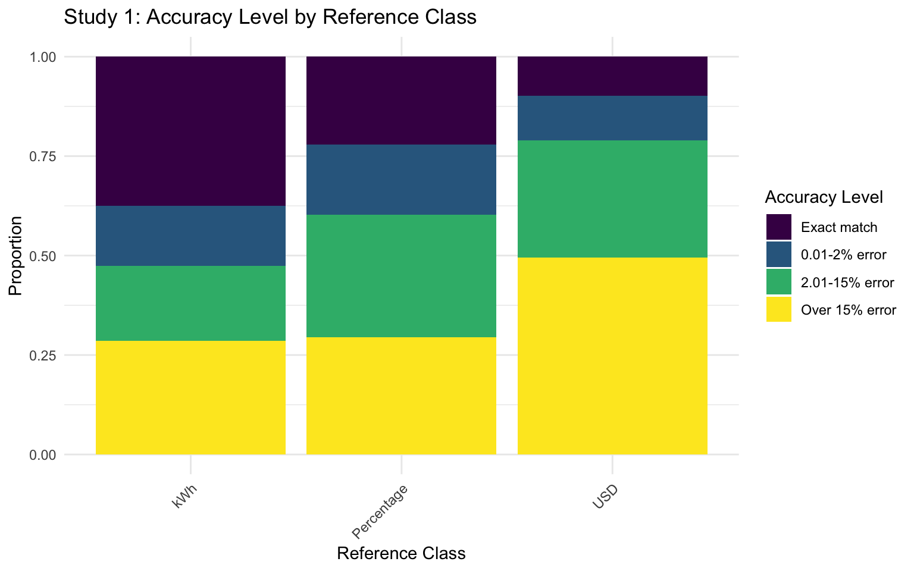
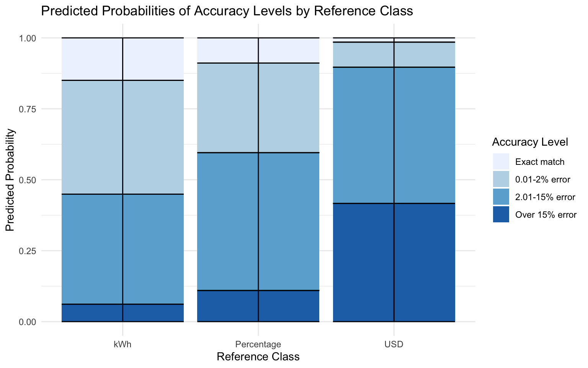
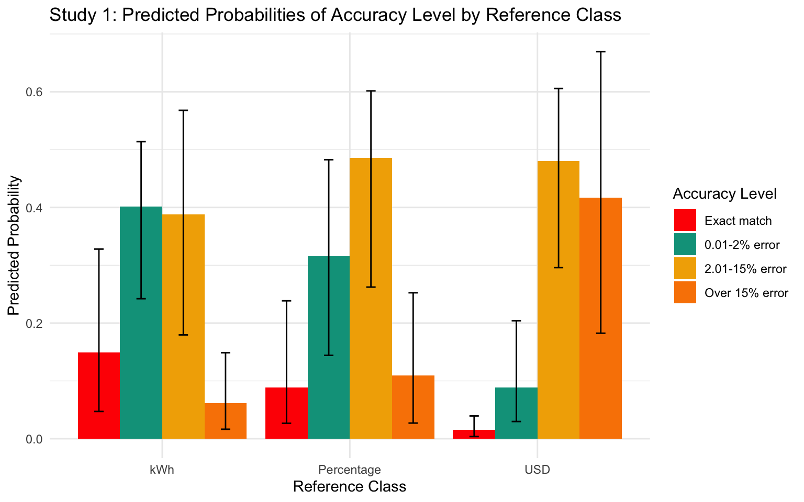

<details class="code-fold">
<summary>Code</summary>

``` r
pacman::p_load(dplyr,purrr,tidyr,here,tibble,brms,rstan,bayestestR,emmeans,tidybayes,modelsummary,
               ggplot2,gt,knitr,kableExtra,ggh4x,lme4,flextable,pander)
options(digits=2, scipen=999, dplyr.summarise.inform=FALSE)
walk(c("fun_plot"), ~ source(here::here(paste0("scripts/", .x, ".R"))))
theme_set(theme_nice())

s1 <- readRDS(here::here("data/s1_processed.rds")) |> filter(!(id %in% readRDS(here::here("data/s1_discrep_ids.rds"))))
s2_long <- readRDS(here::here("data/s2_processed.rds")) |> filter(!(id %in% readRDS(here::here("data/s2_discrep_ids.rds"))))

state_code_map <- c(
  "CAL" = "California",
  "TEX" = "Texas",
  "COL" = "Colorado",
  "MASS" = "Massachusetts"
)


state_to_code <- state_code_map
code_to_state <- setNames(names(state_code_map), state_code_map)
lookup_code <- function(state) {
  if (state %in% names(state_to_code)) {
    return(state_to_code[[state]])
  } else if (state %in% names(code_to_state)) {
    return(code_to_state[[state]])
  } else {
    return(NA)  # Return NA if not found in either mapping
  }
}
```

</details>
<details class="code-fold">
<summary>Code</summary>

``` r
s1 |> group_by(refClass) |> 
    rename("Reference Class" = refClass) |>
    summarise(n=n_distinct(id)) |> 
    pander::pandoc.table(caption="Study 1: Number of unique IDs per condition")
```

</details>


    ----------------------
     Reference Class   n  
    ----------------- ----
       Percentage      68 

           USD         89 

           kWh         78 
    ----------------------

    Table: Study 1: Number of unique IDs per condition

<details class="code-fold">
<summary>Code</summary>

``` r
s1 |> group_by(refClass,state) |> 
    rename("Reference Class" = refClass) |>
    summarise(n=n_distinct(id)) |> 
    rowwise() |> 
    mutate(state=lookup_code(state)) |> 
    pivot_wider(names_from=state,values_from=n) |>
    pander::pandoc.table(caption="Study 1: Number of unique IDs per condition by state")
```

</details>


    -----------------------------------------------------------------
     Reference Class   California   Colorado   Massachusetts   Texas 
    ----------------- ------------ ---------- --------------- -------
       Percentage          39          26           42          29   

           USD             40          45           44          49   

           kWh             36          36           42          42   
    -----------------------------------------------------------------

    Table: Study 1: Number of unique IDs per condition by state

<details class="code-fold">
<summary>Code</summary>

``` r
s1 |> group_by(refClass,calc) |> 
    rename("Reference Class" = refClass) |>
    summarise(n=n_distinct(id)) |> 
    pivot_wider(names_from=calc,values_from=n) |>
    pander::pandoc.table(caption="Study 1: Number of unique IDs per condition by calculator use")
```

</details>


    ---------------------------------------------------
     Reference Class   No Calculator   Used Calculator 
    ----------------- --------------- -----------------
       Percentage           12               56        

           USD              25               64        

           kWh              20               58        
    ---------------------------------------------------

    Table: Study 1: Number of unique IDs per condition by calculator use

<details class="code-fold">
<summary>Code</summary>

``` r
prop.table(xtabs(~refClass,s1)) |> kable()
```

</details>

| refClass   | Freq |
|:-----------|-----:|
| kWh        | 0.33 |
| Percentage | 0.29 |
| USD        | 0.38 |

<details class="code-fold">
<summary>Code</summary>

``` r
prop.table(xtabs(~refClass+calc,s1)) |> kable()
```

</details>

|            | No Calculator | Used Calculator |
|:-----------|--------------:|----------------:|
| kWh        |          0.09 |            0.25 |
| Percentage |          0.05 |            0.24 |
| USD        |          0.11 |            0.27 |

<details class="code-fold">
<summary>Code</summary>

``` r
prop.table(xtabs(~refClass+state,s1)) |> kable()
```

</details>

|            |  CAL |  COL | MASS |  TEX |
|:-----------|-----:|-----:|-----:|-----:|
| kWh        | 0.08 | 0.08 | 0.09 | 0.09 |
| Percentage | 0.08 | 0.06 | 0.09 | 0.06 |
| USD        | 0.09 | 0.10 | 0.09 | 0.10 |

### Study 2 - Subject counts

<details class="code-fold">
<summary>Code</summary>

``` r
s2_long |> group_by(refClass) |>
    rename("Reference Class" = refClass) |>
    summarise(n=n_distinct(id)) |> 
    pander::pandoc.table(caption="Study 2: Number of unique IDs per condition")
```

</details>


    ----------------------
     Reference Class   n  
    ----------------- ----
       Percentage      69 

           USD         58 

           kWh         69 
    ----------------------

    Table: Study 2: Number of unique IDs per condition

<details class="code-fold">
<summary>Code</summary>

``` r
s2_long |> group_by(refClass,calc) |>
    rename("Reference Class" = refClass) |>
    mutate(calc=case_when(calc=="Calculator" ~ "Used Calculator",
                        calc=="No Calculator" ~ "No Calculator")) |>
    summarise(n=n_distinct(id)) |>
    pivot_wider(names_from=calc,values_from=n) |>
    pander::pandoc.table(caption="Study 2: Number of unique IDs per condition by calculator use")
```

</details>


    ---------------------------------------------------
     Reference Class   No Calculator   Used Calculator 
    ----------------- --------------- -----------------
       Percentage           11               58        

           USD              12               46        

           kWh              12               57        
    ---------------------------------------------------

    Table: Study 2: Number of unique IDs per condition by calculator use

<details class="code-fold">
<summary>Code</summary>

``` r
prop.table(xtabs(~refClass,s2_long)) |> kable()
```

</details>

| refClass   | Freq |
|:-----------|-----:|
| kWh        | 0.35 |
| Percentage | 0.35 |
| USD        | 0.30 |

<details class="code-fold">
<summary>Code</summary>

``` r
prop.table(xtabs(~refClass+state,s2_long))
```

</details>

                state
    refClass     California Colorado Massachusetts Texas
      kWh             0.089    0.102         0.074 0.087
      Percentage      0.089    0.084         0.092 0.087
      USD             0.079    0.069         0.079 0.069

<details class="code-fold">
<summary>Code</summary>

``` r
prop.table(xtabs(~refClass+calc,
s2_long |> mutate(calc=case_when(calc=="Calculator" ~ "Used Calculator",
                      calc=="No Calculator" ~ "No Calculator")))) |> kable()
```

</details>

|            | No Calculator | Used Calculator |
|:-----------|--------------:|----------------:|
| kWh        |          0.06 |            0.29 |
| Percentage |          0.06 |            0.30 |
| USD        |          0.06 |            0.23 |

## Performance

### Study 1

<details class="code-fold">
<summary>Code</summary>

``` r
s1_agg <- s1 |> 
    filter(appliance !="Total kWh") |> 
    group_by(id,refClass,state,block,plan,calc,edu,pct_goal) |> 
    summarise(total_kWh = sum(value),orig_kWh=sum(family), 
                pct_change = round((orig_kWh-total_kWh)/orig_kWh,3), 
                n_change = sum(value!=family),
                state_p_dif=mean(state_p_dif),
                state_f_dif=mean(state_f_dif),
                n_less_avg = sum(less_avg),
                duration=first(Duration__in_seconds_)) |> 
    mutate(matched_goal = (pct_change == pct_goal), 
                error = pct_change - pct_goal,
                abs_error = abs(error),
                close_match = abs_error <= 0.03)

s1_agg4 <- s1_agg |> group_by(id,refClass) |> 
    summarise(mg=sum(matched_goal),n=n(), pct=mg/n) 


# overall pct of subjects who matched their goal
s1_agg4 |> ungroup() |>
    summarise(
    mean = mean(pct),
    sd = sd(pct),
    n = n(),
    se=sd(pct)/sqrt(n)
) |> pander::pandoc.table(caption="Study 1: Proportion of participants who matched their goal overall")
```

</details>


    ---------------------------------
      mean      sd      n      se    
    -------- -------- ----- ---------
     0.2255   0.3814   235   0.02488 
    ---------------------------------

    Table: Study 1: Proportion of participants who matched their goal overall

<details class="code-fold">
<summary>Code</summary>

``` r
# proportion matching vs close match

s1_agg |> pivot_longer(c(matched_goal,close_match),names_to="match_type",values_to="match") |> 
    group_by(id,match_type) |>
    summarise(mg=sum(match),n=n(), pct=mg/n) |>
    group_by(match_type) |>
    summarise(
    mean = mean(pct),
    sd = sd(pct),
    n = n(),
    se=sd(pct)/sqrt(n)
) |> pander::pandoc.table(caption="Study 1: Proportion of participants who matched their goal or were within 3% of their goal")
```

</details>


    ------------------------------------------------
      match_type     mean      sd      n      se    
    -------------- -------- -------- ----- ---------
     close_match    0.4149   0.4182   235   0.02728 

     matched_goal   0.2255   0.3814   235   0.02488 
    ------------------------------------------------

    Table: Study 1: Proportion of participants who matched their goal or were within 3% of their goal

<details class="code-fold">
<summary>Code</summary>

``` r
# refClass
s1_agg4 |> 
group_by(refClass) |> 
summarise(
    mean = mean(pct),
    sd = sd(pct),
    n = n(),
    se=sd(pct)/sqrt(n)
) |> pander::pandoc.table(caption="Study 1: Proportion of participants who matched their goal by condition")
```

</details>


    ----------------------------------------------
      refClass     mean       sd     n      se    
    ------------ --------- -------- ---- ---------
     Percentage   0.2206    0.3679   68   0.04461 

        USD       0.09831   0.2734   89   0.02898 

        kWh        0.375    0.4446   78   0.05034 
    ----------------------------------------------

    Table: Study 1: Proportion of participants who matched their goal by condition

### Study 2

<details class="code-fold">
<summary>Code</summary>

``` r
s2_agg1 <- s2_long |> 
  filter(appliance != "TOTAL") |> 
  group_by(id, state,refClass,pct,pct_goal,plan,rounded) |> 
  summarise(
    total_kWh = sum(value),
    orig_kWh = sum(family),
    pct_change = round((orig_kWh - total_kWh) / orig_kWh, 3),
    state_dif = mean(state_dif),
    .groups = "drop"
  ) |>
  mutate(matched_goal = (pct_change == pct),
  close_match = abs(pct_change-pct)<.03)

s2_agg4 <- s2_agg1|> group_by(id,refClass) |> 
  summarise(mg=sum(matched_goal),n=n(), pct=mg/n) 


# overall pct of subjects who matched their goal
s2_agg4 |> ungroup() |>
    summarise(
    mean = mean(pct),
    sd = sd(pct),
    n = n(),
    se=sd(pct)/sqrt(n)
) |> pander::pandoc.table(caption="Study 2: Proportion of participants who matched their goal overall")
```

</details>


    ---------------------------------
      mean      sd      n      se    
    -------- -------- ----- ---------
     0.3023   0.4092   196   0.02923 
    ---------------------------------

    Table: Study 2: Proportion of participants who matched their goal overall

<details class="code-fold">
<summary>Code</summary>

``` r
# proportion matching vs close match

s2_agg1 |> pivot_longer(c(matched_goal,close_match),names_to="match_type",values_to="match") |> 
    group_by(id,match_type) |>
    summarise(mg=sum(match),n=n(), pct=mg/n) |>
    group_by(match_type) |>
    summarise(
    mean = mean(pct),
    sd = sd(pct),
    n = n(),
    se=sd(pct)/sqrt(n)
) |> pander::pandoc.table(caption="Study 2: Proportion of participants who matched their goal or were within 3% of their goal")
```

</details>


    ------------------------------------------------
      match_type     mean      sd      n      se    
    -------------- -------- -------- ----- ---------
     close_match    0.4273   0.438    196   0.03128 

     matched_goal   0.3023   0.4092   196   0.02923 
    ------------------------------------------------

    Table: Study 2: Proportion of participants who matched their goal or were within 3% of their goal

<details class="code-fold">
<summary>Code</summary>

``` r
# refClass only 
s2_agg4 |> 
    group_by(refClass) |> 
    summarise(
    mean = mean(pct),
    sd = sd(pct),
    n = n(),
    se=sd(pct)/sqrt(n)
) |> pander::pandoc.table(caption="Study 2: Proportion of participants who matched their goal by condition")
```

</details>


    ---------------------------------------------
      refClass     mean      sd     n      se    
    ------------ -------- -------- ---- ---------
     Percentage   0.2681   0.3621   69   0.04359 

        USD       0.1853   0.3763   58   0.04941 

        kWh       0.4348   0.4469   69   0.0538  
    ---------------------------------------------

    Table: Study 2: Proportion of participants who matched their goal by condition

<details class="code-fold">
<summary>Code</summary>

``` r
# rounded only

s2_agg1 |> group_by(id,rounded) |> 
  summarise(mg=sum(matched_goal),n=n(), pct=mg/n) |> 
    group_by(rounded) |>
    summarise(
    mean = mean(pct),
    sd = sd(pct),
    n = n(),
    se=sd(pct)/sqrt(n)
) |> pander::pandoc.table(caption="Study 2: Proportion of participants who matched their goal by rounding condition")
```

</details>


    -----------------------------------------------
       rounded      mean      sd      n      se    
    ------------- -------- -------- ----- ---------
     Not Rounded   0.2653   0.4219   196   0.03013 

       Rounded     0.3393   0.454    196   0.03243 
    -----------------------------------------------

    Table: Study 2: Proportion of participants who matched their goal by rounding condition

<details class="code-fold">
<summary>Code</summary>

``` r
# pct_goal only

s2_agg1 |> group_by(id,pct_goal) |> 
  summarise(mg=sum(matched_goal),n=n(), pct=mg/n) |> 
    group_by(pct_goal) |>
    summarise(
    mean = mean(pct),
    sd = sd(pct),
    n = n(),
    se=sd(pct)/sqrt(n)
) |> pander::pandoc.table(caption="Study 2: Proportion of participants who matched their goal by goal condition")
```

</details>


    --------------------------------------------
     pct_goal    mean      sd      n      se    
    ---------- -------- -------- ----- ---------
       10%      0.2959   0.4405   196   0.03146 

       15%      0.3087   0.439    196   0.03135 
    --------------------------------------------

    Table: Study 2: Proportion of participants who matched their goal by goal condition

<details class="code-fold">
<summary>Code</summary>

``` r
# refClass x rounded

s2_agg1 |> group_by(id, refClass,rounded) |> 
  summarise(mg=sum(matched_goal),n=n(), pct=mg/n) |> 
    group_by(refClass,rounded) |>
    summarise(
    mean = mean(pct),
    sd = sd(pct),
    n = n(),
    se=sd(pct)/sqrt(n)
) |> pander::pandoc.table(caption="Study 2: Proportion of participants who matched their goal by condition and rounding")
```

</details>


    -----------------------------------------------------------
      refClass      rounded      mean      sd     n      se    
    ------------ ------------- -------- -------- ---- ---------
     Percentage   Not Rounded   0.1957   0.3856   69   0.04642 

     Percentage     Rounded     0.3406   0.4496   69   0.05413 

        USD       Not Rounded   0.1897   0.3842   58   0.05045 

        USD         Rounded     0.181    0.3827   58   0.05025 

        kWh       Not Rounded   0.3986   0.4584   69   0.05519 

        kWh         Rounded     0.471    0.4765   69   0.05737 
    -----------------------------------------------------------

    Table: Study 2: Proportion of participants who matched their goal by condition and rounding

<details class="code-fold">
<summary>Code</summary>

``` r
# refClass x pct_goal

s2_agg1 |> group_by(id, refClass,pct_goal) |> 
  summarise(mg=sum(matched_goal),n=n(), pct=mg/n) |> 
    group_by(refClass,pct_goal) |>
    summarise(
    mean = mean(pct),
    sd = sd(pct),
    n = n(),
    se=sd(pct)/sqrt(n)
) |> pander::pandoc.table(caption="Study 2: Proportion of participants who matched their goal by condition and goal")
```

</details>


    --------------------------------------------------------
      refClass    pct_goal    mean      sd     n      se    
    ------------ ---------- -------- -------- ---- ---------
     Percentage     10%      0.2536   0.4168   69   0.05017 

     Percentage     15%      0.2826   0.4328   69   0.05211 

        USD         10%      0.1724   0.3693   58   0.0485  

        USD         15%      0.1983   0.3967   58   0.05209 

        kWh         10%      0.442    0.4815   69   0.05797 

        kWh         15%      0.4275   0.456    69   0.05489 
    --------------------------------------------------------

    Table: Study 2: Proportion of participants who matched their goal by condition and goal

<details class="code-fold">
<summary>Code</summary>

``` r
# pct_goal x rounded

s2_agg1 |> group_by(id, pct_goal,rounded) |> 
  summarise(mg=sum(matched_goal),n=n(), pct=mg/n) |> 
    group_by(pct_goal,rounded) |>
    summarise(
    mean = mean(pct),
    sd = sd(pct),
    n = n(),
    se=sd(pct)/sqrt(n)
) |> pander::pandoc.table(caption="Study 2: Proportion of participants who matched their goal by goal and rounding")
```

</details>


    ----------------------------------------------------------
     pct_goal     rounded      mean      sd      n      se    
    ---------- ------------- -------- -------- ----- ---------
       10%      Not Rounded   0.2188   0.3961   96    0.04043 

       10%        Rounded      0.37    0.4694   100   0.04694 

       15%      Not Rounded    0.31    0.4426   100   0.04426 

       15%        Rounded     0.3073   0.4375   96    0.04465 
    ----------------------------------------------------------

    Table: Study 2: Proportion of participants who matched their goal by goal and rounding

<details class="code-fold">
<summary>Code</summary>

``` r
# pct_goal x rounded x refClass

s2_agg1 |> group_by(id, pct_goal,rounded,refClass) |> 
  summarise(mg=sum(matched_goal),n=n(), pct=mg/n) |> 
    group_by(pct_goal,rounded,refClass) |>
    summarise(
    mean = mean(pct),
    sd = sd(pct),
    n = n(),
    se=sd(pct)/sqrt(n)
) |> pander::pandoc.table(caption="Study 2: Proportion of participants who matched their goal by goal, rounding, and condition")
```

</details>


    ----------------------------------------------------------------------
     pct_goal     rounded      refClass     mean      sd     n      se    
    ---------- ------------- ------------ -------- -------- ---- ---------
       10%      Not Rounded   Percentage   0.1111   0.2955   36   0.04924 

       10%      Not Rounded      USD       0.1333   0.3198   30   0.05839 

       10%      Not Rounded      kWh       0.4333   0.4866   30   0.08884 

       10%        Rounded     Percentage   0.4091   0.4752   33   0.08273 

       10%        Rounded        USD       0.2143   0.4179   28   0.07897 

       10%        Rounded        kWh       0.4487   0.4839   39   0.07748 

       15%      Not Rounded   Percentage   0.2879   0.4512   33   0.07855 

       15%      Not Rounded      USD        0.25    0.441    28   0.08333 

       15%      Not Rounded      kWh       0.3718   0.4401   39   0.07047 

       15%        Rounded     Percentage   0.2778   0.4216   36   0.07027 

       15%        Rounded        USD        0.15    0.3511   30   0.0641  

       15%        Rounded        kWh        0.5     0.4734   30   0.08644 
    ----------------------------------------------------------------------

    Table: Study 2: Proportion of participants who matched their goal by goal, rounding, and condition

## Analysis

### Study 1

<details class="code-fold">
<summary>Code</summary>

``` r
# binomial regression on trial level data

s1_br <- brm(
    matched_goal ~ refClass + (1|id),
    data = s1_agg,
    family = bernoulli(),
    cores=4,
    iter=2000,
    control = list(adapt_delta = 0.99),
    file=paste0(here::here("data/model_cache",'s1_br.rds')),
    )

summary(s1_br)
```

</details>

     Family: bernoulli 
      Links: mu = logit 
    Formula: matched_goal ~ refClass + (1 | id) 
       Data: s1_agg (Number of observations: 940) 
      Draws: 4 chains, each with iter = 2000; warmup = 1000; thin = 1;
             total post-warmup draws = 4000

    Multilevel Hyperparameters:
    ~id (Number of levels: 235) 
                  Estimate Est.Error l-95% CI u-95% CI Rhat Bulk_ESS Tail_ESS
    sd(Intercept)     7.19      1.18     5.22     9.83 1.00     1100     1777

    Regression Coefficients:
                       Estimate Est.Error l-95% CI u-95% CI Rhat Bulk_ESS Tail_ESS
    Intercept             -2.31      1.05    -4.59    -0.41 1.00      851     1367
    refClassPercentage    -3.16      1.60    -6.49    -0.13 1.00      721     1194
    refClassUSD           -7.25      1.90   -11.50    -3.92 1.00      895     1244

    Draws were sampled using sampling(NUTS). For each parameter, Bulk_ESS
    and Tail_ESS are effective sample size measures, and Rhat is the potential
    scale reduction factor on split chains (at convergence, Rhat = 1).

<details class="code-fold">
<summary>Code</summary>

``` r
mr_s1 <- as.data.frame(describe_posterior(s1_br, centrality = "Mean"))[, c(1,2,4,5,6)]
colnames(mr_s1) <- c("Term", "Estimate","95% CrI Lower", "95% CrI Upper", "pd")

intercept <- mr_s1$Estimate[mr_s1$Term == "b_Intercept"]

 mr_s1 |>
    mutate(Term = stringr::str_remove(Term, "b_")) |>
    mutate(across(c("Estimate", "95% CrI Lower", "95% CrI Upper"), 
                    \(x) if_else(Term == "Intercept", plogis(x), plogis(x + intercept)))) |>
    mutate(across(where(is.numeric), \(x) round(x, 3))) |>
    mutate(Term = if_else(Term == "Intercept", "Intercept (kWh)", Term)) |>
    tibble::remove_rownames() |>
    kable(booktabs = TRUE)
```

</details>

| Term               | Estimate | 95% CrI Lower | 95% CrI Upper |   pd |
|:-------------------|---------:|--------------:|--------------:|-----:|
| Intercept (kWh)    |     0.09 |          0.01 |          0.40 | 0.99 |
| refClassPercentage |     0.00 |          0.00 |          0.08 | 0.98 |
| refClassUSD        |     0.00 |          0.00 |          0.00 | 1.00 |

<details class="code-fold">
<summary>Code</summary>

``` r
s1_br2 <- brm(
    close_match ~ refClass + (1|id) + (1|state),
    data = s1_agg,
    family = bernoulli(),
    cores=4,
    iter=2000,
    control = list(adapt_delta = 0.99),
    file=paste0(here::here("data/model_cache",'s1_br2.rds')),
    )
summary(s1_br2)
```

</details>

     Family: bernoulli 
      Links: mu = logit 
    Formula: close_match ~ refClass + (1 | id) + (1 | state) 
       Data: s1_agg (Number of observations: 940) 
      Draws: 4 chains, each with iter = 2000; warmup = 1000; thin = 1;
             total post-warmup draws = 4000

    Multilevel Hyperparameters:
    ~id (Number of levels: 235) 
                  Estimate Est.Error l-95% CI u-95% CI Rhat Bulk_ESS Tail_ESS
    sd(Intercept)     3.88      0.43     3.12     4.79 1.00      963     2098

    ~state (Number of levels: 4) 
                  Estimate Est.Error l-95% CI u-95% CI Rhat Bulk_ESS Tail_ESS
    sd(Intercept)     0.42      0.44     0.02     1.51 1.00     1494     2007

    Regression Coefficients:
                       Estimate Est.Error l-95% CI u-95% CI Rhat Bulk_ESS Tail_ESS
    Intercept              0.62      0.59    -0.55     1.80 1.01     1001     1167
    refClassPercentage    -0.90      0.76    -2.43     0.49 1.01      737     1299
    refClassUSD           -3.17      0.78    -4.80    -1.70 1.01     1083     1559

    Draws were sampled using sampling(NUTS). For each parameter, Bulk_ESS
    and Tail_ESS are effective sample size measures, and Rhat is the potential
    scale reduction factor on split chains (at convergence, Rhat = 1).

<details class="code-fold">
<summary>Code</summary>

``` r
s1_br2 |> emmeans(~refClass, type="response")
```

</details>

     refClass   response lower.HPD upper.HPD
     kWh            0.65      0.40      0.89
     Percentage     0.43      0.17      0.69
     USD            0.07      0.01      0.17

    Point estimate displayed: median 
    Results are back-transformed from the logit scale 
    HPD interval probability: 0.95 

<details class="code-fold">
<summary>Code</summary>

``` r
s1_agg <- s1 |> 
    filter(appliance !="Total kWh") |> 
    group_by(id,refClass,state,block,plan,calc,edu,pct_goal) |> 
    summarise(total_kWh = sum(value),orig_kWh=sum(family), 
                pct_change = round((orig_kWh-total_kWh)/orig_kWh,3), 
                n_change = sum(value!=family),
                state_p_dif=mean(state_p_dif),
                state_f_dif=mean(state_f_dif),
                n_less_avg = sum(less_avg),
                duration=first(Duration__in_seconds_)) |> 
    mutate(matched_goal = (pct_change == pct_goal), 
                error = pct_change - pct_goal,
                abs_error = abs(error),
                close_match = abs_error <= 0.03) |>
    ungroup() |> # Add ungroup here
    mutate(
        accuracy_level = factor(
            case_when(
                abs_error <= 0.01 ~ "1% or less",
                abs_error <= 0.05 ~ "5% or less",
                abs_error <= 0.10 ~ "10% or less",
                TRUE ~ "Greater than 10%"  # Capture all remaining cases
            ), 
            levels = c("1% or less", "5% or less", "10% or less", "Greater than 10%"),
            ordered = TRUE
        )
    )
```

</details>

## Ordinal Regression alternative

<details class="code-fold">
<summary>Code</summary>

``` r
s1_agg <- s1 |> 
    filter(appliance !="Total kWh") |> 
    group_by(id,refClass,state,block,plan,calc,edu,pct_goal) |> 
    summarise(total_kWh = sum(value),orig_kWh=sum(family), 
                pct_change = round((orig_kWh-total_kWh)/orig_kWh,3), 
                n_change = sum(value!=family),
                state_p_dif=mean(state_p_dif),
                state_f_dif=mean(state_f_dif),
                n_less_avg = sum(less_avg),
                duration=first(Duration__in_seconds_)) |> 
    mutate(matched_goal = (pct_change == pct_goal), 
                error = pct_change - pct_goal,
                abs_error = abs(error),
                close_match = abs_error <= 0.03) |>
    ungroup() |> # Add ungroup here
        mutate(
            accuracy_level = factor(
                case_when(
                    abs_error == 0.00 ~ "Exact match",
                    abs_error <= 0.02 ~ "0.01-2% error",
                    abs_error <= 0.10 ~ "2.01-15% error",
                    TRUE ~ "Over 15% error"  # Capture all remaining cases
                ), 
                levels = c("Exact match", "0.01-2% error", "2.01-15% error", "Over 15% error"),
                ordered = TRUE
            )
        )
    # mutate(
    #     accuracy_level = factor(
    #         case_when(
    #             abs_error <= 0.01 ~ "1% or less",
    #             abs_error <= 0.05 ~ "5% or less",
    #             abs_error <= 0.10 ~ "10% or less",
    #             TRUE ~ "Greater than 10%"  # Capture all remaining cases
    #         ), 
    #         levels = c("1% or less", "5% or less", "10% or less", "Greater than 10%"),
    #         ordered = TRUE
    #     )
    # )

# plot accuracy level by refClass

s1_agg |> 
        mutate(
            accuracy_level = factor(
                case_when(
                    abs_error == 0.00 ~ "Exact match",
                    abs_error <= 0.02 ~ "0.01-2% error",
                    abs_error <= 0.10 ~ "2.01-15% error",
                    TRUE ~ "Over 15% error"  # Capture all remaining cases
                ), 
                levels = c("Exact match", "0.01-2% error", "2.01-15% error", "Over 15% error"),
                ordered = TRUE
            )
        ) |>
    ggplot(aes(x=refClass,fill=accuracy_level)) +
    geom_bar(position="fill") +
    labs(title="Study 1: Accuracy Level by Reference Class",
        x="Reference Class",
        y="Proportion",
        fill="Accuracy Level") +
    theme_minimal() +
    theme(axis.text.x = element_text(angle = 45, hjust = 1))
```

</details>



<details class="code-fold">
<summary>Code</summary>

``` r
ordinal_model_s1 <- brm(
  accuracy_level ~ refClass + (1|id) + (1|state),
  data = s1_agg,
  family = cumulative("logit"),
  cores = 4,
  iter = 2000,
  control = list(adapt_delta = 0.99), # Recommended for ordinal models
  prior = c(prior(normal(0, 2), class = "Intercept"),  # Priors for thresholds
            prior(normal(0, 1.5), class = "b")), # Priors for predictors
  file = paste0(here::here("data/model_cache",'s1_ordinal3.rds')) # Cache for efficiency
)


pred_summary <- ordinal_model_s1 |>
    epred_draws(newdata = data.frame(refClass = c("kWh", "Percentage", "USD")),
                ndraws = 1000, re_formula = NA) |>
    group_by(refClass, .category) |>
    summarise(
        mean_prob = mean(.epred),
        lower_ci = quantile(.epred, 0.025),
        upper_ci = quantile(.epred, 0.975)
    )
pred_summary |> pander::pandoc.table(caption="Study 1: Predicted probabilities of accuracy level by reference class")
```

</details>


    ---------------------------------------------------------------
      refClass      .category      mean_prob   lower_ci   upper_ci 
    ------------ ---------------- ----------- ---------- ----------
     Percentage    Exact match      0.08859    0.02678     0.2385  

     Percentage   0.01-2% error     0.3159      0.1442     0.4826  

     Percentage   2.01-15% error    0.4858      0.2623     0.6016  

     Percentage   Over 15% error    0.1097     0.02712     0.2524  

        USD        Exact match      0.01499    0.003805   0.03939  

        USD       0.01-2% error     0.08824    0.02979     0.2041  

        USD       2.01-15% error    0.4802      0.2959     0.6057  

        USD       Over 15% error    0.4166      0.1825     0.6694  

        kWh        Exact match      0.1497     0.04717     0.328   

        kWh       0.01-2% error     0.4012      0.2422     0.5138  

        kWh       2.01-15% error    0.3878      0.1796     0.568   

        kWh       Over 15% error    0.06131    0.01644     0.1487  
    ---------------------------------------------------------------

    Table: Study 1: Predicted probabilities of accuracy level by reference class

<details class="code-fold">
<summary>Code</summary>

``` r
ggplot(pred_summary, 
       aes(x = refClass, y = mean_prob, fill = .category)) +
  geom_col(position = "stack") +
  geom_errorbar(aes(ymin = lower_ci, ymax = upper_ci), 
                position = position_stack()) +
  labs(x = "Reference Class", 
       y = "Predicted Probability",
       fill = "Accuracy Level",
       title = "Predicted Probabilities of Accuracy Levels by Reference Class") +
  theme_minimal() +
  scale_fill_brewer(palette = "Blues")
```

</details>



<details class="code-fold">
<summary>Code</summary>

``` r
# Calculate cumulative probabilities
cum_probs <- pred_summary |>
  group_by(refClass) |>
  arrange(refClass, .category) |>
  mutate(
    cum_prob = cumsum(mean_prob),
    cum_lower = cumsum(lower_ci),
    cum_upper = cumsum(upper_ci)
  )

ggplot(cum_probs, 
    aes(x = refClass, y = cum_prob, color = .category)) +
geom_point(size = 3,position=position_dodge()) +
geom_errorbar(aes(ymin = cum_lower, ymax = cum_upper), 
            width = 0.2,position=position_dodge()) +
labs(x = "Reference Class",
    y = "Cumulative Probability",
    color = "Accuracy Level",
    title = "Cumulative Probabilities of Accuracy Levels") +
theme_minimal() +
scale_color_brewer(palette = "Blues") 
```

</details>


<details class="code-fold">
<summary>Code</summary>

``` r
summary_table <- pred_summary |>
  pivot_wider(
    names_from = .category,
    values_from = c(mean_prob, lower_ci, upper_ci)
  ) |>
  kable(digits = 3)

print(summary_table)
```

</details>


    |refClass   | mean_prob_Exact match| mean_prob_0.01-2% error| mean_prob_2.01-15% error| mean_prob_Over 15% error| lower_ci_Exact match| lower_ci_0.01-2% error| lower_ci_2.01-15% error| lower_ci_Over 15% error| upper_ci_Exact match| upper_ci_0.01-2% error| upper_ci_2.01-15% error| upper_ci_Over 15% error|
    |:----------|---------------------:|-----------------------:|------------------------:|------------------------:|--------------------:|----------------------:|-----------------------:|-----------------------:|--------------------:|----------------------:|-----------------------:|-----------------------:|
    |Percentage |                 0.089|                   0.316|                     0.49|                    0.110|                0.027|                   0.14|                    0.26|                   0.027|                0.239|                   0.48|                    0.60|                    0.25|
    |USD        |                 0.015|                   0.088|                     0.48|                    0.417|                0.004|                   0.03|                    0.30|                   0.183|                0.039|                   0.20|                    0.61|                    0.67|
    |kWh        |                 0.150|                   0.401|                     0.39|                    0.061|                0.047|                   0.24|                    0.18|                   0.016|                0.328|                   0.51|                    0.57|                    0.15|

<details class="code-fold">
<summary>Code</summary>

``` r
# Convert log-odds to odds ratios
posterior_samples <- as.data.frame(ordinal_model_s1)
odds_ratios <- data.frame(
  Percentage_vs_kWh = exp(posterior_samples$b_refClassPercentage),
  USD_vs_kWh = exp(posterior_samples$b_refClassUSD)
)

# Calculate summary statistics
odds_ratio_summary <- data.frame(
  comparison = c("Percentage vs kWh", "USD vs kWh"),
  odds_ratio = c(mean(odds_ratios$Percentage_vs_kWh),
                 mean(odds_ratios$USD_vs_kWh)),
  ci_lower = c(quantile(odds_ratios$Percentage_vs_kWh, 0.025),
               quantile(odds_ratios$USD_vs_kWh, 0.025)),
  ci_upper = c(quantile(odds_ratios$Percentage_vs_kWh, 0.975),
               quantile(odds_ratios$USD_vs_kWh, 0.975))
)


# Plot predicted probabilities
ggplot(pred_summary, aes(x = refClass, y = mean_prob, fill = .category)) +
  geom_bar(stat = "identity", position = position_dodge()) +
  geom_errorbar(aes(ymin = lower_ci, ymax = upper_ci),
                position = position_dodge(width = 0.9), width = 0.2) +
  labs(y = "Predicted Probability", x = "Reference Class", fill = "Accuracy Level") +
  ggtitle("Study 1: Predicted Probabilities of Accuracy Level by Reference Class") +
  theme_minimal()
```

</details>



#### Frequentist alternative

<details class="code-fold">
<summary>Code</summary>

``` r
s1_glm <- glm(matched_goal ~ refClass, data = s1_agg, family = binomial())
summary(s1_glm)
```

</details>


    Call:
    glm(formula = matched_goal ~ refClass, family = binomial(), data = s1_agg)

    Coefficients:
                       Estimate Std. Error z value           Pr(>|z|)    
    (Intercept)          -0.511      0.117   -4.37 0.0000125256804014 ***
    refClassPercentage   -0.751      0.187   -4.01 0.0000599223645706 ***
    refClassUSD          -1.705      0.213   -8.01 0.0000000000000012 ***
    ---
    Signif. codes:  0 '***' 0.001 '**' 0.01 '*' 0.05 '.' 0.1 ' ' 1

    (Dispersion parameter for binomial family taken to be 1)

        Null deviance: 1003.58  on 939  degrees of freedom
    Residual deviance:  928.67  on 937  degrees of freedom
    AIC: 934.7

    Number of Fisher Scoring iterations: 4

<details class="code-fold">
<summary>Code</summary>

``` r
# Odds Ratios and Confidence Intervals
exp(cbind(Odds_Ratio = coef(s1_glm), confint(s1_glm)))
```

</details>

                       Odds_Ratio 2.5 % 97.5 %
    (Intercept)              0.60  0.48   0.75
    refClassPercentage       0.47  0.33   0.68
    refClassUSD              0.18  0.12   0.27

<details class="code-fold">
<summary>Code</summary>

``` r
# Chi-Square Test for Proportions in Study 1
s1_table <- table(s1_agg$refClass, s1_agg$matched_goal)
chisq.test(s1_table)
```

</details>


        Pearson's Chi-squared test

    data:  s1_table
    X-squared = 73, df = 2, p-value <0.0000000000000002

### Study 2

<details class="code-fold">
<summary>Code</summary>

``` r
# binomial regression on trial level data

s2_br_3 <- brm(
    matched_goal ~ refClass+rounded+pct_goal + (1|id) + (1|state),
    data = s2_agg1,
    family = bernoulli(),
    cores=4,
    iter=2000,
    control = list(adapt_delta = 0.99),
    file=paste0(here::here("data/model_cache",'s2_br_3.rds')),
    )

summary(s2_br_3)
```

</details>

     Family: bernoulli 
      Links: mu = logit 
    Formula: matched_goal ~ refClass + rounded + pct_goal + (1 | id) + (1 | state) 
       Data: s2_agg1 (Number of observations: 784) 
      Draws: 4 chains, each with iter = 2000; warmup = 1000; thin = 1;
             total post-warmup draws = 4000

    Multilevel Hyperparameters:
    ~id (Number of levels: 196) 
                  Estimate Est.Error l-95% CI u-95% CI Rhat Bulk_ESS Tail_ESS
    sd(Intercept)     6.98      1.13     5.06     9.49 1.00      844     1813

    ~state (Number of levels: 4) 
                  Estimate Est.Error l-95% CI u-95% CI Rhat Bulk_ESS Tail_ESS
    sd(Intercept)     0.76      0.70     0.03     2.66 1.00     1280     1786

    Regression Coefficients:
                       Estimate Est.Error l-95% CI u-95% CI Rhat Bulk_ESS Tail_ESS
    Intercept             -1.95      1.19    -4.38     0.34 1.00      871     1513
    refClassPercentage    -3.03      1.46    -6.14    -0.28 1.01      580      868
    refClassUSD           -5.67      1.79    -9.40    -2.37 1.00      741     1301
    roundedRounded         1.51      0.37     0.81     2.24 1.00     4056     3115
    pct_goal15%            0.27      0.38    -0.45     1.03 1.00     3990     2550

    Draws were sampled using sampling(NUTS). For each parameter, Bulk_ESS
    and Tail_ESS are effective sample size measures, and Rhat is the potential
    scale reduction factor on split chains (at convergence, Rhat = 1).

<details class="code-fold">
<summary>Code</summary>

``` r
mr_s2_3 <- as.data.frame(describe_posterior(s2_br_3, centrality = "Mean"))[, c(1,2,4,5,6)]
colnames(mr_s2_3) <- c("Term", "Estimate","95% CrI Lower", "95% CrI Upper", "pd")


 mr_s2_3 |>
    mutate(Term = stringr::str_remove(Term, "b_")) |>
    mutate(across(where(is.numeric), \(x) round(x, 3))) |>
    mutate(Term = if_else(Term == "Intercept", "Intercept (kWh)", Term)) |>
    tibble::remove_rownames() |>
    kable(booktabs = TRUE)
```

</details>

| Term               | Estimate | 95% CrI Lower | 95% CrI Upper |   pd |
|:-------------------|---------:|--------------:|--------------:|-----:|
| Intercept (kWh)    |    -1.96 |         -4.38 |          0.34 | 0.96 |
| refClassPercentage |    -3.03 |         -6.14 |         -0.28 | 0.99 |
| refClassUSD        |    -5.67 |         -9.40 |         -2.37 | 1.00 |
| roundedRounded     |     1.50 |          0.81 |          2.24 | 1.00 |
| pct_goal15%        |     0.27 |         -0.45 |          1.03 | 0.76 |

<details class="code-fold">
<summary>Code</summary>

``` r
s2_br2_3 <- brm(
    close_match ~ refClass+rounded+pct_goal + (1|id) + (1|state),
    data = s2_agg1,
    family = bernoulli(),
    cores=4,
    iter=2000,
    control = list(adapt_delta = 0.99),
    file=paste0(here::here("data/model_cache",'s2_br2_3.rds')),
    )

summary(s2_br2_3)
```

</details>

     Family: bernoulli 
      Links: mu = logit 
    Formula: close_match ~ refClass + rounded + pct_goal + (1 | id) + (1 | state) 
       Data: s2_agg1 (Number of observations: 784) 
      Draws: 4 chains, each with iter = 2000; warmup = 1000; thin = 1;
             total post-warmup draws = 4000

    Multilevel Hyperparameters:
    ~id (Number of levels: 196) 
                  Estimate Est.Error l-95% CI u-95% CI Rhat Bulk_ESS Tail_ESS
    sd(Intercept)     5.80      0.82     4.37     7.65 1.00     1100     2329

    ~state (Number of levels: 4) 
                  Estimate Est.Error l-95% CI u-95% CI Rhat Bulk_ESS Tail_ESS
    sd(Intercept)     0.73      0.63     0.03     2.42 1.00     1114     1439

    Regression Coefficients:
                       Estimate Est.Error l-95% CI u-95% CI Rhat Bulk_ESS Tail_ESS
    Intercept              0.09      0.94    -1.76     2.01 1.00     1032     1599
    refClassPercentage    -1.64      1.16    -3.95     0.57 1.00      881     1466
    refClassUSD           -3.55      1.29    -6.17    -1.13 1.00      716     1520
    roundedRounded         0.56      0.29     0.00     1.12 1.00     5055     3112
    pct_goal15%            0.66      0.29     0.11     1.26 1.00     5026     2940

    Draws were sampled using sampling(NUTS). For each parameter, Bulk_ESS
    and Tail_ESS are effective sample size measures, and Rhat is the potential
    scale reduction factor on split chains (at convergence, Rhat = 1).

<details class="code-fold">
<summary>Code</summary>

``` r
#s2_br2_3 |> emmeans(~refClass, type="response")

mr_s2_3_2 <- as.data.frame(describe_posterior(s2_br2_3, centrality = "Mean"))[, c(1,2,4,5,6)]
colnames(mr_s2_3_2) <- c("Term", "Estimate","95% CrI Lower", "95% CrI Upper", "pd")


mr_s2_3_2 |>
    mutate(Term = stringr::str_remove(Term, "b_")) |>
    mutate(across(where(is.numeric), \(x) round(x, 3))) |>
    mutate(Term = if_else(Term == "Intercept", "Intercept (kWh)", Term)) |>
    tibble::remove_rownames() |>
    kable(booktabs = TRUE)
```

</details>

| Term               | Estimate | 95% CrI Lower | 95% CrI Upper |   pd |
|:-------------------|---------:|--------------:|--------------:|-----:|
| Intercept (kWh)    |     0.09 |          -1.8 |          2.01 | 0.53 |
| refClassPercentage |    -1.64 |          -4.0 |          0.57 | 0.93 |
| refClassUSD        |    -3.55 |          -6.2 |         -1.13 | 1.00 |
| roundedRounded     |     0.56 |           0.0 |          1.12 | 0.98 |
| pct_goal15%        |     0.66 |           0.1 |          1.26 | 0.99 |

<details class="code-fold">
<summary>Code</summary>

``` r
s2_glm <- glm(matched_goal ~ refClass + rounded + pct_goal, data = s2_agg1, family = binomial())
summary(s2_glm)
```

</details>


    Call:
    glm(formula = matched_goal ~ refClass + rounded + pct_goal, family = binomial(), 
        data = s2_agg1)

    Coefficients:
                       Estimate Std. Error z value     Pr(>|z|)    
    (Intercept)         -0.4899     0.1691   -2.90       0.0038 ** 
    refClassPercentage  -0.7482     0.1830   -4.09 0.0000435218 ***
    refClassUSD         -1.2275     0.2089   -5.88 0.0000000042 ***
    roundedRounded       0.3737     0.1608    2.32       0.0201 *  
    pct_goal15%          0.0768     0.1603    0.48       0.6319    
    ---
    Signif. codes:  0 '***' 0.001 '**' 0.01 '*' 0.05 '.' 0.1 ' ' 1

    (Dispersion parameter for binomial family taken to be 1)

        Null deviance: 960.87  on 783  degrees of freedom
    Residual deviance: 915.67  on 779  degrees of freedom
    AIC: 925.7

    Number of Fisher Scoring iterations: 4

<details class="code-fold">
<summary>Code</summary>

``` r
# Odds Ratios and Confidence Intervals
exp(cbind(Odds_Ratio = coef(s2_glm), confint(s2_glm)))
```

</details>

                       Odds_Ratio 2.5 % 97.5 %
    (Intercept)              0.61  0.44   0.85
    refClassPercentage       0.47  0.33   0.68
    refClassUSD              0.29  0.19   0.44
    roundedRounded           1.45  1.06   1.99
    pct_goal15%              1.08  0.79   1.48

<details class="code-fold">
<summary>Code</summary>

``` r
# Chi-Square Test for Proportions in Study 2
s2_table <- table(s2_agg1$refClass, s2_agg1$matched_goal)
chisq.test(s2_table)
```

</details>


        Pearson's Chi-squared test

    data:  s2_table
    X-squared = 40, df = 2, p-value = 0.000000003
