<link href="../site_libs/htmltools-fill-0.5.8.1/fill.css" rel="stylesheet" />
<script src="../site_libs/htmlwidgets-1.6.4/htmlwidgets.js"></script>
<link href="../site_libs/datatables-css-0.0.0/datatables-crosstalk.css" rel="stylesheet" />
<script src="../site_libs/datatables-binding-0.33/datatables.js"></script>
<script src="../site_libs/jquery-3.6.0/jquery-3.6.0.min.js"></script>
<link href="../site_libs/dt-core-1.13.6/css/jquery.dataTables.min.css" rel="stylesheet" />
<link href="../site_libs/dt-core-1.13.6/css/jquery.dataTables.extra.css" rel="stylesheet" />
<script src="../site_libs/dt-core-1.13.6/js/jquery.dataTables.min.js"></script>
<script src="../site_libs/jszip-1.13.6/jszip.min.js"></script>
<script src="../site_libs/pdfmake-1.13.6/pdfmake.js"></script>
<script src="../site_libs/pdfmake-1.13.6/vfs_fonts.js"></script>
<link href="../site_libs/dt-ext-buttons-1.13.6/css/buttons.dataTables.min.css" rel="stylesheet" />
<script src="../site_libs/dt-ext-buttons-1.13.6/js/dataTables.buttons.min.js"></script>
<script src="../site_libs/dt-ext-buttons-1.13.6/js/buttons.html5.min.js"></script>
<script src="../site_libs/dt-ext-buttons-1.13.6/js/buttons.colVis.min.js"></script>
<script src="../site_libs/dt-ext-buttons-1.13.6/js/buttons.print.min.js"></script>
<link href="../site_libs/nouislider-7.0.10/jquery.nouislider.min.css" rel="stylesheet" />
<script src="../site_libs/nouislider-7.0.10/jquery.nouislider.min.js"></script>
<link href="../site_libs/selectize-0.12.0/selectize.bootstrap3.css" rel="stylesheet" />
<script src="../site_libs/selectize-0.12.0/selectize.min.js"></script>
<link href="../site_libs/crosstalk-1.2.1/css/crosstalk.min.css" rel="stylesheet" />
<script src="../site_libs/crosstalk-1.2.1/js/crosstalk.min.js"></script>


``` r
library(pacman)
pacman::p_load(dplyr,purrr,tidyr,here, haven,tibble,ggplot2,gt,ggh4x,lme4,flextable,ggh4x)

options(digits=2, scipen=999, dplyr.summarise.inform=FALSE)
walk(c("fun_plot"), ~ source(here::here(paste0("scripts/", .x, ".R"))))
theme_set(theme_nice())

#202009 

s2 <- haven::read_sav(here::here("data/Frequency & Probability Study 2 - 3-24-19.sav"))
s2 <- s2 |> #mutate(id = as.numeric(format(EndDate, "%H%M%S"))) |> relocate(id) |> 
  mutate(id=paste0("s2_",row_number())) |> relocate(id)
s2 <- s2 |> filter(!(id=="s2_78")) |> # NA for some responses
  filter(!(id=="s2_196")) # NA for state_avg for COL HEAT - (HEATSTATE2)
  # filter(!(id=="s2_208")) # NA for response for California not rounded Total (TOTALAPONE1 and TOTALAPTWO1) - leave them in since all the acutal app values are okay
s2 <- s2 |> 
  mutate(
    state1 = case_when(
      COLORADO == 1 ~ "Colorado",
      MASSACHUSETTS == 1 ~ "Massachusetts",
      CALIFORNIA == 1 ~ "California",
      TEXAS == 1 ~ "Texas",
      TRUE ~ NA_character_
    ),
    state2 = case_when(
      COLORADO == 2 ~ "Colorado",
      MASSACHUSETTS == 2 ~ "Massachusetts",
      CALIFORNIA == 2 ~ "California",
      TEXAS == 2 ~ "Texas",
      TRUE ~ NA_character_
    )
  ) |> 
  mutate(refClass = case_when(
  REFERENCECLASS == 1 ~ "USD",
  REFERENCECLASS == 2 ~ "kWh",
  REFERENCECLASS == 3 ~ "Percentage"
)) |> 
  rename(calc=MATH01) |>  # replace NA's in calc with 0's
  mutate(calc=factor(ifelse(is.na(calc),0,calc))) |> 
  mutate(calc = if_else(calc == 0, "No Calculator", "Calculator")) |> 
  relocate(refClass,state1,state2,calc, .after = id) 

s2 <- s2 |> rename(edu=DEM04) |>
  mutate(edu = factor(case_when(
    edu == '1' ~ "Some schooling, but no diploma or degree",
    edu == 2 ~ "Highschool diploma or GED",
    edu == 3 ~ "Some college",
    edu == 4 ~ "College degree",
    edu == 5 ~ "Some graduate school",
    edu == 6 ~ "Graduate degree",
    edu == 7 ~ "Choose not to answer",
    TRUE ~ NA_character_
  ))) |> relocate(edu, .after = id) 
```

``` r
s2_b1 <- s2 |> select(id,state1,refClass,TENPERCENT,ROUNDED, calc, edu,ACFAMILY1:TOTALAPTWO1) |> 
  mutate( 
    block = 1,
    state=state1,
  pct_goal=case_when (TENPERCENT == 1 ~ "10%", TENPERCENT == 2 ~ "15%"), 
  pct=case_when (TENPERCENT == 1 ~ .10, TENPERCENT == 2 ~ .15),
  rounded = case_when(ROUNDED == 1 ~ "Rounded", ROUNDED == 2 ~ "Not Rounded")
  ) |> relocate(id,block,refClass,pct_goal,rounded,state)  |> 
  select(-TENPERCENT,-ROUNDED, -state1)

s2_b2 <- s2 |> select(id,state2,refClass,TENPERCENT,ROUNDED, calc,edu,ACFAMILY2:TOTALAPTWO2) |> 
  mutate( 
    block = 2,
    state=state2,
  pct_goal=case_when (TENPERCENT == 1 ~ "15%", TENPERCENT == 2 ~ "10%"), 
  pct=case_when (TENPERCENT == 1 ~ .15, TENPERCENT == 2 ~ .10),
  rounded = case_when(ROUNDED == 1 ~ "Not Rounded", ROUNDED == 2 ~ "Rounded")
  ) |> relocate(id,block,refClass,pct_goal,rounded,state) |> 
  select(-TENPERCENT,-ROUNDED, -state2)

s2_b1_long <- s2_b1 |>
  pivot_longer(
    cols = c(ACFAMILY1:TOTALAPTWO1),
    names_to = c("appliance", "measure"),
    names_pattern = "(AC|HEAT|WATER|REFRIG|OTHER|TOTAL)(FAMILY1|STATE1|APONE1|APTWO1)",
    values_to = "value"
  ) |>
  pivot_wider(
    names_from = measure,
    values_from = value
  ) |>
  rename(
    family = FAMILY1,
    state_avg = STATE1,
    plan1 = APONE1,
    plan2 = APTWO1
  ) |>
  relocate(appliance, .after = refClass)

s2_b2_long <- s2_b2 |>
  pivot_longer(
    cols = c(ACFAMILY2:TOTALAPTWO2),
    names_to = c("appliance", "measure"),
    names_pattern = "(AC|HEAT|WATER|REFRIG|OTHER|TOTAL)(FAMILY2|STATE2|APONE2|APTWO2)",
    values_to = "value"
  ) |>
  pivot_wider(
    names_from = measure,
    values_from = value
  ) |>
  rename(
    family = FAMILY2,
    state_avg = STATE2,
    plan1 = APONE2,
    plan2 = APTWO2
  ) |>
  relocate(appliance, .after = refClass)


s2_long <- bind_rows(s2_b1_long, s2_b2_long) |> 
  arrange(id, block) 

# pivot so that plan1 and plan2 are on their own rows
s2_long <- s2_long |>
  group_by(id,block) |> 
  pivot_longer(
    cols = c(plan1, plan2),
    names_to = "plan",
    values_to = "value"
  ) |> 
  mutate(change = value-family, state_dif = value-state_avg,plan=as_factor(plan)) 

# s2 |> filter(id=="s2_208") |> select(starts_with("T"))
# s2_long |> filter_all(any_vars(is.na(.)))

#write.csv(s2_long,"data/study_2_tg.csv")
#saveRDS(s2_long, here::here("data/s2_processed.rds"))
```

``` r
s2_long <- readRDS(here::here("data/s2_processed.rds"))

# compute total kWh reduction, and total % reduction 
s2_agg <- s2_long |> 
  filter(appliance !="TOTAL") |> 
  group_by(id,refClass,state,pct_goal,pct,rounded,block,plan,calc,edu) |> 
  summarise(total_kWh = sum(value),orig_kWh=sum(family), pct_change = round((orig_kWh-total_kWh)/orig_kWh,3), state_dif=mean(state_dif))


# Step 1: Calculate whether participants matched the target pct_goal
s2_agg <- s2_long |> 
  filter(appliance != "TOTAL") |> 
  group_by(id, refClass, state, pct_goal, pct, rounded, block, plan, calc, edu) |> 
  summarise(
    total_kWh = sum(value),
    orig_kWh = sum(family),
    pct_change = round((orig_kWh - total_kWh) / orig_kWh, 3),
    state_dif = mean(state_dif),
    .groups = "drop"
  ) |>
  mutate(matched_goal = (pct_change == pct),
  matched_goal2 = abs(pct_change-pct)<.03)
```

``` r
s2_agg |> group_by(id,refClass) |> 
  summarise(mg=sum(matched_goal),n=n(), pct=mg/n) |> 
  group_by(refClass) |>
  summarise(mean_pct=mean(pct), sd_pct=sd(pct), n=n()) |> gt()
```

<div id="yaftvqjzcq" style="padding-left:0px;padding-right:0px;padding-top:10px;padding-bottom:10px;overflow-x:auto;overflow-y:auto;width:auto;height:auto;">
<style>#yaftvqjzcq table {
  font-family: system-ui, 'Segoe UI', Roboto, Helvetica, Arial, sans-serif, 'Apple Color Emoji', 'Segoe UI Emoji', 'Segoe UI Symbol', 'Noto Color Emoji';
  -webkit-font-smoothing: antialiased;
  -moz-osx-font-smoothing: grayscale;
}

#yaftvqjzcq thead, #yaftvqjzcq tbody, #yaftvqjzcq tfoot, #yaftvqjzcq tr, #yaftvqjzcq td, #yaftvqjzcq th {
  border-style: none;
}

#yaftvqjzcq p {
  margin: 0;
  padding: 0;
}

#yaftvqjzcq .gt_table {
  display: table;
  border-collapse: collapse;
  line-height: normal;
  margin-left: auto;
  margin-right: auto;
  color: #333333;
  font-size: 16px;
  font-weight: normal;
  font-style: normal;
  background-color: #FFFFFF;
  width: auto;
  border-top-style: solid;
  border-top-width: 2px;
  border-top-color: #A8A8A8;
  border-right-style: none;
  border-right-width: 2px;
  border-right-color: #D3D3D3;
  border-bottom-style: solid;
  border-bottom-width: 2px;
  border-bottom-color: #A8A8A8;
  border-left-style: none;
  border-left-width: 2px;
  border-left-color: #D3D3D3;
}

#yaftvqjzcq .gt_caption {
  padding-top: 4px;
  padding-bottom: 4px;
}

#yaftvqjzcq .gt_title {
  color: #333333;
  font-size: 125%;
  font-weight: initial;
  padding-top: 4px;
  padding-bottom: 4px;
  padding-left: 5px;
  padding-right: 5px;
  border-bottom-color: #FFFFFF;
  border-bottom-width: 0;
}

#yaftvqjzcq .gt_subtitle {
  color: #333333;
  font-size: 85%;
  font-weight: initial;
  padding-top: 3px;
  padding-bottom: 5px;
  padding-left: 5px;
  padding-right: 5px;
  border-top-color: #FFFFFF;
  border-top-width: 0;
}

#yaftvqjzcq .gt_heading {
  background-color: #FFFFFF;
  text-align: center;
  border-bottom-color: #FFFFFF;
  border-left-style: none;
  border-left-width: 1px;
  border-left-color: #D3D3D3;
  border-right-style: none;
  border-right-width: 1px;
  border-right-color: #D3D3D3;
}

#yaftvqjzcq .gt_bottom_border {
  border-bottom-style: solid;
  border-bottom-width: 2px;
  border-bottom-color: #D3D3D3;
}

#yaftvqjzcq .gt_col_headings {
  border-top-style: solid;
  border-top-width: 2px;
  border-top-color: #D3D3D3;
  border-bottom-style: solid;
  border-bottom-width: 2px;
  border-bottom-color: #D3D3D3;
  border-left-style: none;
  border-left-width: 1px;
  border-left-color: #D3D3D3;
  border-right-style: none;
  border-right-width: 1px;
  border-right-color: #D3D3D3;
}

#yaftvqjzcq .gt_col_heading {
  color: #333333;
  background-color: #FFFFFF;
  font-size: 100%;
  font-weight: normal;
  text-transform: inherit;
  border-left-style: none;
  border-left-width: 1px;
  border-left-color: #D3D3D3;
  border-right-style: none;
  border-right-width: 1px;
  border-right-color: #D3D3D3;
  vertical-align: bottom;
  padding-top: 5px;
  padding-bottom: 6px;
  padding-left: 5px;
  padding-right: 5px;
  overflow-x: hidden;
}

#yaftvqjzcq .gt_column_spanner_outer {
  color: #333333;
  background-color: #FFFFFF;
  font-size: 100%;
  font-weight: normal;
  text-transform: inherit;
  padding-top: 0;
  padding-bottom: 0;
  padding-left: 4px;
  padding-right: 4px;
}

#yaftvqjzcq .gt_column_spanner_outer:first-child {
  padding-left: 0;
}

#yaftvqjzcq .gt_column_spanner_outer:last-child {
  padding-right: 0;
}

#yaftvqjzcq .gt_column_spanner {
  border-bottom-style: solid;
  border-bottom-width: 2px;
  border-bottom-color: #D3D3D3;
  vertical-align: bottom;
  padding-top: 5px;
  padding-bottom: 5px;
  overflow-x: hidden;
  display: inline-block;
  width: 100%;
}

#yaftvqjzcq .gt_spanner_row {
  border-bottom-style: hidden;
}

#yaftvqjzcq .gt_group_heading {
  padding-top: 8px;
  padding-bottom: 8px;
  padding-left: 5px;
  padding-right: 5px;
  color: #333333;
  background-color: #FFFFFF;
  font-size: 100%;
  font-weight: initial;
  text-transform: inherit;
  border-top-style: solid;
  border-top-width: 2px;
  border-top-color: #D3D3D3;
  border-bottom-style: solid;
  border-bottom-width: 2px;
  border-bottom-color: #D3D3D3;
  border-left-style: none;
  border-left-width: 1px;
  border-left-color: #D3D3D3;
  border-right-style: none;
  border-right-width: 1px;
  border-right-color: #D3D3D3;
  vertical-align: middle;
  text-align: left;
}

#yaftvqjzcq .gt_empty_group_heading {
  padding: 0.5px;
  color: #333333;
  background-color: #FFFFFF;
  font-size: 100%;
  font-weight: initial;
  border-top-style: solid;
  border-top-width: 2px;
  border-top-color: #D3D3D3;
  border-bottom-style: solid;
  border-bottom-width: 2px;
  border-bottom-color: #D3D3D3;
  vertical-align: middle;
}

#yaftvqjzcq .gt_from_md > :first-child {
  margin-top: 0;
}

#yaftvqjzcq .gt_from_md > :last-child {
  margin-bottom: 0;
}

#yaftvqjzcq .gt_row {
  padding-top: 8px;
  padding-bottom: 8px;
  padding-left: 5px;
  padding-right: 5px;
  margin: 10px;
  border-top-style: solid;
  border-top-width: 1px;
  border-top-color: #D3D3D3;
  border-left-style: none;
  border-left-width: 1px;
  border-left-color: #D3D3D3;
  border-right-style: none;
  border-right-width: 1px;
  border-right-color: #D3D3D3;
  vertical-align: middle;
  overflow-x: hidden;
}

#yaftvqjzcq .gt_stub {
  color: #333333;
  background-color: #FFFFFF;
  font-size: 100%;
  font-weight: initial;
  text-transform: inherit;
  border-right-style: solid;
  border-right-width: 2px;
  border-right-color: #D3D3D3;
  padding-left: 5px;
  padding-right: 5px;
}

#yaftvqjzcq .gt_stub_row_group {
  color: #333333;
  background-color: #FFFFFF;
  font-size: 100%;
  font-weight: initial;
  text-transform: inherit;
  border-right-style: solid;
  border-right-width: 2px;
  border-right-color: #D3D3D3;
  padding-left: 5px;
  padding-right: 5px;
  vertical-align: top;
}

#yaftvqjzcq .gt_row_group_first td {
  border-top-width: 2px;
}

#yaftvqjzcq .gt_row_group_first th {
  border-top-width: 2px;
}

#yaftvqjzcq .gt_summary_row {
  color: #333333;
  background-color: #FFFFFF;
  text-transform: inherit;
  padding-top: 8px;
  padding-bottom: 8px;
  padding-left: 5px;
  padding-right: 5px;
}

#yaftvqjzcq .gt_first_summary_row {
  border-top-style: solid;
  border-top-color: #D3D3D3;
}

#yaftvqjzcq .gt_first_summary_row.thick {
  border-top-width: 2px;
}

#yaftvqjzcq .gt_last_summary_row {
  padding-top: 8px;
  padding-bottom: 8px;
  padding-left: 5px;
  padding-right: 5px;
  border-bottom-style: solid;
  border-bottom-width: 2px;
  border-bottom-color: #D3D3D3;
}

#yaftvqjzcq .gt_grand_summary_row {
  color: #333333;
  background-color: #FFFFFF;
  text-transform: inherit;
  padding-top: 8px;
  padding-bottom: 8px;
  padding-left: 5px;
  padding-right: 5px;
}

#yaftvqjzcq .gt_first_grand_summary_row {
  padding-top: 8px;
  padding-bottom: 8px;
  padding-left: 5px;
  padding-right: 5px;
  border-top-style: double;
  border-top-width: 6px;
  border-top-color: #D3D3D3;
}

#yaftvqjzcq .gt_last_grand_summary_row_top {
  padding-top: 8px;
  padding-bottom: 8px;
  padding-left: 5px;
  padding-right: 5px;
  border-bottom-style: double;
  border-bottom-width: 6px;
  border-bottom-color: #D3D3D3;
}

#yaftvqjzcq .gt_striped {
  background-color: rgba(128, 128, 128, 0.05);
}

#yaftvqjzcq .gt_table_body {
  border-top-style: solid;
  border-top-width: 2px;
  border-top-color: #D3D3D3;
  border-bottom-style: solid;
  border-bottom-width: 2px;
  border-bottom-color: #D3D3D3;
}

#yaftvqjzcq .gt_footnotes {
  color: #333333;
  background-color: #FFFFFF;
  border-bottom-style: none;
  border-bottom-width: 2px;
  border-bottom-color: #D3D3D3;
  border-left-style: none;
  border-left-width: 2px;
  border-left-color: #D3D3D3;
  border-right-style: none;
  border-right-width: 2px;
  border-right-color: #D3D3D3;
}

#yaftvqjzcq .gt_footnote {
  margin: 0px;
  font-size: 90%;
  padding-top: 4px;
  padding-bottom: 4px;
  padding-left: 5px;
  padding-right: 5px;
}

#yaftvqjzcq .gt_sourcenotes {
  color: #333333;
  background-color: #FFFFFF;
  border-bottom-style: none;
  border-bottom-width: 2px;
  border-bottom-color: #D3D3D3;
  border-left-style: none;
  border-left-width: 2px;
  border-left-color: #D3D3D3;
  border-right-style: none;
  border-right-width: 2px;
  border-right-color: #D3D3D3;
}

#yaftvqjzcq .gt_sourcenote {
  font-size: 90%;
  padding-top: 4px;
  padding-bottom: 4px;
  padding-left: 5px;
  padding-right: 5px;
}

#yaftvqjzcq .gt_left {
  text-align: left;
}

#yaftvqjzcq .gt_center {
  text-align: center;
}

#yaftvqjzcq .gt_right {
  text-align: right;
  font-variant-numeric: tabular-nums;
}

#yaftvqjzcq .gt_font_normal {
  font-weight: normal;
}

#yaftvqjzcq .gt_font_bold {
  font-weight: bold;
}

#yaftvqjzcq .gt_font_italic {
  font-style: italic;
}

#yaftvqjzcq .gt_super {
  font-size: 65%;
}

#yaftvqjzcq .gt_footnote_marks {
  font-size: 75%;
  vertical-align: 0.4em;
  position: initial;
}

#yaftvqjzcq .gt_asterisk {
  font-size: 100%;
  vertical-align: 0;
}

#yaftvqjzcq .gt_indent_1 {
  text-indent: 5px;
}

#yaftvqjzcq .gt_indent_2 {
  text-indent: 10px;
}

#yaftvqjzcq .gt_indent_3 {
  text-indent: 15px;
}

#yaftvqjzcq .gt_indent_4 {
  text-indent: 20px;
}

#yaftvqjzcq .gt_indent_5 {
  text-indent: 25px;
}

#yaftvqjzcq .katex-display {
  display: inline-flex !important;
  margin-bottom: 0.75em !important;
}

#yaftvqjzcq div.Reactable > div.rt-table > div.rt-thead > div.rt-tr.rt-tr-group-header > div.rt-th-group:after {
  height: 0px !important;
}
</style>

| refClass   | mean_pct | sd_pct | n   |
|------------|----------|--------|-----|
| Percentage | 0.27     | 0.35   | 76  |
| USD        | 0.18     | 0.37   | 59  |
| kWh        | 0.42     | 0.45   | 71  |

</div>

``` r
s2_agg |> group_by(id,refClass) |> 
  summarise(mg=sum(matched_goal),n=n(), pct=mg/n) |> 
  group_by(refClass,mg) |>
  summarise(n=n()) |> 
  rename("# matched goal"=mg,"# participants"=n) |> gt() |>  tab_header(
    title = md("**Number of Trials participants match goal by Reference class**"),
    subtitle = "Each participant had 4 trials where they attempt to create a plan to match goal"
  ) 
```

<div id="ldrslvmdqm" style="padding-left:0px;padding-right:0px;padding-top:10px;padding-bottom:10px;overflow-x:auto;overflow-y:auto;width:auto;height:auto;">
<style>#ldrslvmdqm table {
  font-family: system-ui, 'Segoe UI', Roboto, Helvetica, Arial, sans-serif, 'Apple Color Emoji', 'Segoe UI Emoji', 'Segoe UI Symbol', 'Noto Color Emoji';
  -webkit-font-smoothing: antialiased;
  -moz-osx-font-smoothing: grayscale;
}

#ldrslvmdqm thead, #ldrslvmdqm tbody, #ldrslvmdqm tfoot, #ldrslvmdqm tr, #ldrslvmdqm td, #ldrslvmdqm th {
  border-style: none;
}

#ldrslvmdqm p {
  margin: 0;
  padding: 0;
}

#ldrslvmdqm .gt_table {
  display: table;
  border-collapse: collapse;
  line-height: normal;
  margin-left: auto;
  margin-right: auto;
  color: #333333;
  font-size: 16px;
  font-weight: normal;
  font-style: normal;
  background-color: #FFFFFF;
  width: auto;
  border-top-style: solid;
  border-top-width: 2px;
  border-top-color: #A8A8A8;
  border-right-style: none;
  border-right-width: 2px;
  border-right-color: #D3D3D3;
  border-bottom-style: solid;
  border-bottom-width: 2px;
  border-bottom-color: #A8A8A8;
  border-left-style: none;
  border-left-width: 2px;
  border-left-color: #D3D3D3;
}

#ldrslvmdqm .gt_caption {
  padding-top: 4px;
  padding-bottom: 4px;
}

#ldrslvmdqm .gt_title {
  color: #333333;
  font-size: 125%;
  font-weight: initial;
  padding-top: 4px;
  padding-bottom: 4px;
  padding-left: 5px;
  padding-right: 5px;
  border-bottom-color: #FFFFFF;
  border-bottom-width: 0;
}

#ldrslvmdqm .gt_subtitle {
  color: #333333;
  font-size: 85%;
  font-weight: initial;
  padding-top: 3px;
  padding-bottom: 5px;
  padding-left: 5px;
  padding-right: 5px;
  border-top-color: #FFFFFF;
  border-top-width: 0;
}

#ldrslvmdqm .gt_heading {
  background-color: #FFFFFF;
  text-align: center;
  border-bottom-color: #FFFFFF;
  border-left-style: none;
  border-left-width: 1px;
  border-left-color: #D3D3D3;
  border-right-style: none;
  border-right-width: 1px;
  border-right-color: #D3D3D3;
}

#ldrslvmdqm .gt_bottom_border {
  border-bottom-style: solid;
  border-bottom-width: 2px;
  border-bottom-color: #D3D3D3;
}

#ldrslvmdqm .gt_col_headings {
  border-top-style: solid;
  border-top-width: 2px;
  border-top-color: #D3D3D3;
  border-bottom-style: solid;
  border-bottom-width: 2px;
  border-bottom-color: #D3D3D3;
  border-left-style: none;
  border-left-width: 1px;
  border-left-color: #D3D3D3;
  border-right-style: none;
  border-right-width: 1px;
  border-right-color: #D3D3D3;
}

#ldrslvmdqm .gt_col_heading {
  color: #333333;
  background-color: #FFFFFF;
  font-size: 100%;
  font-weight: normal;
  text-transform: inherit;
  border-left-style: none;
  border-left-width: 1px;
  border-left-color: #D3D3D3;
  border-right-style: none;
  border-right-width: 1px;
  border-right-color: #D3D3D3;
  vertical-align: bottom;
  padding-top: 5px;
  padding-bottom: 6px;
  padding-left: 5px;
  padding-right: 5px;
  overflow-x: hidden;
}

#ldrslvmdqm .gt_column_spanner_outer {
  color: #333333;
  background-color: #FFFFFF;
  font-size: 100%;
  font-weight: normal;
  text-transform: inherit;
  padding-top: 0;
  padding-bottom: 0;
  padding-left: 4px;
  padding-right: 4px;
}

#ldrslvmdqm .gt_column_spanner_outer:first-child {
  padding-left: 0;
}

#ldrslvmdqm .gt_column_spanner_outer:last-child {
  padding-right: 0;
}

#ldrslvmdqm .gt_column_spanner {
  border-bottom-style: solid;
  border-bottom-width: 2px;
  border-bottom-color: #D3D3D3;
  vertical-align: bottom;
  padding-top: 5px;
  padding-bottom: 5px;
  overflow-x: hidden;
  display: inline-block;
  width: 100%;
}

#ldrslvmdqm .gt_spanner_row {
  border-bottom-style: hidden;
}

#ldrslvmdqm .gt_group_heading {
  padding-top: 8px;
  padding-bottom: 8px;
  padding-left: 5px;
  padding-right: 5px;
  color: #333333;
  background-color: #FFFFFF;
  font-size: 100%;
  font-weight: initial;
  text-transform: inherit;
  border-top-style: solid;
  border-top-width: 2px;
  border-top-color: #D3D3D3;
  border-bottom-style: solid;
  border-bottom-width: 2px;
  border-bottom-color: #D3D3D3;
  border-left-style: none;
  border-left-width: 1px;
  border-left-color: #D3D3D3;
  border-right-style: none;
  border-right-width: 1px;
  border-right-color: #D3D3D3;
  vertical-align: middle;
  text-align: left;
}

#ldrslvmdqm .gt_empty_group_heading {
  padding: 0.5px;
  color: #333333;
  background-color: #FFFFFF;
  font-size: 100%;
  font-weight: initial;
  border-top-style: solid;
  border-top-width: 2px;
  border-top-color: #D3D3D3;
  border-bottom-style: solid;
  border-bottom-width: 2px;
  border-bottom-color: #D3D3D3;
  vertical-align: middle;
}

#ldrslvmdqm .gt_from_md > :first-child {
  margin-top: 0;
}

#ldrslvmdqm .gt_from_md > :last-child {
  margin-bottom: 0;
}

#ldrslvmdqm .gt_row {
  padding-top: 8px;
  padding-bottom: 8px;
  padding-left: 5px;
  padding-right: 5px;
  margin: 10px;
  border-top-style: solid;
  border-top-width: 1px;
  border-top-color: #D3D3D3;
  border-left-style: none;
  border-left-width: 1px;
  border-left-color: #D3D3D3;
  border-right-style: none;
  border-right-width: 1px;
  border-right-color: #D3D3D3;
  vertical-align: middle;
  overflow-x: hidden;
}

#ldrslvmdqm .gt_stub {
  color: #333333;
  background-color: #FFFFFF;
  font-size: 100%;
  font-weight: initial;
  text-transform: inherit;
  border-right-style: solid;
  border-right-width: 2px;
  border-right-color: #D3D3D3;
  padding-left: 5px;
  padding-right: 5px;
}

#ldrslvmdqm .gt_stub_row_group {
  color: #333333;
  background-color: #FFFFFF;
  font-size: 100%;
  font-weight: initial;
  text-transform: inherit;
  border-right-style: solid;
  border-right-width: 2px;
  border-right-color: #D3D3D3;
  padding-left: 5px;
  padding-right: 5px;
  vertical-align: top;
}

#ldrslvmdqm .gt_row_group_first td {
  border-top-width: 2px;
}

#ldrslvmdqm .gt_row_group_first th {
  border-top-width: 2px;
}

#ldrslvmdqm .gt_summary_row {
  color: #333333;
  background-color: #FFFFFF;
  text-transform: inherit;
  padding-top: 8px;
  padding-bottom: 8px;
  padding-left: 5px;
  padding-right: 5px;
}

#ldrslvmdqm .gt_first_summary_row {
  border-top-style: solid;
  border-top-color: #D3D3D3;
}

#ldrslvmdqm .gt_first_summary_row.thick {
  border-top-width: 2px;
}

#ldrslvmdqm .gt_last_summary_row {
  padding-top: 8px;
  padding-bottom: 8px;
  padding-left: 5px;
  padding-right: 5px;
  border-bottom-style: solid;
  border-bottom-width: 2px;
  border-bottom-color: #D3D3D3;
}

#ldrslvmdqm .gt_grand_summary_row {
  color: #333333;
  background-color: #FFFFFF;
  text-transform: inherit;
  padding-top: 8px;
  padding-bottom: 8px;
  padding-left: 5px;
  padding-right: 5px;
}

#ldrslvmdqm .gt_first_grand_summary_row {
  padding-top: 8px;
  padding-bottom: 8px;
  padding-left: 5px;
  padding-right: 5px;
  border-top-style: double;
  border-top-width: 6px;
  border-top-color: #D3D3D3;
}

#ldrslvmdqm .gt_last_grand_summary_row_top {
  padding-top: 8px;
  padding-bottom: 8px;
  padding-left: 5px;
  padding-right: 5px;
  border-bottom-style: double;
  border-bottom-width: 6px;
  border-bottom-color: #D3D3D3;
}

#ldrslvmdqm .gt_striped {
  background-color: rgba(128, 128, 128, 0.05);
}

#ldrslvmdqm .gt_table_body {
  border-top-style: solid;
  border-top-width: 2px;
  border-top-color: #D3D3D3;
  border-bottom-style: solid;
  border-bottom-width: 2px;
  border-bottom-color: #D3D3D3;
}

#ldrslvmdqm .gt_footnotes {
  color: #333333;
  background-color: #FFFFFF;
  border-bottom-style: none;
  border-bottom-width: 2px;
  border-bottom-color: #D3D3D3;
  border-left-style: none;
  border-left-width: 2px;
  border-left-color: #D3D3D3;
  border-right-style: none;
  border-right-width: 2px;
  border-right-color: #D3D3D3;
}

#ldrslvmdqm .gt_footnote {
  margin: 0px;
  font-size: 90%;
  padding-top: 4px;
  padding-bottom: 4px;
  padding-left: 5px;
  padding-right: 5px;
}

#ldrslvmdqm .gt_sourcenotes {
  color: #333333;
  background-color: #FFFFFF;
  border-bottom-style: none;
  border-bottom-width: 2px;
  border-bottom-color: #D3D3D3;
  border-left-style: none;
  border-left-width: 2px;
  border-left-color: #D3D3D3;
  border-right-style: none;
  border-right-width: 2px;
  border-right-color: #D3D3D3;
}

#ldrslvmdqm .gt_sourcenote {
  font-size: 90%;
  padding-top: 4px;
  padding-bottom: 4px;
  padding-left: 5px;
  padding-right: 5px;
}

#ldrslvmdqm .gt_left {
  text-align: left;
}

#ldrslvmdqm .gt_center {
  text-align: center;
}

#ldrslvmdqm .gt_right {
  text-align: right;
  font-variant-numeric: tabular-nums;
}

#ldrslvmdqm .gt_font_normal {
  font-weight: normal;
}

#ldrslvmdqm .gt_font_bold {
  font-weight: bold;
}

#ldrslvmdqm .gt_font_italic {
  font-style: italic;
}

#ldrslvmdqm .gt_super {
  font-size: 65%;
}

#ldrslvmdqm .gt_footnote_marks {
  font-size: 75%;
  vertical-align: 0.4em;
  position: initial;
}

#ldrslvmdqm .gt_asterisk {
  font-size: 100%;
  vertical-align: 0;
}

#ldrslvmdqm .gt_indent_1 {
  text-indent: 5px;
}

#ldrslvmdqm .gt_indent_2 {
  text-indent: 10px;
}

#ldrslvmdqm .gt_indent_3 {
  text-indent: 15px;
}

#ldrslvmdqm .gt_indent_4 {
  text-indent: 20px;
}

#ldrslvmdqm .gt_indent_5 {
  text-indent: 25px;
}

#ldrslvmdqm .katex-display {
  display: inline-flex !important;
  margin-bottom: 0.75em !important;
}

#ldrslvmdqm div.Reactable > div.rt-table > div.rt-thead > div.rt-tr.rt-tr-group-header > div.rt-th-group:after {
  height: 0px !important;
}
</style>

| <strong>Number of Trials participants match goal by Reference class</strong> |  |
|----|----|
| Each participant had 4 trials where they attempt to create a plan to match goal |  |
| \# matched goal | \# participants |
| Percentage |  |
| 0 | 43 |
| 1 | 4 |
| 2 | 18 |
| 3 | 2 |
| 4 | 9 |
| USD |  |
| 0 | 47 |
| 2 | 2 |
| 3 | 1 |
| 4 | 9 |
| kWh |  |
| 0 | 34 |
| 1 | 3 |
| 2 | 6 |
| 3 | 7 |
| 4 | 21 |

</div>

``` r
s2_agg |> group_by(id,refClass) |> 
  summarise(mg=sum(matched_goal),n=n(), pct=mg/n) |> 
  ggplot(aes(x=pct)) +
  geom_bar(aes(fill=refClass)) +
  ggdist::stat_halfeye() +
  geom_rug(alpha=0.1) +
  stat_boxplot(width=0.5, alpha=0.6) +
  facet_wrap(~refClass) +
  labs(title="Distributions of % of trials that matched goal",
       x="% of trials (out of 4) that matched goal",
       y="Number of Participants") +
  scale_fill_brewer(palette="Set2") + 
  scale_y_continuous(breaks=seq(0,80,5))  + 
  scale_x_continuous(breaks=seq(0,1,.25),labels=scales::percent_format(accuracy=1))
```

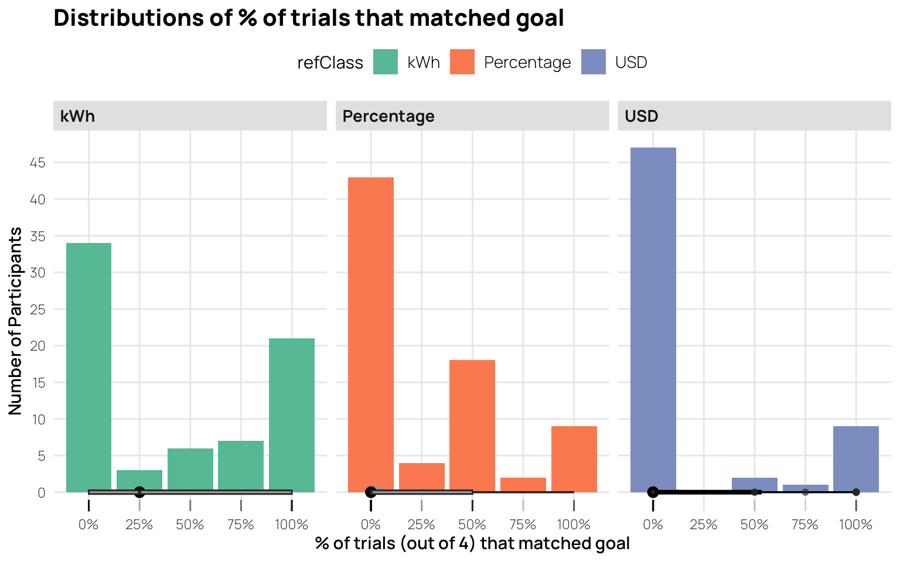

``` r
s2_agg |> group_by(id,refClass,pct_goal) |> 
  summarise(mg=sum(matched_goal),n=n(), pct=mg/n) |> 
  ggplot(aes(x=pct)) +
  geom_bar(aes(fill=refClass)) +
  ggdist::stat_halfeye() +
  geom_rug(alpha=0.1) +
  stat_boxplot(width=0.5, alpha=0.6) +
  facet_wrap(pct_goal~refClass) +
  labs(title="Distributions of % of trials that matched goal",
       x="% of trials (out of 2) that matched goal",
       y="Number of Participants") +
  scale_fill_brewer(palette="Set2") + 
  scale_y_continuous(breaks=seq(0,80,5))  + 
  scale_x_continuous(breaks=seq(0,1,.25),labels=scales::percent_format(accuracy=1))
```

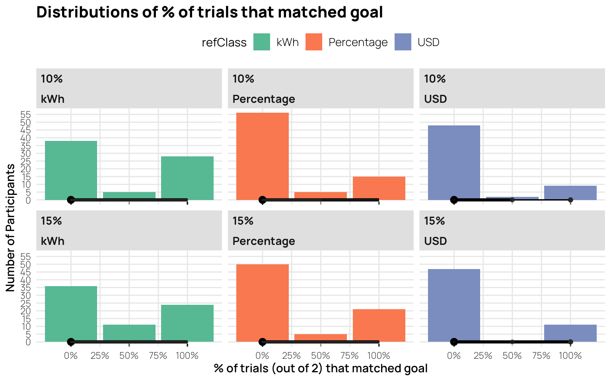

## Inspect response distribution for outliers

``` r
outliers <- s2_agg |>  ungroup() |> group_by(state) |> mutate(change_mean=mean(pct_change,na.rm=TRUE),change_sd=sd(pct_change,na.rm=TRUE),
                                     z_score=(pct_change-change_mean)/change_sd,
                                     is_outlier=abs(z_score)>3.0)

outlier_id <- outliers |> filter(is_outlier) |> pull(id) |> unique()

outlier_summary <- outliers %>%
  group_by(pct_goal, rounded, refClass,state) %>%
  summarise(
    num_outliers = sum(is_outlier, na.rm = TRUE),
    total = n(),
    outlier_percentage = (num_outliers / total) * 100
  )

outlier_plot <- ggplot(outliers, aes(x = state, y = z_score, color = is_outlier)) +
  geom_jitter(alpha = 0.5) +
  facet_wrap(~ pct_goal) +
  labs(
    title = "Z-Scores of Change in Energy Usage by State - outliers colored",
    x = "State",
    y = "Z-Score",
    color = "Outlier"
  ) +
  theme_minimal()

# Assess skewness and normality of the data
library(e1071)
# Calculate skewness and kurtosis for the `pct_change` variable
skewness_value <- skewness(s2_agg$pct_change, na.rm = TRUE)
kurtosis_value <- kurtosis(s2_agg$pct_change, na.rm = TRUE)

cat("Skewness:", skewness_value, "\n")
```

    Skewness: 1.2 

``` r
cat("Kurtosis:", kurtosis_value, "\n")
```

    Kurtosis: 2.9 

``` r
# Shapiro-Wilk test for normality (sample size limitation)
shapiro_test <- shapiro.test(s2_agg$pct_change[1:5000])  # Using first 5000 observations if large dataset
print(shapiro_test)
```


        Shapiro-Wilk normality test

    data:  s2_agg$pct_change[1:5000]
    W = 0.8, p-value <0.0000000000000002

## Before and after excluding outliers

``` r
#outlier_plot

s2_agg |> ggplot(aes(x=pct_change)) +
  geom_density(aes(fill=state), alpha=0.5) +
  ggdist::stat_halfeye() +
  geom_rug(alpha=0.1) +
  stat_boxplot(width=0.5, alpha=0.6) +
  facet_wrap(~refClass) +
  labs(title="Distribution of Percent Change by State and Reference Class - Before outlier exclusion",
       x="Percent Change",
       y="Density") +
  scale_fill_brewer(palette="Set2")
```

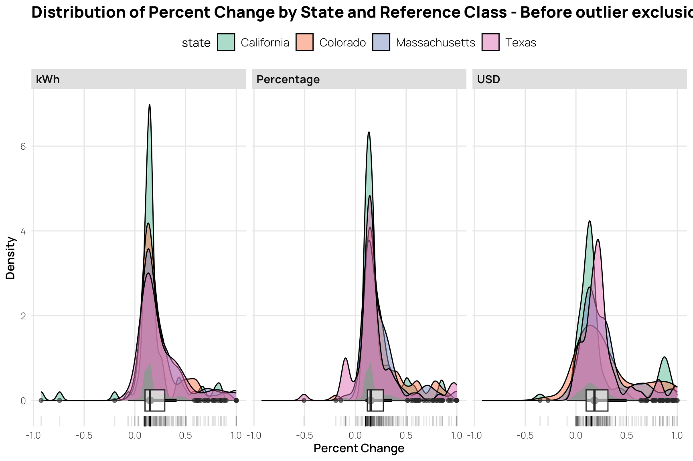

``` r
# plot densities in a better way to account for the positive skew

s2_agg <- s2_agg |> 
  filter(!id %in% outlier_id)

s2_agg |> 
  filter(!id %in% outlier_id) |>
  ggplot(aes(x=pct_change)) +
  geom_density(aes(fill=state), alpha=0.5) +
  ggdist::stat_halfeye() +
  geom_rug(alpha=0.1) +
  stat_boxplot(width=0.5, alpha=0.6) +
  facet_wrap(~refClass) +
  labs(title="After outlier exclusion",
       x="Percent Change",
       y="Density") +
  scale_fill_brewer(palette="Set2")
```

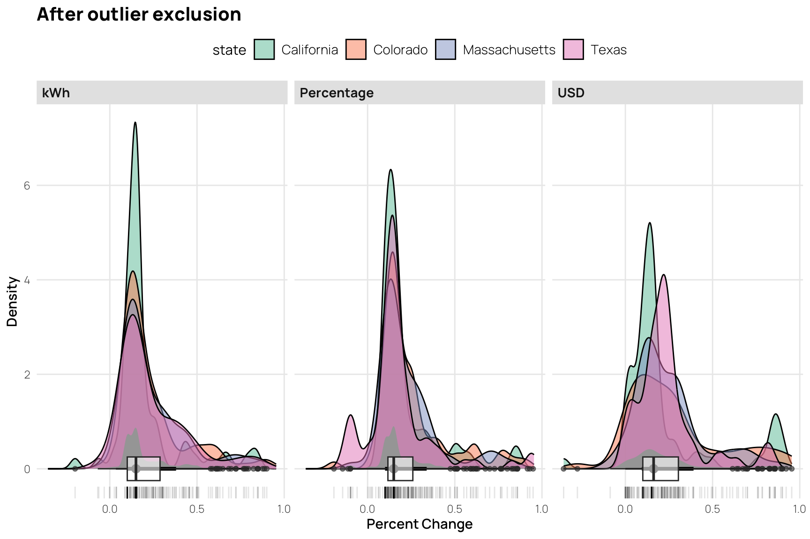

## Individual Participant responses

-   Facets indicate the Reference class (%, kWh, USD) and the goal % reduction (10%, 15%)
-   dashed lines also indicate goal percentage - dots on the line indicate participants who met the goal

``` r
  # add geom_vline with x intercept based on pct_goal of the data (which is currently a string of form 10%)
s2_agg |> 
  filter(block==1) |>
  ungroup() |> 
  mutate(goal_pct = as.numeric(stringr::str_remove(pct_goal,"%"))/100) |>
  mutate(id=reorder(id,pct_change)) |> 
  ggplot(aes(y=id,x=pct_change)) + 
  geom_point(size=1,alpha=0.6,position = position_jitter(w=0, h=0.17)) +
  geom_vline(aes(xintercept=goal_pct),linetype="dashed",alpha=.5) +
  ggh4x::facet_nested_wrap(refClass~pct_goal,axes="all",scales="free",ncol=2)  + 
  labs(y="Participant Id", x="Percent Change", title="Individual Performance") +
  theme(axis.text.y = element_text(family = "Manrope Light", face = "plain", size = rel(0.7)))
```

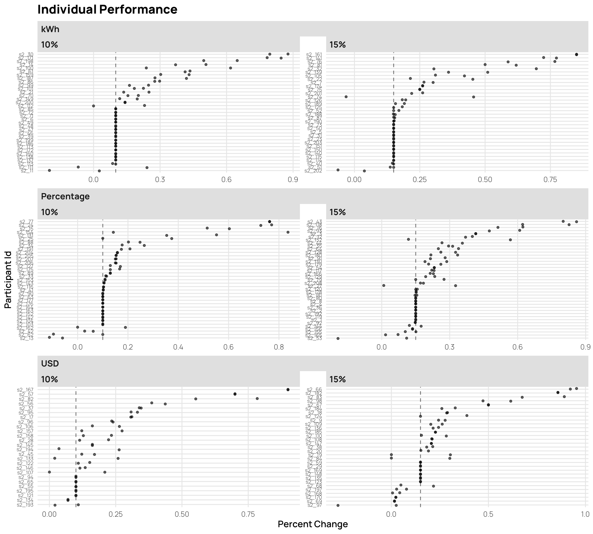

## Interactive data table

``` r
# plot distribution of reductions by applicance
# s2_long |> ggplot(aes(x = change)) + geom_histogram(bins = 30) + facet_wrap(~appliance, scales = "free")
s2_agg |> mutate(refClass=factor(refClass),pct_goal=factor(pct_goal),rounded=factor(rounded),state=factor(state)) |>
DT::datatable(extensions = 'Buttons',
  options = list(
    dom = 'Blfrtip',
    buttons = list('copy', 'csv', 'excel', 'pdf', 'print'),
    pageLength = 7,
    autoWidth = TRUE
  ),
  filter = 'top') # Add filtering at the top of each column)
```

<div class="datatables html-widget html-fill-item" id="htmlwidget-103ea345ef4f65c2ab59" style="width:100%;height:auto;"></div>
<script type="application/json" data-for="htmlwidget-103ea345ef4f65c2ab59">{"x":{"filter":"top","vertical":false,"filterHTML":"<tr>\n  <td><\/td>\n  <td data-type=\"character\" style=\"vertical-align: top;\">\n    <div class=\"form-group has-feedback\" style=\"margin-bottom: auto;\">\n      <input type=\"search\" placeholder=\"All\" class=\"form-control\" style=\"width: 100%;\"/>\n      <span class=\"glyphicon glyphicon-remove-circle form-control-feedback\"><\/span>\n    <\/div>\n  <\/td>\n  <td data-type=\"factor\" style=\"vertical-align: top;\">\n    <div class=\"form-group has-feedback\" style=\"margin-bottom: auto;\">\n      <input type=\"search\" placeholder=\"All\" class=\"form-control\" style=\"width: 100%;\"/>\n      <span class=\"glyphicon glyphicon-remove-circle form-control-feedback\"><\/span>\n    <\/div>\n    <div style=\"width: 100%; display: none;\">\n      <select multiple=\"multiple\" style=\"width: 100%;\" data-options=\"[&quot;kWh&quot;,&quot;Percentage&quot;,&quot;USD&quot;]\"><\/select>\n    <\/div>\n  <\/td>\n  <td data-type=\"factor\" style=\"vertical-align: top;\">\n    <div class=\"form-group has-feedback\" style=\"margin-bottom: auto;\">\n      <input type=\"search\" placeholder=\"All\" class=\"form-control\" style=\"width: 100%;\"/>\n      <span class=\"glyphicon glyphicon-remove-circle form-control-feedback\"><\/span>\n    <\/div>\n    <div style=\"width: 100%; display: none;\">\n      <select multiple=\"multiple\" style=\"width: 100%;\" data-options=\"[&quot;California&quot;,&quot;Colorado&quot;,&quot;Massachusetts&quot;,&quot;Texas&quot;]\"><\/select>\n    <\/div>\n  <\/td>\n  <td data-type=\"factor\" style=\"vertical-align: top;\">\n    <div class=\"form-group has-feedback\" style=\"margin-bottom: auto;\">\n      <input type=\"search\" placeholder=\"All\" class=\"form-control\" style=\"width: 100%;\"/>\n      <span class=\"glyphicon glyphicon-remove-circle form-control-feedback\"><\/span>\n    <\/div>\n    <div style=\"width: 100%; display: none;\">\n      <select multiple=\"multiple\" style=\"width: 100%;\" data-options=\"[&quot;10%&quot;,&quot;15%&quot;]\"><\/select>\n    <\/div>\n  <\/td>\n  <td data-type=\"number\" style=\"vertical-align: top;\">\n    <div class=\"form-group has-feedback\" style=\"margin-bottom: auto;\">\n      <input type=\"search\" placeholder=\"All\" class=\"form-control\" style=\"width: 100%;\"/>\n      <span class=\"glyphicon glyphicon-remove-circle form-control-feedback\"><\/span>\n    <\/div>\n    <div style=\"display: none;position: absolute;width: 200px;opacity: 1\">\n      <div data-min=\"0.1\" data-max=\"0.15\" data-scale=\"2\"><\/div>\n      <span style=\"float: left;\"><\/span>\n      <span style=\"float: right;\"><\/span>\n    <\/div>\n  <\/td>\n  <td data-type=\"factor\" style=\"vertical-align: top;\">\n    <div class=\"form-group has-feedback\" style=\"margin-bottom: auto;\">\n      <input type=\"search\" placeholder=\"All\" class=\"form-control\" style=\"width: 100%;\"/>\n      <span class=\"glyphicon glyphicon-remove-circle form-control-feedback\"><\/span>\n    <\/div>\n    <div style=\"width: 100%; display: none;\">\n      <select multiple=\"multiple\" style=\"width: 100%;\" data-options=\"[&quot;Not Rounded&quot;,&quot;Rounded&quot;]\"><\/select>\n    <\/div>\n  <\/td>\n  <td data-type=\"number\" style=\"vertical-align: top;\">\n    <div class=\"form-group has-feedback\" style=\"margin-bottom: auto;\">\n      <input type=\"search\" placeholder=\"All\" class=\"form-control\" style=\"width: 100%;\"/>\n      <span class=\"glyphicon glyphicon-remove-circle form-control-feedback\"><\/span>\n    <\/div>\n    <div style=\"display: none;position: absolute;width: 200px;opacity: 1\">\n      <div data-min=\"1\" data-max=\"2\"><\/div>\n      <span style=\"float: left;\"><\/span>\n      <span style=\"float: right;\"><\/span>\n    <\/div>\n  <\/td>\n  <td data-type=\"factor\" style=\"vertical-align: top;\">\n    <div class=\"form-group has-feedback\" style=\"margin-bottom: auto;\">\n      <input type=\"search\" placeholder=\"All\" class=\"form-control\" style=\"width: 100%;\"/>\n      <span class=\"glyphicon glyphicon-remove-circle form-control-feedback\"><\/span>\n    <\/div>\n    <div style=\"width: 100%; display: none;\">\n      <select multiple=\"multiple\" style=\"width: 100%;\" data-options=\"[&quot;plan1&quot;,&quot;plan2&quot;]\"><\/select>\n    <\/div>\n  <\/td>\n  <td data-type=\"character\" style=\"vertical-align: top;\">\n    <div class=\"form-group has-feedback\" style=\"margin-bottom: auto;\">\n      <input type=\"search\" placeholder=\"All\" class=\"form-control\" style=\"width: 100%;\"/>\n      <span class=\"glyphicon glyphicon-remove-circle form-control-feedback\"><\/span>\n    <\/div>\n  <\/td>\n  <td data-type=\"factor\" style=\"vertical-align: top;\">\n    <div class=\"form-group has-feedback\" style=\"margin-bottom: auto;\">\n      <input type=\"search\" placeholder=\"All\" class=\"form-control\" style=\"width: 100%;\"/>\n      <span class=\"glyphicon glyphicon-remove-circle form-control-feedback\"><\/span>\n    <\/div>\n    <div style=\"width: 100%; display: none;\">\n      <select multiple=\"multiple\" style=\"width: 100%;\" data-options=\"[&quot;College degree&quot;,&quot;Graduate degree&quot;,&quot;Highschool diploma or GED&quot;,&quot;Some college&quot;,&quot;Some graduate school&quot;]\"><\/select>\n    <\/div>\n  <\/td>\n  <td data-type=\"number\" style=\"vertical-align: top;\">\n    <div class=\"form-group has-feedback\" style=\"margin-bottom: auto;\">\n      <input type=\"search\" placeholder=\"All\" class=\"form-control\" style=\"width: 100%;\"/>\n      <span class=\"glyphicon glyphicon-remove-circle form-control-feedback\"><\/span>\n    <\/div>\n    <div style=\"display: none;position: absolute;width: 200px;opacity: 1\">\n      <div data-min=\"1470\" data-max=\"51000\" data-scale=\"3\"><\/div>\n      <span style=\"float: left;\"><\/span>\n      <span style=\"float: right;\"><\/span>\n    <\/div>\n  <\/td>\n  <td data-type=\"number\" style=\"vertical-align: top;\">\n    <div class=\"form-group has-feedback\" style=\"margin-bottom: auto;\">\n      <input type=\"search\" placeholder=\"All\" class=\"form-control\" style=\"width: 100%;\"/>\n      <span class=\"glyphicon glyphicon-remove-circle form-control-feedback\"><\/span>\n    <\/div>\n    <div style=\"display: none;position: absolute;width: 200px;opacity: 1\">\n      <div data-min=\"19516\" data-max=\"46293\" data-scale=\"11\"><\/div>\n      <span style=\"float: left;\"><\/span>\n      <span style=\"float: right;\"><\/span>\n    <\/div>\n  <\/td>\n  <td data-type=\"number\" style=\"vertical-align: top;\">\n    <div class=\"form-group has-feedback\" style=\"margin-bottom: auto;\">\n      <input type=\"search\" placeholder=\"All\" class=\"form-control\" style=\"width: 100%;\"/>\n      <span class=\"glyphicon glyphicon-remove-circle form-control-feedback\"><\/span>\n    <\/div>\n    <div style=\"display: none;position: absolute;width: 200px;opacity: 1\">\n      <div data-min=\"-0.354\" data-max=\"0.954\" data-scale=\"3\"><\/div>\n      <span style=\"float: left;\"><\/span>\n      <span style=\"float: right;\"><\/span>\n    <\/div>\n  <\/td>\n  <td data-type=\"number\" style=\"vertical-align: top;\">\n    <div class=\"form-group has-feedback\" style=\"margin-bottom: auto;\">\n      <input type=\"search\" placeholder=\"All\" class=\"form-control\" style=\"width: 100%;\"/>\n      <span class=\"glyphicon glyphicon-remove-circle form-control-feedback\"><\/span>\n    <\/div>\n    <div style=\"display: none;position: absolute;width: 200px;opacity: 1\">\n      <div data-min=\"-5737\" data-max=\"4093\" data-scale=\"14\"><\/div>\n      <span style=\"float: left;\"><\/span>\n      <span style=\"float: right;\"><\/span>\n    <\/div>\n  <\/td>\n  <td data-type=\"logical\" style=\"vertical-align: top;\">\n    <div class=\"form-group has-feedback\" style=\"margin-bottom: auto;\">\n      <input type=\"search\" placeholder=\"All\" class=\"form-control\" style=\"width: 100%;\"/>\n      <span class=\"glyphicon glyphicon-remove-circle form-control-feedback\"><\/span>\n    <\/div>\n    <div style=\"width: 100%; display: none;\">\n      <select multiple=\"multiple\" style=\"width: 100%;\" data-options=\"[&quot;true&quot;,&quot;false&quot;]\"><\/select>\n    <\/div>\n  <\/td>\n  <td data-type=\"logical\" style=\"vertical-align: top;\">\n    <div class=\"form-group has-feedback\" style=\"margin-bottom: auto;\">\n      <input type=\"search\" placeholder=\"All\" class=\"form-control\" style=\"width: 100%;\"/>\n      <span class=\"glyphicon glyphicon-remove-circle form-control-feedback\"><\/span>\n    <\/div>\n    <div style=\"width: 100%; display: none;\">\n      <select multiple=\"multiple\" style=\"width: 100%;\" data-options=\"[&quot;true&quot;,&quot;false&quot;]\"><\/select>\n    <\/div>\n  <\/td>\n<\/tr>","extensions":["Buttons"],"data":[["1","2","3","4","5","6","7","8","9","10","11","12","13","14","15","16","17","18","19","20","21","22","23","24","25","26","27","28","29","30","31","32","33","34","35","36","37","38","39","40","41","42","43","44","45","46","47","48","49","50","51","52","53","54","55","56","57","58","59","60","61","62","63","64","65","66","67","68","69","70","71","72","73","74","75","76","77","78","79","80","81","82","83","84","85","86","87","88","89","90","91","92","93","94","95","96","97","98","99","100","101","102","103","104","105","106","107","108","109","110","111","112","113","114","115","116","117","118","119","120","121","122","123","124","125","126","127","128","129","130","131","132","133","134","135","136","137","138","139","140","141","142","143","144","145","146","147","148","149","150","151","152","153","154","155","156","157","158","159","160","161","162","163","164","165","166","167","168","169","170","171","172","173","174","175","176","177","178","179","180","181","182","183","184","185","186","187","188","189","190","191","192","193","194","195","196","197","198","199","200","201","202","203","204","205","206","207","208","209","210","211","212","213","214","215","216","217","218","219","220","221","222","223","224","225","226","227","228","229","230","231","232","233","234","235","236","237","238","239","240","241","242","243","244","245","246","247","248","249","250","251","252","253","254","255","256","257","258","259","260","261","262","263","264","265","266","267","268","269","270","271","272","273","274","275","276","277","278","279","280","281","282","283","284","285","286","287","288","289","290","291","292","293","294","295","296","297","298","299","300","301","302","303","304","305","306","307","308","309","310","311","312","313","314","315","316","317","318","319","320","321","322","323","324","325","326","327","328","329","330","331","332","333","334","335","336","337","338","339","340","341","342","343","344","345","346","347","348","349","350","351","352","353","354","355","356","357","358","359","360","361","362","363","364","365","366","367","368","369","370","371","372","373","374","375","376","377","378","379","380","381","382","383","384","385","386","387","388","389","390","391","392","393","394","395","396","397","398","399","400","401","402","403","404","405","406","407","408","409","410","411","412","413","414","415","416","417","418","419","420","421","422","423","424","425","426","427","428","429","430","431","432","433","434","435","436","437","438","439","440","441","442","443","444","445","446","447","448","449","450","451","452","453","454","455","456","457","458","459","460","461","462","463","464","465","466","467","468","469","470","471","472","473","474","475","476","477","478","479","480","481","482","483","484","485","486","487","488","489","490","491","492","493","494","495","496","497","498","499","500","501","502","503","504","505","506","507","508","509","510","511","512","513","514","515","516","517","518","519","520","521","522","523","524","525","526","527","528","529","530","531","532","533","534","535","536","537","538","539","540","541","542","543","544","545","546","547","548","549","550","551","552","553","554","555","556","557","558","559","560","561","562","563","564","565","566","567","568","569","570","571","572","573","574","575","576","577","578","579","580","581","582","583","584","585","586","587","588","589","590","591","592","593","594","595","596","597","598","599","600","601","602","603","604","605","606","607","608","609","610","611","612","613","614","615","616","617","618","619","620","621","622","623","624","625","626","627","628","629","630","631","632","633","634","635","636","637","638","639","640","641","642","643","644","645","646","647","648","649","650","651","652","653","654","655","656","657","658","659","660","661","662","663","664","665","666","667","668","669","670","671","672","673","674","675","676","677","678","679","680","681","682","683","684","685","686","687","688","689","690","691","692","693","694","695","696","697","698","699","700","701","702","703","704","705","706","707","708","709","710","711","712","713","714","715","716","717","718","719","720","721","722","723","724","725","726","727","728","729","730","731","732","733","734","735","736","737","738","739","740","741","742","743","744","745","746","747","748","749","750","751","752","753","754","755","756","757","758","759","760","761","762","763","764","765","766","767","768","769","770","771","772","773","774","775","776","777","778","779","780","781","782","783","784","785","786","787","788","789","790","791","792","793","794","795","796","797","798","799","800"],["s2_1","s2_1","s2_1","s2_1","s2_100","s2_100","s2_100","s2_100","s2_101","s2_101","s2_101","s2_101","s2_103","s2_103","s2_103","s2_103","s2_104","s2_104","s2_104","s2_104","s2_105","s2_105","s2_105","s2_105","s2_106","s2_106","s2_106","s2_106","s2_107","s2_107","s2_107","s2_107","s2_108","s2_108","s2_108","s2_108","s2_109","s2_109","s2_109","s2_109","s2_11","s2_11","s2_11","s2_11","s2_110","s2_110","s2_110","s2_110","s2_111","s2_111","s2_111","s2_111","s2_112","s2_112","s2_112","s2_112","s2_113","s2_113","s2_113","s2_113","s2_114","s2_114","s2_114","s2_114","s2_115","s2_115","s2_115","s2_115","s2_116","s2_116","s2_116","s2_116","s2_117","s2_117","s2_117","s2_117","s2_118","s2_118","s2_118","s2_118","s2_119","s2_119","s2_119","s2_119","s2_12","s2_12","s2_12","s2_12","s2_120","s2_120","s2_120","s2_120","s2_121","s2_121","s2_121","s2_121","s2_122","s2_122","s2_122","s2_122","s2_123","s2_123","s2_123","s2_123","s2_124","s2_124","s2_124","s2_124","s2_125","s2_125","s2_125","s2_125","s2_126","s2_126","s2_126","s2_126","s2_127","s2_127","s2_127","s2_127","s2_128","s2_128","s2_128","s2_128","s2_129","s2_129","s2_129","s2_129","s2_13","s2_13","s2_13","s2_13","s2_130","s2_130","s2_130","s2_130","s2_131","s2_131","s2_131","s2_131","s2_132","s2_132","s2_132","s2_132","s2_133","s2_133","s2_133","s2_133","s2_134","s2_134","s2_134","s2_134","s2_135","s2_135","s2_135","s2_135","s2_136","s2_136","s2_136","s2_136","s2_137","s2_137","s2_137","s2_137","s2_138","s2_138","s2_138","s2_138","s2_139","s2_139","s2_139","s2_139","s2_14","s2_14","s2_14","s2_14","s2_140","s2_140","s2_140","s2_140","s2_141","s2_141","s2_141","s2_141","s2_142","s2_142","s2_142","s2_142","s2_143","s2_143","s2_143","s2_143","s2_144","s2_144","s2_144","s2_144","s2_145","s2_145","s2_145","s2_145","s2_146","s2_146","s2_146","s2_146","s2_147","s2_147","s2_147","s2_147","s2_148","s2_148","s2_148","s2_148","s2_149","s2_149","s2_149","s2_149","s2_15","s2_15","s2_15","s2_15","s2_150","s2_150","s2_150","s2_150","s2_151","s2_151","s2_151","s2_151","s2_152","s2_152","s2_152","s2_152","s2_153","s2_153","s2_153","s2_153","s2_154","s2_154","s2_154","s2_154","s2_155","s2_155","s2_155","s2_155","s2_156","s2_156","s2_156","s2_156","s2_157","s2_157","s2_157","s2_157","s2_158","s2_158","s2_158","s2_158","s2_159","s2_159","s2_159","s2_159","s2_16","s2_16","s2_16","s2_16","s2_160","s2_160","s2_160","s2_160","s2_161","s2_161","s2_161","s2_161","s2_162","s2_162","s2_162","s2_162","s2_163","s2_163","s2_163","s2_163","s2_164","s2_164","s2_164","s2_164","s2_165","s2_165","s2_165","s2_165","s2_166","s2_166","s2_166","s2_166","s2_167","s2_167","s2_167","s2_167","s2_168","s2_168","s2_168","s2_168","s2_169","s2_169","s2_169","s2_169","s2_17","s2_17","s2_17","s2_17","s2_170","s2_170","s2_170","s2_170","s2_171","s2_171","s2_171","s2_171","s2_172","s2_172","s2_172","s2_172","s2_173","s2_173","s2_173","s2_173","s2_174","s2_174","s2_174","s2_174","s2_175","s2_175","s2_175","s2_175","s2_176","s2_176","s2_176","s2_176","s2_177","s2_177","s2_177","s2_177","s2_178","s2_178","s2_178","s2_178","s2_179","s2_179","s2_179","s2_179","s2_18","s2_18","s2_18","s2_18","s2_180","s2_180","s2_180","s2_180","s2_181","s2_181","s2_181","s2_181","s2_182","s2_182","s2_182","s2_182","s2_184","s2_184","s2_184","s2_184","s2_185","s2_185","s2_185","s2_185","s2_186","s2_186","s2_186","s2_186","s2_187","s2_187","s2_187","s2_187","s2_188","s2_188","s2_188","s2_188","s2_189","s2_189","s2_189","s2_189","s2_19","s2_19","s2_19","s2_19","s2_190","s2_190","s2_190","s2_190","s2_191","s2_191","s2_191","s2_191","s2_192","s2_192","s2_192","s2_192","s2_193","s2_193","s2_193","s2_193","s2_194","s2_194","s2_194","s2_194","s2_195","s2_195","s2_195","s2_195","s2_197","s2_197","s2_197","s2_197","s2_198","s2_198","s2_198","s2_198","s2_199","s2_199","s2_199","s2_199","s2_2","s2_2","s2_2","s2_2","s2_20","s2_20","s2_20","s2_20","s2_200","s2_200","s2_200","s2_200","s2_201","s2_201","s2_201","s2_201","s2_202","s2_202","s2_202","s2_202","s2_203","s2_203","s2_203","s2_203","s2_204","s2_204","s2_204","s2_204","s2_205","s2_205","s2_205","s2_205","s2_206","s2_206","s2_206","s2_206","s2_207","s2_207","s2_207","s2_207","s2_208","s2_208","s2_208","s2_208","s2_21","s2_21","s2_21","s2_21","s2_22","s2_22","s2_22","s2_22","s2_23","s2_23","s2_23","s2_23","s2_24","s2_24","s2_24","s2_24","s2_25","s2_25","s2_25","s2_25","s2_27","s2_27","s2_27","s2_27","s2_28","s2_28","s2_28","s2_28","s2_29","s2_29","s2_29","s2_29","s2_3","s2_3","s2_3","s2_3","s2_30","s2_30","s2_30","s2_30","s2_31","s2_31","s2_31","s2_31","s2_32","s2_32","s2_32","s2_32","s2_33","s2_33","s2_33","s2_33","s2_34","s2_34","s2_34","s2_34","s2_35","s2_35","s2_35","s2_35","s2_36","s2_36","s2_36","s2_36","s2_37","s2_37","s2_37","s2_37","s2_38","s2_38","s2_38","s2_38","s2_39","s2_39","s2_39","s2_39","s2_4","s2_4","s2_4","s2_4","s2_40","s2_40","s2_40","s2_40","s2_41","s2_41","s2_41","s2_41","s2_42","s2_42","s2_42","s2_42","s2_43","s2_43","s2_43","s2_43","s2_44","s2_44","s2_44","s2_44","s2_45","s2_45","s2_45","s2_45","s2_46","s2_46","s2_46","s2_46","s2_47","s2_47","s2_47","s2_47","s2_48","s2_48","s2_48","s2_48","s2_49","s2_49","s2_49","s2_49","s2_5","s2_5","s2_5","s2_5","s2_50","s2_50","s2_50","s2_50","s2_51","s2_51","s2_51","s2_51","s2_52","s2_52","s2_52","s2_52","s2_53","s2_53","s2_53","s2_53","s2_54","s2_54","s2_54","s2_54","s2_55","s2_55","s2_55","s2_55","s2_56","s2_56","s2_56","s2_56","s2_57","s2_57","s2_57","s2_57","s2_59","s2_59","s2_59","s2_59","s2_6","s2_6","s2_6","s2_6","s2_61","s2_61","s2_61","s2_61","s2_62","s2_62","s2_62","s2_62","s2_63","s2_63","s2_63","s2_63","s2_64","s2_64","s2_64","s2_64","s2_65","s2_65","s2_65","s2_65","s2_66","s2_66","s2_66","s2_66","s2_67","s2_67","s2_67","s2_67","s2_68","s2_68","s2_68","s2_68","s2_69","s2_69","s2_69","s2_69","s2_7","s2_7","s2_7","s2_7","s2_70","s2_70","s2_70","s2_70","s2_71","s2_71","s2_71","s2_71","s2_72","s2_72","s2_72","s2_72","s2_73","s2_73","s2_73","s2_73","s2_74","s2_74","s2_74","s2_74","s2_75","s2_75","s2_75","s2_75","s2_76","s2_76","s2_76","s2_76","s2_77","s2_77","s2_77","s2_77","s2_79","s2_79","s2_79","s2_79","s2_8","s2_8","s2_8","s2_8","s2_80","s2_80","s2_80","s2_80","s2_81","s2_81","s2_81","s2_81","s2_82","s2_82","s2_82","s2_82","s2_83","s2_83","s2_83","s2_83","s2_84","s2_84","s2_84","s2_84","s2_85","s2_85","s2_85","s2_85","s2_86","s2_86","s2_86","s2_86","s2_87","s2_87","s2_87","s2_87","s2_88","s2_88","s2_88","s2_88","s2_89","s2_89","s2_89","s2_89","s2_9","s2_9","s2_9","s2_9","s2_90","s2_90","s2_90","s2_90","s2_91","s2_91","s2_91","s2_91","s2_92","s2_92","s2_92","s2_92","s2_93","s2_93","s2_93","s2_93","s2_94","s2_94","s2_94","s2_94","s2_95","s2_95","s2_95","s2_95","s2_96","s2_96","s2_96","s2_96","s2_97","s2_97","s2_97","s2_97","s2_98","s2_98","s2_98","s2_98","s2_99","s2_99","s2_99","s2_99"],["Percentage","Percentage","Percentage","Percentage","kWh","kWh","kWh","kWh","kWh","kWh","kWh","kWh","Percentage","Percentage","Percentage","Percentage","Percentage","Percentage","Percentage","Percentage","kWh","kWh","kWh","kWh","USD","USD","USD","USD","USD","USD","USD","USD","USD","USD","USD","USD","USD","USD","USD","USD","kWh","kWh","kWh","kWh","USD","USD","USD","USD","kWh","kWh","kWh","kWh","kWh","kWh","kWh","kWh","kWh","kWh","kWh","kWh","kWh","kWh","kWh","kWh","kWh","kWh","kWh","kWh","Percentage","Percentage","Percentage","Percentage","Percentage","Percentage","Percentage","Percentage","Percentage","Percentage","Percentage","Percentage","Percentage","Percentage","Percentage","Percentage","Percentage","Percentage","Percentage","Percentage","Percentage","Percentage","Percentage","Percentage","USD","USD","USD","USD","USD","USD","USD","USD","USD","USD","USD","USD","USD","USD","USD","USD","kWh","kWh","kWh","kWh","kWh","kWh","kWh","kWh","Percentage","Percentage","Percentage","Percentage","Percentage","Percentage","Percentage","Percentage","Percentage","Percentage","Percentage","Percentage","Percentage","Percentage","Percentage","Percentage","Percentage","Percentage","Percentage","Percentage","Percentage","Percentage","Percentage","Percentage","Percentage","Percentage","Percentage","Percentage","USD","USD","USD","USD","USD","USD","USD","USD","USD","USD","USD","USD","USD","USD","USD","USD","kWh","kWh","kWh","kWh","kWh","kWh","kWh","kWh","kWh","kWh","kWh","kWh","kWh","kWh","kWh","kWh","kWh","kWh","kWh","kWh","kWh","kWh","kWh","kWh","Percentage","Percentage","Percentage","Percentage","Percentage","Percentage","Percentage","Percentage","Percentage","Percentage","Percentage","Percentage","USD","USD","USD","USD","USD","USD","USD","USD","USD","USD","USD","USD","USD","USD","USD","USD","kWh","kWh","kWh","kWh","Percentage","Percentage","Percentage","Percentage","kWh","kWh","kWh","kWh","kWh","kWh","kWh","kWh","Percentage","Percentage","Percentage","Percentage","Percentage","Percentage","Percentage","Percentage","Percentage","Percentage","Percentage","Percentage","Percentage","Percentage","Percentage","Percentage","Percentage","Percentage","Percentage","Percentage","USD","USD","USD","USD","USD","USD","USD","USD","kWh","kWh","kWh","kWh","Percentage","Percentage","Percentage","Percentage","kWh","kWh","kWh","kWh","kWh","kWh","kWh","kWh","Percentage","Percentage","Percentage","Percentage","Percentage","Percentage","Percentage","Percentage","Percentage","Percentage","Percentage","Percentage","Percentage","Percentage","Percentage","Percentage","Percentage","Percentage","Percentage","Percentage","USD","USD","USD","USD","USD","USD","USD","USD","USD","USD","USD","USD","USD","USD","USD","USD","USD","USD","USD","USD","kWh","kWh","kWh","kWh","kWh","kWh","kWh","kWh","kWh","kWh","kWh","kWh","kWh","kWh","kWh","kWh","Percentage","Percentage","Percentage","Percentage","Percentage","Percentage","Percentage","Percentage","Percentage","Percentage","Percentage","Percentage","Percentage","Percentage","Percentage","Percentage","Percentage","Percentage","Percentage","Percentage","USD","USD","USD","USD","Percentage","Percentage","Percentage","Percentage","Percentage","Percentage","Percentage","Percentage","USD","USD","USD","USD","USD","USD","USD","USD","USD","USD","USD","USD","kWh","kWh","kWh","kWh","kWh","kWh","kWh","kWh","kWh","kWh","kWh","kWh","kWh","kWh","kWh","kWh","USD","USD","USD","USD","kWh","kWh","kWh","kWh","Percentage","Percentage","Percentage","Percentage","Percentage","Percentage","Percentage","Percentage","USD","USD","USD","USD","USD","USD","USD","USD","USD","USD","USD","USD","USD","USD","USD","USD","kWh","kWh","kWh","kWh","kWh","kWh","kWh","kWh","Percentage","Percentage","Percentage","Percentage","USD","USD","USD","USD","kWh","kWh","kWh","kWh","kWh","kWh","kWh","kWh","kWh","kWh","kWh","kWh","kWh","kWh","kWh","kWh","Percentage","Percentage","Percentage","Percentage","Percentage","Percentage","Percentage","Percentage","Percentage","Percentage","Percentage","Percentage","Percentage","Percentage","Percentage","Percentage","Percentage","Percentage","Percentage","Percentage","kWh","kWh","kWh","kWh","kWh","kWh","kWh","kWh","kWh","kWh","kWh","kWh","Percentage","Percentage","Percentage","Percentage","Percentage","Percentage","Percentage","Percentage","Percentage","Percentage","Percentage","Percentage","USD","USD","USD","USD","USD","USD","USD","USD","Percentage","Percentage","Percentage","Percentage","kWh","kWh","kWh","kWh","kWh","kWh","kWh","kWh","kWh","kWh","kWh","kWh","Percentage","Percentage","Percentage","Percentage","Percentage","Percentage","Percentage","Percentage","Percentage","Percentage","Percentage","Percentage","Percentage","Percentage","Percentage","Percentage","USD","USD","USD","USD","USD","USD","USD","USD","kWh","kWh","kWh","kWh","Percentage","Percentage","Percentage","Percentage","kWh","kWh","kWh","kWh","Percentage","Percentage","Percentage","Percentage","Percentage","Percentage","Percentage","Percentage","Percentage","Percentage","Percentage","Percentage","Percentage","Percentage","Percentage","Percentage","USD","USD","USD","USD","kWh","kWh","kWh","kWh","kWh","kWh","kWh","kWh","kWh","kWh","kWh","kWh","kWh","kWh","kWh","kWh","kWh","kWh","kWh","kWh","kWh","kWh","kWh","kWh","kWh","kWh","kWh","kWh","kWh","kWh","kWh","kWh","Percentage","Percentage","Percentage","Percentage","Percentage","Percentage","Percentage","Percentage","USD","USD","USD","USD","USD","USD","USD","USD","USD","USD","USD","USD","USD","USD","USD","USD","kWh","kWh","kWh","kWh","kWh","kWh","kWh","kWh","Percentage","Percentage","Percentage","Percentage","Percentage","Percentage","Percentage","Percentage","Percentage","Percentage","Percentage","Percentage","USD","USD","USD","USD","USD","USD","USD","USD","USD","USD","USD","USD","USD","USD","USD","USD","USD","USD","USD","USD","kWh","kWh","kWh","kWh","kWh","kWh","kWh","kWh","kWh","kWh","kWh","kWh","kWh","kWh","kWh","kWh","kWh","kWh","kWh","kWh","kWh","kWh","kWh","kWh","kWh","kWh","kWh","kWh","kWh","kWh","kWh","kWh","Percentage","Percentage","Percentage","Percentage","Percentage","Percentage","Percentage","Percentage","Percentage","Percentage","Percentage","Percentage","Percentage","Percentage","Percentage","Percentage","kWh","kWh","kWh","kWh","USD","USD","USD","USD","USD","USD","USD","USD","USD","USD","USD","USD","kWh","kWh","kWh","kWh","kWh","kWh","kWh","kWh","kWh","kWh","kWh","kWh","Percentage","Percentage","Percentage","Percentage","Percentage","Percentage","Percentage","Percentage","USD","USD","USD","USD","Percentage","Percentage","Percentage","Percentage","Percentage","Percentage","Percentage","Percentage","Percentage","Percentage","Percentage","Percentage","Percentage","Percentage","Percentage","Percentage","USD","USD","USD","USD","USD","USD","USD","USD","USD","USD","USD","USD","USD","USD","USD","USD","USD","USD","USD","USD","kWh","kWh","kWh","kWh"],["Colorado","Colorado","Texas","Texas","Colorado","Colorado","Texas","Texas","Colorado","Colorado","Texas","Texas","Colorado","Colorado","Texas","Texas","Colorado","Colorado","Texas","Texas","Massachusetts","Massachusetts","Texas","Texas","Massachusetts","Massachusetts","Texas","Texas","Massachusetts","Massachusetts","Texas","Texas","Massachusetts","Massachusetts","Texas","Texas","Massachusetts","Massachusetts","Texas","Texas","California","California","Massachusetts","Massachusetts","Massachusetts","Massachusetts","Texas","Texas","Massachusetts","Massachusetts","Texas","Texas","Massachusetts","Massachusetts","Texas","Texas","Massachusetts","Massachusetts","Texas","Texas","Massachusetts","Massachusetts","Texas","Texas","Massachusetts","Massachusetts","Texas","Texas","Massachusetts","Massachusetts","Texas","Texas","Massachusetts","Massachusetts","Texas","Texas","Massachusetts","Massachusetts","Texas","Texas","Massachusetts","Massachusetts","Texas","Texas","California","California","Colorado","Colorado","Massachusetts","Massachusetts","Texas","Texas","California","California","Massachusetts","Massachusetts","California","California","Massachusetts","Massachusetts","California","California","Massachusetts","Massachusetts","California","California","Massachusetts","Massachusetts","California","California","Massachusetts","Massachusetts","California","California","Massachusetts","Massachusetts","California","California","Massachusetts","Massachusetts","California","California","Massachusetts","Massachusetts","California","California","Massachusetts","Massachusetts","Colorado","Colorado","Texas","Texas","California","California","Massachusetts","Massachusetts","Massachusetts","Massachusetts","Texas","Texas","California","California","Massachusetts","Massachusetts","Massachusetts","Massachusetts","Texas","Texas","Massachusetts","Massachusetts","Texas","Texas","Massachusetts","Massachusetts","Texas","Texas","Massachusetts","Massachusetts","Texas","Texas","Massachusetts","Massachusetts","Texas","Texas","Massachusetts","Massachusetts","Texas","Texas","Massachusetts","Massachusetts","Texas","Texas","Colorado","Colorado","Texas","Texas","Massachusetts","Massachusetts","Texas","Texas","Massachusetts","Massachusetts","Texas","Texas","Massachusetts","Massachusetts","Texas","Texas","Massachusetts","Massachusetts","Texas","Texas","Massachusetts","Massachusetts","Texas","Texas","California","California","Massachusetts","Massachusetts","California","California","Massachusetts","Massachusetts","California","California","Massachusetts","Massachusetts","California","California","Massachusetts","Massachusetts","California","California","Massachusetts","Massachusetts","California","California","Colorado","Colorado","California","California","Massachusetts","Massachusetts","California","California","Massachusetts","Massachusetts","California","California","Massachusetts","Massachusetts","California","California","Massachusetts","Massachusetts","California","California","Massachusetts","Massachusetts","California","California","Massachusetts","Massachusetts","California","California","Massachusetts","Massachusetts","California","California","Colorado","Colorado","Colorado","Colorado","Texas","Texas","Colorado","Colorado","Texas","Texas","California","California","Colorado","Colorado","Colorado","Colorado","Texas","Texas","Colorado","Colorado","Texas","Texas","Colorado","Colorado","Texas","Texas","Colorado","Colorado","Texas","Texas","Colorado","Colorado","Texas","Texas","Colorado","Colorado","Texas","Texas","Colorado","Colorado","Texas","Texas","California","California","Colorado","Colorado","California","California","Colorado","Colorado","California","California","Colorado","Colorado","Massachusetts","Massachusetts","Texas","Texas","California","California","Colorado","Colorado","California","California","Colorado","Colorado","California","California","Colorado","Colorado","California","California","Colorado","Colorado","California","California","Colorado","Colorado","California","California","Colorado","Colorado","California","California","Colorado","Colorado","California","California","Colorado","Colorado","California","California","Colorado","Colorado","California","California","Colorado","Colorado","Massachusetts","Massachusetts","Texas","Texas","California","California","Colorado","Colorado","Colorado","Colorado","Texas","Texas","California","California","Colorado","Colorado","Colorado","Colorado","Texas","Texas","Colorado","Colorado","Texas","Texas","Colorado","Colorado","Texas","Texas","Colorado","Colorado","Texas","Texas","Colorado","Colorado","Texas","Texas","Colorado","Colorado","Texas","Texas","Massachusetts","Massachusetts","Texas","Texas","Colorado","Colorado","Texas","Texas","Colorado","Colorado","Texas","Texas","Colorado","Colorado","Texas","Texas","California","California","Colorado","Colorado","California","California","Colorado","Colorado","California","California","Colorado","Colorado","California","California","Colorado","Colorado","California","California","Colorado","Colorado","California","California","Colorado","Colorado","Colorado","Colorado","Texas","Texas","Massachusetts","Massachusetts","Texas","Texas","California","California","Colorado","Colorado","California","California","Colorado","Colorado","California","California","Colorado","Colorado","California","California","Colorado","Colorado","California","California","Colorado","Colorado","California","California","Colorado","Colorado","California","California","Colorado","Colorado","California","California","Colorado","Colorado","California","California","Colorado","Colorado","Massachusetts","Massachusetts","Texas","Texas","Massachusetts","Massachusetts","Texas","Texas","Massachusetts","Massachusetts","Texas","Texas","Massachusetts","Massachusetts","Texas","Texas","Massachusetts","Massachusetts","Texas","Texas","Massachusetts","Massachusetts","Texas","Texas","California","California","Massachusetts","Massachusetts","California","California","Massachusetts","Massachusetts","Colorado","Colorado","Texas","Texas","California","California","Massachusetts","Massachusetts","California","California","Massachusetts","Massachusetts","California","California","Massachusetts","Massachusetts","California","California","Massachusetts","Massachusetts","California","California","Massachusetts","Massachusetts","California","California","Massachusetts","Massachusetts","California","California","Massachusetts","Massachusetts","Colorado","Colorado","Texas","Texas","Colorado","Colorado","Texas","Texas","Colorado","Colorado","Texas","Texas","Colorado","Colorado","Texas","Texas","Colorado","Colorado","Texas","Texas","Colorado","Colorado","Texas","Texas","Colorado","Colorado","Texas","Texas","Colorado","Colorado","Texas","Texas","Colorado","Colorado","Texas","Texas","California","California","Colorado","Colorado","California","California","Colorado","Colorado","California","California","Colorado","Colorado","California","California","Colorado","Colorado","California","California","Colorado","Colorado","Massachusetts","Massachusetts","Texas","Texas","California","California","Colorado","Colorado","California","California","Colorado","Colorado","California","California","Colorado","Colorado","California","California","Colorado","Colorado","California","California","Colorado","Colorado","California","California","Massachusetts","Massachusetts","California","California","Massachusetts","Massachusetts","California","California","Massachusetts","Massachusetts","California","California","Massachusetts","Massachusetts","California","California","Massachusetts","Massachusetts","California","California","Massachusetts","Massachusetts","California","California","Massachusetts","Massachusetts","California","California","Massachusetts","Massachusetts","California","California","Massachusetts","Massachusetts","California","California","Colorado","Colorado","California","California","Colorado","Colorado","California","California","Colorado","Colorado","California","California","Colorado","Colorado","California","California","Colorado","Colorado","Colorado","Colorado","Texas","Texas","California","California","Colorado","Colorado","California","California","Colorado","Colorado","California","California","Colorado","Colorado","California","California","Colorado","Colorado","California","California","Colorado","Colorado","California","California","Colorado","Colorado","California","California","Colorado","Colorado","California","California","Colorado","Colorado","California","California","Colorado","Colorado","California","California","Massachusetts","Massachusetts","California","California","Colorado","Colorado","Colorado","Colorado","Texas","Texas","Massachusetts","Massachusetts","Texas","Texas","Massachusetts","Massachusetts","Texas","Texas","Massachusetts","Massachusetts","Texas","Texas","Massachusetts","Massachusetts","Texas","Texas","Massachusetts","Massachusetts","Texas","Texas","Massachusetts","Massachusetts","Texas","Texas","Massachusetts","Massachusetts","Texas","Texas","Massachusetts","Massachusetts","Texas","Texas","Massachusetts","Massachusetts","Texas","Texas","Massachusetts","Massachusetts","Texas","Texas","Massachusetts","Massachusetts","Texas","Texas","Massachusetts","Massachusetts","Texas","Texas","Massachusetts","Massachusetts","Texas","Texas","Colorado","Colorado","Texas","Texas","Colorado","Colorado","Texas","Texas","Colorado","Colorado","Texas","Texas","Colorado","Colorado","Texas","Texas","Colorado","Colorado","Texas","Texas","Colorado","Colorado","Texas","Texas"],["15%","15%","10%","10%","10%","10%","15%","15%","10%","10%","15%","15%","10%","10%","15%","15%","10%","10%","15%","15%","10%","10%","15%","15%","15%","15%","10%","10%","15%","15%","10%","10%","10%","10%","15%","15%","10%","10%","15%","15%","10%","10%","15%","15%","10%","10%","15%","15%","15%","15%","10%","10%","15%","15%","10%","10%","15%","15%","10%","10%","10%","10%","15%","15%","10%","10%","15%","15%","15%","15%","10%","10%","10%","10%","15%","15%","10%","10%","15%","15%","10%","10%","15%","15%","15%","15%","10%","10%","10%","10%","15%","15%","10%","10%","15%","15%","10%","10%","15%","15%","15%","15%","10%","10%","15%","15%","10%","10%","15%","15%","10%","10%","15%","15%","10%","10%","10%","10%","15%","15%","15%","15%","10%","10%","15%","15%","10%","10%","15%","15%","10%","10%","15%","15%","10%","10%","15%","15%","10%","10%","15%","15%","10%","10%","15%","15%","10%","10%","15%","15%","10%","10%","10%","10%","15%","15%","10%","10%","15%","15%","15%","15%","10%","10%","15%","15%","10%","10%","10%","10%","15%","15%","10%","10%","15%","15%","10%","10%","15%","15%","10%","10%","15%","15%","15%","15%","10%","10%","15%","15%","10%","10%","10%","10%","15%","15%","10%","10%","15%","15%","10%","10%","15%","15%","15%","15%","10%","10%","15%","15%","10%","10%","10%","10%","15%","15%","15%","15%","10%","10%","15%","15%","10%","10%","15%","15%","10%","10%","10%","10%","15%","15%","10%","10%","15%","15%","10%","10%","15%","15%","15%","15%","10%","10%","15%","15%","10%","10%","10%","10%","15%","15%","15%","15%","10%","10%","15%","15%","10%","10%","10%","10%","15%","15%","15%","15%","10%","10%","10%","10%","15%","15%","15%","15%","10%","10%","15%","15%","10%","10%","15%","15%","10%","10%","10%","10%","15%","15%","10%","10%","15%","15%","10%","10%","15%","15%","15%","15%","10%","10%","15%","15%","10%","10%","10%","10%","15%","15%","15%","15%","10%","10%","10%","10%","15%","15%","10%","10%","15%","15%","10%","10%","15%","15%","15%","15%","10%","10%","10%","10%","15%","15%","10%","10%","15%","15%","10%","10%","15%","15%","15%","15%","10%","10%","15%","15%","10%","10%","15%","15%","10%","10%","15%","15%","10%","10%","10%","10%","15%","15%","15%","15%","10%","10%","10%","10%","15%","15%","10%","10%","15%","15%","15%","15%","10%","10%","15%","15%","10%","10%","10%","10%","15%","15%","10%","10%","15%","15%","15%","15%","10%","10%","10%","10%","15%","15%","15%","15%","10%","10%","10%","10%","15%","15%","10%","10%","15%","15%","10%","10%","15%","15%","10%","10%","15%","15%","15%","15%","10%","10%","10%","10%","15%","15%","10%","10%","15%","15%","15%","15%","10%","10%","15%","15%","10%","10%","10%","10%","15%","15%","15%","15%","10%","10%","15%","15%","10%","10%","15%","15%","10%","10%","10%","10%","15%","15%","10%","10%","15%","15%","10%","10%","15%","15%","10%","10%","15%","15%","15%","15%","10%","10%","10%","10%","15%","15%","15%","15%","10%","10%","15%","15%","10%","10%","10%","10%","15%","15%","10%","10%","15%","15%","15%","15%","10%","10%","15%","15%","10%","10%","10%","10%","15%","15%","15%","15%","10%","10%","15%","15%","10%","10%","10%","10%","15%","15%","10%","10%","15%","15%","15%","15%","10%","10%","15%","15%","10%","10%","10%","10%","15%","15%","10%","10%","15%","15%","10%","10%","15%","15%","15%","15%","10%","10%","10%","10%","15%","15%","15%","15%","10%","10%","15%","15%","10%","10%","10%","10%","15%","15%","10%","10%","15%","15%","15%","15%","10%","10%","15%","15%","10%","10%","15%","15%","10%","10%","15%","15%","10%","10%","15%","15%","10%","10%","15%","15%","10%","10%","15%","15%","10%","10%","15%","15%","10%","10%","10%","10%","15%","15%","10%","10%","15%","15%","10%","10%","15%","15%","10%","10%","15%","15%","10%","10%","15%","15%","15%","15%","10%","10%","15%","15%","10%","10%","15%","15%","10%","10%","10%","10%","15%","15%","15%","15%","10%","10%","15%","15%","10%","10%","15%","15%","10%","10%","15%","15%","10%","10%","10%","10%","15%","15%","15%","15%","10%","10%","10%","10%","15%","15%","10%","10%","15%","15%","10%","10%","15%","15%","10%","10%","15%","15%","15%","15%","10%","10%","15%","15%","10%","10%","15%","15%","10%","10%","15%","15%","10%","10%","10%","10%","15%","15%","10%","10%","15%","15%","10%","10%","15%","15%","10%","10%","15%","15%","15%","15%","10%","10%","10%","10%","15%","15%","10%","10%","15%","15%","10%","10%","15%","15%","15%","15%","10%","10%","10%","10%","15%","15%","15%","15%","10%","10%","15%","15%","10%","10%","10%","10%","15%","15%","10%","10%","15%","15%","15%","15%","10%","10%","10%","10%","15%","15%","10%","10%","15%","15%","10%","10%","15%","15%","10%","10%","15%","15%","15%","15%","10%","10%","15%","15%","10%","10%","15%","15%","10%","10%","10%","10%","15%","15%","10%","10%","15%","15%","10%","10%","15%","15%","15%","15%","10%","10%","15%","15%","10%","10%","10%","10%","15%","15%"],[0.15,0.15,0.1,0.1,0.1,0.1,0.15,0.15,0.1,0.1,0.15,0.15,0.1,0.1,0.15,0.15,0.1,0.1,0.15,0.15,0.1,0.1,0.15,0.15,0.15,0.15,0.1,0.1,0.15,0.15,0.1,0.1,0.1,0.1,0.15,0.15,0.1,0.1,0.15,0.15,0.1,0.1,0.15,0.15,0.1,0.1,0.15,0.15,0.15,0.15,0.1,0.1,0.15,0.15,0.1,0.1,0.15,0.15,0.1,0.1,0.1,0.1,0.15,0.15,0.1,0.1,0.15,0.15,0.15,0.15,0.1,0.1,0.1,0.1,0.15,0.15,0.1,0.1,0.15,0.15,0.1,0.1,0.15,0.15,0.15,0.15,0.1,0.1,0.1,0.1,0.15,0.15,0.1,0.1,0.15,0.15,0.1,0.1,0.15,0.15,0.15,0.15,0.1,0.1,0.15,0.15,0.1,0.1,0.15,0.15,0.1,0.1,0.15,0.15,0.1,0.1,0.1,0.1,0.15,0.15,0.15,0.15,0.1,0.1,0.15,0.15,0.1,0.1,0.15,0.15,0.1,0.1,0.15,0.15,0.1,0.1,0.15,0.15,0.1,0.1,0.15,0.15,0.1,0.1,0.15,0.15,0.1,0.1,0.15,0.15,0.1,0.1,0.1,0.1,0.15,0.15,0.1,0.1,0.15,0.15,0.15,0.15,0.1,0.1,0.15,0.15,0.1,0.1,0.1,0.1,0.15,0.15,0.1,0.1,0.15,0.15,0.1,0.1,0.15,0.15,0.1,0.1,0.15,0.15,0.15,0.15,0.1,0.1,0.15,0.15,0.1,0.1,0.1,0.1,0.15,0.15,0.1,0.1,0.15,0.15,0.1,0.1,0.15,0.15,0.15,0.15,0.1,0.1,0.15,0.15,0.1,0.1,0.1,0.1,0.15,0.15,0.15,0.15,0.1,0.1,0.15,0.15,0.1,0.1,0.15,0.15,0.1,0.1,0.1,0.1,0.15,0.15,0.1,0.1,0.15,0.15,0.1,0.1,0.15,0.15,0.15,0.15,0.1,0.1,0.15,0.15,0.1,0.1,0.1,0.1,0.15,0.15,0.15,0.15,0.1,0.1,0.15,0.15,0.1,0.1,0.1,0.1,0.15,0.15,0.15,0.15,0.1,0.1,0.1,0.1,0.15,0.15,0.15,0.15,0.1,0.1,0.15,0.15,0.1,0.1,0.15,0.15,0.1,0.1,0.1,0.1,0.15,0.15,0.1,0.1,0.15,0.15,0.1,0.1,0.15,0.15,0.15,0.15,0.1,0.1,0.15,0.15,0.1,0.1,0.1,0.1,0.15,0.15,0.15,0.15,0.1,0.1,0.1,0.1,0.15,0.15,0.1,0.1,0.15,0.15,0.1,0.1,0.15,0.15,0.15,0.15,0.1,0.1,0.1,0.1,0.15,0.15,0.1,0.1,0.15,0.15,0.1,0.1,0.15,0.15,0.15,0.15,0.1,0.1,0.15,0.15,0.1,0.1,0.15,0.15,0.1,0.1,0.15,0.15,0.1,0.1,0.1,0.1,0.15,0.15,0.15,0.15,0.1,0.1,0.1,0.1,0.15,0.15,0.1,0.1,0.15,0.15,0.15,0.15,0.1,0.1,0.15,0.15,0.1,0.1,0.1,0.1,0.15,0.15,0.1,0.1,0.15,0.15,0.15,0.15,0.1,0.1,0.1,0.1,0.15,0.15,0.15,0.15,0.1,0.1,0.1,0.1,0.15,0.15,0.1,0.1,0.15,0.15,0.1,0.1,0.15,0.15,0.1,0.1,0.15,0.15,0.15,0.15,0.1,0.1,0.1,0.1,0.15,0.15,0.1,0.1,0.15,0.15,0.15,0.15,0.1,0.1,0.15,0.15,0.1,0.1,0.1,0.1,0.15,0.15,0.15,0.15,0.1,0.1,0.15,0.15,0.1,0.1,0.15,0.15,0.1,0.1,0.1,0.1,0.15,0.15,0.1,0.1,0.15,0.15,0.1,0.1,0.15,0.15,0.1,0.1,0.15,0.15,0.15,0.15,0.1,0.1,0.1,0.1,0.15,0.15,0.15,0.15,0.1,0.1,0.15,0.15,0.1,0.1,0.1,0.1,0.15,0.15,0.1,0.1,0.15,0.15,0.15,0.15,0.1,0.1,0.15,0.15,0.1,0.1,0.1,0.1,0.15,0.15,0.15,0.15,0.1,0.1,0.15,0.15,0.1,0.1,0.1,0.1,0.15,0.15,0.1,0.1,0.15,0.15,0.15,0.15,0.1,0.1,0.15,0.15,0.1,0.1,0.1,0.1,0.15,0.15,0.1,0.1,0.15,0.15,0.1,0.1,0.15,0.15,0.15,0.15,0.1,0.1,0.1,0.1,0.15,0.15,0.15,0.15,0.1,0.1,0.15,0.15,0.1,0.1,0.1,0.1,0.15,0.15,0.1,0.1,0.15,0.15,0.15,0.15,0.1,0.1,0.15,0.15,0.1,0.1,0.15,0.15,0.1,0.1,0.15,0.15,0.1,0.1,0.15,0.15,0.1,0.1,0.15,0.15,0.1,0.1,0.15,0.15,0.1,0.1,0.15,0.15,0.1,0.1,0.1,0.1,0.15,0.15,0.1,0.1,0.15,0.15,0.1,0.1,0.15,0.15,0.1,0.1,0.15,0.15,0.1,0.1,0.15,0.15,0.15,0.15,0.1,0.1,0.15,0.15,0.1,0.1,0.15,0.15,0.1,0.1,0.1,0.1,0.15,0.15,0.15,0.15,0.1,0.1,0.15,0.15,0.1,0.1,0.15,0.15,0.1,0.1,0.15,0.15,0.1,0.1,0.1,0.1,0.15,0.15,0.15,0.15,0.1,0.1,0.1,0.1,0.15,0.15,0.1,0.1,0.15,0.15,0.1,0.1,0.15,0.15,0.1,0.1,0.15,0.15,0.15,0.15,0.1,0.1,0.15,0.15,0.1,0.1,0.15,0.15,0.1,0.1,0.15,0.15,0.1,0.1,0.1,0.1,0.15,0.15,0.1,0.1,0.15,0.15,0.1,0.1,0.15,0.15,0.1,0.1,0.15,0.15,0.15,0.15,0.1,0.1,0.1,0.1,0.15,0.15,0.1,0.1,0.15,0.15,0.1,0.1,0.15,0.15,0.15,0.15,0.1,0.1,0.1,0.1,0.15,0.15,0.15,0.15,0.1,0.1,0.15,0.15,0.1,0.1,0.1,0.1,0.15,0.15,0.1,0.1,0.15,0.15,0.15,0.15,0.1,0.1,0.1,0.1,0.15,0.15,0.1,0.1,0.15,0.15,0.1,0.1,0.15,0.15,0.1,0.1,0.15,0.15,0.15,0.15,0.1,0.1,0.15,0.15,0.1,0.1,0.15,0.15,0.1,0.1,0.1,0.1,0.15,0.15,0.1,0.1,0.15,0.15,0.1,0.1,0.15,0.15,0.15,0.15,0.1,0.1,0.15,0.15,0.1,0.1,0.1,0.1,0.15,0.15],["Rounded","Rounded","Not Rounded","Not Rounded","Rounded","Rounded","Not Rounded","Not Rounded","Rounded","Rounded","Not Rounded","Not Rounded","Rounded","Rounded","Not Rounded","Not Rounded","Rounded","Rounded","Not Rounded","Not Rounded","Not Rounded","Not Rounded","Rounded","Rounded","Not Rounded","Not Rounded","Rounded","Rounded","Not Rounded","Not Rounded","Rounded","Rounded","Not Rounded","Not Rounded","Rounded","Rounded","Not Rounded","Not Rounded","Rounded","Rounded","Not Rounded","Not Rounded","Rounded","Rounded","Not Rounded","Not Rounded","Rounded","Rounded","Not Rounded","Not Rounded","Rounded","Rounded","Not Rounded","Not Rounded","Rounded","Rounded","Not Rounded","Not Rounded","Rounded","Rounded","Not Rounded","Not Rounded","Rounded","Rounded","Not Rounded","Not Rounded","Rounded","Rounded","Not Rounded","Not Rounded","Rounded","Rounded","Not Rounded","Not Rounded","Rounded","Rounded","Not Rounded","Not Rounded","Rounded","Rounded","Not Rounded","Not Rounded","Rounded","Rounded","Rounded","Rounded","Not Rounded","Not Rounded","Not Rounded","Not Rounded","Rounded","Rounded","Rounded","Rounded","Not Rounded","Not Rounded","Rounded","Rounded","Not Rounded","Not Rounded","Rounded","Rounded","Not Rounded","Not Rounded","Rounded","Rounded","Not Rounded","Not Rounded","Rounded","Rounded","Not Rounded","Not Rounded","Rounded","Rounded","Not Rounded","Not Rounded","Rounded","Rounded","Not Rounded","Not Rounded","Rounded","Rounded","Not Rounded","Not Rounded","Rounded","Rounded","Not Rounded","Not Rounded","Rounded","Rounded","Not Rounded","Not Rounded","Rounded","Rounded","Not Rounded","Not Rounded","Rounded","Rounded","Not Rounded","Not Rounded","Not Rounded","Not Rounded","Rounded","Rounded","Rounded","Rounded","Not Rounded","Not Rounded","Rounded","Rounded","Not Rounded","Not Rounded","Rounded","Rounded","Not Rounded","Not Rounded","Rounded","Rounded","Not Rounded","Not Rounded","Rounded","Rounded","Not Rounded","Not Rounded","Rounded","Rounded","Not Rounded","Not Rounded","Rounded","Rounded","Not Rounded","Not Rounded","Not Rounded","Not Rounded","Rounded","Rounded","Rounded","Rounded","Not Rounded","Not Rounded","Rounded","Rounded","Not Rounded","Not Rounded","Rounded","Rounded","Not Rounded","Not Rounded","Rounded","Rounded","Not Rounded","Not Rounded","Rounded","Rounded","Not Rounded","Not Rounded","Not Rounded","Not Rounded","Rounded","Rounded","Not Rounded","Not Rounded","Rounded","Rounded","Not Rounded","Not Rounded","Rounded","Rounded","Not Rounded","Not Rounded","Rounded","Rounded","Not Rounded","Not Rounded","Rounded","Rounded","Rounded","Rounded","Not Rounded","Not Rounded","Not Rounded","Not Rounded","Rounded","Rounded","Not Rounded","Not Rounded","Rounded","Rounded","Not Rounded","Not Rounded","Rounded","Rounded","Not Rounded","Not Rounded","Rounded","Rounded","Not Rounded","Not Rounded","Rounded","Rounded","Not Rounded","Not Rounded","Rounded","Rounded","Not Rounded","Not Rounded","Rounded","Rounded","Rounded","Rounded","Not Rounded","Not Rounded","Not Rounded","Not Rounded","Rounded","Rounded","Not Rounded","Not Rounded","Rounded","Rounded","Rounded","Rounded","Not Rounded","Not Rounded","Not Rounded","Not Rounded","Rounded","Rounded","Not Rounded","Not Rounded","Rounded","Rounded","Not Rounded","Not Rounded","Rounded","Rounded","Not Rounded","Not Rounded","Rounded","Rounded","Not Rounded","Not Rounded","Rounded","Rounded","Not Rounded","Not Rounded","Rounded","Rounded","Not Rounded","Not Rounded","Rounded","Rounded","Rounded","Rounded","Not Rounded","Not Rounded","Rounded","Rounded","Not Rounded","Not Rounded","Rounded","Rounded","Not Rounded","Not Rounded","Not Rounded","Not Rounded","Rounded","Rounded","Rounded","Rounded","Not Rounded","Not Rounded","Rounded","Rounded","Not Rounded","Not Rounded","Rounded","Rounded","Not Rounded","Not Rounded","Rounded","Rounded","Not Rounded","Not Rounded","Rounded","Rounded","Not Rounded","Not Rounded","Rounded","Rounded","Not Rounded","Not Rounded","Rounded","Rounded","Not Rounded","Not Rounded","Rounded","Rounded","Not Rounded","Not Rounded","Rounded","Rounded","Not Rounded","Not Rounded","Rounded","Rounded","Not Rounded","Not Rounded","Not Rounded","Not Rounded","Rounded","Rounded","Rounded","Rounded","Not Rounded","Not Rounded","Rounded","Rounded","Not Rounded","Not Rounded","Not Rounded","Not Rounded","Rounded","Rounded","Rounded","Rounded","Not Rounded","Not Rounded","Rounded","Rounded","Not Rounded","Not Rounded","Rounded","Rounded","Not Rounded","Not Rounded","Rounded","Rounded","Not Rounded","Not Rounded","Rounded","Rounded","Not Rounded","Not Rounded","Rounded","Rounded","Not Rounded","Not Rounded","Not Rounded","Not Rounded","Rounded","Rounded","Rounded","Rounded","Not Rounded","Not Rounded","Rounded","Rounded","Not Rounded","Not Rounded","Rounded","Rounded","Not Rounded","Not Rounded","Not Rounded","Not Rounded","Rounded","Rounded","Not Rounded","Not Rounded","Rounded","Rounded","Not Rounded","Not Rounded","Rounded","Rounded","Not Rounded","Not Rounded","Rounded","Rounded","Not Rounded","Not Rounded","Rounded","Rounded","Not Rounded","Not Rounded","Rounded","Rounded","Rounded","Rounded","Not Rounded","Not Rounded","Not Rounded","Not Rounded","Rounded","Rounded","Not Rounded","Not Rounded","Rounded","Rounded","Not Rounded","Not Rounded","Rounded","Rounded","Not Rounded","Not Rounded","Rounded","Rounded","Not Rounded","Not Rounded","Rounded","Rounded","Not Rounded","Not Rounded","Rounded","Rounded","Not Rounded","Not Rounded","Rounded","Rounded","Not Rounded","Not Rounded","Rounded","Rounded","Not Rounded","Not Rounded","Rounded","Rounded","Not Rounded","Not Rounded","Rounded","Rounded","Not Rounded","Not Rounded","Rounded","Rounded","Not Rounded","Not Rounded","Rounded","Rounded","Not Rounded","Not Rounded","Rounded","Rounded","Not Rounded","Not Rounded","Rounded","Rounded","Not Rounded","Not Rounded","Rounded","Rounded","Not Rounded","Not Rounded","Rounded","Rounded","Rounded","Rounded","Not Rounded","Not Rounded","Rounded","Rounded","Not Rounded","Not Rounded","Rounded","Rounded","Not Rounded","Not Rounded","Rounded","Rounded","Not Rounded","Not Rounded","Rounded","Rounded","Not Rounded","Not Rounded","Rounded","Rounded","Not Rounded","Not Rounded","Rounded","Rounded","Not Rounded","Not Rounded","Rounded","Rounded","Not Rounded","Not Rounded","Rounded","Rounded","Not Rounded","Not Rounded","Rounded","Rounded","Not Rounded","Not Rounded","Not Rounded","Not Rounded","Rounded","Rounded","Not Rounded","Not Rounded","Rounded","Rounded","Not Rounded","Not Rounded","Rounded","Rounded","Rounded","Rounded","Not Rounded","Not Rounded","Not Rounded","Not Rounded","Rounded","Rounded","Not Rounded","Not Rounded","Rounded","Rounded","Not Rounded","Not Rounded","Rounded","Rounded","Not Rounded","Not Rounded","Rounded","Rounded","Not Rounded","Not Rounded","Rounded","Rounded","Rounded","Rounded","Not Rounded","Not Rounded","Rounded","Rounded","Not Rounded","Not Rounded","Rounded","Rounded","Not Rounded","Not Rounded","Rounded","Rounded","Not Rounded","Not Rounded","Rounded","Rounded","Not Rounded","Not Rounded","Not Rounded","Not Rounded","Rounded","Rounded","Rounded","Rounded","Not Rounded","Not Rounded","Rounded","Rounded","Not Rounded","Not Rounded","Rounded","Rounded","Not Rounded","Not Rounded","Rounded","Rounded","Not Rounded","Not Rounded","Rounded","Rounded","Not Rounded","Not Rounded","Not Rounded","Not Rounded","Rounded","Rounded","Not Rounded","Not Rounded","Rounded","Rounded","Not Rounded","Not Rounded","Rounded","Rounded","Not Rounded","Not Rounded","Rounded","Rounded","Rounded","Rounded","Not Rounded","Not Rounded","Not Rounded","Not Rounded","Rounded","Rounded","Not Rounded","Not Rounded","Rounded","Rounded","Not Rounded","Not Rounded","Rounded","Rounded","Not Rounded","Not Rounded","Rounded","Rounded","Not Rounded","Not Rounded","Rounded","Rounded","Not Rounded","Not Rounded","Rounded","Rounded","Not Rounded","Not Rounded","Rounded","Rounded","Not Rounded","Not Rounded","Rounded","Rounded","Not Rounded","Not Rounded","Rounded","Rounded","Not Rounded","Not Rounded","Rounded","Rounded","Not Rounded","Not Rounded","Rounded","Rounded","Not Rounded","Not Rounded","Rounded","Rounded","Not Rounded","Not Rounded","Rounded","Rounded","Not Rounded","Not Rounded","Rounded","Rounded","Not Rounded","Not Rounded","Rounded","Rounded","Not Rounded","Not Rounded","Rounded","Rounded","Not Rounded","Not Rounded","Rounded","Rounded","Not Rounded","Not Rounded","Rounded","Rounded","Not Rounded","Not Rounded","Rounded","Rounded","Not Rounded","Not Rounded","Rounded","Rounded","Not Rounded","Not Rounded","Rounded","Rounded","Rounded","Rounded","Not Rounded","Not Rounded","Rounded","Rounded","Not Rounded","Not Rounded","Rounded","Rounded","Not Rounded","Not Rounded","Rounded","Rounded","Not Rounded","Not Rounded","Rounded","Rounded","Not Rounded","Not Rounded","Rounded","Rounded","Not Rounded","Not Rounded","Rounded","Rounded","Not Rounded","Not Rounded","Rounded","Rounded","Not Rounded","Not Rounded","Rounded","Rounded","Not Rounded","Not Rounded","Rounded","Rounded","Not Rounded","Not Rounded","Rounded","Rounded","Not Rounded","Not Rounded","Rounded","Rounded","Not Rounded","Not Rounded","Rounded","Rounded","Not Rounded","Not Rounded","Rounded","Rounded","Not Rounded","Not Rounded","Rounded","Rounded","Not Rounded","Not Rounded","Rounded","Rounded","Not Rounded","Not Rounded","Rounded","Rounded","Not Rounded","Not Rounded","Rounded","Rounded","Not Rounded","Not Rounded","Rounded","Rounded","Not Rounded","Not Rounded","Rounded","Rounded","Not Rounded","Not Rounded"],[1,1,2,2,1,1,2,2,1,1,2,2,1,1,2,2,1,1,2,2,2,2,1,1,2,2,1,1,2,2,1,1,2,2,1,1,2,2,1,1,1,1,2,2,2,2,1,1,2,2,1,1,2,2,1,1,2,2,1,1,2,2,1,1,2,2,1,1,2,2,1,1,2,2,1,1,2,2,1,1,2,2,1,1,1,1,2,2,2,2,1,1,1,1,2,2,1,1,2,2,1,1,2,2,1,1,2,2,1,1,2,2,1,1,2,2,1,1,2,2,1,1,2,2,1,1,2,2,2,2,1,1,1,1,2,2,2,2,1,1,1,1,2,2,2,2,1,1,2,2,1,1,2,2,1,1,2,2,1,1,2,2,1,1,2,2,1,1,2,2,1,1,1,1,2,2,2,2,1,1,2,2,1,1,2,2,1,1,2,2,1,1,2,2,1,1,1,1,2,2,1,1,2,2,1,1,2,2,1,1,2,2,1,1,2,2,2,2,1,1,1,1,2,2,1,1,2,2,1,1,2,2,1,1,2,2,1,1,2,2,1,1,2,2,1,1,2,2,1,1,2,2,2,2,1,1,2,2,1,1,2,2,1,1,2,2,1,1,2,2,1,1,2,2,1,1,2,2,1,1,2,2,1,1,2,2,1,1,2,2,1,1,1,1,2,2,1,1,2,2,1,1,2,2,1,1,2,2,1,1,2,2,1,1,2,2,1,1,2,2,1,1,2,2,1,1,2,2,1,1,2,2,1,1,2,2,1,1,2,2,1,1,2,2,1,1,2,2,1,1,2,2,1,1,2,2,2,2,1,1,1,1,2,2,2,2,1,1,2,2,1,1,2,2,1,1,2,2,1,1,2,2,1,1,2,2,1,1,1,1,2,2,2,2,1,1,2,2,1,1,2,2,1,1,1,1,2,2,1,1,2,2,1,1,2,2,1,1,2,2,1,1,2,2,1,1,2,2,1,1,2,2,1,1,2,2,1,1,2,2,1,1,2,2,1,1,2,2,1,1,2,2,1,1,2,2,1,1,2,2,1,1,2,2,1,1,2,2,1,1,2,2,1,1,2,2,1,1,2,2,1,1,2,2,1,1,2,2,1,1,2,2,1,1,2,2,2,2,1,1,2,2,1,1,1,1,2,2,2,2,1,1,2,2,1,1,2,2,1,1,2,2,1,1,2,2,1,1,2,2,1,1,2,2,1,1,1,1,2,2,1,1,2,2,1,1,2,2,1,1,2,2,1,1,2,2,1,1,2,2,1,1,2,2,1,1,2,2,1,1,2,2,2,2,1,1,2,2,1,1,2,2,1,1,2,2,1,1,2,2,1,1,1,1,2,2,2,2,1,1,2,2,1,1,2,2,1,1,2,2,1,1,2,2,1,1,2,2,1,1,2,2,1,1,2,2,1,1,2,2,1,1,2,2,1,1,2,2,1,1,2,2,1,1,2,2,1,1,2,2,1,1,2,2,1,1,2,2,1,1,2,2,1,1,2,2,1,1,2,2,1,1,1,1,2,2,2,2,1,1,2,2,1,1,2,2,1,1,2,2,1,1,2,2,1,1,2,2,1,1,2,2,1,1,2,2,1,1,2,2,1,1,2,2,1,1,2,2,1,1,1,1,2,2,1,1,2,2,1,1,2,2,1,1,2,2,1,1,2,2,1,1,2,2,1,1,2,2,1,1,2,2,1,1,2,2,2,2,1,1,1,1,2,2,1,1,2,2,1,1,2,2,1,1,2,2,1,1,2,2,1,1,2,2,1,1,2,2,1,1,2,2,1,1,2,2,1,1,2,2],["plan1","plan2","plan1","plan2","plan1","plan2","plan1","plan2","plan1","plan2","plan1","plan2","plan1","plan2","plan1","plan2","plan1","plan2","plan1","plan2","plan1","plan2","plan1","plan2","plan1","plan2","plan1","plan2","plan1","plan2","plan1","plan2","plan1","plan2","plan1","plan2","plan1","plan2","plan1","plan2","plan1","plan2","plan1","plan2","plan1","plan2","plan1","plan2","plan1","plan2","plan1","plan2","plan1","plan2","plan1","plan2","plan1","plan2","plan1","plan2","plan1","plan2","plan1","plan2","plan1","plan2","plan1","plan2","plan1","plan2","plan1","plan2","plan1","plan2","plan1","plan2","plan1","plan2","plan1","plan2","plan1","plan2","plan1","plan2","plan1","plan2","plan1","plan2","plan1","plan2","plan1","plan2","plan1","plan2","plan1","plan2","plan1","plan2","plan1","plan2","plan1","plan2","plan1","plan2","plan1","plan2","plan1","plan2","plan1","plan2","plan1","plan2","plan1","plan2","plan1","plan2","plan1","plan2","plan1","plan2","plan1","plan2","plan1","plan2","plan1","plan2","plan1","plan2","plan1","plan2","plan1","plan2","plan1","plan2","plan1","plan2","plan1","plan2","plan1","plan2","plan1","plan2","plan1","plan2","plan1","plan2","plan1","plan2","plan1","plan2","plan1","plan2","plan1","plan2","plan1","plan2","plan1","plan2","plan1","plan2","plan1","plan2","plan1","plan2","plan1","plan2","plan1","plan2","plan1","plan2","plan1","plan2","plan1","plan2","plan1","plan2","plan1","plan2","plan1","plan2","plan1","plan2","plan1","plan2","plan1","plan2","plan1","plan2","plan1","plan2","plan1","plan2","plan1","plan2","plan1","plan2","plan1","plan2","plan1","plan2","plan1","plan2","plan1","plan2","plan1","plan2","plan1","plan2","plan1","plan2","plan1","plan2","plan1","plan2","plan1","plan2","plan1","plan2","plan1","plan2","plan1","plan2","plan1","plan2","plan1","plan2","plan1","plan2","plan1","plan2","plan1","plan2","plan1","plan2","plan1","plan2","plan1","plan2","plan1","plan2","plan1","plan2","plan1","plan2","plan1","plan2","plan1","plan2","plan1","plan2","plan1","plan2","plan1","plan2","plan1","plan2","plan1","plan2","plan1","plan2","plan1","plan2","plan1","plan2","plan1","plan2","plan1","plan2","plan1","plan2","plan1","plan2","plan1","plan2","plan1","plan2","plan1","plan2","plan1","plan2","plan1","plan2","plan1","plan2","plan1","plan2","plan1","plan2","plan1","plan2","plan1","plan2","plan1","plan2","plan1","plan2","plan1","plan2","plan1","plan2","plan1","plan2","plan1","plan2","plan1","plan2","plan1","plan2","plan1","plan2","plan1","plan2","plan1","plan2","plan1","plan2","plan1","plan2","plan1","plan2","plan1","plan2","plan1","plan2","plan1","plan2","plan1","plan2","plan1","plan2","plan1","plan2","plan1","plan2","plan1","plan2","plan1","plan2","plan1","plan2","plan1","plan2","plan1","plan2","plan1","plan2","plan1","plan2","plan1","plan2","plan1","plan2","plan1","plan2","plan1","plan2","plan1","plan2","plan1","plan2","plan1","plan2","plan1","plan2","plan1","plan2","plan1","plan2","plan1","plan2","plan1","plan2","plan1","plan2","plan1","plan2","plan1","plan2","plan1","plan2","plan1","plan2","plan1","plan2","plan1","plan2","plan1","plan2","plan1","plan2","plan1","plan2","plan1","plan2","plan1","plan2","plan1","plan2","plan1","plan2","plan1","plan2","plan1","plan2","plan1","plan2","plan1","plan2","plan1","plan2","plan1","plan2","plan1","plan2","plan1","plan2","plan1","plan2","plan1","plan2","plan1","plan2","plan1","plan2","plan1","plan2","plan1","plan2","plan1","plan2","plan1","plan2","plan1","plan2","plan1","plan2","plan1","plan2","plan1","plan2","plan1","plan2","plan1","plan2","plan1","plan2","plan1","plan2","plan1","plan2","plan1","plan2","plan1","plan2","plan1","plan2","plan1","plan2","plan1","plan2","plan1","plan2","plan1","plan2","plan1","plan2","plan1","plan2","plan1","plan2","plan1","plan2","plan1","plan2","plan1","plan2","plan1","plan2","plan1","plan2","plan1","plan2","plan1","plan2","plan1","plan2","plan1","plan2","plan1","plan2","plan1","plan2","plan1","plan2","plan1","plan2","plan1","plan2","plan1","plan2","plan1","plan2","plan1","plan2","plan1","plan2","plan1","plan2","plan1","plan2","plan1","plan2","plan1","plan2","plan1","plan2","plan1","plan2","plan1","plan2","plan1","plan2","plan1","plan2","plan1","plan2","plan1","plan2","plan1","plan2","plan1","plan2","plan1","plan2","plan1","plan2","plan1","plan2","plan1","plan2","plan1","plan2","plan1","plan2","plan1","plan2","plan1","plan2","plan1","plan2","plan1","plan2","plan1","plan2","plan1","plan2","plan1","plan2","plan1","plan2","plan1","plan2","plan1","plan2","plan1","plan2","plan1","plan2","plan1","plan2","plan1","plan2","plan1","plan2","plan1","plan2","plan1","plan2","plan1","plan2","plan1","plan2","plan1","plan2","plan1","plan2","plan1","plan2","plan1","plan2","plan1","plan2","plan1","plan2","plan1","plan2","plan1","plan2","plan1","plan2","plan1","plan2","plan1","plan2","plan1","plan2","plan1","plan2","plan1","plan2","plan1","plan2","plan1","plan2","plan1","plan2","plan1","plan2","plan1","plan2","plan1","plan2","plan1","plan2","plan1","plan2","plan1","plan2","plan1","plan2","plan1","plan2","plan1","plan2","plan1","plan2","plan1","plan2","plan1","plan2","plan1","plan2","plan1","plan2","plan1","plan2","plan1","plan2","plan1","plan2","plan1","plan2","plan1","plan2","plan1","plan2","plan1","plan2","plan1","plan2","plan1","plan2","plan1","plan2","plan1","plan2","plan1","plan2","plan1","plan2","plan1","plan2","plan1","plan2","plan1","plan2","plan1","plan2","plan1","plan2","plan1","plan2","plan1","plan2","plan1","plan2","plan1","plan2","plan1","plan2","plan1","plan2","plan1","plan2","plan1","plan2","plan1","plan2","plan1","plan2","plan1","plan2","plan1","plan2","plan1","plan2","plan1","plan2","plan1","plan2","plan1","plan2","plan1","plan2","plan1","plan2","plan1","plan2","plan1","plan2","plan1","plan2","plan1","plan2","plan1","plan2","plan1","plan2","plan1","plan2","plan1","plan2","plan1","plan2","plan1","plan2","plan1","plan2","plan1","plan2","plan1","plan2","plan1","plan2","plan1","plan2","plan1","plan2","plan1","plan2","plan1","plan2","plan1","plan2","plan1","plan2","plan1","plan2","plan1","plan2","plan1","plan2","plan1","plan2","plan1","plan2","plan1","plan2","plan1","plan2","plan1","plan2","plan1","plan2","plan1","plan2","plan1","plan2","plan1","plan2","plan1","plan2","plan1","plan2","plan1","plan2","plan1","plan2","plan1","plan2","plan1","plan2","plan1","plan2","plan1","plan2","plan1","plan2","plan1","plan2"],["Calculator","Calculator","Calculator","Calculator","Calculator","Calculator","Calculator","Calculator","Calculator","Calculator","Calculator","Calculator","Calculator","Calculator","Calculator","Calculator","Calculator","Calculator","Calculator","Calculator","Calculator","Calculator","Calculator","Calculator","No Calculator","No Calculator","No Calculator","No Calculator","Calculator","Calculator","Calculator","Calculator","No Calculator","No Calculator","No Calculator","No Calculator","Calculator","Calculator","Calculator","Calculator","No Calculator","No Calculator","No Calculator","No Calculator","Calculator","Calculator","Calculator","Calculator","No Calculator","No Calculator","No Calculator","No Calculator","Calculator","Calculator","Calculator","Calculator","Calculator","Calculator","Calculator","Calculator","Calculator","Calculator","Calculator","Calculator","Calculator","Calculator","Calculator","Calculator","Calculator","Calculator","Calculator","Calculator","No Calculator","No Calculator","No Calculator","No Calculator","Calculator","Calculator","Calculator","Calculator","No Calculator","No Calculator","No Calculator","No Calculator","Calculator","Calculator","Calculator","Calculator","Calculator","Calculator","Calculator","Calculator","Calculator","Calculator","Calculator","Calculator","Calculator","Calculator","Calculator","Calculator","Calculator","Calculator","Calculator","Calculator","Calculator","Calculator","Calculator","Calculator","Calculator","Calculator","Calculator","Calculator","Calculator","Calculator","Calculator","Calculator","Calculator","Calculator","Calculator","Calculator","No Calculator","No Calculator","No Calculator","No Calculator","Calculator","Calculator","Calculator","Calculator","Calculator","Calculator","Calculator","Calculator","No Calculator","No Calculator","No Calculator","No Calculator","Calculator","Calculator","Calculator","Calculator","Calculator","Calculator","Calculator","Calculator","Calculator","Calculator","Calculator","Calculator","Calculator","Calculator","Calculator","Calculator","Calculator","Calculator","Calculator","Calculator","Calculator","Calculator","Calculator","Calculator","Calculator","Calculator","Calculator","Calculator","Calculator","Calculator","Calculator","Calculator","Calculator","Calculator","Calculator","Calculator","Calculator","Calculator","Calculator","Calculator","Calculator","Calculator","Calculator","Calculator","Calculator","Calculator","Calculator","Calculator","Calculator","Calculator","Calculator","Calculator","Calculator","Calculator","Calculator","Calculator","Calculator","Calculator","Calculator","Calculator","Calculator","Calculator","Calculator","Calculator","Calculator","Calculator","Calculator","Calculator","No Calculator","No Calculator","No Calculator","No Calculator","Calculator","Calculator","Calculator","Calculator","No Calculator","No Calculator","No Calculator","No Calculator","Calculator","Calculator","Calculator","Calculator","Calculator","Calculator","Calculator","Calculator","Calculator","Calculator","Calculator","Calculator","Calculator","Calculator","Calculator","Calculator","Calculator","Calculator","Calculator","Calculator","Calculator","Calculator","Calculator","Calculator","Calculator","Calculator","Calculator","Calculator","Calculator","Calculator","Calculator","Calculator","Calculator","Calculator","Calculator","Calculator","Calculator","Calculator","Calculator","Calculator","No Calculator","No Calculator","No Calculator","No Calculator","Calculator","Calculator","Calculator","Calculator","Calculator","Calculator","Calculator","Calculator","Calculator","Calculator","Calculator","Calculator","No Calculator","No Calculator","No Calculator","No Calculator","Calculator","Calculator","Calculator","Calculator","Calculator","Calculator","Calculator","Calculator","Calculator","Calculator","Calculator","Calculator","Calculator","Calculator","Calculator","Calculator","Calculator","Calculator","Calculator","Calculator","Calculator","Calculator","Calculator","Calculator","Calculator","Calculator","Calculator","Calculator","Calculator","Calculator","Calculator","Calculator","Calculator","Calculator","Calculator","Calculator","Calculator","Calculator","Calculator","Calculator","Calculator","Calculator","Calculator","Calculator","Calculator","Calculator","Calculator","Calculator","No Calculator","No Calculator","No Calculator","No Calculator","Calculator","Calculator","Calculator","Calculator","Calculator","Calculator","Calculator","Calculator","Calculator","Calculator","Calculator","Calculator","Calculator","Calculator","Calculator","Calculator","Calculator","Calculator","Calculator","Calculator","Calculator","Calculator","Calculator","Calculator","Calculator","Calculator","Calculator","Calculator","Calculator","Calculator","Calculator","Calculator","No Calculator","No Calculator","No Calculator","No Calculator","No Calculator","No Calculator","No Calculator","No Calculator","Calculator","Calculator","Calculator","Calculator","No Calculator","No Calculator","No Calculator","No Calculator","Calculator","Calculator","Calculator","Calculator","Calculator","Calculator","Calculator","Calculator","Calculator","Calculator","Calculator","Calculator","No Calculator","No Calculator","No Calculator","No Calculator","Calculator","Calculator","Calculator","Calculator","Calculator","Calculator","Calculator","Calculator","Calculator","Calculator","Calculator","Calculator","No Calculator","No Calculator","No Calculator","No Calculator","Calculator","Calculator","Calculator","Calculator","Calculator","Calculator","Calculator","Calculator","Calculator","Calculator","Calculator","Calculator","No Calculator","No Calculator","No Calculator","No Calculator","Calculator","Calculator","Calculator","Calculator","No Calculator","No Calculator","No Calculator","No Calculator","Calculator","Calculator","Calculator","Calculator","Calculator","Calculator","Calculator","Calculator","Calculator","Calculator","Calculator","Calculator","Calculator","Calculator","Calculator","Calculator","Calculator","Calculator","Calculator","Calculator","Calculator","Calculator","Calculator","Calculator","Calculator","Calculator","Calculator","Calculator","Calculator","Calculator","Calculator","Calculator","Calculator","Calculator","Calculator","Calculator","No Calculator","No Calculator","No Calculator","No Calculator","Calculator","Calculator","Calculator","Calculator","Calculator","Calculator","Calculator","Calculator","Calculator","Calculator","Calculator","Calculator","No Calculator","No Calculator","No Calculator","No Calculator","Calculator","Calculator","Calculator","Calculator","Calculator","Calculator","Calculator","Calculator","Calculator","Calculator","Calculator","Calculator","Calculator","Calculator","Calculator","Calculator","Calculator","Calculator","Calculator","Calculator","No Calculator","No Calculator","No Calculator","No Calculator","Calculator","Calculator","Calculator","Calculator","Calculator","Calculator","Calculator","Calculator","No Calculator","No Calculator","No Calculator","No Calculator","Calculator","Calculator","Calculator","Calculator","Calculator","Calculator","Calculator","Calculator","Calculator","Calculator","Calculator","Calculator","No Calculator","No Calculator","No Calculator","No Calculator","Calculator","Calculator","Calculator","Calculator","Calculator","Calculator","Calculator","Calculator","Calculator","Calculator","Calculator","Calculator","Calculator","Calculator","Calculator","Calculator","Calculator","Calculator","Calculator","Calculator","Calculator","Calculator","Calculator","Calculator","No Calculator","No Calculator","No Calculator","No Calculator","Calculator","Calculator","Calculator","Calculator","Calculator","Calculator","Calculator","Calculator","Calculator","Calculator","Calculator","Calculator","Calculator","Calculator","Calculator","Calculator","Calculator","Calculator","Calculator","Calculator","Calculator","Calculator","Calculator","Calculator","Calculator","Calculator","Calculator","Calculator","Calculator","Calculator","Calculator","Calculator","Calculator","Calculator","Calculator","Calculator","Calculator","Calculator","Calculator","Calculator","Calculator","Calculator","Calculator","Calculator","Calculator","Calculator","Calculator","Calculator","Calculator","Calculator","Calculator","Calculator","Calculator","Calculator","Calculator","Calculator","Calculator","Calculator","Calculator","Calculator","Calculator","Calculator","Calculator","Calculator","Calculator","Calculator","Calculator","Calculator","No Calculator","No Calculator","No Calculator","No Calculator","Calculator","Calculator","Calculator","Calculator","Calculator","Calculator","Calculator","Calculator","Calculator","Calculator","Calculator","Calculator","Calculator","Calculator","Calculator","Calculator","No Calculator","No Calculator","No Calculator","No Calculator","Calculator","Calculator","Calculator","Calculator","Calculator","Calculator","Calculator","Calculator","Calculator","Calculator","Calculator","Calculator","No Calculator","No Calculator","No Calculator","No Calculator","Calculator","Calculator","Calculator","Calculator","Calculator","Calculator","Calculator","Calculator","Calculator","Calculator","Calculator","Calculator","Calculator","Calculator","Calculator","Calculator","Calculator","Calculator","Calculator","Calculator","Calculator","Calculator","Calculator","Calculator","No Calculator","No Calculator","No Calculator","No Calculator","Calculator","Calculator","Calculator","Calculator","Calculator","Calculator","Calculator","Calculator","Calculator","Calculator","Calculator","Calculator","No Calculator","No Calculator","No Calculator","No Calculator","Calculator","Calculator","Calculator","Calculator","Calculator","Calculator","Calculator","Calculator","No Calculator","No Calculator","No Calculator","No Calculator","Calculator","Calculator","Calculator","Calculator","No Calculator","No Calculator","No Calculator","No Calculator","No Calculator","No Calculator","No Calculator","No Calculator","Calculator","Calculator","Calculator","Calculator","Calculator","Calculator","Calculator","Calculator","Calculator","Calculator","Calculator","Calculator","No Calculator","No Calculator","No Calculator","No Calculator","Calculator","Calculator","Calculator","Calculator","Calculator","Calculator","Calculator","Calculator","Calculator","Calculator","Calculator","Calculator","Calculator","Calculator","Calculator","Calculator","Calculator","Calculator","Calculator","Calculator","Calculator","Calculator","Calculator","Calculator","Calculator","Calculator","Calculator","Calculator","No Calculator","No Calculator","No Calculator","No Calculator","No Calculator","No Calculator","No Calculator","No Calculator","Calculator","Calculator","Calculator","Calculator"],["Some college","Some college","Some college","Some college","Highschool diploma or GED","Highschool diploma or GED","Highschool diploma or GED","Highschool diploma or GED","Some college","Some college","Some college","Some college","College degree","College degree","College degree","College degree","Graduate degree","Graduate degree","Graduate degree","Graduate degree","Some college","Some college","Some college","Some college","Graduate degree","Graduate degree","Graduate degree","Graduate degree","College degree","College degree","College degree","College degree","College degree","College degree","College degree","College degree","College degree","College degree","College degree","College degree","Some college","Some college","Some college","Some college","Graduate degree","Graduate degree","Graduate degree","Graduate degree","Graduate degree","Graduate degree","Graduate degree","Graduate degree","Graduate degree","Graduate degree","Graduate degree","Graduate degree","College degree","College degree","College degree","College degree","Highschool diploma or GED","Highschool diploma or GED","Highschool diploma or GED","Highschool diploma or GED","Graduate degree","Graduate degree","Graduate degree","Graduate degree","College degree","College degree","College degree","College degree","Graduate degree","Graduate degree","Graduate degree","Graduate degree","Graduate degree","Graduate degree","Graduate degree","Graduate degree","College degree","College degree","College degree","College degree","Graduate degree","Graduate degree","Graduate degree","Graduate degree","Highschool diploma or GED","Highschool diploma or GED","Highschool diploma or GED","Highschool diploma or GED","Graduate degree","Graduate degree","Graduate degree","Graduate degree","Some college","Some college","Some college","Some college","College degree","College degree","College degree","College degree","Graduate degree","Graduate degree","Graduate degree","Graduate degree","College degree","College degree","College degree","College degree","College degree","College degree","College degree","College degree","Some college","Some college","Some college","Some college","College degree","College degree","College degree","College degree","Graduate degree","Graduate degree","Graduate degree","Graduate degree","College degree","College degree","College degree","College degree","College degree","College degree","College degree","College degree","Graduate degree","Graduate degree","Graduate degree","Graduate degree","Graduate degree","Graduate degree","Graduate degree","Graduate degree","Graduate degree","Graduate degree","Graduate degree","Graduate degree","College degree","College degree","College degree","College degree","Some college","Some college","Some college","Some college","Some graduate school","Some graduate school","Some graduate school","Some graduate school","Some college","Some college","Some college","Some college","Graduate degree","Graduate degree","Graduate degree","Graduate degree","Highschool diploma or GED","Highschool diploma or GED","Highschool diploma or GED","Highschool diploma or GED","Graduate degree","Graduate degree","Graduate degree","Graduate degree","Some college","Some college","Some college","Some college","College degree","College degree","College degree","College degree","College degree","College degree","College degree","College degree","College degree","College degree","College degree","College degree","College degree","College degree","College degree","College degree","Some college","Some college","Some college","Some college","College degree","College degree","College degree","College degree","College degree","College degree","College degree","College degree","College degree","College degree","College degree","College degree","Some college","Some college","Some college","Some college","Graduate degree","Graduate degree","Graduate degree","Graduate degree","College degree","College degree","College degree","College degree","Some college","Some college","Some college","Some college","College degree","College degree","College degree","College degree","Some college","Some college","Some college","Some college","College degree","College degree","College degree","College degree","Some college","Some college","Some college","Some college","College degree","College degree","College degree","College degree","Some graduate school","Some graduate school","Some graduate school","Some graduate school","Graduate degree","Graduate degree","Graduate degree","Graduate degree","Some college","Some college","Some college","Some college","Graduate degree","Graduate degree","Graduate degree","Graduate degree","Graduate degree","Graduate degree","Graduate degree","Graduate degree","Some college","Some college","Some college","Some college","Graduate degree","Graduate degree","Graduate degree","Graduate degree","College degree","College degree","College degree","College degree","College degree","College degree","College degree","College degree","College degree","College degree","College degree","College degree","College degree","College degree","College degree","College degree","College degree","College degree","College degree","College degree","Some graduate school","Some graduate school","Some graduate school","Some graduate school","College degree","College degree","College degree","College degree","Some college","Some college","Some college","Some college","College degree","College degree","College degree","College degree","College degree","College degree","College degree","College degree","Graduate degree","Graduate degree","Graduate degree","Graduate degree","College degree","College degree","College degree","College degree","College degree","College degree","College degree","College degree","Highschool diploma or GED","Highschool diploma or GED","Highschool diploma or GED","Highschool diploma or GED","Graduate degree","Graduate degree","Graduate degree","Graduate degree","College degree","College degree","College degree","College degree","Some college","Some college","Some college","Some college","Some college","Some college","Some college","Some college","Graduate degree","Graduate degree","Graduate degree","Graduate degree","College degree","College degree","College degree","College degree","Graduate degree","Graduate degree","Graduate degree","Graduate degree","College degree","College degree","College degree","College degree","Graduate degree","Graduate degree","Graduate degree","Graduate degree","Some graduate school","Some graduate school","Some graduate school","Some graduate school","College degree","College degree","College degree","College degree","College degree","College degree","College degree","College degree","Graduate degree","Graduate degree","Graduate degree","Graduate degree","College degree","College degree","College degree","College degree","College degree","College degree","College degree","College degree","Some college","Some college","Some college","Some college","College degree","College degree","College degree","College degree","College degree","College degree","College degree","College degree","College degree","College degree","College degree","College degree","Graduate degree","Graduate degree","Graduate degree","Graduate degree","College degree","College degree","College degree","College degree","Some college","Some college","Some college","Some college","College degree","College degree","College degree","College degree","Some graduate school","Some graduate school","Some graduate school","Some graduate school","Graduate degree","Graduate degree","Graduate degree","Graduate degree","Some college","Some college","Some college","Some college","Some college","Some college","Some college","Some college","College degree","College degree","College degree","College degree","College degree","College degree","College degree","College degree","College degree","College degree","College degree","College degree","Highschool diploma or GED","Highschool diploma or GED","Highschool diploma or GED","Highschool diploma or GED","College degree","College degree","College degree","College degree","College degree","College degree","College degree","College degree","College degree","College degree","College degree","College degree","College degree","College degree","College degree","College degree","Graduate degree","Graduate degree","Graduate degree","Graduate degree","Graduate degree","Graduate degree","Graduate degree","Graduate degree","Graduate degree","Graduate degree","Graduate degree","Graduate degree","Graduate degree","Graduate degree","Graduate degree","Graduate degree","College degree","College degree","College degree","College degree","Graduate degree","Graduate degree","Graduate degree","Graduate degree","College degree","College degree","College degree","College degree","Highschool diploma or GED","Highschool diploma or GED","Highschool diploma or GED","Highschool diploma or GED","Graduate degree","Graduate degree","Graduate degree","Graduate degree","Graduate degree","Graduate degree","Graduate degree","Graduate degree","College degree","College degree","College degree","College degree","College degree","College degree","College degree","College degree","College degree","College degree","College degree","College degree","College degree","College degree","College degree","College degree","College degree","College degree","College degree","College degree","College degree","College degree","College degree","College degree","College degree","College degree","College degree","College degree","College degree","College degree","College degree","College degree","College degree","College degree","College degree","College degree","Graduate degree","Graduate degree","Graduate degree","Graduate degree","College degree","College degree","College degree","College degree","College degree","College degree","College degree","College degree","Some college","Some college","Some college","Some college","Highschool diploma or GED","Highschool diploma or GED","Highschool diploma or GED","Highschool diploma or GED","Highschool diploma or GED","Highschool diploma or GED","Highschool diploma or GED","Highschool diploma or GED","College degree","College degree","College degree","College degree","College degree","College degree","College degree","College degree","College degree","College degree","College degree","College degree","College degree","College degree","College degree","College degree","College degree","College degree","College degree","College degree","College degree","College degree","College degree","College degree","Some college","Some college","Some college","Some college","Some college","Some college","Some college","Some college","Some college","Some college","Some college","Some college","Graduate degree","Graduate degree","Graduate degree","Graduate degree","Highschool diploma or GED","Highschool diploma or GED","Highschool diploma or GED","Highschool diploma or GED","College degree","College degree","College degree","College degree","Some graduate school","Some graduate school","Some graduate school","Some graduate school","College degree","College degree","College degree","College degree","College degree","College degree","College degree","College degree","College degree","College degree","College degree","College degree","College degree","College degree","College degree","College degree","College degree","College degree","College degree","College degree","College degree","College degree","College degree","College degree","Graduate degree","Graduate degree","Graduate degree","Graduate degree","Some college","Some college","Some college","Some college","College degree","College degree","College degree","College degree","College degree","College degree","College degree","College degree","Graduate degree","Graduate degree","Graduate degree","Graduate degree","College degree","College degree","College degree","College degree","College degree","College degree","College degree","College degree","College degree","College degree","College degree","College degree","Highschool diploma or GED","Highschool diploma or GED","Highschool diploma or GED","Highschool diploma or GED","Some college","Some college","Some college","Some college","College degree","College degree","College degree","College degree","College degree","College degree","College degree","College degree","College degree","College degree","College degree","College degree","College degree","College degree","College degree","College degree","College degree","College degree","College degree","College degree","College degree","College degree","College degree","College degree","College degree","College degree","College degree","College degree","Some college","Some college","Some college","Some college","Graduate degree","Graduate degree","Graduate degree","Graduate degree","College degree","College degree","College degree","College degree","Graduate degree","Graduate degree","Graduate degree","Graduate degree","College degree","College degree","College degree","College degree","Some graduate school","Some graduate school","Some graduate school","Some graduate school","Graduate degree","Graduate degree","Graduate degree","Graduate degree","College degree","College degree","College degree","College degree","Graduate degree","Graduate degree","Graduate degree","Graduate degree","College degree","College degree","College degree","College degree","College degree","College degree","College degree","College degree","Some college","Some college","Some college","Some college","College degree","College degree","College degree","College degree","College degree","College degree","College degree","College degree","College degree","College degree","College degree","College degree","Graduate degree","Graduate degree","Graduate degree","Graduate degree","Graduate degree","Graduate degree","Graduate degree","Graduate degree","Some graduate school","Some graduate school","Some graduate school","Some graduate school","College degree","College degree","College degree","College degree","Graduate degree","Graduate degree","Graduate degree","Graduate degree","College degree","College degree","College degree","College degree"],[34000,34000,26100,26100,30500,15300,24045,19407,32650,31000,23000,25000,36000,36000,25000,25000,36000,36000,24689,24689,31350,29100,20000,16800,19388,25235,21337,24288,46293,32207,29000,22945,31700,33400,22965,22900,34525,37350,21400,23100,19000,23400,18000,25000,41500,36000,20800,24500,46400,32300,31000,22000,44530,37340,29000,22330,40349,39349,26100,26500,41664,41666,24650,24650,41664,41564,24650,24650,38900,39900,26000,26000,31700,35850,22300,22600,15050,7025,10950,5025,40200,40200,24650,24650,14500,13800,16294,3297,41664,41664,24650,24450,20700,20700,39346,39346,20500,19500,39000,34400,19547,19547,41667,41667,14050.5,19545,41666,18565.124,19550,18800,32207,41664,18500,18800,39100,33150,20000,19100,39930,37650,15500,17000,30300,34300,18543,17626,43347,29506,33500,31650,25500,24300,16400,18600,34649,38649,34402,24376,18750,13010,20000,9800,40900,29200,40025,32154,28463,21529,46001,50001,27000,27000,41200,41200,24692,24692,42501,33001,22000,22800,39100,39100,26141,26141,39100,39100,26141,26141,27607,25000,18588,14231,25048,19587,19638,15169,41400,41400,24689,24689,12793,32207,6601,8003,39100,39100,26141,26141,39001,39001,26000,26000,42001,37496,25500,24000,19000,19000,32000,35000,20063,19608,39010,39010,18000,18000,41001,39001,19273,19273,41400,41400,18200,20000,39000,36000,11500,11225,19300,15805,19272,19272,40400,41400,19269,19269,41400,41400,20405,20405,39100,39100,20200,20200,34100,34100,3715,19458,13793,32207,20325,19250,41400,41400,19600,19600,41400,41400,20200,16700,37730,28900,14000,12350,25300,22200,31400,27400,20200,16500,11500,9375,19351,14974,33803,34203,26100,26100,4477,3977,4350,4350,37900,27550,29000,23500,33803,33803,26100,26100,33800,33800,26100,26100,30450,28750,28500,26900,32300,30600,22800,22400,2300,2300,6963,5963,22000,22864,34200,27150,19547,19547,35785,35785,31900,32100,22400,22500,22482,22482,39330,39330,3542,5000,20035,30000,20700,20700,33803,33803,20700,20700,33803,33803,17000,17000,28300,28300,20000,19170,32868,28843,20700,20700,33700,33700,20700,20700,33802,33802,19500,19500,34800,35000,18250,17000,29575,22660,32900,33120,28000,27100,18000,15300,28100,30500,30000,36000,24782,24532,3215,3215,9665,9465,28500,28000,21500,19500,39560,39560,22466,22466,34000,34000,26141,26141,34300,28050,21000,16880,36000,36000,24707,24516,35200,36200,24500,23500,46293,32207,29000,22945,35500,35560,24689,24626,30000,14700,24000,23000,36000,36000,24689,24689,22200,20200,40000,30390,21850,16700,30000,28300,20400,20401,34000,34000,22050,20900,36300,32550,11400,7982,26554,22366,20406,20412,34000,34000,34000,34000,25827,27188,39259,37430,24000,22500,19458,19458,36000,34000,17700,16750,30300,28500,21803,24098,15635,17362,19272,19272,36000,36000,19100,19100,30500,30500,19200,19200,34000,34000,19272,19200,34000,34000,19270,19200,34000,34000,18800,18500,25400,25200,34700,40000,24650,25650,36400,25300,23000,19000,39349,39349,26100,26100,12600,10600,20200,15944,41662,28984,24650,19504,45893,31211,28340,23034,19300,19500,41000,35950,20700,20700,39346,39346,23400,23400,18216,18216,13200,9700,9500,5680,20700,20700,39349,39349,4042,19458,14086,32207,20100,20300,40950,41100,19200,20300,34030,38080,18900,19300,31822,32650,20700,13300,39349,39349,26300,26000,19500,19300,31300,32550,25300,26000,35791,35791,24650,24650,34000,34000,26141,26141,34003,33803,26100,26100,35700,35700,24650,24650,37300,38650,25500,24650,5556,7900,2040,1470,25600,29200,19000,21000,19500,18800,33020,34920,19550,19550,35791,35791,19550,19550,35791,35791,19550,19550,35791,35791,19550,19550,35791,35791,39349,39349,26100,26100,20700,20700,33803,33803,20700,20700,34306,33803,20700,21000,33803,33000,19000,16000,47450,35400,20700,20700,30535,30535,19273,19273,41400,41400,20500,30700,28250,25900,3215,3215,13793,13793,20407,15907,39100,39100,19550,19550,41664,41664,16000,17000,26000,27000,20400,20400,41410,50410,19269,19272,41400,41400,18500,15000,34520,30400,19273,19273,36000,36000,3900,5450,3100,1850,13000,11500,20000,20000,22450,19289,38050,31337,22333,22333,39340,39340,29200,27800,18600,15300,19600,19400,33800,31900,19272,19272,36000,36000,19272,19072,36000,36000,19272,19272,34000,34000,18000,13100,41300,21750,19200,19200,30000,30000,12400,7200,16500,9300,3215,3215,9465,9465,20403,20000,34000,29000,20100,20100,39101,39101,20000,20000,34000,34000,20000,15260,14445,10730,20610,9955,12801,6220,15000,5000,5000,5000,46002,32135,29000,22950,41400,41400,25689,24113,32300,33300,23000,28000,39100,38900,26141,26141,34600,36700,24700,25600,40000,40000,24689,24689,31001,29301,22000,21000,41400,41400,24689,24689,36100,33100,24000,24000,39200,39200,25700,26100,24150,18000,17700,17100,36000,36000,24691,24691,27700,26700,17700,17700,30600,30400,24600,24400,39000,51000,23000,28000,21100,15400,14000,10500,33500,30100,18000,18000],[40000,40000,23794.257,23794.257,40000,40000,29046,29046,40000,40000,29046,29046,40000,40000,29046,29046,40000,40000,29046,29046,46293,46293,29000,29000,46293,46293,29000,29000,46293,46293,29000,29000,46293,46293,29000,29000,46293,46293,29000,29000,19516,19516,46000,46000,46293,46293,29000,29000,46293,46293,29000,29000,46293,46293,29000,29000,46293,46293,29000,29000,46293,46293,29000,29000,46293,46293,29000,29000,46293,46293,29000,29000,46293,46293,29000,29000,46293,46293,29000,29000,46293,46293,29000,29000,23000,23000,39768,39768,46293,46293,29000,29000,23000,23000,46293,46293,23000,23000,46293,46293,23000,23000,46293,46293,23000,23000,46293,46293,23000,23000,46293,46293,23000,23000,46293,46293,23000,23000,46293,46293,23000,23000,46293,46293,23000,23000,46293,46293,40000,40000,22933,22933,23000,23000,46293,46293,46000,46000,29046,29046,22673,22673,46000,46000,46000,46000,29046,29046,46000,46000,29046,29046,46000,46000,29046,29046,46000,46000,29046,29046,46000,46000,29046,29046,46000,46000,29046,29046,46000,46000,29046,29046,39768,39768,29000,29000,46000,46000,29046,29046,46000,46000,29046,29046,46000,46000,29046,29046,46000,46000,29046,29046,46000,46000,29046,29046,22673,22673,46000,46000,22673,22673,46000,46000,22673,22673,46000,46000,22673,22673,46000,46000,22673,22673,46000,46000,23000,23000,39768,39768,22673,22673,46000,46000,22673,22673,46000,46000,22673,22673,46000,46000,22673,22673,46000,46000,22673,22673,46000,46000,22673,22673,46000,46000,22673,22673,46000,46000,23000,23000,39768,39768,39768,39768,29000,29000,39768,39768,29000,29000,23000,23000,39768,39768,39768,39768,29000,29000,39768,39768,29000,29000,39768,39768,29000,29000,39768,39768,29000,29000,39768,39768,29000,29000,39768,39768,29000,29000,39768,39768,29000,29000,23000,23000,39768,39768,23000,23000,39768,39768,23000,23000,39768,39768,46293,46293,29000,29000,23000,23000,39768,39768,23000,23000,39768,39768,23000,23000,39768,39768,23000,23000,39768,39768,23000,23000,39768,39768,23000,23000,39768,39768,23000,23000,39768,39768,23000,23000,39768,39768,23000,23000,39768,39768,23000,23000,39768,39768,46293,46293,29000,29000,23000,23000,39768,39768,40000,40000,29046,29046,22673,22673,40000,40000,40000,40000,29046,29046,40000,40000,29046,29046,40000,40000,29046,29046,40000,40000,29046,29046,40000,40000,29046,29046,40000,40000,29046,29046,46293,46293,29000,29000,40000,40000,29046,29046,40000,40000,29046,29046,40000,40000,29046,29046,22673,22673,40000,40000,22673,22673,40000,40000,22673,22673,40000,40000,22673,22673,40000,40000,22673,22673,40000,40000,22673,22673,40000,40000,40000,40000,23794.257,23794.257,46293,46293,29000,29000,22673,22673,40000,40000,22673,22673,40000,40000,22673,22673,40000,40000,22673,22673,40000,40000,22673,22673,40000,40000,22673,22673,40000,40000,22673,22673,40000,40000,22673,22673,40000,40000,22673,22673,40000,40000,46293,46293,29000,29000,46293,46293,29000,29000,46293,46293,29000,29000,46293,46293,29000,29000,46293,46293,29000,29000,46293,46293,29000,29000,23000,23000,46293,46293,23000,23000,46293,46293,40000,40000,23794.257,23794.257,23000,23000,46293,46293,23000,23000,46293,46293,23000,23000,46293,46293,23000,23000,46293,46293,23000,23000,46293,46293,23000,23000,46293,46293,23000,23000,46293,46293,39768,39768,29000,29000,39768,39768,29000,29000,39768,39768,29000,29000,40000,40000,23794.257,23794.257,39768,39768,29000,29000,39768,39768,29000,29000,39768,39768,29000,29000,39768,39768,29000,29000,39768,39768,29000,29000,23000,23000,39768,39768,23000,23000,39768,39768,23000,23000,39768,39768,23000,23000,39768,39768,23000,23000,39768,39768,46293,46293,29000,29000,23000,23000,39768,39768,23000,23000,39768,39768,23000,23000,39768,39768,23000,23000,39768,39768,23000,23000,39768,39768,22673,22673,46000,46000,22673,22673,46000,46000,22673,22673,46000,46000,22673,22673,46000,46000,23000,23000,46293,46293,22673,22673,46000,46000,22673,22673,46000,46000,22673,22673,46000,46000,22673,22673,46000,46000,22673,22673,40000,40000,22673,22673,40000,40000,22673,22673,40000,40000,22673,22673,40000,40000,22673,22673,40000,40000,39768,39768,29000,29000,22673,22673,40000,40000,22673,22673,40000,40000,22673,22673,40000,40000,22673,22673,40000,40000,22673,22673,40000,40000,22673,22673,40000,40000,22673,22673,40000,40000,22673,22673,40000,40000,22673,22673,40000,40000,22673,22673,46001,46001,22673,22673,40000,40000,40000,40000,29046,29046,46000,46000,29046,29046,46000,46000,29046,29046,46000,46000,29046,29046,46000,46000,29046,29046,46000,46000,29046,29046,46000,46000,29046,29046,46000,46000,29046,29046,46000,46000,29046,29046,46001,46001,29046,29046,46000,46000,29046,29046,46000,46000,29046,29046,46000,46000,29046,29046,46000,46000,29046,29046,40000,40000,29046,29046,40000,40000,29046,29046,40000,40000,29046,29046,40000,40000,29046,29046,40000,40000,29046,29046,40000,40000,29046,29046],[0.15,0.15,-0.097,-0.097,0.238,0.618,0.172,0.332,0.184,0.225,0.208,0.139,0.1,0.1,0.139,0.139,0.1,0.1,0.15,0.15,0.323,0.371,0.31,0.421,0.581,0.455,0.264,0.162,0,0.304,0,0.209,0.315,0.279,0.208,0.21,0.254,0.193,0.262,0.203,0.026,-0.199,0.609,0.457,0.104,0.222,0.283,0.155,-0.002,0.302,-0.06900000000000001,0.241,0.038,0.193,0,0.23,0.128,0.15,0.1,0.08599999999999999,0.1,0.1,0.15,0.15,0.1,0.102,0.15,0.15,0.16,0.138,0.103,0.103,0.315,0.226,0.231,0.221,0.675,0.848,0.622,0.827,0.132,0.132,0.15,0.15,0.37,0.4,0.59,0.917,0.1,0.1,0.15,0.157,0.1,0.1,0.15,0.15,0.109,0.152,0.158,0.257,0.15,0.15,0.1,0.1,0.389,0.15,0.1,0.599,0.15,0.183,0.304,0.1,0.196,0.183,0.155,0.284,0.13,0.17,0.137,0.187,0.326,0.261,0.345,0.259,0.194,0.234,0.064,0.363,0.162,0.209,-0.112,-0.06,0.287,0.191,0.252,0.165,0.252,0.47,0.354,0.552,0.118,0.5679999999999999,0.111,0.365,0.13,0.301,0.02,0.259,-0,-0.08699999999999999,0.07000000000000001,0.07000000000000001,0.104,0.104,0.15,0.15,0.076,0.283,0.243,0.215,0.15,0.15,0.1,0.1,0.15,0.15,0.1,0.1,0.4,0.457,0.36,0.51,0.37,0.507,0.323,0.477,0.1,0.1,0.15,0.15,0.722,0.3,0.773,0.724,0.15,0.15,0.1,0.1,0.152,0.152,0.105,0.105,0.08699999999999999,0.185,0.122,0.174,0.162,0.162,0.304,0.239,0.115,0.135,0.152,0.152,0.206,0.206,0.109,0.152,0.15,0.15,0.1,0.1,0.197,0.118,0.152,0.217,0.5,0.512,0.515,0.603,0.15,0.15,0.122,0.1,0.15,0.15,0.1,0.1,0.1,0.1,0.15,0.15,0.109,0.109,0.259,0.259,0.836,0.142,0.7,0.3,0.104,0.151,0.1,0.1,0.136,0.136,0.1,0.1,0.122,0.274,0.051,0.273,0.648,0.6889999999999999,0.128,0.234,0.21,0.311,0.303,0.431,0.5,0.592,0.513,0.623,0.15,0.14,0.1,0.1,0.887,0.9,0.85,0.85,0.047,0.307,0,0.19,0.15,0.15,0.1,0.1,0.15,0.15,0.1,0.1,0.234,0.277,0.017,0.07199999999999999,0.188,0.231,0.214,0.228,0.9,0.9,0.825,0.85,0.043,0.006,0.14,0.317,0.15,0.15,0.1,0.1,0.311,0.307,0.228,0.224,0.023,0.023,0.011,0.011,0.846,0.783,0.496,0.246,0.1,0.1,0.15,0.15,0.1,0.1,0.15,0.15,0.261,0.261,0.288,0.288,0.13,0.167,0.174,0.275,0.1,0.1,0.153,0.153,0.1,0.1,0.15,0.15,0.152,0.152,0.125,0.12,0.207,0.261,0.256,0.43,0.289,0.285,0.034,0.066,0.217,0.335,0.293,0.233,0.25,0.1,0.147,0.155,0.858,0.858,0.758,0.763,0.288,0.3,0.26,0.329,0.011,0.011,0.227,0.227,0.15,0.15,0.1,0.1,0.142,0.299,0.277,0.419,0.1,0.1,0.149,0.156,0.12,0.095,0.157,0.191,0,0.304,0,0.209,0.112,0.111,0.15,0.152,0.25,0.632,0.174,0.208,0.1,0.1,0.15,0.15,0.021,0.109,0,0.24,0.036,0.263,0.25,0.292,0.1,0.1,0.15,0.15,0.027,0.078,0.092,0.186,0.497,0.648,0.336,0.441,0.1,0.1,0.15,0.15,0.15,0.15,-0.08500000000000001,-0.143,0.152,0.191,0.172,0.224,0.142,0.142,0.1,0.15,0.219,0.261,0.242,0.288,0.038,-0.063,0.609,0.5659999999999999,0.15,0.15,0.1,0.1,0.158,0.158,0.238,0.238,0.153,0.153,0.15,0.15,0.15,0.153,0.15,0.15,0.15,0.153,0.15,0.15,0.171,0.184,0.365,0.37,0.25,0.136,0.15,0.116,0.214,0.453,0.207,0.345,0.15,0.15,0.1,0.1,0.728,0.771,0.303,0.45,0.1,0.374,0.15,0.327,0.008999999999999999,0.326,0.023,0.206,0.161,0.152,0.114,0.223,0.1,0.1,0.15,0.15,0.415,0.415,0.234,0.234,0.426,0.578,0.795,0.877,0.1,0.1,0.15,0.15,0.824,0.154,0.696,0.304,0.126,0.117,0.115,0.112,0.165,0.117,0.265,0.177,0.178,0.161,0.313,0.295,0.1,0.422,0.15,0.15,0.339,0.346,0.328,0.334,0.213,0.182,0.128,0.103,0.1,0.1,0.15,0.15,0.15,0.15,-0.099,-0.099,0.145,0.15,0.1,0.1,0.102,0.102,0.15,0.15,0.062,0.028,0.121,0.15,0.86,0.801,0.93,0.949,0.356,0.266,0.345,0.276,0.152,0.183,0.17,0.122,0.15,0.15,0.1,0.1,0.15,0.15,0.1,0.1,0.15,0.15,0.1,0.1,0.15,0.15,0.1,0.1,0.15,0.15,0.1,0.1,0.1,0.1,0.15,0.15,0.1,0.1,0.137,0.15,0.1,0.08699999999999999,0.15,0.17,0.174,0.304,-0.193,0.11,0.1,0.1,0.232,0.232,0.15,0.15,0.1,0.1,0.096,-0.354,0.386,0.437,0.858,0.858,0.7,0.7,0.1,0.298,0.15,0.15,0.15,0.15,0.1,0.1,0.294,0.25,0.435,0.413,0.1,0.1,0.1,-0.096,0.15,0.15,0.1,0.1,0.184,0.338,0.25,0.339,0.15,0.15,0.1,0.1,0.828,0.76,0.922,0.954,0.427,0.493,0.5,0.5,0.01,0.149,0.049,0.217,0.015,0.015,0.016,0.016,0.266,0.301,0.359,0.472,0.136,0.144,0.155,0.202,0.15,0.15,0.1,0.1,0.15,0.159,0.1,0.1,0.15,0.15,0.15,0.15,0.206,0.422,-0.032,0.456,0.153,0.153,0.25,0.25,0.453,0.6820000000000001,0.588,0.767,0.858,0.858,0.763,0.763,0.1,0.118,0.15,0.275,0.113,0.113,0.15,0.15,0.118,0.118,0.15,0.15,0.5,0.619,0.503,0.631,0.552,0.784,0.5590000000000001,0.786,0.674,0.891,0.828,0.828,-0,0.301,0.002,0.21,0.1,0.1,0.116,0.17,0.298,0.276,0.208,0.036,0.15,0.154,0.1,0.1,0.248,0.202,0.15,0.119,0.13,0.13,0.15,0.15,0.326,0.363,0.243,0.277,0.1,0.1,0.15,0.15,0.215,0.28,0.174,0.174,0.148,0.148,0.115,0.101,0.475,0.609,0.391,0.411,0.1,0.1,0.15,0.15,0.308,0.332,0.391,0.391,0.235,0.24,0.153,0.16,0.025,-0.275,0.208,0.036,0.472,0.615,0.518,0.639,0.162,0.248,0.38,0.38],[693,693,631,631,-7,-3047,220,-707.6,423,93,11,411,1093,1093,411,411,1093,1093,348.8,348.8000000000001,-171.3999999999999,-621.4,-589,-1229,-2563.8,-1394.4,-321.6000000000001,268.6000000000001,2817.2,0,1211,0,-101.4,238.6,4,-9,463.6,1028.6,-309,31,-91.60000000000004,788.3999999999999,-2841.400000000001,-1441.4,1858.6,758.6,-429,311,2838.6,18.6,1611,-189,2464.6,1026.6,1211,-123,1628.4,1428.4,631,711,1891.4,1891.8,341,341,1891.4,1871.4,341,341,1338.6,1538.6,611,611,-101.4,728.6,-129,-69,-3431.4,-5036.4,-2399,-3584,1598.6,1598.6,341,341,-991.6,-1131.6,-1910.2,-4509.6,1891.4,1891.4,341,301,248.4,248.4,1427.8,1427.8,208.4,8.400000000000006,1358.6,438.6000000000001,17.8,17.80000000000002,1892,1892,-1081.5,17.39999999999999,1891.8,-2728.3752,18.4,-131.6,0,1891.4,-191.6,-131.6000000000001,1378.6,188.6,108.4,-71.59999999999999,1544.6,1088.6,-791.6,-491.6,-381.4,418.6,-183,-366.3999999999999,2228,-540.2,593,223,511,271,-611.6000000000001,-171.6000000000001,488.4,1288.4,439,-1566.2,-839,-1987,108.4,-1931.6,1738.6,-601.4,1563.6,-10.60000000000006,1103.6,-283.2,2758.8,3558.8,811,811,1798.6,1798.6,349.4,349.4,2058.8,158.8,-189,-29,1378.6,1378.6,639.2,639.2,1378.6,1378.6,639.2,639.2,-920,-1441.4,-871.3999999999999,-1742.8,-1097.4,-2189.6,-661.4,-1555.2,1838.6,1838.6,348.8,348.8000000000001,-3882.8,0,-3268.8,-2988.4,1378.6,1378.6,639.2,639.2,1358.8,1358.8,611,611,1958.8,1057.8,511,211,-91.59999999999999,-91.59999999999999,-41.4,558.6,121,30,1360.6,1360.6,-291.6,-291.6,1758.8,1358.8,-37,-37,1838.6,1838.6,-251.6,108.4,1358.6,758.6,-1591.6,-1646.6,-2247,-2946,-37.2,-37.20000000000002,1638.6,1838.6,-37.79999999999998,-37.80000000000001,1838.6,1838.6,189.4,189.4,1378.6,1378.6,148.4,148.3999999999999,378.6,378.6000000000001,-3148.6,0,-3682.8,0,173.4,-41.6,1838.6,1838.6,28.40000000000001,28.40000000000002,1838.6,1838.6,148.4,-551.6,1439,-327,-3307,-3637,471,-149,173,-627,-549,-1289,-1591.6,-2016.6,-2236.8,-3112.2,653.6,733.6,631,631,-5211.6,-5311.6,-3719,-3719,1473,-597,1211,111,653.6,653.6,631,631,653,653,631,631,-17,-357,1111,791,353,13,-29,-109,-3431.6,-3431.6,-4714.4,-4914.4,508.4,681.2,733,-677,17.8,17.79999999999999,1050,1050,-61.4,-21.4,-109,-89,604.8,604.8,1759,1759,-3183.2,-2891.6,-2100,-107,248.4,248.4,653.6,653.6,248.4,248.4,653.6,653.6,-491.6,-491.6,-447,-447,108.4,-57.59999999999999,466.6,-338.4,248.4,248.4,633,633,248.4,248.4,653.4,653.4,8.399999999999995,8.4,853,893,-241.6,-491.6,-192,-1575,138.6,182.6,1011,831,-291.6,-831.6,-487,-7,-107,1093,367.4,317.3999999999999,-3248.6,-3248.6,-4174,-4214,-407,-507,-289,-689,1805,1805,-95.80000000000003,-95.80000000000003,693,693,639.2,639.2,753,-497,-389,-1213,1093,1093,352.4,314.1999999999999,933,1133,311,111,2817.2,0,1211,0,993,1005,348.8000000000001,336.2,-107,-3167,211,11,1093,1093,348.8000000000001,348.8000000000001,548.4,148.4,1893,-29,478.4,-551.6,-107,-447,188.4,188.6,693,693,518.4,288.4,1153,403,-1611.6,-2295.2,-796.2000000000002,-1633.8,189.6,190.8,693,693,693,693,576.4,848.6,1410.4,1044.6,211,-89,0,0,1093,693,-351.6,-541.6,-47,-407,469,928,-2980,-2634.599999999999,-37.20000000000002,-37.20000000000001,1093,1093,-71.59999999999999,-71.59999999999999,-7,-7,-51.59999999999998,-51.60000000000002,693,693,-37.2,-51.59999999999999,693,693,-37.59999999999998,-51.59999999999998,693,693,-131.6,-191.6,-1027,-1067,498.5999999999997,1558.6,341,541,838.6,-1381.4,11,-789,1428.4,1428.4,631,631,-3921.4,-4321.4,-549,-1400.2,1891,-644.6,341,-688.2,2737.2,-199.2,1079,17.8,-31.59999999999998,8.399999999999995,1758.6,748.6,248.4,248.4,1427.8,1427.8,-1427,-1427,-945.8,-945.8,-1251.6,-1951.6,-4541.4,-5305.4,248.4,248.4,1428.4,1428.4,-3083.2,0,-3624.2,0,128.4,168.4,1748.6,1778.6,-51.60000000000004,168.4,364.6,1174.6,-111.6,-31.6,-77,88.60000000000008,248.4,-1231.6,1428.4,1428.4,-847,-907,-689,-729,153,403,471,611,1051.2,1051.2,341,341,693,693,639.2,639.2,693.6,653.6,631,631,1033,1033,341,341,1353,1623,511,341,-4995.8,-4527,-4181,-4295,-987,-267,-789,-389,8.400000000000023,-131.6,497,877,18.4,18.39999999999999,1051.2,1051.2,18.40000000000001,18.40000000000002,1051.2,1051.2,18.40000000000002,18.39999999999995,1051.2,1051.2,18.39999999999991,18.39999999999995,1051.2,1051.2,1428.4,1428.4,631,631,248.4,248.4,653.6,653.6,248.4,248.4,754.2,653.6,248.4,308.3999999999999,653.6,493,-91.60000000000008,-691.6,3383,973,248.4,248.4,0,0,-37,-37,1838.6,1838.6,208.4,2248.4,-791.4,-1261.4,-3248.6,-3248.6,-3682.8,-3682.8,189.8000000000001,-710.2000000000002,1378.6,1378.6,18.39999999999999,18.40000000000001,1891.4,1891.4,-691.6,-491.6,-1241.4,-1041.4,188.4,188.4,1840.6,3640.6,-37.80000000000001,-37.2,1838.6,1838.6,-191.6,-891.6,462.6,-361.3999999999999,-37,-37,1093,1093,-3111.6,-2801.6,-5487,-5737,-1291.6,-1591.6,-2107,-2107,598.4,-33.8,1503,160.4,575,575,1761,1761,-267,-547,-869,-1529,28.40000000000001,-11.59999999999999,653,273,-37.19999999999998,-37.19999999999999,1093,1093,-37.20000000000002,-77.20000000000002,1093,1093,-37.2,-37.19999999999998,693,693,-291.6,-1271.6,2153,-1757,-51.60000000000002,-51.60000000000002,-107,-107,-1411.6,-2451.6,-2807,-4247,-3248.6,-3248.6,-4214,-4214,189,108.4,693,-307,128.4,128.4,1378.8,1378.8,108.4,108.4,693,693,-2107,-3055,-1700,-2443,-2319.4,-4450.4,-2028.8,-3345,-3441.400000000001,-5441.4,-3589,-3589,2759,-14.4,1211,1,1838.6,1838.6,548.8,233.6,18.59999999999998,218.6000000000001,11,1011,1378.6,1338.6,639.2,639.2,478.6,898.6000000000001,351,531,1558.6,1558.6,348.8,348.8,-241.2,-581.2,-189,-389,1838.6,1838.6,348.8,348.8,778.6000000000001,178.6,211,211,1398.6,1398.6,551,631,-1611.4,-2841.4,-1049,-1169,1093,1093,349.1999999999999,349.1999999999999,-567,-767,-1049,-1049,13,-27,331,291,1693,4093,11,1011,-1887,-3027,-1789,-2489,593,-87,-989,-989],[true,true,false,false,false,false,false,false,false,false,false,false,true,true,false,false,true,true,true,true,false,false,false,false,false,false,false,false,false,false,false,false,false,false,false,false,false,false,false,false,false,false,false,false,false,false,false,false,false,false,false,false,false,false,false,false,false,true,true,false,true,true,true,true,true,false,true,true,false,false,false,false,false,false,false,false,false,false,false,false,false,false,true,true,false,false,false,false,true,true,true,false,true,true,true,true,false,false,false,false,true,true,true,true,false,true,true,false,true,false,false,true,false,false,false,false,false,false,false,false,false,false,false,false,false,false,false,false,false,false,false,false,false,false,false,false,false,false,false,false,false,false,false,false,false,false,false,false,false,false,false,false,false,false,true,true,false,false,false,false,true,true,true,true,true,true,true,true,false,false,false,false,false,false,false,false,true,true,true,true,false,false,false,false,true,true,true,true,false,false,false,false,false,false,false,false,false,false,false,false,false,false,false,false,false,false,false,false,true,true,true,true,false,false,false,false,false,false,false,false,true,true,false,true,true,true,true,true,true,true,true,true,false,false,false,false,false,false,false,false,false,false,true,true,false,false,true,true,false,false,false,false,false,false,false,false,false,false,false,false,false,false,false,false,true,false,true,true,false,false,false,false,false,false,false,false,true,true,true,true,true,true,true,true,false,false,false,false,false,false,false,false,false,false,false,false,false,false,false,false,true,true,true,true,false,false,false,false,false,false,false,false,false,false,false,false,true,true,true,true,true,true,true,true,false,false,false,false,false,false,false,false,true,true,false,false,true,true,true,true,false,false,false,false,false,false,false,false,false,false,false,false,false,false,false,false,false,true,false,false,false,false,false,false,false,false,false,false,false,false,false,false,true,true,true,true,false,false,false,false,true,true,false,false,false,false,false,false,false,false,false,false,false,false,true,false,false,false,false,false,true,true,true,true,false,false,false,false,false,false,false,false,true,true,true,true,false,false,false,false,false,false,false,false,true,true,true,true,true,true,false,false,false,false,false,false,false,false,false,true,false,false,false,false,false,false,false,false,true,true,true,true,false,false,false,false,false,false,true,true,false,false,true,true,false,false,true,true,false,false,false,false,false,false,true,false,false,false,false,false,true,true,true,true,false,false,false,false,true,false,true,false,false,false,false,false,false,false,false,false,true,true,true,true,false,false,false,false,false,false,false,false,true,true,true,true,false,false,false,false,false,false,false,false,false,false,false,false,false,false,false,false,true,false,true,true,false,false,false,false,false,false,false,false,true,true,true,true,true,true,false,false,false,true,true,true,false,false,true,true,false,false,false,true,false,false,false,false,false,false,false,false,false,false,false,false,true,true,true,true,true,true,true,true,true,true,true,true,true,true,true,true,true,true,true,true,true,true,true,true,true,true,false,true,true,false,true,false,false,false,false,false,true,true,false,false,true,true,true,true,false,false,false,false,false,false,false,false,true,false,true,true,true,true,true,true,false,false,false,false,false,false,true,false,true,true,true,true,false,false,false,false,true,true,true,true,false,false,false,false,false,false,false,false,false,false,false,false,false,false,false,false,false,false,false,false,false,false,false,false,true,true,true,true,true,false,true,true,false,false,true,true,false,false,false,false,false,false,false,false,false,false,false,false,false,false,false,false,true,false,true,false,false,false,true,true,false,false,true,true,false,false,false,false,false,false,false,false,false,false,false,false,false,false,false,false,true,true,false,false,false,false,false,false,true,false,true,true,false,false,true,false,false,false,true,true,false,false,false,false,true,true,true,true,false,false,false,false,false,false,false,false,false,false,false,false,true,true,true,true,false,false,false,false,false,false,false,false,false,false,false,false,false,false,false,false,false,false,false,false],[true,true,false,false,false,false,true,false,false,false,false,true,true,true,true,true,true,true,true,true,false,false,false,false,false,false,false,false,false,false,false,false,false,false,false,false,false,false,false,false,false,false,false,false,true,false,false,true,false,false,false,false,false,false,false,false,true,true,true,true,true,true,true,true,true,true,true,true,true,true,true,true,false,false,false,false,false,false,false,false,false,false,true,true,false,false,false,false,true,true,true,true,true,true,true,true,true,false,true,false,true,true,true,true,false,true,true,false,true,false,false,true,false,false,false,false,false,false,true,false,false,false,false,false,false,false,false,false,true,false,false,false,false,false,false,false,false,false,false,false,false,false,true,false,true,false,false,false,false,false,false,false,true,true,true,true,true,false,false,false,true,true,true,true,true,true,true,true,false,false,false,false,false,false,false,false,true,true,true,true,false,false,false,false,true,true,true,true,true,true,true,true,true,false,true,true,false,false,false,false,true,false,true,true,false,false,true,false,true,true,true,true,false,true,true,false,false,false,false,false,true,true,true,true,true,true,true,true,true,true,true,true,true,true,false,false,false,false,false,false,false,true,true,true,true,true,true,true,true,false,false,false,false,false,true,false,false,false,false,false,false,false,false,false,true,true,true,true,false,false,false,false,false,false,false,false,true,true,true,true,true,true,true,true,false,false,false,false,false,false,false,false,false,false,false,false,false,false,false,false,true,true,true,true,false,false,false,false,false,false,false,false,false,false,false,false,true,true,true,true,true,true,true,true,false,false,false,false,false,false,true,false,true,true,true,true,true,true,true,true,true,true,true,true,false,false,false,false,false,false,false,false,false,false,false,false,false,true,true,true,false,false,false,false,false,false,false,false,false,false,false,false,true,true,true,true,true,false,false,false,true,true,true,true,true,true,true,false,false,false,false,false,true,true,true,true,false,false,false,false,true,true,true,true,false,true,false,false,false,false,false,false,true,true,true,true,false,false,true,false,false,false,false,false,true,true,true,true,true,true,false,false,true,false,false,false,false,false,false,true,false,false,false,false,false,false,false,false,true,true,true,true,false,false,false,false,false,false,true,true,false,false,true,true,false,false,true,true,true,false,false,false,false,false,true,false,false,false,false,false,true,true,true,true,false,false,false,false,true,false,true,false,false,false,false,false,true,true,true,false,true,true,true,true,false,false,false,false,false,false,false,false,true,true,true,true,false,false,false,false,true,false,true,true,true,false,false,false,false,false,false,false,true,false,true,true,false,false,false,false,false,false,true,true,true,true,true,true,true,true,false,false,true,true,true,true,true,true,true,true,false,false,true,true,false,false,false,false,false,false,false,false,true,false,false,true,true,true,true,true,true,true,true,true,true,true,true,true,true,true,true,true,true,true,true,true,true,true,true,true,true,true,true,true,true,true,true,true,false,false,false,false,true,true,false,false,true,true,true,true,false,false,false,false,false,false,false,false,true,false,true,true,true,true,true,true,false,false,false,false,false,false,true,false,true,true,true,true,false,false,false,false,true,true,true,true,false,false,false,false,false,false,false,false,false,false,false,false,false,false,false,false,false,false,false,false,true,true,false,false,true,true,true,true,true,true,true,true,false,false,true,true,false,false,false,false,false,false,false,false,false,false,false,false,false,false,false,false,true,true,true,false,true,true,true,true,true,true,true,true,false,false,false,false,false,false,false,false,false,false,false,false,false,false,false,false,true,true,false,true,false,false,false,false,true,true,true,true,false,false,true,false,false,false,true,true,false,false,false,false,true,true,true,true,false,false,false,false,true,true,true,true,false,false,false,false,true,true,true,true,false,false,false,false,false,false,true,true,false,false,false,false,false,false,false,false,false,false,false,false]],"container":"<table class=\"display\">\n  <thead>\n    <tr>\n      <th> <\/th>\n      <th>id<\/th>\n      <th>refClass<\/th>\n      <th>state<\/th>\n      <th>pct_goal<\/th>\n      <th>pct<\/th>\n      <th>rounded<\/th>\n      <th>block<\/th>\n      <th>plan<\/th>\n      <th>calc<\/th>\n      <th>edu<\/th>\n      <th>total_kWh<\/th>\n      <th>orig_kWh<\/th>\n      <th>pct_change<\/th>\n      <th>state_dif<\/th>\n      <th>matched_goal<\/th>\n      <th>matched_goal2<\/th>\n    <\/tr>\n  <\/thead>\n<\/table>","options":{"dom":"Blfrtip","buttons":["copy","csv","excel","pdf","print"],"pageLength":7,"autoWidth":true,"columnDefs":[{"className":"dt-right","targets":[5,7,11,12,13,14]},{"orderable":false,"targets":0},{"name":" ","targets":0},{"name":"id","targets":1},{"name":"refClass","targets":2},{"name":"state","targets":3},{"name":"pct_goal","targets":4},{"name":"pct","targets":5},{"name":"rounded","targets":6},{"name":"block","targets":7},{"name":"plan","targets":8},{"name":"calc","targets":9},{"name":"edu","targets":10},{"name":"total_kWh","targets":11},{"name":"orig_kWh","targets":12},{"name":"pct_change","targets":13},{"name":"state_dif","targets":14},{"name":"matched_goal","targets":15},{"name":"matched_goal2","targets":16}],"order":[],"orderClasses":false,"orderCellsTop":true,"lengthMenu":[7,10,25,50,100]},"selection":{"mode":"multiple","selected":null,"target":"row","selectable":null}},"evals":[],"jsHooks":[]}</script>

``` r
#DT::datatable(sum1 |> group_by(id,block) |> summarise(diff(total_kWh),diff(orig_kWh)))
```

## Looking at % of subjects who hit the target reduction

``` r
# 203309


# Step 2: Summarize the percentage of participants meeting the goal for each condition
summary_pct <- s2_agg |>
  group_by(refClass, rounded, pct_goal) |>
  summarise(
    matched_count = sum(matched_goal),
    total_count = n(),
    pct_matched = matched_count / total_count * 100,
    .groups = "drop"
  )

# Step 3: Create plots for the percentage of subjects in each condition who matched the target pct
ggplot(summary_pct, aes(x = refClass, y = pct_matched, fill = rounded)) +
  geom_bar(stat = "identity", position = position_dodge()) +
  facet_wrap(~ pct_goal) +
  labs(
    title = "Percentage of Participants Matching Target Pct by Condition",
    x = "Reference Class",
    y = "Percentage Matched (%)",
    fill = "Rounding"
  ) +
  theme_minimal()
```

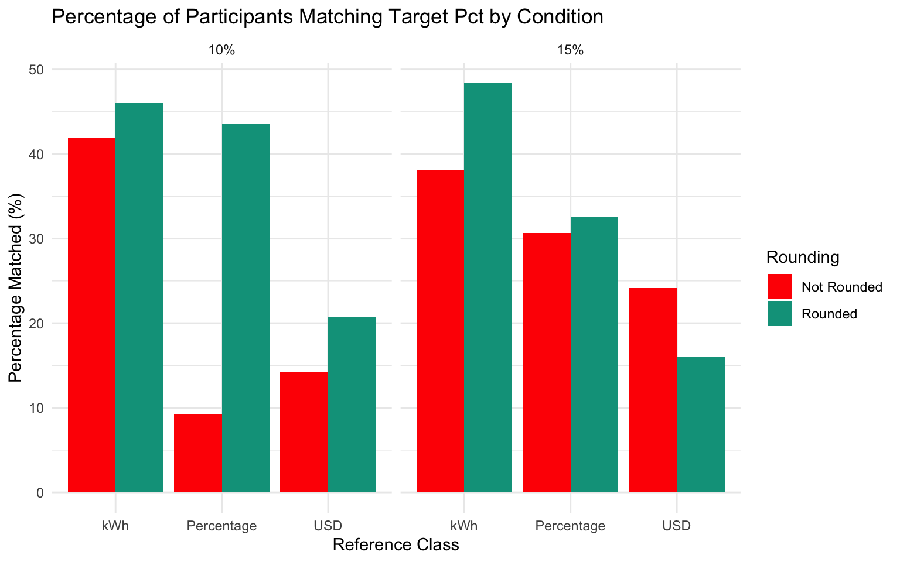

``` r
summary_pct |>
  gt() |>
  tab_header(
    title = md("**Percentage of Participants Matching Target Pct by Condition**"),
    subtitle = "Grouped by Reference Class, Rounding, and Pct Goal"
  ) |>
  fmt_number(
    columns = c(pct_matched),
    decimals = 2
  ) |>
  cols_label(
    refClass = "Reference Class",
    rounded = "Rounding",
    pct_goal = "Pct Goal",
    matched_count = "Matched Count",
    total_count = "Total Count",
    pct_matched = "Percentage Matched (%)"
  ) |>
  cols_align(
    align = "center",
    columns = everything()
  ) |>
  tab_spanner(
    label = "Participants",
    columns = c(matched_count, total_count, pct_matched)
  )
```

<div id="qdfppfclzc" style="padding-left:0px;padding-right:0px;padding-top:10px;padding-bottom:10px;overflow-x:auto;overflow-y:auto;width:auto;height:auto;">
<style>#qdfppfclzc table {
  font-family: system-ui, 'Segoe UI', Roboto, Helvetica, Arial, sans-serif, 'Apple Color Emoji', 'Segoe UI Emoji', 'Segoe UI Symbol', 'Noto Color Emoji';
  -webkit-font-smoothing: antialiased;
  -moz-osx-font-smoothing: grayscale;
}

#qdfppfclzc thead, #qdfppfclzc tbody, #qdfppfclzc tfoot, #qdfppfclzc tr, #qdfppfclzc td, #qdfppfclzc th {
  border-style: none;
}

#qdfppfclzc p {
  margin: 0;
  padding: 0;
}

#qdfppfclzc .gt_table {
  display: table;
  border-collapse: collapse;
  line-height: normal;
  margin-left: auto;
  margin-right: auto;
  color: #333333;
  font-size: 16px;
  font-weight: normal;
  font-style: normal;
  background-color: #FFFFFF;
  width: auto;
  border-top-style: solid;
  border-top-width: 2px;
  border-top-color: #A8A8A8;
  border-right-style: none;
  border-right-width: 2px;
  border-right-color: #D3D3D3;
  border-bottom-style: solid;
  border-bottom-width: 2px;
  border-bottom-color: #A8A8A8;
  border-left-style: none;
  border-left-width: 2px;
  border-left-color: #D3D3D3;
}

#qdfppfclzc .gt_caption {
  padding-top: 4px;
  padding-bottom: 4px;
}

#qdfppfclzc .gt_title {
  color: #333333;
  font-size: 125%;
  font-weight: initial;
  padding-top: 4px;
  padding-bottom: 4px;
  padding-left: 5px;
  padding-right: 5px;
  border-bottom-color: #FFFFFF;
  border-bottom-width: 0;
}

#qdfppfclzc .gt_subtitle {
  color: #333333;
  font-size: 85%;
  font-weight: initial;
  padding-top: 3px;
  padding-bottom: 5px;
  padding-left: 5px;
  padding-right: 5px;
  border-top-color: #FFFFFF;
  border-top-width: 0;
}

#qdfppfclzc .gt_heading {
  background-color: #FFFFFF;
  text-align: center;
  border-bottom-color: #FFFFFF;
  border-left-style: none;
  border-left-width: 1px;
  border-left-color: #D3D3D3;
  border-right-style: none;
  border-right-width: 1px;
  border-right-color: #D3D3D3;
}

#qdfppfclzc .gt_bottom_border {
  border-bottom-style: solid;
  border-bottom-width: 2px;
  border-bottom-color: #D3D3D3;
}

#qdfppfclzc .gt_col_headings {
  border-top-style: solid;
  border-top-width: 2px;
  border-top-color: #D3D3D3;
  border-bottom-style: solid;
  border-bottom-width: 2px;
  border-bottom-color: #D3D3D3;
  border-left-style: none;
  border-left-width: 1px;
  border-left-color: #D3D3D3;
  border-right-style: none;
  border-right-width: 1px;
  border-right-color: #D3D3D3;
}

#qdfppfclzc .gt_col_heading {
  color: #333333;
  background-color: #FFFFFF;
  font-size: 100%;
  font-weight: normal;
  text-transform: inherit;
  border-left-style: none;
  border-left-width: 1px;
  border-left-color: #D3D3D3;
  border-right-style: none;
  border-right-width: 1px;
  border-right-color: #D3D3D3;
  vertical-align: bottom;
  padding-top: 5px;
  padding-bottom: 6px;
  padding-left: 5px;
  padding-right: 5px;
  overflow-x: hidden;
}

#qdfppfclzc .gt_column_spanner_outer {
  color: #333333;
  background-color: #FFFFFF;
  font-size: 100%;
  font-weight: normal;
  text-transform: inherit;
  padding-top: 0;
  padding-bottom: 0;
  padding-left: 4px;
  padding-right: 4px;
}

#qdfppfclzc .gt_column_spanner_outer:first-child {
  padding-left: 0;
}

#qdfppfclzc .gt_column_spanner_outer:last-child {
  padding-right: 0;
}

#qdfppfclzc .gt_column_spanner {
  border-bottom-style: solid;
  border-bottom-width: 2px;
  border-bottom-color: #D3D3D3;
  vertical-align: bottom;
  padding-top: 5px;
  padding-bottom: 5px;
  overflow-x: hidden;
  display: inline-block;
  width: 100%;
}

#qdfppfclzc .gt_spanner_row {
  border-bottom-style: hidden;
}

#qdfppfclzc .gt_group_heading {
  padding-top: 8px;
  padding-bottom: 8px;
  padding-left: 5px;
  padding-right: 5px;
  color: #333333;
  background-color: #FFFFFF;
  font-size: 100%;
  font-weight: initial;
  text-transform: inherit;
  border-top-style: solid;
  border-top-width: 2px;
  border-top-color: #D3D3D3;
  border-bottom-style: solid;
  border-bottom-width: 2px;
  border-bottom-color: #D3D3D3;
  border-left-style: none;
  border-left-width: 1px;
  border-left-color: #D3D3D3;
  border-right-style: none;
  border-right-width: 1px;
  border-right-color: #D3D3D3;
  vertical-align: middle;
  text-align: left;
}

#qdfppfclzc .gt_empty_group_heading {
  padding: 0.5px;
  color: #333333;
  background-color: #FFFFFF;
  font-size: 100%;
  font-weight: initial;
  border-top-style: solid;
  border-top-width: 2px;
  border-top-color: #D3D3D3;
  border-bottom-style: solid;
  border-bottom-width: 2px;
  border-bottom-color: #D3D3D3;
  vertical-align: middle;
}

#qdfppfclzc .gt_from_md > :first-child {
  margin-top: 0;
}

#qdfppfclzc .gt_from_md > :last-child {
  margin-bottom: 0;
}

#qdfppfclzc .gt_row {
  padding-top: 8px;
  padding-bottom: 8px;
  padding-left: 5px;
  padding-right: 5px;
  margin: 10px;
  border-top-style: solid;
  border-top-width: 1px;
  border-top-color: #D3D3D3;
  border-left-style: none;
  border-left-width: 1px;
  border-left-color: #D3D3D3;
  border-right-style: none;
  border-right-width: 1px;
  border-right-color: #D3D3D3;
  vertical-align: middle;
  overflow-x: hidden;
}

#qdfppfclzc .gt_stub {
  color: #333333;
  background-color: #FFFFFF;
  font-size: 100%;
  font-weight: initial;
  text-transform: inherit;
  border-right-style: solid;
  border-right-width: 2px;
  border-right-color: #D3D3D3;
  padding-left: 5px;
  padding-right: 5px;
}

#qdfppfclzc .gt_stub_row_group {
  color: #333333;
  background-color: #FFFFFF;
  font-size: 100%;
  font-weight: initial;
  text-transform: inherit;
  border-right-style: solid;
  border-right-width: 2px;
  border-right-color: #D3D3D3;
  padding-left: 5px;
  padding-right: 5px;
  vertical-align: top;
}

#qdfppfclzc .gt_row_group_first td {
  border-top-width: 2px;
}

#qdfppfclzc .gt_row_group_first th {
  border-top-width: 2px;
}

#qdfppfclzc .gt_summary_row {
  color: #333333;
  background-color: #FFFFFF;
  text-transform: inherit;
  padding-top: 8px;
  padding-bottom: 8px;
  padding-left: 5px;
  padding-right: 5px;
}

#qdfppfclzc .gt_first_summary_row {
  border-top-style: solid;
  border-top-color: #D3D3D3;
}

#qdfppfclzc .gt_first_summary_row.thick {
  border-top-width: 2px;
}

#qdfppfclzc .gt_last_summary_row {
  padding-top: 8px;
  padding-bottom: 8px;
  padding-left: 5px;
  padding-right: 5px;
  border-bottom-style: solid;
  border-bottom-width: 2px;
  border-bottom-color: #D3D3D3;
}

#qdfppfclzc .gt_grand_summary_row {
  color: #333333;
  background-color: #FFFFFF;
  text-transform: inherit;
  padding-top: 8px;
  padding-bottom: 8px;
  padding-left: 5px;
  padding-right: 5px;
}

#qdfppfclzc .gt_first_grand_summary_row {
  padding-top: 8px;
  padding-bottom: 8px;
  padding-left: 5px;
  padding-right: 5px;
  border-top-style: double;
  border-top-width: 6px;
  border-top-color: #D3D3D3;
}

#qdfppfclzc .gt_last_grand_summary_row_top {
  padding-top: 8px;
  padding-bottom: 8px;
  padding-left: 5px;
  padding-right: 5px;
  border-bottom-style: double;
  border-bottom-width: 6px;
  border-bottom-color: #D3D3D3;
}

#qdfppfclzc .gt_striped {
  background-color: rgba(128, 128, 128, 0.05);
}

#qdfppfclzc .gt_table_body {
  border-top-style: solid;
  border-top-width: 2px;
  border-top-color: #D3D3D3;
  border-bottom-style: solid;
  border-bottom-width: 2px;
  border-bottom-color: #D3D3D3;
}

#qdfppfclzc .gt_footnotes {
  color: #333333;
  background-color: #FFFFFF;
  border-bottom-style: none;
  border-bottom-width: 2px;
  border-bottom-color: #D3D3D3;
  border-left-style: none;
  border-left-width: 2px;
  border-left-color: #D3D3D3;
  border-right-style: none;
  border-right-width: 2px;
  border-right-color: #D3D3D3;
}

#qdfppfclzc .gt_footnote {
  margin: 0px;
  font-size: 90%;
  padding-top: 4px;
  padding-bottom: 4px;
  padding-left: 5px;
  padding-right: 5px;
}

#qdfppfclzc .gt_sourcenotes {
  color: #333333;
  background-color: #FFFFFF;
  border-bottom-style: none;
  border-bottom-width: 2px;
  border-bottom-color: #D3D3D3;
  border-left-style: none;
  border-left-width: 2px;
  border-left-color: #D3D3D3;
  border-right-style: none;
  border-right-width: 2px;
  border-right-color: #D3D3D3;
}

#qdfppfclzc .gt_sourcenote {
  font-size: 90%;
  padding-top: 4px;
  padding-bottom: 4px;
  padding-left: 5px;
  padding-right: 5px;
}

#qdfppfclzc .gt_left {
  text-align: left;
}

#qdfppfclzc .gt_center {
  text-align: center;
}

#qdfppfclzc .gt_right {
  text-align: right;
  font-variant-numeric: tabular-nums;
}

#qdfppfclzc .gt_font_normal {
  font-weight: normal;
}

#qdfppfclzc .gt_font_bold {
  font-weight: bold;
}

#qdfppfclzc .gt_font_italic {
  font-style: italic;
}

#qdfppfclzc .gt_super {
  font-size: 65%;
}

#qdfppfclzc .gt_footnote_marks {
  font-size: 75%;
  vertical-align: 0.4em;
  position: initial;
}

#qdfppfclzc .gt_asterisk {
  font-size: 100%;
  vertical-align: 0;
}

#qdfppfclzc .gt_indent_1 {
  text-indent: 5px;
}

#qdfppfclzc .gt_indent_2 {
  text-indent: 10px;
}

#qdfppfclzc .gt_indent_3 {
  text-indent: 15px;
}

#qdfppfclzc .gt_indent_4 {
  text-indent: 20px;
}

#qdfppfclzc .gt_indent_5 {
  text-indent: 25px;
}

#qdfppfclzc .katex-display {
  display: inline-flex !important;
  margin-bottom: 0.75em !important;
}

#qdfppfclzc div.Reactable > div.rt-table > div.rt-thead > div.rt-tr.rt-tr-group-header > div.rt-th-group:after {
  height: 0px !important;
}
</style>

<table class="gt_table" style="width:100%;" data-quarto-postprocess="true" data-quarto-disable-processing="false" data-quarto-bootstrap="false">
<colgroup>
<col style="width: 16%" />
<col style="width: 16%" />
<col style="width: 16%" />
<col style="width: 16%" />
<col style="width: 16%" />
<col style="width: 16%" />
</colgroup>
<thead>
<tr class="gt_heading">
<th colspan="6" class="gt_heading gt_title gt_font_normal"><strong>Percentage of Participants Matching Target Pct by Condition</strong></th>
</tr>
<tr class="gt_heading">
<th colspan="6" class="gt_heading gt_subtitle gt_font_normal gt_bottom_border">Grouped by Reference Class, Rounding, and Pct Goal</th>
</tr>
<tr class="gt_col_headings gt_spanner_row">
<th rowspan="2" id="refClass" class="gt_col_heading gt_columns_bottom_border gt_center" data-quarto-table-cell-role="th" scope="col">Reference Class</th>
<th rowspan="2" id="rounded" class="gt_col_heading gt_columns_bottom_border gt_center" data-quarto-table-cell-role="th" scope="col">Rounding</th>
<th rowspan="2" id="pct_goal" class="gt_col_heading gt_columns_bottom_border gt_center" data-quarto-table-cell-role="th" scope="col">Pct Goal</th>
<th colspan="3" id="Participants" class="gt_center gt_columns_top_border gt_column_spanner_outer" data-quarto-table-cell-role="th" scope="colgroup"><div class="gt_column_spanner">
Participants
</div></th>
</tr>
<tr class="gt_col_headings">
<th id="matched_count" class="gt_col_heading gt_columns_bottom_border gt_center" data-quarto-table-cell-role="th" scope="col">Matched Count</th>
<th id="total_count" class="gt_col_heading gt_columns_bottom_border gt_center" data-quarto-table-cell-role="th" scope="col">Total Count</th>
<th id="pct_matched" class="gt_col_heading gt_columns_bottom_border gt_center" data-quarto-table-cell-role="th" scope="col">Percentage Matched (%)</th>
</tr>
</thead>
<tbody class="gt_table_body">
<tr>
<td class="gt_row gt_center" headers="refClass">Percentage</td>
<td class="gt_row gt_center" headers="rounded">Not Rounded</td>
<td class="gt_row gt_center" headers="pct_goal">10%</td>
<td class="gt_row gt_center" headers="matched_count">8</td>
<td class="gt_row gt_center" headers="total_count">86</td>
<td class="gt_row gt_center" headers="pct_matched">9.30</td>
</tr>
<tr>
<td class="gt_row gt_center" headers="refClass">Percentage</td>
<td class="gt_row gt_center" headers="rounded">Not Rounded</td>
<td class="gt_row gt_center" headers="pct_goal">15%</td>
<td class="gt_row gt_center" headers="matched_count">19</td>
<td class="gt_row gt_center" headers="total_count">62</td>
<td class="gt_row gt_center" headers="pct_matched">30.65</td>
</tr>
<tr>
<td class="gt_row gt_center" headers="refClass">Percentage</td>
<td class="gt_row gt_center" headers="rounded">Rounded</td>
<td class="gt_row gt_center" headers="pct_goal">10%</td>
<td class="gt_row gt_center" headers="matched_count">27</td>
<td class="gt_row gt_center" headers="total_count">62</td>
<td class="gt_row gt_center" headers="pct_matched">43.55</td>
</tr>
<tr>
<td class="gt_row gt_center" headers="refClass">Percentage</td>
<td class="gt_row gt_center" headers="rounded">Rounded</td>
<td class="gt_row gt_center" headers="pct_goal">15%</td>
<td class="gt_row gt_center" headers="matched_count">28</td>
<td class="gt_row gt_center" headers="total_count">86</td>
<td class="gt_row gt_center" headers="pct_matched">32.56</td>
</tr>
<tr>
<td class="gt_row gt_center" headers="refClass">USD</td>
<td class="gt_row gt_center" headers="rounded">Not Rounded</td>
<td class="gt_row gt_center" headers="pct_goal">10%</td>
<td class="gt_row gt_center" headers="matched_count">8</td>
<td class="gt_row gt_center" headers="total_count">56</td>
<td class="gt_row gt_center" headers="pct_matched">14.29</td>
</tr>
<tr>
<td class="gt_row gt_center" headers="refClass">USD</td>
<td class="gt_row gt_center" headers="rounded">Not Rounded</td>
<td class="gt_row gt_center" headers="pct_goal">15%</td>
<td class="gt_row gt_center" headers="matched_count">14</td>
<td class="gt_row gt_center" headers="total_count">58</td>
<td class="gt_row gt_center" headers="pct_matched">24.14</td>
</tr>
<tr>
<td class="gt_row gt_center" headers="refClass">USD</td>
<td class="gt_row gt_center" headers="rounded">Rounded</td>
<td class="gt_row gt_center" headers="pct_goal">10%</td>
<td class="gt_row gt_center" headers="matched_count">12</td>
<td class="gt_row gt_center" headers="total_count">58</td>
<td class="gt_row gt_center" headers="pct_matched">20.69</td>
</tr>
<tr>
<td class="gt_row gt_center" headers="refClass">USD</td>
<td class="gt_row gt_center" headers="rounded">Rounded</td>
<td class="gt_row gt_center" headers="pct_goal">15%</td>
<td class="gt_row gt_center" headers="matched_count">9</td>
<td class="gt_row gt_center" headers="total_count">56</td>
<td class="gt_row gt_center" headers="pct_matched">16.07</td>
</tr>
<tr>
<td class="gt_row gt_center" headers="refClass">kWh</td>
<td class="gt_row gt_center" headers="rounded">Not Rounded</td>
<td class="gt_row gt_center" headers="pct_goal">10%</td>
<td class="gt_row gt_center" headers="matched_count">26</td>
<td class="gt_row gt_center" headers="total_count">62</td>
<td class="gt_row gt_center" headers="pct_matched">41.94</td>
</tr>
<tr>
<td class="gt_row gt_center" headers="refClass">kWh</td>
<td class="gt_row gt_center" headers="rounded">Not Rounded</td>
<td class="gt_row gt_center" headers="pct_goal">15%</td>
<td class="gt_row gt_center" headers="matched_count">29</td>
<td class="gt_row gt_center" headers="total_count">76</td>
<td class="gt_row gt_center" headers="pct_matched">38.16</td>
</tr>
<tr>
<td class="gt_row gt_center" headers="refClass">kWh</td>
<td class="gt_row gt_center" headers="rounded">Rounded</td>
<td class="gt_row gt_center" headers="pct_goal">10%</td>
<td class="gt_row gt_center" headers="matched_count">35</td>
<td class="gt_row gt_center" headers="total_count">76</td>
<td class="gt_row gt_center" headers="pct_matched">46.05</td>
</tr>
<tr>
<td class="gt_row gt_center" headers="refClass">kWh</td>
<td class="gt_row gt_center" headers="rounded">Rounded</td>
<td class="gt_row gt_center" headers="pct_goal">15%</td>
<td class="gt_row gt_center" headers="matched_count">30</td>
<td class="gt_row gt_center" headers="total_count">62</td>
<td class="gt_row gt_center" headers="pct_matched">48.39</td>
</tr>
</tbody>
</table>

</div>

``` r
# Step 1: Calculate whether participants matched the target pct_goal within different tolerances
sum1a <- s2_long |> 
  filter(appliance != "TOTAL") |> 
  group_by(id, refClass, state, pct_goal, pct, rounded, block, plan, calc, edu) |> 
  summarise(
    total_kWh = sum(value),
    orig_kWh = sum(family),
    pct_change = round((orig_kWh - total_kWh) / orig_kWh, 3),
    state_dif = mean(state_dif),
    .groups = "drop"
  ) |>
  mutate(
    target_pct = as.numeric(sub("%", "", pct_goal)) / 100,
    match_level = case_when(
      abs(pct_change - target_pct) <= 0.001 ~ "Exact Match",
      abs(pct_change - target_pct) <= 0.05 ~ "Within 5%",
      abs(pct_change - target_pct) <= 0.10 ~ "Within 10%",
      abs(pct_change - target_pct) <= 0.20 ~ "Within 20%",
      TRUE ~ "Over 20%"
    ),
    match_level = factor(match_level, levels = c("Exact Match", "Within 5%", "Within 10%", "Within 20%", "Over 20%"))
  )

# Step 2: Summarize the percentage of participants in each match level for each condition
summary_pct <- sum1a |>
  group_by(refClass, rounded, pct_goal, match_level) |>
  summarise(count = n(), .groups = "drop") |>
  group_by(refClass, rounded, pct_goal) |>
  mutate(
    total_count = sum(count),
    percentage = count / total_count * 100
  ) |>
  ungroup()

# Step 3: Create plot
ggplot(summary_pct, aes(x = interaction(refClass, rounded), y = percentage, fill = match_level)) +
  geom_bar(stat = "identity", position = "stack") +
  facet_wrap(~ pct_goal, scales = "free_x") +
  scale_fill_brewer(palette = "Set2") +
  labs(
    title = "Percentage of Participants by Match Level",
    subtitle = "Grouped by Reference Class, Rounding, and Pct Goal",
    x = "Reference Class and Rounding",
    y = "Percentage (%)",
    fill = "Match Level"
  ) +
  theme_minimal() +
  theme(axis.text.x = element_text(angle = 45, hjust = 1))
```

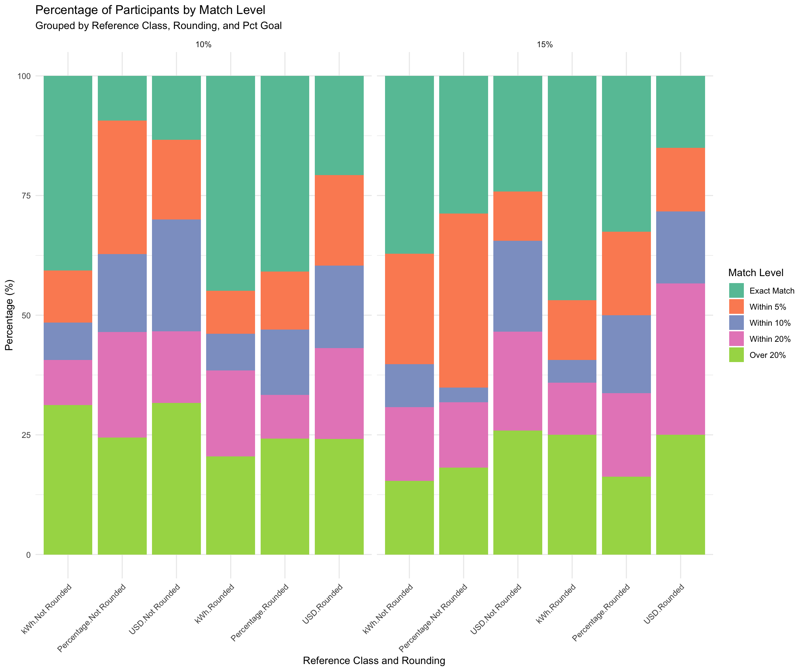

``` r
ggplot(summary_pct, aes(x = refClass, y = percentage, fill = match_level)) +
  geom_bar(stat = "identity",position=position_dodge()) +
  facet_wrap(rounded ~ pct_goal, scales = "free_x") +
  scale_fill_brewer(palette = "Set2") +
  labs(
    title = "Percentage of Participants by Match Level",
    subtitle = "Grouped by Reference Class, Rounding, and Pct Goal",
    x = "Reference Class and Rounding",
    y = "Percentage (%)",
    fill = "Match Level"
  ) +
  theme_minimal() +
  theme(axis.text.x = element_text(angle = 45, hjust = 1))
```

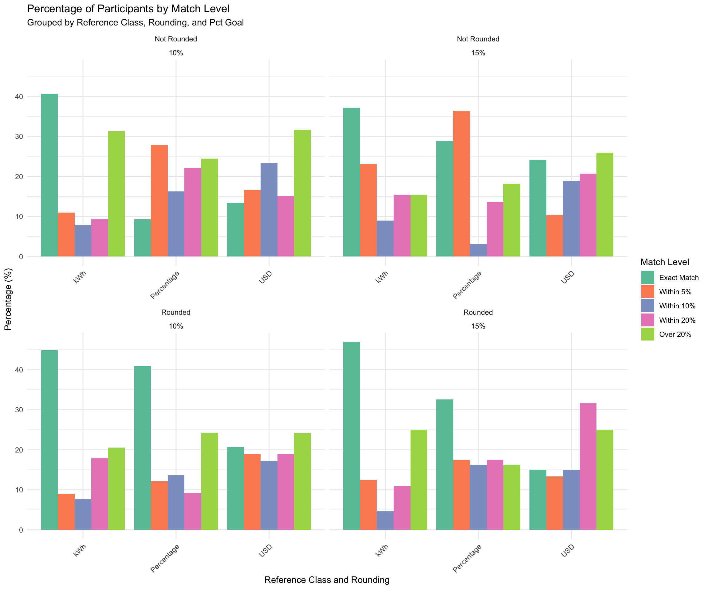

## Cumulative plot

**Click on plots to enlarge**

``` r
# Step 1: Calculate match levels with cumulative groups
sum1c <- s2_long |>
  filter(appliance != "TOTAL") |>
  group_by(id, refClass, state, pct_goal, pct, rounded, block, plan, calc, edu) |>
  summarise(
    total_kWh = sum(value),
    orig_kWh = sum(family),
    pct_change = round((orig_kWh - total_kWh) / orig_kWh, 3),
    state_dif = mean(state_dif),
    .groups = "drop"
  ) |>
  mutate(
    target_pct = as.numeric(sub("%", "", pct_goal)) / 100,
    match_level = case_when(
      abs(pct_change - target_pct) <= 0.001 ~ "Exact Match",
      abs(pct_change - target_pct) <= 0.05 ~ "Within 5%",
      abs(pct_change - target_pct) <= 0.10 ~ "Within 10%",
      abs(pct_change - target_pct) <= 0.20 ~ "Within 20%",
      TRUE ~ "Over 20%"
    ),
    match_level = factor(
      match_level, 
      levels = c("Exact Match", "Within 5%", "Within 10%", "Within 20%", "Over 20%")
    )
  )

# Step 2: Create cumulative groups for each match level
summary_pct <- sum1c |>
  group_by(refClass, rounded, pct_goal, match_level) |>
  summarise(count = n(), .groups = "drop") |>
  group_by(refClass, rounded, pct_goal) |>
  mutate(
    total_count = sum(count),
    cumulative_count = cumsum(count),
    cumulative_percentage = cumulative_count / total_count * 100
  ) |>
  ungroup()

# Step 3: Create a plot for cumulative percentages
ggplot(summary_pct, aes(x = refClass, y = cumulative_percentage, fill = match_level)) +
  geom_bar(stat = "identity", position = position_dodge()) +
  facet_wrap(pct_goal~rounded, scales = "free_x") +
  scale_fill_brewer(palette = "Set2") +
  labs(
    title = "Cumulative Percentage of Participants by Match Level",
    subtitle = "Grouped by Reference Class, Rounding, and Pct Goal",
    x = "Reference Class",
    y = "Cumulative Percentage (%)",
    fill = "Match Level"
  ) +
  theme_minimal() +
  theme(axis.text.x = element_text(angle = 45, hjust = 1))
```


``` r
ggplot(summary_pct, aes(x = refClass, y = cumulative_percentage, fill = match_level)) +
  geom_bar(stat = "identity", position = position_dodge()) +
  facet_wrap(~rounded, scales = "free_x") +
  scale_fill_brewer(palette = "Set2") +
  labs(
    title = "Cumulative Percentage of Participants by Match Level",
    subtitle = "Grouped by Reference Class, Rounding, and Pct Goal",
    x = "Reference Class",
    y = "Cumulative Percentage (%)",
    fill = "Match Level"
  ) +
  theme_minimal() +
  theme(axis.text.x = element_text(angle = 45, hjust = 1))
```

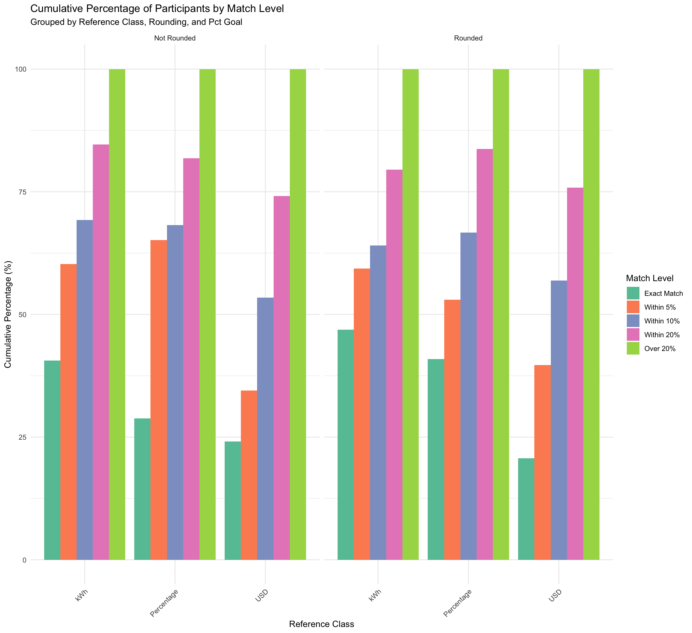

``` r
ggplot(summary_pct, aes(x = refClass, y = cumulative_percentage, fill = match_level)) +
  geom_bar(stat = "identity", position = position_dodge()) +
  scale_fill_brewer(palette = "Set2") +
  labs(
    title = "Cumulative Percentage of Participants by Match Level",
    subtitle = "Grouped by Reference Class, Rounding, and Pct Goal",
    x = "Reference Class",
    y = "Cumulative Percentage (%)",
    fill = "Match Level"
  ) +
  theme_minimal() +
  theme(axis.text.x = element_text(angle = 45, hjust = 1))
```

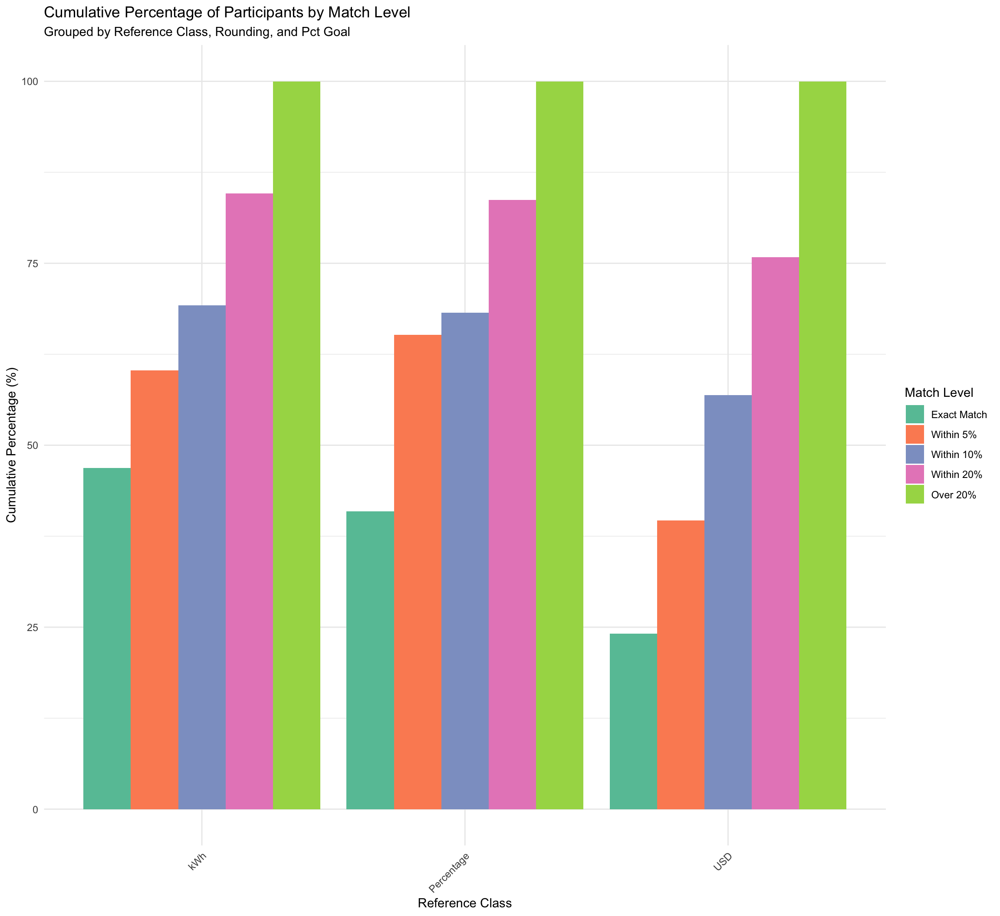

``` r
ggplot(summary_pct, aes(x = rounded, y = cumulative_percentage, fill = match_level)) +
  geom_bar(stat = "identity", position = position_dodge()) +
  scale_fill_brewer(palette = "Set2") +
  labs(
    title = "Cumulative Percentage of Participants by Match Level",
    subtitle = "Grouped by Reference Class, Rounding, and Pct Goal",
    x = "Rounding",
    y = "Cumulative Percentage (%)",
    fill = "Match Level"
  ) +
  theme_minimal() +
  theme(axis.text.x = element_text(angle = 45, hjust = 1))
```

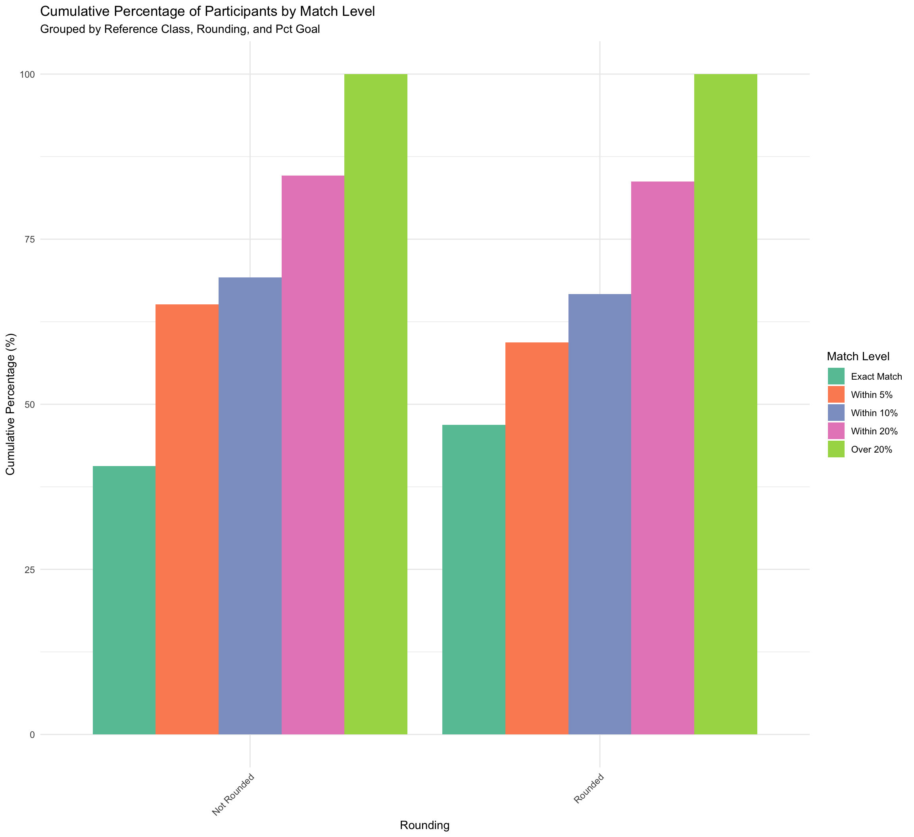

## Main Effects and Interactions

**Click on plots to enlarge**

``` r
s2_agg |> ggplot(aes(x = refClass, y = pct_change, fill = refClass)) + 
  stat_summary(fun = mean, geom = "bar", position="dodge") +
  stat_summary(fun.data = mean_se, geom = "errorbar", position = "dodge") +
  labs(
    title = "Effect of Reference Class",
    x = "Reference Class",
    y = "% Change",
    fill = "Reference Class"
  ) 
```

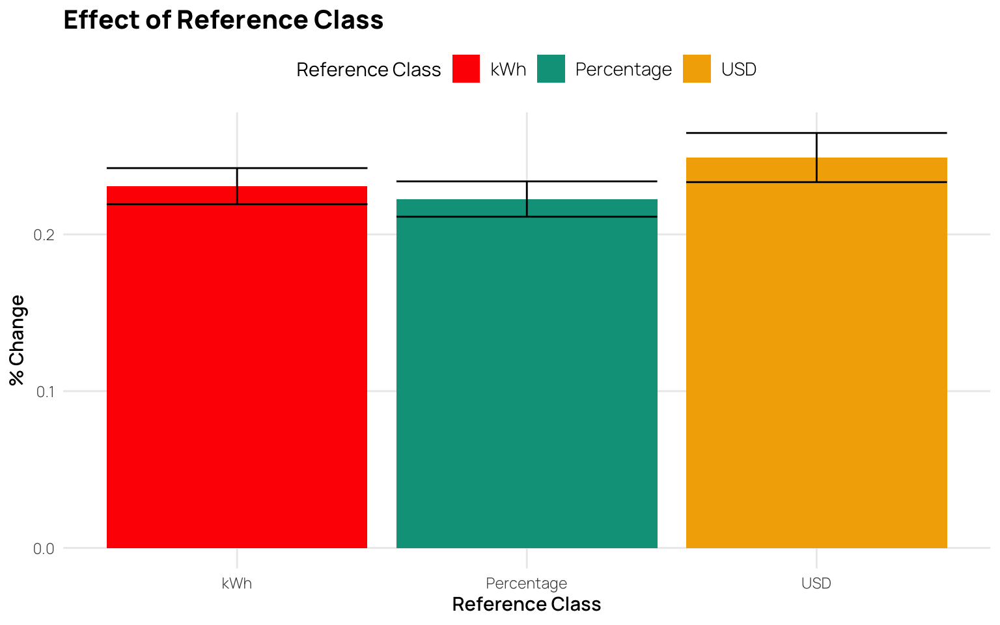

``` r
s2_agg |> ggplot(aes(x = pct_goal, y = pct_change, fill = pct_goal)) + 
  stat_summary(fun = mean, geom = "bar", position="dodge") +
  stat_summary(fun.data = mean_se, geom = "errorbar", position = "dodge") +
  labs(
    title = "Effect of Goal % Reduction",
    x = "Goal % Reduction",
    y = "% Change",
    fill = "Goal % Reduction"
  ) 
```

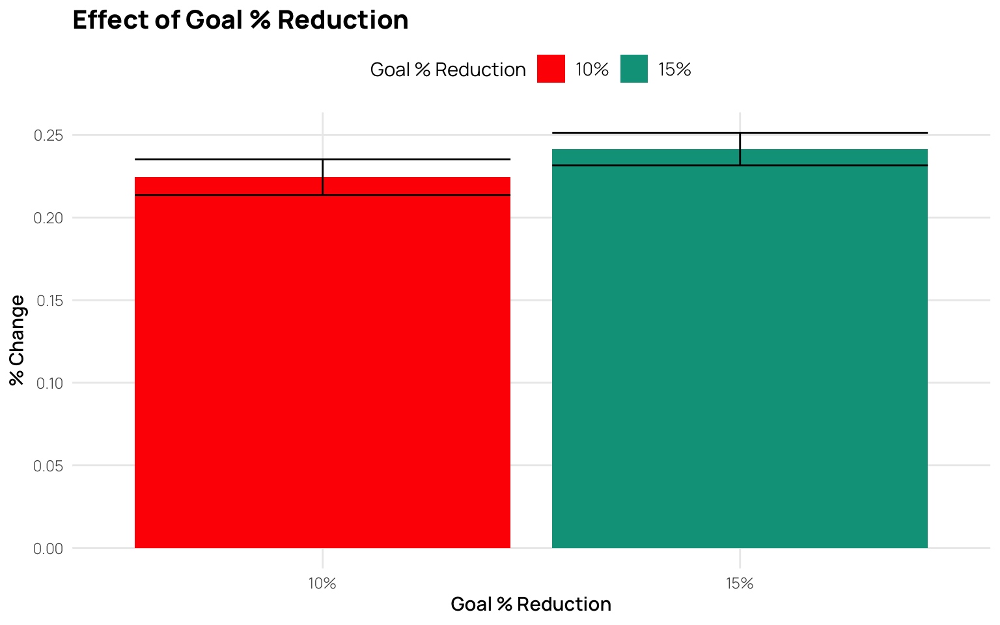

``` r
s2_agg |> ggplot(aes(x = rounded, y = pct_change, fill = rounded)) + 
  stat_summary(fun = mean, geom = "bar", position="dodge") +
  stat_summary(fun.data = mean_se, geom = "errorbar", position = "dodge") +
  labs(
    title = "Effect of Rounding",
    x = "Rounding",
    y = "% Change",
    fill = "Rounding"
  ) 
```

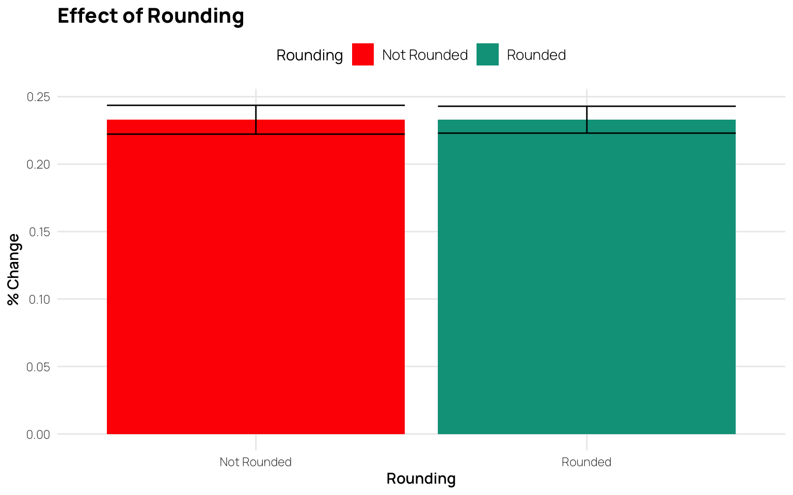

``` r
s2_agg |> ggplot(aes(x = pct_goal, y = pct_change, fill = refClass)) + 
  stat_summary(fun = mean, geom = "bar", position="dodge") +
  stat_summary(fun.data = mean_se, geom = "errorbar", position = "dodge") +
  labs(
    title = "Effect of Goal % Reduction and Reference Class",
    x = "Goal % Reduction",
    y = "% Change",
    fill= "Reference Class"
  ) 
```

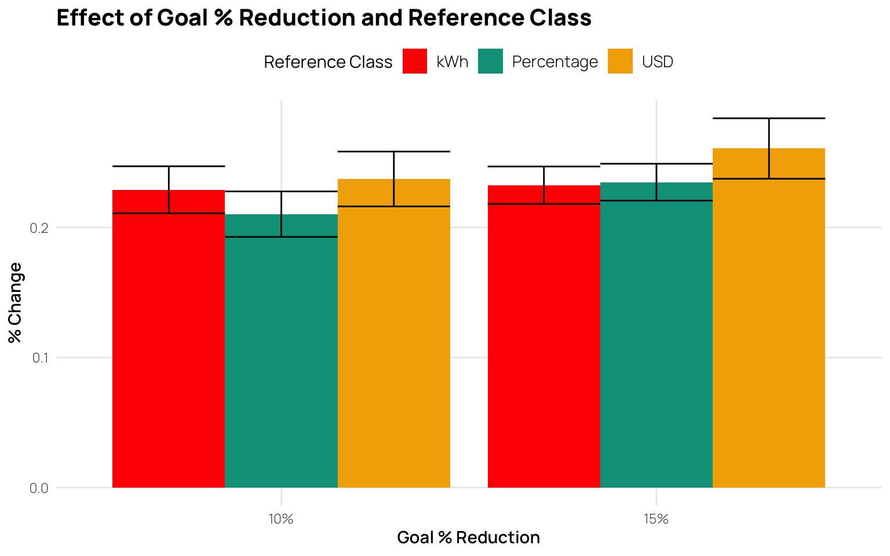

``` r
s2_agg |> ggplot(aes(x = pct_goal, y = pct_change, fill = refClass)) + 
  stat_summary(fun = mean, geom = "bar", position="dodge") +
  stat_summary(fun.data = mean_se, geom = "errorbar", position = "dodge") + 
  facet_wrap(~state) +
  labs(
    title = "Effect of Goal % Reduction and Reference Class - Separated by State",
    x = "Goal % Reduction",
    y = "% Change",
    fill= "Reference Class"
  ) 
```

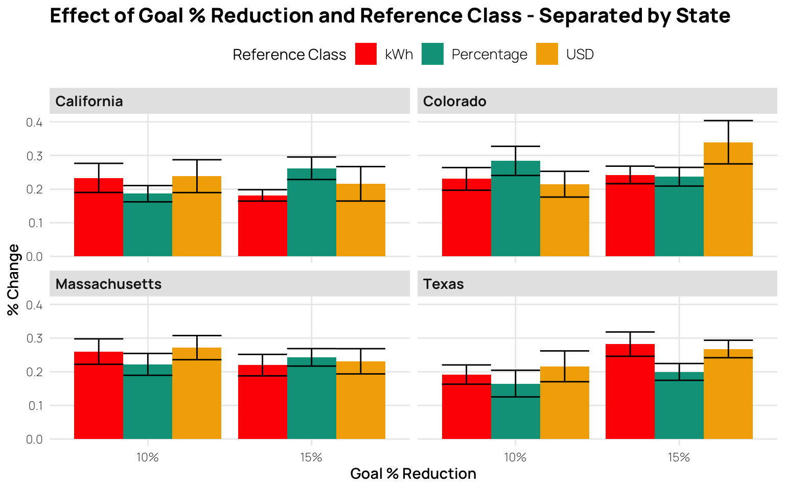

``` r
s2_agg |> ggplot(aes(x = pct_goal, y = pct_change, fill = rounded)) + 
  stat_summary(fun = mean, geom = "bar", position="dodge") +
  stat_summary(fun.data = mean_se, geom = "errorbar", position = "dodge") + 
  facet_wrap(~rounded) +
  labs(
    title = "Effect of Goal % Reduction and Rounding",
    x = "Goal % Reduction",
    y = "% Change",
    fill= "Rounding"
  ) 
```

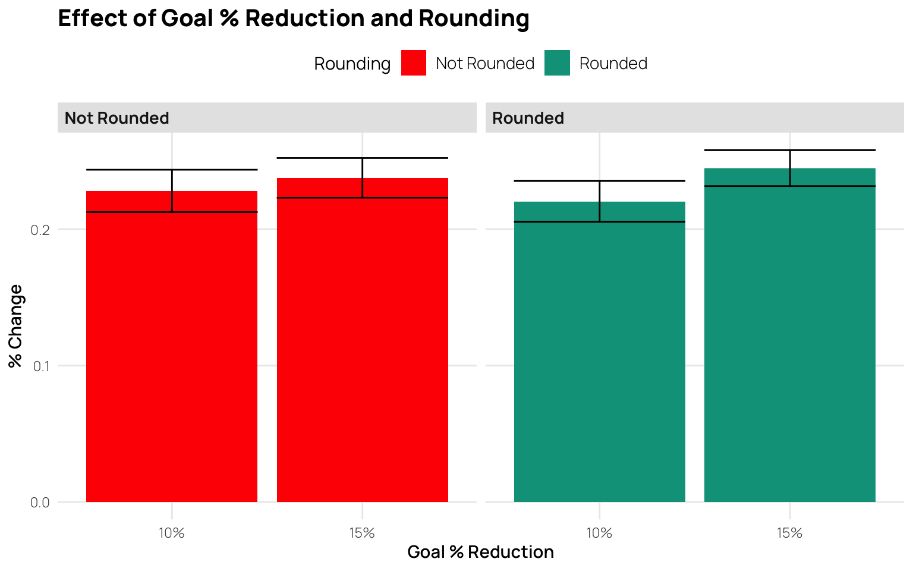

## Calculator and education

``` r
# table with only education level counts, just use kable
s2 |> 
  group_by(edu) |> 
  summarise(n = n(), .groups = "drop") |>
  knitr::kable(caption = "Count of Items by Education Level", format = "html") 
```

| edu                       |   n |
|:--------------------------|----:|
| College degree            | 103 |
| Graduate degree           |  51 |
| Highschool diploma or GED |  11 |
| Some college              |  32 |
| Some graduate school      |   9 |

Count of Items by Education Level

``` r
# table with only calculator counts

s2 |> 
  mutate(calc = if_else(calc == 0, "No Calculator", "Used Calculator")) |> 
  group_by(calc) |> 
  summarise(n = n(), .groups = "drop") |>
  knitr::kable(caption = "Count of Items by Calculator Use", format = "html")
```

| calc            |   n |
|:----------------|----:|
| Used Calculator | 206 |

Count of Items by Calculator Use

``` r
# s2 |> 
#   mutate(rounded = case_when(ROUNDED == 1 ~ "Not Rounded", ROUNDED == 2 ~ "Rounded")) |> 
#   group_by(calc, refClass, rounded) |> 
#   summarise(n = n(), .groups = "drop") |>
#   group_by(calc, refClass) |>
#   mutate(count_stats = as.character(n)) |>
#   ungroup() |>
#   tabulator(
#     rows = c("calc", "refClass"),
#     columns = "rounded",
#     `Count` = as_paragraph(count_stats)
#   ) |>
#   as_flextable() |> 
#   align(align = "left", part = "all") |>
#   autofit() |>
#   set_caption(
#     caption = "Count of Items by Calculation Type, Reference Class, and Rounded Value",
#     style = "Table Caption"
#   )


# s2 |> 
#   mutate(
#     rounded = if_else(ROUNDED == 1, "Not Rounded", "Rounded"),
#     calc = if_else(calc == 0, "No Calculator", "Used Calculator")
#   ) |> 
#   count(calc, refClass, rounded) |>
#   pivot_wider(
#     names_from = c(calc, rounded),
#     values_from = n,
#     values_fill = 0
#   ) |>
#   gt() |>
#   tab_header(
#     title = md("**Count of Items by Calculator Use, Reference Class, and Rounding**")
#   ) |>
#   cols_align(align = "left") |>
#   tab_spanner_delim(delim = "_") |>
#   cols_label(
#     `No Calculator_Not Rounded` = "Not Rounded",
#     `No Calculator_Rounded` = "Rounded",
#     `Used Calculator_Not Rounded` = "Not Rounded",
#     `Used Calculator_Rounded` = "Rounded"
#   )


# table with education level counts

s2 |>
  group_by(edu, refClass) |>
  summarise(n = n(), .groups = "drop") |>
  pivot_wider(names_from = refClass, values_from = n, values_fill = 0) |>
  gt(rowname_col = "edu") |>
  tab_header(title = md("**Count of Items by Education Level and Reference Class**")) |>
  cols_align(align = "left", columns = everything())
```

<div id="niavhdcheh" style="padding-left:0px;padding-right:0px;padding-top:10px;padding-bottom:10px;overflow-x:auto;overflow-y:auto;width:auto;height:auto;">
<style>#niavhdcheh table {
  font-family: system-ui, 'Segoe UI', Roboto, Helvetica, Arial, sans-serif, 'Apple Color Emoji', 'Segoe UI Emoji', 'Segoe UI Symbol', 'Noto Color Emoji';
  -webkit-font-smoothing: antialiased;
  -moz-osx-font-smoothing: grayscale;
}

#niavhdcheh thead, #niavhdcheh tbody, #niavhdcheh tfoot, #niavhdcheh tr, #niavhdcheh td, #niavhdcheh th {
  border-style: none;
}

#niavhdcheh p {
  margin: 0;
  padding: 0;
}

#niavhdcheh .gt_table {
  display: table;
  border-collapse: collapse;
  line-height: normal;
  margin-left: auto;
  margin-right: auto;
  color: #333333;
  font-size: 16px;
  font-weight: normal;
  font-style: normal;
  background-color: #FFFFFF;
  width: auto;
  border-top-style: solid;
  border-top-width: 2px;
  border-top-color: #A8A8A8;
  border-right-style: none;
  border-right-width: 2px;
  border-right-color: #D3D3D3;
  border-bottom-style: solid;
  border-bottom-width: 2px;
  border-bottom-color: #A8A8A8;
  border-left-style: none;
  border-left-width: 2px;
  border-left-color: #D3D3D3;
}

#niavhdcheh .gt_caption {
  padding-top: 4px;
  padding-bottom: 4px;
}

#niavhdcheh .gt_title {
  color: #333333;
  font-size: 125%;
  font-weight: initial;
  padding-top: 4px;
  padding-bottom: 4px;
  padding-left: 5px;
  padding-right: 5px;
  border-bottom-color: #FFFFFF;
  border-bottom-width: 0;
}

#niavhdcheh .gt_subtitle {
  color: #333333;
  font-size: 85%;
  font-weight: initial;
  padding-top: 3px;
  padding-bottom: 5px;
  padding-left: 5px;
  padding-right: 5px;
  border-top-color: #FFFFFF;
  border-top-width: 0;
}

#niavhdcheh .gt_heading {
  background-color: #FFFFFF;
  text-align: center;
  border-bottom-color: #FFFFFF;
  border-left-style: none;
  border-left-width: 1px;
  border-left-color: #D3D3D3;
  border-right-style: none;
  border-right-width: 1px;
  border-right-color: #D3D3D3;
}

#niavhdcheh .gt_bottom_border {
  border-bottom-style: solid;
  border-bottom-width: 2px;
  border-bottom-color: #D3D3D3;
}

#niavhdcheh .gt_col_headings {
  border-top-style: solid;
  border-top-width: 2px;
  border-top-color: #D3D3D3;
  border-bottom-style: solid;
  border-bottom-width: 2px;
  border-bottom-color: #D3D3D3;
  border-left-style: none;
  border-left-width: 1px;
  border-left-color: #D3D3D3;
  border-right-style: none;
  border-right-width: 1px;
  border-right-color: #D3D3D3;
}

#niavhdcheh .gt_col_heading {
  color: #333333;
  background-color: #FFFFFF;
  font-size: 100%;
  font-weight: normal;
  text-transform: inherit;
  border-left-style: none;
  border-left-width: 1px;
  border-left-color: #D3D3D3;
  border-right-style: none;
  border-right-width: 1px;
  border-right-color: #D3D3D3;
  vertical-align: bottom;
  padding-top: 5px;
  padding-bottom: 6px;
  padding-left: 5px;
  padding-right: 5px;
  overflow-x: hidden;
}

#niavhdcheh .gt_column_spanner_outer {
  color: #333333;
  background-color: #FFFFFF;
  font-size: 100%;
  font-weight: normal;
  text-transform: inherit;
  padding-top: 0;
  padding-bottom: 0;
  padding-left: 4px;
  padding-right: 4px;
}

#niavhdcheh .gt_column_spanner_outer:first-child {
  padding-left: 0;
}

#niavhdcheh .gt_column_spanner_outer:last-child {
  padding-right: 0;
}

#niavhdcheh .gt_column_spanner {
  border-bottom-style: solid;
  border-bottom-width: 2px;
  border-bottom-color: #D3D3D3;
  vertical-align: bottom;
  padding-top: 5px;
  padding-bottom: 5px;
  overflow-x: hidden;
  display: inline-block;
  width: 100%;
}

#niavhdcheh .gt_spanner_row {
  border-bottom-style: hidden;
}

#niavhdcheh .gt_group_heading {
  padding-top: 8px;
  padding-bottom: 8px;
  padding-left: 5px;
  padding-right: 5px;
  color: #333333;
  background-color: #FFFFFF;
  font-size: 100%;
  font-weight: initial;
  text-transform: inherit;
  border-top-style: solid;
  border-top-width: 2px;
  border-top-color: #D3D3D3;
  border-bottom-style: solid;
  border-bottom-width: 2px;
  border-bottom-color: #D3D3D3;
  border-left-style: none;
  border-left-width: 1px;
  border-left-color: #D3D3D3;
  border-right-style: none;
  border-right-width: 1px;
  border-right-color: #D3D3D3;
  vertical-align: middle;
  text-align: left;
}

#niavhdcheh .gt_empty_group_heading {
  padding: 0.5px;
  color: #333333;
  background-color: #FFFFFF;
  font-size: 100%;
  font-weight: initial;
  border-top-style: solid;
  border-top-width: 2px;
  border-top-color: #D3D3D3;
  border-bottom-style: solid;
  border-bottom-width: 2px;
  border-bottom-color: #D3D3D3;
  vertical-align: middle;
}

#niavhdcheh .gt_from_md > :first-child {
  margin-top: 0;
}

#niavhdcheh .gt_from_md > :last-child {
  margin-bottom: 0;
}

#niavhdcheh .gt_row {
  padding-top: 8px;
  padding-bottom: 8px;
  padding-left: 5px;
  padding-right: 5px;
  margin: 10px;
  border-top-style: solid;
  border-top-width: 1px;
  border-top-color: #D3D3D3;
  border-left-style: none;
  border-left-width: 1px;
  border-left-color: #D3D3D3;
  border-right-style: none;
  border-right-width: 1px;
  border-right-color: #D3D3D3;
  vertical-align: middle;
  overflow-x: hidden;
}

#niavhdcheh .gt_stub {
  color: #333333;
  background-color: #FFFFFF;
  font-size: 100%;
  font-weight: initial;
  text-transform: inherit;
  border-right-style: solid;
  border-right-width: 2px;
  border-right-color: #D3D3D3;
  padding-left: 5px;
  padding-right: 5px;
}

#niavhdcheh .gt_stub_row_group {
  color: #333333;
  background-color: #FFFFFF;
  font-size: 100%;
  font-weight: initial;
  text-transform: inherit;
  border-right-style: solid;
  border-right-width: 2px;
  border-right-color: #D3D3D3;
  padding-left: 5px;
  padding-right: 5px;
  vertical-align: top;
}

#niavhdcheh .gt_row_group_first td {
  border-top-width: 2px;
}

#niavhdcheh .gt_row_group_first th {
  border-top-width: 2px;
}

#niavhdcheh .gt_summary_row {
  color: #333333;
  background-color: #FFFFFF;
  text-transform: inherit;
  padding-top: 8px;
  padding-bottom: 8px;
  padding-left: 5px;
  padding-right: 5px;
}

#niavhdcheh .gt_first_summary_row {
  border-top-style: solid;
  border-top-color: #D3D3D3;
}

#niavhdcheh .gt_first_summary_row.thick {
  border-top-width: 2px;
}

#niavhdcheh .gt_last_summary_row {
  padding-top: 8px;
  padding-bottom: 8px;
  padding-left: 5px;
  padding-right: 5px;
  border-bottom-style: solid;
  border-bottom-width: 2px;
  border-bottom-color: #D3D3D3;
}

#niavhdcheh .gt_grand_summary_row {
  color: #333333;
  background-color: #FFFFFF;
  text-transform: inherit;
  padding-top: 8px;
  padding-bottom: 8px;
  padding-left: 5px;
  padding-right: 5px;
}

#niavhdcheh .gt_first_grand_summary_row {
  padding-top: 8px;
  padding-bottom: 8px;
  padding-left: 5px;
  padding-right: 5px;
  border-top-style: double;
  border-top-width: 6px;
  border-top-color: #D3D3D3;
}

#niavhdcheh .gt_last_grand_summary_row_top {
  padding-top: 8px;
  padding-bottom: 8px;
  padding-left: 5px;
  padding-right: 5px;
  border-bottom-style: double;
  border-bottom-width: 6px;
  border-bottom-color: #D3D3D3;
}

#niavhdcheh .gt_striped {
  background-color: rgba(128, 128, 128, 0.05);
}

#niavhdcheh .gt_table_body {
  border-top-style: solid;
  border-top-width: 2px;
  border-top-color: #D3D3D3;
  border-bottom-style: solid;
  border-bottom-width: 2px;
  border-bottom-color: #D3D3D3;
}

#niavhdcheh .gt_footnotes {
  color: #333333;
  background-color: #FFFFFF;
  border-bottom-style: none;
  border-bottom-width: 2px;
  border-bottom-color: #D3D3D3;
  border-left-style: none;
  border-left-width: 2px;
  border-left-color: #D3D3D3;
  border-right-style: none;
  border-right-width: 2px;
  border-right-color: #D3D3D3;
}

#niavhdcheh .gt_footnote {
  margin: 0px;
  font-size: 90%;
  padding-top: 4px;
  padding-bottom: 4px;
  padding-left: 5px;
  padding-right: 5px;
}

#niavhdcheh .gt_sourcenotes {
  color: #333333;
  background-color: #FFFFFF;
  border-bottom-style: none;
  border-bottom-width: 2px;
  border-bottom-color: #D3D3D3;
  border-left-style: none;
  border-left-width: 2px;
  border-left-color: #D3D3D3;
  border-right-style: none;
  border-right-width: 2px;
  border-right-color: #D3D3D3;
}

#niavhdcheh .gt_sourcenote {
  font-size: 90%;
  padding-top: 4px;
  padding-bottom: 4px;
  padding-left: 5px;
  padding-right: 5px;
}

#niavhdcheh .gt_left {
  text-align: left;
}

#niavhdcheh .gt_center {
  text-align: center;
}

#niavhdcheh .gt_right {
  text-align: right;
  font-variant-numeric: tabular-nums;
}

#niavhdcheh .gt_font_normal {
  font-weight: normal;
}

#niavhdcheh .gt_font_bold {
  font-weight: bold;
}

#niavhdcheh .gt_font_italic {
  font-style: italic;
}

#niavhdcheh .gt_super {
  font-size: 65%;
}

#niavhdcheh .gt_footnote_marks {
  font-size: 75%;
  vertical-align: 0.4em;
  position: initial;
}

#niavhdcheh .gt_asterisk {
  font-size: 100%;
  vertical-align: 0;
}

#niavhdcheh .gt_indent_1 {
  text-indent: 5px;
}

#niavhdcheh .gt_indent_2 {
  text-indent: 10px;
}

#niavhdcheh .gt_indent_3 {
  text-indent: 15px;
}

#niavhdcheh .gt_indent_4 {
  text-indent: 20px;
}

#niavhdcheh .gt_indent_5 {
  text-indent: 25px;
}

#niavhdcheh .katex-display {
  display: inline-flex !important;
  margin-bottom: 0.75em !important;
}

#niavhdcheh div.Reactable > div.rt-table > div.rt-thead > div.rt-tr.rt-tr-group-header > div.rt-th-group:after {
  height: 0px !important;
}
</style>

| <strong>Count of Items by Education Level and Reference Class</strong> |  |  |  |
|----|----|----|----|
|  | Percentage | USD | kWh |
| College degree | 39 | 29 | 35 |
| Graduate degree | 21 | 15 | 15 |
| Highschool diploma or GED | 6 | 1 | 4 |
| Some college | 9 | 8 | 15 |
| Some graduate school | 1 | 6 | 2 |

</div>

``` r
# table with calculator and education level counts
s2 |>
  mutate(calc = if_else(calc == 0, "No Calculator", "Used Calculator")) |> 
  group_by(calc, edu) |>
  summarise(n = n(), .groups = "drop") |>
  pivot_wider(names_from = edu, values_from = n, values_fill = 0) |>
  gt(rowname_col = "calc") |>
  tab_header(title = md("**Count of Items by Calculator Use and Education Level**")) |>
  cols_align(align = "left", columns = everything())
```

<div id="vurwblnhdw" style="padding-left:0px;padding-right:0px;padding-top:10px;padding-bottom:10px;overflow-x:auto;overflow-y:auto;width:auto;height:auto;">
<style>#vurwblnhdw table {
  font-family: system-ui, 'Segoe UI', Roboto, Helvetica, Arial, sans-serif, 'Apple Color Emoji', 'Segoe UI Emoji', 'Segoe UI Symbol', 'Noto Color Emoji';
  -webkit-font-smoothing: antialiased;
  -moz-osx-font-smoothing: grayscale;
}

#vurwblnhdw thead, #vurwblnhdw tbody, #vurwblnhdw tfoot, #vurwblnhdw tr, #vurwblnhdw td, #vurwblnhdw th {
  border-style: none;
}

#vurwblnhdw p {
  margin: 0;
  padding: 0;
}

#vurwblnhdw .gt_table {
  display: table;
  border-collapse: collapse;
  line-height: normal;
  margin-left: auto;
  margin-right: auto;
  color: #333333;
  font-size: 16px;
  font-weight: normal;
  font-style: normal;
  background-color: #FFFFFF;
  width: auto;
  border-top-style: solid;
  border-top-width: 2px;
  border-top-color: #A8A8A8;
  border-right-style: none;
  border-right-width: 2px;
  border-right-color: #D3D3D3;
  border-bottom-style: solid;
  border-bottom-width: 2px;
  border-bottom-color: #A8A8A8;
  border-left-style: none;
  border-left-width: 2px;
  border-left-color: #D3D3D3;
}

#vurwblnhdw .gt_caption {
  padding-top: 4px;
  padding-bottom: 4px;
}

#vurwblnhdw .gt_title {
  color: #333333;
  font-size: 125%;
  font-weight: initial;
  padding-top: 4px;
  padding-bottom: 4px;
  padding-left: 5px;
  padding-right: 5px;
  border-bottom-color: #FFFFFF;
  border-bottom-width: 0;
}

#vurwblnhdw .gt_subtitle {
  color: #333333;
  font-size: 85%;
  font-weight: initial;
  padding-top: 3px;
  padding-bottom: 5px;
  padding-left: 5px;
  padding-right: 5px;
  border-top-color: #FFFFFF;
  border-top-width: 0;
}

#vurwblnhdw .gt_heading {
  background-color: #FFFFFF;
  text-align: center;
  border-bottom-color: #FFFFFF;
  border-left-style: none;
  border-left-width: 1px;
  border-left-color: #D3D3D3;
  border-right-style: none;
  border-right-width: 1px;
  border-right-color: #D3D3D3;
}

#vurwblnhdw .gt_bottom_border {
  border-bottom-style: solid;
  border-bottom-width: 2px;
  border-bottom-color: #D3D3D3;
}

#vurwblnhdw .gt_col_headings {
  border-top-style: solid;
  border-top-width: 2px;
  border-top-color: #D3D3D3;
  border-bottom-style: solid;
  border-bottom-width: 2px;
  border-bottom-color: #D3D3D3;
  border-left-style: none;
  border-left-width: 1px;
  border-left-color: #D3D3D3;
  border-right-style: none;
  border-right-width: 1px;
  border-right-color: #D3D3D3;
}

#vurwblnhdw .gt_col_heading {
  color: #333333;
  background-color: #FFFFFF;
  font-size: 100%;
  font-weight: normal;
  text-transform: inherit;
  border-left-style: none;
  border-left-width: 1px;
  border-left-color: #D3D3D3;
  border-right-style: none;
  border-right-width: 1px;
  border-right-color: #D3D3D3;
  vertical-align: bottom;
  padding-top: 5px;
  padding-bottom: 6px;
  padding-left: 5px;
  padding-right: 5px;
  overflow-x: hidden;
}

#vurwblnhdw .gt_column_spanner_outer {
  color: #333333;
  background-color: #FFFFFF;
  font-size: 100%;
  font-weight: normal;
  text-transform: inherit;
  padding-top: 0;
  padding-bottom: 0;
  padding-left: 4px;
  padding-right: 4px;
}

#vurwblnhdw .gt_column_spanner_outer:first-child {
  padding-left: 0;
}

#vurwblnhdw .gt_column_spanner_outer:last-child {
  padding-right: 0;
}

#vurwblnhdw .gt_column_spanner {
  border-bottom-style: solid;
  border-bottom-width: 2px;
  border-bottom-color: #D3D3D3;
  vertical-align: bottom;
  padding-top: 5px;
  padding-bottom: 5px;
  overflow-x: hidden;
  display: inline-block;
  width: 100%;
}

#vurwblnhdw .gt_spanner_row {
  border-bottom-style: hidden;
}

#vurwblnhdw .gt_group_heading {
  padding-top: 8px;
  padding-bottom: 8px;
  padding-left: 5px;
  padding-right: 5px;
  color: #333333;
  background-color: #FFFFFF;
  font-size: 100%;
  font-weight: initial;
  text-transform: inherit;
  border-top-style: solid;
  border-top-width: 2px;
  border-top-color: #D3D3D3;
  border-bottom-style: solid;
  border-bottom-width: 2px;
  border-bottom-color: #D3D3D3;
  border-left-style: none;
  border-left-width: 1px;
  border-left-color: #D3D3D3;
  border-right-style: none;
  border-right-width: 1px;
  border-right-color: #D3D3D3;
  vertical-align: middle;
  text-align: left;
}

#vurwblnhdw .gt_empty_group_heading {
  padding: 0.5px;
  color: #333333;
  background-color: #FFFFFF;
  font-size: 100%;
  font-weight: initial;
  border-top-style: solid;
  border-top-width: 2px;
  border-top-color: #D3D3D3;
  border-bottom-style: solid;
  border-bottom-width: 2px;
  border-bottom-color: #D3D3D3;
  vertical-align: middle;
}

#vurwblnhdw .gt_from_md > :first-child {
  margin-top: 0;
}

#vurwblnhdw .gt_from_md > :last-child {
  margin-bottom: 0;
}

#vurwblnhdw .gt_row {
  padding-top: 8px;
  padding-bottom: 8px;
  padding-left: 5px;
  padding-right: 5px;
  margin: 10px;
  border-top-style: solid;
  border-top-width: 1px;
  border-top-color: #D3D3D3;
  border-left-style: none;
  border-left-width: 1px;
  border-left-color: #D3D3D3;
  border-right-style: none;
  border-right-width: 1px;
  border-right-color: #D3D3D3;
  vertical-align: middle;
  overflow-x: hidden;
}

#vurwblnhdw .gt_stub {
  color: #333333;
  background-color: #FFFFFF;
  font-size: 100%;
  font-weight: initial;
  text-transform: inherit;
  border-right-style: solid;
  border-right-width: 2px;
  border-right-color: #D3D3D3;
  padding-left: 5px;
  padding-right: 5px;
}

#vurwblnhdw .gt_stub_row_group {
  color: #333333;
  background-color: #FFFFFF;
  font-size: 100%;
  font-weight: initial;
  text-transform: inherit;
  border-right-style: solid;
  border-right-width: 2px;
  border-right-color: #D3D3D3;
  padding-left: 5px;
  padding-right: 5px;
  vertical-align: top;
}

#vurwblnhdw .gt_row_group_first td {
  border-top-width: 2px;
}

#vurwblnhdw .gt_row_group_first th {
  border-top-width: 2px;
}

#vurwblnhdw .gt_summary_row {
  color: #333333;
  background-color: #FFFFFF;
  text-transform: inherit;
  padding-top: 8px;
  padding-bottom: 8px;
  padding-left: 5px;
  padding-right: 5px;
}

#vurwblnhdw .gt_first_summary_row {
  border-top-style: solid;
  border-top-color: #D3D3D3;
}

#vurwblnhdw .gt_first_summary_row.thick {
  border-top-width: 2px;
}

#vurwblnhdw .gt_last_summary_row {
  padding-top: 8px;
  padding-bottom: 8px;
  padding-left: 5px;
  padding-right: 5px;
  border-bottom-style: solid;
  border-bottom-width: 2px;
  border-bottom-color: #D3D3D3;
}

#vurwblnhdw .gt_grand_summary_row {
  color: #333333;
  background-color: #FFFFFF;
  text-transform: inherit;
  padding-top: 8px;
  padding-bottom: 8px;
  padding-left: 5px;
  padding-right: 5px;
}

#vurwblnhdw .gt_first_grand_summary_row {
  padding-top: 8px;
  padding-bottom: 8px;
  padding-left: 5px;
  padding-right: 5px;
  border-top-style: double;
  border-top-width: 6px;
  border-top-color: #D3D3D3;
}

#vurwblnhdw .gt_last_grand_summary_row_top {
  padding-top: 8px;
  padding-bottom: 8px;
  padding-left: 5px;
  padding-right: 5px;
  border-bottom-style: double;
  border-bottom-width: 6px;
  border-bottom-color: #D3D3D3;
}

#vurwblnhdw .gt_striped {
  background-color: rgba(128, 128, 128, 0.05);
}

#vurwblnhdw .gt_table_body {
  border-top-style: solid;
  border-top-width: 2px;
  border-top-color: #D3D3D3;
  border-bottom-style: solid;
  border-bottom-width: 2px;
  border-bottom-color: #D3D3D3;
}

#vurwblnhdw .gt_footnotes {
  color: #333333;
  background-color: #FFFFFF;
  border-bottom-style: none;
  border-bottom-width: 2px;
  border-bottom-color: #D3D3D3;
  border-left-style: none;
  border-left-width: 2px;
  border-left-color: #D3D3D3;
  border-right-style: none;
  border-right-width: 2px;
  border-right-color: #D3D3D3;
}

#vurwblnhdw .gt_footnote {
  margin: 0px;
  font-size: 90%;
  padding-top: 4px;
  padding-bottom: 4px;
  padding-left: 5px;
  padding-right: 5px;
}

#vurwblnhdw .gt_sourcenotes {
  color: #333333;
  background-color: #FFFFFF;
  border-bottom-style: none;
  border-bottom-width: 2px;
  border-bottom-color: #D3D3D3;
  border-left-style: none;
  border-left-width: 2px;
  border-left-color: #D3D3D3;
  border-right-style: none;
  border-right-width: 2px;
  border-right-color: #D3D3D3;
}

#vurwblnhdw .gt_sourcenote {
  font-size: 90%;
  padding-top: 4px;
  padding-bottom: 4px;
  padding-left: 5px;
  padding-right: 5px;
}

#vurwblnhdw .gt_left {
  text-align: left;
}

#vurwblnhdw .gt_center {
  text-align: center;
}

#vurwblnhdw .gt_right {
  text-align: right;
  font-variant-numeric: tabular-nums;
}

#vurwblnhdw .gt_font_normal {
  font-weight: normal;
}

#vurwblnhdw .gt_font_bold {
  font-weight: bold;
}

#vurwblnhdw .gt_font_italic {
  font-style: italic;
}

#vurwblnhdw .gt_super {
  font-size: 65%;
}

#vurwblnhdw .gt_footnote_marks {
  font-size: 75%;
  vertical-align: 0.4em;
  position: initial;
}

#vurwblnhdw .gt_asterisk {
  font-size: 100%;
  vertical-align: 0;
}

#vurwblnhdw .gt_indent_1 {
  text-indent: 5px;
}

#vurwblnhdw .gt_indent_2 {
  text-indent: 10px;
}

#vurwblnhdw .gt_indent_3 {
  text-indent: 15px;
}

#vurwblnhdw .gt_indent_4 {
  text-indent: 20px;
}

#vurwblnhdw .gt_indent_5 {
  text-indent: 25px;
}

#vurwblnhdw .katex-display {
  display: inline-flex !important;
  margin-bottom: 0.75em !important;
}

#vurwblnhdw div.Reactable > div.rt-table > div.rt-thead > div.rt-tr.rt-tr-group-header > div.rt-th-group:after {
  height: 0px !important;
}
</style>

| <strong>Count of Items by Calculator Use and Education Level</strong> |  |  |  |  |  |
|----|----|----|----|----|----|
|  | College degree | Graduate degree | Highschool diploma or GED | Some college | Some graduate school |
| Used Calculator | 103 | 51 | 11 | 32 | 9 |

</div>

``` r
s2_agg |> ggplot(aes(x = calc, y = pct_change, fill = calc)) + 
  stat_summary(fun = mean, geom = "bar", position="dodge") +
  stat_summary(fun.data = mean_se, geom = "errorbar", position = "dodge") +
  labs(
    title = "Effect of Calculator Use",
    x = "Calculator Use",
    y = "% Change",
    fill = "Calculator Use"
  )
```

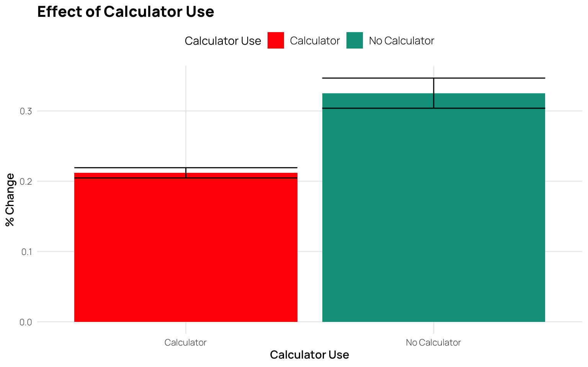

``` r
## education

s2_agg |> ggplot(aes(x = edu, y = pct_change, fill = edu)) + 
  stat_summary(fun = mean, geom = "bar", position="dodge") +
  stat_summary(fun.data = mean_se, geom = "errorbar", position = "dodge") +
  labs(
    title = "Effect of Education",
    x = "Education",
    y = "% Change",
    fill = "Education"
  )
```

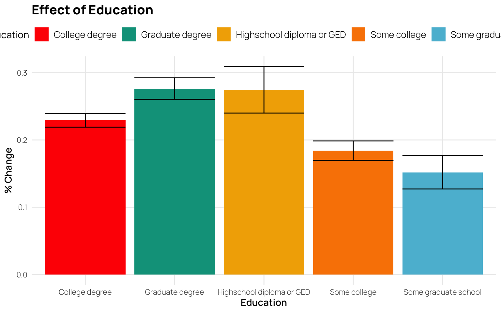

``` r
# sum1 |> 
#   ungroup() |> 
#   mutate(goal_pct = as.numeric(stringr::str_remove(pct_goal,"%"))/100,
#          block=factor(block)) |>
#   group_by(refClass,block,pct_goal) |>
#   summarise(mean_pct_change = mean(pct_change),se_pct_change = sd(pct_change)/sqrt(n())) |>
#   ggplot(aes(x=mean_pct_change,y=refClass,col=block)) + 
#   geom_pointrange(aes(xmin=mean_pct_change-se_pct_change,xmax=mean_pct_change+se_pct_change),position = position_dodge(width=0.5)) +
#   ggforce::facet_col(~pct_goal)
# 
# 
# sum1 |> 
#   ungroup() |> 
#   mutate(goal_pct = as.numeric(stringr::str_remove(pct_goal,"%"))/100,
#          block=factor(block)) |>
#   group_by(refClass,,pct_goal,state) |>
#   summarise(mean_pct_change = mean(pct_change),se_pct_change = sd(pct_change)/sqrt(n())) |>
#   ggplot(aes(x=mean_pct_change,y=refClass,col=pct_goal)) + 
#   geom_pointrange(aes(xmin=mean_pct_change-se_pct_change,xmax=mean_pct_change+se_pct_change),position = position_dodge(width=0.5)) +
#   ggforce::facet_col(~state)
# 
# 
# sum1 |> 
#   ungroup() |> 
#   mutate(goal_pct = as.numeric(stringr::str_remove(pct_goal,"%"))/100,
#          block=factor(block)) |>
#   group_by(refClass,,pct_goal,state,goal_pct) |>
#   summarise(mean_pct_change = mean(pct_change),se_pct_change = sd(pct_change)/sqrt(n())) |>
#   ggplot(aes(x=mean_pct_change,y=refClass,col=state)) + 
#   geom_vline(aes(xintercept=goal_pct),linetype="dashed",alpha=.5) +
#   geom_pointrange(aes(xmin=mean_pct_change-se_pct_change,xmax=mean_pct_change+se_pct_change),position = position_dodge(width=0.5)) +
#   ggforce::facet_col(~pct_goal)


  s2_long |> 
    filter(appliance != "TOTAL") |>
  group_by(refClass,appliance,state) |>
  summarise(mean_kWh_change = mean(change),se_pct_change = sd(change)/sqrt(n())) |>
  ggplot(aes(x=mean_kWh_change,y=refClass,col=appliance)) + 
  geom_pointrange(aes(xmin=mean_kWh_change-se_pct_change,xmax=mean_kWh_change+se_pct_change),position = position_dodge(width=0.5)) +
  ggforce::facet_col(~state)
```

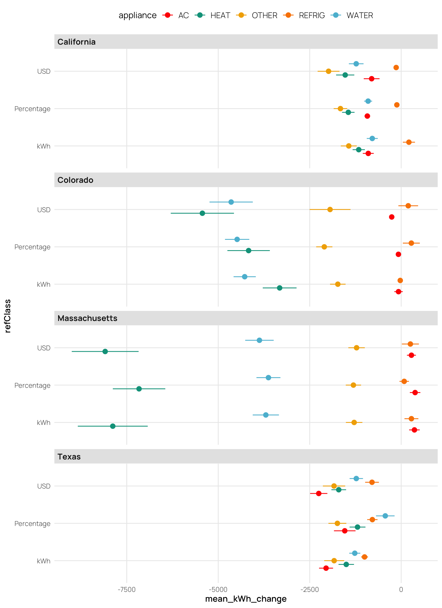

``` r
s2_long |> 
  filter(appliance != "TOTAL") |>
  ggplot(aes(x=refClass,y=change,fill=state))+
  stat_summary(fun = mean, geom = "bar", position="dodge") +
  stat_summary(fun.data = mean_se, geom = "errorbar", position = "dodge") +
  scale_y_reverse() +
  facet_wrap(~appliance)
```

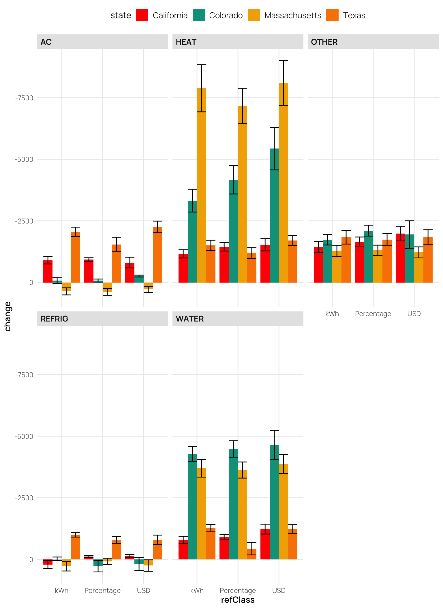

``` r
contingency_table <- sum1 %>%
    group_by(refClass) %>%
    summarise(
      matched = sum(matched_goal),
      unmatched = n() - sum(matched_goal)
    ) %>%
    select(matched, unmatched) %>%
    as.matrix()

# Perform the chi-squared test
chisq_test <- chisq.test(contingency_table)

# View the results
chisq_test


sum1b <- sum1 %>%
  mutate(matched_goal = as.numeric(matched_goal)) 

library(brms)
bayesian_model <- brms::brm(
  matched_goal ~ refClass,        # Logistic regression with reference class as predictor
  data = sum1,                    # The dataset
  family = bernoulli(),           # Binary outcome model
  prior = set_prior("normal(0, 1)", class = "b"),  # Prior for coefficients
  iter = 2000,                    # Number of iterations
  chains = 4,                     # Number of MCMC chains
  cores = 4,                      # Number of cores for parallel computation
  seed = 123                      # Set seed for reproducibility
)
# Regression Coefficients:
#                    Estimate Est.Error l-95% CI u-95% CI Rhat Bulk_ESS Tail_ESS
# Intercept             -1.27      0.14    -1.55    -1.00 1.00     3696     3393
# refClassPercentage    -0.56      0.22    -0.98    -0.14 1.00     3308     3065
# refClassUSD           -0.95      0.25    -1.45    -0.46 1.00     2895     2701


bm2 <- brms::brm(
  matched_goal ~ refClass + (1|id),        # Logistic regression with reference class as predictor
  data = sum1,                    # The dataset
  family = bernoulli(),           # Binary outcome model
  prior = set_prior("normal(0, 1)", class = "b"),  # Prior for coefficients
  iter = 2000,                    # Number of iterations
  chains = 4,                     # Number of MCMC chains
  cores = 4,                      # Number of cores for parallel computation
  seed = 123                      # Set seed for reproducibility
)
# Regression Coefficients:
#                    Estimate Est.Error l-95% CI u-95% CI Rhat Bulk_ESS Tail_ESS
# Intercept             -1.92      0.31    -2.56    -1.37 1.00     2039     2669
# refClassPercentage    -0.73      0.36    -1.43    -0.02 1.00     2586     3142
# refClassUSD           -1.15      0.41    -1.95    -0.37 1.00     3079     3071


bm3 <- brms::brm(
  matched_goal ~ refClass*rounded + (1|id),        # Logistic regression with reference class as predictor
  data = sum1,                    # The dataset
  family = bernoulli(),           # Binary outcome model
  prior = set_prior("normal(0, 1)", class = "b"),  # Prior for coefficients
  iter = 2000,                    # Number of iterations
  chains = 4,                     # Number of MCMC chains
  cores = 4,                      # Number of cores for parallel computation
  seed = 123                      # Set seed for reproducibility
)
# Regression Coefficients:
#                                   Estimate Est.Error l-95% CI u-95% CI Rhat Bulk_ESS Tail_ESS
# Intercept                            -1.80      0.34    -2.49    -1.17 1.00     1896     2384
# refClassPercentage                   -1.48      0.45    -2.37    -0.61 1.00     3108     3324
# refClassUSD                          -1.54      0.47    -2.53    -0.66 1.00     3309     3226
# roundedRounded                       -0.59      0.30    -1.17     0.02 1.00     4310     2857
# refClassPercentage:roundedRounded     1.71      0.45     0.83     2.59 1.00     4076     3070
# refClassUSD:roundedRounded            1.00      0.50     0.02     1.96 1.00     4399     3144


bm4 <- brms::brm(
  matched_goal ~ refClass*rounded + (1|id) +(1|state),        # Logistic regression with reference class as predictor
  data = sum1,                    # The dataset
  family = bernoulli(),           # Binary outcome model
  prior = set_prior("normal(0, 1)", class = "b"),  # Prior for coefficients
  iter = 2000,                    # Number of iterations
  chains = 4,                     # Number of MCMC chains
  cores = 4,                      # Number of cores for parallel computation
  seed = 123                      # Set seed for reproducibility
)
# Regression Coefficients:
#                                   Estimate Est.Error l-95% CI u-95% CI Rhat Bulk_ESS Tail_ESS
# Intercept                            -1.77      0.44    -2.62    -0.81 1.01      526      187
# refClassPercentage                   -1.49      0.44    -2.34    -0.62 1.00     1352     1519
# refClassUSD                          -1.53      0.48    -2.49    -0.62 1.00     1836     2504
# roundedRounded                       -0.58      0.29    -1.16    -0.03 1.00     2933     2938
# refClassPercentage:roundedRounded     1.72      0.45     0.85     2.59 1.00     1936     2501
# refClassUSD:roundedRounded            1.00      0.48     0.05     1.91 1.00     2460     2472
```

``` r
# mixed effects model testing effect of refClass, state, and pct_goal on pct_change
# marginal effects plots
library(ggeffects)


m1 <- lmer(pct_change ~ refClass  + (1+plan|id) + (1|state), data = s2_agg)
summary(m1)
ggpredict(m1, c("refClass")) |> plot()

m1 <- lmer(pct_change ~ pct_goal  + (1|id) + (1|state), data = s2_agg)
summary(m1)
ggpredict(m1, c("pct_goal")) |> plot()

m1 <- lmer(pct_change ~ pct_goal*rounded  + (1|id) + (1|state), data = s2_agg)
summary(m1)
ggpredict(m1, c("pct_goal","rounded")) |> plot()


m1 <- lmer(pct_change ~ refClass*pct_goal*rounded  + (1|id) + (1|state), data = s2_agg)
ggpredict(m1, c("refClass","pct_goal","rounded")) |> plot()

m1 <- lmer(pct_change ~ state*pct_goal*rounded  + (1|id), data = s2_agg)
summary(m1)
ggpredict(m1, c("state","pct_goal","rounded")) |> plot()


# m1 <- lmer(pct_change ~ refClass*pct_goal*rounded*state  + (1|id), data = sum1)
# ggpredict(m1, c("refClass","pct_goal","rounded","state")) |> plot()
```

``` r
s2_long |> 
  filter(appliance != "TOTAL") |>
  ggplot(aes(x=refClass,y=state_dif,fill=state))+
  stat_summary(fun = mean, geom = "bar", position="dodge") +
  stat_summary(fun.data = mean_se, geom = "errorbar", position = "dodge") +
  scale_y_reverse() +
  facet_wrap(~appliance)

s2_long |> 
  filter(appliance != "TOTAL") |>
  ggplot(aes(x=state_dif,y=value,col=state))+
  geom_point() +
  facet_wrap(~appliance)


sum1 |> 
  ggplot(aes(x=state_dif,y=pct_change,col=state)) +
  geom_point() 


# compute total kWh reduction, and total % reduction 
s2_long |> group_by(id,refClass,state,pct_goal,rounded,block,plan) |> 
  filter(appliance !="TOTAL") |> 
  summarise(total_kWh = sum(value),orig_kWh=sum(family), total_pct = sum(value)/sum(family)) |>
  ggplot(aes(x = pct_goal, y = total_pct, fill = refClass)) + 
  geom_boxplot(position = "dodge") +
  facet_wrap(~state)
  
s2_long |> group_by(id,refClass,state,pct_goal,rounded) |> 
  filter(appliance !="TOTAL") |> 
  summarise(total_kWh = sum(reduction), total_pct = sum(reduction)/sum(family)) |>
  ggplot(aes(x = pct_goal, y = total_pct, fill = refClass)) + 
  stat_summary(fun = mean, geom = "bar", position="dodge") +
  stat_summary(fun.data = mean_se, geom = "errorbar", position = "dodge") 
  

s2_long |> group_by(id,refClass,state,pct_goal,rounded) |> 
  filter(appliance !="TOTAL") |> 
  summarise(total_kWh = sum(reduction), orig_kWh=sum(family), total_pct = round(sum(reduction)/sum(family))) |>
  ggplot(aes(x = state1, y = total_pct, fill = refClass)) + 
  stat_summary(fun = mean, geom = "bar", position="dodge") +
  stat_summary(fun.data = mean_se, geom = "errorbar", position = "dodge") +
  facet_wrap(~pct_goal)
  

s2_long |> group_by(id,refClass,state,pct_goal,rounded,plan) |> 
  filter(appliance !="TOTAL") |> 
  summarise(total_kWh = sum(reduction), total_pct = sum(reduction)/sum(family)) |>
  ggplot(aes(x = refClass, y = total_pct, fill = pct_goal)) + 
  stat_summary(fun = mean, geom = "bar", position="dodge") +
  stat_summary(fun.data = mean_se, geom = "errorbar", position = "dodge") +
  facet_wrap(plan~rounded)

# sum1 |> 
#   ungroup() |> 
#   mutate(goal_pct = as.numeric(stringr::str_remove(pct_goal,"%"))/100) |>
#   mutate(id=reorder(id,pct_change)) |> 
#   ggplot(aes(y=id,x=pct_change)) + 
#   geom_point(size=1,alpha=0.6,position = position_jitter(w=0, h=0.17)) +
#   geom_vline(aes(xintercept=goal_pct),linetype="dashed",alpha=.5) +
#   ggh4x::facet_nested_wrap(refClass~pct_goal,axes="all",scales="free",ncol=2) 

# sum1 |> 
#   ungroup() |> 
#   mutate(goal_pct = as.numeric(stringr::str_remove(pct_goal,"%"))/100) |>
#   mutate(id=reorder(id,pct_change)) |> 
#   ggplot(aes(y=id,x=pct_change,col=refClass)) + 
#   geom_point(size=1,alpha=0.6,position = position_jitter(w=0, h=0.17)) +
#   geom_vline(aes(xintercept=goal_pct),linetype="dashed",alpha=.5) +
#   ggh4x::facet_nested_wrap(block~pct_goal,axes="all",scales="free",ncol=2) 
# 
# 
# sum1 |> 
#   ungroup() |> 
#     mutate(goal_pct = as.numeric(stringr::str_remove(pct_goal,"%"))/100) |>
#   ggplot(aes(x=state,y=pct_change,col=state)) + 
#   geom_point(size=1,alpha=0.6,position = position_jitter(w=0, h=0.17)) +
#     geom_hline(aes(yintercept=goal_pct),linetype="dashed",alpha=.5) +
#   ggdist::stat_halfeye()+
#   ggh4x::facet_nested_wrap(block~pct_goal,axes="all",ncol=2) 


# s2_long <- s2 |>
#   pivot_longer(
#     cols = c(ACFAMILY1:TOTALAPTWO1),
#     names_to = c(".value", "appliance"),
#     names_pattern = "(.*)(FAMILY1|STATE1|APONE1|APTWO1)$",
#     values_to = "value"
#   )


# s2 |> pivot_longer(cols = contains("FAMILY"), names_to = "Family", values_to = "kWh") |> relocate(Family,kWh) |> 
#   pivot_longer(cols = contains("STATE1"), names_to = "State", values_to = "kWh") |> relocate(State)


# 
# s2 |> 
#   pivot_longer(cols=ACFAMILY1:TOTALAPTWO1, names_to = "appliance", values_to = "family") |> relocate(appliance,family)
```
