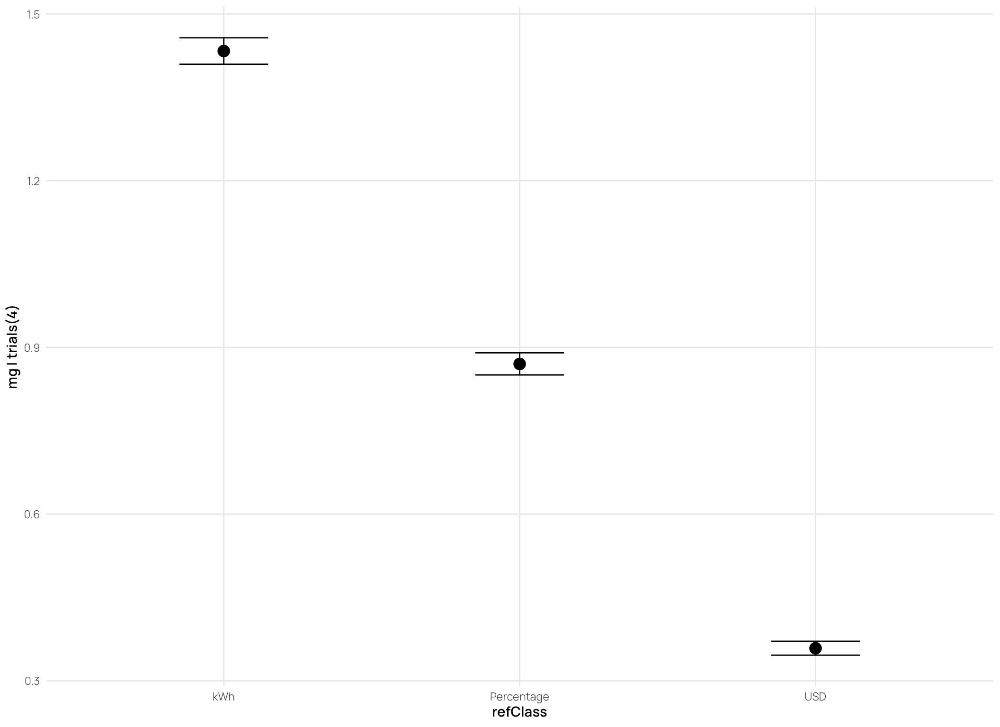
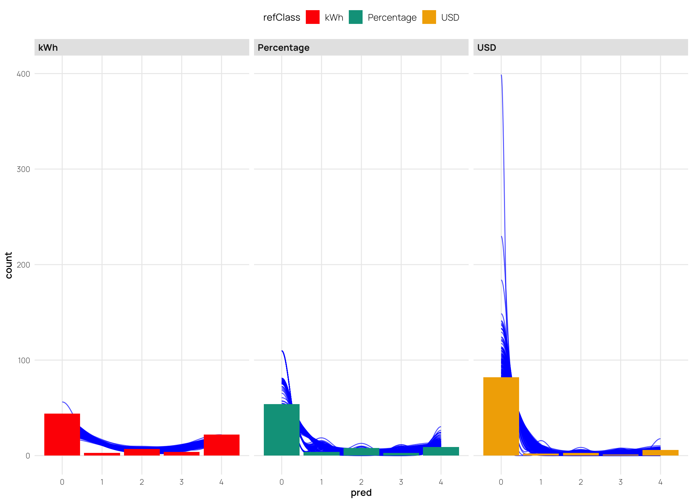
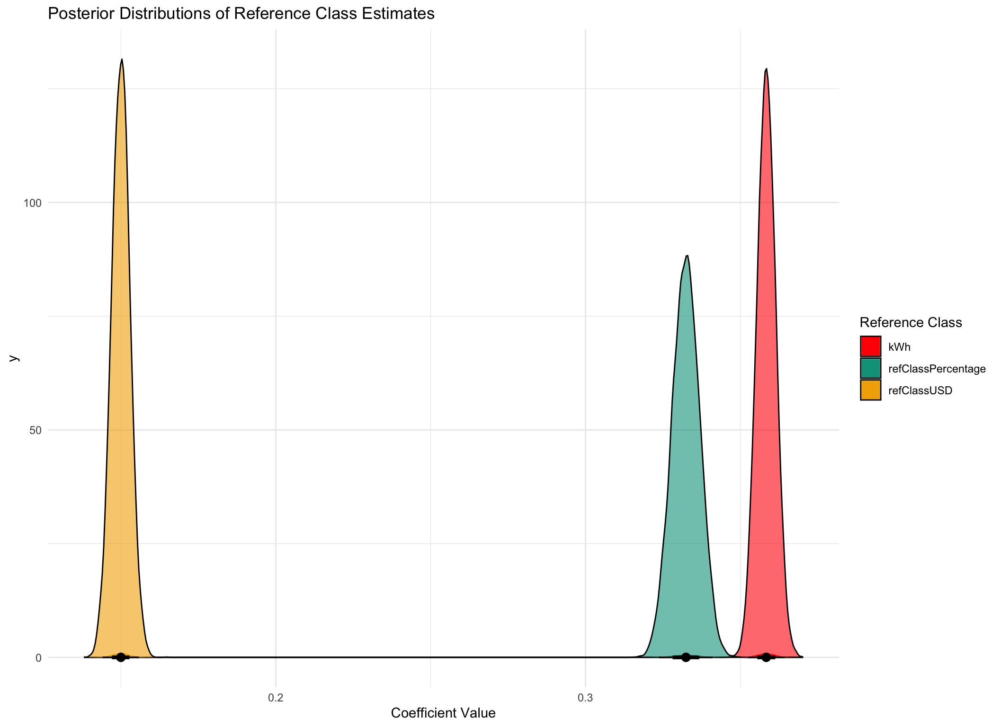
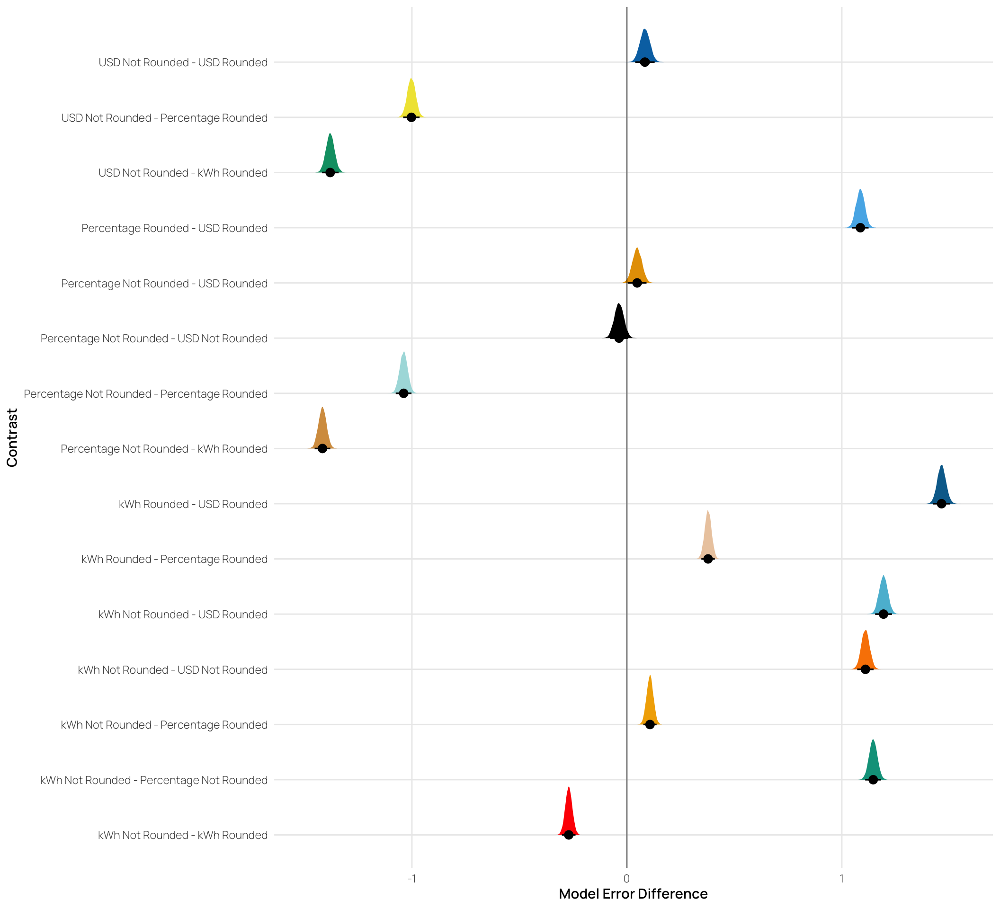

<details class="code-fold">
<summary>Code</summary>

``` r
library(pacman)
pacman::p_load(dplyr,purrr,tidyr,here,tibble,brms,rstan,bayestestR,emmeans,tidybayes,modelsummary,
               ggplot2,gt,knitr,kableExtra,ggh4x,lme4,flextable)

options(digits=2, scipen=999, dplyr.summarise.inform=FALSE)
options(brms.backend="cmdstanr",mc.cores=4)

walk(c("fun_plot"), ~ source(here::here(paste0("Scripts/", .x, ".R"))))
theme_set(theme_nice())


s1 <- readRDS(here::here("data/s1_processed.rds"))

s1_agg <- s1 |> 
  filter(appliance !="Total kWh") |> 
  group_by(id,refClass,state,block,plan,calc,edu,pct_goal) |> 
  summarise(total_kWh = sum(value),orig_kWh=sum(family), 
            pct_change = round((orig_kWh-total_kWh)/orig_kWh,3), 
            n_change = sum(value!=family),
            state_p_dif=mean(state_p_dif),
            state_f_dif=mean(state_f_dif),
            n_less_avg = sum(less_avg)) |> 
  mutate(matched_goal = (pct_change == pct_goal), 
             error = pct_change - pct_goal,
            abs_error = abs(error))


s1_agg4 <- s1_agg |> group_by(id,refClass,calc) |> 
  summarise(mg=sum(matched_goal),n=n(), pct=mg/n) 


s2_long <- readRDS(here::here("data/s2_processed.rds"))

s2_agg <- s2_long |> 
  filter(appliance != "TOTAL") |> 
  group_by(id, refClass, state, pct_goal, pct, rounded, block, plan, calc, edu) |> 
  summarise(
    total_kWh = sum(value),
    orig_kWh = sum(family),
    pct_change = round((orig_kWh - total_kWh) / orig_kWh, 3),
    state_dif = mean(state_dif),
    .groups = "drop"
  ) |>
  mutate(matched_goal = (pct_change == pct),
         matched_goal2 = abs(pct_change-pct)<.03)

s2_agg4 <- s2_agg |> group_by(id,refClass,calc) |> 
  summarise(mg=sum(matched_goal),n=n(), pct=mg/n) 

s2_agg2 <- s2_agg |> group_by(id,refClass,rounded,pct_goal,pct,calc) |> 
  summarise(mg=sum(matched_goal),n=n(), pct=mg/n) 
```

</details>

## Experiment 1

<details class="code-fold">
<summary>Code</summary>

``` r
##| label: tbl-s1-bb
##| tbl-cap: "E1. beta-binomial regression results


s1_bb1 <- brm(
  mg | trials(4) ~ refClass,
  family = beta_binomial(),
  cores=4,
  iter=5000,
  data = s1_agg4,
  file=paste0(here::here("data/model_cache",'s1_bb1.rds'))
)

mted1 <- as.data.frame(describe_posterior(s1_bb1, centrality = "Median"))[, c(1,2,4,5,6)]
#colnames(mted1) <- c("Term", "Estimate"," 95% CrI Lower", " 95% CrI Upper", "pd")
colnames(mted1) <- c("Term", "Estimate", "95% CrI Lower", "95% CrI Upper", "pd")


intercept <- mted1$Estimate[mted1$Term == "b_Intercept"]

# mted1 |>
#   mutate(
#     Estimate_prob = plogis(Estimate + if_else(Term == "b_Intercept", 0, intercept)),
#     Lower_prob = plogis(`95% CrI Lower` + if_else(Term == "b_Intercept", 0, intercept)),
#     Upper_prob = plogis(`95% CrI Upper` + if_else(Term == "b_Intercept", 0, intercept))
#   )

t1 <- mted1 |>
  mutate(Term = stringr::str_remove(Term, "b_")) |>
  mutate(across(c("Estimate", "95% CrI Lower", "95% CrI Upper"), 
                \(x) if_else(Term == "Intercept", plogis(x), plogis(x + intercept)))) |>
  mutate(across(where(is.numeric), \(x) round(x, 3))) |>
  mutate(Term = if_else(Term == "Intercept", "Intercept (kWh)", Term)) |>
  tibble::remove_rownames() |>
  kable(booktabs = TRUE)


# plogis(-.58+ -.70) = .22

# parameters::parameters(s1_bb1, effect = "fixed") 
```

</details>
<div id="tbl-s1-bb">

| Term               | Estimate | 95% CrI Lower | 95% CrI Upper |  pd |
|:-------------------|---------:|--------------:|--------------:|----:|
| Intercept (kWh)    |     0.36 |          0.35 |          0.36 |   1 |
| refClassPercentage |     0.22 |          0.21 |          0.22 |   1 |
| refClassUSD        |     0.09 |          0.09 |          0.09 |   1 |

Table 1: **Experiment 1 main effect**. Beta binomial regression results for the main effect of Reference Class.
</div>
<details class="code-fold">
<summary>Code</summary>

``` r
plot(conditional_effects(s1_bb1, effects="refClass"),points=FALSE)

posterior_predict(s1_bb1,ndraws=200) |> array_branch(margin=1) |> 
  map_dfr(
    function(yrep_iter){
      s1_agg4 %>% ungroup() |>  mutate(pred=yrep_iter)
    },
    .id='iter'
  ) |> mutate(iter=as.numeric(iter)) |> 
  ggplot(aes(pred, group=iter)) +
  # Scale density to match the count scale
  geom_line(stat='density', aes(y=..count..), 
            alpha=0.7, color='blue') +
  geom_bar(data=s1_agg4, aes(mg, fill=refClass),
           inherit.aes=FALSE) +
  facet_wrap(~refClass)


s1_bb1 %>%
  gather_draws(b_Intercept, b_refClassPercentage, b_refClassUSD) %>%
   mutate(Term = stringr::str_remove(.variable, "b_")) |>
   mutate(prob=plogis(.value)) |>
  mutate(Term = if_else(Term == "Intercept", "kWh", Term)) |>
  ggplot(aes(x = prob, fill = Term)) +
  geom_density(alpha = 0.6) +
    stat_halfeye() +
  theme_minimal() +
  labs(title = "Posterior Distributions of Reference Class Estimates",
       x = "Coefficient Value",
       fill = "Reference Class")
```

</details>






<details class="code-fold">
<summary>Code</summary>

``` r
##| label: tbl-s2-bb
##| tbl-cap: "Study 2. beta-binomial regression results
##| 
##| 


s2_bb2_r_g <- brm(
  mg | trials(2) ~ refClass*rounded*pct_goal,
  family = beta_binomial(),
  data = s2_agg2,
  cores=4,
  iter=5000,
  file=paste0(here::here("data/model_cache",'s2_bb2_r_g.rds'))
)
mted2 <- as.data.frame(describe_posterior(s2_bb2_r_g, centrality = "Mean"))[, c(1,2,4,5,6)]
colnames(mted2) <- c("Term", "Estimate","95% CrI Lower", "95% CrI Upper", "pd")

# mted2 |>
#   mutate(across(c("Estimate", " 95% CrI Lower", " 95% CrI Upper"), 
#                 \(x) plogis(x))) |>
#   mutate(across(where(is.numeric), \(x) round(x, 3))) |>
#   tibble::remove_rownames() |>
#   mutate(Term = stringr::str_remove(Term, "b_")) |>
#   kable(booktabs = TRUE)


 mted2 |>
  mutate(Term = stringr::str_remove(Term, "b_")) |>
  mutate(across(c("Estimate", "95% CrI Lower", "95% CrI Upper"), 
                \(x) if_else(Term == "Intercept", plogis(x), plogis(x + intercept)))) |>
  mutate(across(where(is.numeric), \(x) round(x, 3))) |>
  mutate(Term = if_else(Term == "Intercept", "Intercept (kWh)", Term)) |>
  tibble::remove_rownames() |>
  kable(booktabs = TRUE)
```

</details>

| Term | Estimate | 95% CrI Lower | 95% CrI Upper | pd |
|:------------------------------------|-------:|-----------:|-----------:|---:|
| Intercept (kWh) | 0.40 | 0.40 | 0.41 | 1 |
| refClassPercentage | 0.08 | 0.08 | 0.09 | 1 |
| refClassUSD | 0.12 | 0.11 | 0.12 | 1 |
| roundedRounded | 0.40 | 0.39 | 0.41 | 1 |
| pct_goal15% | 0.34 | 0.33 | 0.35 | 1 |
| refClassPercentage:roundedRounded | 0.75 | 0.73 | 0.76 | 1 |
| refClassUSD:roundedRounded | 0.39 | 0.37 | 0.41 | 1 |
| refClassPercentage:pct_goal15% | 0.69 | 0.67 | 0.70 | 1 |
| refClassUSD:pct_goal15% | 0.51 | 0.49 | 0.53 | 1 |
| roundedRounded:pct_goal15% | 0.40 | 0.39 | 0.42 | 1 |
| refClassPercentage:roundedRounded:pct_goal15% | 0.09 | 0.08 | 0.09 | 1 |
| refClassUSD:roundedRounded:pct_goal15% | 0.17 | 0.16 | 0.19 | 1 |

<details class="code-fold">
<summary>Code</summary>

``` r
# plot(conditional_effects(s2_bb2_r_g, 
#                          effects = "rounded:pct_goal", 
#                          conditions=make_conditions(s2_bb2_r_g,"refClass" )),
#      points=FALSE,plot=TRUE)

patchwork::wrap_plots(plot(conditional_effects(s2_bb2_r_g),points=FALSE,plot=FALSE))
```

</details>


<details class="code-fold">
<summary>Code</summary>

``` r
condEffects <- function(m,xvar){
  m |> ggplot(aes(x = {{xvar}}, y = .value, color = refClass, fill = refClass)) + 
  stat_dist_pointinterval() + 
  stat_halfeye(alpha=.1, height=.5) +
  theme(legend.title=element_blank(),axis.text.x = element_text(angle = 45, hjust = 0.5, vjust = 0.5)) 
}

pe3td <- s2_agg2 |>  ggplot(aes(x =refClass, y = mg,fill=pct_goal)) +
    stat_summary(geom = "bar", position=position_dodge(), fun = mean) +
    stat_summary(geom = "errorbar", position=position_dodge(.9), fun.data = mean_se, width = .4, alpha = .7) + 
    facet_wrap(~rounded,ncol=1) +
  theme(legend.title=element_blank(),axis.text.x = element_text(angle = 45, hjust = 0.5, vjust = 0.5)) +
  labs(x="Band", y="Deviation From Target")


pe3ce <- s2_bb2_r_g |> emmeans( ~refClass *rounded*pct_goal, type="response") |>
  gather_emmeans_draws() |>
 condEffects(pct_goal) + labs(y="Absolute Deviation From Band", x="Band Type") + 
 facet_wrap(~refClass,ncol=1)


s2_bb2_r_g |> emmeans( ~refClass, type="response") |>
  gather_emmeans_draws() |>
 condEffects(refClass) + labs(y="Absolute Deviation From Band", x="Band Type") 


s2_bb2_r_g |> emmeans(pairwise ~ refClass * rounded, type="response") |> 
  pluck("contrasts") |>
  gather_emmeans_draws() |> 
  group_by(contrast,.draw) |> summarise(value=mean(.value), n=n()) |> 
   ggplot(aes(x=value,y=contrast,fill=contrast)) +
  stat_halfeye() + 
  geom_vline(xintercept=0, alpha=.5) +
  labs(x="Model Error Difference",y="Contrast") + theme(legend.position="none") 
```

</details>



