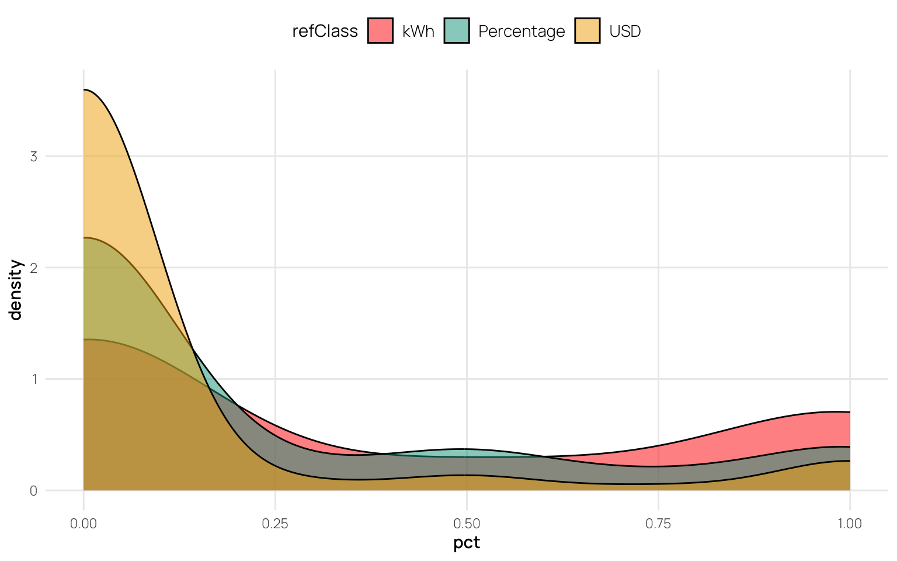

# Study 1 Analysis
Thomas E. Gorman

<script src="site_libs/kePrint-0.0.1/kePrint.js"></script>
<link href="site_libs/lightable-0.0.1/lightable.css" rel="stylesheet" />

<details class="code-fold">
<summary>Code</summary>

``` r
library(pacman)
pacman::p_load(dplyr,purrr,tidyr,here,haven,tibble,brms,bayestestR,emmeans,tidybayes,modelsummary,
               ggplot2,gt,ggh4x,lme4,flextable,kableExtra)

options(digits=2, scipen=999, dplyr.summarise.inform=FALSE)
walk(c("fun_plot"), ~ source(here::here(paste0("Scripts/", .x, ".R"))))
theme_set(theme_nice())
```

</details>

<details class="code-fold">
<summary>Code</summary>

``` r
# s1 <- haven::read_sav(here::here("data/data_qualtrics/Frequency & Probability - 9-23-18_October 6, 2024_20.39.sav")) # length(unique(s1$ResponseId)) = 588
# qd <- unique(s1$ResponseId)

s1 <- haven::read_sav(here::here("data/Frequency & Probability Study 1 - 3-24-19.sav"))

#gd <- unique(s1$ResponseId)
# gd %in% qd
# qd %in% gd

s1 <- s1 |> 
  mutate(
    state1 = case_when(
      Colorado == 1 ~ "Colorado",
      Massachusetts == 1 ~ "Massachusetts",
      California == 1 ~ "California",
      Texas == 1 ~ "Texas",
      TRUE ~ NA_character_
    ),
    state2 = case_when(
      Colorado == 2 ~ "Colorado",
      Massachusetts == 2 ~ "Massachusetts",
      California == 2 ~ "California",
      Texas == 2 ~ "Texas",
      TRUE ~ NA_character_
    )) |> 
  mutate(refClass = case_when(
  ReferenceClass == 1 ~ "USD",
  ReferenceClass == 2 ~ "kWh",
  ReferenceClass == 3 ~ "Percentage"
)) |> 
  rename(calc=MATH01) |>  # replace NA's in calc with 0's
  rename(id2=ResponseId) |>
  mutate(id=row_number()) |> relocate(id) |> 
  mutate(calc=factor(ifelse(is.na(calc),0,calc))) |> 
  relocate(refClass,state1,state2,calc, .after = id) 


s1 <- s1 |> rename(edu=DEM04) |>
  mutate(edu = factor(case_when(
    edu == 1 ~ "Some schooling, but no diploma or degree",
    edu == 2 ~ "Highschool diploma or GED",
    edu == 3 ~ "Some college",
    edu == 4 ~ "College degree",
    edu == 5 ~ "Some graduate school",
    edu == 6 ~ "Graduate degree",
    edu == 7 ~ "Choose not to answer",
    TRUE ~ NA_character_
  ))) |> relocate(edu, .after = id) 

# colnames(s1)
# colnames(s1)[1000:1500]
# colnames(s1)[1500:1843]

# select all columns that start with "A"
# s12 <- s1 |> select(id,state1,state2,refClass,calc,edu,starts_with("A")) |> 
#   select(-starts_with("AIND"))


# 
# t <- s12 |> filter(state1=="Texas") |> 
#   # select only columns that contain "TEX" in the name
#   select(id,state1,state2,refClass,calc,edu,contains("TEX")) 
# 
# t2 <- s12 |> filter(state2=="Texas") |> 
#   select(id,state1,state2,refClass,calc,edu,contains("TEX"))
# 

trim_na_and_empty_columns <- function(df) {
  df %>%
    select(where(~!(all(is.na(.)) | (is.character(.) && all(trimws(.) == ""))))) |> 
    select(-starts_with("AIND"))
}


# Create a list of trimmed datasets for each unique ID
dAll <- s1 %>%
  group_by(id) %>%
  group_split() %>%
  map(trim_na_and_empty_columns) %>%
  set_names(unique(s1$id))

# modalities <- c(A = "kWh", D = "USD", P = "Percentage")
# states <- c(CAL = "California", MASS = "Massachusetts", COL = "Colorado", TEX = "Texas")


parse_action_plan <- function(df) {
  
  action_plan_cols <- df %>% 
  select(-matches("01$|02$|03$|04$|05$|06$|33$|34$|35$|36$|37$")) %>%
    select(
      matches("^[ADP]\\d+(CAL|MASS|COL|TEX)\\d{2,3}$"), #,  # Select action plan columns
      -matches("32$")                                     # Exclude columns ending with '32'
    ) %>%
    names()

  df_long <- df %>%
  select(-matches("01$|02$|03$|04$|05$|06$")) %>%
    pivot_longer(
      cols = all_of(action_plan_cols),
      names_to = c("modality", "state", "item_num"),
      names_pattern = "^([ADP])\\d+(CAL|MASS|COL|TEX)(\\d+)$",
      values_to = "value"
    ) |> select(id,state1,state2,refClass,calc,edu,modality,state,item_num,value,id2) 
  
  df_long <- df_long |> 
  mutate(
    appliance = case_when(
      item_num %in% c("07","08","09",7:10) ~ "Cooling",
      item_num %in% 11:14 ~ "Heating",
      item_num %in% 15:18 ~ "Water Heating",
      item_num %in% 19:22 ~ "Refrigerator",
      item_num %in% 23:26 ~ "Other Appliance",
      item_num %in% 27:30 ~ "Total kWh",
      item_num == 31 ~ "Preferred Plan",
      item_num %in% 33:37 ~ "Reduction Choices",
      TRUE ~ NA_character_
    )
  ) |> 
  # item_type - family, state, plan1 or plan2
  mutate(item_type=case_when(
    item_num %in% c("07","11","15","19","23","27") ~ "family",
    item_num %in% c("08","12","16","20","24","28") ~ "state_avg",
    item_num %in% c("09","13","17","21","25","29") ~ "plan1",
    item_num %in% c("10","14","18","22","26","30") ~ "plan2",
    TRUE ~ "other"
  )) 

# pivot family and state_avg into their own separate columns, plan1 and plan2 into a combined column called plan
df_long <- df_long |> 
  filter(item_type !="other") |> 
  select(-item_num) |> 
  pivot_wider(names_from = c("item_type"), values_from = value) |> 
  pivot_longer(cols = c("plan1","plan2"), names_to = "plan", values_to = "value") 
  
}

test <- dAll |> # map each item in dAll into parse function
  map(parse_action_plan) 
  
s1 <- bind_rows(test)

s1 <- s1 |> group_by(id) |> 
  mutate(trial=row_number(), block=ifelse(trial>=12,2,1), plan=as_factor(plan),pct_goal=.15) |> 
  select(-trial)

# for id R_1kFwgoKAmNTwCs3 - when state== TEX, appliance == Heating, check values of family column
s1 |> filter(id2=="R_1kFwgoKAmNTwCs3" & state=="TEX" & appliance=="Heating") |> select(family) 
# for id R_1kFwgoKAmNTwCs3 - when state== TEX, appliance == Heating, set values of family column to 6118
s1 <- s1 |> mutate(family=ifelse(id2=="R_1kFwgoKAmNTwCs3" & state=="TEX" & appliance=="Heating",6118,family))

s1 <- s1 |> 
  mutate(change = value-family, state_dif = value-state_avg,calc = if_else(calc == 0, "No Calculator", "Used Calculator")) |> 
  mutate(value=as.numeric(value))


saveRDS(s1, here::here("data/s1_processed.rds"))
```

</details>

<details class="code-fold">
<summary>Code</summary>

``` r
s1 <- readRDS(here::here("data/s1_processed.rds"))


s1_agg <- s1 |> 
  filter(appliance !="Total kWh") |> 
  group_by(id,refClass,state,block,plan,calc,edu,pct_goal) |> 
  summarise(total_kWh = sum(value),orig_kWh=sum(family), pct_change = round((orig_kWh-total_kWh)/orig_kWh,3), state_dif=mean(state_dif)) |> 
  mutate(matched_goal = (pct_change == pct_goal))

k <- s1_agg |> group_by(id,pct_goal) |>  summarize(total_kWh=sum(total_kWh),orig_kWh=sum(orig_kWh),pct_change=round((orig_kWh-total_kWh)/orig_kWh,3)) |> 
  mutate(matched_goal = (pct_change == pct_goal))

s1_agg4 <- s1_agg |> group_by(id,refClass) |> 
  summarise(mg=sum(matched_goal),n=n(), pct=mg/n) 

s1_agg2 <- s1_agg |> group_by(id,refClass,state) |> 
  summarise(mg=sum(matched_goal),n=n(), pct=mg/n) 

outliers <- s1_agg |>  ungroup() |> group_by(state) |> mutate(change_mean=mean(pct_change,na.rm=TRUE),change_sd=sd(pct_change,na.rm=TRUE),
                                     z_score=(pct_change-change_mean)/change_sd,
                                     is_outlier=abs(z_score)>3.0)
outlier_id <- outliers |> filter(is_outlier) |> pull(id) |> unique()
```

</details>

<div class="cell panel-tabset">

## Calculator by Ref Class tallies

| calc            |       | kWh  | Percentage | USD  |
|-----------------|-------|------|------------|------|
| No Calculator   | N     | 20   | 14         | 27   |
|                 | % row | 32.8 | 23.0       | 44.3 |
| Used Calculator | N     | 60   | 64         | 67   |
|                 | % row | 31.4 | 33.5       | 35.1 |
| All             | N     | 80   | 78         | 94   |
|                 | % row | 31.7 | 31.0       | 37.3 |

## % of trials with matched goal

|     | refClass   | Mean | Median | Mode | sd   | Histogram |
|-----|------------|------|--------|------|------|-----------|
|     | kWh        | 0.37 | 0.00   | 0.00 | 0.44 | ▇ ▁▁▃     |
|     | Percentage | 0.21 | 0.00   | 0.00 | 0.35 | ▇▁▁ ▁     |
|     | USD        | 0.09 | 0.00   | 0.00 | 0.27 | ▇ ▁       |

% of trials where goal was matched

## % change in plan

|            | refClass   | Mean | Median | Mode |
|------------|------------|------|--------|------|
| pct_change | kWh        | 0.24 | 0.15   | 0.15 |
|            | Percentage | 0.20 | 0.16   | 0.15 |
|            | USD        | 0.27 | 0.21   | 0.16 |

</div>

<details class="code-fold">
<summary>Code</summary>

``` r
plot_hist_condit <- function(fcondit,dat,pvar) {
  full_range <- dat |> pull({{pvar}}) |> range(na.rm=TRUE)
  dat |>
    filter(refClass == fcondit) |> 
    ggplot(aes(.data[[pvar]])) +
    geom_bar(fill = 'dodgerblue4',width=1) +
    theme_minimal() #+ coord_cartesian(xlim = full_range)
}


s1_agg4 |> group_by(refClass) |> 
  summarise(Mean=mean(pct), Median=median(pct),Mode=modeest::mlv(pct,method='mfv'), sd=sd(pct), n=n()) |> 
  mutate(Distribution=refClass) |> rename("Reference Class"=refClass) |>  
  gt() |> 
  tab_header(title="Descriptive Statistics of % of trials with matched goal") |> 
  text_transform(
    locations=cells_body(columns='Distribution'),
    fn=function(column) {
      map(column,plot_hist_condit,dat=s1_agg4,pvar='mg') |> 
        ggplot_image(height=px(50),aspect_ratio=2)
    }
  )
```

</details>

<div id="owogtflvqk" style="padding-left:0px;padding-right:0px;padding-top:10px;padding-bottom:10px;overflow-x:auto;overflow-y:auto;width:auto;height:auto;">
<style>#owogtflvqk table {
  font-family: system-ui, 'Segoe UI', Roboto, Helvetica, Arial, sans-serif, 'Apple Color Emoji', 'Segoe UI Emoji', 'Segoe UI Symbol', 'Noto Color Emoji';
  -webkit-font-smoothing: antialiased;
  -moz-osx-font-smoothing: grayscale;
}
&#10;#owogtflvqk thead, #owogtflvqk tbody, #owogtflvqk tfoot, #owogtflvqk tr, #owogtflvqk td, #owogtflvqk th {
  border-style: none;
}
&#10;#owogtflvqk p {
  margin: 0;
  padding: 0;
}
&#10;#owogtflvqk .gt_table {
  display: table;
  border-collapse: collapse;
  line-height: normal;
  margin-left: auto;
  margin-right: auto;
  color: #333333;
  font-size: 16px;
  font-weight: normal;
  font-style: normal;
  background-color: #FFFFFF;
  width: auto;
  border-top-style: solid;
  border-top-width: 2px;
  border-top-color: #A8A8A8;
  border-right-style: none;
  border-right-width: 2px;
  border-right-color: #D3D3D3;
  border-bottom-style: solid;
  border-bottom-width: 2px;
  border-bottom-color: #A8A8A8;
  border-left-style: none;
  border-left-width: 2px;
  border-left-color: #D3D3D3;
}
&#10;#owogtflvqk .gt_caption {
  padding-top: 4px;
  padding-bottom: 4px;
}
&#10;#owogtflvqk .gt_title {
  color: #333333;
  font-size: 125%;
  font-weight: initial;
  padding-top: 4px;
  padding-bottom: 4px;
  padding-left: 5px;
  padding-right: 5px;
  border-bottom-color: #FFFFFF;
  border-bottom-width: 0;
}
&#10;#owogtflvqk .gt_subtitle {
  color: #333333;
  font-size: 85%;
  font-weight: initial;
  padding-top: 3px;
  padding-bottom: 5px;
  padding-left: 5px;
  padding-right: 5px;
  border-top-color: #FFFFFF;
  border-top-width: 0;
}
&#10;#owogtflvqk .gt_heading {
  background-color: #FFFFFF;
  text-align: center;
  border-bottom-color: #FFFFFF;
  border-left-style: none;
  border-left-width: 1px;
  border-left-color: #D3D3D3;
  border-right-style: none;
  border-right-width: 1px;
  border-right-color: #D3D3D3;
}
&#10;#owogtflvqk .gt_bottom_border {
  border-bottom-style: solid;
  border-bottom-width: 2px;
  border-bottom-color: #D3D3D3;
}
&#10;#owogtflvqk .gt_col_headings {
  border-top-style: solid;
  border-top-width: 2px;
  border-top-color: #D3D3D3;
  border-bottom-style: solid;
  border-bottom-width: 2px;
  border-bottom-color: #D3D3D3;
  border-left-style: none;
  border-left-width: 1px;
  border-left-color: #D3D3D3;
  border-right-style: none;
  border-right-width: 1px;
  border-right-color: #D3D3D3;
}
&#10;#owogtflvqk .gt_col_heading {
  color: #333333;
  background-color: #FFFFFF;
  font-size: 100%;
  font-weight: normal;
  text-transform: inherit;
  border-left-style: none;
  border-left-width: 1px;
  border-left-color: #D3D3D3;
  border-right-style: none;
  border-right-width: 1px;
  border-right-color: #D3D3D3;
  vertical-align: bottom;
  padding-top: 5px;
  padding-bottom: 6px;
  padding-left: 5px;
  padding-right: 5px;
  overflow-x: hidden;
}
&#10;#owogtflvqk .gt_column_spanner_outer {
  color: #333333;
  background-color: #FFFFFF;
  font-size: 100%;
  font-weight: normal;
  text-transform: inherit;
  padding-top: 0;
  padding-bottom: 0;
  padding-left: 4px;
  padding-right: 4px;
}
&#10;#owogtflvqk .gt_column_spanner_outer:first-child {
  padding-left: 0;
}
&#10;#owogtflvqk .gt_column_spanner_outer:last-child {
  padding-right: 0;
}
&#10;#owogtflvqk .gt_column_spanner {
  border-bottom-style: solid;
  border-bottom-width: 2px;
  border-bottom-color: #D3D3D3;
  vertical-align: bottom;
  padding-top: 5px;
  padding-bottom: 5px;
  overflow-x: hidden;
  display: inline-block;
  width: 100%;
}
&#10;#owogtflvqk .gt_spanner_row {
  border-bottom-style: hidden;
}
&#10;#owogtflvqk .gt_group_heading {
  padding-top: 8px;
  padding-bottom: 8px;
  padding-left: 5px;
  padding-right: 5px;
  color: #333333;
  background-color: #FFFFFF;
  font-size: 100%;
  font-weight: initial;
  text-transform: inherit;
  border-top-style: solid;
  border-top-width: 2px;
  border-top-color: #D3D3D3;
  border-bottom-style: solid;
  border-bottom-width: 2px;
  border-bottom-color: #D3D3D3;
  border-left-style: none;
  border-left-width: 1px;
  border-left-color: #D3D3D3;
  border-right-style: none;
  border-right-width: 1px;
  border-right-color: #D3D3D3;
  vertical-align: middle;
  text-align: left;
}
&#10;#owogtflvqk .gt_empty_group_heading {
  padding: 0.5px;
  color: #333333;
  background-color: #FFFFFF;
  font-size: 100%;
  font-weight: initial;
  border-top-style: solid;
  border-top-width: 2px;
  border-top-color: #D3D3D3;
  border-bottom-style: solid;
  border-bottom-width: 2px;
  border-bottom-color: #D3D3D3;
  vertical-align: middle;
}
&#10;#owogtflvqk .gt_from_md > :first-child {
  margin-top: 0;
}
&#10;#owogtflvqk .gt_from_md > :last-child {
  margin-bottom: 0;
}
&#10;#owogtflvqk .gt_row {
  padding-top: 8px;
  padding-bottom: 8px;
  padding-left: 5px;
  padding-right: 5px;
  margin: 10px;
  border-top-style: solid;
  border-top-width: 1px;
  border-top-color: #D3D3D3;
  border-left-style: none;
  border-left-width: 1px;
  border-left-color: #D3D3D3;
  border-right-style: none;
  border-right-width: 1px;
  border-right-color: #D3D3D3;
  vertical-align: middle;
  overflow-x: hidden;
}
&#10;#owogtflvqk .gt_stub {
  color: #333333;
  background-color: #FFFFFF;
  font-size: 100%;
  font-weight: initial;
  text-transform: inherit;
  border-right-style: solid;
  border-right-width: 2px;
  border-right-color: #D3D3D3;
  padding-left: 5px;
  padding-right: 5px;
}
&#10;#owogtflvqk .gt_stub_row_group {
  color: #333333;
  background-color: #FFFFFF;
  font-size: 100%;
  font-weight: initial;
  text-transform: inherit;
  border-right-style: solid;
  border-right-width: 2px;
  border-right-color: #D3D3D3;
  padding-left: 5px;
  padding-right: 5px;
  vertical-align: top;
}
&#10;#owogtflvqk .gt_row_group_first td {
  border-top-width: 2px;
}
&#10;#owogtflvqk .gt_row_group_first th {
  border-top-width: 2px;
}
&#10;#owogtflvqk .gt_summary_row {
  color: #333333;
  background-color: #FFFFFF;
  text-transform: inherit;
  padding-top: 8px;
  padding-bottom: 8px;
  padding-left: 5px;
  padding-right: 5px;
}
&#10;#owogtflvqk .gt_first_summary_row {
  border-top-style: solid;
  border-top-color: #D3D3D3;
}
&#10;#owogtflvqk .gt_first_summary_row.thick {
  border-top-width: 2px;
}
&#10;#owogtflvqk .gt_last_summary_row {
  padding-top: 8px;
  padding-bottom: 8px;
  padding-left: 5px;
  padding-right: 5px;
  border-bottom-style: solid;
  border-bottom-width: 2px;
  border-bottom-color: #D3D3D3;
}
&#10;#owogtflvqk .gt_grand_summary_row {
  color: #333333;
  background-color: #FFFFFF;
  text-transform: inherit;
  padding-top: 8px;
  padding-bottom: 8px;
  padding-left: 5px;
  padding-right: 5px;
}
&#10;#owogtflvqk .gt_first_grand_summary_row {
  padding-top: 8px;
  padding-bottom: 8px;
  padding-left: 5px;
  padding-right: 5px;
  border-top-style: double;
  border-top-width: 6px;
  border-top-color: #D3D3D3;
}
&#10;#owogtflvqk .gt_last_grand_summary_row_top {
  padding-top: 8px;
  padding-bottom: 8px;
  padding-left: 5px;
  padding-right: 5px;
  border-bottom-style: double;
  border-bottom-width: 6px;
  border-bottom-color: #D3D3D3;
}
&#10;#owogtflvqk .gt_striped {
  background-color: rgba(128, 128, 128, 0.05);
}
&#10;#owogtflvqk .gt_table_body {
  border-top-style: solid;
  border-top-width: 2px;
  border-top-color: #D3D3D3;
  border-bottom-style: solid;
  border-bottom-width: 2px;
  border-bottom-color: #D3D3D3;
}
&#10;#owogtflvqk .gt_footnotes {
  color: #333333;
  background-color: #FFFFFF;
  border-bottom-style: none;
  border-bottom-width: 2px;
  border-bottom-color: #D3D3D3;
  border-left-style: none;
  border-left-width: 2px;
  border-left-color: #D3D3D3;
  border-right-style: none;
  border-right-width: 2px;
  border-right-color: #D3D3D3;
}
&#10;#owogtflvqk .gt_footnote {
  margin: 0px;
  font-size: 90%;
  padding-top: 4px;
  padding-bottom: 4px;
  padding-left: 5px;
  padding-right: 5px;
}
&#10;#owogtflvqk .gt_sourcenotes {
  color: #333333;
  background-color: #FFFFFF;
  border-bottom-style: none;
  border-bottom-width: 2px;
  border-bottom-color: #D3D3D3;
  border-left-style: none;
  border-left-width: 2px;
  border-left-color: #D3D3D3;
  border-right-style: none;
  border-right-width: 2px;
  border-right-color: #D3D3D3;
}
&#10;#owogtflvqk .gt_sourcenote {
  font-size: 90%;
  padding-top: 4px;
  padding-bottom: 4px;
  padding-left: 5px;
  padding-right: 5px;
}
&#10;#owogtflvqk .gt_left {
  text-align: left;
}
&#10;#owogtflvqk .gt_center {
  text-align: center;
}
&#10;#owogtflvqk .gt_right {
  text-align: right;
  font-variant-numeric: tabular-nums;
}
&#10;#owogtflvqk .gt_font_normal {
  font-weight: normal;
}
&#10;#owogtflvqk .gt_font_bold {
  font-weight: bold;
}
&#10;#owogtflvqk .gt_font_italic {
  font-style: italic;
}
&#10;#owogtflvqk .gt_super {
  font-size: 65%;
}
&#10;#owogtflvqk .gt_footnote_marks {
  font-size: 75%;
  vertical-align: 0.4em;
  position: initial;
}
&#10;#owogtflvqk .gt_asterisk {
  font-size: 100%;
  vertical-align: 0;
}
&#10;#owogtflvqk .gt_indent_1 {
  text-indent: 5px;
}
&#10;#owogtflvqk .gt_indent_2 {
  text-indent: 10px;
}
&#10;#owogtflvqk .gt_indent_3 {
  text-indent: 15px;
}
&#10;#owogtflvqk .gt_indent_4 {
  text-indent: 20px;
}
&#10;#owogtflvqk .gt_indent_5 {
  text-indent: 25px;
}
&#10;#owogtflvqk .katex-display {
  display: inline-flex !important;
  margin-bottom: 0.75em !important;
}
&#10;#owogtflvqk div.Reactable > div.rt-table > div.rt-thead > div.rt-tr.rt-tr-group-header > div.rt-th-group:after {
  height: 0px !important;
}
</style>

| Descriptive Statistics of % of trials with matched goal |  |  |  |  |  |  |
|----|----|----|----|----|----|----|
| Reference Class | Mean | Median | Mode | sd | n | Distribution |
| Percentage | 0.208 | 0 | 0 | 0.35 | 78 | <img
src="data:image/png;base64,iVBORw0KGgoAAAANSUhEUgAAA+gAAAH0CAYAAACuKActAAAABmJLR0QAAAAAAAD5Q7t/AAAACXBIWXMAAA9hAAAPYQGoP6dpAAAgAElEQVR4nO3df5Dfd2Hf+df7uyssCQvbQitjTCAmtklsbBoLkjQhlwKuU9v6rmpPdAHam/DD0NzFoZdx2+vlene+lkwzcTimx01aH6ExJG1mUO8w2rWdmCulvgwZppE75QJT4h6Q0hD8/X6FY9lGa2n1ed8fki86R3K09tf7ee93H48ZDd7vdyW/5s1Xaz313c/3mwAAAAAAAAAAAAAAAAAAAAAAAAAAAAAAAAAAALCZjEajvzCZTC7te8esmUwmt0wmk+v73jFrxuPx60aj0eV975g1jz766I+Px+PFvnfMmsOHD3/Xo48+em3fO2bNaDT60fF4/Pa+d8yab37zm7smk8kP9r1j1ozH4zeORqN3971j1nzzm9/cPh6P39L3jllz+PDhq8fj8W211pf0vWWW1FrLaDS6qe8d0zLoe8AmcFOS7+t7xKyptf69ruv+q753zJpa648MBoMf6nvHrBkMBh+otf63fe+YNSdOnLhmMBjc0PeOWVNK+alSyj/se8es2bJly6trrfv73jFrSil/tZTyK33vmDVbtmy5IMl7+94xa2qtb0ny0ccee2xb31tmTSnljr43TItABwAAgAYIdAAAAGiAQAcAAIAGCHQAAABogEAHAACABgh0AAAAaIBABwAAgAYIdAAAAGiAQAcAAIAGCHQAAABogEAHAACABgh0AAAAaIBABwAAgAYIdAAAAGiAQAcAAIAGCHQAAABogEAHAACABgh0AAAAaIBABwAAgAbM9z1gM7j8Pb/2mQsX7+p7xky54r33JMl1Fy7eVXueMlOuvO3j+Q//9N3/Rd87AABgM/IMOgAAADRAoAMAAEADBDoAAAA0QKADAABAAwQ6AAAANECgAwAAQAMEOgAAADRAoAMAAEADBDoAAAA0QKADAABAAwQ6AAAANECgAwAAQAMEOgAAADRAoAMAAEADBDoAAAA0QKADAABAAwQ6AAAANECgAwAAQAMEOgAAADRAoAMAAEADBDoAAAA0QKADAABAAwQ6AAAANECgAwAAQAMEOgAAADRAoAMAAEADBDoAAAA0QKADAABAA+b7HvB8fO1rX9u6Y8eON/S941zUWr+r7w2wFqWU75lMJj/Y944Zc2Gt9XznOl211teVUl7tXKduodZ6nnOdutfVWi9xrlN3aSll4Fynq9a6q9a6y7lOV631u5Ok67o3TiaTJ3ueMzO+/e1vlyQv2yiP19XV1a+94hWvGJ3t/g0Z6Dt37tz+9NNP7+t7xzn6vr4HwFp0Xben1npe3ztmSSnl4lLK1q7rNsrXrY3ie5LsqrU61ykqpbwmyXaP16l7RSnle5zr1F05GAwGznXqzi+lvMq5TtdgMLim1ppa60211qf73jMrBoNBkixslMfr/Pz8p5LMVqBfcMEF307y833vOBej0ejnk/xY3zvgXJVSPrmwsPAbfe+YJePx+A211p27d+/eEF+3NorRaHRTkqt27979y31vmSXj8Xh3KeWChYUFj9cpGo/H1yV5p68D0zWZTD5Ya73OuU7XeDy+JIn/bk3ZZDK5PckNc3Nzf3/nzp2P971nVtRay2Qy+cFZeby6Bh0AAAAaINABAACgAQIdAAAAGiDQAQAAoAECHQAAABog0AEAAKABAh0AAAAaINABAACgAQIdAAAAGiDQAQAAoAECHQAAABog0AEAAKABAh0AAAAaINABAACgAQIdAAAAGiDQAQAAoAECHQAAABog0AEAAKABAh0AAAAaINABAACgAQIdAAAAGiDQAQAAoAECHQAAABog0AEAAKABAh0AAAAaINABAACgAQIdAAAAGiDQAQAAoAECHQAAABog0AEAAKABAh0AAAAaINABAACgAQIdAAAAGiDQAQAAoAECHQAAABog0AEAAKABAh0AAAAaINABAACgAQIdAAAAGiDQAQAAoAECHQAAABog0AEAAKABAh0AAAAaINABAACgAQIdAAAAGiDQAQAAoAECHQAAABog0AEAAKABAh0AAAAaINABAACgAQIdAAAAGiDQAQAAoAECHQAAABog0AEAAKABAh0AAAAaINABAACgAQIdAAAAGiDQAQAAoAECHQAAABog0AEAAKABAh0AAAAaINABAACgAQIdAAAAGiDQAQAAoAECHQAAABog0AEAAKABAh0AAAAaINABAACgAQIdAAAAGiDQAQAAoAHz6/0v3Lt376WllD/Ys2fPjjvvvLNLkn379l3Vdd3Hk1xZa/3Etm3b7jhw4MCx9d4GAAAAfVnXZ9BvvPHG85J8Msn2Z24bDofbu657qNb6zq1bt+4cDAZfP3r06IfWcxcAAAD0bT2fQS9zc3P3dF337rm5ua+cdvubk3xyeXn5kSTZv3//3SsrK+MkH0hSz/QL1Vq3TCaTy178yS9c13W7+t4Aa1FrfcV4PL6y7x0z5qWllK3OdeouTbLgXKerlHJBrXWLc52uruteMzc3d5FznbqdSYpzna65ubmF1dXVlznX6aq17k6SEydOXD4ej5/oe8+smEwmpda6faM8Xufm5h7duXPn42e7f90CfTgc3l5r/ef333//I8Ph8PS7rk5y6JkPDhw48ORwONyyuLh4/sGDB8/4wH300Udf9azIb9Zg4DJ/Npy7Tv1g+jbE160N6O/0PWCW1Pr//d24x+sUDQaDZ872PX1vmSUery+OEydOpJSSJMM/73N5Xn6v7wGz5tTjdUN8HThx4sT7kvzq2e5fl0BfXFx8Y631NcvLyx9JUk6/r5QySLL6rJ9SVlZWurP9eoPBYFxr/ckXYeqL4ZYkb+97BJyrWuv/muT/6nvHLCml/N1a6/lJ/l7fW2bM95dSXlVrXep7yCwZDAZ/o9Z6Ta319r63zJjLcvK7Bn+97yGzZDAY/GStdVhr/et9b5kltdaLSil/PclH+t4ySwaDwV+ptb671vruJN/pe88MKTn5Z6x/0PeQc1Frfc6/oFmvZ9DfkeS/Hg6HH8ip694PHTp0bDgcXpHkS0ne+swnLi4u7qi1Pvnggw8+dbZfbPfu3U/m5LXszRuNRpdHoLOBDAaDL+zatWtD/P7aKMbj8U8l2bl7927nOkWj0ejJJFc51+kaj8c3lFJeu7Cw4FynaDweX5dkwblO12QyuTbJTb4OTNd4PL4kyY96vE7XZDLZneTd8/Pzn3qub3FmbWqtZTKZvH9WHq/rEugHDx68I8kdpz4sw+Gw27p163kHDhw4ceONNx6en5//zVtvvfXD11577aMPP/zw7aWUD6/HLgAAAGhFHxdI1yS5+uqra5I88MADR7quu/748eOfOXTo0JFa68KRI0c+2MMuAAAA6M26vw96kiwtLZWlpT+9ZPC+++47lOT1fWwBAACAFniJcQAAAGiAQAcAAIAGCHQAAABogEAHAACABgh0AAAAaIBABwAAgAYIdAAAAGiAQAcAAIAGCHQAAABogEAHAACABgh0AAAAaIBABwAAgAYIdAAAAGiAQAcAAIAGCHQAAABogEAHAACABgh0AAAAaIBABwAAgAYIdAAAAGiAQAcAAIAGCHQAAABogEAHAACABgh0AAAAaIBABwAAgAYIdAAAAGiAQAcAAIAGCHQAAABogEAHAACABgh0AAAAaIBABwAAgAYIdAAAAGiAQAcAAIAGCHQAAABogEAHAACABgh0AAAAaIBABwAAgAYIdAAAAGiAQAcAAIAGCHQAAABogEAHAACABgh0AAAAaIBABwAAgAYIdAAAAGiAQAcAAIAGCHQAAABogEAHAACABgh0AAAAaIBABwAAgAYIdAAAAGiAQAcAAIAGCHQAAABogEAHAACABgh0AAAAaIBABwAAgAYIdAAAAGiAQAcAAIAGCHQAAABogEAHAACABgh0AAAAaIBABwAAgAYIdAAAAGiAQAcAAIAGCHQAAABogEAHAACABgh0AAAAaIBABwAAgAYIdAAAAGiAQAcAAIAGCHQAAABowHzfA56P0Wh0fpKb+t5xjq7pewCsRdd1PzgajY71vWPGXJLk/NFo9J/3PWTGfH+SVznX6SqlXFZrfalzna5T5/o65zp135dkzrlOV9d1F5VSXuNcp+66JFldXb1lNBp9p+8xs2I8HpckuzfK47XW+nsXX3zxV892/4YM9Lm5uUHXdRf1veMcbet7AKzFYDB4aa11o/z+2hBKKVtqrfOlFOc6RbXW80sp25I41ymqtZ5XShnEuU5V13UvGwwG58W5TlWtdVspJXGuUzUYDC6otb4kznWqSinbaq0ppVyY5Ly+98yQkmRLNsjj9dR/C85qQwb6y1/+8iNJ7u57x7kYjUYvT7Kv7x2wBp9dWFj4jb5HzJLxeLyYZOfCwsKG+Lq1UYxGo5tqrVc51+kaj8dvSnKpc52u8Xh8Xa31POc6XZPJ5LtqrW9xrtM1Ho8vSXKtc52uyWSyJcnb5+bmfm3nzp2P971nVtRay2Qy2T8rj1fXoAMAAEADBDoAAAA0YK2B/n88x333vpAhAAAAsJmd6zXoP5VkLsktSW5L0j3r/t1J3jLFXQAAALCpnGug33Ta596UpD7r/pUkN09rFAAAAGw25xroP3nqf/9VkltfpC0AAACwaa31bdbekmR7klcneckZ7v/iC14EAAAAm9BaA/3HknzuOe4vz38KAAAAbF5rfRX3f5KTLxQ3l5Mx/uwfAAAAwPOw1mfQX5nk0/mzLxIHAAAAvABrfQb900kufTGGAAAAwGa21mfQfyUnX8n9fUn+MH/2/dD/cBqjAAAAYLNZa6A/lGRLTkb6mbgOHQAAAJ6HtQb61hdlBQAAAGxyaw30Z39LOwAAADAFaw30S/6c+//4+Q4BAACAzWytgf6HOXkN+tm4Bh0AAACeh7W+zdr2nAz0Z35sS/LaJAeTvGG60wAAAGDzWGugrz7rx0qSryV5R5KPTHcaAAAAbB5rDfSzWUnyF6f0awEAAMCms9Zr0F+dP3ud+XySdyf53aksAgAAgE1orYH+H3LmF4n7cpIbX/gcAAAA2JzWGujbz3BbTXJiClsAAABg01proK/mZKT/RJI9Sb6T5HNJ/uWp+wAAAIDnYa2BflGSR5L8xySfTXJhkl89dd81Sf5ketMAAABg81hroP9ikjuSfPy02/7LJO9J8ktJ3j+lXQAAALCprPVt1vYn+WdnuP2eJLe+4DUAAACwSa010J9KMneWX+clL3wOAAAAbE5rDfR/kuQf5v//VmuDJH87Z35mHQAAADgHa70G/ZeSLCVZSfKvc/JV3N+S5BtJ3jTdaQAAALB5rDXQjyf5K0muSnJdkm1JfiHJF5J0050GAAAAm8daA/0ZX0ny5VP/PIg4BwAAgBdkrdegn5fkV5IcO+22I0n++5z5xeMAAACAc7DWQP/vkuxKcsVpt70xyY8luX1aowAAAGCzWeu3uN+W5HuSHD3ttn+fZDHJ7yf5R1PaBQAAAJvKWp9BLznz9eZPJ7n4hc8BAACAzWmtgf7RJL+ck9eiP2MuJ98H/V9MaxQAAABsNmv9FvcPJrkvJ98H/ctJHk/yA0m+Gu+DDgAAAM/bWgP9WJK/nD99H/StSf5mkkPxVmsAAADwvD3f90H/cv70fdABAACAF2it16ADAAAALwKBDgAAAA0Q6AAAANAAgQ4AAAANEOgAAADQAIEOAAAADRDoAAAA0ACBDgAAAA0Q6AAAANAAgQ4AAAANEOgAAADQAIEOAAAADRDoAAAA0ACBDgAAAA0Q6AAAANAAgQ4AAAANEOgAAADQAIEOAAAADRDoAAAA0ACBDgAAAA0Q6AAAANAAgQ4AAAANEOgAAADQAIEOAAAADRDoAAAA0ACBDgAAAA0Q6AAAANAAgQ4AAAANEOgAAADQAIEOAAAADZhfr3/R3r1731BKuTvJNUkeqrXetry8/EdJsm/fvqu6rvt4kitrrZ/Ytm3bHQcOHDi2XtsAAACgb+vyDPpwONxeSvnc3Nzc2/fs2bOj1vqRUspDScpwONzedd1DtdZ3bt26dedgMPj60aNHP7QeuwAAAKAV6/UM+tWllAP33nvv1++9994keWA4HL52//79L11ZWfnhJJ9cXl5+JEn2799/98rKyjjJB5LUM/1i3/jGN7Zt3779zeu0/QWptV7e9wZYo9cfPnz4L/c9YpbUWncl2eFcp6vW+v211tc41+nquu7SWus25zpdpZTLu67zeJ2yWutlpZSBc526nV3XXeJcp6vW+r1J0nXdWw4fPvxU33tmxbe//e2SZOdGebzWWr+8a9euPzrb/WU9xzxj375913dd9/eXlpZ+eDgc/lySI0tLSx975v7hcLhaSrno4MGDT5zp53/rW9+6bG5u7qvrNvgFuuK99/Q9Ac7ZIx97V98TAABgVr1vYWHhV89257pdg54kt9xyy8tXV1d/seu6lya5PklKKYMkq8/61LKystKd7dc5evToH+/YseOHXsSpU1NrfVeSn+57B5yrwWBwZ631t/reMWP+567rXjYYDG7re8gsqbX+cCnlsiT/rO8tM+bna61vKqXc0veQGfO6WuuPl1L+l76HzJifTvLOJP9Z30NmSa11V631ZweDwf/Y95ZZUmvdn+SOUsr1SZ7se8+sKKWUrus+Ukq5ve8t52J1dfVrz3X/ugX6cDh8x+rq6vtPnDjxN+6///4/OO2uLyV56zMfLC4u7qi1Pvnggw+e9ds+LrvsspUkX3gR507NaDR6W98bYC1qrf/Prl27NsTvr41iPB7/SZKBc52u0Wj08iRzCwsLznWKxuPxuJTytMfrdI3H4+NJrnWu0zWZTIa11s7Xgekaj8eXlFImHq/TNZlM3lRrzWAw+L2dO3c+3veeWVFrLZPJ5MisPF7XJdBvvvnm1yZ519LS0lvzrOvKjx8//vn5+fnfvPXWWz987bXXPvrwww/fXkr58HrsAgAAgFasS6CXUt6W5IbhcPj06bc//fTTFz3wwANHbr755uuPHz/+mUOHDn13kv/tiSee+DvrsQsAAABasS6Bvry8/NEkHz3b/ffdd9+hJK9fjy0AAADQonV5H3QAAADguQl0AAAAaIBABwAAgAYIdAAAAGiAQAcAAIAGCHQAAABogEAHAACABgh0AAAAaIBABwAAgAYIdAAAAGiAQAcAAIAGCHQAAABogEAHAACABgh0AAAAaIBABwAAgAYIdAAAAGiAQAcAAIAGCHQAAABogEAHAACABgh0AAAAaIBABwAAgAYIdAAAAGiAQAcAAIAGCHQAAABogEAHAACABgh0AAAAaIBABwAAgAYIdAAAAGiAQAcAAIAGCHQAAABogEAHAACABgh0AAAAaIBABwAAgAYIdAAAAGiAQAcAAIAGCHQAAABogEAHAACABgh0AAAAaIBABwAAgAYIdAAAAGiAQAcAAIAGCHQAAABogEAHAACABgh0AAAAaIBABwAAgAYIdAAAAGiAQAcAAIAGCHQAAABogEAHAACABgh0AAAAaIBABwAAgAYIdAAAAGiAQAcAAIAGCHQAAABogEAHAACABgh0AAAAaIBABwAAgAYIdAAAAGiAQAcAAIAGCHQAAABogEAHAACABgh0AAAAaIBABwAAgAYIdAAAAGiAQAcAAIAGCHQAAABogEAHAACABgh0AAAAaIBABwAAgAbM9z3g+XjssccuXF1dfV/fO85FrfVH+94Aa1FrvXk8Hl/S944Z89pSyvbxePy3+x4yS0op31trvXg8Hpe+t8ySUso1SS7weJ2uUsqltdbvd65T90NJ5p3rdNVaX1ZKucq5Tt0PJ0mt9QPj8Xil7zGz4vDhwyXJqzfK47Xrut+++OKLv3i2+zdkoB89evTY/Pz8/933jnNRa7267w2wRt+otW6I318bRSnliVprkjjX6dqapPN4na5Syttqrcec63TVWo8OBoNXdV3nXKfrulJK51ynq5SyM8mP+DowdZclyerq6pdLKU/1PWZW1FpLkqeyQf6cNT8//9hz3r9eQ6bpla985XeS/FbfO87FaDS6ru8NsBallC8uLCxsiN9fG8V4PP7ZJCd2797tXKdoNBoNSilHnet0jcfjnyilvM7Xgekaj8fX1Vq/2+N1uiaTyZtrrZ1zna5T30l3k3OdrslkcnmtNVu2bPk/d+7c+Xjfe2ZFrbVMJpO/NSv/3XINOgAAADRAoAMAAEADBDoAAAA0QKADAABAAwQ6AAAANGBDvoo7AADw4rnivff8tQsX7/prfe+YJZe/59ee+cc/uXDxrj6nzJSL9v1yHvnYuz7b945p8Qw6AAAANECgAwAAQAMEOgAAADRAoAMAAEADBDoAAAA0QKADAABAAwQ6AAAANMD7oAOwYV3x3nvuunDxLm8mO0VXvPeeJMmFi3fVfpfMlivee08e+di7PtT3DgDa5hl0AAAAaIBABwAAgAYIdAAAAGiAQAcAAIAGCHQAAABogEAHAACABgh0AAAAaIBABwAAgAYIdAAAAGiAQAcAAIAGCHQAAABogEAHAACABgh0AAAAaIBABwAAgAYIdAAAAGiAQAcAAIAGCHQAAABogEAHAACABgh0AAAAaIBABwAAgAYIdAAAAGiAQAcAAIAGCHQAAABogEAHAACABgh0AAAAaIBABwAAgAYIdAAAAGiAQAcAAIAGCHQAAABowHzfA4C2XP6eX/v1Cxfv+vW+d8ySK957T5LkwsW7ar9LZsuVt3287wkAAFPlGXQAAABogEAHAACABgh0AAAAaIBABwAAgAYIdAAAAGiAQAcAAIAGCHQAAABoQOl7wKwbjUY/f+VtH/+FvncAAADMokc+9q7PLiwsvK3vHdPgGXQAAABogEAHAACABgh0AAAAaIBABwAAgAYIdAAAAGiAQAcAAIAGCHQAAABogEAHAACABgh0AAAAaIBABwAAgAYIdAAAAGiAQAcAAIAGCHQAAABogEAHAACABgh0AAAAaIBABwAAgAYIdAAAAGiAQAcAAIAGzPc9IEn27dt3Vdd1H09yZa31E9u2bbvjwIEDx/reBQAAAOul92fQh8Ph9q7rHqq1vnPr1q07B4PB148ePfqhvncBAADAemrhGfQ3J/nk8vLyI0myf//+u1dWVsZJPpCknuknjMfjHUl+cv0mPn+11jf2vQEAAGCGvXI8Ht/W94hzUUr5nV27dv37s96/nmPOZDgc/lySI0tLSx877bbVUspFBw8efOJMP+db3/rWZXNzc19dt5EAAADwwr1vYWHhV892Z+/PoJdSBklWn33zyspKd7afc/HFF39jPB5f8uIum46u6/7mYDD4t0ke6nvLjHkwyX9K8p6+h8ySUso7SinHuq773/veMktKKb+R5MJa696+t8ySUsrbcvK1S/5x31tmyWAw+FCSH+267gf63jJL5ubmrum67tZa6//U95ZZMhgM/m6t9adrrd/d95ZZUmu9uJTyPyT5mb63zJLBYPCeWusvJHldrfVI33tmRSmlJPlkrXV/31vOxerq6nP+f997oCf5UpK3PvPB4uLijlrrkw8++OBTZ/sJpZTVJN9aj3Ev1Gg0emIwGHx7165dG2LvRjEej4/XWld2797tXKdoNBo9Xko55lynazweP11rPe5cp2s0Gj1WSnnCuU7XeDw+Wko54VynazwevzLJU851uiaTyZNJqnOdrvF4XJIcXVhYcK5TNJlMjiTJ3Nzcozt37ny87z2zotZaJpPJzPz5tfcXiTt+/Pjna63vu/XWWy+58847B0luL6V8uO9dAAAAsJ56D/QHHnjgSNd11x8/fvwzhw4dOlJrXThy5MgH+94FAAAA66mFb3HPfffddyjJ6/veAQAAAH3p/Rl0AAAAQKADAABAEwQ6AAAANECgAwAAQAMEOgAAADRAoAMAAEADBDoAAAA0QKADAABAAwQ6AAAANECgAwAAQAMEOgAAADRAoAMAAEADBDoAAAA0QKADAABAA+b7HjDrSilf7brucN87Zk2t9XdLKaO+d8yaWusfJVnte8esKaU8XErZ0feOWTMYDCZd13297x0z6Etd123pe8SsqbUeKaV8pe8dM+iRJJ/pe8SseclLXvL08ePHv9j3jllTa/2PpZTfPnbsmD9rTVmt9d/0vQEAAAAAAAAAAAAAAAAAAAAAAAAAAAAAAAAAAAAAAADgxVL6HgBrtW/fvqu6rvt4kitrrZ/Ytm3bHQcOHDjW9y54LsPh8B/VWn9peXn5j/reAmezd+/eN5RS7k5yTZKHaq23eczSqLJ3796/NRgMPlBrfVmS++bn53/2U5/61OG+h8Fz2bt376WllD/Ys2fPjjvvvLPrew/tGfQ9ANZiOBxu77ruoVrrO7du3bpzMBh8/ejRox/qexeczZ133jm46aab/kKSnzlx4oS/FKVZw+Fweynlc3Nzc2/fs2fPjlrrR0opD8Vf5tOg4XD4I6WUNx05cuSKPXv2XJTks6urq7/c9y54LjfeeON5ST6ZZHvfW2jXfN8DYI3enOSTy8vLjyTJ/v37715ZWRkn+UCS2usyOINDhw49NDc39yN974BzcHUp5cC999779XvvvTdJHhgOh6/dv3//Sw8cOPBk3+PgdEtLS7+T5HeS5HOf+1zZu3fvsSSjflfBcypzc3P3dF337rm5ua/0PYZ2eQadjebqJIee+eDUHxq3LC4unt/fJDi7paWlNy8tLZUkX+x7CzyXpaWlf3Pw4MH3P/Pxvn373pbkd8U5Ldu7d+9fGg6HXSnl7vn5+X/c9x44m+FweHuSf37//fc/0vcW2ibQ2VBKKYNSyuqzb15ZWXEND00rpXiMsiHccsstLx8Ohx/tuu49Sa7vew88l+Xl5c9t3bp1vuu6v3rixIkvxCUZNGhxcfGNSV6zvLy81PcW2ifQ2Wi+lJPPoidJFhcXdyR58sEHH3yqv0kAs2E4HL5jdXX1X5w4ceKupaWldy4tLX2n701wJouLi/9gOBzemCQHDhw4cd999/12kiCIkfEAAAKTSURBVN3D4XBbz9PgTN6R5OeGw+Gx4XB4PEkOHTp0bDgcXtbzLhrkGnQ2lOPHj39+fn7+N2+99dYPX3vttY8+/PDDt5dSPtz3LoCN7uabb35tknctLS29NV7Tg8aVUpZrrb94ww03PPTggw9+ZzgcLtZaP7+8vOwvlWjOwYMH70hyx6kPy3A47LZu3XregQMHTvS5izZ5Bp0N5YEHHjjSdd31x48f/8yhQ4eO1FoXjhw58sG+dwFsdKWUtyW5YTgcPn3qWZ5jw+Hw2A033PDSvrfBs33605/+QpID55133leGw+HjpZSb5+fnb+57F5yDmiRXX321vwgFAAAAAAAAAAAAAAAAAAAAAAAAAAAAAAAAAAAAAAAAAAAAAAAAaE1JcizJ9Ul+M8mTSR5K8tokP5fkPyX54yQ/c9rPOS/Jh5M8luSLSW5K8u+SXLVuqwEAAGDGlCQ1ye8nuSTJfJKPnbrt9lMf787JiP/eU5//r5P8QpKXJHlpkn966vOvXuftAAAAMDOeCfQfP+22G5M8nWRw2m2fT/ITSb4vydEkc6fdd34EOgC8KAZ//qcAADPmq6f98/Gc/Nb27rTbuiRbklyT5FCSE6fd9+SpzwcApkygA8Dmc+JZH3dn/KyT158/dYbb56c7BwBIBDoAcHZfS/IXc/Jb45/xsiSv6GcOAMw2gQ4AnM0XcvL69Pfn5J8ZtiW5u9dFADDDBDoAcDbHk7w+yQ/l5Le6/36STyT5kySrPe4CAACATW8+J1/F/YK+hwAAAMBm8bKcfEG5H8jJ69C3JPlvkvxWn6MAAABgM3pjTgb500m+meSDOfnq7gAAAAAAAAAAAAAAAAAAAAAAAAAAAAAAAAAAAAAAAAAAwIvs/wX/OdlQPcPZ5AAAAABJRU5ErkJggg=="
style="height:50px;" /> |
| USD | 0.093 | 0 | 0 | 0.27 | 94 | <img
src="data:image/png;base64,iVBORw0KGgoAAAANSUhEUgAAA+gAAAH0CAYAAACuKActAAAABmJLR0QAAAAAAAD5Q7t/AAAACXBIWXMAAA9hAAAPYQGoP6dpAAAgAElEQVR4nO3df5TldX3n+ffn3mq6Gmx+dNftBjUaf4DaKBpbsyYxPxSCAfpWD73bGSXOBgHNJjLMeDDJrDs72zPBEzfIMh5PfhAlAcfEjDXZtF3VtGlzjEMyOJ6cwsQTTQyJIYkx9L23QBqwi66638/+Uc2mB7tIF1zq+6lvPx7ncKTut6p4+eXbl3rWrXsrAgAAAAAAAAAAAAAAAAAAAAAAAAAAAAAAAAAAgFNJr9d7zWAweF7dO5pmMBhcORgMLql7R9P0+/2X9Xq9l9a9o2kOHTr0ln6/P1n3jqaZm5v7jkOHDl1U946m6fV639/v999a946m+cY3vjExGAz+p7p3NE2/339dr9d7R907muYb3/jG6f1+/01172iaubm5C/v9/nU559Pq3tIkOefU6/Uur3vHqLTqHnAKuDwiXlH3iKbJOf/bqqp+qu4dTZNz/r5Wq/WGunc0TavVuiHn/L/XvaNphsPhq1qt1qV172ialNKPp5R+vu4dTbNu3boX5Jx3172jaVJK/yyl9Et172iadevWnRUR19a9o2lyzm+KiI889NBDG+re0jQppRvr3jAqAh0AAAAKINABAACgAAIdAAAACiDQAQAAoAACHQAAAAog0AEAAKAAAh0AAAAKINABAACgAAIdAAAACiDQAQAAoAACHQAAAAog0AEAAKAAAh0AAAAKINABAACgAAIdAAAACiDQAQAAoAACHQAAAAog0AEAAKAAAh0AAAAKMFb3gFPBS6/59c+cPXlz3TMa5fxr74iIeO3Zkzfnmqc0ygXX3Rl/+Wvv+Bd17wAAgFORR9ABAACgAAIdAAAACiDQAQAAoAACHQAAAAog0AEAAKAAq/Yq7pOTkz+Sc/6/I+JFEbF3fHz8X05NTT0cEbFz585tVVXdGREX5Jw/tmHDhhunpqaOrtY2AAAAqNuqPIL+lre8ZVPO+aPj4+M/sH379rNzzr8/Pz//yxER3W739Kqq7s45XzU+Pr6p1Wrdf+TIkVtWYxcAAACUYjV/xP1oRAz37NmTj/39Q8duf2NEfHJmZua+qamp4fr1629LKV0XEWkVtwEAAECtVi2Cu93u+yLi/cfenB8Ohy+66667Huh2u++JiMPT09O3H/e+iymlc/bt2/fIiT7X3Nzc84fD4YFVmD0KnQuuu3Nr3SPgZN13+9Vfzzl/s+4dTZJSemFEtHPOX6t7S5OklDbmnNdHxKDuLU2SUnpeSumMqqr+ou4tDbMhIs6KiAfqHtIkKaWtETGRc/5y3VuaJKU0FhHn5py/XveWJkkpbY6I8yLiz3LOw7r3NMyLIuKv6x5xMnLOe7Zu3frbyx1fleeg79ix49URcVVVVZte//rXPzw7O3t5u93+/Yh4RUqpFRGLT/qQND8/Xy33+RYWFo622+01cUecc94WEQKdNSOl9PWI+Ju6dzTM5pzzaSmlNXG/tYacl1I6KyL+vO4hDXO663X0Ukrn5JxfGBHO6wgd+zpyUzivo7YhpbQhnNdROz+W/tv1ZxGxUPeYhunEGrleW63WQ091fFUCPaX0gymlX9m/f/9D+/fvj4iY6Xa7n7r00kvPiKUT+eYn3ndycnJjzvnRgwcPPrbc5zv33HN7EfHWZ334CPR6vfdFxKvq3gEr8IudTufjdY9okn6/vz8iNnU6nTVxv7VW9Hq9y1NK2zqdzgfr3tIk/X7/oymliycmJlyvI9Tv918bEVd1Op331r2lSQaDwU055xvdv45Wv98/L+d8c6fTeXvdW5pkMBhcn3N+bavVumbTpk0P172nKXLOaTAY/F5T7gdW5TnoOec/yjm/67LLLjszIuKKK674/pTSlw4ePPjYwsLCPTnnd+7ateu8PXv2tCLi+pTSrauxCwAAAEqxKoE+MzPz+Yj4+bGxsXu63e6RVqv1kznnH46IOHDgwOGqqi5ZWFj4zOzs7OGcc+fw4cM3rcYuAAAAKMWq/R706enpT0TEJ050bP/+/bMR8crV2gIAAAClWc1fswYAAAAsQ6ADAABAAQQ6AAAAFECgAwAAQAEEOgAAABRAoAMAAEABBDoAAAAUQKADAABAAQQ6AAAAFECgAwAAQAEEOgAAABRAoAMAAEABBDoAAAAUQKADAABAAQQ6AAAAFECgAwAAQAEEOgAAABRAoAMAAEABBDoAAAAUQKADAABAAQQ6AAAAFECgAwAAQAEEOgAAABRAoAMAAEABBDoAAAAUQKADAABAAQQ6AAAAFECgAwAAQAEEOgAAABRAoAMAAEABBDoAAAAUQKADAABAAQQ6AAAAFECgAwAAQAEEOgAAABRAoAMAAEABBDoAAAAUQKADAABAAQQ6AAAAFECgAwAAQAEEOgAAABRAoAMAAEABBDoAAAAUQKADAABAAVLdA56Ofr9/XkT8Rt07TkbO+YUXXHfni+veASfrL3/tHV/JOR+qe0eTpJQuqqpqXUpptu4tTZJz3hwRZ6SU/rbuLQ3z8og4JyI+X/eQhtkYEVsj4i/rHtIwL46I74iI/1r3kIY5Lef80pTSV+oe0jDPj4jzI+IPImKx5i1N85qI+OO6R5ykWzqdzv7lDo6t5pJR6XQ6/xARb657x8no9Xrvi4j3170DVuDnO53Ox+se0ST9fn9/RGzqdDpr4n5rrej1epenlLZ1Op0P1r2lSfr9/kdTShdPTEy4Xkeo3++/NiKu6nQ67617S5MMBoObcs43un8drX6/f15K6eZOp/P2urc0yWAwuD7n/OF2u93dtGnTw3XvaYqccxoMBr/X6XQurnvLKPgRdwAAACiAQAcAAIACCHQAAAAogEAHAACAAgh0AAAAKIBABwAAgAIIdAAAACiAQAcAAIACCHQAAAAogEAHAACAAgh0AAAAKIBABwAAgAIIdAAAACiAQAcAAIACCHQAAAAogEAHAACAAgh0AAAAKIBABwAAgAIIdAAAACiAQAcAAIACCHQAAAAogEAHAACAAgh0AAAAKIBABwAAgAIIdAAAACiAQAcAAIACCHQAAAAogEAHAACAAgh0AAAAKIBABwAAgAIIdAAAACiAQAcAAIACCHQAAAAogEAHAACAAgh0AAAAKIBABwAAgAIIdAAAACiAQAcAAIACCHQAAAAogEAHAACAAgh0AAAAKIBABwAAgAIIdAAAACiAQAcAAIACCHQAAAAowNhq/YOuvPLKzcPh8CM550tzzn8yNjb2v+7du/evIiJ27ty5raqqOyPigpzzxzZs2HDj1NTU0dXaBgAAAHVblUfQ9+zZ01pcXPzDqqp+ffv27WfmnG8YDoefjojodrunV1V1d875qvHx8U2tVuv+I0eO3LIauwAAAKAUq/II+he/+MWXp5T609PT0zMzMxERsxFx/rHDb4yIT87MzNwXEbF79+7b5ufn+xFxQ0TkE32+hx566OzhcPgTqzB9FH6g7gGwEjnnHYPB4Hl172iSnPNLUkobBoPBz9a9pWFelnPeOhgM2nUPaZiLIuIs1+vIPS/n/BrndeS+JyLGnNeR2xgR25zX0co5f++x//3Xg8Fgvu49TTE3N5ci4oVr5XodDoef3rp1658sdzytxogdO3ZcmVL6oZzzc1JKu1NK97RarXfv3bv3r7rd7nsi4vD09PTtT7x/t9tdTCmds2/fvkdO9PkeeOCBF7Xb7a+txvZROP/aO+qeACftvtuvrnsCAAA01Ts7nc5Hlzu4Ws9B3xgRVw2Hw+86cODAdTt37vye4XD43/fs2bP13nvvbUXE4pPeP83Pz1fLfbKtW7feHxHrnsW9I9Pv9/9NRPxc3TvgZKWUrt68efNv1L2jSQaDwb6I2DQxMfHGurc0yWAwuCyl9IrNmzf/P3VvaZK5ublfjYg3b968+aV1b2mSubm578o5v21iYuJn6t7SJHNzc/8h5/yeiYmJjXVvaZIHH3zwvJzzBzZv3vzjdW9pkrm5uZ/KOX9o/fr1Exs3bny47j0NkgaDwe9OTExcWveQk7Rs50asUqC32+1vDIfD3zpw4MDXIyI+9alP3dPtduOP//iPz4yIL0fEm59438nJyY0550cPHjz42HKfL6WU49ujvki9Xu8p/wVAgYYppTXx52ut6Pf7OeecndfR6vV6w4ionNfR6vf7VUrJ9Tpi/X7f9fosGAwGVUSE8zpa/X5/MSLcD4zYE9fr4uLionM7OjnnFA26XlflReJyzl9IKf3orl27zouI6Ha7r4+I3t69e7+5sLBwT875nbt27Tpvz549rYi4PqV062rsAgAAgFKsSqDv27fvkaqqLl5YWPitbrd7JCLeOzY29qaIiAMHDhyuquqShYWFz8zOzh7OOXcOHz5802rsAgAAgFKs2u9B379//59GxA8uc2w2Il65WlsAAACgNKvyCDoAAADw1AQ6AAAAFECgAwAAQAEEOgAAABRAoAMAAEABBDoAAAAUQKADAABAAQQ6AAAAFECgAwAAQAEEOgAAABRAoAMAAEABBDoAAAAUQKADAABAAQQ6AAAAFECgAwAAQAEEOgAAABRAoAMAAEABBDoAAAAUQKADAABAAQQ6AAAAFECgAwAAQAEEOgAAABRAoAMAAEABBDoAAAAUQKADAABAAQQ6AAAAFECgAwAAQAEEOgAAABRAoAMAAEABBDoAAAAUQKADAABAAQQ6AAAAFECgAwAAQAEEOgAAABRAoAMAAEABBDoAAAAUQKADAABAAQQ6AAAAFECgAwAAQAEEOgAAABRAoAMAAEABBDoAAAAUQKADAABAAcbqHvB0zM3NnZlz/hd17zgZOec31L0BVuiSwWBwVt0jGuaFEXH6YDB4d91DmiTnfGFK6VzndbSqqtqWUtrovI7cd0TEa5zXkXtdSqntvI5WVVVnpZQucF5H7gciIobD4TsHg8GRusc0xdzcXIqI56+V6zWl9PubN2/+ynLH12SgLywsDFNKD9S942S0Wq1H6t4AK/TwcDhcE3++1opWq/V4RKxzXkcrpfTcnPMZOWfndYTa7fa3ImLoeh2501ut1mNVVTmvI9Rutx/NOYfzOlqtVuvxnPO88zparVbrcERESunQcDj8Vt17miKllFqt1uNr5b9bOeen/ObMmgz0c88997GI+O26d5yMXq/3sro3wAr90datW9fEn6+1ot/vX5Nz3uS8jlav1zuSUtq2ZcsW53WE+v3+ZSmll7heR6vf7782IrY6r6M1GAy+KyKucF5Hq9/vn5dS+iH3r6M1GAzOyzlHq9XaNzEx8XDde5oi55wGg8FPNuV+wHPQAQAAoAACHQAAAAog0AEAAKAAAh0AAAAKINABAACgAAIdAAAACiDQAQAAoAACHQAAAAog0AEAAKAAAh0AAAAKINABAACgAAIdAAAACiDQAQAAoAACHQAAAAog0AEAAKAAAh0AAAAKINABAACgAAIdAAAACiDQAQAAoAACHQAAAAog0AEAAKAAAh0AAAAKINABAACgAAIdAAAACrDSQP9/n+LY3mcyBAAAAE5lYyf5fj8eEe2IuDIirouI6knHt0TEm0a4CwAAAE4pJxvolx/3vpdHRH7S8fmIuGJUowAAAOBUc7KB/s+P/e/vR8SuZ2kLAAAAnLJONtCf8KaIOD0iXhARp53g+Jee8SIAAAA4Ba000H8wIj73FMfT058CAAAAp66Vvor7r8TSC8W1YynGn/wXAAAA8DSs9BH050bEp+LbXyQOAAAAeAZW+gj6pyLiec/GEAAAADiVrfQR9F+KpVdyf2dE/E18++9D/5tRjAIAAIBTzUoD/e6IWBdLkX4inocOAAAAT8NKA338WVkBAAAAp7iVBvqTf6QdAAAAGIGVBvp5/8Txf3i6QwAAAOBUttJA/5tYeg76cjwHHQAAAJ6Glf6atdNjKdCf+GtDRLw4IvZFxKtHOw0AAABOHSsN9MUn/TUfEX8dEW+LiA+PdhoAAACcOlYa6MuZj4jvGdHnAgAAgFPOSp+D/oL49ueZj0XEOyLi8yNZBAAAAKeglQb6X8aJXyTuKxFx2TOfAwAAAKemlQb66Se4LUfE8GQ/wY4dO56XUvqL7du3b9yzZ08VEbFz585tVVXdGREX5Jw/tmHDhhunpqaOrnAbAAAArFlP50XiTouIqyLiloj4uYi4JE4y9C+77LL1EfHJOC70u93u6VVV3Z1zvmp8fHxTq9W6/8iRI7escBcAAACsaSt9BP2ciLgvIv42Ij4bEWdHxEePHXtVRHzzKT42tdvtO6qqeke73f7qcbe/MSI+OTMzc19ExO7du2+bn5/vR8QNsfTo/LfJOY89+OCD565wey2qqjqr7g2wQpvm5uaeX/eIJsk5j0fEac7raOWcJyLiLOd1tKqqOiPnPOa8jtZwONyaUtrovI5WzvnMiEjO62hVVbUl53y68zpaOeezIyKqqnru3Nzcxrr3NMWDDz6YImL9WrleFxYWHjr33HMfW+74SgP9AxFxY0TcedxtPxkR10TEL0TEu5b7wG63e33O+Tfvuuuu+7rd7vGHLoyI2SfemJqaerTb7a6bnJx8zr59+x450ec6dOjQd7Tb7a+tcDtwEnLOH8o5f6juHU1UVdXf1b2hiXLO/7buDU3keh2tlJZeY7eqqmW/VuLpc72OXkopqqq6su4dTZRz/krOJ3wckmdgrdwPtNvtd8Y/Psj9bVYa6Lsj4t0nuP2OeIpAn5ycfF3O+YUzMzMfjie9CnxKqRVLPzr/P9w8Pz9fLTei3W4Pcs7vWMnwGu2IiP+57hGwAr+ac/ZbGUYopfSenPMZEXFT3VuaJOd8UavVem7O+dN1b2mSlNI7ImJbzvmn697SJCmlF+ac3xAR/7nuLU2SUtqVUvoR3/gYraqqzm61Wj8aEb9a95YmabVaF+ec355S+qmqqo7UvadBUkT8dCz1aPFSSvc81fGVBvpjEdGObw/qViw9N305b4uIf93tdm849r4xOzt7tNvtnh8RX46INz/xjpOTkxtzzo8ePHhw2Yf9O53OI7H0TYHi9Xq954ZAZw1JKf1Bp9P5eN07mqTf7++OiE1btmy5o+4tTdLr9S6PiG3O62j1+/03ppRe0Ol07qh7S5P0+/3XppQ2Oq+jNRgMXppz/mH3A6PV7/fPi4jXuV5HazAYPCci3t5qtX5zYmLi4br3NEXOOQ0Gg7c35XpdaaD/SkT8fET8bEQsHLutFUvfsfiN5T5o3759N8bSj8ZHRKRut1uNj4+vn5qaGl522WVzY2Njn9i1a9etF1100aF77733+pTSrSvcBQAAAGvaSl/F/RciYltEzMfSi8TNRMQjEfHjEfEzJ/k5ckTEhRdemCMiDhw4cLiqqksWFhY+Mzs7ezjn3Dl8+LAfAwUAAOCUstJH0Bci4kdiKdJfGxEbIuL9EfGFiFj2OeNPNj09naanp///t/fv3z8bEa9c4RYAAABojJUG+hO+GhFfOfb3rVhBnAMAAADfbqU/4r4+In4pIo4ed9vhiPg/Y+nF4wAAAICnYaWB/n9ExEREnH/cba+LiB+MiOtHNQoAAABONSv9EffrIuIlEXH87+3784iYjIg/jYgPjWgXAAAAnFJW+gh6ihM/3/zxiNj6zOcAAADAqWmlgf6RiPhgLD0X/QntWPo96P9lVKMAAADgVLPSH3G/KSL2x9LvQf9KRDwcEd8dEV+LiNePdhoAAACcOlYa6Ecj4ofjH38P+nhE/KuImA2/ag0AAACetqf7e9C/Ev/4e9ABAACAZ2ilz0EHAAAAngUCHQAAAAog0AEAAKAAAh0AAAAKINABAACgAAIdAAAACiDQAQAAoAACHQAAAAog0AEAAKAAAh0AAAAKINABAACgAAIdAAAACiDQAQAAoAACHQAAAAog0AEAAKAAAh0AAAAKINABAACgAAIdAAAACiDQAQAAoAACHQAAAAog0AEAAKAAAh0AAAAKINABAACgAAIdAAAACiDQAQAAoAACHQAAAAog0AEAAKAAAh0AAAAKINABAACgAAIdAAAACiDQAQAAoAACHQAAAAog0AEAAKAAAh0AAAAKMFb3gKcj59x66KGHNta942QsLCyM170BViLnfPqDDz54Vt07mqSqqrGIaDuvo7W4uHhGSmnceR2t4XB4WkS0nNfRWlxcfE5ErHdeRyvnvD7nHM7raA2HwzMjYp3zOlrD4XBDRETO+cwHH3yw7jmN8c1vfjNFxNhauV7POeecIymlo8sdX5OB3uv1Oq1W61fq3nEyWq3WBXVvgBV613A4vKzuEQ3z6ohYNxwO76h7SMNsjYiNw+Fwe91DmiSl9F055wnX68idnVJ6/nA4fH7dQ5okpfSKlJL71xHLOY+nlC50XkfuxRERVVX9ckQs1LylaV6xVq7XBx988Jci4jPLHV+Tgb5169ZDEXFl3TtORq/Xe19EvL/uHXCyUkr/cWJi4uN172iSfr+/P+e8acuWLWvifmut6PV6l+ect3U6nQ/WvaVJ+v3+R1NKF09MTLheR6jf7782Iq7qdDrvrXtLkwwGg5tyzjd2Oh3X6wj1+/3zIuLmTqfz9rq3NMlgMLg+5/zhdrv9Y5s2bXq47j1NkXNOg8Hg95pyP+A56AAAAFAAgQ4AAAAFEOgAAABQAIEOAAAABRDoAAAAUACBDgAAAAUQ6AAAAFAAgQ4AAAAFEOgAAABQAIEOAAAABRDoAAAAUACBDgAAAAUQ6AAAAFAAgQ4AAAAFEOgAAABQAIEOAAAABRDoAAAAUACBDgAAAAUQ6AAAAFAAgQ4AAAAFEOgAAABQAIEOAAAABRDoAAAAUACBDgAAAAUQ6AAAAFAAgQ4AAAAFEOgAAABQAIEOAAAABRDoAAAAUACBDgAAAAUQ6AAAAFAAgQ4AAAAFEOgAAABQAIEOAAAABRDoAAAAUACBDgAAAAUQ6AAAAFAAgQ4AAAAFEOgAAABQAIEOAAAABRDoAAAAUACBDgAAAAUQ6AAAAFAAgQ4AAAAFGFutf9COHTtenVK6LSJeFRF355yvm5mZ+fuIiJ07d26rqurOiLgg5/yxDRs23Dg1NXV0tbYBAABA3VblEfRut3t6Sulz7Xb7rdu3b9+Yc/5wSunuiEjdbvf0qqruzjlfNT4+vqnVat1/5MiRW1ZjFwAAAJRitR5BvzClNLV379779+7dGxFxoNvtvnj37t1nzM/Pf29EfHJmZua+iIjdu3ffNj8/34+IGyIir9I+AAAAqFWq4x+6c+fOS6qq+g/T09Pf2+123xMRh6enp29/4ni3211MKZ2zb9++R0708f1+/7yI+MRq7X2GXnD+tXe8qO4RcLLuu/3qP4+IQ3XvaJhXxdI3RL9Y95AmSSltqqrqjJTS39W9pWFeFhFnR8QX6h7SMM+JiK0R8Vd1D2mYF6WUnp9z/oO6hzRJSum0qqpeklL6s7q3NMzzIuKlEfHfImKx5i1N8+qI+JO6R5ykmzudzv7lDq7ac9AjIq688srNi4uLH6iq6oyIuCQiIqXUim+/QNP8/Hz1T3y6NXFR55z/qf8fUJphrJE/X2tFzjmnlHI4ryOVcx6mlFyvo/fEf7ec19EaxtK5dV5H6Livs5zXEaqqqp1Scr2OWEppmHOOWDqvzu1orZmvs/Kxi2A5qxbo3W73bYuLi+8aDoc/cdddd/3FcYe+HBFvfuKNycnJjTnnRw8ePPjYcp+r0+n8QxwL/NL1er33RcT7694BJyul9IGJiYmP172jSfr9/v6c86YtW7asifuttaLX612eUtrW6XQ+WPeWJun3+x9NKV08MTHheh2hfr//2oi4qtPpvLfuLU0yGAxuyjnf2Ol0XK8jdOynVW/udDpvr3tLkwwGg+sj4sPtdnvnpk2bHq57T1PknNNgMPi9ptwPrEqgX3HFFS+OiKunp6ffHE96XvnCwsI9Y2Njn9i1a9etF1100aF77733+pTSrauxCwAAAEqxKoGeUro4Ii7tdruPH3/7448/fs6BAwcOX3HFFZcsLCx8ZnZ29jsj4lcfeeSRn1mNXQAAAFCKVQn0mZmZj0TER5Y7vn///tmIeOVqbAEAAIASrcrvQQcAAACemkAHAACAAgh0AAAAKIBABwAAgAIIdAAAACiAQAcAAIACCHQAAAAogEAHAACAAgh0AAAAKIBABwAAgAIIdAAAACiAQAcAAIACCHQAAAAogEAHAACAAgh0AAAAKIBABwAAgAIIdAAAACiAQAcAAIACCHQAAAAogEAHAACAAgh0AAAAKIBABwAAgAIIdAAAACiAQAcAAIACCHQAAAAogEAHAACAAgh0AAAAKIBABwAAgAIIdAAAACiAQAcAAIACCHQAAAAogEAHAACAAgh0AAAAKIBABwAAgAIIdAAAACiAQAcAAIACCHQAAAAogEAHAACAAgh0AAAAKIBABwAAgAIIdAAAACiAQAcAAIACCHQAAAAogEAHAACAAqS6BzwdvV7v3JTSR+recZJeev61d7y87hFwsu67/eovRsTf172jYb47ItZFxH+re0jDbImIjRHxV3UPaZKU0kURMZFz/mzdWxrmrJzz81JKX6l7SJOklF6Wc35JRNxV95YmSSmtzzlvi4gv1r2lSVJK35lzfmVEfDoiFuve0zBviIj/XveIk9FqtT68efPmg8sdH1vNMaPS6XR6hw4demvdO05GSumnI+L/qnsHnKyc8y9WVfVbde9okrGxsd/OOZ8zHA7XxP3WWpFSektK6eVVVX2o7i1NMjY29osR8UOu19FKKb2m3W7/6OLi4vvq3tIkY2Nj/y4ibnC9jlZK6dxWq/X+4XB4bd1bmmTdunU/kXO+JSKuGQ6Hh+ve0xStViullGbWyv3AxMTE0ac6viYDPaVURcRjde84Gb1e7yn/BUBpWq3W41u2bFkTf77Win6/P8w5V+eee67zOkK9Xm8+pXTUeR2tfr+/mFLKzuto9fv9IznnBed1tAaDwUJEhPM6Wv1+/1sRsei8jtZgMDgaEdFut4tkjIEAAAonSURBVL/V6XSc2xHJOafBYDBsyvXqOegAAABQAIEOAAAABRDoAAAAUACBDgAAAAUQ6AAAAFAAgQ4AAAAFEOgAAABQAIEOAAAABRDoAAAAUACBDgAAAAUQ6AAAAFAAgQ4AAAAFEOgAAABQAIEOAAAABRDoAAAAUACBDgAAAAUQ6AAAAFAAgQ4AAAAFGKt7AAAAUJbzr73jx86evPnH6t7RJC+95tef+Ntvnj15c51TGuWcnR+M+26/+rN17xgVj6ADAABAAQQ6AAAAFECgAwAAQAEEOgAAABRAoAMAAEABBDoAAAAUQKADAABAAQQ6AAAAFECgAwAAQAEEOgAAABRAoAMAAEABBDoAAAAUQKADAABAAcbqHgAAT9f5195x89mTN99c944mOf/aOyIi4uzJm3O9S5rl/GvviPtuv/qWuncAUDaPoAMAAEABBDoAAAAUQKADAABAAQQ6AAAAFMCLxAH/g5de8+v/6ezJm/9T3TuaxItuPTsuuO7OuicAAIyUR9ABAACgAAIdAAAACiDQAQAAoAACHQAAAAqQ6h7QdL1e730XXHfn++veAQAA0ET33X71ZzudzsV17xgFj6ADAABAAYr4NWs7d+7cVlXVnRFxQc75Yxs2bLhxamrqaN27AAAAYLXU/gh6t9s9vaqqu3POV42Pj29qtVr3Hzly5Ja6dwEAAMBqKuER9DdGxCdnZmbui4jYvXv3bfPz8/2IuCEi8ok+oN/vb4yIf756E5++nPPr6t4AAADQYM/t9/vX1T3iZKSU/nBiYuLPlz2+mmNOpNvtviciDk9PT99+3G2LKaVz9u3b98iJPuaBBx54Ubvd/tqqjQQAAIBn7p2dTuejyx2s/RH0lFIrIhaffPP8/Hy13Mds3br17/r9/nnP7rLRqKrqX7VarS9GxN11b2mYgxHx9Yi4pu4hTZJSeltK6WhVVb9d95YmSSl9PCLOzjnvqHtLk6SULo6l1y755bq3NEmr1bolIr6/qqrvrntLk7Tb7VdVVbUr5/zv697SJK1W69/knP+3nPN31r2lSXLOW1NK/y4i3l33liZptVrX5JzfHxEvyzkfrntPU6SUUkR8Mue8u+4tJ2NxcfEp/93XHugR8eWIePMTb0xOTm7MOT968ODBx5b7gJTSYkQ8sBrjnqler/dIq9V6cGJiYk3sXSv6/f5Cznl+y5YtzusI9Xq9h1NKR53X0er3+4/nnBec19Hq9XoPpZQecV5Hq9/vH0kpDZ3X0er3+8+NiMec19EaDAaPRkR2Xker3++niDjS6XSc1xEaDAaHIyLa7fahTZs2PVz3nqbIOafBYNCYr19rf5G4hYWFe3LO79y1a9d5e/bsaUXE9SmlW+veBQAAAKup9kA/cODA4aqqLllYWPjM7Ozs4Zxz5/DhwzfVvQsAAABWUwk/4h779++fjYhX1r0DAAAA6lL7I+gAAACAQAcAAIAiCHQAAAAogEAHAACAAgh0AAAAKIBABwAAgAIIdAAAACiAQAcAAIACCHQAAAAogEAHAACAAgh0AAAAKIBABwAAgAIIdAAAACiAQAcAAIACjNU9oOlSSl+rqmqu7h1Nk3P+fEqpV/eOpsk5/31ELNa9o2lSSvemlDbWvaNpWq3WoKqq++ve0UBfrqpqXd0jmibnfDil9NW6dzTQfRHxmbpHNM1pp532+MLCwpfq3tE0Oee/TSn97tGjR32tNWI55z+qewMAAAAAAAAAAAAAAAAAAAAAAAAAAAAAAAAAAAAAAADAsyXVPQBWaufOnduqqrozIi7IOX9sw4YNN05NTR2texc8lW63+6Gc8y/MzMz8fd1bYDk7dux4dUrptoh4VUTcnXO+zjVLodKOHTve22q1bsg5nxkR+8fGxv7l7/zO78zVPQyeyo4dO56XUvqL7du3b9yzZ09V9x7K06p7AKxEt9s9vaqqu3POV42Pj29qtVr3Hzly5Ja6d8Fy9uzZ07r88stfExHvHg6HvilKsbrd7ukppc+12+23bt++fWPO+cMppbvDN/MpULfb/b6U0usPHz58/vbt28+JiM8uLi5+sO5d8FQuu+yy9RHxyYg4ve4tlGus7gGwQm+MiE/OzMzcFxGxe/fu2+bn5/sRcUNE5FqXwQnMzs7e3W63v6/uHXASLkwpTe3du/f+vXv3RkQc6Ha7L969e/cZU1NTj9Y9Do43PT39hxHxhxERn/vc59KOHTuORkSv3lXwlFK73b6jqqp3tNvtr9Y9hnJ5BJ215sKImH3ijWNfNK6bnJx8Tn2TYHnT09NvnJ6eThHxpbq3wFOZnp7+o3379r3ribd37tx5cUR8XpxTsh07dvxQt9utUkq3jY2N/XLde2A53W73+oj4zbvuuuu+urdQNoHOmpJSaqWUFp988/z8vOfwULSUkmuUNeHKK6/c3O12P1JV1TURcUnde+CpzMzMfG58fHysqqp/NhwOvxCekkGBJicnXxcRL5yZmZmuewvlE+isNV+OpUfRIyJicnJyY0Q8evDgwcfqmwTQDN1u922Li4v/ZTgc3jw9PX3V9PT0t+reBCcyOTn5c91u97KIiKmpqeH+/ft/NyK2dLvdDTVPgxN5W0S8p9vtHu12uwsREbOzs0e73e6Lat5FgTwHnTVlYWHhnrGxsU/s2rXr1osuuujQvffee31K6da6dwGsdVdcccWLI+Lq6enpN4fX9KBwKaWZnPMHLr300rsPHjz4rW63O5lzvmdmZsY3lSjOvn37boyIG4+9mbrdbjU+Pr5+ampqWOcuyuQRdNaUAwcOHK6q6pKFhYXPzM7OHs45dw4fPnxT3bsA1rqU0sURcWm323382KM8R7vd7tFLL730jLq3wZN96lOf+kJETK1fv/6r3W734ZTSFWNjY1fUvQtOQo6IuPDCC30jFAAAAAAAAAAAAAAAAAAAAAAAAAAAAAAAAAAAAAAAAAAAAAAAAKA0KSKORsQlEfGJiHg0Iu6OiBdHxHsi4usR8Q8R8e7jPmZ9RNwaEQ9FxJci4vKI+JOI2LZqqwEAAKBhUkTkiPjTiDgvIsYi4vZjt11/7O0tsRTxLz/2/v81It4fEadFxBkR8WvH3v/CVd4OAAAAjfFEoL/luNsui4jHI6J13G33RMT/EhGviIgjEdE+7thzQqADwLOi9U+/CwDQMF877u8XYulH26vjbqsiYl1EvCoiZiNieNyxR4+9PwAwYgIdAE49wye9XZ3wvZaef/7YCW4fG+0cACBCoAMAy/vriPieWPrR+CecGRHn1jMHAJpNoAMAy/lCLD0//V2x9DXDhoi4rdZFANBgAh0AWM5CRLwyIt4QSz/q/qcR8bGI+GZELNa4CwAAAE55Y7H0Ku5n1T0EAAAAThVnxtILyn13LD0PfV1E/GxEfLrOUQAAAHAqel0sBfnjEfGNiLgpll7dHQAAAAAAAAAAAAAAAAAAAAAAAAAAAAAAAAAAAAAAAAAAeJb9f+KFwb+ISokZAAAAAElFTkSuQmCC"
style="height:50px;" /> |
| kWh | 0.366 | 0 | 0 | 0.44 | 80 | <img
src="data:image/png;base64,iVBORw0KGgoAAAANSUhEUgAAA+gAAAH0CAYAAACuKActAAAABmJLR0QAAAAAAAD5Q7t/AAAACXBIWXMAAA9hAAAPYQGoP6dpAAAgAElEQVR4nO3df5RndX3n+ffnVnV3Nb+Esr+FratRIxhBiNqaMaNZoxAyQH+rY2/6JJJkRhGTzUrIZnEmM04mp+cEJtmgy2bdNcOqCbrO5AyVGbGrmt40iSHEo/F4CneyMSeGnAz5ZeB7vyxQNHRRP+5n/+jumZ62m3TBl7qfuv14nMOR+t6q4uXl9pd+9q1vVQQAAAAAAAAAAAAAAAAAAAAAAAAAAAAAAAAAAABnksFg8IbhcPiytnd0zXA4fPdwOLyy7R1dU9f1aweDwWva3tE1jzzyyPfXdT3d9o6uefTRR1/+yCOPXN72jq4ZDAbfU9f1D7e9o2u++c1vbhsOh3+v7R1dU9f1mweDwfva3tE13/zmN8+q6/qdbe/omkcfffTSuq5vyDlvbntLl+Sc02AwuKbtHaNStT3gDHBNRLyu7RFdk3P+uaZp/oe2d3RNzvltVVW9te0dXVNV1U0553/W9o6uWV1dvayqqqva3tE1KaV/lFL6xbZ3dM2mTZtekXPe0/aOrkkp/UBK6eNt7+iaTZs2vSgi3t/2jq7JOb8zIj7x2GOPbW17S9eklG5ue8OoCHQAAAAogEAHAACAAgh0AAAAKIBABwAAgAIIdAAAACiAQAcAAIACCHQAAAAogEAHAACAAgh0AAAAKEBqe8Bz8fDDD0+NjY39r23vOB0550tTSo9GxMNtb+mYfxART0XE77c9pGNenVJqcs4PtT2kY94REZsj4t62h3TMSyPivIj4k7aHdMx3RcRLImJf20M65oKIeGVEfK3lHZ2SUro8Ir4j53xX21s6ZmtK6Q055y+3PaRjLo6IHSml38w5L7c9pmPeFRFfaHvEafpEr9f73VMd3JCBnnMeGwwG29recTpSSj8dEV/LOd/f9pYuSSndm1L6q6Zprm97S5dUVfWenPNyzvk3297SJVVV/ZuIOL9pmmvb3tIlVVVd0TTNayPi421v6ZKqqv6XlNL3rK6uvqXtLV0yNjZ2Wc55d9M0/7LtLV1SVdU/jYifbJrm29re0jEXppR+Puf8wbaHdMnY2Nj1Oed/lXO+OOe80PaerkgppYiYyTn/YNtbTsfS0tLCy1/+8sOnOj6+nmNGJaW0GhGPtL3jdAwGg0NVVT22bdu2DbF3o6jrejnn/MyFF17ovI7QYDBYqKpqyfU6WnVdP5NzXna9jtZgMHi8qqone72e8zpCdV0fjohV1+to1XX9soh42nkdreFw+FTOOTuvo1XXdRURi1NTU87rCA2HwycjIsbHxweTk5NPtL2nK3LOaTgcLnXlevUadAAAACiAQAcAAIACCHQAAAAogEAHAACAAgh0AAAAKIBABwAAgAIIdAAAACjAhvw56BvNa67/9XvPn76t7RmdctH774yIeNP507fllqd0ysU3fDr+7Nfe92Nt7wAAgDORO+gAAABQAIEOAAAABRDoAAAAUACBDgAAAAUQ6AAAAFAAgQ4AAAAFEOgAAABQAIEOAAAABRDoAAAAUACBDgAAAAUQ6AAAAFAAgQ4AAAAFEOgAAABQAIEOAAAABRDoAAAAUACBDgAAAAUQ6AAAAFAAgQ4AAAAFEOgAAABQAIEOAAAABRDoAAAAUACBDgAAAAUQ6AAAAFAAgQ4AAAAFEOgAAABQAIEOAAAABRDoAAAAUACBDgAAAAUQ6AAAAFAAgQ4AAAAFEOgAAABQAIEOAAAABRDoAAAAUIDx9f4H7ty582UppT/dsWPHuXv37m0iInbt2nVJ0zSfjoiLc86f2bp1680zMzNL670NAAAA2rKud9CvvvrqLRFxV0Scdeyxfr9/VtM09+ecr5uYmJisquqhw4cPf3Q9dwEAAEDb1vMOehobG7uzaZr3jY2NfeO4x98eEXfNzc09GBGxZ8+eOxYXF+uIuCki8sk+0WAweElEfOYFXzwar2p7AKxF0zQ/OxgM/mHbOzrmjSmlTYPB4GDbQzpmW0ScPRgMrmp7SMdcknOedL2OVtM051VV9ZLBYHB521u6pGma16SUNrteRyvnvCWldJHzOnIvj4hYXV393GAwWGl7TFfUdR0ppTdsoOv19qmpqQOnOrhugd7v92/MOf/be+6558F+v3/8oUsjYv7YGzMzM4f6/f6m6enpc/bt2/fkyT5XSilFxJYXdvFo5JzX/WUE8HxUVTWec94Qv742ipRSlXNOKSXndYRSSptyzuPO68iNxZH/1DqvI5RS2hQRY87raKWUxo7+rfM6QimlzTln1+vojUdEHD2vY3/H+7I21Qa6Xp/13/26xOP09PSbc87fNjc397GISMcfSylVEXHinyClxcXF5lSfr9fr/W1EvGP0S0dvMBh8OCJubXsHrMGtvV7vs22P6JK6rvfnnCenpqY2xPPWRjEYDK5JKV3S6/U+0vaWLqnr+pMppSu2bdvmeh2huq7fFBHX9Xq9D7W9pUuGw+EtOeebe72e63WE6rreHhG39Xq9H217S5cMh8MbI+JjVVVdMzk5+UTbe7oi55yGw+Fv93q9K9reMgrrdXf3PRHxP/b7/Zvi6Ove5+fnl/r9/kUR8fWIeNexd5yenj4353zo4MGDT63TNgAAAGjdugT6vn37bo6Im4++mfr9fjMxMbFlZmZm9eqrr350fHz8N3bv3n375Zdf/sgDDzxwY0rp9vXYBQAAAKVo4+eg54iISy+9NEdEHDhwYKFpmiuXl5fvnZ+fX8g59xYWFm5pYRcAAAC0ppVvYDY7O5tmZ2f/89v79++fj4jXt7EFAAAAStDGHXQAAADgBAIdAAAACiDQAQAAoAACHQAAAAog0AEAAKAAAh0AAAAKINABAACgAAIdAAAACiDQAQAAoAACHQAAAAog0AEAAKAAAh0AAAAKINABAACgAAIdAAAACiDQAQAAoAACHQAAAAog0AEAAKAAAh0AAAAKINABAACgAAIdAAAACiDQAQAAoAACHQAAAAog0AEAAKAAAh0AAAAKINABAACgAAIdAAAACiDQAQAAoAACHQAAAAog0AEAAKAAAh0AAAAKINABAACgAAIdAAAACiDQAQAAoAACHQAAAAog0AEAAKAAAh0AAAAKINABAACgAAIdAAAACiDQAQAAoADjbQ94LnLOY0888cR5be84HUtLS1vb3gBrkXM++/HHH7+g7R1dsrKysikixp3X0VpaWjqnqqqtzutoLS8vb4mIynkdreXl5fNyzhPO62itrq5O5JyT8zpaKysrL4qIzc7raK2srJwVEZFSOv/xxx93o3REFhYWUmyg32fVdf30RRdd9Mypjm/IQB8MBttSSh9ve8fpSCm9tu0NsEY3LC0tXdX2iC5JKV0WEZuXlpY+2faWjnlJzvncpaWlN7Q9pEuqqnpTznmb63W0Ukrnp5RevrS0tL3tLV1SVdUlKaVx1+vITaSULnNeRyul9O0RESsrKx/LOS+3vadjXrdRrtcLLrjgVyPit091fEMG+oUXXvhIRPx3be84HYPB4MMRcWvbO+B0pZR+pdfrfbbtHV1S1/X+nPPk1NTUhnje2igGg8E1OedLpqamPtL2li6p6/qTKaUrer2e63WE6rp+U0RcNzU19aG2t3TJcDi8Jed8s+fX0arrentE3DY1NfWjbW/pkuFweGPO+WNjY2M/Njk5+UTbe7oi55yGw+Fvd+W/W760AgAAAAog0AEAAKAAAh0AAAAKINABAACgAAIdAAAACiDQAQAAoAACHQAAAAog0AEAAKAAAh0AAAAKINABAACgAAIdAAAACiDQAQAAoAACHQAAAAog0AEAAKAAAh0AAAAKINABAACgAAIdAAAACiDQAQAAoAACHQAAAAog0AEAAKAAAh0AAAAKINABAACgAAIdAAAACiDQAQAAoAACHQAAAAog0AEAAKAAAh0AAAAKINABAACgAAIdAAAACiDQAQAAoAACHQAAAAog0AEAAKAAAh0AAAAKINABAACgAAIdAAAACiDQAQAAoAACHQAAAAog0AEAAKAAAh0AAAAKINABAACgAAIdAAAACjC+Tv+ctHPnzg9VVXVTzvm8iNg/Pj7+U5/73OcejYjYtWvXJU3TfDoiLs45f2br1q03z8zMLK3TNgAAAGjdutxB7/f7b0spvWVhYeGiHTt2XBARX1hZWfnI0WNnNU1zf875uomJicmqqh46fPjwR9djFwAAAJRiXe6gz87OfjEivhgRcd9996WdO3cuRcTg6OG3R8Rdc3NzD0ZE7Nmz547FxcU6Im6KiHyyz5dz3lTX9Stf8OEjkFJ6cdsbYC1yzi8ZDAYXtb2jY86OiAnndbRSSi/NOW9zXkcrpXReznmT8zpaTdO8IqV0gfM6WjnnyYhIzutoVVXVa5rmXOd1tFJKvZxzrK6ufvtgMHiy7T1dMRwOU875rI1yvY6Pjw8mJyefOOXx9Ryzc+fO700p/W5ELI6Njb3u6MOXRsT8sfeZmZk51O/3N01PT5+zb9++k164jzzyyH8zNjb2p+swGc5Et6WUbmt7RNeklCIiPG+N2NHz+rNt7+iSnI/82XhKyfU6Qkev1YiI69vc0VWu19FqmiYiIlJK0y1P6ZRj5zUi5o97TmAENtLvs1ZXVz8QEZ881fF1DfS5ubn79uzZM/70009fGRFfiYiXpJSqiFg54V3T4uJi862f4Yiqquqc8w+/kFtHJaX0AxGxIbZCRETO+f+IiN9ve0eXpJR+NiLOyTn/i7a3dMwbU0ovyznPtT2kS1JKPxERr885/1TbWzrmVSmlt+WcP9v2kC6pquqHImJn0zQ/1vaWLkkpnZ9z/tGI+N/b3tIlVVV9f875fTnn6yPi6bb3dEU6Uuc/l3P+hba3nI6c81ef7fi6BPr09PQv5Jy/NDs7e2BmZmY1In6r3+9P9fv9rRHx9Yh413Hve27O+dDBgwefOtXnm5qaOhQR/+6FX/78DQaDbw+BzgZSVdUfbNu2bUP8+too6rr+hznnyampKed1hI5+eeAlzuto1XX9fSmlV/V6Ped1hOq6flNEbHO9jtZwOLws53y18zpadV1vTyl9j+eB0RoOh72IeN/4+Ph/eLYvcWZtcs5pOBx+oCvPA+vyTeJSSnMR8U+uuuqqsyMi9fv9XUeD/enl5eUv5Zw/sHv37u179+6tIuLGlNLt67ELAAAASrEugf75z3/+KxExs2XLlm/0+/0nUkrXjo+PXxsRceDAgYWmaa5cXl6+d35+fiHn3FtYWLhlPXYBAABAKdbtNeizs7Mfj4iPn+zY/v375yPi9eu1BQAAAEqzLnfQAQAAgGcn0AEAAKAAAh0AAAAKINABAACgAAIdAAAACiDQAQAAoAACHQAAAAog0AEAAKAAAh0AAAAKINABAACgAAIdAAAACiDQAQAAoAACHQAAAAog0AEAAKAAAh0AAAAKINABAACgAAIdAAAACiDQAQAAoAACHQAAAAog0AEAAKAAAh0AAAAKINABAACgAAIdAAAACiDQAQAAoAACHQAAAAog0AEAAKAAAh0AAAAKINABAACgAAIdAAAACiDQAQAAoAACHQAAAAog0AEAAKAAAh0AAAAKINABAACgAAIdAAAACiDQAQAAoAACHQAAAAog0AEAAKAAAh0AAAAKINABAACgAONtD3guHnvssfOXl5c/2PaO0/SOtgfAWjRNs2swGHxb2zs65jUppa2DweCftz2kYy6OiKnBYLCl7SEd84aIeJHrdbRyzi9NKV3uvI7c21JK487raOWcz42I1zuvo5VzfmtExMrKyocGg8Fi23u6oq7rFBGv3EDX6z1TU1NfO9XBDRnohw4dembr1q1/0PaO09E0zavb3gBrUVXVn0XEhvj1tYH0c86rVVU5ryPUNE2OiEXndbRyzm+LiJc5r6OVc74opdRLKTmvo/W6iGhcr6OVUppsmubNrteRe0nOOVJKX00pPdX2mA5JOefdG+h6HTzbwQ0Z6C9/+csPR8TvtL3jdAwGg7/X9gZYo69v27ZtQ/z62ijquv6fcs651+s5ryN09M75kut1tOq6fk9EvM55Ha26rh/LOb/G88BoDYfDd+acG+d1tOq63h4RuzwPjNZwOHxdRMTY2NjvTU5OPtH2nq7IOafhcPhYV65Xr0EHAACAAgh0AAAAKIBABwAAgAIIdAAAACiAQAcAAIACCHQAAAAogEAHAACAAqw10P/Dsxy7+/kMAQAAgDPZ+Gm+3z+KiLGIeHdE3BARzQnHpyLinSPcBQAAAGeU0w30a45732siIp9wfDEirh3VKAAAADjTnG6g/9DR//3diNj9Am0BAACAM9bpBvox74yIsyLiFRGx+STH//B5LwIAAIAz0FoD/R0Rcd+zHE/PfQoAAACcudb6Xdz/dRz5RnFjcSTGT/wLAAAAeA7Wegf9pRHx+fjWbxIHAAAAPA9rvYP++Yh42QsxBAAAAM5ka72D/vE48p3cPxARfxHf+vPQ/2IUowAAAOBMs9ZAvz8iNsWRSD8Zr0MHAACA52CtgT7xgqwAAACAM9xaA/3EL2kHAAAARmCtgb797zj+t891CAAAAJzJ1hrofxFHXoN+Kl6DDgAAAM/BWn/M2llxJNCP/bU1Il4dEfsi4jtHOw0AAADOHGsN9JUT/lqMiP8UEe+JiI+NdhoAAACcOdYa6KeyGBHfPaLPBQAAAGectb4G/RXxra8zH4+I90XEl0eyCAAAAM5Aaw30P4uTf5O4P46Iq5//HAAAoG0Xvf/OHzl/+rYfaXtHl7zm+l8/9rePnz99W5tTOuWCXR+JBz/13i+0vWNU1hroZ53ksRwRqyPYAgAAAGestQb6ShyJ9B+MiB0R8XRE3BcRv3P0GAAAAPAcrDXQL4iIByPiLyPiCxFxfkR88uixyyLi8dFNAwAAgDPHWgP9lyLi5oj49HGP/WREXB8RvxwRPz6iXQAAAHBGWeuPWdsTEf/mJI/fGRG7n/caAAAAOEOtNdCfioixU3yezc9/DgAAAJyZ1hro/zoifjH+6x+1VkXEP46T31kHAAAATsNaX4P+yxExGxGLEfF7ceS7uL8zIv4qIt4y2mkAAABw5lhroC9HxD+IiEsi4k0RsTUibo2Ir0REM9ppAAAAcOZYa6Af842I+OOjf1+FOAcAAIDnZa2vQd8SER+PiKXjHluIiH8RJ//mcQAAAMBpWGug//OI2BYRFx332Jsj4h0RceOoRgEAAMCZZq1f4n5DRHx7RBw+7rE/iYjpiPijiPiVEe0CAACAM8pa76CnOPnrzZ+JiAuf/xwAAAA4M631DvonIuIjEfGhOBLlEUdee/6PI+I3n+0Dd+7c+Z0ppTsi4rKIuD/nfMPc3NzfRETs2rXrkqZpPh0RF+ecP7N169abZ2Zmlp7t8wEAAECXrPUO+i0R8R1x5Oegfz0ivhRHQv36iLjpVB/U7/fPSindNzY29sM7duw4N+f8sZTS/RGR+v3+WU3T3J9zvm5iYmKyqqqHDh8+/NHn+P8HAAAANqS13kFfiojvi//yc9AnIuKnI2I+nv1HrV2aUpq5++67H7r77rsjIg70+/1X79mz5+zFxcW/HxF3zc3NPRgRsWfPnjsWFxfrOBL8+WSfbGFh4cXPPPPMz61xeytyzt/V9gZYi5zzj9R1vaPtHR3zupTSRF3Xt7c9pGNeFRGTdV2/rO0hHfPWOHJeXa+jNZVSeq3zOnJ/P6U07ryO3NltD4A1umijPA9UVfXvXvziF//BqY4/15+D/sfxX34O+t9pdnb2qxHx1WNv79q164qmab48MzNzqN/vXxpHAj8iIo4+tml6evqcffv2PXmyz7e6unpOzvnHnuP29ba17QGwFjnnt0fEW9re0SVVVZ2bc6420PPWRrE5jrzM6pK2h3TMORGxyfU6cuMRsTnn/Mq2h3TMWSmlMdfraKWU1vpVttC2l2yU54Gc8wMRMfJAf07e/e53v3hlZeWXmqY5OyKujPjPTwArJ7xrWlxcPOUd+QsuuOAv4siPeyveYDD4cETc2vYOOF1VVf3ktm3bPtv2ji6p63p/znlyamrqu9ve0iWDweCalNIlvV7vI21v6ZK6rj+ZUrqi1+u9qu0tXVLX9Zsi4rqpqakPtb2lS4bD4S0555unpqY2xO8LN4q6rrdHxDfb3gFr8PtTU1NXtD1iFNYt0Pv9/ntWVlZ+fHV19SfuueeePz3u0Ncj4l3H3pienj4353zo4MGDT63XNgAAAGjbugT6tdde++qIeO/s7Oy74oTXlS8vL39pfHz8N3bv3n375Zdf/sgDDzxwY0ppQ7x+AAAAAEZlXQI9pXRFRFzV7/efOf7xZ5555oIDBw4sXHvttVcuLy/fOz8//8qI+D+ffPLJf7IeuwAAAKAU6xLoc3Nzn4gjP0P9pPbv3z8fEa9fjy0AAABQIt+hEQAAAAog0AEAAKAAAh0AAAAKINABAACgAAIdAAAACiDQAQAAoAACHQAAAAog0AEAAKAAAh0AAAAKINABAACgAAIdAAAACiDQAQAAoAACHQAAAAog0AEAAKAAAh0AAAAKINABAACgAAIdAAAACiDQAQAAoAACHQAAAAog0AEAAKAAAh0AAAAKINABAACgAAIdAAAACiDQAQAAoAACHQAAAAog0AEAAKAAAh0AAAAKINABAACgAAIdAAAACiDQAQAAoAACHQAAAAog0AEAAKAAAh0AAAAKINABAACgAAIdAAAACiDQAQAAoAACHQAAAAog0AEAAKAAAh0AAAAKINABAACgAONtD3gu6rreHhGfbXvH6cg5v7LtDbAWOed/Vtf1+9re0SU55++MiE11Xf9O21s65sURcXZd11e3PaRLUkrfkXOedL2O3LkRcWFd129se0jHvDoiNrteR25z2wNgjd64UZ4Hcs4fnZqauudUxzdkoPd6vb+NiCva3nE6BoPBhyPi1rZ3wOlKKf3itm3bNsQfgG0UdV3vzzlP9nq9DfG8tVEMBoNrUkqX9Hq9j7S9pUvquv5kSumKbdu2uV5HqK7rN0XEdb1e70Ntb+mS4XB4S0Tc7Pl1tI7eDPtm2ztgDb7WlecBX+IOAAAABRDoAAAAUACBDgAAAAUQ6AAAAFAAgQ4AAAAFEOgAAABQAIEOAAAABRDoAAAAUACBDgAAAAUQ6AAAAFAAgQ4AAAAFEOgAAABQAIEOAAAABRDoAAAAUACBDgAAAAUQ6AAAAFAAgQ4AAAAFEOgAAABQAIEOAAAABRDoAAAAUACBDgAAAAUQ6AAAAFAAgQ4AAAAFEOgAAABQAIEOAAAABRDoAAAAUACBDgAAAAUQ6AAAAFAAgQ4AAAAFEOgAAABQAIEOAAAABRDoAAAAUACBDgAAAAUQ6AAAAFAAgQ4AAAAFEOgAAABQAIEOAAAABRDoAAAAUACBDgAAAAUQ6AAAAFAAgQ4AAAAFGF/vf2C/3/+VnPMvz83N/c2xx3bt2nVJ0zSfjoiLc86f2bp1680zMzNL670NAAAA2rJud9D37t1bXXPNNW+IiA+urq6mY4/3+/2zmqa5P+d83cTExGRVVQ8dPnz4o+u1CwAAAEqwboE+Pz9//9jY2NciYuyEQ2+PiLvm5uYenJmZWd2yZcsdKaUbIiJ962cBAACAblq3L3GfnZ19e0REv9//jyccujQi5o+9MTMzc6jf72+anp4+Z9++fU+e7HM9/PDDrxobG/uTF27tSJ34BxJQtJzzr9d1/am2d3TMeESkuq6faXtIx1Rx5Lze2vaQjnG9vjBSRFR1Xf9U20O6JOc8FhFjrteRc6OMjeZ7N8rzQM75J6empn7tVMfX/TXoKaXmhLeriFg58d0WFxebOIWJiYnHl5eX/+cXYt8L4O0R8c62R8DpSinN5Zz/37Z3dMx7ImJrRJzyyZjn5DUR0YuIL7c9pEtSSjsj4lUR8bG2t3TM9pzz61NK97Y9pGPemVJ6a855o/y+cKM4JyJ+pu0RcLpyzn+ZUvq/2t5xOlJKJ96w/q+se6CfxNcj4l3H3pienj4353zo4MGDT53qA84///zHIuLn12Pc8zUYDD4cAp2N5d/3er3Ptj2iS+q63hERk71eb0M8b20Ug8HgmpTSJb1e7yNtb+mSuq5fmlK6wPU6WnVdvymldJ3zOlrD4fCWnPObndfRqut6ewh0NpCU0p935Xmg9R+ztry8/KWc8wd27969fe/evVVE3JhSur3tXQAAALCeWg/0AwcOLDRNc+Xy8vK98/PzCznn3sLCwi1t7wIAAID1tO5f4r5v3743nvjY/v375yPi9eu9BQAAAErR+h10AAAAQKADAABAEQQ6AAAAFECgAwAAQAEEOgAAABRAoAMAAEABBDoAAAAUQKADAABAAQQ6AAAAFECgAwAAQAEEOgAAABRAoAMAAEABBDoAAAAUQKADAABAAQQ6AAAAFECgAwAAQAEEOgAAABRAoAMAAEABBDoAAAAUQKADAABAAQQ6AAAAFECgAwAAQAEEOgAAABRgvO0BAPBcXfT+O287f/q229re0SUXvf/OiIg4f/q23O6Sbrno/XfGg59670fb3gFA2dxBBwAAgAIIdAAAACiAQAcAAIACCHQAAAAogEAHAACAAgh0AAAAKIBABwAAgAIIdAAAACiAQAcAAIACCHQAAAAogEAHAACAAgh0AAAAKIBABwAAgAIIdAAAACiAQAcAAIACCHQAAAAowHjbA56Lhx9++Ozx8fHva3vH6cg5X9L2BliLnPOO4XB4qO0dXZJzvjAizh0Ohz/Q9paO2dH2AFij13geGLnXRsSY8zpaKaUL2t4Aa5Fz7m2U54Hl5eX/Z/v27Q+d6viGDPTNmzePr6ysvKLtHacjpfSitjfAWqSUXtw0zYb49bVRpJS2RsRm53W0Ukq9tjfAGp3neWC0qqo6L6UUzuvIndf2AFiLlNKWjfI8sHnz5gef7fiGDPTJycknIuJ/a3vH6RgMBudExM62d8AaHJyamvps2yO6pK7r74+IyQvBLXUAAAnpSURBVKmpqQ3xvLVRDAaDayLiJ9reAWvwgOeB0RoOh1M55//WeR2tuq63R8QvtL0D1uCvu/I84DXoAAAAUACBDgAAAAUQ6AAAAFAAgQ4AAAAFEOgAAABQAIEOAAAABRDoAAAAUIAN+XPQAQA2movef+fN50/fdnPbO7rkNdf/ekREnD99W255Sqdc9P47254AZyx30AEAAKAAAh0AAAAKINABAACgAAIdAAAACiDQAQAAoAACHQAAAAog0AEAAKAAAh0AAAAKINABAACgAKntAV03GAw+fPENn7617R0AAABd9OCn3vuFXq93Rds7RsEddAAAACiAQAcAAIACCHQAAAAogEAHAACAAgh0AAAAKIBABwAAgAIIdAAAACiAQAcAAIACCHQAAAAogEAHAACAAgh0AAAAKIBABwAAgAIIdAAAACiAQAcAAIACCHQAAAAogEAHAACAAgh0AAAAKIBABwAAgAIIdAAAACiAQAcAAIACCHQAAAAogEAHAACAAgh0AAAAKMB42wMiInbt2nVJ0zSfjoiLc86f2bp1680zMzNLbe8CAACA9dL6HfR+v39W0zT355yvm5iYmKyq6qHDhw9/tO1dAAAAsJ5KuIP+9oi4a25u7sGIiD179tyxuLhYR8RNEZFP9gF1XZ8bET+0fhOfu5zzm9veAAAA0GEvrev6hrZHnI6U0he3bdv2J6c8vp5jTqbf7/9MRCzMzs5+6rjHVlJKF+zbt+/Jk33Mww8//KqxsbE/X7eRAAAA8Px9oNfrffJUB1u/g55SqiJi5cSHFxcXm1N9zIUXXvhXdV1vf2GXjUbTND9dVdXXIuL+trd0zMGI+OuIuL7tIV2SUnpPSmmpaZp/3/aWLkkpfTYizs8572x7S5eklK6II9+75Ffb3tIlVVV9NCK+p2ma72p7S5eMjY1d1jTN7pzzv2x7S5dUVfVPc87/fc75lW1v6ZKc84UppZ+PiA+2vaVLqqq6Pud8a0S8Nue80PaerkgppYi4K+e8p+0tp2NlZeVZ/923HugR8fWIeNexN6anp8/NOR86ePDgU6f6gJTSSkQ8vB7jnq/BYPBkVVX/37Zt2zbE3o2iruvlnPPi1NSU8zpCg8HgiZTSkvM6WnVdP5NzXnZeR2swGDyWUnrSeR2tuq4Pp5RWndfRquv6pRHxlPM6WsPh8FBEZOd1tOq6ThFxuNfrOa8jNBwOFyIixsbGHpmcnHyi7T1dkXNOw+GwM79/bf2bxC0vL38p5/yB3bt3b9+7d28VETemlG5vexcAAACsp9YD/cCBAwtN01y5vLx87/z8/ELOubewsHBL27sAAABgPZXwJe6xf//++Yh4fds7AAAAoC2t30EHAAAABDoAAAAUQaADAABAAQQ6AAAAFECgAwAAQAEEOgAAABRAoAMAAEABBDoAAAAUQKADAABAAQQ6AAAAFECgAwAAQAEEOgAAABRAoAMAAEABBDoAAAAUYLztAV2XUvrzpmkebXtH1+Scv5xSGrS9o2tyzn8TEStt7+ialNIDKaVz297RNVVVDZumeajtHR309aZpNrU9omtyzgsppW+0vaODHoyIe9se0TWbN29+Znl5+Q/b3tE1Oee/TCn91tLSkt9rjVjO+attbwAAAAAAAAAAAAAAAAAAAAAAAAAAAAAAAAAAAAAAAAB4oaS2B8Ba7dq165KmaT4dERfnnD+zdevWm2dmZpba3gXPpt/v/0rO+Zfn5ub+pu0tcCo7d+78zpTSHRFxWUTcn3O+wTVLodLOnTs/VFXVTTnn8yJi//j4+E997nOfe7TtYfBsdu7c+bKU0p/u2LHj3L179zZt76E8VdsDYC36/f5ZTdPcn3O+bmJiYrKqqocOHz780bZ3wans3bu3uuaaa94QER9cXV31h6IUq9/vn5VSum9sbOyHd+zYcW7O+WMppfvDH+ZToH6//7aU0lsWFhYu2rFjxwUR8YWVlZWPtL0Lns3VV1+9JSLuioiz2t5CucbbHgBr9PaIuGtubu7BiIg9e/bcsbi4WEfETRGRW10GJzE/P3//2NjY29reAafh0pTSzN133/3Q3XffHRFxoN/vv3rPnj1nz8zMHGp7HBxvdnb2ixHxxYiI++67L+3cuXMpIgbtroJnlcbGxu5smuZ9Y2Nj32h7DOVyB52N5tKImD/2xtHfNG6anp4+p71JcGqzs7Nvn52dTRHxh21vgWczOzv71X379v34sbd37dp1RUR8WZxTsp07d35vv99vUkp3jI+P/2rbe+BU+v3+jRHxb++5554H295C2QQ6G0pKqUoprZz48OLiotfwULSUkmuUDeHd7373i/v9/ieaprk+Iq5sew88m7m5ufsmJibGm6b5gdXV1a+El2RQoOnp6TdHxLfNzc3Ntr2F8gl0Npqvx5G76BERMT09fW5EHDp48OBT7U0C6IZ+v/+elZWV31xdXb1tdnb2utnZ2afb3gQnMz09/Qv9fv/qiIiZmZnV/fv3/1ZETPX7/a0tT4OTeU9E/Ey/31/q9/vLERHz8/NL/X7/VS3vokBeg86Gsry8/KXx8fHf2L179+2XX375Iw888MCNKaXb294FsNFde+21r46I987Ozr4rfE8PCpdSmss5/9JVV111/8GDB5/u9/vTOecvzc3N+UMlirNv376bI+Lmo2+mfr/fTExMbJmZmVltcxdlcgedDeXAgQMLTdNcuby8fO/8/PxCzrm3sLBwS9u7ADa6lNIVEXFVv99/5uhdnqV+v7901VVXnd32NjjR5z//+a9ExMyWLVu+0e/3n0gpXTs+Pn5t27vgNOSIiEsvvdQfhAIAAAAAAAAAAAAAAAAAAAAAAAAAAAAAAAAAAAAAAAAAAAAAAACUJkXEUkRcGRG/ERGHIuL+iHh1RPxMRPx1RPxtRHzwuI/ZEhG3R8RjEfGHEXFNRPzHiLhk3VYDAABAx6SIyBHxRxGxPSLGI+JTRx+78ejbU3Ek4r/j6Pv/XkTcGhGbI+LsiPi1o+9/6TpvBwAAgM44Fujff9xjV0fEMxFRHffYlyLiByPidRFxOCLGjjt2Tgh0AHhBVH/3uwAAHfPnx/39chz50vbmuMeaiNgUEZdFxHxErB537NDR9wcARkygA8CZZ/WEt5uTvteR158/dZLHx0c7BwCIEOgAwKn9p4j47jjypfHHnBcRL2lnDgB0m0AHAE7lK3Hk9ek/Hkd+z7A1Iu5odREAdJhABwBOZTkiXh8Rb40jX+r+RxHxmYh4PCJWWtwFAAAAZ7zxOPJd3F/U9hAAAAA4U5wXR76h3HfFkdehb4qIn42I/7vNUQAAAHAmenMcCfJnIuKbEXFLHPnu7gAAAAAAAAAAAAAAAAAAAAAAAAAAAAAAAAAAAAAAAAAAwAvs/wf7vlpf5sadPAAAAABJRU5ErkJggg=="
style="height:50px;" /> |

</div>

<details class="code-fold">
<summary>Code</summary>

``` r
m_zib <- brm(
  bf(pct ~ refClass + (1|id),
     zi ~ refClass + (1|id)),
  family = zero_inflated_beta(),
  data = s1_agg4
)

m_bb <- brm(
  pct ~ refClass + (1|id),
  family = beta_binomial(),
  data = s1_agg4
)


m_bb <- brm(
    successes | trials(4) ~ refClass,
    family = beta_binomial(),
    data = s1_agg4 |> 
        mutate(successes = pct * 4)  # convert proportion back to count
)
# Regression Coefficients:
#                    Estimate Est.Error l-95% CI u-95% CI Rhat Bulk_ESS Tail_ESS
# Intercept             -0.52      0.01    -0.55    -0.49 1.00     4003     3155
# refClassPercentage    -0.73      0.02    -0.77    -0.69 1.00     3603     2648
# refClassUSD           -1.74      0.02    -1.79    -1.69 1.00     3478     3007
# 
# Further Distributional Parameters:
#     Estimate Est.Error l-95% CI u-95% CI Rhat Bulk_ESS Tail_ESS
# phi     0.33      0.00     0.33     0.34 1.00     3255     2429

# > m_bb |> emmeans(~refClass, type="response")
#  refClass   prob lower.HPD
#  upper.HPD
#  kWh        0.37      0.37      0.38
#  Percentage 0.22      0.22      0.23
#  USD        0.09      0.09      0.10


m_bb |> emmeans(~refClass)
m_bb |> emmeans(~refClass, type="response")


m_bb_re <- brm(
    successes | trials(4) ~ refClass + (1|id),
    family = beta_binomial(),
    cores=4,
    data = s1_agg4 |> 
        mutate(successes = pct * 4)
)


m_bb2 <- brm(
    mg | trials(4) ~ 0+refClass,
    family = beta_binomial(link = "identity", link_phi = "identity"),
    chains=2,
    cores=2,
    data = s1_agg4
)

m_bb3 <- brm(
    mg | trials(2) ~ 0+refClass,
    family = beta_binomial(link = "identity", link_phi = "identity"),
    chains=2,
    cores=2,
    data = s1_agg2
)
# Regression Coefficients:
#                    Estimate Est.Error l-95% CI u-95% CI Rhat Bulk_ESS Tail_ESS
# refClasskWh            0.38      0.00     0.38     0.38 1.00     1900     1385
# refClassPercentage     0.22      0.00     0.22     0.22 1.00     1868     1549
# refClassUSD            0.09      0.00     0.09     0.10 1.00     2608     1328
# 
# Further Distributional Parameters:
#     Estimate Est.Error l-95% CI u-95% CI Rhat Bulk_ESS Tail_ESS
# phi     0.17      0.00     0.17     0.18 1.00      813      940


m_bb4 <- brm(
    mg | trials(2) ~ refClass + (1|id),
    family = beta_binomial(),
    chains=2,
    cores=2,
    data = s1_agg2
)


m_t1 <- brm(matched_goal ~ refClass + (1|id), family = bernoulli(), data = s1_agg)
 m_t1 |> emmeans(~refClass, type="response")


# 
# m_zib <- brm(
#   bf(pct ~ refClass + (1|id),
#      zi ~ refClass + (1|id)),
#   family = zero_inflated_beta(),
#   iter=2000,
#   cores=4,
#   data = s1_agg4 |> mutate( pct = ifelse(pct == 1, 0.999, ifelse(pct == 0, 0.001, pct)))
# )
# Multilevel Hyperparameters:
# ~id (Number of levels: 242) 
#                  Estimate Est.Error l-95% CI u-95% CI Rhat Bulk_ESS Tail_ESS
# sd(Intercept)        0.09      0.07     0.00     0.26 1.00     2164     1682
# sd(zi_Intercept)     0.77      0.63     0.03     2.32 1.00     2846     1826
# 
# Regression Coefficients:
#                       Estimate Est.Error l-95% CI u-95% CI Rhat Bulk_ESS Tail_ESS
# Intercept                -0.37      0.16    -0.67    -0.06 1.00     5376     2635
# zi_Intercept             -8.17      3.46   -17.15    -3.80 1.00     2673     1375
# refClassPercentage       -0.43      0.22    -0.87     0.00 1.00     5054     2984
# refClassUSD              -0.69      0.21    -1.10    -0.28 1.00     4759     2772
# zi_refClassPercentage    -0.04      4.78   -10.32    10.04 1.00     2037     1627
# zi_refClassUSD            0.47      4.50    -8.53    10.19 1.00     2181     1665
 
 
 
 s1_agg |> group_by(id,refClass) |> 
  summarise(mg=sum(matched_goal),n=n(), pct=mg/n) |> 
   group_by(refClass) |> 
  summarise(mean_pct=mean(pct), sd_pct=sd(pct), n=n()) 
 
 
 
 post <- posterior_samples(m_t1)
nsims <- 1000
re_sims <- rnorm(nsims, 0, mean(post$sd_id__Intercept))
```

</details>

<details class="code-fold">
<summary>Code</summary>

``` r
s1_agg |> ggplot(aes(x=pct_change)) +
  geom_density(aes(fill=state), alpha=0.5) +
  ggdist::stat_halfeye() +
  geom_rug(alpha=0.1) +
  stat_boxplot(width=0.5, alpha=0.6) +
  #facet_wrap(~refClass) +
  labs(title="Distribution of Percent Change by State and Reference Class - Before outlier exclusion",
       x="Percent Change",
       y="Density") +
  scale_fill_brewer(palette="Set2")

# descriptive table to do with plot
s1_agg |> 
  group_by(refClass,state) |> 
  summarise(mean_pct_change=median(pct_change), sd_pct_change=sd(pct_change), n=n()) |> 
  gt() |> 
  tab_header(title="Descriptive Statistics of Percent Change by State and Reference Class")


s1_agg <- s1_agg |> filter(!id %in% outlier_id)
```

</details>

<details class="code-fold">
<summary>Code</summary>

``` r
  # add geom_vline with x intercept based on pct_goal of the data (which is currently a string of form 10%)
s1_agg |> 
  filter(block==1) |>
  ungroup() |> 
  mutate(id=reorder(id,pct_change)) |> 
  ggplot(aes(y=id,x=pct_change)) + 
  geom_point(size=1,alpha=0.6,position = position_jitter(w=0, h=0.17)) +
  geom_vline(aes(xintercept=.15),linetype="dashed",alpha=.5) +
  ggh4x::facet_nested_wrap(~refClass,axes="all",scales="free",ncol=2)  + 
  labs(y="Participant Id", x="Percent Change", title="Individual Performance") +
  theme(axis.text.y = element_text(family = "Manrope Light", face = "plain", size = rel(0.7)))
```

</details>


## Looking at % of subjects who hit the target reduction

<details class="code-fold">
<summary>Code</summary>

``` r
# Step 2: Summarize the percentage of participants meeting the goal for each condition
summary_pct <- s1_agg |>
  group_by(refClass) |>
  summarise(
    matched_count = sum(matched_goal),
    total_count = n(),
    pct_matched = matched_count / total_count * 100,
    .groups = "drop"
  )

# Step 3: Create plots for the percentage of subjects in each condition who matched the target pct
ggplot(summary_pct, aes(x = refClass, y = pct_matched, fill = refClass)) +
  geom_bar(stat = "identity", position = position_dodge()) +
  labs(
    title = "Percentage of Participants Matching Target Pct by Condition",
    x = "Reference Class",
    y = "Percentage Matched (%)",
    fill = "Rounding"
  ) +
  theme_minimal()
```

</details>


<details class="code-fold">
<summary>Code</summary>

``` r
s1_agg |> group_by(id,refClass) |> 
  summarise(mg=sum(matched_goal),n=n(), pct=mg/n) |> 
  ggplot(aes(x=pct)) +
  geom_density(aes(fill=refClass), alpha=0.5) 
```

</details>


<details class="code-fold">
<summary>Code</summary>

``` r
# histogram
s1_agg |> group_by(id,refClass) |> 
  summarise(mg=sum(matched_goal),n=n(), pct=mg/n) |> 
  ggplot(aes(x=pct)) +
  geom_bar(aes(fill=refClass)) +
  ggdist::stat_halfeye() +
  geom_rug(alpha=0.1) +
  stat_boxplot(width=0.5, alpha=0.6) +
  facet_wrap(~refClass) +
  labs(title="Distributions of % of trials that matched goal",
       x="Percent of trials that matched goal",
       y="Number of Participants",
       fill="Reference Class") +
  scale_fill_brewer(palette="Set2") + 
  scale_y_continuous(breaks=seq(0,80,5)) + 
  scale_x_continuous(breaks=seq(0,1,.25),labels=scales::percent_format(accuracy=1)) 
```

</details>



<details class="code-fold">
<summary>Code</summary>

``` r
# s1_agg |> group_by(id,refClass) |> 
#   summarise(mg=sum(matched_goal),n=n(), pct=mg/n) |> 
#   group_by(refClass) |>
#   summarise(mean_pct=mean(pct), sd_pct=sd(pct), n=n()) 

s1_agg |> group_by(id,refClass) |> 
  summarise(mg=sum(matched_goal), n=n(), pct=mg/n) |> 
  group_by(refClass,mg) |>
  summarise(n=n()) |>
  setNames(c("refClass", "# of trials with matched goal", "n")) |>
  knitr::kable(booktabs=T,col.names = c("Reference Class", 
                            "# of correct trials ",
                            "n"),
               format = "html") |> 
  kableExtra::kable_styling(full_width = F) |> column_spec(1:3, width = "2cm")
```

</details>

| Reference Class | \# of correct trials |   n |
|:----------------|---------------------:|----:|
| Percentage      |                    0 |  54 |
| Percentage      |                    1 |   4 |
| Percentage      |                    2 |   8 |
| Percentage      |                    3 |   3 |
| Percentage      |                    4 |   9 |
| USD             |                    0 |  82 |
| USD             |                    1 |   2 |
| USD             |                    2 |   3 |
| USD             |                    3 |   1 |
| USD             |                    4 |   6 |
| kWh             |                    0 |  44 |
| kWh             |                    1 |   3 |
| kWh             |                    2 |   7 |
| kWh             |                    3 |   4 |
| kWh             |                    4 |  22 |

<details class="code-fold">
<summary>Code</summary>

``` r
summary_pct |>
  gt() |>
  tab_header(
    title = md("**Percentage of Participants Matching Target Pct by Condition**"),
    subtitle = "Grouped by Reference Class, Rounding, and Pct Goal"
  ) |>
  fmt_number(
    columns = c(pct_matched),
    decimals = 2
  ) |>
  cols_label(
    refClass = "Reference Class",
    matched_count = "Matched Count",
    total_count = "Total Count",
    pct_matched = "Percentage Matched (%)"
  ) |>
  cols_align(
    align = "center",
    columns = everything()
  ) |>
  tab_spanner(
    label = "Participants",
    columns = c(matched_count, total_count, pct_matched)
  )
```

</details>

<div id="tyrpalpkxg" style="padding-left:0px;padding-right:0px;padding-top:10px;padding-bottom:10px;overflow-x:auto;overflow-y:auto;width:auto;height:auto;">
<style>#tyrpalpkxg table {
  font-family: system-ui, 'Segoe UI', Roboto, Helvetica, Arial, sans-serif, 'Apple Color Emoji', 'Segoe UI Emoji', 'Segoe UI Symbol', 'Noto Color Emoji';
  -webkit-font-smoothing: antialiased;
  -moz-osx-font-smoothing: grayscale;
}
&#10;#tyrpalpkxg thead, #tyrpalpkxg tbody, #tyrpalpkxg tfoot, #tyrpalpkxg tr, #tyrpalpkxg td, #tyrpalpkxg th {
  border-style: none;
}
&#10;#tyrpalpkxg p {
  margin: 0;
  padding: 0;
}
&#10;#tyrpalpkxg .gt_table {
  display: table;
  border-collapse: collapse;
  line-height: normal;
  margin-left: auto;
  margin-right: auto;
  color: #333333;
  font-size: 16px;
  font-weight: normal;
  font-style: normal;
  background-color: #FFFFFF;
  width: auto;
  border-top-style: solid;
  border-top-width: 2px;
  border-top-color: #A8A8A8;
  border-right-style: none;
  border-right-width: 2px;
  border-right-color: #D3D3D3;
  border-bottom-style: solid;
  border-bottom-width: 2px;
  border-bottom-color: #A8A8A8;
  border-left-style: none;
  border-left-width: 2px;
  border-left-color: #D3D3D3;
}
&#10;#tyrpalpkxg .gt_caption {
  padding-top: 4px;
  padding-bottom: 4px;
}
&#10;#tyrpalpkxg .gt_title {
  color: #333333;
  font-size: 125%;
  font-weight: initial;
  padding-top: 4px;
  padding-bottom: 4px;
  padding-left: 5px;
  padding-right: 5px;
  border-bottom-color: #FFFFFF;
  border-bottom-width: 0;
}
&#10;#tyrpalpkxg .gt_subtitle {
  color: #333333;
  font-size: 85%;
  font-weight: initial;
  padding-top: 3px;
  padding-bottom: 5px;
  padding-left: 5px;
  padding-right: 5px;
  border-top-color: #FFFFFF;
  border-top-width: 0;
}
&#10;#tyrpalpkxg .gt_heading {
  background-color: #FFFFFF;
  text-align: center;
  border-bottom-color: #FFFFFF;
  border-left-style: none;
  border-left-width: 1px;
  border-left-color: #D3D3D3;
  border-right-style: none;
  border-right-width: 1px;
  border-right-color: #D3D3D3;
}
&#10;#tyrpalpkxg .gt_bottom_border {
  border-bottom-style: solid;
  border-bottom-width: 2px;
  border-bottom-color: #D3D3D3;
}
&#10;#tyrpalpkxg .gt_col_headings {
  border-top-style: solid;
  border-top-width: 2px;
  border-top-color: #D3D3D3;
  border-bottom-style: solid;
  border-bottom-width: 2px;
  border-bottom-color: #D3D3D3;
  border-left-style: none;
  border-left-width: 1px;
  border-left-color: #D3D3D3;
  border-right-style: none;
  border-right-width: 1px;
  border-right-color: #D3D3D3;
}
&#10;#tyrpalpkxg .gt_col_heading {
  color: #333333;
  background-color: #FFFFFF;
  font-size: 100%;
  font-weight: normal;
  text-transform: inherit;
  border-left-style: none;
  border-left-width: 1px;
  border-left-color: #D3D3D3;
  border-right-style: none;
  border-right-width: 1px;
  border-right-color: #D3D3D3;
  vertical-align: bottom;
  padding-top: 5px;
  padding-bottom: 6px;
  padding-left: 5px;
  padding-right: 5px;
  overflow-x: hidden;
}
&#10;#tyrpalpkxg .gt_column_spanner_outer {
  color: #333333;
  background-color: #FFFFFF;
  font-size: 100%;
  font-weight: normal;
  text-transform: inherit;
  padding-top: 0;
  padding-bottom: 0;
  padding-left: 4px;
  padding-right: 4px;
}
&#10;#tyrpalpkxg .gt_column_spanner_outer:first-child {
  padding-left: 0;
}
&#10;#tyrpalpkxg .gt_column_spanner_outer:last-child {
  padding-right: 0;
}
&#10;#tyrpalpkxg .gt_column_spanner {
  border-bottom-style: solid;
  border-bottom-width: 2px;
  border-bottom-color: #D3D3D3;
  vertical-align: bottom;
  padding-top: 5px;
  padding-bottom: 5px;
  overflow-x: hidden;
  display: inline-block;
  width: 100%;
}
&#10;#tyrpalpkxg .gt_spanner_row {
  border-bottom-style: hidden;
}
&#10;#tyrpalpkxg .gt_group_heading {
  padding-top: 8px;
  padding-bottom: 8px;
  padding-left: 5px;
  padding-right: 5px;
  color: #333333;
  background-color: #FFFFFF;
  font-size: 100%;
  font-weight: initial;
  text-transform: inherit;
  border-top-style: solid;
  border-top-width: 2px;
  border-top-color: #D3D3D3;
  border-bottom-style: solid;
  border-bottom-width: 2px;
  border-bottom-color: #D3D3D3;
  border-left-style: none;
  border-left-width: 1px;
  border-left-color: #D3D3D3;
  border-right-style: none;
  border-right-width: 1px;
  border-right-color: #D3D3D3;
  vertical-align: middle;
  text-align: left;
}
&#10;#tyrpalpkxg .gt_empty_group_heading {
  padding: 0.5px;
  color: #333333;
  background-color: #FFFFFF;
  font-size: 100%;
  font-weight: initial;
  border-top-style: solid;
  border-top-width: 2px;
  border-top-color: #D3D3D3;
  border-bottom-style: solid;
  border-bottom-width: 2px;
  border-bottom-color: #D3D3D3;
  vertical-align: middle;
}
&#10;#tyrpalpkxg .gt_from_md > :first-child {
  margin-top: 0;
}
&#10;#tyrpalpkxg .gt_from_md > :last-child {
  margin-bottom: 0;
}
&#10;#tyrpalpkxg .gt_row {
  padding-top: 8px;
  padding-bottom: 8px;
  padding-left: 5px;
  padding-right: 5px;
  margin: 10px;
  border-top-style: solid;
  border-top-width: 1px;
  border-top-color: #D3D3D3;
  border-left-style: none;
  border-left-width: 1px;
  border-left-color: #D3D3D3;
  border-right-style: none;
  border-right-width: 1px;
  border-right-color: #D3D3D3;
  vertical-align: middle;
  overflow-x: hidden;
}
&#10;#tyrpalpkxg .gt_stub {
  color: #333333;
  background-color: #FFFFFF;
  font-size: 100%;
  font-weight: initial;
  text-transform: inherit;
  border-right-style: solid;
  border-right-width: 2px;
  border-right-color: #D3D3D3;
  padding-left: 5px;
  padding-right: 5px;
}
&#10;#tyrpalpkxg .gt_stub_row_group {
  color: #333333;
  background-color: #FFFFFF;
  font-size: 100%;
  font-weight: initial;
  text-transform: inherit;
  border-right-style: solid;
  border-right-width: 2px;
  border-right-color: #D3D3D3;
  padding-left: 5px;
  padding-right: 5px;
  vertical-align: top;
}
&#10;#tyrpalpkxg .gt_row_group_first td {
  border-top-width: 2px;
}
&#10;#tyrpalpkxg .gt_row_group_first th {
  border-top-width: 2px;
}
&#10;#tyrpalpkxg .gt_summary_row {
  color: #333333;
  background-color: #FFFFFF;
  text-transform: inherit;
  padding-top: 8px;
  padding-bottom: 8px;
  padding-left: 5px;
  padding-right: 5px;
}
&#10;#tyrpalpkxg .gt_first_summary_row {
  border-top-style: solid;
  border-top-color: #D3D3D3;
}
&#10;#tyrpalpkxg .gt_first_summary_row.thick {
  border-top-width: 2px;
}
&#10;#tyrpalpkxg .gt_last_summary_row {
  padding-top: 8px;
  padding-bottom: 8px;
  padding-left: 5px;
  padding-right: 5px;
  border-bottom-style: solid;
  border-bottom-width: 2px;
  border-bottom-color: #D3D3D3;
}
&#10;#tyrpalpkxg .gt_grand_summary_row {
  color: #333333;
  background-color: #FFFFFF;
  text-transform: inherit;
  padding-top: 8px;
  padding-bottom: 8px;
  padding-left: 5px;
  padding-right: 5px;
}
&#10;#tyrpalpkxg .gt_first_grand_summary_row {
  padding-top: 8px;
  padding-bottom: 8px;
  padding-left: 5px;
  padding-right: 5px;
  border-top-style: double;
  border-top-width: 6px;
  border-top-color: #D3D3D3;
}
&#10;#tyrpalpkxg .gt_last_grand_summary_row_top {
  padding-top: 8px;
  padding-bottom: 8px;
  padding-left: 5px;
  padding-right: 5px;
  border-bottom-style: double;
  border-bottom-width: 6px;
  border-bottom-color: #D3D3D3;
}
&#10;#tyrpalpkxg .gt_striped {
  background-color: rgba(128, 128, 128, 0.05);
}
&#10;#tyrpalpkxg .gt_table_body {
  border-top-style: solid;
  border-top-width: 2px;
  border-top-color: #D3D3D3;
  border-bottom-style: solid;
  border-bottom-width: 2px;
  border-bottom-color: #D3D3D3;
}
&#10;#tyrpalpkxg .gt_footnotes {
  color: #333333;
  background-color: #FFFFFF;
  border-bottom-style: none;
  border-bottom-width: 2px;
  border-bottom-color: #D3D3D3;
  border-left-style: none;
  border-left-width: 2px;
  border-left-color: #D3D3D3;
  border-right-style: none;
  border-right-width: 2px;
  border-right-color: #D3D3D3;
}
&#10;#tyrpalpkxg .gt_footnote {
  margin: 0px;
  font-size: 90%;
  padding-top: 4px;
  padding-bottom: 4px;
  padding-left: 5px;
  padding-right: 5px;
}
&#10;#tyrpalpkxg .gt_sourcenotes {
  color: #333333;
  background-color: #FFFFFF;
  border-bottom-style: none;
  border-bottom-width: 2px;
  border-bottom-color: #D3D3D3;
  border-left-style: none;
  border-left-width: 2px;
  border-left-color: #D3D3D3;
  border-right-style: none;
  border-right-width: 2px;
  border-right-color: #D3D3D3;
}
&#10;#tyrpalpkxg .gt_sourcenote {
  font-size: 90%;
  padding-top: 4px;
  padding-bottom: 4px;
  padding-left: 5px;
  padding-right: 5px;
}
&#10;#tyrpalpkxg .gt_left {
  text-align: left;
}
&#10;#tyrpalpkxg .gt_center {
  text-align: center;
}
&#10;#tyrpalpkxg .gt_right {
  text-align: right;
  font-variant-numeric: tabular-nums;
}
&#10;#tyrpalpkxg .gt_font_normal {
  font-weight: normal;
}
&#10;#tyrpalpkxg .gt_font_bold {
  font-weight: bold;
}
&#10;#tyrpalpkxg .gt_font_italic {
  font-style: italic;
}
&#10;#tyrpalpkxg .gt_super {
  font-size: 65%;
}
&#10;#tyrpalpkxg .gt_footnote_marks {
  font-size: 75%;
  vertical-align: 0.4em;
  position: initial;
}
&#10;#tyrpalpkxg .gt_asterisk {
  font-size: 100%;
  vertical-align: 0;
}
&#10;#tyrpalpkxg .gt_indent_1 {
  text-indent: 5px;
}
&#10;#tyrpalpkxg .gt_indent_2 {
  text-indent: 10px;
}
&#10;#tyrpalpkxg .gt_indent_3 {
  text-indent: 15px;
}
&#10;#tyrpalpkxg .gt_indent_4 {
  text-indent: 20px;
}
&#10;#tyrpalpkxg .gt_indent_5 {
  text-indent: 25px;
}
&#10;#tyrpalpkxg .katex-display {
  display: inline-flex !important;
  margin-bottom: 0.75em !important;
}
&#10;#tyrpalpkxg div.Reactable > div.rt-table > div.rt-thead > div.rt-tr.rt-tr-group-header > div.rt-th-group:after {
  height: 0px !important;
}
</style>

<table class="gt_table" data-quarto-postprocess="true"
data-quarto-disable-processing="false" data-quarto-bootstrap="false">
<colgroup>
<col style="width: 25%" />
<col style="width: 25%" />
<col style="width: 25%" />
<col style="width: 25%" />
</colgroup>
<thead>
<tr class="gt_heading">
<th colspan="4"
class="gt_heading gt_title gt_font_normal"><strong>Percentage of
Participants Matching Target Pct by Condition</strong></th>
</tr>
<tr class="gt_heading">
<th colspan="4"
class="gt_heading gt_subtitle gt_font_normal gt_bottom_border">Grouped
by Reference Class, Rounding, and Pct Goal</th>
</tr>
<tr class="gt_col_headings gt_spanner_row">
<th rowspan="2" id="refClass"
class="gt_col_heading gt_columns_bottom_border gt_center"
data-quarto-table-cell-role="th" scope="col">Reference Class</th>
<th colspan="3" id="Participants"
class="gt_center gt_columns_top_border gt_column_spanner_outer"
data-quarto-table-cell-role="th" scope="colgroup"><div
class="gt_column_spanner">
Participants
</div></th>
</tr>
<tr class="gt_col_headings">
<th id="matched_count"
class="gt_col_heading gt_columns_bottom_border gt_center"
data-quarto-table-cell-role="th" scope="col">Matched Count</th>
<th id="total_count"
class="gt_col_heading gt_columns_bottom_border gt_center"
data-quarto-table-cell-role="th" scope="col">Total Count</th>
<th id="pct_matched"
class="gt_col_heading gt_columns_bottom_border gt_center"
data-quarto-table-cell-role="th" scope="col">Percentage Matched (%)</th>
</tr>
</thead>
<tbody class="gt_table_body">
<tr>
<td class="gt_row gt_center" headers="refClass">Percentage</td>
<td class="gt_row gt_center" headers="matched_count">65</td>
<td class="gt_row gt_center" headers="total_count">312</td>
<td class="gt_row gt_center" headers="pct_matched">20.83</td>
</tr>
<tr>
<td class="gt_row gt_center" headers="refClass">USD</td>
<td class="gt_row gt_center" headers="matched_count">35</td>
<td class="gt_row gt_center" headers="total_count">376</td>
<td class="gt_row gt_center" headers="pct_matched">9.31</td>
</tr>
<tr>
<td class="gt_row gt_center" headers="refClass">kWh</td>
<td class="gt_row gt_center" headers="matched_count">117</td>
<td class="gt_row gt_center" headers="total_count">320</td>
<td class="gt_row gt_center" headers="pct_matched">36.56</td>
</tr>
</tbody>
</table>

</div>

<details class="code-fold">
<summary>Code</summary>

``` r
contingency_table <- s1_agg %>%
    group_by(refClass) %>%
    summarise(
      matched = sum(matched_goal),
      unmatched = n() - sum(matched_goal)
    ) %>%
    select(matched, unmatched) %>%
    as.matrix()

# Perform the chi-squared test
chisq_test <- chisq.test(contingency_table)

# View the results
chisq_test


s1_aggb <- s1_agg %>%
  mutate(matched_goal = as.numeric(matched_goal)) 

m1_s1 <- brms::brm(
  matched_goal ~ refClass,        # Logistic regression with reference class as predictor
  data = s1_agg,                    # The dataset
  family = bernoulli(),           # Binary outcome model
 # prior = set_prior("normal(0, 1)", class = "b"),  # Prior for coefficients
  iter = 2000,                    # Number of iterations
  chains = 4,                     # Number of MCMC chains
  cores = 4,                      # Number of cores for parallel computation
  seed = 123                      # Set seed for reproducibility
)
# Regression Coefficients: - prior
#                    Estimate Est.Error l-95% CI u-95% CI Rhat Bulk_ESS Tail_ESS
# Intercept             -0.53      0.12    -0.76    -0.30 1.00     3182     2941
# refClassPercentage    -0.76      0.18    -1.12    -0.41 1.00     2565     2685
# refClassUSD           -1.64      0.21    -2.06    -1.24 1.00     2576     2941
# Regression Coefficients: - no prior
#                    Estimate Est.Error l-95% CI u-95% CI Rhat Bulk_ESS Tail_ESS
# Intercept             -0.49      0.12    -0.72    -0.27 1.00     3259     2975
# refClassPercentage    -0.81      0.19    -1.18    -0.45 1.00     2364     2585
# refClassUSD           -1.73      0.21    -2.15    -1.32 1.00     2643     2942


m2_s1 <- brms::brm(
  matched_goal ~ refClass + (1|id),       
  data = s1_agg,                    
  family = bernoulli(),           
  #prior = set_prior("normal(0, 1)", class = "b"),  
  iter = 2000,                    
  chains = 4,                     
  cores = 4,                      
  seed = 123                      
)
# Regression Coefficients:
#                    Estimate Est.Error l-95% CI u-95% CI Rhat Bulk_ESS Tail_ESS
# Intercept             -3.97      0.95    -6.07    -2.38 1.00     1001     1715
# refClassPercentage    -0.54      0.75    -1.97     0.96 1.00     1523     2223
# refClassUSD           -2.26      0.76    -3.74    -0.77 1.00     1729     2581
# Regression Coefficients: - no prior
#                    Estimate Est.Error l-95% CI u-95% CI Rhat Bulk_ESS Tail_ESS
# Intercept             -2.04      0.97    -4.11    -0.35 1.01      616     1384
# refClassPercentage    -3.16      1.35    -5.97    -0.65 1.00      542     1234
# refClassUSD           -6.84      1.68   -10.42    -3.87 1.01      581     1096


m3_s1 <- brms::brm(
  matched_goal ~ refClass + (1|id) + (1|state), 
  data = s1_agg,                    
  family = bernoulli(),           
  prior = set_prior("normal(0, 1)", class = "b"),  
  iter = 2000,                    #
  chains = 4,                     
  cores = 4,                      
  seed = 123                      
)
# Regression Coefficients:
#                    Estimate Est.Error l-95% CI u-95% CI Rhat Bulk_ESS Tail_ESS
# Intercept             -4.08      1.05    -6.39    -2.20 1.00      651     1280
# refClassPercentage    -0.52      0.78    -2.05     1.02 1.01      769     1583
# refClassUSD           -2.25      0.78    -3.78    -0.72 1.00     1036     2002


m4_s1 <- brms::brm(
  matched_goal ~ refClass + (1+plan|id) + (1|state), 
  data = s1_agg,                    
  family = bernoulli(),           
  iter = 4000,                    #
  chains = 4,                     
  cores = 4,                      
  seed = 123                      
)
# Regression Coefficients:
#                    Estimate Est.Error l-95% CI u-95% CI Rhat Bulk_ESS Tail_ESS
# Intercept             -4.24      1.12    -6.60    -2.18 1.00     1280      962
# refClassPercentage    -0.49      0.79    -1.99     1.12 1.00     2347     4012
# refClassUSD           -2.22      0.78    -3.74    -0.71 1.00     2395     4132

m5_s1 <- brms::brm(
  matched_goal ~ refClass + (1+plan|id) + (1|state), 
  data = s1_agg,                    
  family = bernoulli(),           
  iter = 4000,                    #
  chains = 4,                     
  cores = 4,                      
  seed = 123                      
)
# Regression Coefficients:
#                    Estimate Est.Error l-95% CI u-95% CI Rhat Bulk_ESS Tail_ESS
# Intercept             -2.20      1.15    -4.56     0.02 1.00     1819     2875
# refClassPercentage    -3.34      1.53    -6.59    -0.64 1.00     1139     2377
# refClassUSD           -7.37      1.90   -11.64    -4.13 1.00     1706     3083
```

</details>

<details class="code-fold">
<summary>Code</summary>

``` r
stanplot(m5_s1)

mcmc_plot(m5_s1, pars = c("b_Intercept","refClassPercentage", "refClassUSD"), regex = FALSE)
mcmc_plot(m5_s1, regex_pars=c('b_*'), regex = FALSE)


m5_s1 |> emmeans(~refClass)
#  refClass   emmean lower.HPD upper.HPD
#  kWh          -2.2      -4.6       0.0
#  Percentage   -5.4      -8.5      -2.9
#  USD          -9.4     -13.4      -6.3
# 
# Point estimate displayed: median 
# Results are given on the logit (not the response) scale. 
# HPD interval probability: 0.95 

m5_s1 |> emmeans(~refClass) |> gather_emmeans_draws() |> 
  ggplot(aes(x=refClass,y=.value,fill=refClass)) +
  stat_dist_pointinterval() + stat_halfeye(alpha=.2) +
  stat_lineribbon(alpha = .25, size = 1, .width = c(.95))


# transform the log-odds to odds
```

</details>
