# Study 2 Analysis
Thomas E. Gorman

    # A tibble: 3 × 4
      refClass   mean_pct sd_pct     n
      <chr>         <dbl>  <dbl> <int>
    1 Percentage    0.26   0.345    75
    2 USD           0.179  0.371    60
    3 kWh           0.423  0.446    71

    # A tibble: 15 × 3
    # Groups:   refClass [3]
       refClass      mg     n
       <chr>      <int> <int>
     1 Percentage     0    43
     2 Percentage     1     4
     3 Percentage     2    18
     4 Percentage     3     2
     5 Percentage     4     7
     6 Percentage     8     1
     7 USD            0    48
     8 USD            2     2
     9 USD            3     1
    10 USD            4     9
    11 kWh            0    34
    12 kWh            1     3
    13 kWh            2     6
    14 kWh            3     7
    15 kWh            4    21

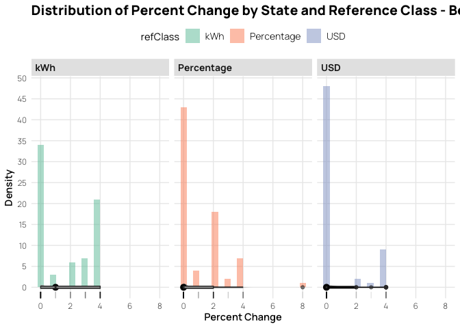

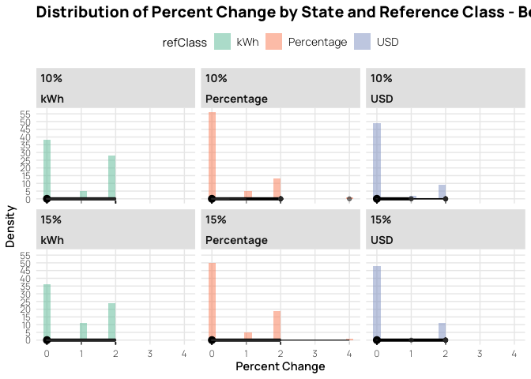

## Inspect response distribution for outliers

    Skewness: 1.2 

    Kurtosis: 3 

        Shapiro-Wilk normality test

    data:  s2_agg$pct_change[1:5000]
    W = 0.8, p-value <0.0000000000000002

## Before and after excluding outliers

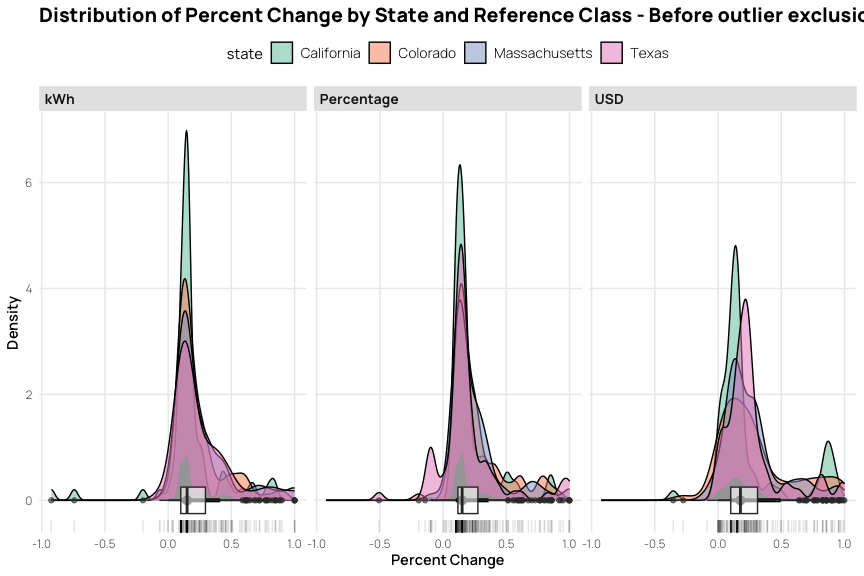

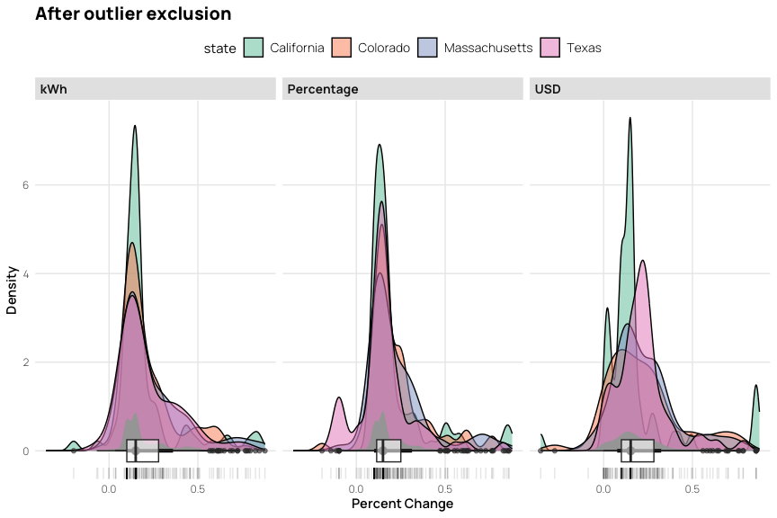

## Individual Participant responses

- Facets indicate the Reference class (%, kWh, USD) and the goal %
  reduction (10%, 15%)
- dashed lines also indicate goal percentage - dots on the line indicate
  participants who met the goal

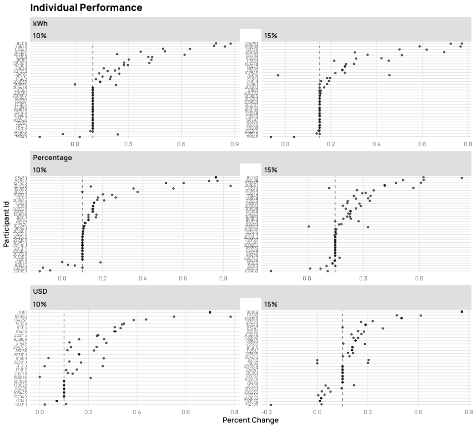

## Interactive data table

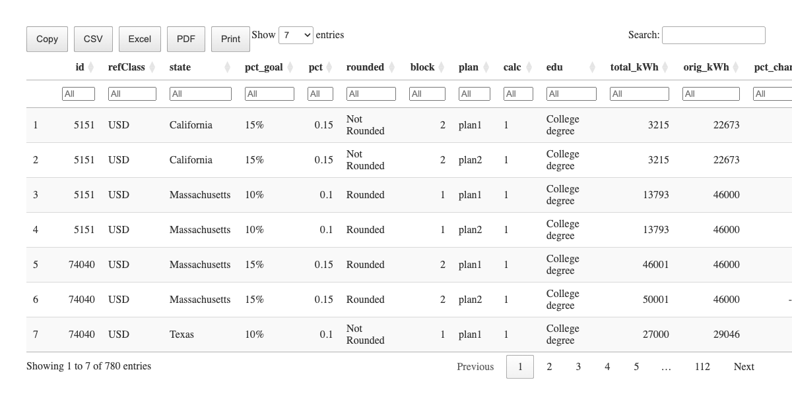

## Looking at % of subjects who hit the target reduction

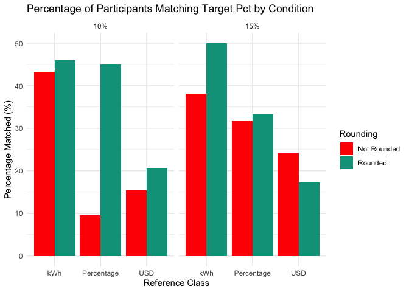

<table class="gt_table" style="width:100%;"
data-quarto-postprocess="true" data-quarto-disable-processing="false"
data-quarto-bootstrap="false">
<colgroup>
<col style="width: 16%" />
<col style="width: 16%" />
<col style="width: 16%" />
<col style="width: 16%" />
<col style="width: 16%" />
<col style="width: 16%" />
</colgroup>
<thead>
<tr class="gt_heading">
<th colspan="6"
class="gt_heading gt_title gt_font_normal"><strong>Percentage of
Participants Matching Target Pct by Condition</strong></th>
</tr>
<tr class="gt_heading">
<th colspan="6"
class="gt_heading gt_subtitle gt_font_normal gt_bottom_border">Grouped
by Reference Class, Rounding, and Pct Goal</th>
</tr>
<tr class="gt_col_headings gt_spanner_row">
<th rowspan="2" id="refClass"
class="gt_col_heading gt_columns_bottom_border gt_center"
data-quarto-table-cell-role="th" scope="col">Reference Class</th>
<th rowspan="2" id="rounded"
class="gt_col_heading gt_columns_bottom_border gt_center"
data-quarto-table-cell-role="th" scope="col">Rounding</th>
<th rowspan="2" id="pct_goal"
class="gt_col_heading gt_columns_bottom_border gt_center"
data-quarto-table-cell-role="th" scope="col">Pct Goal</th>
<th colspan="3" id="Participants"
class="gt_center gt_columns_top_border gt_column_spanner_outer"
data-quarto-table-cell-role="th" scope="colgroup">

Participants

</th>
</tr>
<tr class="gt_col_headings">
<th id="matched_count"
class="gt_col_heading gt_columns_bottom_border gt_center"
data-quarto-table-cell-role="th" scope="col">Matched Count</th>
<th id="total_count"
class="gt_col_heading gt_columns_bottom_border gt_center"
data-quarto-table-cell-role="th" scope="col">Total Count</th>
<th id="pct_matched"
class="gt_col_heading gt_columns_bottom_border gt_center"
data-quarto-table-cell-role="th" scope="col">Percentage Matched (%)</th>
</tr>
</thead>
<tbody class="gt_table_body">
<tr>
<td class="gt_row gt_center" headers="refClass">Percentage</td>
<td class="gt_row gt_center" headers="rounded">Not Rounded</td>
<td class="gt_row gt_center" headers="pct_goal">10%</td>
<td class="gt_row gt_center" headers="matched_count">8</td>
<td class="gt_row gt_center" headers="total_count">84</td>
<td class="gt_row gt_center" headers="pct_matched">9.52</td>
</tr>
<tr>
<td class="gt_row gt_center" headers="refClass">Percentage</td>
<td class="gt_row gt_center" headers="rounded">Not Rounded</td>
<td class="gt_row gt_center" headers="pct_goal">15%</td>
<td class="gt_row gt_center" headers="matched_count">19</td>
<td class="gt_row gt_center" headers="total_count">60</td>
<td class="gt_row gt_center" headers="pct_matched">31.67</td>
</tr>
<tr>
<td class="gt_row gt_center" headers="refClass">Percentage</td>
<td class="gt_row gt_center" headers="rounded">Rounded</td>
<td class="gt_row gt_center" headers="pct_goal">10%</td>
<td class="gt_row gt_center" headers="matched_count">27</td>
<td class="gt_row gt_center" headers="total_count">60</td>
<td class="gt_row gt_center" headers="pct_matched">45.00</td>
</tr>
<tr>
<td class="gt_row gt_center" headers="refClass">Percentage</td>
<td class="gt_row gt_center" headers="rounded">Rounded</td>
<td class="gt_row gt_center" headers="pct_goal">15%</td>
<td class="gt_row gt_center" headers="matched_count">28</td>
<td class="gt_row gt_center" headers="total_count">84</td>
<td class="gt_row gt_center" headers="pct_matched">33.33</td>
</tr>
<tr>
<td class="gt_row gt_center" headers="refClass">USD</td>
<td class="gt_row gt_center" headers="rounded">Not Rounded</td>
<td class="gt_row gt_center" headers="pct_goal">10%</td>
<td class="gt_row gt_center" headers="matched_count">8</td>
<td class="gt_row gt_center" headers="total_count">52</td>
<td class="gt_row gt_center" headers="pct_matched">15.38</td>
</tr>
<tr>
<td class="gt_row gt_center" headers="refClass">USD</td>
<td class="gt_row gt_center" headers="rounded">Not Rounded</td>
<td class="gt_row gt_center" headers="pct_goal">15%</td>
<td class="gt_row gt_center" headers="matched_count">14</td>
<td class="gt_row gt_center" headers="total_count">58</td>
<td class="gt_row gt_center" headers="pct_matched">24.14</td>
</tr>
<tr>
<td class="gt_row gt_center" headers="refClass">USD</td>
<td class="gt_row gt_center" headers="rounded">Rounded</td>
<td class="gt_row gt_center" headers="pct_goal">10%</td>
<td class="gt_row gt_center" headers="matched_count">12</td>
<td class="gt_row gt_center" headers="total_count">58</td>
<td class="gt_row gt_center" headers="pct_matched">20.69</td>
</tr>
<tr>
<td class="gt_row gt_center" headers="refClass">USD</td>
<td class="gt_row gt_center" headers="rounded">Rounded</td>
<td class="gt_row gt_center" headers="pct_goal">15%</td>
<td class="gt_row gt_center" headers="matched_count">9</td>
<td class="gt_row gt_center" headers="total_count">52</td>
<td class="gt_row gt_center" headers="pct_matched">17.31</td>
</tr>
<tr>
<td class="gt_row gt_center" headers="refClass">kWh</td>
<td class="gt_row gt_center" headers="rounded">Not Rounded</td>
<td class="gt_row gt_center" headers="pct_goal">10%</td>
<td class="gt_row gt_center" headers="matched_count">26</td>
<td class="gt_row gt_center" headers="total_count">60</td>
<td class="gt_row gt_center" headers="pct_matched">43.33</td>
</tr>
<tr>
<td class="gt_row gt_center" headers="refClass">kWh</td>
<td class="gt_row gt_center" headers="rounded">Not Rounded</td>
<td class="gt_row gt_center" headers="pct_goal">15%</td>
<td class="gt_row gt_center" headers="matched_count">29</td>
<td class="gt_row gt_center" headers="total_count">76</td>
<td class="gt_row gt_center" headers="pct_matched">38.16</td>
</tr>
<tr>
<td class="gt_row gt_center" headers="refClass">kWh</td>
<td class="gt_row gt_center" headers="rounded">Rounded</td>
<td class="gt_row gt_center" headers="pct_goal">10%</td>
<td class="gt_row gt_center" headers="matched_count">35</td>
<td class="gt_row gt_center" headers="total_count">76</td>
<td class="gt_row gt_center" headers="pct_matched">46.05</td>
</tr>
<tr>
<td class="gt_row gt_center" headers="refClass">kWh</td>
<td class="gt_row gt_center" headers="rounded">Rounded</td>
<td class="gt_row gt_center" headers="pct_goal">15%</td>
<td class="gt_row gt_center" headers="matched_count">30</td>
<td class="gt_row gt_center" headers="total_count">60</td>
<td class="gt_row gt_center" headers="pct_matched">50.00</td>
</tr>
</tbody>
</table>

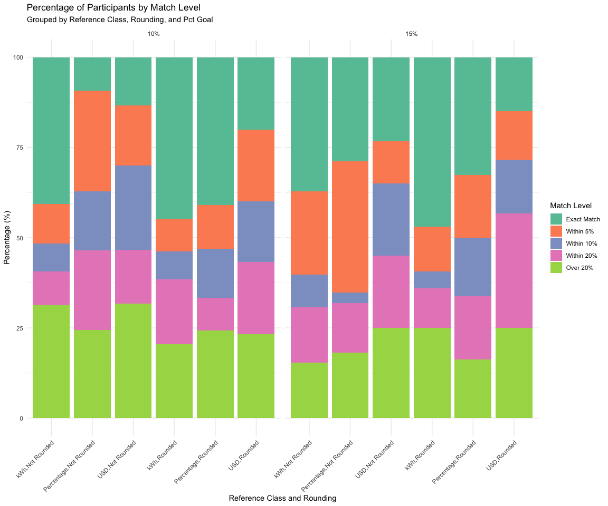

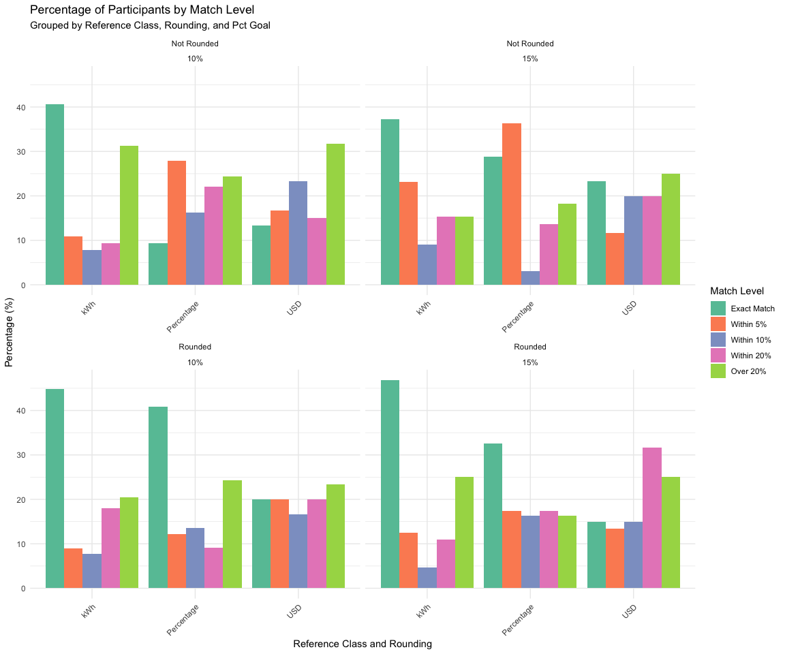

## Cumulative plot

**Click on plots to enlarge**

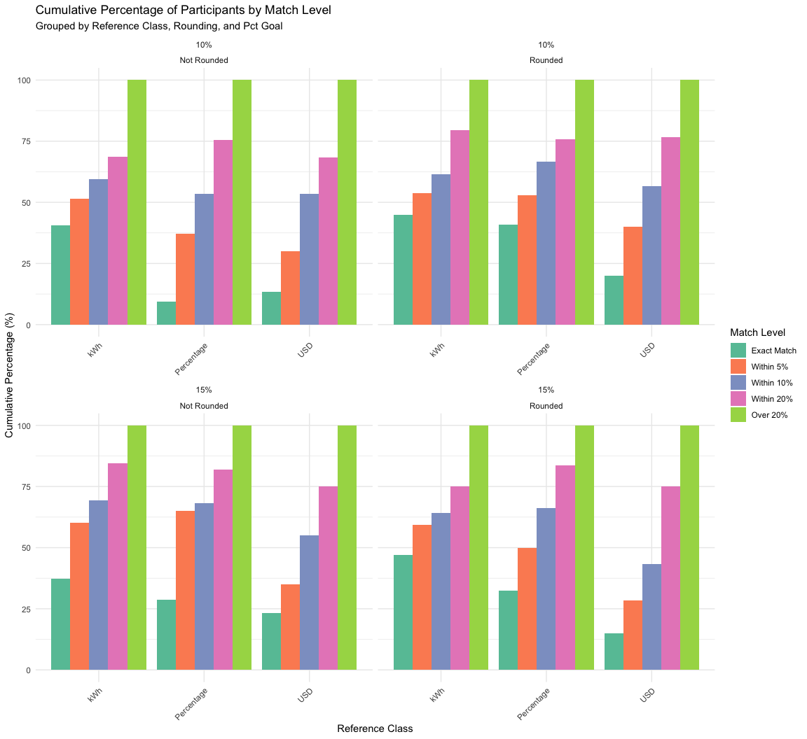

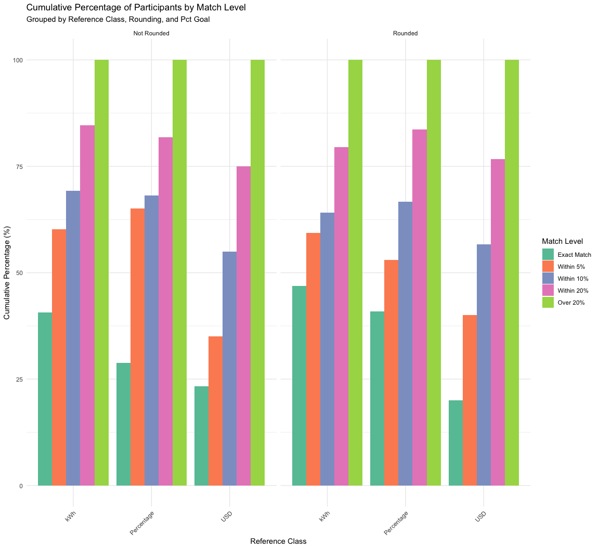

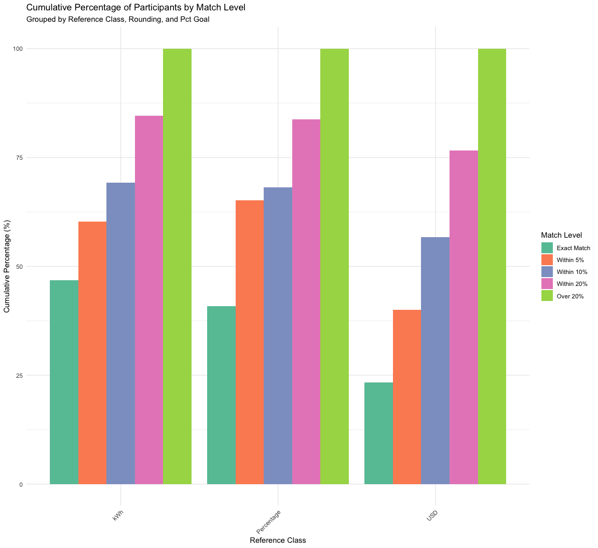

## Main Effects and Interactions

**Click on plots to enlarge**

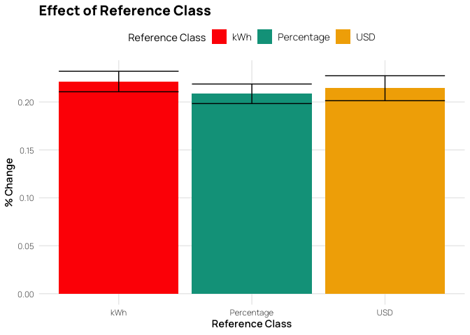

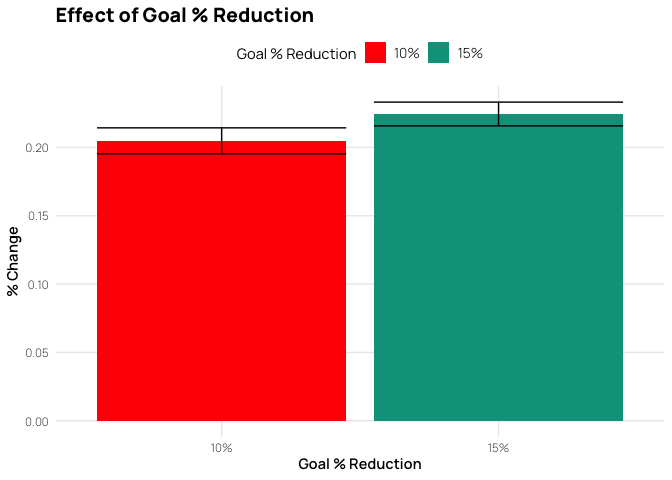

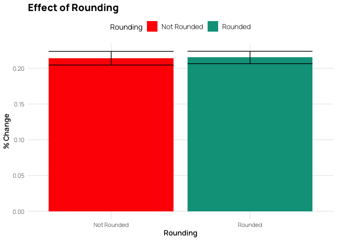

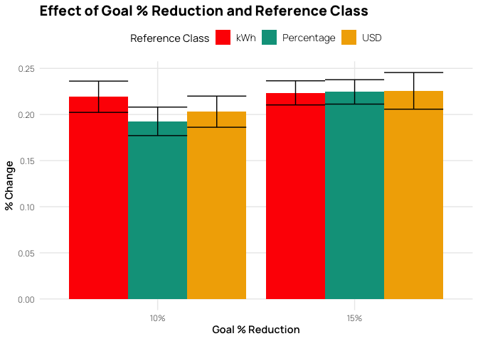

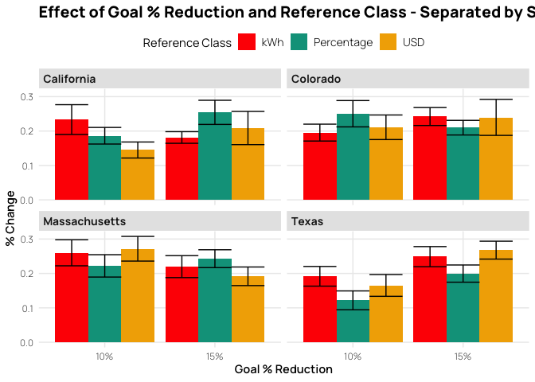

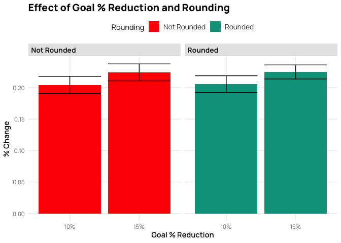

## Calculator and education

| edu                       |   n |
|:--------------------------|----:|
| College degree            | 104 |
| Graduate degree           |  51 |
| Highschool diploma or GED |  11 |
| Some college              |  32 |
| Some graduate school      |   9 |

Count of Items by Education Level

| calc            |   n |
|:----------------|----:|
| No Calculator   |  39 |
| Used Calculator | 168 |

Count of Items by Calculator Use

<table class="gt_table" data-quarto-postprocess="true"
data-quarto-disable-processing="false" data-quarto-bootstrap="false">
<colgroup>
<col style="width: 20%" />
<col style="width: 20%" />
<col style="width: 20%" />
<col style="width: 20%" />
<col style="width: 20%" />
</colgroup>
<thead>
<tr class="gt_heading">
<th colspan="5"
class="gt_heading gt_title gt_font_normal gt_bottom_border"><strong>Count
of Items by Calculator Use, Reference Class, and Rounding</strong></th>
</tr>
<tr class="gt_col_headings gt_spanner_row">
<th rowspan="2" id="refClass"
class="gt_col_heading gt_columns_bottom_border gt_left"
data-quarto-table-cell-role="th" scope="col">refClass</th>
<th colspan="2" id="spanner-No Calculator_Not Rounded"
class="gt_center gt_columns_top_border gt_column_spanner_outer"
data-quarto-table-cell-role="th" scope="colgroup">

No Calculator

</th>
<th colspan="2" id="spanner-Used Calculator_Not Rounded"
class="gt_center gt_columns_top_border gt_column_spanner_outer"
data-quarto-table-cell-role="th" scope="colgroup">

Used Calculator

</th>
</tr>
<tr class="gt_col_headings">
<th id="No-Calculator_Not-Rounded"
class="gt_col_heading gt_columns_bottom_border gt_left"
data-quarto-table-cell-role="th" scope="col">Not Rounded</th>
<th id="No-Calculator_Rounded"
class="gt_col_heading gt_columns_bottom_border gt_left"
data-quarto-table-cell-role="th" scope="col">Rounded</th>
<th id="Used-Calculator_Not-Rounded"
class="gt_col_heading gt_columns_bottom_border gt_left"
data-quarto-table-cell-role="th" scope="col">Not Rounded</th>
<th id="Used-Calculator_Rounded"
class="gt_col_heading gt_columns_bottom_border gt_left"
data-quarto-table-cell-role="th" scope="col">Rounded</th>
</tr>
</thead>
<tbody class="gt_table_body">
<tr>
<td class="gt_row gt_left" headers="refClass">Percentage</td>
<td class="gt_row gt_left" headers="No Calculator_Not Rounded">7</td>
<td class="gt_row gt_left" headers="No Calculator_Rounded">5</td>
<td class="gt_row gt_left" headers="Used Calculator_Not Rounded">34</td>
<td class="gt_row gt_left" headers="Used Calculator_Rounded">30</td>
</tr>
<tr>
<td class="gt_row gt_left" headers="refClass">USD</td>
<td class="gt_row gt_left" headers="No Calculator_Not Rounded">6</td>
<td class="gt_row gt_left" headers="No Calculator_Rounded">7</td>
<td class="gt_row gt_left" headers="Used Calculator_Not Rounded">27</td>
<td class="gt_row gt_left" headers="Used Calculator_Rounded">20</td>
</tr>
<tr>
<td class="gt_row gt_left" headers="refClass">kWh</td>
<td class="gt_row gt_left" headers="No Calculator_Not Rounded">7</td>
<td class="gt_row gt_left" headers="No Calculator_Rounded">7</td>
<td class="gt_row gt_left" headers="Used Calculator_Not Rounded">24</td>
<td class="gt_row gt_left" headers="Used Calculator_Rounded">33</td>
</tr>
</tbody>
</table>

| <strong>Count of Items by Education Level and Reference Class</strong> |  |  |  |
|----|----|----|----|
|  | Percentage | USD | kWh |
| College degree | 39 | 30 | 35 |
| Graduate degree | 21 | 15 | 15 |
| Highschool diploma or GED | 6 | 1 | 4 |
| Some college | 9 | 8 | 15 |
| Some graduate school | 1 | 6 | 2 |

| <strong>Count of Items by Calculator Use and Education Level</strong> |  |  |  |  |  |
|----|----|----|----|----|----|
|  | College degree | Graduate degree | Highschool diploma or GED | Some college | Some graduate school |
| No Calculator | 21 | 11 | 1 | 4 | 2 |
| Used Calculator | 83 | 40 | 10 | 28 | 7 |

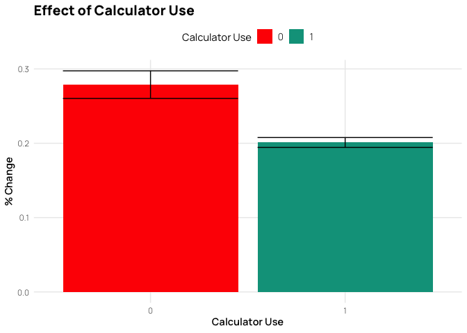

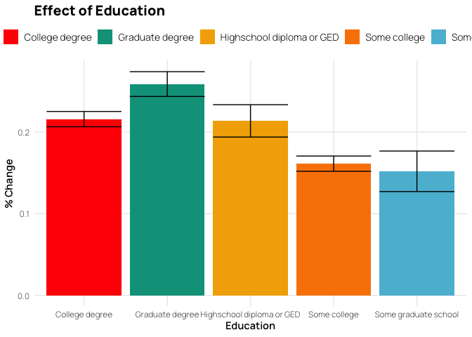

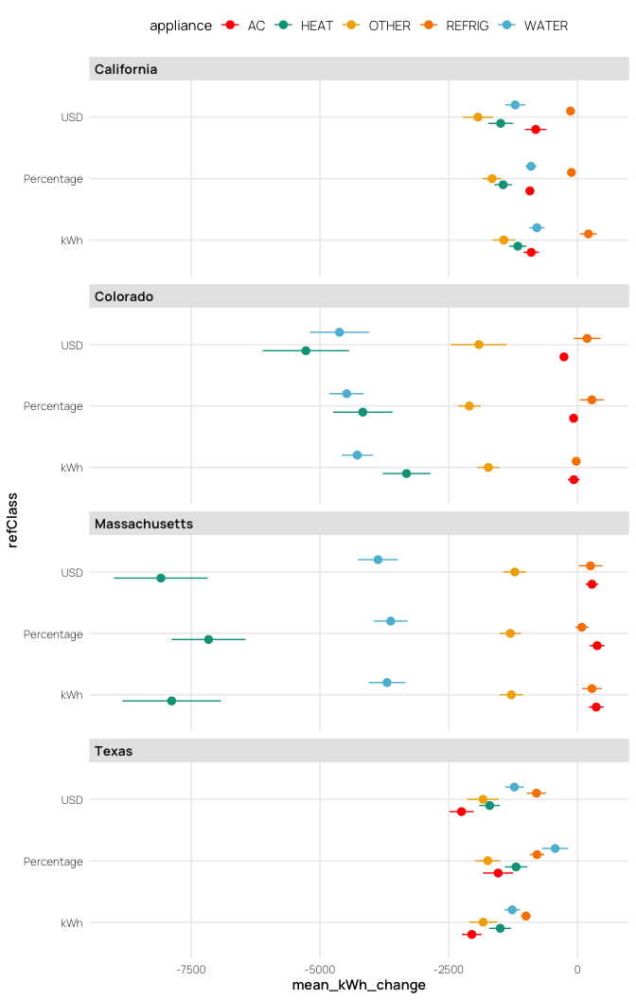

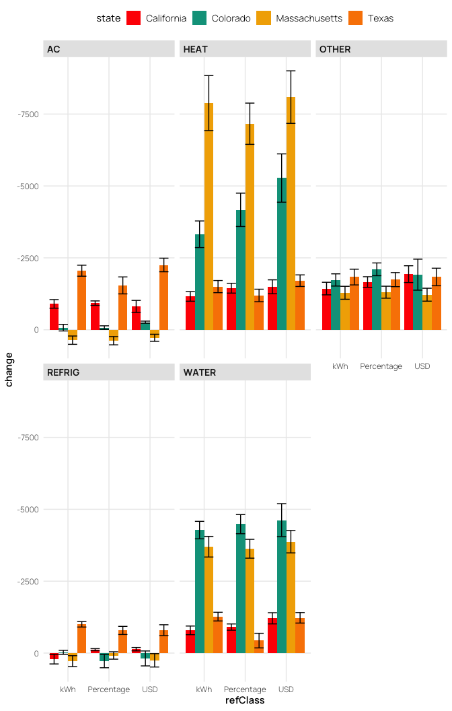
