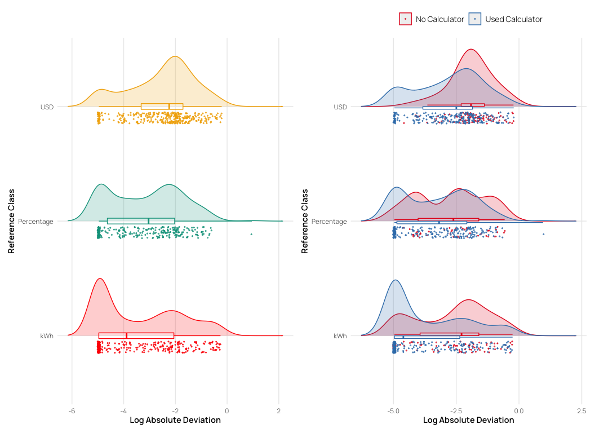
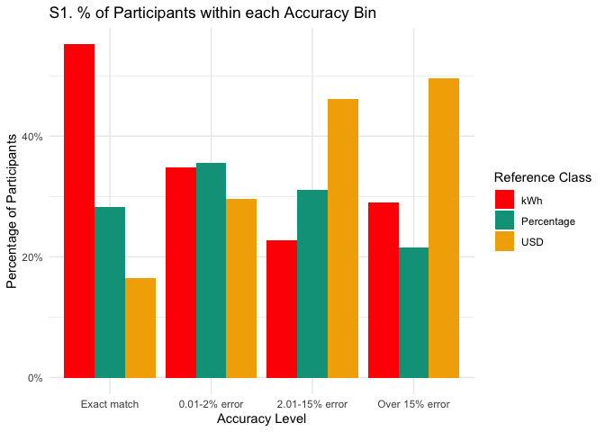
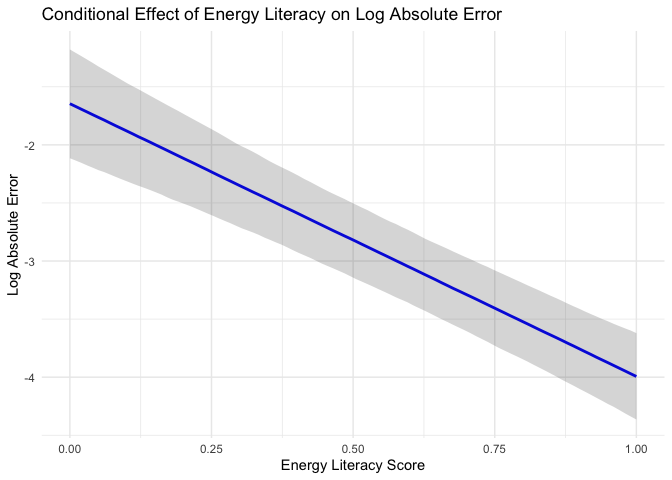
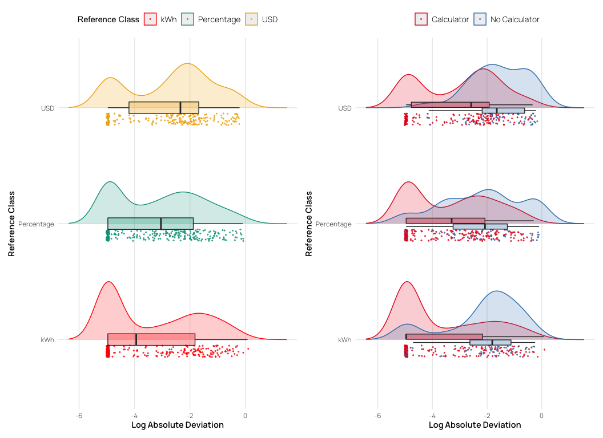
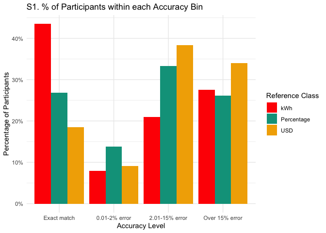
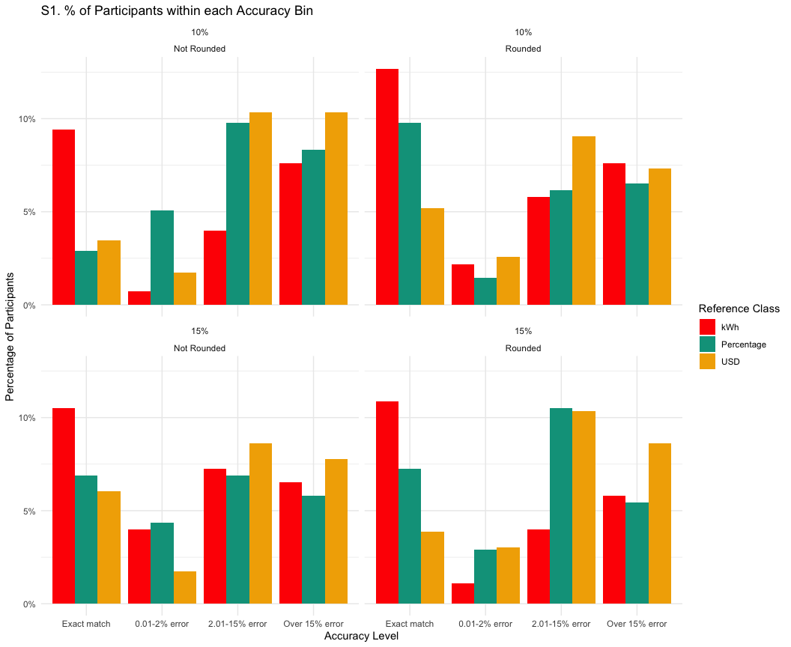
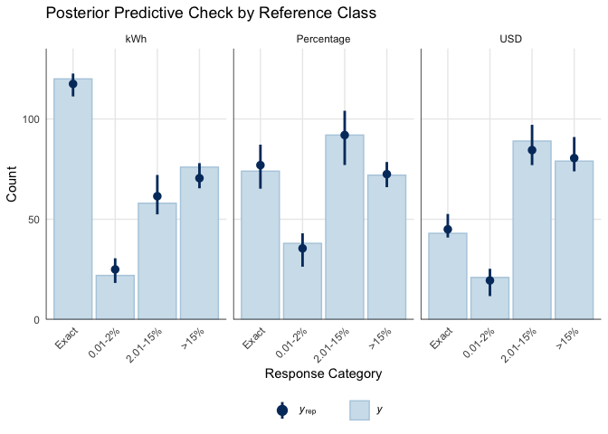
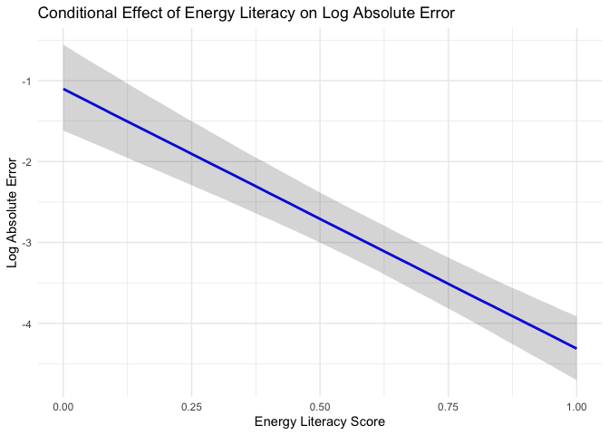
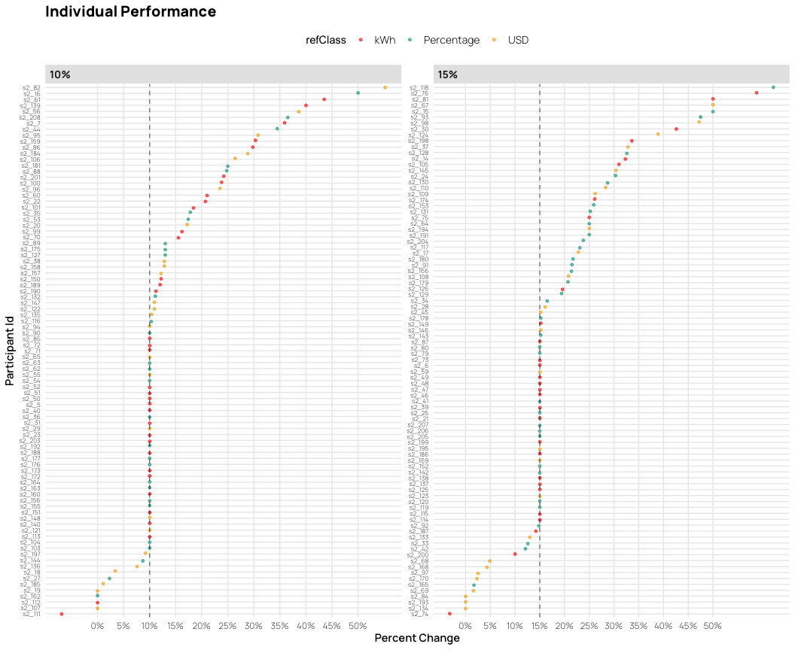
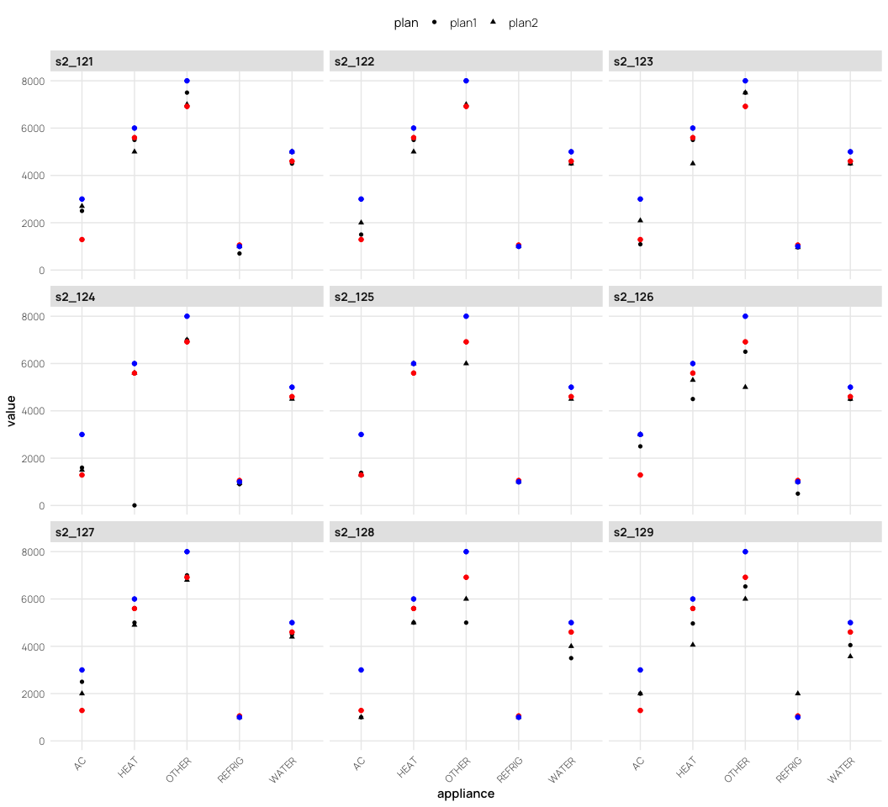

# Planning to Save Energy: How Information Format Affects Accuracy
Thomas E. Gorman, Torsten Reimer, Juan Pablo Loaiza Ramirez, Hayden
Barber
2024-12-07

# Introduction

- highlight the significant contribution of residential energy
  consumption to carbon emissions and the potential for substantial
  reductions. Make point about urgency of climate change? (IPCC (2014)
  and EIA (2012) ).

- Electricity bills are a primary source of energy-use information for
  consumers and offer a promising avenue for enhancing communication
  about energy consumption (Fischer, 2008)

### Literature Review

Energy poverty continues to be a pervasive issue in the United States
Memmott et al. (2021). This challenge partly arises from difficulties in
converting information across numerical formats, impeding the
development of precise energy reduction plans Reimer et al. (2015).
Prior research by Canfield et al. (2017) demonstrated that presenting
energy information in tabular formats enhances comprehension relative to
graphs.

The way numerical information is presented can significantly affect how
individuals process and use that information (Reimer et al., 2015) . The
reference class problem highlights that numbers without clear reference
points can lead to misinterpretation, as the meaning of a statistic
depends on the category or class it refers to (Gigerenzer & Edwards,
2003; Reimer et al., 2015). Presenting energy information in absolute
units (e.g., kWh) provides a clear reference class, potentially
enhancing comprehension.

The concept of cognitive fit posits that performance improves when the
information presentation format aligns with the task requirements
(Vessey, 1991), and that such an alignment can reduce cognitive load and
enhance accuracy in planning (Shah & Freedman, 2011). For instance,
tables are generally more effective than graphs for conveying specific
electricity usage data because they facilitate straightforward point
reading (Canfield et al., 2017). However, the effectiveness of the
format varies with the type of information and individual differences,
such as energy literacy, which significantly impacts comprehension and
conservation intent. Moreover, the unit in which numerical information
is presented influences how decision-makers evaluate and choose between
options, with default units increasing value sensitivity (Herberz et
al., 2020). In the context of energy, presenting information in terms of
multiple translations can increase preference for options aligned with
activated objectives, such as pro-environmental values (Ungemach et al.,
2018). Furthermore, mental accounting mechanisms, where individuals
create mental budgets linking specific consumption acts to specific
payments, significantly impact energy decisions and behaviors (Hahnel et
al., 2020).

Evidence from research on energy consumption feedback, normative
comparisons, and eco-feedback platforms suggests that comprehensible and
contextually meaningful data presentations can improve users’ ability to
plan reductions, especially when these formats are integrated into daily
routines (Canfield et al., 2017; Fischer, 2008; Kim et al., 2022;
Schwartz et al., 2015). Furthermore, temporal and monetary frames have
been shown to alter decision quality, with monthly costs or absolute
consumption levels often encouraging more energy-efficient intentions
than abstract annual or percentage-based metrics (Gill et al., 2022;
Larrick & Soll, 2008). In this context, tailoring reference classes to
align with intuitive cognitive processes can help bridge the gap between
aggregate reduction goals and targeted, appliance-specific conservation
strategies.

Furthermore, research suggests that natural frequencies and absolute
numbers are generally easier for individuals to understand compared to
percentages or probabilities Hoffrage et al. (2000). In the context of
energy conservation, using absolute units may facilitate more accurate
planning and decision-making by aligning with intuitive cognitive
processing.

Despite existing studies on energy-use communication and format effects,
limited research has explored how different numerical representations
influence consumers’ ability to create accurate energy conservation
plans. Specifically, there is a gap in understanding how presenting
energy information in absolute units versus percentages or monetary
terms affects the precision of planning appliance-specific reductions.
Addressing this gap is crucial for developing effective interventions
that promote energy conservation behaviors.

### Hypotheses

Building on these findings and informed by prior work showing that
frequencies (like absolute units in kWh) are easier to comprehend and
facilitate more precise decision-making compared to percentages, our
study also utilizes a tabular format, but manipulates whether
participants must consider energy information presented as absolute
units (kWh), percentages (%), or monetary costs (USD). We hypothesize
that presenting information in absolute units (kWh) will lead to more
accurate household energy conservation planning.

# Experiment 1

See <a href="#fig-task" class="quarto-xref">Figure 1</a> for an example
of a planning trial as it was seen by participants.

## Methods

### Participants

We implemented our task and surveys on Qualtrics, and recruited
participants through Amazon Mechanical Turk. In Experiment 1, 252
participants were initially recruited, but data from 17 participants
were corrupted due to experimenter error, leaving a final sample of 235
participants. Most participants (76%) reported using a calculator to
complete the task.

### Materials and Design

The study employed a mixed design with reference class (kWh, percentage,
USD) as a between-subjects factor and state/family scenario as a
within-subjects factor. Each participant completed energy reduction
planning tasks for two different states, with state order
counterbalanced across participants. The family scenarios featured four
households in different climate regions: Texas (Smith family) and
California (Adams family) representing warm climates, and Colorado
(Wells family) and Massachusetts (Davis family) representing cold
climates. We obtain average utility use from each state by CITE SOURCE
FOR STATE AVGS?

### Procedure

Participants received energy usage data for two hypothetical families
and were tasked with creating action plans to meet specified reduction
goals by allocating usage across five appliance categories: heating,
cooling, water heating, refrigerator, and and other appliances (e.g.,
TV, lighting).

For each family scenario, the participants were shown a table containing
the families utility usage from the prior year, alongside the state
averages for each appliance category (both prior year usage and stage
averages are always shown in kWh). For each scenario, participants were
asked to create two possible action plans to achieve the target
reduction in total household energy usage (see
<a href="#fig-task" class="quarto-xref">Figure 1</a>). Depending on
their reference class condition, the target reduction amount presented
either in kilowatt-hours (kWh), as percentages of total household usage,
or in U.S. dollars. In all conditions, the target reduction was
equivalent to a 15% reduction in total household kWh.

<div id="fig-task">


Figure 1: Example trial in the energy planning task. Participants are
shown the prior year electricity use of a household, and are tasked with
creating a plan for the next year that will meet the energy reduction
goal. Study 1 manipulates the format of the reduction goal to be either
a percentage (15% given as goal reduction), kilowatt hours (5965 kWh
given), or USD (\$656)

</div>

Additional data collected included:

- **Energy Literacy Quiz**: An 8-item questionnaire assessing
  participants’ knowledge of energy consumption and conversion (DeWaters
  & Powers, 2011).
- **Calculator Usage Tracking**: Questions determined whether
  participants used a calculator, paper/pen, or other methods to
  complete the tasks.
- **Demographic Survey**: Collected information on gender, age, income,
  education, employment status, and state of residence.
- **Environmental Attitudes Survey**: Assessed participants’
  pro-environmental attitudes and perceived importance of energy
  conservation.

## Results

### Data Analysis

All preprocessing and analyses were carried out in R (Team, 2020) and
the tidyverse package (Wickham et al., 2019). Mixed Bayesian regressions
were fit using the brms package (Bürkner, 2017), with participants and
family scenario (states) set as random effects.

``` r
pacman::p_load(dplyr,purrr,tidyr,stringr,here,tibble,brms,rstan,bayestestR,emmeans,tidybayes,modelsummary,
    ggplot2,gt,knitr,kableExtra,ggh4x,patchwork, ggridges,ggstance,lme4,flextable,pander)

options(digits=2, scipen=999, dplyr.summarise.inform=FALSE)

walk(c("fun_plot"), ~ source(here::here(paste0("scripts/", .x, ".R"))))

theme_set(theme_nice())

s1 <- readRDS(here::here("data/s1_processed.rds")) |> 
  filter(!(id %in% readRDS(here::here("data/s1_discrep_ids.rds")))) |> 
  filter(!(id %in% readRDS(here::here("data/s1_grp_outlier_ids.rds")))) |>
  mutate(refClass = factor(refClass, levels=c("kWh","Percentage","USD")))

s2_long <- readRDS(here::here("data/s2_processed.rds")) |> 
  filter(!(id %in% readRDS(here::here("data/s2_discrep_ids.rds")))) |> 
  filter(!(id %in% readRDS(here::here("data/s2_grp_outlier_ids.rds"))) ) |>
  mutate(refClass = factor(refClass, levels=c("kWh","Percentage","USD")))
```

``` r
s1_agg <- s1 |> 
    filter(appliance !="Total kWh") |> 
    group_by(id,refClass,state,block,plan,edu,pct_goal,calc) |> 
    summarise(total_kWh = sum(value),orig_kWh=sum(family), 
                pct_change = abs(round((orig_kWh-total_kWh)/orig_kWh,3)), 
                n_change = sum(value!=family),
                state_p_dif=mean(state_p_dif),
                state_f_dif=mean(state_f_dif),
                n_less_avg = sum(less_avg),
                duration=first(Duration__in_seconds_)) |> 
    mutate(matched_goal = (pct_change == pct_goal), 
                error = pct_change - pct_goal,
                abs_error = abs(error),
                log_abs_error=log(abs(error)+.007), 
                close_match = abs_error <= 0.02) |>
    ungroup() |> # Add ungroup here
        mutate(
            accuracy_level = factor(
                case_when(
                    abs_error == 0.00 ~ "Exact match",
                    abs_error <= 0.02 ~ "0.01-2% error",
                    abs_error <= 0.15 ~ "2.01-15% error",
                    TRUE ~ "Over 15% error"  # Capture all remaining cases
                ), 
                levels = c("Exact match", "0.01-2% error", "2.01-15% error", "Over 15% error"),
                ordered = TRUE
            )
        ) |> relocate(accuracy_level, .after= "pct_change")


s1_agg4 <- s1_agg |> group_by(id,refClass,calc) |> 
    mutate(n_accuracy = n_distinct(accuracy_level)) |> 
    summarise(
    mg=sum(matched_goal),
    mgc=sum(close_match),
    n=n(), 
    pct=mg/n,
    pct_close=mgc/n,
    mean_pct_change=mean(pct_change),
    mean_abs_error=mean(abs_error),
    mean_log_abs_error=mean(log_abs_error),
    n_accuracy=first(n_accuracy)) |> 
    mutate(accuracy_level = factor(
            case_when(
                mean_abs_error < 0.02 ~ "Exact match",
                mean_abs_error <= 0.02 ~ "0.01-2% error",
                mean_abs_error <= 0.15 ~ "2.01-15% error",
                TRUE ~ "Over 15% error"  # Capture all remaining cases
            ), 
            levels = c("Exact match", "0.01-2% error", "2.01-15% error", "Over 15% error"),
            ordered = TRUE
        ))
```

``` r
##| label: tbl-s1-agg
##| tbl-cap: "Study 1: Summary of planning accuracy by reference class. The table shows performance as both the % of trials where participants matched the goal, and the mean absolute error from the target reduction goal."

# overall pct of subjects who matched their goal
s1_agg4 |> group_by('Reference Class' = refClass) |>
    summarise(
    'Avg. % Change' = mean(mean_pct_change),
    '% meeting goal (exact)' = mean(pct),
    '% meeting goal (close match)' = mean(pct_close),
    'Abs. Deviation' = median(mean_abs_error),
    'Log Abs. Deviation' = (median(mean_log_abs_error)),
    # sd = sd(pct),
    # n = n(),
    #se=sd(pct)/sqrt(n)
) |>   mutate(across(where(is.numeric), \(x) round(x, 3))) %>% 
  kable(escape=FALSE,booktabs=TRUE,align=c("l")) 

#pander::pandoc.table(caption="Study 1: Proportion of participants who matched their goal overall")
```

<div id="tbl-s1-agg">

Table 1: Study 1: Summary of planning accuracy by reference class. The
table shows performance as both the % of trials where participants
matched the goal, and the mean absolute error from the target reduction
goal

| Reference Class | Avg. % Change | % meeting goal (exact) | % meeting goal (close match) | Abs. Deviation | Log Abs. Deviation |
|:---|:---|:---|:---|:---|:---|
| kWh | 0.22 | 0.38 | 0.54 | 0.03 | -3.7 |
| Percentage | 0.21 | 0.22 | 0.40 | 0.06 | -3.1 |
| USD | 0.23 | 0.10 | 0.22 | 0.10 | -2.4 |

</div>

<a href="#tbl-s1-agg" class="quarto-xref">Table 1</a> that participants
in the kWh condition met the target goal 38% of the time, compared to
22% for the Percentage condition and 10% for the USD condition.
Moreover, the kWh reference class exhibited smaller deviations from the
target reduction, suggesting that participants performed more accurately
when the goal was framed in kWh rather than percentages or USD.

As shown in <a href="#tbl-s1-agg" class="quarto-xref">Table 1</a>,
participants in the kWh condition exactly met the target reduction goal
38% of the time, significantly outperforming those in the Percentage
(22%) and USD (10%) conditions. Furthermore, the kWh reference class
exhibited notably smaller mean absolute deviations (0.03) compared to
Percentage (0.06) and USD (0.10), suggesting that presenting the
reduction goal in absolute units facilitated more precise allocations.

``` r
s1_ld <- ggplot(s1_agg, aes(y = refClass, x = log_abs_error, color = refClass)) +
  geom_density_ridges(aes(fill = refClass), alpha = 0.2, scale = 0.5,
                      jittered_points = TRUE, point_alpha = 0.7,point_size=.4,
                      position = position_raincloud(width = 0.05, height = 0.1,
                                                    ygap = 0.05)) +
  geom_boxploth(width = 0.05, alpha = 0.2, outlier.shape = NA, show.legend = FALSE) +
  #scale_y_discrete(expand = expansion(mult = c(0.2, 0.4))) +
 # guides(fill = "none", color = guide_legend(reverse = TRUE)) +
  guides(fill = "none", color = "none") +
  labs(x = "Log Absolute Deviation", y = "Reference Class", color = "Reference Class") +
  theme(legend.position = "top")


s1_ldc <- ggplot(s1_agg, aes(y = refClass, x = log_abs_error, color = calc)) +
  geom_density_ridges(aes(fill = calc), alpha = 0.2, scale = 0.5,
                      jittered_points = TRUE, point_alpha = 0.7, point_size = .4,
                      position = position_raincloud(width = 0.05, height = 0.1,
                                                    ygap = 0.05)) +
  geom_boxploth(width = 0.05, alpha = 0.2, outlier.shape = NA, show.legend = FALSE) +
  scale_color_brewer(palette = "Set1") +
  scale_fill_brewer(palette = "Set1") +
  guides(fill = "none") +
  labs(x = "Log Absolute Deviation", y = "Reference Class", color = "") +
  theme(legend.position = "top")

s1_ld | s1_ldc
```

<div id="fig-s1-log-dist">



Figure 2: Study 1: Distribution of log absolute error by reference
class.

</div>

``` r
# compute percentage of subjects per accuracy level per group
observed_props_s1 <- s1_agg |>
  group_by(refClass, accuracy_level) |>
  summarise(n = n()) |>
  group_by(refClass) |>
  mutate(prop = n/sum(n)) |>
  mutate(n_prop=paste0(n," (",round(prop*100,1),"%)" ), pct_grp=paste0(round(prop*100,1), "%")) |> ungroup()

observed_props_s1 |> 
  mutate(n_total=sum(n)/4) |> 
  group_by(accuracy_level) |>
  mutate(ns=sum(n)/4) |> 
  mutate(Total = paste0(round(ns/n_total*100,1), "%")) |>
  select('Reference Class'=refClass, 'Accuracy Level'=accuracy_level, '% in Group'=pct_grp, "Combined Groups %" =Total) |>
  pivot_wider(
    names_from = 'Reference Class',
    values_from = c('% in Group')
  ) |> relocate("Combined Groups %" , .after=last_col()) |> 
  kable(escape=FALSE,booktabs=TRUE,align=c("l")) 
```

<div id="tbl-s1-prop">

Table 2: Study 1: The table shows the percentage of participants who
fell into each accuracy level for each reference class condition
(percentages of kWh, \$, and USD columns reflect within condition
percentages). The combined group column reflects the percentage of
participants in each accuracy level when aggregating across across all
reference class conditions.

<div class="cell-output-display">

| Accuracy Level | kWh   | Percentage | USD   | Combined Groups % |
|:---------------|:------|:-----------|:------|:------------------|
| Exact match    | 37.5% | 22.1%      | 9.8%  | 22.6%             |
| 0.01-2% error  | 15.1% | 17.6%      | 11.2% | 14.4%             |
| 2.01-15% error | 27.6% | 43.4%      | 49.2% | 40.3%             |
| Over 15% error | 19.9% | 16.9%      | 29.8% | 22.8%             |

</div>

</div>

``` r
prop_acc_s1 <- s1_agg %>%
    group_by(refClass, accuracy_level) %>%
    summarise(count = n()) %>%
    group_by(accuracy_level) |>
    mutate(Probability = count / sum(count)) %>%
    ungroup()


ggplot(prop_acc_s1, aes(x = accuracy_level, y = Probability, fill = refClass)) +
    geom_bar(stat = "identity", position = position_dodge()) +
  scale_y_continuous(labels = scales::percent) +
    labs(title = "S1. % of Participants within each Accuracy Bin",
        x = "Accuracy Level",
        y = "Percentage of Participants",
        fill = "Reference Class") +
    theme_minimal() 
```

<div id="fig-s1-plot">



Figure 3: Study 1: Proportion of participants in each accuracy level,
colored by reference class. A larger % of participants in the Exact
Match, or 0.01-2% error bins indicates better performance.

</div>

We next categorized responses into four accuracy levels (exact match
\[0% error\], minor deviations \[0.01–2%\], moderate deviations
\[2.01–15%\], and major deviations \[\>15%\]) for our primary
statistical modeling. Using Bayesian ordinal regression, we modeled the
ordered accuracy outcome as a function of the reference class condition,
while controlling for random variation across participants and family
scenarios:

$$
\text{Accuracy Level} \sim \text{Reference Class} + \text{Calculator} + (1|\text{id}) + (1|\text{Family Scenario})
$$

This approach allowed us to estimate thresholds (intercepts) and
regression coefficients that capture how different reference classes
affect the likelihood of achieving higher accuracy categories. For each
comparison, we provide posterior odds ratios (OR) and their 95% CIs.
This approach allows the estimation of threshold parameters and
regression coefficients that characterize how changes in predictor
variables (such as the reference class: kWh, percentage, or USD) relate
to probabilities of being in each accuracy category.

``` r
##| label: tbl-s1-ord
##| tbl-cap: "Study 1: Ordinal Regression Model Results."


ordinal_model_s1 <- brm(
    accuracy_level ~ refClass +calc + (1|id) + (1|state),
    data = s1_agg_filtered,
    family = cumulative("logit"),
    cores = 4,
    iter = 2000,
    control = list(adapt_delta = 0.97), 
    prior = c(prior(normal(0, 3), class = "Intercept"), 
                prior(normal(0, 3), class = "b")), 
    file = paste0(here::here("data/model_cache",'s1_ordinal_grpclean_calc_2.5.rds')) 
)

# as.data.frame(describe_posterior(ordinal_model_s1, centrality = "Mean"))[, c(1,2,4,5,6)] |> 
#   setNames(c("Parameter", "Estimate", "CI_Lower", "CI_Upper", "pd")) |> 
#   mutate(Parameter = stringr::str_remove(Parameter, "b_")) |> kable(escape=FALSE,booktabs=TRUE,align=c("l"), row.names = FALSE)

# Get predicted probabilities
# pred_summary <- ordinal_model_s1 |>
#     epred_draws(newdata = data.frame(refClass = c("kWh", "Percentage", "USD")),
#                 ndraws = 1000, re_formula = NA) |>
#     group_by(refClass, Category=.category) |>
#     summarise(
#         mean_prob = mean(.epred),
#         lower_ci = quantile(.epred, 0.025),
#         upper_ci = quantile(.epred, 0.975)
#     )
#pred_summary |> pander::pandoc.table(caption="Study 1: Predicted probabilities of accuracy")

# odds ratios of fixed effects
# as.data.frame(fixef(ordinal_model_s1)[,-2])|> as.data.frame() %>%
#     rownames_to_column(var = "Parameter") %>%
#     mutate(across(where(is.numeric), exp)) |>
#     filter(!stringr::str_detect(Parameter, "Intercept")) |> 
#     filter(!stringr::str_detect(Parameter, "calc")) |> 
#     # rename columns to |comparison           | odds_ratio| ci_lower| ci_upper|
#     rename(Comparison = Parameter, odds_ratio = Estimate, ci_lower = Q2.5, ci_upper = Q97.5) |>
#     # rename levels to Percentage vs kWh; USD vs kWh; 
#     mutate(Comparison = case_when(
#         str_detect(Comparison, "refClassPercentage") ~ "Percentage vs kWh",
#         str_detect(Comparison, "refClassUSD") ~ "USD vs kWh",
#         TRUE ~ Comparison
#     )) |> kable(escape=FALSE,booktabs=TRUE,align=c("l")) 
```

<div id="tbl-s1-reg">

Table 3: **Experiment 1**: Ordinal Regression results. Ordinal
regression results. Positive coefficients for the reference class
predictors indicate that those conditions are associated with higher
error categories relative to the kWh baseline.

| Parameter          | Estimate | CI_Lower | CI_Upper | pd   |
|:-------------------|:---------|:---------|:---------|:-----|
| Intercept\[1\]     | -3.8     | -5.45    | -2.28    | 1.00 |
| Intercept\[2\]     | -1.7     | -3.29    | -0.15    | 0.98 |
| Intercept\[3\]     | 2.8      | 1.27     | 4.40     | 1.00 |
| refClassPercentage | 1.3      | 0.01     | 2.66     | 0.98 |
| refClassUSD        | 2.8      | 1.52     | 4.04     | 1.00 |
| calcUsedCalculator | -2.8     | -4.09    | -1.56    | 1.00 |

</div>

<div id="tbl-s1-ord">

Table 4: **Experiment 1**: Odds ratios for group comparisons. Odds
ratios greater than 1 indicate increased odds of falling into a worse
accuracy category compared to the kWh condition.

| Comparison        | odds_ratio | ci_lower | ci_upper |
|:------------------|:-----------|:---------|:---------|
| Percentage vs kWh | 3.7        | 1.0      | 14       |
| USD vs kWh        | 15.7       | 4.6      | 57       |

</div>

As shown in <a href="#tbl-s1-reg" class="quarto-xref">Table 3</a>, the
reference class coefficients are positive for both the Percentage
(Estimate = 1.3, 95% CI: 0.01 to 2.66, pd = 0.98) and USD (Estimate =
2.8, 95% CI: 1.52 to 4.04, pd = 1.00) conditions, relative to the kWh
baseline. This indicates that, compared to the kWh condition,
participants in both the Percentage and USD conditions were more likely
to produce plans that fell into higher error categories. Moreover, the
odds ratios (see Table 3) suggest that the USD condition led to a
notably higher likelihood of large errors compared to the kWh baseline
(OR = 15.7), while the Percentage condition also demonstrated increased
odds (OR = 3.7) but was somewhat less detrimental to accuracy than USD.
These results align with our descriptive findings and further clarify
that framing the target reductions in absolute kWh units may facilitate
significantly more accurate planning. Posterior predictive checks showed
that the ordinal model provided a reasonable fit to the observed data
(see <a href="#fig-s1-ppd" class="quarto-xref">Figure 4</a>).

``` r
pp_check(ordinal_model_s1, type = "bars_grouped", group="refClass", fatten = 2) +
  scale_x_continuous("Response Category", breaks = 1:4, 
            labels = c("Exact", "0.01-2%", "2.01-15%", ">15%")) +
  scale_y_continuous(expand = expansion(mult = c(0, 0.05))) +
  ggtitle("Posterior Predictive Check by Reference Class") +
  theme_minimal() +
  theme(
    legend.background = element_blank(),
    legend.position = "bottom",
    panel.grid.minor = element_blank(),
    axis.text.x = element_text(angle = 45, hjust = 1)
  )
```

<div id="fig-s1-ppd">


Figure 4: Study 1: Proportion of participants in each accuracy level,
colored by reference class, and seprated in facets based on the levels
of reduction goal. A larger % of participants in the Exact Match, or
0.01-2% error bins indicates better performance.

</div>

``` r
s1_els_log_error <- brm(
    log_abs_error ~ els + (1|id) + (1|state),
    data = s1_agg,
    family = gaussian(),
    cores = 4,
    iter = 2000,
    control = list(adapt_delta = 0.97), 
    prior = c(prior(normal(0, 3), class = "Intercept"), 
                prior(normal(0, 3), class = "b")), 
    file = paste0(here::here("data/model_cache",'s1_els_log_error.rds')) 
)

# summary(s1_els_log_error)
# conditional_effects(s1_els_log_error)


# Create the conditional effects plot
conditional_effects_plot <- conditional_effects(s1_els_log_error)

# Extract the data for plotting
plot_data <- conditional_effects_plot[[1]]

# Create the plot
ggplot(plot_data, aes(x = els, y = estimate__)) +
  geom_line(color = "blue", size = 1) +
  geom_ribbon(aes(ymin = lower__, ymax = upper__), alpha = 0.2) +
  labs(
    x = "Energy Literacy Score",
    y = "Log Absolute Error",
    title = "Conditional Effect of Energy Literacy on Log Absolute Error"
  ) +
  theme_minimal()
```

<div id="fig-s1-els">



Figure 5

</div>

To further investigate individual factors that may influence planning
accuracy, we examined the relationship between participants’ energy
literacy scores and their performance on the task. Energy literacy was
assessed using an 8-item questionnaire adapted from (DeWaters & Powers,
2011), which covers topics such as energy units, appliance energy
consumption, and sources of electricity. A Bayesian linear regression
model was fit with log-transformed absolute error as the outcome
variable and energy literacy score as the predictor, controlling for
random effects of participant and state: log_abs_error ~ els + (1\|id) +
(1\|state). Results indicated a significant negative relationship
between energy literacy and log absolute error (Estimate = -2.35, 95%
CI: -2.88 to -1.81), suggesting that participants with higher energy
literacy scores tended to have smaller deviations from the target
reduction goal, and thus more accurate plans overall
(<a href="#fig-s1-els" class="quarto-xref">Figure 5</a>).

## Experiment 1: Discussion

Experiment 1 examined how different numerical representations of energy
reduction goals influenced participants’ planning accuracy. In line with
our hypothesis that absolute units would yield better accuracy, the kWh
condition supported significantly more precise energy reduction plans
than did either the Percentage or USD conditions. Although the
Percentage format was detrimental to accuracy relative to kWh, it was
the USD condition that consistently produced the poorest outcomes,
suggesting that monetary terms, while intuitive in everyday contexts,
may not serve as effective reference classes for planning
appliance-specific reductions in energy use.

Experiment 2 will extend these findings by examining whether additional
variables, such as the difficulty of the reduction goal or the rounding
of numerical values, further interact with reference class conditions,
thereby providing a more comprehensive understanding of how to optimize
energy information presentation for improved planning accuracy.

# Experiment 2

## Methods

The experimental procedures in study 2 are quite similar to those in
study 1, but we also included a rounding manipulation (rounded vs. not
rounded), and a manipulation of the goal (10% reduction vs. 15%
rediction). We recruited 206 participants from Amazon Mechanical Turk,
but data from from 10 participants were corrupted due to experimenter
error, leaving a final sample of 196 participants.

Note that reference class remains a between-subjects variable, while
percent goal, rounding, and state are within-subjects variables. In
study 2, the new design is a 4 state temperature (2 warm vs. 2 cold
states) X 2 task goal (10% vs. 15%) X 2 last year’s usage for the family
and the state average (exact vs. rounded numbers) within X 3 task
reference class (USD vs. Percentage vs. kWh) between.

## Results

``` r
s2_agg1 <- s2_long |> 
  filter(appliance != "TOTAL") |> 
  group_by(id,refClass,calc, state,pct,pct_goal,plan,rounded) |> 
  summarise(
    total_kWh = sum(value),
    orig_kWh = sum(family),
    pct_change = round((orig_kWh - total_kWh) / orig_kWh, 3),
    state_dif = mean(state_dif),
    .groups = "drop"
  ) |>
  mutate(
    matched_goal = (pct_change == pct),
    close_match = abs(pct_change - pct) <= 0.02,
                error = pct_change - pct,
                abs_error = abs(error),
                log_abs_error=log(abs(error)+.007)) |> 
      ungroup() |> 
        mutate(
            accuracy_level = factor(
                case_when(
                    abs_error == 0.00 ~ "Exact match",
                    abs_error <= 0.02 ~ "0.01-2% error",
                    abs_error <= 0.15 ~ "2.01-15% error",
                    TRUE ~ "Over 15% error"  # Capture all remaining cases
                ), 
                levels = c("Exact match", "0.01-2% error", "2.01-15% error", "Over 15% error"),
                ordered = TRUE
            )
        )

s2_agg4 <- s2_agg1 |> group_by(id,refClass,calc) |> 
    mutate(n_accuracy = n_distinct(accuracy_level)) |> 
    summarise(
    mg=sum(matched_goal),
    mgc=sum(close_match),
    n=n(), 
    pct=mg/n,
    pct_close=mgc/n,
    mean_pct_change=mean(pct_change),
    mean_abs_error=mean(abs_error),
    mean_log_abs_error=mean(log_abs_error),
    n_accuracy=first(n_accuracy)) |> 
    mutate(accuracy_level = factor(
            case_when(
                mean_abs_error < 0.02 ~ "Exact match",
                mean_abs_error <= 0.02 ~ "0.01-2% error",
                mean_abs_error <= 0.15 ~ "2.01-15% error",
                TRUE ~ "Over 15% error"  # Capture all remaining cases
            ), 
            levels = c("Exact match", "0.01-2% error", "2.01-15% error", "Over 15% error"),
            ordered = TRUE
        ))
```

``` r
##| label: tbl-s2-agg
##| tbl-cap: "Study 2: Summary of planning accuracy by reference class. The table shows performance as both the % of trials where participants matched the goal, and the mean absolute error from the target reduction goal."


# overall pct of subjects who matched their goal
s2_agg4 |> group_by('Reference Class' = refClass) |>
    summarise(
    #'Avg. % Change' = mean(mean_pct_change),
    '% meeting goal (exact)' = mean(pct),
    '% meeting goal (close match)' = mean(pct_close),
    'Abs. Deviation' = median(mean_abs_error),
    'Log Abs. Deviation' = (median(mean_log_abs_error)),
    # sd = sd(pct),
    # n = n(),
    #se=sd(pct)/sqrt(n)
) |>   mutate(across(where(is.numeric), \(x) round(x, 3))) %>% 
  kable(escape=FALSE,booktabs=TRUE,align=c("l")) 
```

<div id="tbl-s2-agg">

Table 5: Study 2: Summary of planning accuracy by reference class. The
table shows performance as both the % of trials where participants
matched the goal, and the mean absolute error from the target reduction
goal

| Reference Class | % meeting goal (exact) | % meeting goal (close match) | Abs. Deviation | Log Abs. Deviation |
|:---|:---|:---|:---|:---|
| kWh | 0.44 | 0.52 | 0.02 | -3.9 |
| Percentage | 0.28 | 0.42 | 0.06 | -3.2 |
| USD | 0.20 | 0.29 | 0.10 | -2.4 |

</div>

``` r
s2_ld <- ggplot(s2_agg1, aes(y = refClass, x = log_abs_error, color = refClass)) +
  geom_density_ridges(aes(fill = refClass), alpha = 0.2, scale = 0.5,
                      jittered_points = TRUE, point_alpha = 0.7,point_size=.4,
                      position = position_raincloud(width = 0.05, height = 0.1,
                                                    ygap = 0.05)) +
  geom_boxploth(width = 0.05, alpha = 0.2, outlier.shape = NA, show.legend = FALSE) +
  #scale_y_discrete(expand = expansion(mult = c(0.2, 0.4))) +
 # guides(fill = "none", color = guide_legend(reverse = TRUE)) +
  guides(fill = "none", color = "none") +
  labs(x = "Log Absolute Deviation", y = "Reference Class", color = "Reference Class") +
  theme(legend.position = "top")


s2_ldc <- ggplot(s2_agg1, aes(y = refClass, x = log_abs_error, color = calc)) +
  geom_density_ridges(aes(fill = calc), alpha = 0.2, scale = 0.5,
                      jittered_points = TRUE, point_alpha = 0.7,point_size=.4,
                      position = position_raincloud(width = 0.05, height = 0.1,
                                                    ygap = 0.05)) +
  geom_boxploth(width = 0.05, alpha = 0.2, outlier.shape = NA, show.legend = FALSE) +
  scale_color_brewer(palette = "Set1") +
  scale_fill_brewer(palette = "Set1") +
  guides(fill = "none") +
  labs(x = "Log Absolute Deviation", y = "Reference Class", color = "") +
  theme(legend.position = "top")

s2_ld + s2_ldc
```

<div id="fig-s2-log-dist">



Figure 6: Study 1: Distribution of log absolute error by reference
class.

</div>

``` r
# compute percentage of subjects per accuracy level per group
observed_props_s2 <- s2_agg1 |>
  group_by(refClass, accuracy_level) |>
  summarise(n = n()) |>
  group_by(refClass) |>
  mutate(prop = n/sum(n)) |>
  mutate(n_prop=paste0(n," (",round(prop*100,1),"%)" ), pct_grp=paste0(round(prop*100,1), "%")) |> ungroup()

observed_props_s2 |> 
  mutate(n_total=sum(n)/4) |> 
  group_by(accuracy_level) |>
  mutate(ns=sum(n)/4) |> 
  mutate(Total = paste0(round(ns/n_total*100,1), "%")) |>
  select('Reference Class'=refClass, 'Accuracy Level'=accuracy_level, '% in Group'=pct_grp, "Combined Groups %" =Total) |>
  pivot_wider(
    names_from = 'Reference Class',
    values_from = c('% in Group')
  ) |> relocate("Combined Groups %" , .after=last_col()) |> 
  kable(escape=FALSE,booktabs=TRUE,align=c("l")) 
```

<div id="tbl-s2-prop">

Table 6: Study 2: The table shows the percentage of participants who
fell into each accuracy level for each reference class condition
(percentages of kWh, \$, and USD columns reflect within condition
percentages). The combined group column reflects the percentage of
participants in each accuracy level when aggregating across across all
reference class conditions.

<div class="cell-output-display">

| Accuracy Level | kWh   | Percentage | USD   | Combined Groups % |
|:---------------|:------|:-----------|:------|:------------------|
| Exact match    | 43.5% | 26.8%      | 18.5% | 30.2%             |
| 0.01-2% error  | 8%    | 13.8%      | 9.1%  | 10.3%             |
| 2.01-15% error | 21%   | 33.3%      | 38.4% | 30.5%             |
| Over 15% error | 27.5% | 26.1%      | 34.1% | 29%               |

</div>

</div>

``` r
# % of entire sample 
prop_combo_s2 <- s2_agg1 %>%
    group_by(refClass, accuracy_level,pct_goal) %>%
    summarise(count = n()) %>%
    group_by(refClass) %>%
    mutate(Probability = count / sum(count)) %>%
    ungroup()


ggplot(prop_combo_s2, aes(x = accuracy_level, y = Probability, fill = refClass)) +
    geom_bar(stat = "identity", position = position_dodge()) +
  scale_y_continuous(labels = scales::percent) +
    labs(title = "S1. % of Participants within each Accuracy Bin",
        x = "Accuracy Level",
        y = "Percentage of Participants",
        fill = "Reference Class") +
    theme_minimal() 
```

<div id="fig-s2-plot">



Figure 7

</div>

<a href="#tbl-s2-prop" class="quarto-xref">Table 6</a> shows that, once
again, participants in the kWh condition achieved closer alignment with
the target goals (44% exact matches), followed by Percentage (27%) and
USD (18%). These percentages are consistent with the patterns observed
in Study 1, reinforcing the conclusion that providing goals in kWh
supports better accuracy.

``` r
# % of entire sample 
prop_combo_s2_full <- s2_agg1 %>%
    group_by(refClass, accuracy_level, pct_goal,rounded) %>%
    summarise(count = n()) %>%
    group_by(refClass) %>%
    mutate(Probability = count / sum(count)) %>%
    ungroup()


ggplot(prop_combo_s2_full, aes(x = accuracy_level, y = Probability, fill = refClass)) +
    geom_bar(stat = "identity", position = position_dodge()) +
  scale_y_continuous(labels = scales::percent) +
    labs(title = "S1. % of Participants within each Accuracy Bin",
        x = "Accuracy Level",
        y = "Percentage of Participants",
        fill = "Reference Class") +
    facet_wrap(~pct_goal*rounded) +
    theme_minimal() 
```

<div id="fig-s2-plot2">



Figure 8: Study 2: Proportion of participants in each accuracy level,
colored by reference class, and seprated in facets based on the levels
of reduction goal, and rounding. A larger % of participants in the Exact
Match, or 0.01-2% error bins indicates better performance.

</div>

``` r
##| tbl-cap: "Study 2: Ordinal Regression Model Results."

ordinal_model_s2_logit <- brm(
  accuracy_level ~ refClass +rounded+pct_goal + (1|id)+ (1|state),
  data = s2_agg1,
  family = cumulative("logit"),
  cores = 4,
  iter = 2000,
  control = list(adapt_delta = 0.99), # Recommended for ordinal models
  prior = c(prior(normal(0, 2), class = "Intercept"),  # Priors for thresholds
            prior(normal(0, 2), class = "b")), # Priors for predictors
  file = paste0(here::here("data/model_cache",'s2_logit_add.rds')) # Cache for efficiency
)
#summary(ordinal_model_s2_logit)

# as.data.frame(describe_posterior(ordinal_model_s2_logit, centrality = "Mean"))[, c(1,2,4,5,6)] |> 
#   setNames(c("Parameter", "Estimate", "CI_Lower", "CI_Upper", "pd")) |> 
#   mutate(Parameter = stringr::str_remove(Parameter, "b_")) |> 
#   kable(escape = FALSE, booktabs = TRUE, align = c("l"), row.names = FALSE)


pred_summary_s2 <- ordinal_model_s2_logit %>%
  epred_draws(newdata = s2_agg1, re_formula = NA,ndraws=200) %>%
 # group_by("Reference Class"=refClass, rounded, "% Goal"=pct_goal, Category=.category) %>%
  group_by("Reference Class"=refClass, Category=.category) %>%
  summarise(
    mean_prob = mean(.epred),
    lower_ci = quantile(.epred, 0.025),
    upper_ci = quantile(.epred, 0.975),
    .groups = "drop"
  )

#pred_summary_s2 |> kable(escape=FALSE,booktabs=TRUE,align=c("l"), row.names = FALSE)

as.data.frame(fixef(ordinal_model_s2_logit)[,-2])|> as.data.frame() %>%
    rownames_to_column(var = "Parameter") %>%
    mutate(across(where(is.numeric), exp)) |>
    filter(!stringr::str_detect(Parameter, "Intercept")) |> 
    # rename columns to |comparison           | odds_ratio| ci_lower| ci_upper|
    rename(comparison = Parameter, odds_ratio = Estimate, ci_lower = Q2.5, ci_upper = Q97.5) |>
    # rename levels to Percentage vs kWh; USD vs kWh; Rounded vs Not; 15% Goal vs 10% Goal
    mutate(comparison = case_when(
        str_detect(comparison, "refClassPercentage") ~ "Percentage vs kWh",
        str_detect(comparison, "refClassUSD") ~ "USD vs kWh",
        str_detect(comparison, "roundedRounded") ~ "Rounded vs Not",
        str_detect(comparison, "pct_goal15%") ~ "15% Goal vs 10% Goal",
        TRUE ~ comparison
    )) |> kable(escape=FALSE,booktabs=TRUE,align=c("l"))
```

| comparison           | odds_ratio | ci_lower | ci_upper |
|:---------------------|:-----------|:---------|:---------|
| Percentage vs kWh    | 2.29       | 0.53     | 10.31    |
| USD vs kWh           | 6.49       | 1.37     | 28.42    |
| Rounded vs Not       | 0.52       | 0.36     | 0.73     |
| 15% Goal vs 10% Goal | 0.65       | 0.45     | 0.91     |

<div id="tbl-s2-reg">

Table 7: **Experiment 2.** Ordinal Regression Model Results.

| Parameter          | Estimate | CI_Lower | CI_Upper | pd   |
|:-------------------|:---------|:---------|:---------|:-----|
| Intercept\[1\]     | -2.13    | -3.39    | -0.86    | 1.00 |
| Intercept\[2\]     | -0.62    | -1.89    | 0.63     | 0.84 |
| Intercept\[3\]     | 3.15     | 1.88     | 4.42     | 1.00 |
| refClassPercentage | 0.83     | -0.64    | 2.33     | 0.87 |
| refClassUSD        | 1.87     | 0.31     | 3.35     | 0.99 |
| roundedRounded     | -0.66    | -1.01    | -0.31    | 1.00 |
| pct_goal15%        | -0.44    | -0.79    | -0.10    | 0.99 |

</div>

<div id="tbl-s2-ord">

Table 8: **Experiment 2.** Odds ratios for group comparisons.

| comparison           | odds_ratio | ci_lower | ci_upper |
|:---------------------|-----------:|---------:|---------:|
| Percentage vs kWh    |       3.02 |     0.53 |    10.31 |
| USD vs kWh           |       8.80 |     1.37 |    28.42 |
| Rounded vs Not       |       0.53 |     0.36 |     0.73 |
| 15% Goal vs 10% Goal |       0.66 |     0.45 |     0.91 |

</div>

We again employed Bayesian ordinal logistic regression to model the
probability of participants falling into each accuracy category as a
function of reference class, rounding, and goal level
(<a href="#tbl-s2-ord" class="quarto-xref">Table 8</a> and
<a href="#tbl-s2-reg" class="quarto-xref">Table 7</a>). Results
indicated that the kWh condition served as a baseline for higher
accuracy. Compared to kWh, the USD reference class increased the odds of
falling into lower-accuracy bins (Odds Ratio = 8.80, 95% CI: 1.37 to
28.42). The Percentage condition showed a similar trend, though the
credible intervals were more uncertain. Notably, the “Rounded” condition
showed an advantage: rounded usage information reduced the likelihood of
errors (OR = 0.53, 95% CI: 0.36 to 0.73). Moreover, when the goal was
more challenging (15% vs. 10%), accuracy generally declined (OR = 0.66,
95% CI: 0.45 to 0.91). Thus, while rounding facilitated more accurate
responses, the more difficult goal reduced overall accuracy. Crucially,
the kWh condition’s advantage persisted across these additional
manipulations, reinforcing the conclusion from Experiment 1 that
absolute units support better accuracy in energy reduction planning.

``` r
pp_check(ordinal_model_s2_logit, type = "bars_grouped", group="refClass", fatten = 2) +
  scale_x_continuous("Response Category", breaks = 1:4, 
            labels = c("Exact", "0.01-2%", "2.01-15%", ">15%")) +
  scale_y_continuous(expand = expansion(mult = c(0, 0.05))) +
  ggtitle("Posterior Predictive Check by Reference Class") +
  theme_minimal() +
  theme(
    legend.background = element_blank(),
    legend.position = "bottom",
    panel.grid.minor = element_blank(),
    axis.text.x = element_text(angle = 45, hjust = 1))
```

<div id="fig-s2-ppd">



Figure 9

</div>

``` r
s2_els_log_error <- brm(
    log_abs_error ~ els + (1|id) + (1|state),
    data = s2_agg1,
    family = gaussian(),
    cores = 4,
    iter = 3000,
    control = list(adapt_delta = 0.97), 
    prior = c(prior(normal(0, 3), class = "Intercept"), 
                prior(normal(0, 3), class = "b")), 
    file = paste0(here::here("data/model_cache",'s2_els_log_error.rds')) 
)
#summary(s2_els_log_error)

conditional_effects_plot <- conditional_effects(s2_els_log_error)
plot_data <- conditional_effects_plot[[1]]

ggplot(plot_data, aes(x = els, y = estimate__)) +
  geom_line(color = "blue", size = 1) +
  geom_ribbon(aes(ymin = lower__, ymax = upper__), alpha = 0.2) +
  labs(
    x = "Energy Literacy Score",
    y = "Log Absolute Error",
    title = "Conditional Effect of Energy Literacy on Log Absolute Error"
  ) +
  theme_minimal()
```

<div id="fig-s2-els">



Figure 10

</div>

As in Experiment 1, we further investigated the role of individual
differences in energy literacy in predicting planning accuracy. A
Bayesian linear regression model, analogous to the one used in
Experiment 1 (log_abs_error ~ els + (1\|id) + (1\|state)), revealed a
significant negative relationship between energy literacy scores and
log-transformed absolute error (Estimate = -3.21, 95% CI: -3.89 to
-2.52). This finding indicates that participants with higher energy
literacy tended to produce more accurate plans, exhibiting smaller
deviations from the target reduction goals. The conditional effect plot
(<a href="#fig-s2-els" class="quarto-xref">Figure 10</a>) visually
confirms this relationship, showing a clear decreasing trend in log
absolute error as energy literacy increases. These results are
consistent with the findings from Experiment 1 and further support the
notion that a solid understanding of energy concepts may be crucial for
individuals’ ability to effectively engage in energy conservation
planning. Furthermore, these findings highlight the potential value of
targeted educational interventions aimed at improving consumers’ energy
literacy to enhance the effectiveness of communications promoting
sustainable energy behaviors.

## Experiment 2: Discussion

### Individual Differences

``` r
s2_agg1 |> group_by(id,refClass,calc,pct_goal,pct_change) |> 
    filter(plan=="plan1",rounded=="Rounded") |> 
    mutate(n_accuracy = n_distinct(accuracy_level)) |> 
    summarise(mg=sum(matched_goal),n=n(), pct=mg/n,mean_pct_change=mean(pct_change),mean_abs_error=mean(abs_error),n_accuracy=first(n_accuracy)) |>
  ungroup() |> 
  mutate(goal_pct = as.numeric(stringr::str_remove(pct_goal,"%"))/100) |>
  filter(mean_abs_error <= 0.50) |>
  mutate(id=reorder(id,pct_change)) |> 
  ggplot(aes(y=id,x=mean_pct_change,col=refClass)) + 
  geom_point(size=1,alpha=0.6,position = position_jitter(w=0, h=0.17)) +
  geom_vline(aes(xintercept=goal_pct),linetype="dashed",alpha=.5) +
  ggh4x::facet_nested_wrap(~pct_goal,axes="all",scales="free",ncol=2)  + 
  labs(y="Participant Id", x="Percent Change", title="Individual Performance") +
  theme(axis.text.y=element_text(face = "plain", size = rel(0.7))) + 
    scale_x_continuous(breaks = seq(0, 0.5, by = 0.05),
                    labels = scales::percent_format(accuracy = 1))
```

<div id="fig-s2-indv">



Figure 11: Study 2: Individual performance in the energy planning task,
colored by reference class. The dashed line represents the target
reduction goal. Participants are shown along the y axis, those who fall
above or below the dashed line have not met the target goal. The x-axis
represents the percent change in energy usage from the prior year.

</div>

``` r
s2_long |> filter(id %in% unique(s2_long$id)[1:30]) |> 
  filter(appliance!="TOTAL",state=="California") |> 
  ggplot(aes(x=appliance,y=value)) + geom_point(aes(shape=plan)) +
  geom_point(aes(y=state_avg),color="red") +
  geom_point(aes(y=family),color="blue") +
  theme(axis.text.x = element_text(angle = 45, hjust = 1))


s2_long |> filter(id %in% unique(s2_long$id)[1:30]) |> 
  filter(appliance!="TOTAL",state=="California") |> 
  ggplot(aes(x=appliance,y=value)) + geom_point(aes(shape=plan)) +
  geom_point(aes(y=state_avg),color="red") +
  geom_point(aes(y=family),color="blue") +
  facet_wrap(~id) + theme(axis.text.x = element_text(angle = 45, hjust = 1))
```

<div id="fig-s2-indv2-1">


Figure 12: Study 2: Respones patterns for a subset of individiual
participants. Black points are participant responses, red points are the
state average, and blue points are the family average. The x-axis
represents the appliance category, and the y-axis represents the energy
usage in kWh.

</div>

<div id="fig-s2-indv2-2">



Figure 13: Study 2: Respones patterns for a subset of individiual
participants. Black points are participant responses, red points are the
state average, and blue points are the family average. The x-axis
represents the appliance category, and the y-axis represents the energy
usage in kWh.

</div>

# General Discusion

Karjalainen 2011 - people prefer information about price (Karjalainen,
2011)



# References

<div id="refs">

</div>
