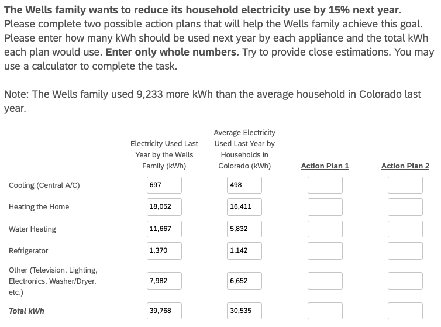

# Planning to Save Energy: How Information Format Affects Accuracy
Thomas E. Gorman, Torsten Reimer, Juan Pablo Loaiza Ramirez, Hayden
Barber
2024-12-07

# Introduction

- highlight the significant contribution of residential energy
  consumption to carbon emissions and the potential for substantial
  reductions. Make point about urgency of climate change? (IPCC (2014)
  and EIA (2012) ).

- Electricity bills are a primary source of energy-use information for
  consumers and offer a promising avenue for enhancing communication
  about energy consumption (Fischer, 2008)

### Literature Review

- Canfield et al. (2017) found that tables were more effective than
  graphs for conveying specific electricity usage data, likely because
  tables facilitate straightforward point reading. However, they also
  noted that individuals with lower energy literacy had reduced
  comprehension across all formats.
- Canfield et al. (2017)’s findings on preferences for historical use
  information and the impact of neighbor comparisons
- The concept of cognitive fit posits that performance improves when the
  information presentation format aligns with the task requirements
  (Vessey, 1991)
- alignment can reduce cognitive load and enhance accuracy in planning
  (Shah & Freedman, 2011)
- Reimer et al. (2015) provide context on how numerical formats affect
  risk perception, the reference class problem, and the benefits of
  natural frequencies.

Energy poverty continues to be a pervasive issue in the United States
Memmott et al. (2021). This challenge partly arises from difficulties in
converting information across numerical formats, impeding the
development of precise energy reduction plans Reimer et al. (2015).
Prior research by Canfield et al. (2017) demonstrated that presenting
energy information in tabular formats enhances comprehension relative to
graphs.

The way numerical information is presented can significantly affect how
individuals process and use that information (Reimer et al., 2015) . The
reference class problem highlights that numbers without clear reference
points can lead to misinterpretation, as the meaning of a statistic
depends on the category or class it refers to (Gigerenzer & Edwards,
2003; Reimer et al., 2015). Presenting energy information in absolute
units (e.g., kWh) provides a clear reference class, potentially
enhancing comprehension.

Furthermore, research suggests that natural frequencies and absolute
numbers are generally easier for individuals to understand compared to
percentages or probabilities Hoffrage et al. (2000). In the context of
energy conservation, using absolute units may facilitate more accurate
planning and decision-making by aligning with intuitive cognitive
processing.

Despite existing studies on energy-use communication and format effects,
limited research has explored how different numerical representations
influence consumers’ ability to create accurate energy conservation
plans. Specifically, there is a gap in understanding how presenting
energy information in absolute units versus percentages or monetary
terms affects the precision of planning appliance-specific reductions.
Addressing this gap is crucial for developing effective interventions
that promote energy conservation behaviors.

### Hypotheses

Building on these findings and informed by prior work showing that
frequencies (like absolute units in kWh) are easier to comprehend and
facilitate more precise decision-making compared to percentages, our
study also utilizes a tabular format, but manipulates whether
participants must consider energy information presented as absolute
units (kWh), percentages (%), or monetary costs (USD). We hypothesize
that presenting information in absolute units (kWh) will lead to more
accurate household energy conservation planning.

# Experiment 1

See <a href="#fig-task" class="quarto-xref">Figure 1</a> for an example
of a planning trial as it was seen by participants.

## Methods

### Participants

We implemented our task and surveys on Qualtrics, and recruited
participants through Amazon Mechanical Turk. In Experiment 1, 252
participants were intially recruited, but data from 17 participants were
corrupted due to experimenter error, leaving a final sample of 235
participants. Most participants (76%) reported using a calculator to
complete the task.

### Materials and Design

The study employed a mixed design with reference class (kWh, percentage,
USD) as a between-subjects factor and state/family scenario as a
within-subjects factor. Each participant completed energy reduction
planning tasks for two different states, with state order
counterbalanced across participants. The family scenarios featured four
households in different climate regions: Texas (Smith family) and
California (Adams family) representing warm climates, and Colorado
(Wells family) and Massachusetts (Davis family) representing cold
climates. We obtain average utility use from each state by CITE SOURCE
FOR STATE AVGS?

### Procedure

Participants received energy usage data for two hypothetical families
and were tasked with creating action plans to meet specified reduction
goals by allocating usage across five appliance categories: heating,
cooling, water heating, refrigerator, and an other appliances (e.g., TV,
lighting).

For each family scenario, the particpipants were shown a table
containing the families utility usage from the prior year, alongside the
state averages for each appliance category (both prior year usage and
stage averages are always shown in kWh). For each scenario, participants
were asked to create two possible action plans to achieve the target
reduction in total household energy usage (see
<a href="#fig-task" class="quarto-xref">Figure 1</a>). Depending on
their reference class condition, the target reduction amount presented
either in kilowatt-hours (kWh), as percentages of total household usage,
or in U.S. dollars. In all conditions, the target reduction was
equivalent to a 15% reduction in total household kWh.

<div id="fig-task">



Figure 1: Example trial in the energy planning task. Participants are
shown the prior year electricity use of a household, and are tasked with
creating a plan for the next year that will meet the energy reduction
goal. Study 1 manipulates the format of the reduction goal to be either
a percentage (15% given as goal reduction), kilowatt hours (5965 kWh
given), or USD (\$656)

</div>

Additional data collected included:

- **Energy Literacy Quiz**: An 8-item questionnaire assessing
  participants’ knowledge of energy consumption and conversion.
- **Calculator Usage Tracking**: Questions determined whether
  participants used a calculator, paper/pen, or other methods to
  complete the tasks.
- **Demographic Survey**: Collected information on gender, age, income,
  education, employment status, and state of residence.
- **Environmental Attitudes Survey**: Assessed participants’
  pro-environmental attitudes and perceived importance of energy
  conservation.

## Results

``` r
pacman::p_load(dplyr,purrr,tidyr,stringr,here,tibble,brms,rstan,bayestestR,emmeans,tidybayes,modelsummary,ggplot2,gt,knitr,kableExtra,ggh4x,patchwork,lme4,flextable,pander)
options(digits=2, scipen=999, dplyr.summarise.inform=FALSE)

walk(c("fun_plot"), ~ source(here::here(paste0("scripts/", .x, ".R"))))
theme_set(theme_nice())

s1 <- readRDS(here::here("data/s1_processed.rds")) |> 
  filter(!(id %in% readRDS(here::here("data/s1_discrep_ids.rds")))) |> 
  mutate(refClass = factor(refClass, levels=c("kWh","Percentage","USD")))

s2_long <- readRDS(here::here("data/s2_processed.rds")) |> 
  filter(!(id %in% readRDS(here::here("data/s2_discrep_ids.rds")))) |> 
  mutate(refClass = factor(refClass, levels=c("kWh","Percentage","USD")))
```

``` r
s1_agg <- s1 |> 
    filter(appliance !="Total kWh") |> 
    group_by(id,refClass,state,block,plan,calc,edu,pct_goal) |> 
    summarise(total_kWh = sum(value),orig_kWh=sum(family), 
                pct_change = round((orig_kWh-total_kWh)/orig_kWh,3), 
                n_change = sum(value!=family),
                state_p_dif=mean(state_p_dif),
                state_f_dif=mean(state_f_dif),
                n_less_avg = sum(less_avg),
                duration=first(Duration__in_seconds_)) |> 
    mutate(matched_goal = (pct_change == pct_goal), 
                error = pct_change - pct_goal,
                abs_error = abs(error),
                close_match = abs_error <= 0.03) |>
    ungroup() |> # Add ungroup here
        mutate(
            accuracy_level = factor(
                case_when(
                    abs_error == 0.00 ~ "Exact match",
                    abs_error <= 0.02 ~ "0.01-2% error",
                    abs_error <= 0.15 ~ "2.01-15% error",
                    TRUE ~ "Over 15% error"  # Capture all remaining cases
                ), 
                levels = c("Exact match", "0.01-2% error", "2.01-15% error", "Over 15% error"),
                ordered = TRUE
            )
        ) |> relocate(accuracy_level, .after= "pct_change")


s1_agg4 <- s1_agg |> group_by(id,refClass,calc) |> 
    mutate(n_accuracy = n_distinct(accuracy_level)) |> 
    summarise(mg=sum(matched_goal),n=n(), pct=mg/n,mean_pct_change=mean(pct_change),mean_abs_error=mean(abs_error),n_accuracy=first(n_accuracy)) |> 
    mutate(accuracy_level = factor(
            case_when(
                mean_abs_error < 0.02 ~ "Exact match",
                mean_abs_error <= 0.02 ~ "0.01-2% error",
                mean_abs_error <= 0.15 ~ "2.01-15% error",
                TRUE ~ "Over 15% error"  # Capture all remaining cases
            ), 
            levels = c("Exact match", "0.01-2% error", "2.01-15% error", "Over 15% error"),
            ordered = TRUE
        ))
  
# proportion matching vs close match

# proportion matching vs close match


# overall pct of subjects who matched their goal
s1_agg4 |> group_by(refClass) |>
    summarise(
    'Avg. % meeting goal' = mean(pct),
    'Avg. Deviation From Goal' = median(mean_pct_change),
    # sd = sd(pct),
    # n = n(),
    #se=sd(pct)/sqrt(n)
) |>   mutate(across(where(is.numeric), \(x) round(x, 3))) %>% 
  kable(escape=FALSE,booktabs=TRUE,align=c("l")) 
 #pander::pandoc.table(caption="Study 1: Proportion of participants who matched their goal overall")
```

<div id="tbl-s1-agg">

Table 1: Study 1: Summary of planning accuracy by reference class. The
table shows performance as both the % of trials where participants
matched the goal, and the mean absolute error from the target reduction
goal.

<div class="cell-output-display">

| refClass   | Avg. % meeting goal | Avg. Deviation From Goal |
|:-----------|:--------------------|:-------------------------|
| kWh        | 0.38                | 0.15                     |
| Percentage | 0.22                | 0.16                     |
| USD        | 0.10                | 0.19                     |

</div>

</div>

For our primary analyses of participants’ ability to create accurate
energy-saving plans, we employed an accuracy level binning approach by
categorizing responses into four distinct levels: Exact match, 0.01–2%
error, 2.01–15% error, and Over 15% error. The current analysis employs
a cumulative ordinal regression model, implemented via a Bayesian
hierarchical framework (Bürkner, 2017) . This approach allows the
estimation of threshold parameters and regression coefficients that
characterize how changes in predictor variables (such as the reference
class: kWh, percentage, or USD) relate to probabilities of being in each
accuracy category. All analyses were carried out in R (Team, 2020) and
the tidyverse package (Wickham et al., 2019).

``` r
# compute percentage of subjects per accuracy level per group
observed_props_s1 <- s1_agg |>
  group_by(refClass, accuracy_level) |>
  summarise(n = n()) |>
  group_by(refClass) |>
  mutate(prop = n/sum(n)) |>
  mutate(n_prop=paste0(n," (",round(prop*100,1),"%)" ), pct_grp=paste0(round(prop*100,1), "%")) |> ungroup()

observed_props_s1 |> 
  mutate(n_total=sum(n)/4) |> 
  group_by(accuracy_level) |>
  mutate(ns=sum(n)/4) |> 
  mutate(Total = paste0(round(ns/n_total*100,1), "%")) |>
  select('Reference Class'=refClass, 'Accuracy Level'=accuracy_level, '% in Group'=pct_grp, "Combined Groups %" =Total) |>
  pivot_wider(
    names_from = 'Reference Class',
    values_from = c('% in Group')
  ) |> relocate("Combined Groups %" , .after=last_col()) |> 
  kable(escape=FALSE,booktabs=TRUE,align=c("l")) 
```

<div id="tbl-s1-prop">

Table 2: Study 1: The table shows the percentage of participants who
fell into each accuracy level for each reference class condition
(percentages of kWh, \$, and USD columns reflect within condition
percentages). The combined group column reflects the percentage of
participants in each accuracy level when aggregating across across all
reference class conditions.

<div class="cell-output-display">

| Accuracy Level | kWh   | Percentage | USD   | Combined Groups % |
|:---------------|:------|:-----------|:------|:------------------|
| Exact match    | 37.5% | 22.1%      | 9.8%  | 22.6%             |
| 0.01-2% error  | 15.1% | 17.6%      | 11.2% | 14.4%             |
| 2.01-15% error | 26.3% | 41.9%      | 47.8% | 38.9%             |
| Over 15% error | 21.2% | 18.4%      | 31.2% | 24.1%             |

</div>

</div>

see <a href="#fig-s1-plot" class="quarto-xref">Figure 2</a>

``` r
prop_acc_s1 <- s1_agg %>%
    group_by(refClass, accuracy_level) %>%
    summarise(count = n()) %>%
    group_by(accuracy_level) |>
    mutate(Probability = count / sum(count)) %>%
    ungroup()


ggplot(prop_acc_s1, aes(x = accuracy_level, y = Probability, fill = refClass)) +
    geom_bar(stat = "identity", position = position_dodge()) +
  scale_y_continuous(labels = scales::percent) +
    labs(title = "S1. % of Participants within each Accuracy Bin",
        x = "Accuracy Level",
        y = "Percentage of Participants",
        fill = "Reference Class") +
    theme_minimal() 
```

<div id="fig-s1-plot">


Figure 2: Study 1: Proportion of participants in each accuracy level,
colored by reference class. A larger % of participants in the Exact
Match, or 0.01-2% error bins indicates better performance.

</div>

We analyzed planning accuracy using Bayesian ordinal regression. The
dependent variable, plan error, was computed by binning the goal
deviation into four ordered levels: exact match (0% error), minor
deviations (0.01-2% error), moderate deviations (2.01-15% error), and
major deviations (\>15% error). For each comparison, we provide
posterior odds ratios (OR) and their 95% CIs.

<div id="tbl-s1-ord">

Table 3

``` r
##| tbl-cap: "Study 1: Ordinal Regression Model Results."


ordinal_model_s1 <- brm(
    accuracy_level ~ refClass + (1|id) + (1|state),
    data = s1_agg,
    family = cumulative("logit"),
    cores = 4,
    iter = 5000,
    save_pars = save_pars(all = TRUE),
    control = list(adapt_delta = 0.99), 
    prior = c(prior(normal(0, 3), class = "Intercept"), 
                prior(normal(0, 3), class = "b")), 
    file = paste0(here::here("data/model_cache",'s1_ordinal3.rds')) 
)


#colnames(mted1) <- c("Term", "Estimate","95% CrI Lower", "95% CrI Upper", "pd")

# as.data.frame(describe_posterior(ordinal_model_s1, centrality = "Mean"))[, c(1,2,4,5,6)] |> 
#   setNames(c("Parameter", "Estimate", "CI_Lower", "CI_Upper", "pd")) |> 
#   mutate(Parameter = stringr::str_remove(Parameter, "b_")) |> kable(escape=FALSE,booktabs=TRUE,align=c("l"), row.names = FALSE)


# Get predicted probabilities
pred_summary <- ordinal_model_s1 |>
    epred_draws(newdata = data.frame(refClass = c("kWh", "Percentage", "USD")),
                ndraws = 1000, re_formula = NA) |>
    group_by(refClass, Category=.category) |>
    summarise(
        mean_prob = mean(.epred),
        lower_ci = quantile(.epred, 0.025),
        upper_ci = quantile(.epred, 0.975)
    )
#pred_summary |> pander::pandoc.table(caption="Study 1: Predicted probabilities of accuracy")


#plot(conditional_effects(ordinal_model_s1),points=TRUE)

# or_table |>
#       rownames_to_column(var = "Term") |>
#       filter(!stringr::str_detect(Term, "Intercept")) |> kable(escape=FALSE,booktabs=TRUE,align=c("l"))


# or_table <- data.frame(exp(fixef(ordinal_model_s1)))
# or_table |>
#   rownames_to_column(var = "Term") |>
#   filter(!stringr::str_detect(Term, "Intercept")) |>
#   as_flextable() |>
#   set_header_labels(values = list(
#     OR = "Odds Ratio",
#     `2.5 %` = "Lower 95% CI",
#     `97.5 %` = "Upper 95% CI"
#   )) |>
#   flextable::add_footer_lines(values = "Note: Odds ratios derived from the ordinal logistic regression model.") |> 
#   align(align = 'center', part = 'all') |>
#   fontsize(size = 10, part = "all")
```

</div>

<div id="tbl-s1-or">

Table 4: **Experiment 1**: Ordinal Regression results.

| Parameter          | Estimate | CI_Lower | CI_Upper | pd   |
|:-------------------|:---------|:---------|:---------|:-----|
| Intercept\[1\]     | -1.94    | -3.19    | -0.74    | 1.00 |
| Intercept\[2\]     | 0.20     | -1.02    | 1.42     | 0.63 |
| Intercept\[3\]     | 4.36     | 3.11     | 5.65     | 1.00 |
| refClassPercentage | 0.85     | -0.54    | 2.23     | 0.88 |
| refClassUSD        | 2.72     | 1.41     | 4.06     | 1.00 |

</div>

<div id="tbl-s1-epred">

Table 5: **Experiment 1**: Odds ratios for group comparisons.

| Term               | Estimate | Est.Error | Q2.5 | Q97.5 |
|:-------------------|:---------|:----------|:-----|:------|
| refClassPercentage | 2.3      | 2         | 0.58 | 9.3   |
| refClassUSD        | 15.2     | 2         | 4.11 | 58.1  |

</div>

The ordinal model is parameterized with thresholds (intercepts), and
positive coefficients can indicate that it is more difficult to achieve
higher accuracy categories in the USD condition. The model output
suggests that, compared to the kWh condition, the USD condition shows a
positive coefficient (Estimate = 2.72, 95% CI: 1.41 to 4.06) for the
ordinal outcome. At least to me, this positive coefficient appears to
indicate that, relative to the kWh reference class, participants in the
USD condition are more likely to fall into higher numerical categories
of the dependent variable coding. However, because the dependent
variable is ordered from best (Exact match) to worst (Over 15% error),
care is needed in interpretation. The Percentage condition coefficient
(Estimate = 0.85, 95% CI: -0.54 to 2.23) is more uncertain, with its
credible interval overlapping zero. Posterior predictive checks (Figure
3) showed that the ordinal model provided a reasonable fit to the
observed data (see
<a href="#fig-s1-plot2" class="quarto-xref">Figure 3</a>).

``` r
#bayesplot::color_scheme_set(wes_palettes[1]$BottleRocket1[1:6])

# Plot predicted probabilities
# ggplot(pred_summary, aes(x = refClass, y = mean_prob, fill = Category)) +
#     geom_bar(stat = "identity", position = position_dodge()) +
#     geom_errorbar(aes(ymin = lower_ci, ymax = upper_ci),
#                     position = position_dodge(width = 0.9), width = 0.2) +
#     labs(y = "Predicted Probability", x = "Reference Class", fill = "Accuracy Level") +
#     ggtitle("Study 1: Predicted Probabilities of Accuracy Level by Reference Class") +
#     theme_minimal()


#pp_check(ordinal_model_s1) + ggtitle("Study 1: Posterior Predictive Checks for Ordinal Regression Model") + theme_minimal()

pp_check(ordinal_model_s1, type = "bars_grouped", group="refClass", fatten = 2) +
  scale_x_continuous("Response Category", breaks = 1:4, 
            labels = c("Exact", "0.01-2%", "2.01-15%", ">15%")) +
  scale_y_continuous(expand = expansion(mult = c(0, 0.05))) +
  ggtitle("Posterior Predictive Check by Reference Class") +
  theme_minimal() +
  theme(
    legend.background = element_blank(),
    legend.position = "bottom",
    panel.grid.minor = element_blank(),
    axis.text.x = element_text(angle = 45, hjust = 1)
  )
```

<div id="fig-s1-plot2">


Figure 3: Study 1: Proportion of participants in each accuracy level,
colored by reference class, and seprated in facets based on the levels
of reduction goal. A larger % of participants in the Exact Match, or
0.01-2% error bins indicates better performance.

</div>

# Experiment 2

## Methods

The experimental procedures in study 2 are quite similar to those in
study 1, but we also included a rounding manipulation (rounded vs. not
rounded), and a manipulation of the goal (10% reduction vs. 15%
rediction). We recruited 206 participants from Amazon Mechanical Turk,
but data from from 10 participants were corrupted due to experimenter
error, leaving a final sample of 196 participants.

Note that reference class remains a between-subjects variable, while
percent goal, rounding, and state are within-subjects variables. In
study 2, the new design is a 4 state temperature (2 warm vs. 2 cold
states) X 2 task goal (10% vs. 15%) X 2 last year’s usage for the family
and the state average (exact vs. rounded numbers) within X 3 task
reference class (USD vs. Percentage vs. kWh) between.

## Results

``` r
s2_agg1 <- s2_long |> 
  filter(appliance != "TOTAL") |> 
  group_by(id,refClass,calc, state,pct,pct_goal,plan,rounded) |> 
  summarise(
    total_kWh = sum(value),
    orig_kWh = sum(family),
    pct_change = round((orig_kWh - total_kWh) / orig_kWh, 3),
    state_dif = mean(state_dif),
    .groups = "drop"
  ) |>
  mutate(matched_goal = (pct_change == pct),
                error = pct_change - pct,
                abs_error = abs(error),
                log_abs_error=log(abs(error)+.001)) |> 
      ungroup() |> # Add ungroup here
        mutate(
            accuracy_level = factor(
                case_when(
                    abs_error == 0.00 ~ "Exact match",
                    abs_error <= 0.02 ~ "0.01-2% error",
                    abs_error <= 0.15 ~ "2.01-15% error",
                    TRUE ~ "Over 15% error"  # Capture all remaining cases
                ), 
                levels = c("Exact match", "0.01-2% error", "2.01-15% error", "Over 15% error"),
                ordered = TRUE
            )
        )

s2_agg4 <- s2_agg1 |> group_by(id,refClass,calc) |> 
    mutate(n_accuracy = n_distinct(accuracy_level)) |> 
    summarise(mg=sum(matched_goal),n=n(), pct=mg/n,mean_pct_change=mean(pct_change),
    mean_abs_error=mean(abs_error),mean_log_abs_error=mean(log_abs_error),
    n_accuracy=first(n_accuracy)) |> 
    mutate(accuracy_level = factor(
            case_when(
                mean_abs_error < 0.02 ~ "Exact match",
                mean_abs_error <= 0.02 ~ "0.01-2% error",
                mean_abs_error <= 0.15 ~ "2.01-15% error",
                TRUE ~ "Over 15% error"  # Capture all remaining cases
            ), 
            levels = c("Exact match", "0.01-2% error", "2.01-15% error", "Over 15% error"),
            ordered = TRUE
        ))
  

# overall pct of subjects who matched their goal
s2_agg4 |> group_by(refClass) |>
    summarise(
    'Avg. % meeting goal' = mean(pct),
    'Avg. Abs. Deviation From Goal' = median(mean_pct_change),
    'Log Deviation' = (median(mean_log_abs_error)),
    # sd = sd(pct),
    # n = n(),
    #se=sd(pct)/sqrt(n)
) |>   mutate(across(where(is.numeric), \(x) round(x, 3))) %>% 
  kable(escape=FALSE,booktabs=TRUE,align=c("l")) 
# s2_agg1 |> group_by(id,refClass,calc) |> 
#     mutate(n_accuracy = n_distinct(accuracy_level)) |> 
#     summarise(mg=sum(matched_goal),n=n(), pct=mg/n,mean_pct_change=mean(pct_change),
#     mean_abs_error=mean(abs_error),mean_log_abs_error=mean(log_abs_error),
#     n_accuracy=first(n_accuracy)) 


# s2_agg4 %>% ggplot(aes(x=refClass,y=mean_log_abs_error,fill=refClass)) + 
#   stat_summary(fun=mean, geom="bar") +
#   stat_summary(fun.data=mean_cl_normal, geom="errorbar", width=0.2) +
#   geom_jitter(alpha = 0.2, width = 0.2, height = 0) 
            


# s2_agg4 |> 
#   ggplot(aes(x = mean_log_abs_error,fill = refClass)) +
#   geom_density(alpha = 0.7) 

# library(ggridges)
# s2_agg1 |>  ggplot(aes(y = refClass, x=log_abs_error,fill=refClass,col=refClass)) +
#     geom_density_ridges(alpha = 0.5) +
#     geom_vline(aes(xintercept=(log_abs_error)))
```

<div id="tbl-s2-agg">

Table 6: Study 2: Summary of planning accuracy by reference class. The
table shows performance as both the % of trials where participants
matched the goal, and the mean absolute error from the target reduction
goal.

<div class="cell-output-display">

| refClass   | Avg. % meeting goal | Avg. Abs. Deviation From Goal | Log Deviation |
|:-----------|:--------------------|:------------------------------|:--------------|
| kWh        | 0.44                | 0.13                          | -4.7          |
| Percentage | 0.27                | 0.16                          | -3.5          |
| USD        | 0.18                | 0.17                          | -2.5          |

</div>

</div>

``` r
# compute percentage of subjects per accuracy level per group
observed_props_s2 <- s2_agg1 |>
  group_by(refClass, accuracy_level) |>
  summarise(n = n()) |>
  group_by(refClass) |>
  mutate(prop = n/sum(n)) |>
  mutate(n_prop=paste0(n," (",round(prop*100,1),"%)" ), pct_grp=paste0(round(prop*100,1), "%")) |> ungroup()

observed_props_s2 |> 
  mutate(n_total=sum(n)/4) |> 
  group_by(accuracy_level) |>
  mutate(ns=sum(n)/4) |> 
  mutate(Total = paste0(round(ns/n_total*100,1), "%")) |>
  select('Reference Class'=refClass, 'Accuracy Level'=accuracy_level, '% in Group'=pct_grp, "Combined Groups %" =Total) |>
  pivot_wider(
    names_from = 'Reference Class',
    values_from = c('% in Group')
  ) |> relocate("Combined Groups %" , .after=last_col()) |> 
  kable(escape=FALSE,booktabs=TRUE,align=c("l")) 
```

<div id="tbl-s2-prop">

Table 7: Study 2: The table shows the percentage of participants who
fell into each accuracy level for each reference class condition
(percentages of kWh, \$, and USD columns reflect within condition
percentages). The combined group column reflects the percentage of
participants in each accuracy level when aggregating across across all
reference class conditions.

<div class="cell-output-display">

| Accuracy Level | kWh   | Percentage | USD   | Combined Groups % |
|:---------------|:------|:-----------|:------|:------------------|
| Exact match    | 43.5% | 26.8%      | 18.5% | 30.2%             |
| 0.01-2% error  | 8%    | 13.8%      | 9.1%  | 10.3%             |
| 2.01-15% error | 21%   | 33.3%      | 38.4% | 30.5%             |
| Over 15% error | 27.5% | 26.1%      | 34.1% | 29%               |

</div>

</div>

``` r
# % of entire sample 
prop_combo_s2 <- s2_agg1 %>%
    group_by(refClass, accuracy_level) %>%
    summarise(count = n()) %>%
    group_by(refClass) %>%
    mutate(Probability = count / sum(count)) %>%
    ungroup()


ggplot(prop_combo_s2, aes(x = accuracy_level, y = Probability, fill = refClass)) +
    geom_bar(stat = "identity", position = position_dodge()) +
  scale_y_continuous(labels = scales::percent) +
    labs(title = "S1. % of Participants within each Accuracy Bin",
        x = "Accuracy Level",
        y = "Percentage of Participants",
        fill = "Reference Class") +
    theme_minimal() 
```

<div id="fig-s2-plot">


Figure 4

</div>

``` r
# % of entire sample 
prop_combo_s2_full <- s2_agg1 %>%
    group_by(refClass, accuracy_level, pct_goal,rounded) %>%
    summarise(count = n()) %>%
    group_by(refClass) %>%
    mutate(Probability = count / sum(count)) %>%
    ungroup()


ggplot(prop_combo_s2_full, aes(x = accuracy_level, y = Probability, fill = refClass)) +
    geom_bar(stat = "identity", position = position_dodge()) +
  scale_y_continuous(labels = scales::percent) +
    labs(title = "S1. % of Participants within each Accuracy Bin",
        x = "Accuracy Level",
        y = "Percentage of Participants",
        fill = "Reference Class") +
    facet_wrap(~pct_goal*rounded) +
    theme_minimal() 
```

<div id="fig-s2-plot2">


Figure 5: Study 2: Proportion of participants in each accuracy level,
colored by reference class, and seprated in facets based on the levels
of reduction goal, and rounding. A larger % of participants in the Exact
Match, or 0.01-2% error bins indicates better performance.

</div>

<div id="tbl-s2-ord">

Table 8

``` r
##| tbl-cap: "Study 2: Ordinal Regression Model Results."

ordinal_model_s2_logit <- brm(
  accuracy_level ~ refClass +rounded+pct_goal + (1|id)+ (1|state),
  data = s2_agg1,
  family = cumulative("logit"),
  cores = 4,
  iter = 2000,
  control = list(adapt_delta = 0.99), # Recommended for ordinal models
  prior = c(prior(normal(0, 2), class = "Intercept"),  # Priors for thresholds
            prior(normal(0, 2), class = "b")), # Priors for predictors
  file = paste0(here::here("data/model_cache",'s2_logit_add.rds')) # Cache for efficiency
)
#summary(ordinal_model_s2_logit)


# as.data.frame(describe_posterior(ordinal_model_s2_logit, centrality = "Mean"))[, c(1,2,4,5,6)] |> 
#   setNames(c("Parameter", "Estimate", "CI_Lower", "CI_Upper", "pd")) |> 
#   mutate(Parameter = stringr::str_remove(Parameter, "b_")) |> 
#   kable(escape = FALSE, booktabs = TRUE, align = c("l"), row.names = FALSE)


pred_summary_s2 <- ordinal_model_s2_logit %>%
  epred_draws(newdata = s2_agg1, re_formula = NA,ndraws=200) %>%
 # group_by("Reference Class"=refClass, rounded, "% Goal"=pct_goal, Category=.category) %>%
  group_by("Reference Class"=refClass, Category=.category) %>%
  summarise(
    mean_prob = mean(.epred),
    lower_ci = quantile(.epred, 0.025),
    upper_ci = quantile(.epred, 0.975),
    .groups = "drop"
  )

#pred_summary_s2 |> kable(escape=FALSE,booktabs=TRUE,align=c("l"), row.names = FALSE)


# Create a new data frame with the predictor values
# new_data <- expand.grid(
#   refClass = c("kWh", "Percentage", "USD"),
#   id = unique(s2_agg1$id)[1],      # Take first id
#   state = unique(s2_agg1$state)[1], # Take first state,
#   rounded = unique(s2_agg1$rounded)[1], # Take first rounded
#   pct_goal = unique(s2_agg1$pct_goal)[1] # Take first pct_goal
# )


# or_table <- data.frame(exp(fixef(ordinal_model_s2_logit)))
# or_table |>
#   rownames_to_column(var = "Term") |>
#   filter(!stringr::str_detect(Term, "Intercept")) |>
#   as_flextable() |>
#   set_header_labels(values = list(
#     OR = "Odds Ratio",
#     `2.5 %` = "Lower 95% CI",
#     `97.5 %` = "Upper 95% CI"
#   )) |>
#   flextable::add_footer_lines(values = "Note: Odds ratios derived from the ordinal logistic regression model.") |> 
#   align(align = 'center', part = 'all') |>
#   fontsize(size = 10, part = "all")
```

</div>

<div id="tbl-s2-or">

Table 9: **Experiment 2.** Ordinal Regression Model Results.

| Parameter          | Estimate | CI_Lower | CI_Upper | pd   |
|:-------------------|:---------|:---------|:---------|:-----|
| Intercept\[1\]     | -2.13    | -3.39    | -0.86    | 1.00 |
| Intercept\[2\]     | -0.62    | -1.89    | 0.63     | 0.84 |
| Intercept\[3\]     | 3.15     | 1.88     | 4.42     | 1.00 |
| refClassPercentage | 0.83     | -0.64    | 2.33     | 0.87 |
| refClassUSD        | 1.87     | 0.31     | 3.35     | 0.99 |
| roundedRounded     | -0.66    | -1.01    | -0.31    | 1.00 |
| pct_goal15%        | -0.44    | -0.79    | -0.10    | 0.99 |

</div>

<div id="tbl-s2-epred">

Table 10: **Experiment 2.** Odds ratios for group comparisons.

| comparison           | odds_ratio | ci_lower | ci_upper |
|:---------------------|-----------:|---------:|---------:|
| Percentage vs kWh    |       3.02 |     0.53 |    10.31 |
| USD vs kWh           |       8.80 |     1.37 |    28.42 |
| Rounded vs Not       |       0.53 |     0.36 |     0.73 |
| 15% Goal vs 10% Goal |       0.66 |     0.45 |     0.91 |

</div>

``` r
# ggplot(pred_summary_s2, 
#         aes(x = .category, y = mean_prob, fill = refClass )) +
#     geom_col(position = position_dodge(width = 0.8)) +
#     geom_errorbar(aes(ymin = lower_ci, ymax = upper_ci), 
#                     position = position_dodge(width = 0.8)) +
#     labs(x = "Reference Class", 
#         y = "Predicted Probability",
#         fill = "Accuracy Level",
#         title = "Predicted Probabilities of Accuracy Levels by Reference Class") +
#     scale_fill_brewer(palette = "RdYlBu") +
#     theme_minimal() 


pp_check(ordinal_model_s2_logit, type = "bars_grouped", group="refClass", fatten = 2) +
  scale_x_continuous("Response Category", breaks = 1:4, 
            labels = c("Exact", "0.01-2%", "2.01-15%", ">15%")) +
  scale_y_continuous(expand = expansion(mult = c(0, 0.05))) +
  ggtitle("Posterior Predictive Check by Reference Class") +
  theme_minimal() +
  theme(
    legend.background = element_blank(),
    legend.position = "bottom",
    panel.grid.minor = element_blank(),
    axis.text.x = element_text(angle = 45, hjust = 1))
```

<div id="fig-s2-plot3">


Figure 6

</div>

### Individual Differences

see <a href="#fig-s2-indv" class="quarto-xref">Figure 7</a>

``` r
s2_agg1 |> group_by(id,refClass,calc,pct_goal,pct_change) |> 
    filter(plan=="plan1",rounded=="Rounded") |> 
    mutate(n_accuracy = n_distinct(accuracy_level)) |> 
    summarise(mg=sum(matched_goal),n=n(), pct=mg/n,mean_pct_change=mean(pct_change),mean_abs_error=mean(abs_error),n_accuracy=first(n_accuracy)) |>
  ungroup() |> 
  mutate(goal_pct = as.numeric(stringr::str_remove(pct_goal,"%"))/100) |>
  filter(mean_abs_error <= 0.50) |>
  mutate(id=reorder(id,pct_change)) |> 
  ggplot(aes(y=id,x=mean_pct_change,col=refClass)) + 
  geom_point(size=1,alpha=0.6,position = position_jitter(w=0, h=0.17)) +
  geom_vline(aes(xintercept=goal_pct),linetype="dashed",alpha=.5) +
  ggh4x::facet_nested_wrap(~pct_goal,axes="all",scales="free",ncol=2)  + 
  labs(y="Participant Id", x="Percent Change", title="Individual Performance") +
  theme(axis.text.y=element_text(face = "plain", size = rel(0.7))) + 
    scale_x_continuous(breaks = seq(0, 0.5, by = 0.05),
                    labels = scales::percent_format(accuracy = 1))
```

<div id="fig-s2-indv">


Figure 7: Study 2: Individual performance in the energy planning task,
colored by reference class. The dashed line represents the target
reduction goal. Participants are shown along the y axis, those who fall
above or below the dashed line have not met the target goal. The x-axis
represents the percent change in energy usage from the prior year.

</div>

``` r
s2_long |> filter(id %in% unique(s2_long$id)[1:30]) |> 
  filter(appliance!="TOTAL",state=="California") |> 
  ggplot(aes(x=appliance,y=value)) + geom_point(aes(shape=plan)) +
  geom_point(aes(y=state_avg),color="red") +
  geom_point(aes(y=family),color="blue") +
  theme(axis.text.x = element_text(angle = 45, hjust = 1))


s2_long |> filter(id %in% unique(s2_long$id)[1:30]) |> 
  filter(appliance!="TOTAL",state=="California") |> 
  ggplot(aes(x=appliance,y=value)) + geom_point(aes(shape=plan)) +
  geom_point(aes(y=state_avg),color="red") +
  geom_point(aes(y=family),color="blue") +
  facet_wrap(~id) + theme(axis.text.x = element_text(angle = 45, hjust = 1))
```

<div id="fig-s2-indv2-1">


Figure 8: Study 2: Respones patterns for a subset of individiual
participants. Black points are participant responses, red points are the
state average, and blue points are the family average. The x-axis
represents the appliance category, and the y-axis represents the energy
usage in kWh.

</div>

<div id="fig-s2-indv2-2">


Figure 9: Study 2: Respones patterns for a subset of individiual
participants. Black points are participant responses, red points are the
state average, and blue points are the family average. The x-axis
represents the appliance category, and the y-axis represents the energy
usage in kWh.

</div>

# Discusion

Karjalainen 2011 - people prefer information about price (Karjalainen,
2011)

# References

<div id="refs" class="references csl-bib-body hanging-indent"
entry-spacing="0" line-spacing="2">

<div id="ref-burknerBrmsPackageBayesian2017" class="csl-entry">

Bürkner, P.-C. (2017). Brms: An R Package for Bayesian Multilevel Models
Using Stan. *Journal of Statistical Software*, *80*, 1–28.
<https://doi.org/10.18637/jss.v080.i01>

</div>

<div id="ref-canfieldPerceptionsElectricityuseCommunications2017"
class="csl-entry">

Canfield, C., Bruine De Bruin, W., & Wong-Parodi, G. (2017). Perceptions
of electricity-use communications: Effects of information, format, and
individual differences. *Journal of Risk Research*, *20*(9), 1132–1153.
<https://doi.org/10.1080/13669877.2015.1121909>

</div>

<div id="ref-fischerFeedbackHouseholdElectricity2008" class="csl-entry">

Fischer, C. (2008). Feedback on household electricity consumption: A
tool for saving energy? *Energy Efficiency*, *1*(1), 79–104.
<https://doi.org/10.1007/s12053-008-9009-7>

</div>

<div id="ref-gigerenzerSimpleToolsUnderstanding2003" class="csl-entry">

Gigerenzer, G., & Edwards, A. (2003). Simple tools for understanding
risks: From innumeracy to insight. *BMJ*, *327*(7417), 741–744.
<https://doi.org/10.1136/bmj.327.7417.741>

</div>

<div id="ref-gigerenzerHowImproveBayesian1995" class="csl-entry">

Gigerenzer, G., & Hoffrage, U. (1995). How to improve Bayesian reasoning
without instruction: Frequency formats. *Psychological Review*,
*102*(4), 684–704. <https://doi.org/10.1037/0033-295X.102.4.684>

</div>

<div id="ref-hoffrageCommunicatingStatisticalInformation2000"
class="csl-entry">

Hoffrage, U., Lindsey, S., Hertwig, R., & Gigerenzer, G. (2000).
Communicating Statistical Information. *Science*, *290*(5500),
2261–2262. <https://doi.org/10.1126/science.290.5500.2261>

</div>

<div id="ref-karjalainenConsumerPreferencesFeedback2011"
class="csl-entry">

Karjalainen, S. (2011). Consumer preferences for feedback on household
electricity consumption. *Energy and Buildings*, *43*(2-3), 458–467.
<https://doi.org/10.1016/j.enbuild.2010.10.010>

</div>

<div id="ref-memmottSociodemographicDisparitiesEnergy2021"
class="csl-entry">

Memmott, T., Carley, S., Graff, M., & Konisky, D. M. (2021).
Sociodemographic disparities in energy insecurity among low-income
households before and during the COVID-19 pandemic. *Nature Energy*,
*6*(2), 186–193. <https://doi.org/10.1038/s41560-020-00763-9>

</div>

<div id="ref-reimerNumericCommunicationRisk2015" class="csl-entry">

Reimer, T., Jones, C., & Skubisz, C. (2015). Numeric Communication of
Risk. In *The SAGE handbook of risk communication* (pp. 167–179).

</div>

<div id="ref-shahBarLineGraph2011" class="csl-entry">

Shah, P., & Freedman, E. G. (2011). Bar and Line Graph Comprehension: An
Interaction of Top-Down and Bottom-Up Processes. *Topics in Cognitive
Science*, *3*(3), 560–578.
<https://doi.org/10.1111/j.1756-8765.2009.01066.x>

</div>

<div id="ref-rcoreteamLanguageEnvironmentStatistical2020"
class="csl-entry">

Team, R. C. (2020). *R: A Language and Environment for Statistical
Computing*. R: A Language and Environment for Statistical Computing.

</div>

<div id="ref-vesseyCognitiveFitTheoryBased1991" class="csl-entry">

Vessey, I. (1991). Cognitive Fit: A Theory-Based Analysis of the Graphs
Versus Tables Literature. *Decision Sciences*, *22*(2), 219–240.
<https://doi.org/10.1111/j.1540-5915.1991.tb00344.x>

</div>

<div id="ref-wickhamWelcomeTidyverse2019" class="csl-entry">

Wickham, H., Averick, M., Bryan, J., Chang, W., McGowan, L. D.,
François, R., Grolemund, G., Hayes, A., Henry, L., Hester, J., Kuhn, M.,
Pedersen, T. L., Miller, E., Bache, S. M., Müller, K., Ooms, J.,
Robinson, D., Seidel, D. P., Spinu, V., … Yutani, H. (2019). Welcome to
the Tidyverse. *Journal of Open Source Software*, *4*(43), 1686.
<https://doi.org/10.21105/joss.01686>

</div>

</div>
