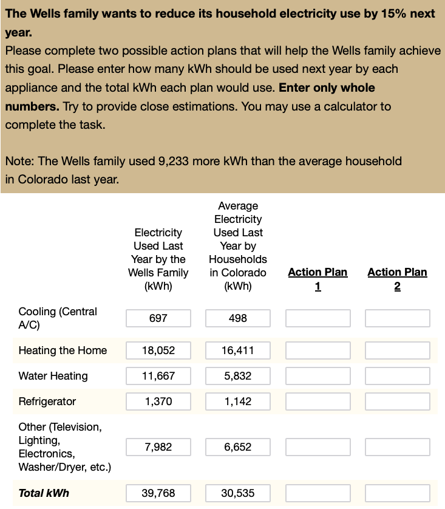

# Introduction

Energy insecurity has emerged as a critical public health concern, especially among low-income households, who frequently face difficult choices between paying energy bills and meeting other essential needs (Bednar & Reames, 2020; Memmott et al., 2021). Such households often experience unsafe coping strategies (e.g., foregoing heating during winter months), which disproportionately affect racial and ethnic minorities and heighten risks of utility disconnection (Memmott et al., 2021). Moreover, residential energy use contributes to climate change, intensifying the urgency for sustainable solutions (Farghali et al., 2023).

Given the relevance of promoting behavior change to reduce energy consumption, several strands of research have aimed to identify factors that affect energy behaviors and interventions that effectively reduce energy consumption. For example, Abrahamse et al. (2007) used a combination of tailored information about energy use and tailored feedback, in addition to setting an energy-saving goal, to promote direct and indirect energy-saving behaviors and high levels of knowledge regarding energy use. Direct energy-saving behaviors were classified as reducing fuel, gas, and electricity consumption, while indirect behaviors referred to producing, distributing, and disposing goods. After a five-month intervention, the authors found that households in the experimental group reduced their direct energy use by 5.1% and had higher levels of knowledge about energy conservation compared to the control group, which used 0.7% more energy since the beginning of the intervention. No difference between groups was found in indirect behaviors.

However, the success of such interventions may hinge on how effectively energy information is communicated, with format and presentation context significantly influencing understanding and action (Canfield et al., 2017; Fischer, 2008). Consequently, a pressing challenge lies in designing communication strategies that effectively convey energy data and motivate practical conservation decisions. We set out to explore if consumers are able to develop plans that would help meet certain energy consumption goals.

### Representation Formats

Receiving feedback about one's energy use is important in identifying potential actions to reduce energy consumption. However, it is crucial to understand how consumers use the information provided with their energy bill and whether they are able to translate an energy-saving goal into an action plan. Canfield et al. (2017) specifically studied this problem by running an experiment in which participants were shown hypothetical electricity bills with information related to a household's historical electricity use, electricity use in relation to their neighbors, and historical electricity use by appliances. Participants were randomly assigned to one of three formats of information representation (i.e., tables, bar graphs, and icon graphs) and were asked questions regarding their energy literacy. Canfield et al. (2017) showed that tables were the easiest format to understand for consumers when evaluating every type of information related to energy use. Across types of information, historical electricity use elicited the highest intentions and preferences for energy savings regardless of format. Additionally, participants with high energy literacy had a better understanding of energy-related information across all types of information representations. By disentangling the effects of content, format, and individual differences in energy literacy on understanding, preferences, and intentions, Canfield et al. (2017) demonstrated that easy-to-implement communication strategies in energy bills can lead to energy-saving behaviors.

Although many individuals express a desire to conserve energy, research consistently shows that abstract goals (e.g., "reduce overall usage by 15%") often fail to translate into effective behavior change unless accompanied by specific, actionable steps (Abrahamse et al., 2005; Nemati & Penn, 2020). For instance, Abrahamse et al. (2005) demonstrated that merely providing general information about energy savings rarely alters consumption patterns unless consumers also receive concrete instructions or tailored feedback.

Similarly, Tonke (2024) rreported that sending households brief but precise text messages outlining how to reduce water use (e.g., limiting irrigation times, adjusting washing machine settings) yielded meaningful decreases in consumption, underscoring the importance of procedural knowledge---namely, knowing how to operationalize a goal rather than simply why it is desirable. In the context of energy conservation, this implies that interventions should not only highlight potential reductions (such as a 15% target) but also guide residents in allocating those reductions across specific appliances or behaviors (Attari et al., 2010). Additionally, meta-analytic findings suggest that people respond more robustly to household-level feedback that situates their usage within a personalized framework, thereby reducing the cognitive burden of determining next steps (Nemati & Penn, 2020).

The way numerical information is presented can significantly affect how individuals process and use that information. Of particular relevance are reference class effects, which occur when numerical statements are presented without a clear or intuitive basis for comparison, making it difficult to infer meaningful quantities (Gigerenzer & Edwards, 2003; Reimer et al., 2015). A substantial body of evidence suggests that presenting data in terms of absolute counts or frequencies, as opposed to probabilities or percentages, can promote more accurate comprehension and facilitate decision making. However, it is important to note that even intuitive formats can pose challenges. For instance, Weber et al. (2018) found that individuals often struggle with reasoning tasks presented in natural frequencies because they inadvertently revert to more complex probabilistic thinking.

The choice of units and the format in which information is presented have also been shown to exert a significant influence on decision-making within the context of energy consumption and planning. For instance, tables are generally more effective than graphs for conveying specific electricity usage data because they facilitate straightforward point reading (Canfield et al., 2017). Furthermore, the framing of energy costs, such as displaying monthly rather than daily or yearly expenses, can significantly affect consumers' choices (Gill et al., 2022). Consequently, the selection of an appropriate information format is crucial for effectively supporting energy-related decisions. Therefore, similar to natural frequencies, kWh provide a direct measure of energy use - a characteristic that could simplify calculations and facilitate comparisons, potentially helping consumers better understand and compare the energy consumption of different appliances or activities. Conversely, prior research has suggested that consumers have a preference for receiving energy feedback in terms of monetary values over scientific units (Karjalainen, 2011; Nemati & Penn, 2020), as well as better long-term appliance selection with information presented in monetary terms (Blasch et al., 2019). However, it remains uncertain how these reported benefits might generalize to the more complex task of household energy planning, where usage patterns are multifaceted and subject to a variety of contextual influences.

### Overview of Current Research

Building on the study of Canfield et al. (2017), we aimed to test xxx.

Despite existing studies on energy-use communication and format effects, limited research has explored how different numerical representations influence consumers' ability to create accurate energy conservation plans. Specifically, there is a gap in understanding how presenting energy information in absolute units versus percentages or monetary terms affects the precision of planning appliance-specific reductions. The current study addresses these critical issues by systematically investigating the impact of varying information formats (kWh, percentage, and USD) on the accuracy of energy-planning decisions. By manipulating the presentation format of energy information, this research aims to elucidate how different representational formats influence planning accuracy. Based on the literature reviewed, we hypothesize that: 1) Presenting energy reduction goals in absolute units (kWh) will lead to greater planning accuracy compared to percentage-based or monetary formats, as absolute units provide a more direct and less ambiguous representation of energy quantities. 2) Higher energy literacy will be associated with more accurate planning, as individuals with greater energy knowledge may be better equipped to process and utilize the provided information, regardless of format. We also examine the potential of several exploratory variables, such as goal difficulty and the rounding of numerical values, to further elucidate the factors that influence planning accuracy.

# Experiment 1

See <a href="#fig-task" class="quarto-xref">Figure 1</a> for an example of a planning trial as it was seen by participants.

## Methods

### Participants

We implemented our task and surveys on Qualtrics, and recruited participants through Amazon Mechanical Turk. In Experiment 1, 235 participants were initially recruited. Data from six participants were excluded due to deviant performance on the task, resulting in a final sample of 229 participants (146 males, 92 females, 1 not specified). The average age of participants was 34.3 years (SD = 10.2). Most participants (76%) reported using a calculator to complete the task.

### Materials and Design

The study employed a mixed design with reference class (kWh, percentage, USD) as a between-subjects factor and state/family scenario as a within-subjects factor. Each participant completed energy reduction planning tasks for two different states (i.e., family scenarios), with state order counterbalanced across participants. The family scenarios featured four households in different climate regions: Texas (Smith family) and California (Adams family) representing warm climates, and Colorado (Wells family) and Massachusetts (Davis family) representing cold climates. Average utility use data for each state was obtained from the CITE SOURCE FOR STATE AVGS? Participants also completed an 8-item questionnaire assessing their knowledge of energy consumption and conversion (DeWaters & Powers, 2011), and a question indicating whether they used a calculator for the task.

### Procedure

Participants were provided with energy usage data for two hypothetical families and tasked with creating action plans to meet specified energy reduction goals. Participants were informed at the start of the study that they would be presented with tables of detailed energy usage data for each family, and that they would have to create 2 action plans for each of the families. Each action plan goal was implemented by allocating usage across five appliance categories: heating, cooling, water heating, refrigerator, and other appliances (e.g., TV, lighting, washer/dryer). For each family scenario, participants were shown a table containing the family's utility usage from the prior year, alongside the state averages for each appliance category (see <a href="#fig-task" class="quarto-xref">Figure 1</a>). For each scenario, participants were asked to create two possible action plans to achieve the target reduction in total household energy usage . Depending on their reference class condition, the target reduction amount was presented either in kilowatt-hours (kWh), as a percentage of total household usage, or in U.S. dollars. In all conditions, the target reduction was equivalent to a 15% reduction in total household kWh. For example, ... .

## Measures

## Results

All preprocessing and analyses were carried out in R (Team, 2020) and the Tidyverse package (Wickham et al., 2019). Mixed Bayesian regressions were fit using the brms package (Bürkner, 2017), with participants and family scenario (states) set as random effects.

| Reference Class | Avg. % Change | % meeting goal (exact) | % meeting goal (close match) | Abs. Deviation | Log Abs. Deviation |
|:---------|:--------|:-------------|:-----------------|:---------|:-----------|
| kWh | 0.22 | 0.38 | 0.54 | 0.03 | -3.7 |
| Percentage | 0.21 | 0.22 | 0.40 | 0.06 | -3.1 |
| USD | 0.23 | 0.10 | 0.22 | 0.10 | -2.4 |

Table 1: Study 1: Summary of planning accuracy by reference class

<a href="#tbl-s1-agg" class="quarto-xref">Table 1</a> shows the average x,y,z, separately for the conditions of ... . As can be seen in Table 1, participants in the kWh condition met the target goal 38% of the time, compared to 22% for the Percentage condition and 10% for the USD condition. Moreover, the kWh reference class exhibited smaller deviations from the target reduction, suggesting that participants performed more accurately when the goal was framed in kWh rather than when the goal was framed in percentages or USD.

As shown in <a href="#tbl-s1-agg" class="quarto-xref">Table 1</a>, participants in the kWh condition exactly met the target reduction goal 38% of the time, significantly outperforming those in the Percentage (22%) and USD (10%) conditions. Furthermore, the kWh reference class exhibited notably smaller mean absolute deviations (0.03) compared to Percentage (0.06) and USD (0.10), suggesting that presenting the reduction goal in absolute units facilitated more precise allocations.

We next categorized responses into three accuracy levels (exact match \[0% error\], minor deviations \[0.01--5%\], and large deviations \[\>5%\]) for our primary statistical modeling. Using Bayesian ordinal regression, we modeled the ordered accuracy outcome as a function of the reference class condition, while controlling for random variation across participants and family scenarios:

$$
\text{Accuracy Level} \sim \text{Reference Class} + \text{Calculator} + (1|\text{id}) + (1|\text{Family Scenario})
$$

This approach allowed us to estimate thresholds (intercepts) and regression coefficients that capture how different reference classes affect the likelihood of achieving higher accuracy categories. For each comparison, we provide posterior odds ratios (OR) and their 95% CIs. This approach allows the estimation of threshold parameters and regression coefficients that characterize how changes in predictor variables (such as the reference class: kWh, percentage, or USD) relate to probabilities of being in each accuracy category. Specifically, we used a cumulative logit link function to model the ordered accuracy outcome, and we specified weakly informative priors for the regression coefficients (normal distributions with mean 0 and standard deviation of 1) and for the cutpoints (normal distributions with a mean of zero and a standard deviation of 4.0). The approach can be used to estimate threshold parameters and regression coefficients that characterize how changes in predictor variables (such as the reference class: kWh, percentage, or USD) relate to probabilities of being in each accuracy category.

| Parameter          | Estimate | CI_Lower | CI_Upper | pd   |
|:-------------------|:---------|:---------|:---------|:-----|
| Intercept\[1\]     | -4.21    | -5.90    | -2.58    | 1.00 |
| Intercept\[2\]     | -0.89    | -2.49    | 0.71     | 0.87 |
| refClassPercentage | 1.44     | 0.07     | 2.88     | 0.98 |
| refClassUSD        | 3.13     | 1.81     | 4.50     | 1.00 |
| calcUsedCalculator | -3.30    | -4.80    | -1.92    | 1.00 |

Table 2: **Experiment 1**: Ordinal Regression Results of a Test of Differences between conditions in Accuracy Levels

| Comparison        | odds_ratio | ci_lower | ci_upper |
|:------------------|:-----------|:---------|:---------|
| Percentage vs kWh | 4.2        | 1.1      | 18       |
| USD vs kWh        | 22.9       | 6.1      | 90       |

Table 3: **Experiment 1**: Odds ratios for group comparisons

As shown in <a href="#tbl-s1-reg" class="quarto-xref">Table 2</a>, the reference class coefficients are positive for both the Percentage (Estimate = 1.44, 95% CI: 0.07 to 2.88, pd = 0.98) and USD (Estimate = 3.13, 95% CI: 1.81 to 4.50, pd = 1.00) conditions, relative to the kWh baseline. This indicates that, compared to the kWh condition, participants in both the Percentage and USD conditions were more likely to produce plans that fell into higher error categories. Moreover, the odds ratios (see Table 3) suggest that the USD condition led to a notably higher likelihood of large errors compared to the kWh baseline (OR = 22.9), while the Percentage condition also demonstrated increased odds (OR = 4.2) but was somewhat less detrimental to accuracy than USD. These results align with our descriptive findings and further clarify that framing the target reductions in absolute kWh units may facilitate significantly more accurate planning. Posterior predictive checks showed that the ordinal model provided a reasonable fit to the observed data (see **?@fig-s1-ppd**).

To further investigate individual factors that may influence planning accuracy, we examined the relationship between participants' energy literacy scores and their performance on the task. Energy literacy was assessed using an 8-item questionnaire adapted from (DeWaters & Powers, 2011), which covers topics such as energy units, appliance energy consumption, and sources of electricity. A Bayesian linear regression model was fit with log-transformed absolute error as the outcome variable and energy literacy score as the predictor, controlling for random effects of participant and state: log_abs_error ~ els + (1\|id) + (1\|state). Results indicated a significant negative relationship between energy literacy and log absolute error (Estimate = -2.35, 95% CI: -2.88 to -1.81), suggesting that participants with higher energy literacy scores tended to have smaller deviations from the target reduction goal, and thus more accurate plans overall (**?@fig-s1-els**).

## Experiment 1: Discussion

Experiment 1 examined how different numerical representations of energy reduction goals affected participants' planning accuracy. In line with our hypothesis that absolute units would yield better accuracy, the kWh condition supported significantly more precise energy reduction plans than did either the Percentage or USD conditions. Although the Percentage format was detrimental to accuracy relative to kWh, it was the USD condition that consistently produced the poorest outcomes, suggesting that monetary terms, while intuitive in everyday contexts, may not serve as effective reference classes for planning appliance-specific reductions in energy use.

Experiment 2 will extend these findings by examining whether additional variables, such as the difficulty of the reduction goal or the rounding of numerical values, further interact with reference class conditions, thereby providing a more comprehensive understanding of how to optimize energy information presentation for improved planning accuracy.

# Experiment 2

## Methods

In Experiment 2, We recruited 206 participants from Amazon Mechanical Turk, but data from 10 participants were corrupted due to experimenter error, and six excluded due to deviant behavior, leaving a final sample of 190 participants (102 male; 88 female. Average age = 35.5, SD=9.5)

Experiment 2 employed a mixed experimental design with reference class (USD, Percentage, kWh) as a between-subjects factor, and two within-subjects factors: task goal (10% vs. 15% reduction) and the presentation of last year's usage data (exact vs. rounded numbers). The order of presentation of the goal, rounding, and state conditions was counterbalanced across participants. As in Experiment 1, each participant completed the energy reduction planning task for two different family-state scenarios. In the "rounded" condition, both the family's previous year usage and the state averages were rounded to the nearest whole number.

## Results

| Reference Class | % meeting goal (exact) | % meeting goal (close match) | Abs. Deviation | Log Abs. Deviation |
|:-----------|:---------------|:-------------------|:----------|:-------------|
| kWh | 0.44 | 0.52 | 0.02 | -3.9 |
| Percentage | 0.28 | 0.42 | 0.06 | -3.2 |
| USD | 0.20 | 0.29 | 0.10 | -2.4 |

Table 4: Experiment 2: Summary of planning accuracy by reference class

| Parameter          | Estimate | CI_Lower | CI_Upper | pd   |
|:-------------------|:---------|:---------|:---------|:-----|
| Intercept\[1\]     | -1.45    | -2.85    | -0.07    | 0.98 |
| Intercept\[2\]     | 1.26     | -0.09    | 2.65     | 0.97 |
| refClassPercentage | 1.02     | -0.63    | 2.71     | 0.89 |
| refClassUSD        | 2.27     | 0.53     | 3.98     | 0.99 |
| calcNoCalculator   | 4.10     | 2.20     | 6.06     | 1.00 |
| pct_goal15%        | -0.39    | -0.81    | 0.04     | 0.96 |
| roundedRounded     | -0.53    | -0.96    | -0.11    | 0.99 |

Table 5: **Experiment 2.** Parameter estimates from the ordinal regression model

| comparison           | odds_ratio | ci_lower | ci_upper |
|:---------------------|:-----------|:---------|:---------|
| Percentage vs kWh    | 2.78       | 0.53     | 15.0     |
| USD vs kWh           | 9.68       | 1.69     | 53.4     |
| calcNoCalculator     | 60.37      | 9.02     | 426.4    |
| 15% Goal vs 10% Goal | 0.68       | 0.44     | 1.0      |
| Rounded vs Not       | 0.59       | 0.38     | 0.9      |

Table 6: **Experiment 2.** Odds ratios for group comparisons

As in Experiment 1, accuracy was categorized into three ordinal levels: "Exact match" (0% error), "0.01-5% error," and "Over 5% error". The analyses for Experiment 2 employed a Bayesian ordinal regression model to examine the probability of falling into one of three accuracy categories (exact match, minor deviations, or substantial deviations) as a function of the reference class condition (kWh, Percentage, USD), while including pct_goal (10% vs. 15%), rounded (exact vs. rounded usage data), and calculator usage as additional predictors. Random intercepts were specified for both participant and state,

The ordinal regression analysis revealed that the USD reference class significantly increased the odds of higher error categories compared to the kWh reference class (OR = 9.68, 95% CI: \[1.69, 53.4\]). Participants in the USD condition were therefore substantially more likely to deviate from the target energy reduction goal compared to those in the kWh condition. In contrast, the Percentage condition's odds ratio relative to kWh was more uncertain (OR = 2.78, 95% CI: 0.53, 15.0), indicating that although there may be a trend toward reduced accuracy in the Percentage condition, the evidence was not definitive.

We also found that using rounded numbers modestly improved accuracy (b = -0.53, 95% CI: \[-0.96, -0.11\]), with participants having 0.59 times the odds of falling into a worse accuracy category when working with rounded values. The more challenging 15% reduction goal was associated with slightly better performance compared to the 10% goal (b = -0.39, 95% CI: \[-0.81, 0.04\]), though this effect was relatively small. Consistent with Experiment 1, the use of a calculator had a large and significant effect on accuracy. The coefficient for calcNoCalculator was 4.10 (95% CI: 2.20, 6.06), and the corresponding odds ratio was 60.37 (95% CI: 9.02, 426.4), indicating that participants who did not use a calculator were substantially more likely to fall into higher error categories.

**?@fig-s2-ame** shows the marginal effects of refClass on each level of accuracy_level. These results reveal that switching from kWh to Percentage decreased the probability of an "Exact match" by an average of 7.0 percentage points (95% CI: -19.2, 4.2) and increased the probability of "Over 5% error" by 6.9 percentage points (95% CI: -4.5, 18.6). Similarly, switching from kWh to USD decreased the probability of an "Exact match" by 15 percentage points (95% CI: -26.7, -3.3) and increased the probability of "Over 5% error" by 16.5 percentage points (95% CI: 3.7, 29.3).

We once again examined the effect of energy literacy on planning accuracy. A Bayesian linear regression model was fit with log-transformed absolute error as the outcome variable and energy literacy score as the predictor, controlling for random effects of participant and state: log_abs_error ~ els + (1\|id) + (1\|state). This revealed a significant negative relationship between energy literacy and log absolute error (Estimate = -3.21, 95% CI: -3.89 to -2.52), indicating that participants with higher energy literacy scores tended to have smaller deviations from the target reduction goal, and thus more accurate plans overall (**?@fig-s2-els**).

## Experiment 2: Discussion

Experiment 2 aimed to build upon the findings of Experiment 1 by replicating the core manipulation of reference class. Additionally, it incorporated variables that might influence planning accuracy. These included goal difficulty and the way that the prior year's usage was presented (rounded or exact). The results largely converged with those of Experiment 1, providing further converging evidence that presenting energy reduction goals in absolute units (kWh) facilitates more accurate planning compared to percentage-based or monetary formats.

Taken together, the results of Experiment 2 provide further support for the hypothesis that presenting energy reduction goals in absolute units (kWh) leads to more accurate planning compared to percentage-based or monetary formats.

The finding that the more challenging 15% reduction goal was associated with a slight improvement in accuracy is counterintuitive. It may be that participants put more effort into the task under this condition, or perhaps this is an artifact of the way that the task was presented. However, this effect was relatively small and thus should be explored in future research to better understand its underlying mechanisms. Furthermore, the magnitude of the effect size of this manipulation should be examined to better understand the practical implications of goal difficulty for energy conservation.

The large and significant effect of calculator use, consistent across both experiments, underscores the crucial role of tools that individuals are likely to employ in real-world settings. Finally, the consistent relationship between energy literacy and accuracy, observed across both experiments, highlights the potential value of educational interventions aimed at improving consumers' understanding of energy concepts.

# General Discussion

This study examined how different numerical representations of energy reduction goals influence consumers' ability to create accurate energy conservation plans. Across two experiments, participants in the kWh conditions exhibited the smallest errors in allocating energy cuts across appliances, a result that consistently held even as scenario details varied. These results extend prior observations on the impact of numerical format on comprehension and decision-making (Gigerenzer & Edwards, 2003; Reimer et al., 2015). but they move beyond simpler estimation tasks to show how these benefits persist in a multi-step planning context. Notably, individuals with higher energy literacy performed better overall, a finding in line with previous work emphasizing the importance of domain knowledge for effective resource conservation (Attari et al., 2010; Canfield et al., 2017)

While prior research has suggested that consumers sometimes prefer monetary formats(Karjalainen, 2011; Nemati & Penn, 2020) or that monetary framing can improve appliance choices (Blasch et al., 2019), our findings tentatively indicate that absolute energy units can facilitate the finer-grained calculations needed to plan specific usage cuts. This may be because kWh provide a more direct and less ambiguous representation of energy quantities, facilitating the necessary calculations for accurate planning. Moreover, although percentage-based targets might seem appealing from a goal-setting perspective, the additional step of converting percentages to tangible appliance reductions likely increases the chances for error (Fisher & Mormann, 2022). Research on consumer heuristics in energy judgments (Van Den Broek & Walker, 2019) suggests that individuals gravitate toward concrete cues, and the directness of absolute units may align well with these heuristics. Similarly, the concept of "default units" (Herberz et al., 2020) further highlights how presenting energy data in a straightforward, standardized format can guide better consumer decisions. Nevertheless, it is unclear whether the observed benefits of absolute units (i.e., kWh) are genuinely attributable to their absolute nature, or if other inherent characteristics of these units might be driving the effects.

A few constraints should be considered. First, each participant only completed a limited set of action plans (four total), which may not capture the variability of real-world decision processes. Second, although we recorded whether participants used calculators, we could not control how thoroughly they engaged in mathematical computations, nor could we track other external resources they might have consulted. Future studies could examine more extensive planning tasks, perhaps over multiple sessions, to see how stable these effects remain over time and repeated feedback cycles (Fischer, 2008). In addition, investigating whether certain household types or income levels respond differently to monetary versus absolute energy frames could yield further practical guidance for targeting energy-reduction interventions. Finally, incorporating more explicit or automated prompts for appliance-specific tips (Tonke, 2024) could clarify how best to translate high-level goals into tangible actions in diverse contexts. By building on these avenues, subsequent work can refine how energy information is formatted and delivered, ultimately enhancing both the precision and feasibility of conservation planning.

------------------------------------------------------------------------

Supplementary information and materials can be found online at [this website](https://tegorman13.github.io/Representation_Study/manuscript/output/appendix.html)



# References

Abrahamse, W., Steg, L., Vlek, C., & Rothengatter, T. (2005). A review of intervention studies aimed at household energy conservation. *Journal of Environmental Psychology*, *25*(3), 273--291. <https://doi.org/10.1016/j.jenvp.2005.08.002>

Abrahamse, W., Steg, L., Vlek, C., & Rothengatter, T. (2007). The effect of tailored information, goal setting, and tailored feedback on household energy use, energy-related behaviors, and behavioral antecedents. *Journal of Environmental Psychology*, *27*(4), 265--276. <https://doi.org/10.1016/j.jenvp.2007.08.002>

Attari, S. Z., DeKay, M. L., Davidson, C. I., & Bruine De Bruin, W. (2010). Public perceptions of energy consumption and savings. *Proceedings of the National Academy of Sciences*, *107*(37), 16054--16059. <https://doi.org/10.1073/pnas.1001509107>

Bednar, D. J., & Reames, T. G. (2020). Recognition of and response to energy poverty in the United States. *Nature Energy*, *5*(6), 432--439. <https://doi.org/10.1038/s41560-020-0582-0>

Blasch, J., Filippini, M., & Kumar, N. (2019). Boundedly rational consumers, energy and investment literacy, and the display of information on household appliances. *Resource and Energy Economics*, *56*, 39--58. <https://doi.org/10.1016/j.reseneeco.2017.06.001>

Bürkner, P.-C. (2017). Brms: An R Package for Bayesian Multilevel Models Using Stan. *Journal of Statistical Software*, *80*, 1--28. <https://doi.org/10.18637/jss.v080.i01>

Canfield, C., Bruine De Bruin, W., & Wong-Parodi, G. (2017). Perceptions of electricity-use communications: Effects of information, format, and individual differences. *Journal of Risk Research*, *20*(9), 1132--1153. <https://doi.org/10.1080/13669877.2015.1121909>

DeWaters, J. E., & Powers, S. E. (2011). Energy literacy of secondary students in New York State (USA): A measure of knowledge, affect, and behavior. *Energy Policy*, *39*(3), 1699--1710. <https://doi.org/10.1016/j.enpol.2010.12.049>

Farghali, M., Osman, A. I., Mohamed, I. M. A., Chen, Z., Chen, L., Ihara, I., Yap, P.-S., & Rooney, D. W. (2023). Strategies to save energy in the context of the energy crisis: A review. *Environmental Chemistry Letters*, *21*(4), 2003--2039. <https://doi.org/10.1007/s10311-023-01591-5>

Fischer, C. (2008). Feedback on household electricity consumption: A tool for saving energy? *Energy Efficiency*, *1*(1), 79--104. <https://doi.org/10.1007/s12053-008-9009-7>

Fisher, M., & Mormann, M. (2022). The Off by 100% Bias: The Effects of Percentage Changes Greater than 100% on Magnitude Judgments and Consumer Choice. *Journal of Consumer Research*, *49*(4), 561--573. <https://doi.org/10.1093/jcr/ucac006>

Gigerenzer, G., & Edwards, A. (2003). Simple tools for understanding risks: From innumeracy to insight. *BMJ*, *327*(7417), 741--744. <https://doi.org/10.1136/bmj.327.7417.741>

Gill, C. A., Atlas, S. A., Hardisty, D. J., & Scott, S. P. (2022). Consumer matching costs to context: Status quo bias, temporal framing, and household energy decisions. *Journal of Consumer Behaviour*, *21*(5), 1018--1027. <https://doi.org/10.1002/cb.2051>

Herberz, M., Brosch, T., & Hahnel, U. J. J. (2020). Kilo what? Default units increase value sensitivity in joint evaluations of energy efficiency. *Judgment and Decision Making*, *15*(6), 972--988. <https://doi.org/10.1017/S1930297500008172>

Karjalainen, S. (2011). Consumer preferences for feedback on household electricity consumption. *Energy and Buildings*, *43*(2-3), 458--467. <https://doi.org/10.1016/j.enbuild.2010.10.010>

Memmott, T., Carley, S., Graff, M., & Konisky, D. M. (2021). Sociodemographic disparities in energy insecurity among low-income households before and during the COVID-19 pandemic. *Nature Energy*, *6*(2), 186--193. <https://doi.org/10.1038/s41560-020-00763-9>

Nemati, M., & Penn, J. (2020). The impact of information-based interventions on conservation behavior: A meta-analysis. *Resource and Energy Economics*, *62*, 101201. <https://doi.org/10.1016/j.reseneeco.2020.101201>

Reimer, T., Jones, C., & Skubisz, C. (2015). Numeric Communication of Risk. In *The SAGE handbook of risk communication* (pp. 167--179).

Team, R. C. (2020). *R: A Language and Environment for Statistical Computing*. R: A Language and Environment for Statistical Computing.

Tonke, S. (2024). Providing procedural knowledge: A field experiment to encourage resource conservation in Namibia. *Journal of Development Economics*, *166*, 103202. <https://doi.org/10.1016/j.jdeveco.2023.103202>

Van Den Broek, K. L., & Walker, I. (2019). Heuristics in energy judgement tasks. *Journal of Environmental Psychology*, *62*, 95--104. <https://doi.org/10.1016/j.jenvp.2019.02.008>

Weber, P., Binder, K., & Krauss, S. (2018). Why Can Only 24% Solve Bayesian Reasoning Problems in Natural Frequencies: Frequency Phobia in Spite of Probability Blindness. *Frontiers in Psychology*, *9*, 1833. <https://doi.org/10.3389/fpsyg.2018.01833>

Wickham, H., Averick, M., Bryan, J., Chang, W., McGowan, L. D., François, R., Grolemund, G., Hayes, A., Henry, L., Hester, J., Kuhn, M., Pedersen, T. L., Miller, E., Bache, S. M., Müller, K., Ooms, J., Robinson, D., Seidel, D. P., Spinu, V., ... Yutani, H. (2019). Welcome to the Tidyverse. *Journal of Open Source Software*, *4*(43), 1686. <https://doi.org/10.21105/joss.01686>
